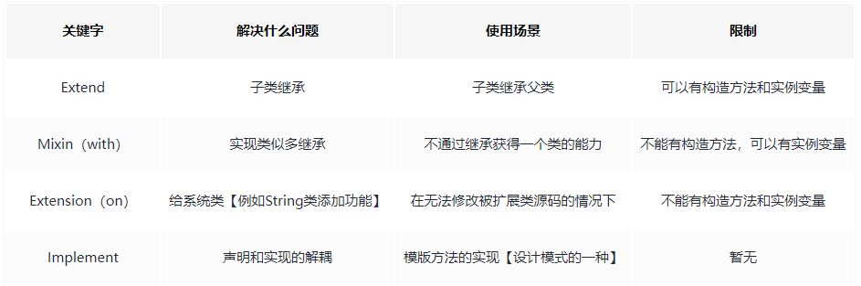

# Dart

### 什么是Dart语言？

Dart是一门面向对象（允许单继承）、垃圾回收的编程语言，它由google公司维护。

### flutter为什么推荐使用Dart语言？

1. Flutter将Dart作为首选语言的原因：
   + Dart是AOT（ahead of time）运行前编译，使用AOT语言的优点就是使Flutter具有更好的性能。
   + Dart也可以通过JIR（just in time）即时编译，典型应用就是Flutter的热重载。
   + Dart也允许FLutter使用JSX或者XML之类的作为界面构建的声明语言，这使得程序更易阅读和理解。


### Dart中dynamic、var、Object区别

1. var定义的类型是不可变的，而dynamic和Object定义的类型是可变的。
2. dynamic和Object最大的区别就是：dynamic编译期间不会进行类型检测而Object会。


### Dart中const和final区别？

1. 相同点：const和final都表示常量，意味第一次赋值之后就不能被修改。
2. 不同点：
   + const修饰变量只能在编译期赋值、final 用来修饰变量可以在运行时赋值。
   + const不可以修饰实例变量、final可修饰实例变量。
   + const修饰的List集合任意索引不可修改，final修饰的可以修改。
   + 当const修饰类的构造函数时，它要求该类的所有成员都必须是final的。


### Dart箭头函数以及使用场景？

1. Dart箭头函数主要是用于简化代码写法（语法糖），提高开发效率以及提高代码简洁性。
2. Dart箭头函数使用场景
   + 当方法只有一个表达式作为返回值的时候。
   + 当代码只有单行的时候。
   + `=>` 和`;` 之间只能关联一个表达式，不能出现语句。

### Dart中如何区分必填参数和可选参数？

1. 必填参数：Dart需要通过必填参数来完成函数或者方法的定义。

   ```dart
   void foo(num n1, num n2) {
       print(n1 + n2);
   }
   ```

   

2. 可选参数：可选参数必须放在必填参数之后。

   

3. Dart中可选参数的声明方式

   + 通过`[]` 来定义，也可以赋默认值。

     ```dart
     void foo(num n1, [int? a1， int? a2]) {}
     void foo1(num n1, [int? a1, int? a2 = 10]) {}
     ```

   + 通过`{}` 来定义，也可以赋默认值。

     ```dart
     void foo3(num n1, {int? a1, int? a2}) {}
     void foo4(num n1, {int? a1, int? a2 = 10}) {}
     ```

     

### 位置可选参数和名称可选参数区别？

1. 名称可选参数和位置可选参数都属于可选参数。

2. 位置可选参数是通过 `{}` 来定义。

   + 调用`foo` 时：` foo(10, 20, 30);`，需要注意：如果需要给 `a2` 传值就必须保证`a2`卡面参数都有值（默认值）。
   + 调用`foo1` 时：`foo1(10);`

3. 名称可选参数是通过 `[]` 来定义。

   + 调用`foo2` 时：`foo2(10, a1: 20);`
   + 调用`foo3` 时：`foo3(10, a1: 20, a2: 30);`

   


### Dart中..和...的用法？

1. `..`：称为级联符号象，可以实现对一个对象的连续调用，省去变量创建，实现链式调用。

2. `...`：用来拼接集合，如List，Map等。

   

### 如何理解 ??、?.、??=三者的异同？

1. `??`是一个空赋值操作符，当表达式左侧不为空的时候就返回左侧表达式值否则返回右侧表达式值。

2. `?.`是一个条件属性访问符，用于访问可能为空的对象或者属性，`?.`也可用于单个表达式中。

   ```dart
   // 如果school为空，则下述代码返回null且永远不会再访问name属性
   final schoolName =  user?.school?.name
   ```

3. `??=`运算符，该运算符仅在变量值为空的时候才赋值。

   ```dart
   int a; // 定义了变量，并未赋值，所以这里变量值为 null
   a ??= 3;
   print(a); // <-- 打印 3
   
   a ??= 5;
   print(a); // <-- 依然打印 3
   ```

   

### 如何理解 ？和 ！的异同？

1. `?` 操作符跟在类型后面，表示当前变量可为null。

   ```dart
   int a = null; //这句代码在有空安全时，编译会提示错误
   
   // 如果想给一个变量赋值null要如何处理呢？只需要在类型后面添加操作符?即可
   int? a = null;
   ```

   

2. `！`需要开发者保证变量不为`null`,否则会抛出异常。

   ```dart
   Future<int> patchView(AppView appview){
       // 这里需要保证appview不能为空
       ViewHander viewHnadler = appview!.getHandler();
       // ...
   }
   ```

   

### non-nullable by default 是什么意思？

1. 意味着dart中声明的任何变量不能为空。
2. 不可以在没赋值之前访问该变量，变量也不能被赋值为 `null`。


### Dart作用域

1. Dart 没有 「public」「private」等关键字，默认就是公开的，私有变量使用 下划线 _开头。“_”的限制范围并不是类访问级别的，而是库访问级别。

### Dart中._()是什么意思？

1. Dart没有想 Java语言那样的Private访问修饰语，在Dart中以下划线开头的变量或者函数则表示是私有的。需要注意：Dart中公有和私有的界定是以文件界定的，并不是通过类界定的。

   + user.dart

     ```dart
     class User {
       // 共有变量可以直接操作且访问
       String name = "jack";
     
       // 私有变量不能直接访问更不能操作
       int _age = 10;
     
       // 给外界提供 get方法（否则将不能访问到age属性）
       int getAge() {
         return _age;
       }
     }
     ```

     

   + home.dart

     ```dart
     import 'user.dart';
     
     void main() {
         final User user = User();
     
         print(user.name); // jack
         user.name = "lucy";
         print(user.name); // lucy
     
         // print(user.age); // 尝试访问私有属性编译时就不能通过
         print(user.getAge());// 10
     }
     ```

     

   

2. `Class._();` 的函数可能是一个构造函数，但是`Class._();` 不是必须的，除非你想要在构造函数中执行某些操作。

   ```dart
   void main(List<String> args) async {
       final People people1 = People._();
   }
   
   class People {
       People._() {
           print("People构造函数被执行...");
       }
   }
   ```

   

### 如何填充Dart LIst？

1. 可以使用传统的for循环。

   ```dart
   final List<int> ints = [];
   
   for (var i = 0; i < 10; i++) {
       ints.add(i);
   }
   ```

   

2. 可以使用 `List.filled` 更简便的方法。

   ```dart
   final List<int> ints = List.filled(10, 1);
   ```

### 如何取两个List的交差并集？

1. 取交集、差集、并集

   ```dart
   List<int> arr1 = [1, 2, 3, 4, 5];
   List<int> arr2 = [5, 6, 7, 8, 9];
   
   // 取交集 [5]
   List<int> jiaoji = arr1.where((element) => arr2.contains(element)).toList();
   
   // 取差集(arr1相对于arr2没有的) [1, 2, 3, 4]
   List<int> chaji = arr1.where((element) => !arr2.contains(element)).toList();
   
   // 取并集  [1, 2, 3, 4, 5, 6, 7, 8, 9]
   List<int> bingji = chaji;
   bingji.addAll(arr2);
   ```


### Dart如何将List转换成Map？

1. 通过 `Map<K,V>.fromIterable` 方法

   ```dart
   final numbers = <int>[1, 2, 3];
   final map = Map<String, int>.fromIterable(numbers,  key: (item) => item.toString(), value: (item) => item * item);
   print(map); // {1: 1, 2: 4, 3: 9}
   
   ```

2. `*collection-for `方法(从 Dart 2.3 开始支持此方法)

   ```dart
   final numbers = <int>[1, 2, 3];  
   final result = {for (var i in numbers) i: i * 10};
   print(result); // {1: 10, 2: 20, 3: 30}
   ```

   

### Dart中如何比较两个日期？

1. 先将时间想办法转成 `DateTime` 类型，在调用 `isAtSameMomentAs()` 方法比较即可。

   ```
   String t1 = "2028-01-03 12:00:00";
   String t2 = "2028-01-03 12:00:00";
   String t3 = '2020-02-03T08:30:00.000Z';
   
   DateTime d1 = DateTime.parse(t1);
   DateTime d2 = DateTime.parse(t2);
   DateTime d3 = DateTime.parse(t3);
   
   // true
   print(d2.isAtSameMomentAs(d1));
   
   // false
   print(d2.isAtSameMomentAs(d3));
   ```


### Dart中extends, mixin, implements、extension区别？

1. extends（继承）

   + Dart中继承是单继承。
   + 构造函数或者析构函数不能继承。
   + 子类重写父类方法要在方法前加@override。
   + 子类调用父类的方法用super。
   + Dart中子类可以访问父类的所有变量和方法。

2. mixin（混入）

   + 通过混入mixins的方式,可以把一个类的方法或者属性混入到另外一个类中,供其使用。
   + 扩展了单继承的缺点。

3. implements（实现）

   + 实现某个接口,接口中的所有方法和成员变量必须都进行实现。

4. extension（扩展）

   + 在Dart 2.7 版本中，Dart新加入了一个重要的语法功能，叫做extension。Extension的主要功能给已经存在的类添加新的member function，往里面增加新的函数。通过extension, 我们可以向诸如 Iterable, String 这样的常用类里面增加一些方便的函数。

5. 总结

    


### 如何在Dart中将异步函数声明为变量？

1. 通过 `typedef` 定义函数类型

   ```dart
   typedef Func1 = void Function(int n1, int n2);
   typedef Func2 = String Function(String message);
   typedef Func3 = Future<void> Function(bool isSuccess, String message);
   
   
   class FuncFactory {
       testFunc(Func1 func1, Func2 func2, Func3 func3) {
           // 调用
           func1(10, 20);
           func2("调用func2函数...");
           func3(true, "操作成功");
       }
   }
   
   
   void main(List<String> args) {
       FuncFactory factory =  FuncFactory();
       factory.testFunc((n1, n2) { }, (message) => "", (isSuccess, message) => Future.value());
   }
   ```

   

2. 定义普通函数为变量

   ```
   var callback = (int n1, int n2) => n1 + n2;
   int value = callback(10,20);
   ```

   

3. 在普通函数基础之上，dart 提供了一个 Future 语法糖。只要变更该函数返回类型为一个 Future 就可以了。

   ```dart
   class Bar {
       // 声明函数类型，注意解决：Non-nullable instance field 'loadData' must be initialized.
       late Future<void> Function() loadDataVar;
       Future<void> asyncFunc() async => print('Do async stuff...');
   
       Bar() {
           loadDataVar = asyncFunc;
           loadDataVar().then((value) => print('done....'));
       }
   }
   ```

   

### 如何判定一个异步void方法执行完毕？

1. 修改返回值类型为：`Future<void>`

   ```dart
   Future<void> openData() async {
     // 处理业务逻辑...
   }
   ```

2. 此时你就可以通过 `await` 或者 `then` 来观察方法是否执行完毕


### Future在Dart中的应用？

1. Dart 中的异步操作主要使用 `Future` 与 `async/await`，可以把 `Future` 理解为是一个自带 callback 效果的类，callback 主要告诉调用者异步函数的执行结果是成功还是失败。

2. Future 实例有 3 个常用方法：

   + then((value){...}): 正常运行时执行。
   + catchError((err){...}): 出现错误时执行，如果异常不在预期之内，将会抛出类型为 `Future<void>` 的异常。
   + whenComplete((){...}): 不管成功与否都会执行。

3. Future 同时还支持链式调用，Future 可以在 then()方法中返回另一个 Future 实例, 从而达到链式调用的效果。

4. Future 除了默认构造器外, 还提供了几个常用的命名构造器：

   + Future.value(): 创建一个返回具体数据的 Future 实例。
   + Future.error(): 创建一个返回错误的 Future 实例。
   + Future.delayed(): 创建一个延时执行的 Future 实例。

5. Future是异步操作，并且存在两种状态： `Uncompleted` 和 `Completed `。

6. 简单看一个Future示例

   ```dart
   void main(List<String> args) async {
       loadData()
           .then((value) => print("请求成功： = ${value}"), onError: (error)=> print("请求失败： = ${error}"))
           .catchError((error) => print("请求失败： = ${error}"));
   
       // 使用await这种方式时，则需要手动添加try catch。
       try {
           final result = await loadData();
       } catch (error) {
           print("请求失败： = ${error}");
       }
   }
   
   Future<double> loadData() async {
       await Future.delayed(new Duration(seconds: 2));
       // 模拟异常
       final double random = Random().nextDouble();
       if (random > 0.1) {
           throw Exception("随机值[${double}]大于0.1");
       }
       return random;
   }
   
   ```

   

### await和async在Dart中的应用？

1. `await`和`async`是Dart提供的可以使用`同步的代码格式`实现`异步函数的调用的过程`的语法糖。

2. `await` 必须在 `async` 函数中使用，`async` 函数返回的结果必须是一个 `Future`。

3. async（Asynchronous）允许同时进行多项异步工作。

   + 发送网络请求获取数据。
   + 操作数据库。
   + IO操作（操作文件）。

4. 需要注意：

   + 异步功能是基于 `async`的，所以 `async` 关键字不能够省略。

   + `await` 关键字仅在 `async` 声明的函数中起作用。
   + 在第一个 `async` 和 `await` 之间的代码是立即执行的。

5. 看一个案例：

   ```dart
   void main(List<String> args) async {
       final count = await loadData();
       print(count);
   
       // 也可以通过then获取结果
       // loadData().then((value) => print(value));
   }
   
   Future<num> loadData() async {
       int doneCount = 0;
       print("开始执行网络请求任务...");
       await Future.delayed(new Duration(seconds: 2));
       doneCount++;
   
       print("开始执行操作数据库任务...");
       await Future.delayed(new Duration(seconds: 2));
       doneCount++;
   
       print("开始执行IO操作任务...");
       await Future.delayed(new Duration(seconds: 3));
       doneCount++;
   
       print("结束执行任务...");
       return doneCount;
   }
   
   ```


### async和 async*的区别？

1. `async` 返回`Future`，而`async*`返回`Stream`。
2. `async` 关键字可用于执行一些耗时时间较长的方法，它将返回结果以 `Future` 的形式返回 。
3. 如果希望返回多个值，那么可以将`async`关键字替换成`async*`，它将返回结果以 `Stream` 的形式返回 。
4. `async*` 使用返回 `Stream` 并提供了一些可以以 `yield` 关键字返回值的语法糖。


### whenCompleted和then区别？

1. whenCompleted：Future将以错误完成或未完成时触发的一个函数，可以理解成 `finally` 。
2. then：当Future完成且没有发生错误时会触发的一个函数，`.then` 会返回一个新的Future对象.


### then、onError、catchError区别？

1. 函数定义：

   ```dart
   Future<R> then<R>(FutureOr<R> onValue(T value), {Function? onError});
   ```

   ````dart
   Future<T> catchError(Function onError, {bool test(Object error)?});
   ````

2. then：当Future对象成功完成时会回调then方法中注册的第一个函数。

3. onError：当Future发生异时then方法中注册的第二个函数（可选的命名参数），onError只能够处理调用then的Future对象的异常。

4. catchError和then是同级，也是最后的保障。catchError可以处理之前所有处理过程中产生的error。


### 如何理解Dart中的Stream？

1. [Future](https://api.dart.cn/stable/dart-async/Future-class.html) 和 [Stream](https://api.dart.cn/stable/dart-async/Stream-class.html) 类是 Dart 异步编程的核心。
   + Future表示一个不会立即完成的计算过程（文件下载/网络请求）。与普通函数返回值不同的是异步函数会返回一个包含结果的Future对象。该Future会在准备好结果时通知调用者。
   + Stream是一系列异步事件的序列，类似于一个异步的Iterable，不同的是你向Iterable获取下一个事件时会立即给你，而Stream则不会立即给你而是在它准备好时告诉你。
2. Stream就是流，可以理解成是一个管道，它会在上一个事件完成时通知你进行下一个事件处理。
3. 你可以使用 Stream API 中的 `listen()` 方法和 **await for** 关键字来处理一个 Stream。
4. Stream 有两种类型：Single-Subscription （单一订阅）和 Broadcast（广播）。
   + 单一订阅 ：
     + 单一订阅是最常见最基本的Stream，它基于事件队列来存放事件（sequence of events），所以单一订阅必须以正确的顺序交付事件，并且在这期间不能出现任何异常。
     + 这些流时当你在读取文件或者发送网络请求时产生的流，当你开始监听流时，数据将会被提取并以块的方式提供。
     + 这些流不具备幂等性，再次接收时可能会不同于上一次的请求。
   + 广播
     + 可以随时监听这种流，并且在收听时会触发事件。
     + 多个收听者可以同时收听，您可以在取消上一个订阅后稍后再次收听。


### 简述Future和Stream 的异同？

1. 相同点：
   + Future和Stream使用场景都是用于异步操作
2. 不同点：
   + Future通常都只有一个响应值，而Stream可能会有多个响应值。
   + Stream是多个Future的组合。


### Dart的JIT 与 AOT？

1. Dart 是少数同时支持 JIT（Just In Time，即时编译）和 AOT（Ahead of Time，运行前编译/预编译）的语言之一，语言在运行之前通常都需要编译，JIT 和 AOT 则是最常见的两种编译模式。
2. JIT ：在运行时即时编译，在开发周期中使用，可以动态下发和执行代码，开发测试效率高，但运行速度和执行性能则会因为运行时即时编译受到影响。
3. AOT 即提前编译，Dart语言将会被编译成汇编语言，再由汇编器将汇编文件编译成适用于不同体系结构的二进制代码，可以生成被直接执行的二进制代码，运行速度快、执行性能表现好，但每次执行前都需要提前编译，开发测试效率低。


### 同步和异步的概念？

1. 同步: 同一线程中, 按照代码的编写顺序, 自上而下依次执行 (直观感受: 需要等待)。
2. 异步: 代码执行中, 某段代码的执行不会影响后面代码的执行 (直观感受: 无需等待)。


### Dart事件循环机制？

1.  Dart 是基于事件循环机制的单线程模型, 所以 Dart 中没有多线程, 也就没有主线程与子线程之分，Dart单线程是通过消息循环机制来运行的，一共包含两个任务队列微任务队列（Microtask Queue）和事件队列（Event Queue）。

2. Dart在执行完Main函数之后，Event Lopper就开始工作，Event Lopper会优先执行完Microtask Queue队列中的任务，直到Microtask Queue队列为空时才执行Event Queue中的任务，直到Event Queue为空时Event Lopper才能退出。

   

3. ent Queue的Event来源于 外部事件和Future。

   + 外部事件：例如输入/输出, 手势, 绘制, 计时器, Stream 等。

   + Future: 用于自定义 Event Queue 事件。

   + 对于外部事件, 一旦没有任何 microtask 要执行, Event loop才会考虑 event queue中的第一项，并且将会执行它。

   + 通过 Future 实例向 Event Queue 添加事件

     ```dart
     Future(() {
         // 事件任务
     });
     ```

     

4. Microtask Queue的优先级是高于Event Queue的。

   + 使用场景: 想要在稍后完成一些任务(microtask) 但又希望在执行下一个事件(event)之前执行。

   + 通过 `scheduleMicroTask()` 函数向 Microtask Queue 添加任务

     ```dart
     scheduleMicrotask(() {
         // 微任务
     });
     ```

   + Microtask 一般用于非常短的内部异步动作, 并且任务量非常少, 如果微任务非常多, 就会造成 Event Queue 排不上队, 会阻塞 Event Queue 的执行(如: 用户点击没有反应). 所以, 大多数情况下优先考虑使用 Event Queue, 整个 Flutter 源代码仅引用 `scheduleMicroTask()` 方法 7 次。

      
   
5. 常见的API运行时机

   + 直接运行

     + Future.sync()

     + Future.value()

     + _.then()

       

   + MicroTask Queue

     + scheduleMicroTask(()=>{})

     + Future.microTask(()=>{})

     + _completed.then()

       

   + Event Queue

     + Future(()=>{})
     + Future.delayed(()=>{})


### 谈谈你对isolate的理解？

1. isolate就是机器上一个小小的空间，具有自己的私有内存块和一个运行着 `Event Looper` 的单个线程，每一个isolate都是相互隔离的，并不像线程那样可以共享内存，这样的机制，就可以让 Dart 实现无锁的快速分配，注意Dart中没有线程的概念只有isolate。

2. 所有的Dart代码都是在isolate中运行的，一般情况下, 一个 Dart 应用只会在一个 `isolate` 中运行所有代码, 但如果有特殊需要, 可以开启多个 `isolate`。

3. 创建 `isolate` (Dart API)，Dart 默认提供了 `Isolate.spawn(entryPoint, message)` 用于开启 `isolate`。

   ```dart
   import 'dart:isolate';
   
   void main() {
       print("start....");
       Isolate.spawn<List<int>>(eachFun, [1, 2, 3, 4, 5, 6]);
       print("end....");
   }
   
   void eachFun(List<int> nums) {
       for (var item in nums) {
           print("item = $item");
       }
   }
   ```

   

4. isolate 通信 (单向)

   + `isolate` 间可以一起工作的唯一方法是通过来回传递消息. 一般情况下, `子isolate` 会将运行结果通过管道以消息的形式发送到 `主isolate`, 并在 `主isolate` 的 `Event Looper` 中处理该消息, 这时就需要借助 `ReceivePort` 来处理消息的传递。
   + 在启动 `子isolate` 时, 将 `主isolate` 的发送管道(`SendPort`)作为参数传递给 `子isolate`。
   + `子isolate` 在执行完毕时, 可以利用管道(`SendPort`)给 `主isolate` 发送信息。

   ```dart
   import 'dart:ffi';
   import 'dart:isolate';
   import 'dart:math';
   
   void main() async {
       print("start....");
   
       // 创建 主Isolate 和 子Isolate的通信通道
       ReceivePort receivePort = ReceivePort();
   
       // 创建子Isolate，并延时3s后向主Isolate发送消息
       Isolate isolate = await Isolate.spawn(handler, receivePort.sendPort);
   
       // 监听子Isolate消息
       receivePort.listen((message) {
           print("受到子isolate消息：" + message.toString());
           receivePort.close();
           isolate.kill();
       });
       print("end....");
   }
   
   
   void handler(SendPort sendPort) {
       Future.delayed(new Duration(seconds: 3)).then((value) {
           return sendPort.send(Random().nextDouble());
       });
   }
   
   ```

   

5. 创建 isolate (Flutter API)，Flutter 提供了更为方便的开启 `isolate` 的 API: `compute()` 函数。

   ```dart
   main(List<String> args) async {
       int result = await compute(powerNum, 5);
       print(result);
   }
   
   int powerNum(int num) {
       return num * num;
   }
   ```

   

### Dart内存分配和垃圾回收

1. 垃圾回收器是Dart运行过程中非常重要的一个组件，它主要分组Dart内存分配（对象被实例化 instantiated）和垃圾回收（对象处于不可达状态unreachable）。
2. 内存分配
   + DartVM内存分配策略比较简单，创建对象只需要在堆上面移动指针即可，内存增长是呈线性的。省去了查找可以内存的步骤。
3. 垃圾回收
   + Dart的GC是分代的（*generational*）和由两个阶段构成：the young space scavenger（年轻袋） and parallel mark sweep collectors（老一代）
   + Young Space Scavenger
     + 这个阶段主要是清理一些寿命很短的对象，比如StatelessWidget。
     + 为了确定哪些Object是存活或死亡的，GC从根对象开始检测它们的应用。然后将有引用的Object（存活的）移动到非活动状态，死亡的Object就被留下。
   + Parallel Marking and Concurrent Sweeping
     + 当对象达到一定的寿命（在第一阶段没有被GC回收），它们将被提升由第二代收集器管理的新内存空间。
     + 这个阶段的GC有两个阶段：第一阶段，首先遍历对象图（the object graph），然后标记任在使用的对象。第二阶段，将扫描整个内存，并且回收所有未标记的对象。
