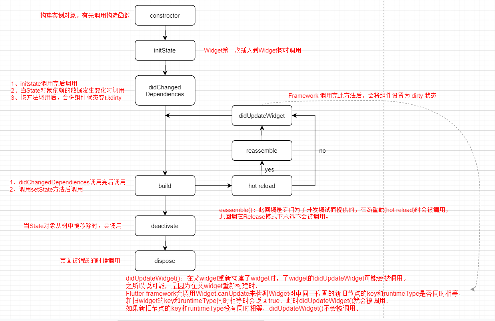

# Flutter

### 简单介绍下Flutter框架，以及优缺点？

1. Flutter是Google推出的一套开源跨平台UI框架，可以快速地在Android、iOS和Web平台上构建高质量的原生用户界面。
2. Flutter采用现代响应式框架构建，其中心思想是使用组件来构建应用的UI。当组件的状态发生改变时，组件会重构它的描述，Flutter会对比之前的描述，以确定底层渲染树从当前状态转换到下一个状态所需要的最小更改。
3. Flutter优点
   + 借助可移植的GPU加速的渲染引擎实现跨平台。
   + 热重载（Hot Reload），ctrl+s可以保存并重载，模拟器立马就可以看见效果，相比原生冗长的编译过程强很多。
   + 一切皆为Widget的理念，可以通过可组合控件集合以及丰富的动画库来构建灵活的丰富的界面。
4. Flutter缺点
   + 不支持热更新。
   + 三方库有限，需要自己造轮子。
   + Dart语言编写，增加了学习难度。


### MVC、MVP、MVVM的优缺点？

1. 不管是MVC、MVP还是MVVM他们要做的都只有一个目的那就是将业务代码和视图代码进行分离。

2. MVC，在 MVC 中，对应用程序划分出了三种角色：Model、View、Controller。三者有各自的具体用途和职责。

   + MVC的三层介绍
     + Model：数据 + 业务逻辑。
     + View：接收和展示数据的界面。
     + Controller：主要担任 Model 与 View 之间的桥梁，用于控制程序的流程。
   + MVC的优缺点
     + 优点：MVC 为业务和视图的实现分离提供了开创性的设计思路，让负责业务逻辑的 Model 与负责展示的 View 实现了解耦，从而 Model 的复用性高。
     + 缺点：三层会直接或者间接通信，各层职责划分不明确，C层承担了很大一部分职责，后期不利于维护。

3. MVP，MVP中包含的三种角色：Model、View、Presenter，它们都是通过接口进行交互的，Presenter 其实就是MVC中的 Controller，只是为了与 MVC 区别开来，所以才称为 Presenter，主要是目的还是MVP对MVC进行了分解，重新架构。

   + MVC的三层介绍
     + Model：主要负责数据提供
     + View：其实还是和MVC中的View层一样的。
     + Presenter ：主要负责业务逻辑处理，作为M和V层的通信桥梁。
   + MVP的优缺点
     + 优点：
       + MVP 之间的交互通过接口来进行的，便于进行单元测试，维护性和扩展性也提高了。
       + M 和 V 之间彻底分离了，降低了耦合性，修改 V 层也不会影响 M 层（不再是MVC中MV直接通信）。
     + 缺点：
       + 由于增加了很多接口的定义，需要编写的代码量暴增，增加了项目的复杂度。
       + 需要对很多业务模块之间的交互抽象成接口定义，对开发人员的设计能力要求更高了。

4. MVVM：Model + View + ViewModel，和MVC、MVP不同的是ViewModel。

   + MVVM的三层介绍
     + Model： 封装了业务逻辑和数据，管理的是业务模型。
     + VM：（ViewModel）即视图模型，MVVM 最重要的一个特性就是数据绑定，通过将 View 的属性绑定到 ViewModel，可以使两者之间松耦合，当 ViewModel 的数据发生改变之后，与之绑定的 View 也会随之自动更新。反过来，当 View  发生了变化如果使用的单向绑定（ViewModel 数据不会自动更新），如果使用的双向绑定（ViewModel 数据会自动更新）。
     + View：视图层。

5. 简单总结MVP和MVVP区别：

   + MVP 和 MVVM 都是为了解决界面和数据的分离问题，两者只是采用了不同的实现方案。
   + MVP 之间的交互主要是通过接口实现的，其主要弊端就是需要编写大量接口。
   + 而 MVVM 则是通过数据绑定的方式实现交互，虽然其实现需要依赖具体的一些框架工具，但明显大大减少了开发者需要编写的代码量。

   

### Application、Module、Plugin、Package区别？

1. Application：主体是Flutter，其中包含iOS、Android、web等项目。

2. Module：主要用于原生ios和android嵌入Flutter项目，用于原生和Flutter混合开发。

3. Plugin：在Flutter中实现不了的功能，可以通过Plugin方式调用原生能力来实现。

4. Package：纯Dart语言编写的模块，不需要原生代码实现，没有Android iOS目录。

   

### Flutter的FrameWork和Engine层？

1. Flutter的FrameWork层是用Dart语言封装的一套开发类库，它实现了一套基础库。主要包含Material（Android风格UI）和Cupertino（iOS风格）的UI界面，下面是通用的Widgets（组件），之后是一些动画、绘制、渲染、手势库等。这个纯 Dart实现的 SDK被封装为了一个叫作 dart:ui的 Dart库。我们在使用 Flutter写 App的时候，直接导入这个库即可使用组件等功能。
2. Flutter的Engine层是Skia 2D的绘图引擎库，Skia 在图形转换、文字渲染、位图渲染方面都提供了友好、高效的表现。Skia是跨平台的，所以可以被嵌入到 Flutter的 iOS SDK中，Android自带了 Skia，所以 Flutter Android SDK要比 iOS SDK小很多。


### **Flutter**中的**key?** 有什么用？

1. 在Flutter中key是一个抽象类，有两个直接子类：

   + LocalKey ：主要是用于比较新旧Widget是否要更新或者删除，这个比较的过程采用了一个算法叫做Diff算法。
   + GlobalKey：主要保存Widget、State或者是Element的引用，可以用于访问他们内部的信息或者调用内部的方法。


### LocalKey 是什么，有什么作用？

1. LocalKey主要是用于比较新旧Widget是否要更新或者删除，其实LocalKey 存在的其中一个就是为了服务Diff算法，LocalKey也是Diff算法的核心所在。

2. LocalKe中又分成三个常用的Key

   + ValueKey：可以传入泛型作为Key的类型，一般情况传入例如：字符串、数字等等类型的key。

   + ObjectKey：内部采用Object类型来保存传入的Key，也就是我们可以将一个Object类型的值作为Key。

   + UniqueKey：生成一个唯一的KEey，本质通过hash生成的。

     ```dart
     @override
     String toString() => '[#${shortHash(this)}]';
     ```

     

3. 比较两个Widget时会调用canUpdate(oldWidget, newWidget)方法通过新旧Widget的runtimeType和key这两个属性来进行比较。

   ```dart
   static bool canUpdate(Widget oldWidget, Widget newWidget) {
       return oldWidget.runtimeType == newWidget.runtimeType && oldWidget.key == newWidget.key;
   }
   ```

   

### GlobalKey是什么，有什么作用？

1. GlobalKey使用了一个静态常量Map来保存对应的Element，你可以通过GlobalKey找到持有该GlobalKey的 Widget，State 和 Element。

   ```dart
   final Map<GlobalKey, Element> _globalKeyRegistry = <GlobalKey, Element>{};
   ```

   ```
   // 通过GlobalKey获取Context对象
   BuildContext? get currentContext => _currentElement;
   
   // 通过GlobalKey获取Widget对象
   Widget? get currentWidget => _currentElement?.widget;
   
   // 通过GlobalKey获取State对象
   T? get currentState {
       final Element? element = _currentElement;
       if (element is StatefulElement) {
       final StatefulElement statefulElement = element;
       final State state = statefulElement.state;
       if (state is T)
       	return state;
       }
       	return null;
   }
   ```

2. 通过GlobalKey可以用于访问引用内部的信息或者调用内部的方法。

2. 需求：需要在外部Widget中改变内部Widget的状态，有两种办法解决：

   + 通过回调函数的方式。

   + 通过GlobalKey，GlobalKey 能够跨 Widget 访问状态。

     ```dart
     // 外部Widget先定义一个GlobalKey
     final GlobalKey<_SwitchWidgetState> switchWidgetKey = GlobalKey<_SwitchWidgetState>();
     
     // 使用内部Widget并将key作为参数传递
     body: SwitchWidget(key: switchWidgetKey)
         
     // 当外部Widget按钮被点击时此时需要取更改内部Widget的状态
     switchWidgetKey.currentState!.changeSwitchState();
     ```

     ```dart
     // 在内部Widet中仅仅需要写好代码逻辑 提供给外部调用即可
     void changeSwitchState(){
         isCheck = !isCheck;
         setState(() {});
     }
     ```

     

### main函数和runApp的作用以及关系？

1. main函数是整个应用程序的入口函数。

2. runApp函数是渲染根widget树的函数。

3. runApp函数都会在main函数中运行。

   ```dart
   void main() {
       runApp(const MyApp());
   }
   
   class MyApp extends StatelessWidget {
       //...
   }
   ```


### 谈谈你对Widget的理解以及分类？

1. Widget被译为 `小部件`，在Flutter中Widget其实就是一些界面上展示的UI组件。
2. Widget可以分为两类
   + statelessWidget（无状态Widget）不会自己重新构建自己。一般使用场景做一个简单的静态展示页面，不涉及数据操作。
   + statefulWidget（有状态Widget），有状态意味着在Widget内部可能有需要动态改变的数据，改变数据可能会（如果调用`setState(() {})`）涉及到UI更新，此时statefulWidget就会自己重新构建自己。


### CustomScrollerView和NestedScroller区别？

+ CustomScrollerView是一个基于滚动的且可定制的Widget，定制布局时需要通过一系列的Sliver对象进行组合，常见的Sliver对象有：SliverAppBar、SliverList、SliverGrid、SliverPersistentHeader、SliverToBoxAdapter、SliverFillRemaining等等等。、
+ NestedScroller可以将一个特殊的Scrollable 对象放入到另一个对象中（在大多数情况下，方向不同）。
+ SingleChildScrollView和 NestedScrollView 都建立在CustomScrollerView之上。


### 简单聊聊ListView的几种构建方式？

+ ListView构造器

  + 直接传入一个Widget数组，用于展示固定数量的子Widget。

+ ListView.builder

  + 通过传入IndexedWidgetBuilder（ctx，index）对象实现布局构建，可以实现动态布局效果，实现定制化更轻松，通过itemCount属性来指定子Widget的数量，如果不指定则无限。

  + 此外ListView.builder还能够起到懒加载的效果，默认情况下只展示视窗内的子Widget(会向下偏移一端距离，这段距离的Widget也会被构建出来)。上滑时，顶部移除的Widget就不再展示了直接从内存移除，而下面的Widget也是按照懒加载的方式进行构建（缓存前3条，预加载后3条）。

    ```
    // 默认20条数据
    // 视窗只能展示8条， 默认会向下偏移展示3条   第一次就只构建前11(8 + 3)条
    // 上拉时，第5条被推到顶部，界面就只展示 5 - 12条， 向前偏移3条，第1条记录就会被移除， 同理第 12 - 16条数据就会被构建
    ```

    

+ ListView.separated

  + 可以通过传入一个IndexedWidgetBuilder对象为每一项Widget指定一个自定义的Widget（下划线），剩下的用法和ListView.builder一样。

+ ListView.custom

  + 其实builder + separated方式都是custom方式的“快捷方式”。因为 ListView*内部是靠这个 SliverChildDelegate属性动态初始化子元素的。
  + 我们使用builder和separated比较多，这个custom相对来说就比较少了。


### 有用过FutureBuilder吗？简单聊聊？

1. 在不使用StatefullWidget情况下，通过FutureBuilder可以实现异步刷新UI的功能。

   

2. FutureBuilder有两个重要参数：future和builder。

   + future：用于处理异步任务（读取文件/复杂计算过程/请求网络数据），结果返回一个future对象。

     ```dart
     future: Future.delayed(Duration(seconds: 3), () =>return "ok")
     ```

     

   + builder：当future的状态发生改变时builder就会被回调，结果返回一个Widget。

     ```dart
     /// snapshot当前Future的快照信息
     builder: (BuildContext context, AsyncSnapshot<dynamic> snapshot) {
         /// snapshot.connectionState可以获取当前Future的状态（none、waiting、active、done）
         /// none：当future为null时
         /// waiting：future状态处于pedding时
         /// active：用于监听stream流，仅当
         /// done：future状态处于complected时
     
         /// snapshot.hasError future中是否有错误， snapshot.error 获取错误信息
         /// snapshot.hasData future中是否有数据， snapshot.data 获取数据
     }
     ```

   

3. FutureBuilder还可以传入一个默认值，通过initialData属性。

   ```dart
   final T? initialData;
   ```

   

4. 看一个实例

   ```dart
   FutureBuilder(
       future: Future.delayed(Duration(seconds: 3), () {
           if (Random().nextInt(100) > 50) {
               return "success";
           } else {
               throw "error";
           }
       }),
       builder: (BuildContext context, AsyncSnapshot<dynamic> snapshot) {
           if (snapshot.connectionState == ConnectionState.done) {
               if (snapshot.hasError) {
                   return Column(
                       mainAxisAlignment: MainAxisAlignment.center,
                       children: [Icon(Icons.error, size: 30, color: Colors.red), SizedBox(height: 10), Text("${snapshot.error}")],
                   );
               }
               return Column(
                   mainAxisAlignment: MainAxisAlignment.center,
                   children: [Icon(Icons.done, size: 30, color: Colors.green), SizedBox(height: 10), Text("${snapshot.data}")],
               );
           } else {
               return CircularProgressIndicator();
           }
       },
   )
   ```

   

   

### 有用过StreamBuilder吗？简单聊聊？

1. 使用StreamBuilder和使用FutureBuilder用法很相似，都传入一个future和builder，同时也可以传入默认值，仅仅需要注意的是：获取future的数据时（不管是失败还是成功），都需要在 active 时获取，因为StreamBuilder监听的是Stream，Stream不像是Future只有一个结果，Stream是可能有多个结果的，显然在done（Stream被关闭）的状态下获取数据肯定是不合适的。

   ```dart
   if (snapshot.connectionState == ConnectionState.active) {
       if (snapshot.hasError) {
           return Text("${snapshot.error}");
       }
       return return Text("${snapshot.data}");
   }
   ```

   

2. 创建流的方式

   ```dart
   /// 创建 间隔重复发出事件的流
   final Stream _stream1 = Stream.periodic(Duration(seconds: 3), (i) {
       int randomValue = Random().nextInt(100);
       if (randomValue > 50) {
           return "$randomValue > 50, success";
       } else {
           return "$randomValue < 50, error";
       }
   });
   
   
   
   /// 创建单个流， 此流发出 [value] 的单个数据事件，然后以 done 事件完成。
   final Stream _stream2 = Stream.value("ok");
   
   
   
   /// 创建普通流控制器，允许在流上发送数据、错误和完成事件，也可以被其他人所监听获取当前流的状态信息
   final StreamController _streamController = StreamController();
   /// 添加数据
   _streamController.sink.add("ok");
   /// 添加异常信息
   _streamController.sink.addError("error");
   /// 添加流
   _streamController.sink.addStream(Stream.empty());
   /// 监听流
   _streamController.stream.listen((event) {
       Log.e("listener  Stream $event");
   });
   
   
   
   /// 创建广播流类型的控制器（和普通流控制器用法相似，下面说区别）
   final StreamController _streamController = StreamController.broadcast();
   ```

   

3. 广播流和普通流的区别

   + 普通的Stream只能被一个listener或者StreamBuilder监听，广播流可以被多个listener或者StreamBuilder监听。

   + 普通的Stream会有数据缓存，广播流没有缓存数据。

     ```dart
     Future.delayed(Duration.zero, () {
         for (int i = 0; i < 10; i++) {
             _simpleStream.sink.add(i);
             _broadcastController.sink.add(i);
         }
     });
     
     Future.delayed(Duration(seconds: 3), () {
         _simpleStream.stream.listen((event) {
             Log.e("_simpleStream listener $event");
         });
     
         _broadcastController.stream.listen((event) {
             Log.e("_broadcastController listener $event");
         });
     });
     ```


### Flutter动画有那些常用的类或者API？

1. 常用的类和相关API

   + Animation抽象类，动画基类。

     ```dart
     abstract class Animation<T> 
     ```

   + AnimationController动画控制器类（重点），可以控制动画执行方向或者获取动画执状态，监听动画等等。

     ```dart
     class AnimationController extends Animation<double>
     ```

     ```dart
     AnimationController _animationController =  AnimationController(
         /// vsync信号同步量， 收不到vsync时动画会停止运行(App处于后台/当前Page不可见情况)
         vsync: this,
         /// 动画执行时间
         duration: Duration(seconds: 1),
         /// 动画开始执行时的值（默认0.0）
         lowerBound: 0.0,
         /// 动画执行结束时的值（默认1.0）
         upperBound: 1.0,
     );
     ```

     ```dart
     /// 向前后执行动画（正向）
     _animationController.forward();
     
     /// 向前执行动画（反向）
     _animationController.reverse();
     
     /// 重置动画(将控制器的值设置为lowerBound，停止动画（如果正在进行），并重置为其起点或关闭状态)
     _animationController.reset();
     
     /// 将动画从当前值驱动到目标
     _animationController.animateTo(0.5);
     
     /// 监听动画值的改变
     _animationController.addListener(() {});
     
     /// 监听动画值的改变
     _animationController.addStatusListener((AnimationStatus status) {
         /// status 动画的状态，AnimationStatus是一个枚举有四个枚举值(dismissed、forward、reverse、completed)
         /// dismissed: animation is stopped at the beginning(未开始)
         /// forward: animation is running from beginning to end（向后执行）
         /// reverse: animation is running backwards, from end to beginning（向前执行）
         /// completed: The animation is stopped at the end（执行结束）
     });
     ```

   + CurvedAnimation类，指定动画执行的方式（线性、先快后慢、先慢后快等等...）。

     ```dart
     class CurvedAnimation extends Animation<double>
     ```

     

   + Tween类，指定动画执行的值范围（AnimationController默认是0.0-1.0）。

     ```dart
     class Tween<T extends Object?> extends Animatable<T>
     ```

   

2. AnimatedBuilder 和 AnimatedWidget

   + 在不使用AnimatedBuilder 和 AnimatedWidget情况下，想要刷新UI需要通过setState，setState会让build方法重新运行，大多数场景下，我们仅仅希望需要做动画展示的Widget被build而不要让其他的Widget也被build。
   + 这时AnimatedBuilder 和 AnimatedWidget也就是来解决这个问题的，实际开发者AnimatedBuilder （用的多）比AnimatedWidget使用更方便。

   

3. 交织动画，实现也很简单，多创建几个Tween即可，一个Tween对应一个动画的应用场景。

   ```dart
   _animationController = AnimationController(vsync: this, duration: Duration(seconds: 1));
   _animation = CurvedAnimation(parent: _animationController, curve: Curves.linear);
   
   /// 颜色变化
   _colorAnimation = ColorTween(begin: Colors.blue, end: Colors.red).animate(_animationController);
   
   /// 大小变化
   _sizeAnimation = Tween(begin: 150.0, end: 0.0).animate(_animationController);
   
   /// 位置变化
   _positionAnimation = Tween(begin: 45.0, end: 0.0).animate(_animationController);
   
   /// 透明的变化
   _opacityAnimation = Tween(begin: 1.0, end: 0.0).animate(_animationController);
   ```

   ```dart
   AnimatedBuilder(
       animation: _animationController,
       builder: (ctx, child) {
           return Transform(
               alignment: Alignment.center,
               transform: Matrix4.rotationZ(_positionAnimation.value),
               child: Opacity(
                   opacity: _opacityAnimation.value,
                   child: Container(width: _sizeAnimation.value, height: _sizeAnimation.value, color: _colorAnimation.value),
               ),
           );
       },
   )
   ```

   

4. Hero动画，在两个Widget（Page）进行切换时，对位置、外观上的差异变化进行动画、过渡描述。

   + 需要注意：两边的Widget都需要绑定相同的TAG（除此之外需要保证TAG地唯一性）。


### Widget的生命周期是怎么样？

1. statelessWidget的生命周期，因为是无状态Widget且不会自己重新构建自己。生命周期比较简单。

   + Widget的构造方法。

   + Widget的build方法。

     

2. statefulWidget的生命周期

   + Widget的构造方法。

   + Widget的createSatet方法。

   + State的构造方法。

   + state的initState方法，当Widget第一次插入到Widget树时会被调用（注意：重写该方法时，必须要先调用super. initState()）。

   + State的didChangeDependencies方法，该方法被调用后，组件的状态变为 dirty，并且立即调用 build 方法，该方法有两种调用时机：

     + 调用initState方法后，会调用该方法。
     + 从其他widget中依赖一些数据发生改变时会调用该方法，比如用InheritedWidget，provider来监听数据的改变。

   + State的build方法（调用完 didChangeDependencies方法后调用该方法 ， 调用 setState 方法之后 , 该方法也会被调用），build方法中应该只包含构建组件的代码，不应该包含其他额外的功能，尤其是耗时任务。

   + state的deactivate方法（当state被暂时从视图移除的时候会调用，页面push走、pop回来的时候都会调用）。

   + State的dispose方法（页面被销毁的时候调用）。

     

3. 生命周期画图

   

   

4. 生命周期相关的一些注意点

   + mounted对象，mounted 是 State 对象中的一个属性，此属性表示当前组件是否在树中。createState 函数执行完毕后表示当前组件已经在组件树中，属性 mounted 被 Framework 设置为 true，强烈建议：在调用 setState 时加上 mounted 判断。

     ```dart
     if(mounted){ 
         setState(() {  });
     }
     ```

   + dirty 和 clean

     + dirty 表示组件当前的状态为 脏状态，绘制下一帧时将会执行 build 函数，调用 setState 方法或者执行didUpdateWidget 方法后，组件的状态为 dirty。
     + clean 表示组件当前的状态为干净状态，clean 状态下组件不会执行 build 函数。

   

### Flutter中监听Android Activity的生命周期？

1. 通过WidgetsBindingObserver的didChangeAppLifecycleState 可以获取App的生命周期状态。

2. 在AppLifecycleState类中。常用状态包含如下几个：

   + `inactive` — 应用处于非活跃状态并且不接收用户输入。
   + `detached` — 应用依然保留 flutter engine，但是全部宿主 view 均已脱离。
   + `paused` — 应用当前对用户不可见，无法响应用户输入，并运行在后台。这个事件对应于 Android 中的 `onPause()`；
   + `resumed` — 应用对用户可见并且可以响应用户的输入。这个事件对应于 Android 中的 `onPostResume()`；

3. 案例

   ```dart
   // 需要混入WidgetsBindingObserver类
   class HomeWidgetState extends State<HomeWidget> with WidgetsBindingObserver {
       @override
       void initState() {
           super.initState();
           // 注册监听器，当生命周期发生变化时 FreamWork会回调didChangeAppLifecycleState方法，并传递当前状态
           WidgetsBinding.instance!.addObserver(this);
       }
   
       //...
       
       @override
       void didChangeAppLifecycleState(AppLifecycleState state) {
           if (state == AppLifecycleState.resumed) {
               print("应用对用户可见并且可以响应用户的输入。这个事件对应于 Android 中的 `onPostResume()`；。");
           } else if (state == AppLifecycleState.inactive) {
               print("应用处于非活跃状态并且不接收用户输入。");
           } else if (state == AppLifecycleState.paused) {
               print("应用当前对用户不可见，无法响应用户输入，并运行在后台。这个事件对应于 Android 中的 `onPause()`；");
           } else if (state == AppLifecycleState.detached) {
               print("应用依然保留 flutter engine，但是全部宿主 view 均已脱离。");
           }
       }
       
       @override
       void deactivate() {
           super.deactivate();
           // 注意deactivate时 请移除监听
           WidgetsBinding.instance!.removeObserver(this);
       }
   }
   ```

   

### Widget和Widget树的概念？

1. Widget：在Flutter中几乎所有东西都是Widget，可以将Widget想象成一个可视化组件或者能与应用程序交互的组件。
2. Widget树：Widget以树结构进行组织。包含其他Widget的widget被称为父Widget(或widget容器)。包含在父widget中的widget被称为子Widget。


### Context 、State概念？

1. Context：是已创建的Widget树中某个Widget位置引用（Element），一个context只从属于一个widget，它和widget一样是链接在一起的，并且会形成一个context树。

2. State：State定义了statefulWidget实例的行为，包含了用于干预/交互Widget信息的行为和布局，应用于State的任何更改都会强制重新构建Widget。

   

### Widget、Element、RenderObject 关系？

1. 创建widget的时候，一个widget对应一个element，但是widget和element与 RenderObject并不是一一对应，为什么？后面解答。
1. 三者的概念理解
   + Widget：页面小部件，我们自己编写Widget，比如：Container、Text、Column、ListView等等...
   + Element：
     + Element和Widget是一一对应的，Element中通过_widget来保存Widget引用，设计这个element主要的灵感主要是来自React框架的虚拟DOM和Diff算法（Flutter官网有说过）。
     + 因为Widget是不稳定的，经常会进行Build 如果界面直接渲染我们写的Widget这势必对Flutter的性能有很高的要求，此时Element就排上用场了，Flutter会通过KEY（GlobalKey）来找到对应的Element并且调用canUpdate方法进行比较（主要是比较新旧widget的key和runtimeType属性），进行小范围的更新，而不是重新创建Element。
   + RenderObject：最终被渲染到页面的视图，渲染视图步骤主要包含两步：布局(layout)和绘制(paint)。
3. 为什么但是widget和element与 RenderObject并不是一一对应？？
   + 首选需要确定当前Widget是否是一个渲染的Widget（RenderObjectWidget），如何判断？看是不是RenderObjectWidget的子类或者看父类是否继承了XXXRenderObjectWidget。
   + 举个例子：
     + 非RenderObjectWidget：Text、Container、Icon等等...
     + RenderObjectWidget -> MultiChildRenderObjectWidget: Column、Stack、Flex等等...
     + RenderObjectWidget -> SingleChildRenderObjectWidget：Align、SizedBox、Padding等等...
   + 结论就是：只有继承了RenderObjectWidget的Widget最后才会生成一个对应的RenderObject，那么非RenderObjectWidget的子类会通过插槽的方式被合并到其中。


### FlutterWidget渲染流程？

1. 创建Widget时会创建一个对应的Element。

2. 在Element中会做几件事情：

   + 调用Element的mount方法 本质是调用自己写的Widget的build方法，Element中通过_widget来保存build方法返回的引用。

     + 调用build的形式分成两种情况：
       + StatelessWidget：_widget = Widget.build(BuildContext context)
       + StatefullWidget：__widget = _state.build(BuildContext context), 因为StatefullWidget的布局都在State中。
       + BuildContext解释：BuildContext本质就是当前的Element对象，传递context对象的根本原因是因为：当Widget重新build的时候来确定Element的位置以及数据信息。

   + 如果Element是一个RenderElement，调用createRenderObject方法创建对象并通过_renderObject引用保存。

     + _renderObject = createRenderObject()

   + 如果Element是一个StatefullElement，调用createState来创建一个State对象，并通过_state对象来保存引用。

     + _state = createState();
     + _state.widget = _widget; 这一步刚好就是：为什么我们能够在State中能通过this.widget去访问父Widget的数据的根本原因。

     

### Flutter中自定义View的流程？

1. 已有控件（widget）的继承，组合。
2. 自定义绘制widget,也就是利用paint，cavans等进行绘制自定义视图。


### 什么是状态管理？你了解那些状态管理框架？

1. 状态管理是声明式编程中一个重要的概念，Flutter也是声明式编程的，
2. Flutter采用现代响应式框架构建，其中心思想是使用组件来构建应用的UI，组件最重要的概念就是状态，状态是一个组件的UI数据模型，是组件渲染时的数据依据。
3. Flutter的状态管理可以分成两大类：应用状态（全局状态）和短时状态（局部状态）。
4. 常用的状态管理框架有：Redux 、BLoC、Provider、Getx等等。


### 简单聊聊Provider这个状态管理框架？

1. Flutter中状态管理框架事比较多的，其中Provider是官方推荐的一个状态管理框架，Provider主要还是做全局数据共享的，底层是通过封装InheritedWidget并且在此基础上做了一些优化。

2. 使用Provider时一般我们会配合几个类一起使用

   + ChangeNotifier：这个类可以监听到数据变化，只需要我们在数据变化时手动调用notifyListeners() 方法，ChangeNotifier就能够通知消费者进行数据更新。

   + XxxViewModel：充当MVVM中的MV角色，通过数据绑定的方式来驱动视图更新。

     ```dart
     class countViewModel extends ChangeNotifier {
         int _count;
     
         countViewModel(this._count);
     
         int get count => _count;
     
         set count(int value) {
             _count = value;
             // 数据更新 通知消费者
             notifyListeners()
         }
     }
     ```

   + Provider/MultiProvider：用在根Widget上，方便项目的子Widget能够共享到数据，唯一Provider和MultiProvider区别就是：Provider只能接收一个Provider，当然可以通过嵌套方式（层级太多很难受），MultiProvider就是来解决Provider的不足。

     ```dart
     Provider(
         create: (_) => MyModel(count),
         child: ...
     )
     ```

     ```dart
     Provider<Something>(
         create: (_) => Something(),
         child: Provider<SomethingElse>(
             create: (_) => SomethingElse(),
             child: Provider<AnotherThing>(
                 create: (_) => AnotherThing(),
                 child: someWidget,
             ),
         ),
     ),
     ```

     ```dart
     MultiProvider(
         providers: [
             Provider<Something>(create: (_) => Something()),
             Provider<SomethingElse>(create: (_) => SomethingElse()),
             Provider<AnotherThing>(create: (_) => AnotherThing()),
         ],
         child: someWidget,
     )
     ```

     

   + Probvider.of\<T>()：从Provider中获取数据

     ```
     final provider = Provider.of<ProviderInterface>(context);
     ```

     

   + Consumer/Consumer2/Consume3，同样的也是从Provider中获取数据

     ```dart
     // Consumer 
     Foo(
         child: Consumer<A>(
             builder: (_, vm, child) {
                 return Bar(a: a, child: child);
             },
             child: Baz(),
         )
     )
     ```

     ```dart
     // Consumer2
     Foo(
         child: Consumer2<A,B>(
             builder: (_, aVM, bVM, child) {
                 return Bar(a: a, child: child);
             },
             child: Baz(),
         )
     )
     ```

     ```dart
     // Consumer3
     Foo(
         child: Consumer2<A, B, C>(
             builder: (_, aVM, bVM, cVM, child) {
                 return Bar(a: a, child: child);
             },
             child: Baz(),
         )
     )
     ```

     

   + Selector/Selector2/Selecto3，同样的也是从Provider中获取数据

     ```dart
     return Selector<A, A>(
         selector: (_, a) => a,
         shouldRebuild: (pre, next) => pre.value == next.value,
         child: Switch(
             value: isCheck,
             onChanged: (value) {}
         ),
     );
     ```

     

### 有对Provider做过优化吗？

1. 从Provider中获取数据的方式有三种：Provider.of()、Consmer、Selector，下面分别介绍这三种区别以及优化手段。

2. 使用Provider.of方法，当数据更新时会直接调用使用Provider.of方法的Widge类的tbuild方法，这显然是不有好的。

3. Consmer其实是对Provider.of的一个优化，默认情况下数据更新并不会调用Widge类的tbuild方法而是调用Consmer的build，有时候Consmer中的build并没有Widget依赖数据，肯能是更新而已，那其实也没必要更新build中的child这时官网又提出了优化，将child换一种方式写

   ```dart
   // 原版
   return Consumer(
       builder: (_, vm, _child) {
           return  Text("111");
       },
   );
   
   // 改良版
   return Consumer(
       builder: (_, vm, _child) {
           // _child 就是Consumer构造函数中传递进来的child
           return _child!;
       },
       child: Text("111")
   );
   ```

4. Selector其实是一个最终改良版，能够更好的控件视图是否需要更新，通过shouldRebuild方法来抉择，同时Selector功能也很强大可以将Avm通过selector函数一些列处理变成Bvm。


### 有用过GetX吗？简单聊聊？

1. GetX 是 Flutter 上的一个轻量级且强大的解决方案：高性能的状态管理、智能的依赖注入和便捷的路由管理，还有一些实用工具包括：国际化、改变主题等等。

2. 状态管理

   + 目前，Flutter有几种状态管理器。但是，它们中的大多数都涉及到使用ChangeNotifier来更新widget，这对于中大型应用的性能来说是一个很糟糕的方法。

   + Get有两个不同的状态管理器：简单的状态管理器（GetBuilder）和响应式状态管理器（GetX），使用 Get 的响应式编程就像使用 setState 一样简单。

     ```dart
     // 让我们想象一下，你有一个名称变量，并且希望每次你改变它时，所有使用它的小组件都会自动刷新。
     
     // 这就是你的计数变量。
     var name = 'Jonatas Borges';
     
     // 要想让它变得可观察，你只需要在它的末尾加上".obs"。
     var name = 'Jonatas Borges'.obs;
     
     // 而在UI中，当你想显示该值并在值变化时更新页面，只需这样做。
     Obx(() => Text("${controller.name}"));
     ```

     

3. 依赖注入

   + Get有一个简单而强大的依赖管理器，它允许你只用1行代码就能检索到与你的Bloc或Controller相同的类，无需Provider context，无需inheritedWidget。

     ```dart
     Controller controller = Get.put(Controller()); // 而不是 Controller controller = Controller();
     ```

   + Get会自动为你的控制器找到你想要的数据，而你甚至不需要任何额外的依赖关系。

     ```dart
     // 你可以实例化100万个控制器，Get总会给你正确的控制器。
     Controller controller = Get.find();
     
     // 然后你就可以恢复你在后面获得的控制器数据。
     Text(controller.textFromApi);
     ```

     

4. 路由管理

   + 使用Gex的路由管理避免了Context的传递，例如使用：snackbars、dialogs、bottomsheets等等...

   + 使用Getx很简单：

     ```dart
     // 在你的MaterialApp前加上 "Get"，把它变成GetMaterialApp。
     
     // Before: MaterialApp(
     GetMaterialApp( 
         home: RootApplication(),
     )
     ```

     ```dart
     // 导航到新页面
     Get.to(NextScreen());
     
     // 用别名导航到新页面
     Get.toNamed('/details');
     
     // 要关闭snackbars、dialogs、bottomsheets或任何你通常会用Navigator.pop(context)关闭的东西。
     Get.back();
     
     // 进入下一个页面，但没有返回上一个页面的选项（用于闪屏页，登录页面等）。
     Get.off(NextScreen());
     
     //进入下一个页面并取消之前的所有路由（在购物车、投票和测试中很有用）。
     Get.offAll(NextScreen());
     ```

     


### Flutter如何和Android与IOS通信？

1. Flutter主要是通过plateformChannel与原生进行交互，其中plateformChannel又分成三种：
   + BasicMessageChannel：用于传递字符串和半结构化的信息。
   + MethodChannel：用于传递方法调用（methods invocation）。
   + EcventChannel：用于数据流的通信（event stream）。
2. 注意：plateformChannel并非是线程安全的。


### 简述Flutter热重载？

1. Flutter 的热重载是基于 JIT 编译模式的代码增量同步。由于 JIT 属于动态编译，能够将 Dart 代码编译成生成中间代码，让 Dart VM 在运行时解释执行，因此可以通过动态更新中间代码实现增量同步。
2. 热重载的流程可以分为 5 步，包括：扫描工程改动、增量编译、推送更新、代码合并、Widget 重建。Flutter 在接收到代码变更后，并不会让 App 重新启动执行，而只会触发 Widget 树的重新绘制，因此可以保持改动前的状态，大大缩短了从代码修改到看到修改产生的变化之间所需要的时间。
3. 另一方面，由于涉及到状态的保存与恢复，涉及状态兼容与状态初始化的场景，热重载是无法支持的，如改动前后 Widget 状态无法兼容、全局变量与静态属性的更改、main 方法里的更改、initState 方法里的更改、枚举和泛型的更改等。
4. 可以发现，热重载提高了调试 UI 的效率，非常适合写界面样式这样需要反复查看修改效果的场景。但由于其状态保存的机制所限，热重载本身也有一些无法支持的边界。


### 热重载、热重启和完全重启之间有什么区别？

1. 热重载（hot reload）：会将代码更改转入 VM，重建 widget 树并保持应用的状态，整个过程不会重新运行 `main()` 或者 `initState()`。
2. 热重启（hot restart）：会将代码更改转入 VM，重启 Flutter 应用，不保留应用状态。
3. 完全重启（start）： 将会完全重新运行应用。该进程较为耗时，因为它会重新编译原生部分代码。在 Web 平台上，它同时会重启 Dart 开发编译器。完全重启并没有既定的快捷键，你需要手动停止后重新运行。


### 了解Flutter编译模式吗？

1. Flutter编译模式一共分成三种：release、profile、debug，三种模式都有自己的特点。
2. release模式特点
   + 使用AOT（ahead of time）预编译模式，将Dart代码预编译为机器码，通过编译器生成对应平台（android/ios）能够直接运行的代码。运行速度快，执行性能好。
   + 此模式关闭了所有的调试工具，只允许在真机上运行。
3. profile模式特点
   + profile模式和release模式类似，都使用AOT预编译模式。
   + 他们最大的区别就是：profile模式支持DevTools来检测应用的性能，做性能调试分析，release模式不支持。
4. debug模式特点
   + debug模式使用了JNI（just in time）即时编译模式，该模式的典型应用就是热重载（hot reload）。
   + debug模式，一般是应用于开发模式，支持调试信息、服务扩展、DevTools工具、支持模拟器和整机调试。


### 谈谈你对Flutter性能优化的理解?

1. 避免在build方法中执行耗时操作，因为build方法随时都有可能被执行，过多的耗时操作代码会阻塞导致UI卡顿，可以将一般耗时操作通过Future转换成异步的方式完成，对于CPU计算频繁的操作（/音视频转码/图片压缩/复杂的逻辑计算）可以考虑开启isolate充分利用CPU多核心来完成。
2. 避免在build方法中堆叠大量的widget，应将widget拆小避免直接返回一个巨大的widget，跟细粒度的拆分能够使widget得到充分的复用（具体看业务需求）。
3. 尽可能使用const构造器，当父widget更新了子widget也不会重新进行rebuild操作，特别是针对于一些长期不修改的组件，例如：通用的error/loading/empty等等组件。
4. 尽量不使用ListView或者GridView的默认构造方法，而是使用他们各自的build方法，默认构造方法会让列表中所有的数据一次性绘制出来，build方法只绘制可见列表（缓存前3条，预加载后3条），类似于Android中的RecycleView。懒加载而不是一次性绘制所有的子widget，这样视图初始化的时间就减少了。
5. 静态资源最好走CDN，过多的静态资源存放在本地，久而久之会导致包体积变大。
6. 上传图片上传时进行图片压缩，减轻服务器压力，下载图片时最好使用缓存/图片预加载等技术。
7. 可以适当的将对个请求合并成一个请求（看业务需求），从而减少网络IO耗时。
8. 对于耗时操作（文件io/网络请求/json解析/音视频转码/图片压缩等等）建议通过创建子isolate来执行，避免在主isolate中执行耗时操作。


### Flutter 是怎么运转的？

1. 与用于构建移动应用程序的其他大多数框架不同，Flutter 是重写了一整套包括底层渲染逻辑和上层开发语言的完整解决方案。
2. 这套解决方案不仅可以保证视图渲染在 Android 和 iOS 上的高度一致性（即高保帧），在代码执行效率和渲染性能上也可以媲美原生 App 的体验（即高性能）。


### Flutter组件化思想和设计原则？

1. 组件化又叫模块化，即基于可重用的目的，将一个大型软件系统（App）按照关注点分离的方式，拆分成多个独立的组件或模块。每个独立的组件都是一个单独的系统，可以单独维护、升级甚至直接替换，也可以依赖于别的独立组件，只要组件提供的功能不发生变化，就不会影响其他组件和软件系统的整体功能。

2. 设计原则

   + 单一性原则：每个组件仅提供一个功能。每个组件都有自己固定的职责和清晰的边界，专注地做一件事。
   + 抽象化原则：组件提供的功能抽象应该尽量稳定，具有高复用度。而稳定的直观表现就是对外暴露的接口很少发生变化。
   + 稳定性原则：不要让稳定的组件依赖不稳定的组件。比如组件 A 依赖了组件 B，如果组件A很稳定，但是组件B经常变化，那么组件A也就会变得不稳定了，需要经常适配。
   + 自完备性：即组件需要尽可能地做到自给自足，尽量减少对其他底层组件的依赖，达到代码可复用的目的。

   

### Flutter平台化概念？

1. 平台化是组件化的升级，即在组件化的基础上，对它们提供的功能进行分类，统一分层划分，增加依赖治理的概念。
2. 与组件化更关注组件的独立性相比，平台化更关注的是组件之间关系的合理性，而这也是在设计平台化架构时需要重点考虑的单向依赖原则。