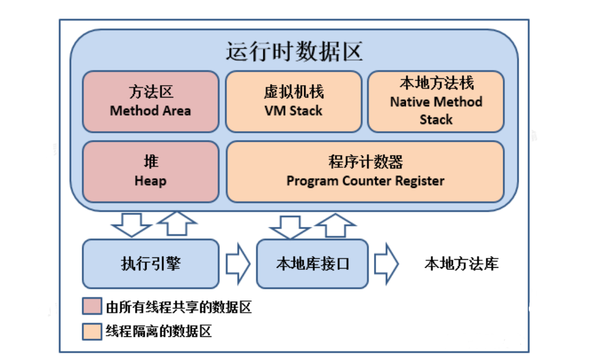

# JavaSE


### ==和equals⽅法之前的区别?

1. ==：基本数据类型对比是变量值，引⽤类型对比是是堆中内存对象的地址。

2. equals：object中默认也是采⽤==⽐较，通常会重写

   + Objeect

     ```java
     public boolean equals(Object obj) {
         return (this == obj);
     }
     ```

     

   + String中，重写了object的equals方法，String类中被复写的equals()⽅法其实是⽐较两个字符串的内容。

     ```java
     public boolean equals(Object anObject) {
         if (this == anObject) {
             return true;
         }
         if (anObject instanceof String) {
             String anotherString = (String)anObject;
             int n = value.length;
             if (n == anotherString.value.length) {
                 char v1[] = value;
                 char v2[] = anotherString.value;
                 int i = 0;
                 while (n-- != 0) {
                     if (v1[i] != v2[i])
                         return false;
                     i++;
                 }
                 return true;
             }
         }
         return false;
     }
     ```

     

### hashCode()与equals()之间的关系？

1. hashCode() 的作⽤是获取哈希码，也称为散列码；它实际上是返回⼀个int整数。这个哈希码的作⽤是确定该对象在哈希表中的索引位置，hashCode() 定义在JDK的Object.java中，Java中的任何类都包含有hashCode() 函数。
2. 如果两个对象相等，则hashcode⼀定也是相同的。
3. 两个对象相等,对两个对象分别调⽤equals⽅法都返回true。


### final关键字的作⽤是什么？

1. 修饰类：表示类不可被继承。
2. 修饰⽅法：表示⽅法不可被⼦类覆盖，但是可以重载。
3. 修饰变量：表示变量⼀旦被赋值就不可以更改它的值。
4. 修饰基本类型数据和引⽤类型数据：
   + 如果是基本数据类型的变量，则其数值⼀旦在初始化之后便不能更改。
   + 如果是引⽤类型的变量，则在对其初始化之后便不能再让其指向另⼀个对象。但是引⽤的值是可变的。


### 为什么局部内部类和匿名内部类只能访问局部final变量？

1. ⾸先需要知道的⼀点是: 内部类和外部类是处于同⼀个级别的，内部类不会因为定义在⽅法中就会随着⽅法的执⾏完毕就被销毁。
2. 当外部类的⽅法结束时，局部变量就会被销毁了，但是内部类对象可能还存在，这⾥就会产⽣问题：内部类对象访问了⼀个不存在的变量。为了解决这个问题，就将局部变量复制了⼀份作为内部类的成员变量，这样当局部变量死亡后，内部类仍可以访问它。
3. 将局部变量复制为内部类的成员变量时，必须保证这两个变量是⼀样的，也就是如果我们在内部类中修改了成员变量，⽅法中的局部变量也得跟着改变，怎么解决问题呢？
   + 就将局部变量设置为final，对它初始化后，我就不让你再去修改这个变量，就保证了内部类的成员变量和⽅法的局部变量的⼀致性。这实际上也是⼀种妥协。使得局部变量与内部类内建⽴的拷⻉保持⼀致。


### String、StringBuffer、StringBuilder的区别?

1. String.intern()：
   + 调用它时，如果常量池中存在当前字符串, 就会直接返回当前字符串。
   + 如果常量池中没有此字符串, 会将此字符串放入常量池中后, 再返回。
2. String是不可变的，如果尝试去修改，会新⽣成⼀个字符串对象，StringBuffer和StringBuilder是可变的。
3. StringBuffer是线程安全的，StringBuilder是线程不安全的，所以在单线程环境下StringBuilder效率会更⾼。


### 重载和重写的区别？

1. 发⽣在同⼀个类中，⽅法名必须相同，参数类型不同、个数不同、顺序不同，⽅法返回值和访问修饰符可以不同，发⽣在编译时。
2. 发⽣在⽗⼦类中，⽅法名、参数列表必须相同，返回值范围⼩于等于⽗类，抛出的异常范围⼩于等于⽗类，访问修饰符范围⼤于等于⽗类；如果⽗类⽅法访问修饰符为private则⼦类就不能重写该⽅法。


### 接⼝和抽象类的区别？

1. 抽象类可以存在普通成员函数，⽽接⼝中只能存在public abstract ⽅法。
2. 抽象类中的成员变量可以是各种类型的，⽽接⼝中的成员变量只能是public static final类型的。
3. 抽象类只能继承⼀个，接⼝可以实现多个。


### List和Set的区别？

1. List：有序，按对象进⼊的顺序保存对象，可重复，允许多个Null元素对象，可以使⽤Iterator取出所有元素，在逐⼀遍历，还可以使⽤get(int index)获取指定下标的元素。
2. Set：⽆序，不可重复，最多允许有⼀个Null元素对象，取元素时只能⽤Iterator接⼝取得所有元素，在逐⼀遍历各个元素


### ArrayList和LinkedList区别？

1.  ⾸先，他们的底层数据结构不同，ArrayList底层是基于数组实现的，LinkedList底层是基于链表实现的。
2. 由于底层数据结构不同，他们所适⽤的场景也不同，ArrayList更适合随机查找，LinkedList更适合删除和添加。查询、添加、删除的时间复杂度不同。
3. 另外ArrayList和LinkedList都实现了List接⼝，但是LinkedList还额外实现了Deque接⼝，所以LinkedList还可以当做队列来使⽤。


### HashMap和HashTable有什么区别？其底层实现是什么？

1. 区别：
   + HashMap⽅法没有synchronized修饰，线程⾮安全，HashTable线程安全。
   + HashMap允许key和value为null，⽽HashTable不允许（源码中有判断）。
2. 底层实现：数组+链表实现，jdk8开始链表⾼度到8、数组⻓度超过64，链表转变为红⿊树，元素以内部类Node节点存在。
   + 计算key的hash值，⼆次hash然后对数组⻓度取模，对应到数组下标。
   + 如果没有产⽣hash冲突(下标位置没有元素)，则直接创建Node存⼊数组。
   + 如果产⽣hash冲突，先进⾏equal⽐较，相同则取代该元素，不同，则判断链表⾼度插⼊链表，链表⾼度达到8，并且数组⻓度到64则转变为红⿊树，⻓度低于6则将红⿊树转回链表。
   + key为null，存在下标0的位置。


### 谈谈ConcurrentHashMap的扩容机制？

1. JDK1.7

   +  1.7版本的ConcurrentHashMap是基于Segment分段实现的，每个Segment相对于⼀个⼩型的HashMap。

   + 每个Segment内部会进⾏扩容，和HashMap的扩容逻辑类似，先⽣成新的数组，然后转移元素到新数组中。

   + 扩容的判断也是每个Segment内部单独判断的，判断是否超过阈值

     

2. JDK1.8

   + 1.8版本的ConcurrentHashMap不再基于Segment实现。
   + ConcurrentHashMap是⽀持多个线程同时扩容的，当某个线程进⾏put时，如果发现ConcurrentHashMap正在进⾏扩容那么该线程⼀起进⾏扩容，如果发现没有正在进⾏扩容，则将key-value添加到ConcurrentHashMap中，然后判断是否超过阈值，超过了则进⾏扩容。


### Jdk**1**.**7**到Jdk**1**.**8** HashMap 发⽣了什么变化？

1. JDK1.7
   + HashMap 底层结构使用是数组+链表。
   + 链表插⼊使⽤的是头插法。
   + 判断扩容时：只要不小于阈值就直接扩容2倍。
2. JDK1.8
   + HashMap 底层结构使用是数组+链表+红⿊树，加红⿊树的⽬的是提⾼HashMap插⼊和查询整体效率。
   + 链表插⼊使⽤的是尾插法，因为1.8中插⼊key和value时需要判断链表元素个数，所以需要遍历链表统计链表元素个数，所以正好就直接使⽤尾插法。
   + 扩容策略会更优化，因为1.7中哈希算法比较复杂，存在各种右移与异或运算，1.8中进行了简化，因为复杂的哈希算法的目的就是提高散列性，来提高HashMap的整体效率，而1.8中新增了红黑树，所以可以适当简化哈希算法，节省CPU资源。


### HashMap的扩容机制原理？

1. JDK1.7

   + 先⽣成新数组。
   + 遍历⽼数组中的每个位置上的链表上的每个元素。
   + 取每个元素的key，并基于新数组⻓度，计算出每个元素在新数组中的下标。
   + 将元素添加到新数组中去。
   + 所有元素转移完了之后，将新数组赋值给HashMap对象的table属性。

   

2. JDK1.8

   + 先⽣成新数组。
   + 遍历⽼数组中的每个位置上的链表或红⿊树。
     + 如果是链表，则直接将链表中的每个元素重新计算下标，并添加到新数组中去。
     + 如果是红⿊树，则先遍历红⿊树，先计算出红⿊树中每个元素对应在新数组中的下标位置。
       +  统计每个下标位置的元素个数
       + 如果该位置下的元素个数超过了8，则⽣成⼀个新的红⿊树，并将根节点的添加到新数组的对 应位置
       + 如果该位置下的元素个数没有超过8，那么则⽣成⼀个链表，并将链表的头节点添加到新数组 的对应位置
   + 所有元素转移完了之后，将新数组赋值给HashMap对象的table属性。


### 泛型中extends和super的区别？

1. `<? extends T>`表示包括T在内的任何T的⼦类。
2. `<? super T>`表示包括T在内的任何T的⽗类。


### 深拷⻉和浅拷⻉区别？

1. 深拷⻉和浅拷⻉就是指对象的拷⻉，⼀个对象中存在两种类型的属性，⼀种是基本数据类型，⼀种是实例对象的引⽤（引用数据类型）。
2.  浅拷⻉是指，只会拷⻉基本数据类型的值，以及实例对象的引⽤地址，并不会复制⼀份引⽤地址所指向的对象。
3. 深拷⻉是指，既会拷⻉基本数据类型的值，也会针对实例对象的引⽤地址所指向的对象进⾏复制，深拷⻉出来的对象，内部的属性指向的不是同⼀个对象。


### CopyOnWriteArrayList的底层原理是怎样的？

1. ⾸先CopyOnWriteArrayList内部也是⽤过数组来实现的，在向CopyOnWriteArrayList添加元素时，会复制⼀个新的数组，写操作在新数组上进⾏，读操作在原数组上进⾏。
2. 并且，写操作会加锁，防⽌出现并发写⼊丢失数据的问题，写操作结束之后会把原数组指向新数组。
3. CopyOnWriteArrayList允许在写操作时来读取数据，⼤⼤提⾼了读的性能，因此适合读多写少的应⽤场景。
4. CopyOnWriteArrayList会⽐较占内存，同时可能读到的数据不是实时最新的数据，所以不适合实时性要求很⾼的场景。


### Java中的异常体系是怎样的？

1. Java中的所有异常都来⾃顶级⽗类Throwable，Throwable下有两个⼦类Exception和Error。
2. Error是程序⽆法处理的错误，⼀旦出现这个错误，则程序将被迫停⽌运⾏。
3. Exception不会导致程序停⽌，⼜分为两个部分RunTimeException运⾏时异常和CheckedException检查异常。
   + RunTimeException常常发⽣在程序运⾏过程中，会导致程序当前线程执⾏失败。
   + CheckedException常常发⽣在程序编译过程中，会导致程序编译不通过。


### Java中有哪些类加载器？

1. JDK⾃带有三个类加载器：BootStrapClassLoader、ExtClassLoader、AppClassLoader。
2.  BootStrapClassLoader是ExtClassLoader的⽗类加载器，默认负责加载`%JAVA_HOME%lib`⽂件夹下的jar包和class⽂件。
3.  ExtClassLoader是AppClassLoader的⽗类加载器，负责加载`%JAVA_HOME%/lib/ext`⽂件夹下的jar包和class⽂件。
4. AppClassLoader是⾃定义类加载器的⽗类，负责加载`classpath`下的类⽂件。


### 说说类加载器双亲委派模型？

1. JVM中存在三个默认的类加载器：BootStrapClassLoader、ExtClassLoader、AppClassLoader，AppClassLoader的⽗加载器是ExtClassLoader，ExtClassLoader的⽗加载器是BootstrapClassLoader。
2. JVM在加载⼀个类时
   + 会先调⽤AppClassLoader的loadClass⽅法来加载这个类，不过在这个⽅法中，会先使⽤ExtClassLoader的loadClass⽅法来加载类。
   + 同样ExtClassLoader的loadClass⽅法中会先使⽤BootstrapClassLoader来加载类，如果BootstrapClassLoader加载到了就直接成功。
   + 如果BootstrapClassLoader没有加载到，那么ExtClassLoader就会⾃⼰尝试加载该类，如果没有加载到，那么则会由AppClassLoader来加载这个类。
3. 所以，双亲委派指得是，JVM在加载类时，会委派给Ext和Bootstrap进⾏加载，如果没加载到才由⾃⼰进⾏加载。


### GC如何判断对象可以被回收？

1. 引⽤计数法：每个对象有⼀个引⽤计数属性，新增⼀个引⽤时计数加1，引⽤释放时计数减1，计数为0时可以回收。引⽤计数法，可能会出现A 引⽤了 B，B ⼜引⽤了 A，这时候就算他们都不再使⽤了，但因为相互引⽤ 计数器=1 永远⽆法被回收。（造成循环依赖问题）。
2. 可达性分析法： GC从 Roots根开始向下搜索，搜索所⾛过的路径称为引⽤链。当⼀个对象到 GC Roots 没有任何引⽤链相连时，则证明此对象是不可⽤的。


### ⼀个对象从加载到JVM，再到被GC清除，都经历了什么过程？

1. .⽤户创建⼀个对象，JVM⾸先需要到⽅法区去找对象的类型信息。然后再创建对象，JVM要实例化⼀个对象，⾸先要在堆当中先创建⼀个对。
2. 对象⾸先会分配在堆内存中新⽣代的Eden。然后经过⼀次Minor GC，对象如果存活，就会进⼊S区。在后续的每次GC中，如果对象⼀直存活，就会在S区来回拷⻉，每移动⼀次，年龄加1。年龄最⼤是15， 超过⼀定年龄后，对象转⼊⽼年代。
3. 当⽅法执⾏结束后，栈中的指针会先移除掉。
4. 堆中的对象，经过Full GC，就会被标记为垃圾，然后被GC线程清理掉。


### JVM中哪些是线程共享区？

1. 堆区和⽅法区是所有线程共享的，栈、本地⽅法栈、程序计数器是每个线程独有的。

   


### 线程的⽣命周期？线程有⼏种状态？

1. 线程通常有五种状态，创建，就绪，运⾏、阻塞和死亡状态。
2. 新建状态（New）：新创建了⼀个线程对象。
3. 就绪状态（Runnable）：线程对象创建后，其他线程调⽤了该对象的start⽅法。该状态的线程位于可运⾏线程池中，变得可运⾏，等待获取CPU的使⽤权。
4. 运⾏状态（Running）：就绪状态的线程获取了CPU的使⽤权，执⾏程序代码。
5. 阻塞状态（Blocked）：阻塞状态是线程因为某种原因放弃CPU使⽤权，暂时停⽌运⾏，阻塞的情况⼜分为三种：
   + 等待阻塞：运⾏的线程执⾏wait⽅法，该线程会释放占⽤的所有资源。JVM会把该线程放⼊“等待池”中。进⼊这个状态后，是不能⾃动唤醒的，必须依靠其他线程调⽤notify或notifyAll⽅法才能被唤醒，wait是object类的⽅法。
   + 同步阻塞：运⾏的线程在获取对象的同步锁时，若该同步锁被别的线程占⽤，则JVM会把该线程放⼊“锁池”中。
     + 锁池：所有需要竞争同步锁的线程都会放在锁池当中，⽐如当前对象的锁已经被其中⼀个线程得到，则其他线程需要在这个锁池进⾏等待。
     + 等待池：当我们调⽤wait（）⽅法后，线程会放到等待池当中，等待池的线程是不会去竞争同步锁。
   +  其他阻塞：运⾏的线程执⾏sleep或join⽅法，JVM会把该线程置为阻塞状态，sleep是Thread类的⽅法。
6.  死亡状态（Dead）：线程执⾏完了或者因异常退出了run⽅法，该线程结束⽣命周期。、


### sleep()、wait()、join()、yield()之间的的区别？

1. sleep 和yield是 Thread 类的静态本地⽅法、wait 则是 Object 类的本地⽅法、join是线程实例方法。
2. sleep⽅法不会释放lock，但是wait会释放，⽽且会加⼊到等待队列中。
3. sleep不需要被唤醒（休眠之后推出阻塞），但是wait需要（不指定时间需要被别⼈中断），sleep 会让出 CPU 执⾏时间且强制上下⽂切换，⽽ wait 则不⼀定，wait 后可能还是有机会重新竞争到锁继续执⾏的。
4. yield（）执⾏后线程直接进⼊就绪状态，⻢上释放了cpu的执⾏权，但是依然保留了cpu的执⾏资格，所以有可能cpu下次进⾏线程调度还会让这个线程获取到执⾏权继续执⾏。
5.  join（）执⾏后线程进⼊阻塞状态，例如在线程B中调⽤线程A的join（），那线程B会进⼊到阻塞队列，直到线程A结束或中断线程。


### Thread和Runable的区别？

1. Thread和Runnable的实质是继承关系，没有可⽐性。⽆论使⽤Runnable还是Thread，底层都会newThread，然后执⾏run⽅法。
2. ⽤法上，如果有复杂的线程操作需求，那就选择继承Thread，如果只是简单的执⾏⼀个任务，那就实现runnable。


### 对守护线程的理解？

1. 守护线程：为所有⾮守护线程提供服务的线程；任何⼀个守护线程都是整个JVM中所有⾮守护线程的保姆。
2.  由于守护线程的终⽌是⾃身⽆法控制的（全部的非守护线程结束了，守护线程就自己中断结束），因此千万不要把IO、File等重要操作逻辑分配给它。
3. 守护线程的作⽤，举个例子：GC垃圾回收线程就是⼀个经典的守护线程，当我们的程序中不再有任何运⾏的Thread时，程序就不会再产⽣垃圾，垃圾回收器也就⽆事可做，所以当垃圾回收线程是JVM上仅剩的线程时，垃圾回收线程会⾃动离开。


### ThreadLocal的底层原理？

1. . ThreadLocal是Java中所提供的线程本地存储机制，可以利⽤该机制将数据缓存在某个线程内部，该线程可以在任意时刻、任意⽅法中获取缓存的数据。
2. ThreadLocal底层是通过ThreadLocalMap来实现的，每个Thread对象（注意不是ThreadLocal对象）中都存在⼀个ThreadLocalMap，Map的key为ThreadLocal对象，Map的value为需要缓存的值。
3. 如果在线程池中使⽤ThreadLocal会造成内存泄漏，因为当ThreadLocal对象使⽤完之后，应该要把设置的key，value，也就是Entry对象进⾏回收，但线程池中的线程不会回收。解决办法是，在使⽤了ThreadLocal对象之后，⼿动调⽤ThreadLocal的remove⽅法，⼿动清除Entry对象。


### 串⾏、并发、并⾏之间的区别？

1. 串⾏（排队执行）：在时间上不可能发⽣重叠，前⼀个任务没搞定，下⼀个任务就只能等着。
2. 并⾏（一起执行）：在时间上是重叠的，两个任务在同⼀时刻互不⼲扰的同时执⾏。
3. 并发（交替执行）：统⼀时间点，只有⼀个任务运⾏，交替执⾏，允许两个任务彼此⼲扰。


### 并发的三⼤特性？

1. 原⼦性：在⼀个操作中cpu不可以在中途暂停然后再调度，即不被中断操作，要么全部执⾏完成，要么都不执⾏。

   + 看一段代码

     ```java
     private long count = 0;
     public void calc() {
         count++;
     }
     
     // 1、将 count 从主存读到⼯作内存中的副本中
     // 2、+1的运算
     // 3、将结果写⼊⼯作内存
     // 4、将⼯作内存的值刷回主存(什么时候刷⼊由操作系统决定，不确定的)
     ```

   + 那程序中原⼦性指的是最⼩的操作单元，⽐如⾃增操作，它本身其实并不是原⼦性操作，分了3步的，包括读取变量的原始值、进⾏加1操作、写⼊⼯作内存。所以在多线程中，有可能⼀个线程还没⾃增完，可能才执⾏到第⼆部，另⼀个线程就已经读取了值，导致结果错误。那如果我们能保证⾃增操作是⼀个原⼦性的操作，那么就能保证其他线程读取到的⼀定是⾃增后的数据。

   + 关键字：synchronized

   

2. 可见性：当多个线程访问同⼀个变量时，⼀个线程修改了这个变量的值，其他线程能够⽴即看得到修改的值。

   + 若两个线程在不同的cpu，那么线程1改变了i的值还没刷新到主存，线程2⼜使⽤了i，那么这个i值肯定还是之前的，线程1对变量的修改线程没看到这就是可⻅性问题。
   + 关键字：volatile、synchronized、final

   

3. 有序性：虚拟机在进⾏代码编译时，对于那些改变顺序之后不会对最终结果造成影响的代码，虚拟机不⼀定会按照我们写的代码的顺序来执⾏，有可能将他们重排序。

   + 关键字：volatile、synchronized。


### Java死锁如何避免？

1. 造成死锁的⼏个原因
   + ⼀个资源每次只能被⼀个线程使⽤。
   + ⼀个线程在阻塞等待某个资源时，不释放已占有资源。
   + ⼀个线程已经获得的资源，在未使⽤完之前，不能被强⾏剥夺。
2. 在开发过程中如何避免死锁
   + 要注意加锁顺序，保证每个线程按同样的顺序进⾏加锁。
   + 要注意加锁时限，可以针对锁设置⼀个超时时间。
   + 要注意死锁检查，这是⼀种预防机制，确保在第⼀时间发现死锁并进⾏解决。


### 如何理解volatile关键字？

1. volatile关键字：保证被volatile修饰的共享变量对所有线程总是可⻅的，也就是当⼀个线程修改了⼀个被volatile修饰共享变量的值，新值总是可以被其他线程⽴即得知。
2. 使⽤volatile关键字会强制将修改的值⽴即写⼊主存。
3. volatile不能保证线程安全。


### 为什么⽤线程池？解释下线程池参数？

1. 使用线程池目的

   + 降低资源消耗：降低创建和销毁线程的带来的消耗，提⾼线程利⽤率。
   + 提⾼响应速度：任务来了，直接有线程可⽤可执⾏，⽽不是先创建线程，再执⾏。
   + 提⾼线程的可管理性：线程是稀缺资源，使⽤线程池可以统⼀分配调优监控。

2. 线程池参数

   + corePoolSize：代表核⼼线程数。也就是正常情况下创建⼯作的线程数，这些线程创建后并不会消除，⽽是⼀种常驻线程。

     

   + maxinumPoolSize：是最⼤线程数。表示最⼤允许被创建的线程数，⽐如当前任务较多，将核⼼线程数都⽤完了，还⽆法满⾜需求时（任务队列也已经满了），此时就会创建新的线程，但是线程池内线程总数不会超过最⼤线程数。

     

   + keepAliveTime：表示超出核⼼线程数之外的线程的空闲存活时间。也就是核⼼线程不会消除，但是超出核⼼线程数的部分线程如果空闲⼀定的时间则会被消除。

     

   + workQueue：存放待执⾏的任务。假设我们现在核⼼线程都已被使⽤，还有任务进来则全部放⼊队列，直到整个队列被放满但任务还再持续进⼊则会开始创建新的线程。

     

   + ThreadFactory：线程⼯⼚，⽤来⽣产线程执⾏任务。我们可以选择使⽤默认的创建⼯⼚，产⽣的线程都在同⼀个组内，拥有相同的优先级，且都不是守护线程。当然我们也可以选择⾃定义线程⼯⼚，⼀般我们会根据业务来制定不同的线程⼯⼚。

     

   + Handler ：任务拒绝策略。

     + 任务被拒绝有两种情况：
       + 当我们调⽤ shutdown 等⽅法关闭线程池后，这时候即使线程池内部还有没执⾏完的任务正在执⾏，但是由于线程池已经关闭，我们再继续向线程池提交任务就会遭到拒绝。
       + 是当达到最⼤线程数，线程池已经没有能⼒继续处理新提交的任务时也会遭到拒绝。
     + 任务拒绝策略：
       + 丢弃任务并抛出RejectedExecutionException异常（线程池默认的拒绝策略）。
       + 丢弃队列最前面的任务，然后重新提交被拒绝的任务。
       + 丢弃策略，什么都不做，即丢弃新提交的任务。
       + 调用者运行策略，线程池中没办法运行，那么就由提交任务的这个线程运行。会使用调用线程池的Thread线程对象处理被拒绝的任务。


### 线程池的底层⼯作原理？

1. 线程池内部是通过队列+线程实现的。
2. 如果此时线程池中的线程数量⼩于corePoolSize，即使线程池中的线程都处于空闲状态，也要创建新的线程来处理被添加的任务。
3.  如果此时线程池中的线程数量等于corePoolSize，但是缓冲队列workQueue未满，那么任务被放⼊缓冲队列。
4. 如果此时线程池中的线程数量⼤于等于corePoolSize，缓冲队列workQueue满，并且线程池中的数量⼩于maximumPoolSize，建新的线程来处理被添加的任务。
5. 如果此时线程池中的线程数量⼤于corePoolSize，缓冲队列workQueue满，并且线程池中的数量等于maximumPoolSize，那么通过 handler所指定的策略来处理此任务。
6. 当线程池中的线程数量⼤于 corePoolSize时，如果某线程空闲时间超过keepAliveTime，线程将被终⽌。


### 线程池中阻塞队列的作⽤？

1. ⼀般的队列只能保证作为⼀个有限⻓度的缓冲区，如果超出了缓冲⻓度，就⽆法保留当前的任务了，阻塞队列通过阻塞可以保留住当前想要继续⼊队的任务。


### 线程池中线程复⽤原理？

1. 在线程池中，同⼀个线程可以从阻塞队列中不断获取新任务来执⾏。
2. 其核⼼原理在于线程池对 Thread进⾏了封装，并不是每次执⾏任务都会调⽤ Thread.start() 来创建新线程，⽽是让每个线程去执⾏⼀个“循环任务”，在这个“循环任务”中不停检查是否有任务需要被执⾏，如果有则直接执⾏，也就是调⽤任务中的 run ⽅法，将 run ⽅法当成⼀个普通的⽅法执⾏，通过这种⽅式只使⽤固定的线程就将所有任务的 run ⽅法串联起来。


### ReentrantLock中的公平锁和⾮公平锁的底层实现？

1. ⾸先不管是公平锁和⾮公平锁，它们的底层实现都会使⽤AQS来进⾏排队，它们的区别在于线程在使⽤lock()⽅法加锁时：
   + 如果是公平锁，会先检查AQS队列中是否存在线程在排队，如果有线程在排队，则当前线程也进⾏排队。
   + 如果是⾮公平锁，则不会去检查是否有线程在排队，⽽是直接竞争锁。
2. 不管是公平锁还是⾮公平锁，⼀旦没竞争到锁，都会进⾏排队，当锁释放时，都是唤醒排在最前⾯的线程，所以⾮公平锁只是体现在了线程加锁阶段，⽽没有体现在线程被唤醒阶段。
3. ReentrantLock是可重⼊锁，不管是公平锁还是⾮公平锁都是可重⼊的。


### ReentrantLock中tryLock()和lock()⽅法的区别？

1. tryLock()表示尝试加锁，可能加到，也可能加不到，该⽅法不会阻塞线程，如果加到锁则返回true，没有加到则返回false。
2. lock()表示阻塞加锁，线程会阻塞直到加到锁，⽅法也没有返回值。


### CountDownLatch和Semaphore的区别和底层原理？

1. CountDownLatch表示计数器，可以给CountDownLatch设置⼀个数字，⼀个线程调⽤CountDownLatch的await()将会阻塞，其他线程可以调⽤CountDownLatch的countDown()⽅法来对CountDownLatch中的数字减⼀，当数字被减成0后，所有await的线程都将被唤醒。
2. Semaphore表示信号量，可以设置许可的个数，表示同时允许最多多少个线程使⽤该信号量，通过acquire()来获取许可，如果没有许可可⽤则线程阻塞，并通过AQS来排队，可以通过release()⽅法来释放许可，当某个线程释放了某个许可后，会从AQS中正在排队的第⼀个线程开始依次唤醒，直到没有空闲许可。
3. 底层原理：
   + CountDownLatch：调⽤await()⽅法的线程会利⽤AQS排队，⼀旦数字被减为0，则会将AQS中排队的线程依次唤醒。
   + Semaphore：当没有可以的许时会利⽤AQS排队，当有许可之后则会将AQS中排队的线程依次唤醒。


### Sychronized的偏向锁、轻量级锁、重量级锁？

1. 偏向锁：在锁对象的对象头中记录⼀下当前获取到该锁的线程ID，该线程下次如果⼜来获取该锁就可以直接获取到了。
2. 轻量级锁：由偏向锁升级⽽来，当⼀个线程获取到锁后，此时这把锁是偏向锁，此时如果有第⼆个线程来竞争锁，偏向锁就会升级为轻量级锁，之所以叫轻量级锁，是为了和重量级锁区分开来，轻量级锁底层是通过⾃旋来实现的，并不会阻塞线程。
3. 重量级锁：如果⾃旋次数过多仍然没有获取到锁，则会升级为重量级锁，重量级锁会导致线程阻塞。


### 对自旋锁的理解？

1. ⾃旋锁就是线程在获取锁的过程中，不会去阻塞线程。
2. ⾃旋锁是线程通过CAS获取预期的⼀个标记，如果没有获取到，则继续循环获取，如果获取到了则表示获取到了锁，整个运行过程中相对⽽⾔没有使⽤太多的操作系统资源，⽐较轻量。


### Sychronized和ReentrantLock的区别？

1.  sychronized是⼀个关键字，ReentrantLock是⼀个类。
2. sychronized会⾃动的加锁与释放锁，ReentrantLock需要程序员⼿动加锁与释放锁。
3. sychronized的底层是JVM层⾯的锁，ReentrantLock是API层⾯的锁。
4. . sychronized是⾮公平锁，ReentrantLock可以选择公平锁或⾮公平锁。
5. sychronized底层有⼀个锁升级的过程。


### 谈谈你对AQS的理解，AQS如何实现可重⼊锁？

1. AQS是⼀个JAVA线程同步的框架，是JDK中很多锁⼯具的核⼼实现框架。
2. 在AQS中，维护了⼀个信号量state和⼀个线程组成的双向链表队列。其中，这个线程队列，就是⽤来给线程排队的，⽽state就像是⼀个红绿灯，⽤来控制线程排队或者放⾏的。 在不同的场景下，有不⽤的意义。
3. 在可重⼊锁这个场景下，state就⽤来表示加锁的次数。0标识⽆锁，每加⼀次锁，state就加1。释放锁state就减1。


### 悲观锁和乐观锁区别？

1. 悲观锁：共享资源每次只给一个线程使用，其它线程阻塞，用完后再把资源转让给其它线程。
   + 顾名思义，就是比较悲观的锁，总是假设最坏的情况，每次去拿数据的时候都认为别人会修改，所以每次在拿数据的时候都会上锁，这样别人想拿这个数据就会阻塞直到它拿到锁。
   + 传统的关系型数据库里边就用到了很多这种锁机制，比如行锁，表锁等，读锁，写锁等，都是在做操作之前先上锁。
   + Java中synchronized和ReentrantLock等独占锁就是悲观锁思想的实现。
2. 乐观锁：乐观锁适用于多读的应用类型，这样可以提高吞吐量。
   + 乐观锁和悲观锁相反，总是假设最好的情况，每次去拿数据的时候都认为别人不会修改，所以不会上锁，但是在更新的时候会判断一下在此期间别人有没有去更新这个数据，可以使用版本号机制或者CAS算法实现。


### 对CAS算法的理解？

1. CAS（compare and swap）比较和交换，是一种有名的无锁算法，能够在线程不被阻塞的情况下实现变量同步，所以也叫非阻塞同步。
2. CAS算法涉及三个操作数：
   + 需要读写的内存值 V
   + 进行比较的值 A
   + 拟写入的新值 B
3. 当且仅当 V 的值等于 A时，CAS通过原子方式用新值B来更新V的值，否则不会执行任何操作（比较和替换是一个原子操作）。一般情况下是一个自旋操作，即不断的重试。


### 如何解决乐观锁的ABA问题 ？

1. 如果一个变量V初次读取的时候是A值，并且在准备赋值的时候检查到它仍然是A值，那我们就能说明它的值没有被其他线程修改过了吗？
2. 很明显是不能的，因为在这段时间它的值可能被改为其他值，然后又改回A，那CAS操作就会误认为它从来没有被修改过。这个问题被称为CAS操作的ABA问题。
3. 解决ABA最简单的方案：就是给值加一个修改版本号，每次值变化，都会修改它版本号，CAS操作时都对比此版本号。
