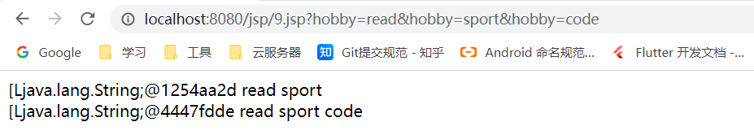

# JavaWeb

## Servlet

### 系统架构模式

1. 系统架构模式

   + C/S 架构（Client / Server）
   + B/S 架构（Browser / Server）

2. C/S 架构

   + C/S架构优点
     + 响应速度快、体验好、安全性较高
   + C/S架构缺点
     + 升级维护比较麻烦

3. B/S 架构

   + B/S架构优点

     + 免安装、升级维护成本小

   + B/S架构缺点

     + 安全性较低、响应速度较慢，体验较差

     

### BS系统架构通信原理

1. web系统访问流程

   + 打开浏览器
   + 输入要访问的地址
   + 按下会回车
   + 等待浏览器展示目标地址的资源

2. 域名/网址

   + https://www.baidu.com/index.html 是一个网址

   + www.baidu.com 是一个域名

   + 一个域名本质上是对应着一个ip地址，反过来说：一个ip地址可以被多个域名映射，但是一个域名只能映射一个ip地址。

     

3. IP地址/端口

   + IP地址，通过一个ip地址可以确定一台计算
   + 端口，通过一个端口可以确定一个服务（应用程序）
   + 通过IP地址+端口就可以确定某台计算机上的某个应用程序

4. 一个web系统的通信流程

   + 打开浏览器输入目标地址（URL）
   + 通过域名解析系统进行域名解析，https://110.242.68.66:80/index.html
   + 浏览器在网络中送搜索 110.242.68.66 这台主机，并且找到他
   + 80 端口得知浏览器想从服务器获取 index.html 这个资源
   + 服务器将 index.html 这个资源返回给浏览器
   + 浏览器收到来自服务器响应的资源（HTML、CSS、JS）
   + 浏览器解析并执行这些代码，最后再渲染出来

   

### WEB服务器

1. 常见的WEB服务器（这些软件都是提前开发好的）

   + tomcat（WEB服务器）
   + jetty（WEB服务器）
   + JBoss（应用服务器）
   + WebLogic（应用服务器）

2. WEB服务器和应用服务器服务器区别

   + 应用服务器实现了JavaEE的所有规范（JavaEE有13个规范）
   + WEB服务器只实现了 Servlet 和 JSP规范
   + 由此可得出：应用服务器中就包含了WEB服务器

3. Tomcat下载

   + [apache官网](https://apache.org/)：https://apache.org/

   + [Tomcat官网](https://tomcat.apache.org/)：https://tomcat.apache.org/

   + Tomcat是一个轻量级的WEB服务器，它是apache基金会下的一款开源产品，特点是：开源免费、体积小（只实现了 Servlet + JSP规范）、运行速度快。

   + Tomcat还有另一个名字：Catalina

   + 要想运行 Tomcat需要JRE，所以先安装一个JDK吧

     + [JDK下载地址](http://www.codebaoku.com/jdk/jdk-oracle-jdk1-8.html)：http://www.codebaoku.com/jdk/jdk-oracle-jdk1-8.html

     + JAVA_HOME = E:\workspace\env\jdk\jdk-17.0.1
     + path中添加：%JAVA_HOME %\bin

4. Tomcat服务器安装和配置

   + 官网下载[Tomcat10.x](https://dlcdn.apache.org/tomcat/tomcat-10/v10.1.6/bin/apache-tomcat-10.1.6.zip)，解压后直接即可。顺便下载一份源码[Tomcat10.x](https://dlcdn.apache.org/tomcat/tomcat-10/v10.1.6/src/apache-tomcat-10.1.6-src.zip)。

   + 启动Tomcat

     + 进入到Tomcat的安装目录下的bin目录下

       ```bash
       # 启动Tomcat服务
       startup.bat
       # 启动之后，在浏览器中输入：http://localhost:8080/ 如果可以看到一只猫，就表示这个服务器启动成功了
       
       # 停止Tomcat服务, 方便记忆修改了一下文件名称 shutdown.bat -> stop.bat
       stop.bat
       ```

     + 浅析一下 startup.bat 目录的执行流程

       + startup.bat 文件中有一行代码

         ```shell
         # 38行 意思大概是： 执行CATALINA_HOME目录下的bin\catalina.bat文件
         set "EXECUTABLE=%CATALINA_HOME%\bin\catalina.bat"
         ```

         

       + 找到 catalina.bat文件，分析一下

         ```bash
         # 238行 告诉我们主类是 org.apache.catalina.startup.Bootstrap
         set MAINCLASS=org.apache.catalina.startup.Bootstrap
         ```

         

       + 阅读org.apache.catalina.startup.Bootstrap 类

         434行 - 513行 可以看到main函数, 而且也有注释标明这就是Tomcat容器启动的入口函数

         ```java
         /**
         * Main method and entry point when starting Tomcat via the providedA scripts.
         *
         * @param args Command line arguments to be processed
         */
         public static void main(String args[]) {
         
             synchronized (daemonLock) {
                 if (daemon == null) {
                     // Don't set daemon until init() has completed
                     Bootstrap bootstrap = new Bootstrap();
                     try {
                         bootstrap.init();
                     } catch (Throwable t) {
                         handleThrowable(t);
                         t.printStackTrace();
                         return;
                     }
                     daemon = bootstrap;
                 } else {
                     // When running as a service the call to stop will be on a new
                     // thread so make sure the correct class loader is used to
                     // prevent a range of class not found exceptions.
                     Thread.currentThread().setContextClassLoader(daemon.catalinaLoader);
                 }
             }
             // ...
         }
         ```

     + Tomcat 目录分析

       + bin：Tomcat命令文件，例如 startup.bat、shutdown.bat 等，bin目录下主要存放两大类：.sh 和 .bat 结尾的文件。
       + conf：Tomcat的配置文件。例如：server.xml中（可以配置Tomcat容器运行的端口，默认8080）。
       + lib：Tomcat核心包，因为Tomcat是纯Java语言编写的，所以 lib 包下也是全部存放的Java文件，只不过这些Java文件被打包成  jar包了。
       + logs：Tomcat的日志文件，记录Tomcat从启动到运行到停止运行的日志信息，如果Tomcat启动失败，可以到logs文件下面排查错误日志信息。
       + temp：Tomcat临时目录，存放一些临时文件。
       + webapps：这是一个很重要的文件夹，我们编写的app应用程序就必须要放在该目录下面，不然Tomcat不会识别你的app应用程序，这是规则必须遵循。
       + work：JSP文件被编译成的Java文件和源Java文件被编译后生成的class文件。

### 编写一个WEBApp应用

1. 编写一个WEBApp应用，运行在部署在Tomcat服务器上面。

   + 在 webapps 目录下新建一个文件夹 ，和项目名称一样（oa ）。

   + 在 oa 目录下新建 一个index.html 文件。

     ```html
     <!DOCTYPE html>
     <html lang="en">
     
         <head>
             <meta charset="UTF-8">
             <meta http-equiv="X-UA-Compatible" content="IE=edge">
             <meta name="viewport" content="width=device-width, initial-scale=1.0">
             <title>First App</title>
         </head>
     
         <body>
             <h2>First App</h2>
         </body>
     
     </html>
     ```

     

   + 浏览器中输入一下地址： http://localhost:8080/oa/index.html，能看到 First App 几个英文字母，就表示OK了。

2. 用a标签来实现 在浏览器中地址栏中输入 URL 的效果。

   + 新建一个 login.html 和 user/test/test.html 文件。

     ```html
     <h2>Login App</h2>
     ```

     ```html
     <h2>Test App</h2> 
     ```

     

   + 在index. html 文件中添加 a 标签。实现页面跳转。

     ```html
     <a href="http://localhost:8080/oa/login.html">Login App Page</a>
     <a href="http://localhost:8080/oa/user/test/test.html">Test App Page</a>
     
     <!-- 使用绝对路径, 注意前面的"/"别漏了,"/"后面跟的是项目名称-->
     <!-- 如果是多层文件夹, 那么按照文件夹层次写即可-->
     <a href="/oa/login.html">Login App Page</a>
     <a href="/oa/user/test/test.html">Test App Page</a>
     ```

3. 动态网页

   + 目前访问的页面都是一些静态网页资源，如何能访问到动态网页呢？（动态网页就是跟随数据库的数据变化而变化，这些数据是动态从数据库查询出来的，不是在htmnl文件中写死的数据），这就牵涉到需要连接数据库了（JDBC）。

   

### BS架构系统角色和协议

+ BS架构系统通信原理详细图

  

  

+ BS架构系统角色和协议

  + BS架构系统相关角色

    + browser 浏览器开发团队，（google、360浏览器，Edge、fireFix...）

    + webserver 服务器开发团队，（Tomcat、Jetty、JBoss，webLogic...）

    + dbservewr 数据库服务器开发团队，（MySql、Oracle、SqlServe、H2...）

    + webapp web应用开发团队

      

  + BS架构系统相关协议

    + 浏览器开发团队 和 服务器开发团队遵循 Http 协议，超本文传输协议。
    + 服务器开发团队 和  web应用开发团队遵循 Servlet 规范，Servlet 规范属于 JavaEE 规范之一。
    + 数据库服务器 和  web应用开发团队遵循 JDBC 规范，JDBC 规范属于 JavaEE 规范之一。

    


### 模拟Servlet本质

1. 充当 Servlet开发者

   ```java
   public interface Servlet {
       void service();
   }
   ```

   

2. 充当web服务器（Tomcat）开发者

   ```java
   public class Tomcat {
       public static void main(String[] args) throws IOException, NoSuchMethodException, ClassNotFoundException, InvocationTargetException, InstantiationException, IllegalAccessException {
           System.out.println("Tomcat 服务器开始运行...");
   
           // 通过Scanner类模拟用户在浏览器中输入URL地址
           Scanner scanner = new Scanner(System.in);
   
           System.out.print("请输入URL地址：");
           String path = scanner.nextLine();
   
           // 通过读取配置文件来解析path和Servlet的对应关系
           Properties properties = new Properties();
           InputStream resourceAsStream = ClassLoader.getSystemClassLoader().getResourceAsStream("web.properties");
           properties.load(resourceAsStream);
   
           // 得到Servlet的全限定名称
           String className = properties.getProperty(path);
   
           // 通过发射加载这个类
           if (!"".equals(className) && className != null) {
               Class<?> aClass = Class.forName(className);
               // 应为我们知道 web服务器和webapp开发者都要实现Servlet规范，这里巧妙利用多态的思想。
               Servlet servletInstance = (Servlet) aClass.getDeclaredConstructor().newInstance();
               servletInstance.service();
           } else {
               System.out.println("错误的URL地址");
           }
       }
   
   ```

   

3. 充当webapp开发者

   ```java
   public class LoginServlet implements Servlet {
       @Override
       public void service() {
           System.out.println("LoginServlet...");
       }
   }
   ```

   ```java
   public class UserListServlet implements Servlet {
       @Override
       public void service() {
           System.out.println("UserListServlet...");
       }
   }
   ```

4. 总结

   + web应用开发者和webapp开发者都应该遵循Servlet规范。
   + Servlet规范这一套规范是提前开发好的，里面的配置文件名称、配置文件路径等等信息在开发的时候已经制定好了。
   + 这就要求webapp开发者不能一定要按照Servlet规范来进行开发，比如：配置文件名称不能乱改、文件路径不能乱发。

### JavaEE和JakartaEE

+ 目前JavaEE的版本是8。
+ JavaEE被Oracle捐献了，Oracle将JavaEE规范捐献给apache了，apache公司就对JavaEE进行改名，叫做 JarkartaEE。
+ JavaEE8版本升级之后的“JavaEE 9”，不再是“JavaEE9”这个名字了，叫做JakartaEE9。
+ Tomcat9-的版本全部使用的是JavaEE，而Tomcat9+使用的是JarkartaEE，可以看Servlet包名就能得出这个结论：
  + Tomcat9- ，Servlet所在包：javax.servlet.Servlet
  + Tomcat10+，Servlet所在包：jakarta.servlet.Servlet（包名都换了）

### 开发一个Servlet应用程序

1. 开发步骤（遵循Servlet规范）

   + 第一步：在Tomcat目录下的 webapps 目录下新建一个文件夹，和项目名称一样，这里叫做：crm

   + 第二步：在 crm 文件夹中新建 WEB-INF 目录，文件夹名称是固定的，不能自己改。

   + 第三步：在 WEB-INF 文件夹下面新建 classes 目录，改目录下用于存Java文件编译之后的字节码文件。

   + 第四步：在 WEB-INF 文件夹下面新建 lib 目录（不是必须的），改目录下存放webpaa依赖的jar包。

   + 第五步：在 WEB-INF 文件夹下面新建 web.xml 文件（建议复制其他文件夹下的web.xml文件，自己手写防止出错），记住，记住文件名称一定是 web.xml，不能自己乱更改。

     ```xml
     <?xml version="1.0" encoding="UTF-8"?>
     <web-app xmlns="https://jakarta.ee/xml/ns/jakartaee"
              xmlns:xsi="http://www.w3.org/2001/XMLSchema-instance"
              xsi:schemaLocation="https://jakarta.ee/xml/ns/jakartaee
                                  https://jakarta.ee/xml/ns/jakartaee/web-app_5_0.xsd"
              version="5.0"
              metadata-complete="true">
     
     </web-app>
     ```

   + 第六步：编写 Servlet 代码，实现具体的业务逻辑功能，将编译之后的class文件放到classes文件夹中就ok了

     ```java
     package com.webapp;
     
     
     import jakarta.servlet.*;
     
     import java.io.IOException;
     
     public class TestServlet implements Servlet {
         @Override
         public void init(ServletConfig servletConfig) throws ServletException {
             System.out.println("TestServlet init...");
         }
     
         @Override
         public ServletConfig getServletConfig() {
             System.out.println("TestServlet getServletConfig...");
             return null;
         }
     
         @Override
         public void service(ServletRequest servletRequest, ServletResponse servletResponse) throws ServletException, IOException {
             System.out.println("TestServlet service...");
         }
     
         @Override
         public String getServletInfo() {
             System.out.println("TestServlet getServletInfo...");
             return null;
         }
     
         @Override
         public void destroy() {
             System.out.println("TestServlet destroy...");
         }
     }
     
     ```

     

   + 第七步：在 web.xml 中注册 Servlet ，目的是配置Servlert 的访问路径关系。

     ```xml
     <?xml version="1.0" encoding="UTF-8"?>
     <web-app xmlns="https://jakarta.ee/xml/ns/jakartaee"
              xmlns:xsi="http://www.w3.org/2001/XMLSchema-instance"
              xsi:schemaLocation="https://jakarta.ee/xml/ns/jakartaee
                                  https://jakarta.ee/xml/ns/jakartaee/web-app_6_0.xsd"
              version="6.0"
              metadata-complete="true">
     
     
         <!-- 注册 Servlet, 一个 Servlet对应一个 servlet-mapping-->
         <servlet>
             <servlet-name>TestServlet</servlet-name>
             <servlet-class>com.webapp.TestServlet</servlet-class>
         </servlet>
     
         <!--
                 servlet-name 名字和上面保持一致就好啦 
                 url-pattern配置映射路径，就是配置浏览器中访问的路径 
             -->
         <servlet-mapping>
             <servlet-name>TestServlet</servlet-name>
             <url-pattern>/test</url-pattern>
         </servlet-mapping>
     </web-app>
     
     ```

     

   + 第八步：浏览器输入：http://localhost:8080/crm/test，进行测试。

     

2. 处理Tomcat控制台乱码

   ```java
   // conf/logging.properties
   // 将UTF-8改成GBK
   java.util.logging.ConsoleHandler.encoding = GBK
   ```

   

3. 向浏览器响应一段HTML代码

   ```java
   // 设置响应类型为文本类型或者html
   servletResponse.setContentType("text/html");
   // 获取输出流 Returns a <code>PrintWriter</code> object that can send character text to the client.
   PrintWriter writer = servletResponse.getWriter();
   writer.flush();
   writer.write("<h2>TestServlet service...</h2>");
   ```


### Servlet中连接数据库

1. 很简单，直接编写连接数据相关代码即可，注意：新的Servlet需要在 web.xml 中注册。

   ```java
   @Override
   public void service(ServletRequest servletRequest, ServletResponse servletResponse) throws IOException {
       servletResponse.setContentType("text/html");
   
       String url = "jdbc:mysql://localhost:3306/javaweb?serverTimezone=UTC&characterEncoding=utf8&useUnicode=true&useSSL=false";
       String username = "root";
       String pwd = "123456";
   
       StringBuilder builder = new StringBuilder();
       try {
           // 注册驱动
           Class.forName("com.mysql.cj.jdbc.Driver");
   
           // 通过DriverManger 获取连接对象
           connection = DriverManager.getConnection(url, username, pwd);
   
           // 获取 PreparedStatement对象
           prepareStatement = connection.prepareStatement("select * from user;");
   
           // 执行sql语句, 处理执行结果
           query = prepareStatement.executeQuery();
           while (query.next()) {
               String id = query.getString("id");
               String account = query.getString("account");
               String password = query.getString("password");
               String createTime = query.getString("create_time");
               builder.append("id = ")
                   .append(id)
                   .append(", account = ")
                   .append(account)
                   .append(", password = ")
                   .append(password)
                   .append(", createTime = ")
                   .append(createTime)
                   .append("<br>");
           }
   
       } catch (ClassNotFoundException e) {
           e.printStackTrace();
       } catch (SQLException e) {
           e.printStackTrace();
       } finally {
           // 关闭资源
       }
   
       // 将信息响应给 客户端
       PrintWriter writer = servletResponse.getWriter();
       writer.write(builder.toString());
       writer.flush();
   }
   ```

   


### Servlet 生命周期

1. 什么是生命周期？

   + 生命周期就是一个对象从创建到销毁经历的一个过程。
   + 简单理解就是：一个人从出生、上小学、成年、结婚...，经历的这一个过程。

2. servlet的生命周期由谁来管理？我们自己new一个servlet对象会被管理servlet容器所管理吗？

   + servlet的生命周期由Tomcat容器来管理的。

   + 我们自己new一个servlet对象不会被Tomcat容器来管理。原因很简单：Tomcat底层应该有一个HashMap来维护 一个servlet的全限定名称和客户端访问地址，我们自己new的servlet对象并没有放到这个集合中，自然不会被tomcat所管理。

     

3. tomcat容器启动时，servlet对象会被实例化吗？

   + tomcat容器启动时，servlet对象不会被实例化。
   + 这个设计也是合理的，如果tomcat容器启动时就把所有的servlet加载到内存中，这样就导致某些servlet压根没被用户访问也被加载在内存中了，这会浪费大量的内存资源。
   + 为了验证这个结果，也可以在servlet中进行代码测试。

4. tomcat容器启动时，怎么可以让某些servlet被加载在内存中呢？

   + 其实我们可以通过 <load-on-startup>0</load-on-startup> 标签来指定servlet加载时机。使用<load-on-startup>0</load-on-startup>标签之后，tomcat启动时会调用servlet的无参构造紧接着就调用init方法

     ```xml
     <servlet>
         <servlet-name>servletA</servlet-name>
         <servlet-class>com.ilovesshan.servlet.ServletA</servlet-class>
         <!--
                 1、告诉tomcat启动时，就把这个servlet对象加载到容器中，
                 2、load-on-startup的值是一个正整数，值越小优先级越高
             -->
         <load-on-startup>0</load-on-startup>
     </servlet>
     <servlet-mapping>
         <servlet-name>servletA</servlet-name>
         <url-pattern>/a</url-pattern>
     </servlet-mapping>
     ```

     

5. Servlet 生命周期是怎么一个过程？

+ tomcat容器启动时：

  + 看是否配置<load-on-startup>0</load-on-startup>标签

+ tomcat容器中的servlet被第一次访问时：

  + servlet构造方法（生命周期中，只会被调用一次，如果容器启动时调用了，那么这一次就不调用了）

  + init 方法被调用（生命周期中，只会被调用一次，如果容器启动时调用了，那么这一次就不调用了）
  + service 方法会被调用一次（生命周期中可能会被调用多次）

+ tomcat容器中的servlet再次被访问时：

  + 客户端再访问一次servlet，那么servlet的service 方法就会被再调用一次，客户端访问100次，service方法也会被调用100次

+ tomcat容器销毁时：

  + destroy 方法被调用（生命周期中，只会被调用一次）

+ 思考：

  + servlet的destroy 方法被调用的时候，servlet还存在于内存中吗？
    + 肯定还是存在内存中的，如果不存在内存中了那还怎么调用destroy方法呢？
  + 这些方法都是被谁调用的呢？
    + 这些方法都是tomcat容器来进行调用的，我们要做的事就是在合适的时机在合适的方法中干合适的事。
  + servlet是单例吗？
    + 通过观察servlet生命周期来看，servlet是一个单例的，但是这个单例并不符合Java规范（Java中的单例模式起码构造器是被私有化了的），这是一个伪单例。
    + 造成伪单例的原因是：tomcat内部管理这个servlet时，并不会多次去构造这个对象，至始至终只有一个实例。
  + servlet的构造方法和init方法都只会被执行一次，先执行构造方法再执行init方法，那么为啥还要设计一个init方法呢？把一些初始化的工作放在构造器中可以吗？
    + 在servlet规范中，不建议我们去显式的去使用构造器做一些初始化工作，原因是：如果构造器使用不正确（写了一个/多个有参构造，就导致默认无参构造被干掉了），此时tomcat就不能正确将servlet实例化，会报错。
    + 在保证构造器正确使用的前提下，可以在构造器做一些初始化工作，但是不推荐，不推荐，我们作为webapp开发者应该尽可能的去遵循servlet规范。

  6. init、service、destroy方法
     + init：使用得便较少，通常做一些初始化操作（只需要初始化一次），比如：初始化数据库连接池，初始化线程池等等...
     + service：用的最多，service方法用来处理具体得业务逻辑
     + destroy：使用得便较少，通常做一些善后得操作，比如：释放资源，关闭数据库连接等等...

### 适配器模式改造Servlet

1. 分析一下现在写的servlet文件有什么不足？

   + 每一个servlet类都是需要实现servlet接口的，servlet接口中一共有5个方法

     ```java
     public interface Servlet {
         void init(ServletConfig var1) throws ServletException;
     
         ServletConfig getServletConfig();
     
         void service(ServletRequest var1, ServletResponse var2) throws ServletException, IOException;
     
         String getServletInfo();
     
         void destroy();
     }
     ```

     

   + servlet接口中这5个方法就只有service是用得最多的。其余四个方法用得很少，可以看到每个实现了servlet接口的类都要实现这5个方法，是不是很不优雅？我就只想用service方法，其余四个基本上不用，换句话说，就没必要实现了。

     ```java
     public class ServletA implements Servlet {
     
         @Override
         public void init(ServletConfig servletConfig) throws ServletException {
         }
     
     
         @Override
         public void service(ServletRequest servletRequest, ServletResponse servletResponse) throws ServletException, IOException {
         }
     
     
         @Override
         public void destroy() {
     
         }
     
     
         @Override
         public ServletConfig getServletConfig() {
             return null;
         }
     
         @Override
         public String getServletInfo() {
             return null;
         }
     
     }
     ```

     

2. 使用适配模式来改造

   + 什么是适配器？
     + 适配器好比一个充电器，我们手机是不能直接插在220v的电线上吧？我们需要一个充电器来做一个适配。
     + 再举个例子：用户新买了一件两孔插座的电器，但是家里只有一个三孔插座，这个时候怎么办呢？可以再买一个插座适配器，来做转化，把适配器插到三孔插座上，用户直接把电器插到适配器即可。

   + 改造servlet采用接口适配器模式，接口适配器模式主要就是使用场景就是：一个接口有很多方法，但是我们仅仅需要使用其中一两个方法，而剩余的方法不使用，不使用的这部分方法及没必要提供实现，那么我们可以定义一个抽象类实现这个接口，将子类需要的方法作抽象方法留给子类实现，而剩余的用的少的那部分方法做一个默认实现即可。

   + 新建一个GenericServlet文件，来充当适配器

     ```java
     public abstract class GenericServlet implements Servlet {
         @Override
         public void init(ServletConfig servletConfig) throws ServletException {}
     
         @Override
         public ServletConfig getServletConfig() {
             return null;
         }
     
         /**
          * 将service方法留给子类去实现
          */
         @Override
         public abstract void service(ServletRequest servletRequest, ServletResponse servletResponse) throws ServletException, IOException;
     
     
         @Override
         public String getServletInfo() {
             return null;
         }
     
         @Override
         public void destroy() {}
     }
     
     ```

     ```java
     // 通过继承GenericServlet类，代码看起来就会优雅很多
     public class ServletA extends GenericServlet {
         @Override
         public void service(ServletRequest servletRequest, ServletResponse servletResponse) throws ServletException, IOException {
             System.out.println("ServletA service方法被调用...");
         }
     }
     ```

     

### GenericServlet改造

1. 通过接口适配器设计模式将Servlet接口改造成了GenericServlet，那么分析一下，GenericServlet还有没有必要再继续改造？如果需要改造，改造的目的是什么？该怎么改造？

   + 先看一下init方法，init放啊有一个ServletConfig类型参数servletConfig，那么这个servletConfig是谁传给我们的呢？很显然，谁调用init方法那么这个参数就是谁传给我我们的，前面已经说了，是tomcat调用的哈！

   + ServletConfig接口

     ```java
     public interface ServletConfig {
         // 获取Servlet名称
         String getServletName();
     
         // 获取Servlet的上下文环境
         ServletContext getServletContext();
     
         // 通过key获取初始化参数值
         String getInitParameter(String var1);
     
         // 获取初始化参数的ley
         Enumeration<String> getInitParameterNames();
     }
     ```

     

   + 模拟一下tomcate调用Servlet对象方法的时机

     ```java
     public class Tomcat {
         public static void main(String[] args) throws Exception {
             // 做一些Tomcat内部初始化工作
     
             // 通过反射创建Servlet实例对象
             Class<?> name = Class.forName("com.ilovesshan.servlet.LoginServlet");
             Servlet loginServlet = (Servlet) name.getDeclaredConstructor().newInstance();
     
             // 创建ServletConfig对象
             ServletConfig servletConfig = new jakarta.servlet.ServletConfig();
     
             // 调用init方法
             loginServlet.init(servletConfig);
     
             // 其他处理...
         }
     }
     ```

   2. init方法被调用时，tomcat会传递过来一个参数servletConfig，但是这个参数只能在init方法中使用，那如果其他方法中也要使用这个对象怎么办？比如：service也要使用这个方法。

      + 其实也很简单，先定义一个私有的成员变量（定义成私有的，体现封装性），再在init方法中进行赋值就ok啦！

        ```java
        public abstract class GenericServlet implements Servlet {
            private ServletConfig servletConfig;
        
            @Override
            public void init(ServletConfig servletConfig) throws ServletException {
                this.servletConfig = servletConfig;
            }
        
            @Override
            public ServletConfig getServletConfig() {
                return null;
            }
        
            // 剩下的方法省略了...
        }
        ```

      + 这个时候 GenericServlet类中的所有方法就都可以使用这个参数啦，妙啊！！，但是子类如果也要使用怎么办？学习Java的权限修饰符可以知道，私有成员只能在本类中访问到，子类就访问不到了，有没有发现 我们实现Servlet接口的时候，实现了一个 getServlketConfig方法，这个方法要求我们返回一个 ServletConfig对象，好巧，这不就是为我们定义的私有成员变量提供了一个getter方法吗？这里会感觉到指定Servlet的开发团队设计真的是巧妙！！

        ```java
        public abstract class GenericServlet implements Servlet {
            private ServletConfig servletConfig;
        
            @Override
            public void init(ServletConfig servletConfig) throws ServletException {
                this.servletConfig = servletConfig;
            }
        
            // 提供了getter方法， 子类也就能够访问了
            @Override
            public ServletConfig getServletConfig() {
                return servletConfig;
            }
        
            // 剩下的方法省略了...
        }
        ```

   3. 这样改造了，貌似init方法中tomcat传递那个参数就都可以使用了，但是有个问题，子类如果在重写了init方法，那么父类的init方法不就被干掉了，那么servletConfig这个线就断了。

      + 很简单，我们可以通过final关键字来限制一下，子类不允许重写这个init方法。

        ```java
        public abstract class GenericServlet implements Servlet {
            private ServletConfig servletConfig;
        
            @Override
            public final void init(ServletConfig servletConfig) throws ServletException {
                this.servletConfig = servletConfig;
            }
        }
        
        ```

        

   4. 某些业务场景下，子类不得不重写init方法怎么办??

      + 我们可以再定义一个无参的init方法，我们在有参数的init方法中来调用这个无参数的init方法，让子类来重写这个无参数的init方法就ok啦！！！

        ```java
        public abstract class GenericServlet implements Servlet {
            private ServletConfig servletConfig;
        
            // final修饰的方法 不允许被子类重写
            @Override
            public final void init(ServletConfig servletConfig) throws ServletException {
                this.servletConfig = servletConfig;
                this.init();
            }
        
            // 该方法提供给子类重写
            public void init() {
            }
        }
        
        ```

   5. 我们经过千辛万苦编写的GenericServlet类，其实jakartaEE已经为我们提供好了，我们只是写了一个简易版本的伪代码，实际上这种思想我们的代码中已经深有体现。


### ServletConfig 详解

1. ServletConfig 是什么？

   + ServletConfig 中文意思：Servlet配置信息

   + ServletConfig 是一个接口，ServletConfig 也是属于Servlet规范之一

   + 一个ServletConfig 本质上是对应 web.xml中的一个 <servlet></servlet>标签中的属性，我们可以通过ServletConfig 来获取这些信息。

     ```xml
     <servlet>
         <servlet-name>aServlet</servlet-name>
         <servlet-class>com.ilovesshan.servlet.ServletA</servlet-class>
         
         <!-- 可能还有其他的属性...  -->
         <load-on-startup>1</load-on-startup>
     </servlet>
     ```

   + 由此可见，一个 <servlet></servlet>标签就会存在一个对应的ServletConfig 对象，web.xml中肯定不止一个 <servlet></servlet>标签吧?那也就意味着，每个servlet中获取到的ServletConfig 对象肯定是不一样的，验证一下结果。在浏览器分别访问两个Servlet。

     

   + 其实可以根据打印信息来判断，这个两个Servlet是不一样的。

     ```tex
     org.apache.catalina.core.StandardWrapperFacade@51a61719
     org.apache.catalina.core.StandardWrapperFacade@3ff56cfb
     ```

2. ServletConfig是谁创建的？是什么时候创建的？

   + ServletConfig对象是tomcat创建的，根据上面打印的信息，可以发现ServletConfig对象就是：org.apache.catalina.core.StandardWrapperFacade类，肯定是StandardWrapperFacade实现了ServletConfig接口。

     ```java
     public final class StandardWrapperFacade implements ServletConfig {}
     ```

   + ServletConfig对象是tomcat调用init之前创建的，因为调用init方法是吧ServletConfig当作方法参数传进去了。

     源码路径： org.apache.jasper.servlet.JspServletWrapper

     ```java
     public Servlet getServlet() throws ServletException {
         if (getReloadInternal() || theServlet == null) {
             synchronized (this) {
                 if (getReloadInternal() || theServlet == null) {
                     destroy();
     
                     final Servlet servlet;
     
                     try {
                         // 通过config配置信息去获取一个Servlet实例对象
                         InstanceManager instanceManager = InstanceManagerFactory.getInstanceManager(config);
                         servlet = (Servlet) instanceManager.newInstance(ctxt.getFQCN(), ctxt.getJspLoader());
                     } catch (Exception e) {
                         Throwable t = ExceptionUtils .unwrapInvocationTargetException(e);
                         ExceptionUtils.handleThrowable(t);
                         throw new JasperException(t);
                     }
                     // 调用servlet的init方法 将config（ServletConfig）作为参数传入
                     servlet.init(config);
     
                     if (theServlet != null) {
                         ctxt.getRuntimeContext().incrementJspReloadCount();
                     }
     
                     theServlet = servlet;
                     reload = false;
                 }
             }
         }
         return theServlet;
     }
     
     ```

     

3. ServletConfig有哪些方法？每个方法有啥作用？

   + getServletName

     + public  String getServletName();

     + getServletName主要获取<servlet-name/>标签中的值

       

   + getServletContext

     + public  ServletContext getServletContext();

     + getServletContext主要获取当前servlet的上下文环境（后面研究）

       

   + getInitParameter 

     + public  String getInitParameter(String var1);

     + getInitParameter 主要获取\<servlet>标签中的配置的参数名称

       

   + getInitParameterNames

     + public  Enumeration\<String> getInitParameterNames();
     + getInitParameterNames主要获取\<servlet>标签中的配置的参数名称对应的值

4. 修改一下web.xml配置文件，验证ServletConfig中的方法。

   ```xml
   <servlet>
       <servlet-name>aServlet</servlet-name>
       <servlet-class>com.ilovesshan.servlet.ServletA</servlet-class>
       <load-on-startup>1</load-on-startup>
       <init-param>
           <param-name>url</param-name>
           <param-value>jdbc:mysql://localhost/userdb</param-value>
       </init-param>
       <init-param>
           <param-name>username</param-name>
           <param-value>ilovesshan</param-value>
       </init-param>
       <init-param>
           <param-name>password</param-name>
           <param-value>1234565</param-value>
       </init-param>
   </servlet>
   
   <servlet-mapping>
       <servlet-name>aServlet</servlet-name>
       <url-pattern>/a</url-pattern>
   </servlet-mapping>
   ```

   ```java
   public class ServletA extends GenericServlet {
       @Override
       public void service(ServletRequest servletRequest, ServletResponse servletResponse) throws ServletException, IOException {
           ServletConfig config = getServletConfig();
           // 获取servlet配置信息
           String servletName = config.getServletName();
           System.out.println("servletName = " + servletName);
           
           Enumeration<String> initParameterNames = config.getInitParameterNames();
           while (initParameterNames.hasMoreElements()) {
               String parameterName = initParameterNames.nextElement();
               // 获取参数名称
               String parameterValue = config.getInitParameter(parameterName);
               // 根据参数名称获取参数值
               System.out.println(parameterName + "=" + parameterValue);
           }
       }
   }
   ```

   

5. 可以发现，GenericServlet抽象类不仅实现了Servlet接口还实现了ServletConfig接口，高兴的是：GenericServlet帮我们实现了ServletConfig接口中的方法，那我们在子类中是不是就可以通过this直接调用ServletConfig接口中的方法啦，不用通过getServletConfig来获取ServletConfig配置信息，因为GenericServlet类中也是通过ServletConfig来调用那些方法的。

   ```java
   public abstract class GenericServlet implements Servlet, ServletConfig, Serializable {
       private static final long serialVersionUID = 1L;
       private transient ServletConfig config;
   
       public String getInitParameter(String name) {
           return this.getServletConfig().getInitParameter(name);
       }
   
       public Enumeration<String> getInitParameterNames() {
           return this.getServletConfig().getInitParameterNames();
       }
   
       public ServletConfig getServletConfig() {
           return this.config;
       }
   
       public ServletContext getServletContext() {
           return this.getServletConfig().getServletContext();
       }
       // ...
   }
   ```

   

### ServletContext 详解

1. ServletContext是什么？

   + ServletContext 也是Servlet规范之一，ServletContext 是一个接口。

   + ServletContext 翻译理解就是：Servlet的一个上下文环境
   + 其实一个ServletContext就好比一个web.xml文件，web.xml中有很多个\<servlet> 和 \<servlet-mapping>标签信息。
   + 一个webapp项目中只存在一web.xml呗，ServletContext那是不是也只有一个呢？后面代码验证！！
   + 再举一个例子：
     + 一个宿舍睡8个人，每个人是一个Servlet对象，那么这间宿舍就是一个ServletContext 
     + 宿舍中的洗漱间，空调，洗衣机大家都是公用的吧？那么放在ServletContext 中的信息或者数据，对于每个Servlet来说也是公用的呗！！

2. ServletContext 是谁创建的？什么时候创建的？

   + ServletContext 也是Tomcat来创建的，org.apache.catalina.core.ApplicationContextFacade接口实现了ServletContext 接口。
   + 创建时机

3. 每个Servlet中的ServletContext 是同一个吗？

   + 一个webapp项目中只存在一web.xml，一个ServletContext就好比一个web.xml文件，由此可得：每个Servlet中的ServletContext 是同一个，也可以通过代码验证。

     

     

4. ServletContext 常用方法

   + String getContextPath();

     +  获取项目的根路径(常用)

     ```java
     ServletContext application = getServletContext();
     String contextPath = application.getContextPath();
     System.out.println("contextPath = " + contextPath);
     // contextPath = /servlet04
     ```

   

   

   

   + String getRealPath(String var1);

     + 获取文件的绝对路径
     +  加 "/"和不加"/"没啥区别（推荐加上，更利于阅读），加不加都是从根路径下出发开始寻找文件

     ```java
     // 获取根目录
     String realPath = application.getRealPath("/");
     System.out.println("realPath = " + realPath);
     
     // 这是一个真实存在的文件
     String realPath1 = application.getRealPath("/pages/index.html");
     System.out.println("realPath1 = " + realPath1);
     
     // 这是一个不存在的文件
     String realPath2 = application.getRealPath("/index.html");
     System.out.println("realPath2 = " + realPath2);
     
     // realPath = E:\workspace\java\JavaWeb\code\out\artifacts\servlet04_war_exploded\
     // realPath1 =E:\workspace\java\JavaWeb\code\out\artifacts\servlet04_war_exploded\pages\index.html
     // realPath2 =E:\workspace\java\JavaWeb\code\out\artifacts\servlet04_war_exploded\index.html
     ```

   

   

   

   + void log(String var1);

   + void log(String var1, Throwable var2);

     + 日志打印方法，该条日志会被记录在tomcat的logs文件夹下面
     +  IDEA存放日志的位置会特殊一点，如果没有通过IDEA运行项目，那么日志信息就会存在Tomcat的logs文件夹下面，IDEA中可以创建多个Tomcat，那么这些日志文件存放的路径和IDEA的目录有关系，具体的存放目录，可以在Tomcat启动时，观察IDEA窗口的日志信息。其中 CATALINA_BASE 就是IDEA存放当前tomcat的一些信息（包括日志）

     + 进到对应文件夹的目录中，有三个文件
       + catalina.2023-03-03.log，和IDEA中启动Tomcat时控制台输出的日志信息一样
       + localhost.2023-03-03.log，Servlet运行中的一些日志信息
       + localhost_access_log.2023-03-03.txt，Tomcat的访问日志信息

   

   

   + String getInitParameter(String var1);

     + 获取servletContext的初始化参数

   + Enumeration\<String> getInitParameterNames();

     + 获取servletContext的全部参数名称

     在web.xml的\<web-app >标签中添加配置信息

     ```xml
     <web-app >
         <context-param>
             <param-name>pageSize</param-name>
             <param-value>10</param-value>
         </context-param>
     
         <context-param>
             <param-name>PageNum</param-name>
             <param-value>1</param-value>
         </context-param>
     </web-app>
     ```

     通过servletContext对象获取相关参数

     ```java
     ServletContext servletContext = getServletContext();
     
     Enumeration<String> initParameterNames = servletContext.getInitParameterNames();
     while (initParameterNames.hasMoreElements()) {
         // 获取参数
         String key = initParameterNames.nextElement();
         String value = servletContext.getInitParameter(key);
         System.out.println(key + " = " + value);
     }
     
     // PageNum = 1
     // pageSize = 10
     ```

     

     

     

   + void setAttribute(String var1, Object var2);

     +  向application中存放数据

   + Object getAttribute(String var1);

     + 从application中获取数据

   + void removeAttribute(String var1);

     + 从application中删除数据

   + Enumeration\<String> getAttributeNames();

     + 从application获取所有的参数名称

     ```java
     // Aservlet 存放数据
     application.setAttribute("userInfo", new User(UUID.randomUUID().toString(), "ilovesshan", "123456"));
     application.setAttribute("tag", "ServletC");
     ```

     ```java
     // BServlet 获取数据
     Enumeration<String> attributeNames = application.getAttributeNames();
     while (attributeNames.hasMoreElements()) {
         // 获取参数(有一部分参数是Tomcat放入的)
         String name = attributeNames.nextElement();
         System.out.println("name = " + name);
     }
     
     
     Object userInfo = application.getAttribute("userInfo");
     Object tag = application.getAttribute("tag");
     
     System.out.println("userInfo = " + userInfo);
     System.out.println("tag = " + tag);
     
     
     // name = userInfo
     // name = org.apache.catalina.resources
     // name = org.apache.catalina.webappVersion
     // name = org.apache.tomcat.InstanceManager
     // name = org.apache.catalina.jsp_classpath
     // name = jakarta.servlet.context.tempdir
     // name = jakarta.websocket.server.ServerContainer
     // name = tag
     // name = org.apache.jasper.compiler.TldCache
     // name = org.apache.tomcat.JarScanner
     
     
     // userInfo = User{uid='53c5d6c3-5a87-4176-8500-52147b32a44f', uname='ilovesshan', upwd='123456'}
     // tag = ServletC
     ```


### Http协议

1. 什么是协议？
   + 协议就是双方都遵循的一个约定，规范！
   + 我说的话你能听懂，你说的话我也能听懂，我们双方都遵循这个协议，都遵循普通话协议。
   
2. http是什么？
   + 超文本是：不仅仅可以传输文本数据，还可以传输图片、音频、视频等等...
   + http是超文本传输协议，也就意味着http不仅仅可以传输文本数据，还可以传输图片、音频、视频等等...
   
3. http协议是什么？
   + Http协议是W3C制定的，主要用于B / S 端的通信协议，B端需要遵循这个协议，当然S端也需要遵循这个协议！
   
4. http协议详解

   + http协议分为两大部分

     + 请求协议，请求协议一共分为四部分

       + 请求头：主要包括第三部分：请求方式、请求URI、请求协议
       + 请求行：主要包括浏览器的一些参数信息，比如：cookie、accept、accept-language、accept-encoding、user-agent...
       + 请求空行：主要用于分割请求行和请求体
       + 请求体：发送给S端的数据

     + 响应协议，响应协议一共分为四部分

       + 响应状态：主要包括第两部分：响应协议、响应状态码

         + [HTTP状态码表](https://blog.csdn.net/m0_46243410/article/details/108323404)

         + 响应状态码：200，表示请求成功
         + 响应状态码：400，表示客户端请求的语法错误，服务器无法理解
         + 响应状态码：404，表示资源未找到，大多数情况是客户端请求路径有误
         + 响应状态码：500，表示服务器程序发生错误
         + 响应状态码：501，表示客户端请求方式有误，例如：服务端需要POST，客户端发送GET

       + 响应头：S端响应给浏览器的头部配置信息比如：Content-Type、Content-Length、Keep-Alive...

       + 响应空行：主要用于分割响应头和响应体

       + 响应体：S端响应给浏览器的数据，浏览器负责编译执行最终展示在界面上

   + 请求协议请求方式分类：

     + HTTP协议的请求方式有八种，分别是OPTIONS、GET、POST、HEAD、PUT、DELETE、CONNECT、TRACE，其中GET和POST最常用。

   + 请求协议中POST和GET区别

     + POST请求：将数据放在请求体中
     + GET请求：将数据会URI后面，通过"?"来衔接
     + 不管是POST还是GET区，他们携带数据的格式都是一样的："key1=values1&key2=values2"
     + 那既然这样，web服务器（tomcat）是不是就可以通过这个格式来处理我们的请求参数了！！妙啊

   + URI和URL区别

     + URI：统一定位资源符
     + URL：统一资源定位器
     + URL可以确定某个资源在网络中的位置，URI仅仅是标识这个资源在服务器中的位置（相对路径），URI并不能确定某个资源在网络中的具体位置
     + 这是一个URL（统一资源定位器）http://localhost:8080/servlet05/postRequest/index.html
     + 这是一个URI（统一资源资源符）/servlet05/postRequest/index.html

5. POST和GET的区别

   + POST请求发送的数据放在请求体，GET请求发送的数据放在请求头的URI后面，通过"?"衔接。
   + POST请求可以发送流媒体文件，比如：音频、视频、图片等等，GET请求只能发送文本数据。
   + W3C中有这样说过：POST请求一般用于向服务器提交数据，GET请求一般用于向服务器获取数据。
   + POST请求发送的数据不受大小限制，GET请求发送的数据会受到浏览器的限制，各个浏览器不同。
     + IE：对URL的最大限制为2083个字符，若超出这个数字，提交按钮没有任何反应。大概是4KB。
     + Firefox：对Firefox浏览器URL的长度限制为：65536个字符，大概是128KB。
     +  Safari：URL最大长度限制为80000个字符，大概是156KB。
     +  Opera：URL最大长度限制为190000个字符，大概是371KB。
     + Chrome：URL最大长度限制为8182个字符，大概是15KB。
   + GET请求是绝对安全的因为GET请求仅仅是从服务端获取资源，如果路径输错了那就意味着获取不到呗，不会对服务器造成啥影响。而POST是要向服务器提交数据的，服务器要对这些数据进行处理，有些情况不能防止用户从后门提交一些数据去攻击服务器，这对服务器来说非常不安全，因此服务端拦截一般都是对POST进行拦截。
   + GET请求有缓存，POST请求没有缓存。
     + GET请求每次请求时、会先看浏览器缓存中有没有缓存，如果有就直接取出来，没有再去服务器请求。相当于每一个GET请求(URL不同)就会对应一个缓存。
     + POST请求不会有缓存，因为POST请求大多数是用于向服务器提交数据。
     + 如何解决GET缓存问题呢？造成缓存原因还不是两个URL相同呗！很简单在URL后面加一个时间戳就好啦！

### 模板方法设计模式

1. 什么是设计模式？

   + 解决问题固定的模板或者套路(代码可以复用)

2. 常见的设计模式有那些？

   + JavaEE设计模式
   + GOF（四人帮，全拼 Gang of Four）设计模式，也就是常听说的23种设计模式

3. 模板方法设计模式

   + 类中提供一个模板，类中的方法（抽取共性，预留不同）可以延迟到子类来实现，这个类一般是抽象类
   + 类中提供一个模板设计方法，定义核心算法骨架（可以用final修饰，让子类不能随便更改核心算法代码）
   + 父类中提供模板并定义核心算法骨架，保留共性将不同的实现延迟到子类去实现。

4. 不使用模板设计模式

   ```java
   public class Student {
   
       /**
        * 定义核心算法骨架，与Teacher类的算法骨架相同
        */
       public void day() {
           getup();
           haveBreakfast();
           work();
           haveDinner();
           sleep();
       }
   
       public void getup() {
           System.out.println("起床了...");
       }
   
       public void haveBreakfast() {
           System.out.println("吃早餐...");
       }
   
       public void work() {
           System.out.println("到教室学习了...");
       }
   
       public void haveDinner() {
           System.out.println("吃晚餐...");
       }
   
       public void sleep() {
           System.out.println("睡觉了...");
       }
   }
   
   
   
   public class Teacher {
   
       /**
        * 定义核心算法骨架，与Student类的算法骨架相同
        */
       public void day() {
           getup();
           haveBreakfast();
           work();
           haveDinner();
           sleep();
       }
   
       public void getup() {
           System.out.println("起床了...");
       }
   
       public void haveBreakfast() {
           System.out.println("吃早餐...");
       }
   
       public void work() {
           System.out.println("到教室给学生上课...");
       }
   
       public void haveDinner() {
           System.out.println("吃晚餐...");
       }
   
       public void sleep() {
           System.out.println("睡觉了...");
       }
   }
   
   ```

   

5. 使用模板设计模式

   ```java
   public abstract class Person {
       /**
        * 定义核心算法骨架，使用final修饰不让子类修改
        */
       public void day() {
           getup();
           haveBreakfast();
           work();
           haveDinner();
           sleep();
       }
   
       public void getup() {
           System.out.println("起床了...");
       }
   
       public void haveBreakfast() {
           System.out.println("吃早餐...");
       }
   
       /**
        * 抽象方法延迟到子类去执行
        */
       public abstract void work();
   
       public void haveDinner() {
           System.out.println("吃晚餐...");
       }
   
       public void sleep() {
           System.out.println("睡觉了...");
       }
   }
   
   ```

   ```java
   public class Student extends Person {
       public void work() {
           System.out.println("到教室学习了...");
       }
   }
   
   ```

   ```java
   public class Teacher {
       public void work() {
           System.out.println("到教室给学生上课...");
       }
   }
   ```

   

### HttpServlet源码分析

1. 目前为止，接触到了那些关于Servlet的接口或者类（抽象类）

   + jakarta.servlet.Servlet（接口）

     + Servlet是一个接口，定义了一系列规范接口

   + jakarta.servlet.GenericServlet（抽象类）

     + 是一个标准的Servlet，GenericServlet实现了Servlet接口，GenericServlet中包含了适配器设计模式（接口适配器设计模式）

   + jakarta.servlet.ServletConfig（接口）

     + Servlet 配置信息（web.xml中\<servlet>标签中的配置）

   + jakarta.servlet.ServletContext（接口）

     + Servlet 上下文环境（相当于web.xml包含的信息配置）

   + jakarta.servlet.ServletRequest（抽象类）

     + Servlet 请求信息

   + jakarta.servlet.ServletResponse（抽象类）

     + Servlet 响应信息

     

2. HttpServlet类主要作用？

   + BS架构的系统中，通信协议是HTTP，而HttpServlet中封装了大量关于HTTP的方法和参数信息
   + 简单理解就是HttpServlet把请求协议中和响应协议中的信息做了一层封装，让webapp开发者获取数据和响应数据更简单
   + HttpServlet类中采用经典设计模式，模板方法设计模式

3. HttpServlet类和Servlet关系？

   ```java
   public interface Servlet{}  // 爷爷
   public abstract class GenericServlet implements Servlet{} // 儿子
   public abstract class HttpServlet extends GenericServlet{} // 孙子
   ```

4. 回顾Servlet生命周期

   + 第一访问Servlet
     + 调用Servlet无参构造方法
     + 调用Servlet的init方法
     + 调用Servlet的service方法
   + 第二访问Servle
     + 调用Servlet的service方法
   + 第三访问Servle
     + 调用Servlet的service方法
   + 第n访问Servle
     + 调用Servlet的service方法
   + Tomcat容器销毁
     + 调用Servlet的destroy方法

   

5. HttpServlet执行流程

   + 定义一个Servlet继承HttpServletRequest

     ```java
     public class HelloServlet extends HttpServlet {}
     ```

   + 构造器调用的执行流程

     ```java
     public abstract class HttpServlet extends GenericServlet {
         // 1、首先调用HttpServlet的无参构造方法
         // 调用HttpServlet的无参构造原因是：HelloServlet没有显式定义无参构造(默认存在一个哈)
         public HttpServlet() {
         }
     }
     
     public abstract class GenericServlet implements Servlet, ServletConfig, Serializable {
         // 2、再调用GenericServlet的无参构造
         public GenericServlet() {
         }
     }
     ```

   + init方法调用的执行流程

     ```java
     // HelloServlet和HttpServlet类中都没重写init方方法，所以直接就调用GenericServlet的init方法(有参数的)
     public abstract class GenericServlet implements Servlet, ServletConfig, Serializable {
         public void init(ServletConfig config) throws ServletException {
             this.config = config;
             // 调用无参数的init方法
             this.init();
         }
     
         // 子类重写最好重写该方法
         public void init() throws ServletException {
         }
     }
     ```

   + service方法调用的执行流程

     ```java
     // HelloServlet类中没有重写service方法
     // GenericServlet类中的service方法作为抽象方法预留给了子类去实现，子类就是HttpServlet
     // 也就意味着，先调用HttpServlet的service(ServletRequest req, ServletResponse res)方法，
     public abstract class HttpServlet extends GenericServlet {    
         public void service(ServletRequest req, ServletResponse res) throws ServletException, IOException {
             HttpServletRequest request;
             HttpServletResponse response;
             try {
                 // 对req和res进行类型转换
                 // HttpServletRequest和HttpServletResponse中封装了大量的关于HTTP协议相关联的信息
                 request = (HttpServletRequest)req;
                 response = (HttpServletResponse)res;
             } catch (ClassCastException var6) {
                 throw new ServletException(lStrings.getString("http.non_http"));
             }
             // 掉用 service(HttpServletRequest req, HttpServletResponse resp)
             this.service(request, response);
         }
     
         // service方法中采用了经典设计模式，模板方法设计模式
         // HttpServlet类是一个模板类，提供了一系列模板方法，doHead()、doPost()、doPut()...
         // service方法就是一个核心算法骨架
         protected void service(HttpServletRequest req, HttpServletResponse resp) throws ServletException, IOException {
             // 获取当前请求的方法，可能是7中请求方法中的一种
             // GET、POST、DELETE、PUT、HEAD、OPTIONS、PATCH
             String method = req.getMethod();
             long lastModified;
             if (method.equals("GET")) {
                 lastModified = this.getLastModified(req);
                 if (lastModified == -1L) {
                     // 如果是GET 就调用 doGet()方法
                     this.doGet(req, resp);
                 } else {
                     long ifModifiedSince;
                     try {
                         ifModifiedSince = req.getDateHeader("If-Modified-Since");
                     } catch (IllegalArgumentException var9) {
                         ifModifiedSince = -1L;
                     }
     
                     if (ifModifiedSince < lastModified / 1000L * 1000L) {
                         this.maybeSetLastModified(resp, lastModified);
                         this.doGet(req, resp);
                     } else {
                         resp.setStatus(304);
                     }
                 }
             } else if (method.equals("HEAD")) {
                 lastModified = this.getLastModified(req);
                 this.maybeSetLastModified(resp, lastModified);
                 // 如果是HEAD则调用 doHead() 
                 this.doHead(req, resp);
             } else if (method.equals("POST")) {
                 // 如果是POST则调用 doPost() 
                 this.doPost(req, resp);
             } else if (method.equals("PUT")) {
                 this.doPut(req, resp);
             } else if (method.equals("DELETE")) {
                 this.doDelete(req, resp);
             } else if (method.equals("OPTIONS")) {
                 this.doOptions(req, resp);
             } else if (method.equals("TRACE")) {
                 this.doTrace(req, resp);
             } else {
                 // 如果不是上述方法中的其中一种，那就抛一个异常呗！！
                 String errMsg = lStrings.getString("http.method_not_implemented");
                 Object[] errArgs = new Object[]{method};
                 errMsg = MessageFormat.format(errMsg, errArgs);
                 resp.sendError(501, errMsg);
             }
     
         }
     }
     
     // 一部分模板方法
     // 如果子类没有重写这些方法，而客户端通过对应的请求方式发送了请求，那么这些方法肯定会被执行，那就直接405了!!
     // 简单理解就是：只要HttpServlet中的这些方法执行了，那就必定405!!
     protected void doPost(HttpServletRequest req, HttpServletResponse resp) throws ServletException, IOException {
         String msg = lStrings.getString("http.method_post_not_supported");
         this.sendMethodNotAllowed(req, resp, msg);
     }
     
     protected void doPut(HttpServletRequest req, HttpServletResponse resp) throws ServletException, IOException {
         String msg = lStrings.getString("http.method_put_not_supported");
         this.sendMethodNotAllowed(req, resp, msg);
     }
     
     protected void doDelete(HttpServletRequest req, HttpServletResponse resp) throws ServletException, IOException {
         String msg = lStrings.getString("http.method_delete_not_supported");
         this.sendMethodNotAllowed(req, resp, msg);
     }
     
     
     private void sendMethodNotAllowed(HttpServletRequest req, HttpServletResponse resp, String msg) throws IOException {
         String protocol = req.getProtocol();
         if (protocol.length() != 0 && !protocol.endsWith("0.9") && !protocol.endsWith("1.0")) {
             resp.sendError(405, msg);
         } else {
             resp.sendError(400, msg);
         }
     }
     ```

   6. 子类可以重写HttpServlet中的service方法吗？
      + 当然可以重写，但是如果重写service方法那就享受不到Http协议501的服务了。
      + 继承HttpServlet时，重写doGet()、doPost()方法，可以有效限制客户端请求方法，例如登录请求使用POST，服务端就之重写了doPost()方法，如果客户端使用其他请求方式那么不好意思，服务端就只能给你405了！！

   

   

### Wbe欢迎页面

1. 什么是Wbe欢迎页面？

   + 访问一个网站/根路径时，默认看到的界面叫做：Wbe欢迎页面！！

2. 在tomcat中如何配置欢迎页面？

   + 通过配置web.xml中的\<welcome-file-list>标签来实现web欢迎界面，\<welcome-file-list>标签可以配置多个欢迎界面，加载顺序从上到下。

     ```xml
     <welcome-file-list>
         <!--如果pages/index.html找不到，则向下找index.html，以此类推-->
         <!-- 注意: 这里配置的路径不加 "/",也不加 "项目名"  -->
         <welcome-file>pages/index.html</welcome-file>
         <welcome-file>index.html</welcome-file>
     </welcome-file-list>
     ```

   + web.xml中的\<welcome-file-list>是局部的，还有一个全局的配置，在apache-tomcat-10.0.23\conf\web.xml中4737行，项目配置的叫做局部，tomcat文件夹下面的叫做全局，查找顺序采用就近原则（先找局部，再看全局，最终找不到就报错了）。

     ```xml
     <welcome-file-list>
         <welcome-file>index.html</welcome-file>
         <welcome-file>index.htm</welcome-file>
         <welcome-file>index.jsp</welcome-file>
     </welcome-file-list>
     ```

3. web欢迎页展示Servlet

   + 新建Servlet类继承HttpServlet抽象类
   + 配置\<servlet> 和    \<servlet-mapping>标签
   + 配置 \<welcome-file-list> 标签

   ```java
   public class HelloServlet extends HttpServlet {
       @Override
       protected void doGet(HttpServletRequest request, HttpServletResponse response) throws ServletException, IOException {
           response.setContentType("text/html");
           PrintWriter responseWriter = response.getWriter();
           responseWriter.write("<h2>this is a web application</h2>");
       }
   }
   ```

   ```xml
   <web-app>
       <welcome-file-list>
           <welcome-file>hello</welcome-file>
       </welcome-file-list>
   
       <servlet>
           <servlet-class>com.ilovesshan.servlet.HelloServlet</servlet-class>
           <servlet-name>hello</servlet-name>
       </servlet>
       <servlet-mapping>
           <servlet-name>hello</servlet-name>
           <!-- 注意: 这里的路径不加 "项目名", 需要加一个 "/"  -->
           <url-pattern>/hello</url-pattern>
       </servlet-mapping>
   </web-app>
   ```


### 关于WEB-INF目录

1. 放入WEB-INF目录下的资源文件，例如：HTML文件、CSS文件、js文件都是不能通过浏览器直接访问，这是tomcat规定的。
2. 通常我们把一些不对外开放（不能直接访问）的资源文件会放到WEB-INF目录下，一些静态资源会放到WEB-INF目录外。

### HttpServletRequest详解

1. HttpServletRequest 是什么？有哪些用途？

   + HttpServletRequest 是一个接口，HttpServletRequest继承了ServletRequest接口。
   + HttpServletRequest 也是Servlet规范的一员。
   + org.apache.catalina.connector.RequestFacade 类实现了HttpServletRequest 接口，可见tomcat也实现了Servlet规范。

2. HttpServletRequest 有哪些常用的方法？

   + 获取客户端提交的数据信息

     ```java
     // 根据name获取value（根据据键获取值）
     public String getParameter(String name) {}
     
     // 获取所有的键
     public Enumeration<String> getParameterNames() {}
     
     // 根据name获取values（根据据键获取值，这个值是一个字符串数组）
     public String[] getParameterValues(String name) {}
     
     // 获取全部的请求参数(键值对)
     public Map<String,String[]> getParameterMap() {}
     
     // 获取query参数
     public String getQueryString() {}
     
     // 获取请求的URL
     public StringBuffer getRequestURL() {}
     
     // 获取请求的URI  带项目名
     public String getRequestURI() {}
     
     // 获取Servlet path  不带项目名
     public String getServletPath() {}
     ```

     

   + 准备一个html文件，并在Servlet中获取这些参数信息。

     ```html
     <!doctype html>
     <html lang="en">
         <head>
             <meta charset="UTF-8">
             <title>USER SUBMIT INFO</title>
         </head>
         <body>
             <h2>Please, Write Your information!!</h2>
             <form action="/servlet07/collect/information?t=123456789" method="post">
                 username: <input name="username" type="text" value="ilovesshan"/>
                 <br>
                 password: <input name="username" type="password" value="ilovesshan@12345"/>
                 <br>
                 hobbies:
                 eat<input name="hobby" checked type="checkbox" value="eat"/>
                 drink<input name="hobby" checked type="checkbox" value="drink"/>
                 play<input name="hobby" checked type="checkbox" value="play"/>
                 sleep<input name="hobby" type="checkbox" value="sleep"/>
                 write code<input name="hobby" type="checkbox" value="write code"/>
                 <br>
                 <input type="submit" value="submit">
             </form>
         </body>
     </html>
     ```

     ```java
     public class UserInformation extends HttpServlet {
         @Override
         protected void doPost(HttpServletRequest request, HttpServletResponse response) throws ServletException, IOException {
     
             String username = request.getParameter("username");
             System.out.println("username = " + username);
     
             Enumeration<String> parameterNames = request.getParameterNames();
             while (parameterNames.hasMoreElements()) {
                 String element = parameterNames.nextElement();
                 System.out.print(element + ",\t");
             }
             System.out.println();
     
     
             String[] hobbies = request.getParameterValues("hobby");
             System.out.println("hobbies = " + Arrays.toString(hobbies));
     
     
             Map<String, String[]> parameterMap = request.getParameterMap();
             Iterator<Map.Entry<String, String[]>> iterator = parameterMap.entrySet().iterator();
             while (iterator.hasNext()) {
                 Map.Entry<String, String[]> next = iterator.next();
                 String key = next.getKey();
                 String[] value = next.getValue();
                 System.out.print(key + "=" + Arrays.toString(value) + ",\t");
             }
             System.out.println();
     
     
             String queryString = request.getQueryString();
             System.out.println("queryString = " + queryString);
     
     
             String requestURI = request.getRequestURI();
             System.out.println("requestURI = " + requestURI);
     
     
             StringBuffer requestURL = request.getRequestURL();
             System.out.println("requestURL = " + requestURL);
         }
     }
     ```

     ```tex
     username = ilovesshan
     
     t,	username,	hobby,	
     
     hobbies = [eat, drink, play]
     
     t=[123456789],	username=[ilovesshan, ilovesshan@12345],	hobby=[eat, drink, play],	
     
     queryString = t=123456789
     
     requestURI = /servlet07/collect/information
     
     requestURL = http://localhost:8080/servlet07/collect/information
     ```

3. 如果客户端向服务端发送数字"100"，那么在服务端收到的数据类型是字符串类型。

4. HttpServletRequest生命周期

   + 一次请求就是一个新的HttpServletReques，请求结束那么这个HttpServletReques就销毁了。
   + 那么HttpServletResponse也和HttpServletReques生命周期一样，一次响应就是一个新的HttpServletReques，响应结束那么这个HttpServletReques就销毁了。

5. servlet也是一个域对象，叫做请求域对象。请求域对象和应用域对象区别？

   + 应用域对象
     + 所有Servlet共享的数据
     + 数据体积比较小
     + 数据基本上不做修改
     + 应用域对象的生命周期是伴随着一个webapp的生命周期的
   + 请求域对象
     + 请求域对象存放的数据仅仅在一次请求中有效。
     + 请求域对象的生命周期是伴随着一个HttpServletRequest的。
   + 请求域对象和应用域对象底层都是维护了一个Map，用来保存数据。
   + 请求域对象和应用域对象都比较适合存储一些轻量级的数据。

6. 向请求域对象中（设置、获取、删除）数据

   + 相关的方法，这些方法来自 ServletRequest接口，HttpServletRequest继承ServletRequest，本质是org.apache.catalina.connecto.RequestFacade 实现HttpServletRequest接口并实现了相关方法。

     ```java
     // 从请求域中获取数据
     Object getAttribute(String var1);
     // 从请求域中删除数据
     void removeAttribute(String var1);
     // 向请求域中放入数据
     void setAttribute(String var1, Object var2);
     ```

     ```java
     public class ServletA extends HttpServlet {
         @Override
         protected void doGet(HttpServletRequest request, HttpServletResponse response) throws ServletException, IOException {
             response.setContentType("text/html;charset=utf-8");
     
             // 向请求域中放入数据
             request.setAttribute("username", "ilovesshan");
             request.setAttribute("userId", UUID.randomUUID().toString());
             request.setAttribute("currentTime", new SimpleDateFormat("yyyy-MM-dd hh:mm:ss").format(Calendar.getInstance().getTime()));
     
     
             // 从请求域中获取数据
             Object username = request.getAttribute("username");
             Object userId = request.getAttribute("userId");
             Object currentTime = request.getAttribute("currentTime");
     
             PrintWriter printWriter = response.getWriter();
     
             printWriter.print("<h2>username = "+ username+"</h2>");
             printWriter.print("<h2>userId = "+ userId+"</h2>");
             printWriter.print("<h2>currentTime = "+ currentTime+"</h2>");
         }
     }
     
     ```

7. 请求转发（一次请求）

   + 请求域对象存放的数仅仅只对一次请求有效，比如：在ServletA中放入数据"username=ilovesshan"，在ServletA中通过Attribute("username")获取数据，没问题肯定可以获取到。但是在ServletB中通过Attribute("username")获取数据那肯定就获取不到啦，因为压根不是同一个请求，因为两个HttpServletRequest不一样（可以写代码试一试！！）。

   + 如果想ServletA中放入的数据在ServletB可以取到，那是不是只要保证两次的请求HttpServletRequest 是同一个就可以啦？？想一下从下面这种方法可以吗？？

     ```java
     public class ServletA extends HttpServlet {
         @Override
         protected void doGet(HttpServletRequest request, HttpServletResponse response) throws ServletException, IOException {
             // 向请求域中放入数据
             request.setAttribute("username", "ilovesshan");
     
             // new一个ServletB实例
             // 再调用ServletB实例的doGet()方法，把当前这个request和response传进去不就好了吗？
             ServletB servletB = new ServletB();
             servletB.doGet(request,response);
         }
     }
     
     ```

     答案是：不可以的，因为我们自己new的Serevlet不受Tomcat容器管理，不受Tomcat容器管理也就意味着没有标准Servlet处理和响应请求的能力。当你写下 new ServletB();就错了，输在了起跑线，Servlet我们不能自己new，自己new的Servlet和一个普通类区别不大。

   + 说到底，我们还是要通过请求转发的技术来实现这种需求！！

     ```java
     // ok 一行代码搞定
     // "/b" 就是再 web.xml中 <url-pattern>标签配置的值
     // request, response 当前这次请求的请求对象和响应对象
     request.getRequestDispatcher("/b").forward(request, response);
     ```

   + 请求转发的目标地址不一定是Serevlet，也可以是一个html/jsp文件。

     ```java
     request.getRequestDispatcher("/index.html").forward(request, response);
     ```

     

8. 请求乱码问题

   + tomcat10.x
     + 请求（数据包含中文）：POST 无乱码、GET 无乱码
     + 响应（数据包含中文）：无乱码

   + tomcat9.x 、tomcat8.x 

     + 请求（数据包含中文）：POST 乱码、GET 无乱码
     + 响应（数据包含中文）：乱码

   + 解决POST请求乱码问题（tomcat9.x之前，包括9.x）

     ```java
     // 设置请求体的字符集
     request.setCharacterEncoding("utf-8");
     ```

   + 解决响应乱码问题（tomcat9.x之前，包括9.x）

     ```java
     // 设置响应字符集
     response.setContentType("text/html;charset=utf-8");
     ```

   + tomcat6.x之前
   
     + 请求（数据包含中文）：POST 乱码、GET 乱码
     + 响应（数据包含中文）：乱码
   
   + tomcat6.x之后，处理了GET请求乱码问题
   
     + apache-tomcat-10.0.23\confserver.xml中
   
       ```xml
       <!-- tomcat6.x之前 URIEncoding 默认是 "ios-8859-1"-->
       <!-- tomcat6.x之后 URIEncoding 默认是 "utf-8"-->
       <Connector port="8080" protocol="HTTP/1.1"
                  connectionTimeout="20000"
                  redirectPort="8443" />
       ```
   
       

### 纯Servlet单表增删改查

1. 功能分析

   + 欢迎界面
   + 部门列表展示
   + 新增部门
   + 删除部门
   + 修改部门
   + 查询部门

2. 准备数据库sql文件

   ```sql
   drop table if exists dept;
   create table dept(
       id int primary key,
       name varchar(30),
       address varchar(255),
       minister_name varchar(3),
       minister_phone varchar(11)
   );
   
   insert into 
   	dept 
   values
       (1, '研发部', '成都', '张三', '13145786541'),
       (2, '销售部', '北京', '李四', '15321547788'),
       (3, '后勤部', '上海', '王五', '15987845511'),
       (4, '宣传部', '上海', '赵六', '18154578823');
   
   select id, name, address, minister_name, minister_phone from dept;
   ```

   

3. 准备前端界面代码

   + iindex.html （首页）
   + list.html（部门列表）
   + add.html（新增部门）
   + update.html（更新部门）
   + detail.html（部门详情）

4. 搭建oa项目

   + 搭建webapp工程

   + 导入相关jar包

     + mysql-connector-java-8.0.26.jar
     + servlet-api.jar

   + 编写数据库工具类

     ```properties
     # src目录平级新建 jdbc.properties
     driver=com.mysql.cj.jdbc.Driver
     url=jdbc:mysql://localhost:3306/javaweb?serverTimezone=UTC&characterEncoding=utf8&useUnicode=true&useSSL=false
     username=root
     password=123456
     ```

     ```java
     public class DBUtil {
         private static final ResourceBundle resourceBundle = ResourceBundle.getBundle("jdbc");
         private static final String driver = resourceBundle.getString("driver");
         private static final String url = resourceBundle.getString("url");
         private static final String username = resourceBundle.getString("username");
         private static final String password = resourceBundle.getString("password");
     
         static {
             try {
                 Class.forName(driver);
             } catch (ClassNotFoundException e) {
                 e.printStackTrace();
             }
         }
     
         public Connection getConnection() throws SQLException {
             return DriverManager.getConnection(url, username, password);
         }
     
         public void close(Connection conn, Statement stat, ResultSet res) {
             if (res != null) {
                 try {
                     res.close();
                 } catch (SQLException e) {
                     e.printStackTrace();
                 }
             }
     
             if (stat != null) {
                 try {
                     stat.close();
                 } catch (SQLException e) {
                     e.printStackTrace();
                 }
             }
     
             if (conn != null) {
                 try {
                     conn.close();
                 } catch (SQLException e) {
                     e.printStackTrace();
                 }
             }
         }
     }
     ```
   
5. 编写Servlet功能实现

   + DeptAddServlet：添加部门
   + DeptDeleteServlet：删除部门
   + DeptDetailServlet：查询部门详情
   + DeptListServlet：查询部门列表
   + DeptUpdateServlet：更新部门

### 深度剖析请求转发和重定向

1. 请求转发和重定向

   + 代码上

     + 请求转发（ 服务器内部行为）

       ```java
       // 路径直接填写 web.xml中 对应servlet的<url-pattern> 标签值即可
       // 调用forward方法将request,response对象传递给下一个servlet，保证两个servlet的request和response对象是同一个
       request.getRequestDispatcher("/oa/a").forward(request,response);
       ```

       

     + 重定向（浏览器行为）

       ```java
       // 这是一个浏览器的行为
       // 填写的路径需要带上项目名称和web.xml中 对应servlet的<url-pattern>值
       response.sendRedirect("/servlet01/oa/a");
       ```

       

   + 行为上

     + 请求转发
       + 服务器内部行为
       + 只发送一次请求
       + 浏览的标题不会发生变化
     + 重定向
       + 浏览器行为
       + 发送两个次请求
       + 浏览的标题会发生变化

2. 请求转发和重定向的使用场景

   + 请求转发：在当前请求域中存入数据，如果下个servlet中需要使用到当前域存放的数据情况下那就用请求转发。
   + 重定向：上诉情况除外都可以用重定向。

3. 请求转发和重定向区别总结

   + 请求转发一次请求，重定向两次请求
   + 请求转发服务器行为，重定向浏览器行为
   + 请求转发地址栏不会发生变化，重定向地址栏会发生变化
   + 请求转发存在缓存，重定向不存在缓存

### Servlet注解简化开发配置

1. 为什么需要注解？

   + 在oa项目中，仅仅是一个单表的crud就在web.xml中配置了一大堆，随着项目功能复杂。那这个文件不得撑爆？？
   + 那么我们可以通过注解来简化这一系列配置，注解的出现，不是代表web.xml没用了，而是仅仅起到简化配置的，提高开发效率的效果。
   + 一般情况下，一些配置属性是固定不变的我们可以考虑使用注解，如果是需要动态变化的，还是建议使用xml。

2. WebServlet注解如何使用？

   ```java
   // 元注解信息
   @Target({ElementType.TYPE})
   @Retention(RetentionPolicy.RUNTIME)
   @Documented
   public @interface WebServlet {
   
       // servlet名称 等同于 <servlet-name>xxx</servlet-name>
       String name() default "";
   
       // servlet映射路径 等同于 <url-pattern>xxx</url-pattern>
       // 这一个字符数组，可以配置多个t映射路径
       // value = {"/a"}
       // value = {"/a", "/b", "/c"}
       String[] value() default {};
   
       // 和 value() 一样的效果
       String[] urlPatterns() default {};
   
       // 指定 servlet加载时机 等同于 <load-on-startup>xxx</load-on-startup>
       int loadOnStartup() default -1;
   
       // WebInitParam也是一个注解 设置servlet初始化参数 
       // 等同于 <init-param>xxx</init-param> 中配置的信息
       WebInitParam[] initParams() default {};
   
       boolean asyncSupported() default false;
   
       String smallIcon() default "";
   
       String largeIcon() default "";
   
       // servlet 描述信息
       String description() default "";
   
       String displayName() default "";
   }
   ```

   ```java
   @Target({ElementType.TYPE})
   @Retention(RetentionPolicy.RUNTIME)
   @Documented
   public @interface WebInitParam {
       // 初始化参数 name
       // 等同于 <param-name>uanme</param-name>
       String name();
   
       // 初始化参数 value
       // 等同于 <param-value>upwd</param-value>
       String value();
   
       // 初始化参数 描述信息
       // 等同于 <description>xxx</description>
       String description() default "";
   }
   ```

3. 通过反射机制获取自定义注解信息

   ```java
   @Target(ElementType.TYPE)
   @Retention(RetentionPolicy.RUNTIME)
   @Documented
   public @interface MyAnnotation {
       String value() default "";
       String[] paths();
   }
   ```

   ```java
   @MyAnnotation(value = "jack", paths = {"/abc", "/def"})
   public class AnnotationTest {
       public static void main(String[] args) throws ClassNotFoundException {
           Class<?> aClass = Class.forName("com.test.code.AnnotationTest");
           boolean hasAnnotation = aClass.isAnnotationPresent(MyAnnotation.class);
           if (hasAnnotation) {
               MyAnnotation annotation = aClass.getAnnotation(MyAnnotation.class);
               String value = annotation.value();
               String[] paths = annotation.paths();
               System.out.println("value = " + value);
               System.out.println("paths = " + Arrays.toString(paths));
           }
       }
   }
   ```

   

### 模板设计模式解决Servlet类爆炸

1. 为什么要改造？

   + 一个单表的crud就写了5个Servlet类，随着项目功能复杂，那这个项目中Servlet会变得越来越臃肿！！，而且后期要维护会很麻烦。
   + 我们应该按照：一个业务模块（功能）对应一个Servlet，至于这个业务模块（功能）中的具体逻辑就在这个Servlet中处理就好了，没必要写很多个Servlet。
   + 鉴于这个想法，我们就来改造一下oa项目

2. 对Servlet进行改造

   + 使用注解对Servlet进行改造
   + 使用模板设计模式对Servlet进行改造

   ```java
   // 匹配以项目名称/dept/下的任意路径
   @WebServlet(urlPatterns = "/dept/*")
   public class DeptServlet extends HttpServlet {
   
       // 重写service()方法原因是 我们不清除过来的请求是 POST还是GET 这里干脆就直接重写service()方法！！
       @Override
       protected void service(HttpServletRequest req, HttpServletResponse resp) throws ServletException, IOException {
   
           String requestURI = req.getRequestURI();
   
           if (requestURI.contains("/dept/list")) {
               handleList(req, resp);
           } else if (requestURI.contains("/dept/delete")) {
               handleDelete(req, resp);
           } else if (requestURI.contains("/dept/add")) {
               handleAdd(req, resp);
           } else if (requestURI.contains("/dept/detail")) {
               handleDetail(req, resp);
           } else if (requestURI.contains("/dept/update")) {
               handleUpdate(req, resp);
           }
   
       }
   
       private void handleUpdate(HttpServletRequest req, HttpServletResponse resp) {
           // 负责具体的业务实现
       }
   
       private void handleDetail(HttpServletRequest req, HttpServletResponse resp) {
           // 负责具体的业务实现
       }
   
       private void handleAdd(HttpServletRequest req, HttpServletResponse resp) {
           // 负责具体的业务实现
       }
   
       private void handleDelete(HttpServletRequest req, HttpServletResponse resp) {
           // 负责具体的业务实现
       }
   
       private void handleList(HttpServletRequest req, HttpServletResponse resp) {
           // 负责具体的业务实现
       }
   }
   
   ```


### 纯Servlet开发项目的问题

1. 前端代码和java代码耦合在一起，不利于维护。
2. 前端代码在编写的时候很难发现错误，因为在后端代码中这些前端代码就是一串字符串。
3. 前端代码运行过程中，如果发现错误，那么需要后端代码重新编译打包，这一过程很繁琐。

### 	BS架构中Session机制

1. 什么是会话？

   + 会话是一种机制，我们也叫做Session。

   + Session存储在服务器端，我们也叫做Session域对象，在服务端获取Session对象也很简单，通过 Requets对象获取Session

     ```java
     // 如果从Requets对象中没有获取到Session对象，那就新建一个Session对象并返回
     HttpSession session = req.getSession();
     
     //如果从Requets对象中没有获取到Session对象，那就返回一个null
     HttpSession session = req.getSession(false);
     ```

   + 当打开浏览器之后，进行了各种操作，浏览商品，发表评论，添加到购物车，购买商品，支付订单，然后关闭浏览器。那么从浏览器打开到关闭这一次过程我们叫做会话。

   + 和打电话一样：从接通到挂断的这过程中，我们就叫做这是一次会话，在这次通话过程中，对方是不是一直知道你是谁？对不对？对方是能够识别你的身份的，基于这点，那么session的设计就由此而来，session可以保证同一个会话中session对象是相同的（为什么相同，下面会说到）。

   + 保证是同一个会话，那只要我保证浏览器不关闭就好了吧？？我们之前学习过请求域对象和全局域对象，这两个域对象都有setAttrubite()、getAttribute()、removeAttribute()方法，高兴的是Session会话域对象也有这几个方法，基于这点，我们是不是就可以通过Session对象来维持一个状态（用户登录状态）。

   + 例如oa系统中，访问非登录界面，先从session中查有没有用户登录的信息，如果没有表示没登录，那就直接回到登录界面，如果有信息，表示登录了，那就让用户继续操作吧！

2. 会话和请求区别？

   + 会话在服务端称之为Session对象，请求在服务端称之为Request对象

   + 会话是浏览器从开启到关闭的这个过程，这个过程中可能会有多次请求。
   + 一个会话包含多次请求，一个会话包含N次请求。

3. 为什么要使用会话来保存状态？

   + BS架构中，BS两端都要遵循HTTP协议，Http请求其实是无状态的。
     + 什么是无状态：用户发起请求一次这一瞬间，会和服务器建立连接（通道），那么请求结束之后这个连接（通道）就断开了，为什么是无状态？因为每个请求都是独立的，发起请求建立连接，请求结束就断开。
     + 设计成无状态的原因：为了减轻服务器压力，要是不断开，一个网站10000人来访问，那岂不是要开10000的连接，这对服务器来说压力太大了！！
   + 上面分析了使用请求域对象来保存状态不行，那么使用应用域对象呢？
     + 应用域对象是全局共享的，服务器启动这个应用域对象就被创建了，知道服务器关闭这个应用域对象才被销毁。
     + 全局共享必定会出问题吧？张三登录了，我们把状态放在个应用域对象中，那么李四过来一查，哦！应用域对象中有信息，那李四你也登录了，继续操作吧？这样不是出问题了！！万一是一个购物网站，那不是乱成一锅了！
   + 请求域对象、应用域对象都不适合，Session对象就刚好来处理这种问题，只要浏览器不关，那么服务端都是可以识别到你的身份的。浏览器关闭再打开再请求，再服务端又会是一个新的Session对象。

4. Session实现原理？

   + 打开浏览器，访问服务端。
   + 服务端通过Rquest对象获取Session，获取不到那就新建一个Session对象，并为其生成一个SeesionID（Cookie机制，后面会说），用来标记当前Session，内部使用一个Map对象来保存Session信息，然后将这个SeesionID返回给浏览器
   + 浏览器保存这个SessionID在内存中，下次再请求时就带上这个SessionID
   + 浏览器发送第二次(N)次请求，携带上SessionID，服务端就可以根据SessionID到Map对象中找到对应的Session对象，找到了Session对象那就可以确定身份了！
   + 浏览器关闭之后，存在内存中的SessionID自然也就被干掉了，那么下次再打开浏览器发送请求，之前那个SessionID已经没有了，那么服务器又会给你新建一个Session对象，分配一个SessionID。

5. 禁用cookie怎么解决？

   + 禁用cookie是浏览器禁用的哈，并不是服务端不发送SessionID过来了，只是服务端照常发送但是浏览器不接收了。

   + 要是浏览器不接收，那么也就意味着每次发送的请求携带的SessionID就为空了，那么每次发请求，服务端也就会新生成一个Session对象。

   + 解决禁用cookie问题

     + 通过重写URL：

       ```tex
       http://localhost:8080/servlet09/session-test;jsessionid=59CF5C0E7DA3F151B270D0A3009CBA41
       ```

     + 要是浏览器禁用cookie了，那就别使用该系统了！！

6. 回顾一下我们学习到了那些域对象？有什么相同点，不同点？？

   + 三个域对象
     + 请求域对象 request（HttpServletRequest）
     + 会话域对象 session （HttpSession）
     + 应用域对象 application（ServletContext）

   + 作用范围

     request（请求级别） < session（用户级别） < application（应用级别）

   + 使用原则

     尽量使用小的域

   + 相同点

     + 都有三个共同的常用的方法：setAttrubite()、getAttribute()、removeAttribute()。
     + 可以在域中存储一些轻量级数据。

   + 不同点

     + 生命周期不同
       + request 一次请求
       + session 一次会话
       + application 服务器关闭
     + 使用场景不同

7. Session时效和手动销毁Session

   + Session默认时效是 30 分钟

     + 在tomcat安装目录/conf/web.xml中有默认配置

       ```xml
       <!-- ==================== Default Session Configuration ================= -->
       <!-- You can set the default session timeout (in minutes) for all newly   -->
       <!-- created sessions by modifying the value below.                       -->
       
       <session-config>
           <session-timeout>30</session-timeout>
       </session-config>
       
       ```

     + 页可以在项目的web.xml中手动配置

       ```xml
       <session-config>
           <!-- 设置Session会话时效为 60分钟 -->
           <session-timeout>60</session-timeout>
       </session-config>
       ```

       

       

   + 手动销毁Session

     ```java
     session.invalidate();
     ```

     

8. 使用Session对oa项目进行升级

   UserServlet

   ```java
   if (success) {
       // 登录成功
       HttpSession session = req.getSession();
       session.setAttribute("username", username);
       resp.sendRedirect(req.getContextPath() + "/dept/list");
   } else {
       // 登录失败
       resp.sendRedirect(req.getContextPath() + "/login-error.jsp");
   }
   ```

   UserServlet

   ```java
   HttpSession session = req.getSession(false);
   if (session != null && session.getAttribute("username") != null) {
       // 已经登录，继续处理业务逻辑
   } else {
       // 没有登录，重定向去首页(登录界面)
       resp.sendRedirect(req.getContextPath() + "/index.jsp");
   }
   ```


### Cookie

1. 什么是Cookie？

   + 回顾一下Session的执行流程，浏览器第一次访问服务器的时候，服务端会返回一个JSESSIONID，例如：

     ```
     Set-Cookie: JSESSIONID=91CD8DD5E86334382EC828B33DF8142C; Path=/servlet09; HttpOnly
     ```

   + 其实这一串：JSESSIONID=91CD8DD5E86334382EC828B33DF8142C字符串就是一个cookie对象。

   + 当然这一串字符串，我们可以在服务端进行操作，Java服务端有一个Cookie对象可以来操作Cookie相关信息。

   + 浏览器携带Cookie机制：在HTTP协议中，浏览器访问服务端时，默认会携带上对应path下的Cookie信息到服务端。

2. Cookie和Session关系

   + Cookie和Session技术并不属于服务端（Java、php）等等，确切的说他们两应该属于Http协议的一部分。
   + Cookie和Session可以说是相辅相成，Cookie和Session都可以用来保存状态。
   +  Cookie保存在浏览器。
     + 存在磁盘上
     + 存在内存中
   + Session保存在服务器。

3. Cookie使用场景（案例）

   + 购物网站，不登录也可以将商品添加到购物车，关闭浏览器再次打开时任然可以看到购物车的商品。
     + 可以在Cookie中保存购物车的商品信息，并把Cookie持久化存在磁盘上。关闭浏览器并不影响Cookie信息。
     + 再次打开浏览器时，如果要看购物车，那就通过Cookie中保存的商品信息去服务端查询一下，做个展示即可！！
   + 十天免登录。
     + 可以在服务端通过设置Cookie的过期时间，来实现这个功能！

4. Java中操作Cookie对象

   + 服务端操作Cookie对象，并响应给浏览器。

     ```java
     // 传递一个key和value 
     Cookie cookie = new Cookie("UUID", UUID.randomUUID().toString());
     resp.addCookie(cookie);
     ```

     

   + 设置cookie过期时间

     ```java
     // 单位 秒
     cookie.setMaxAge(int expiry);
     ```

     + 过期时间大于0，会将cookie保存在磁盘中。
     + 过期时间等于0，删除cookie，删除同名的cookie。
     + 过期时间小于0，和不设置过期时间效果一样，session会被保存在内存中。

   + 设置cookie关联path

     + http://localhost:8080/servlet09/session-test，默认会关联到http://localhost:8080/servlet09/以及该路径的子路径下

     + 手动设置关联path

       ```java
       cookie.setPath(req.getServletPath());
       ```

     

   + 服务端获取浏览器携带的cookie信息。

     ```java
     // 获取浏览器传递的cookie
     // 如果获取不到会返回null, 获取到了返回一个Cookie数组
     Cookie[] cookies = req.getCookies();
     if (cookies != null) {
         for (Cookie cookie : cookies) {
             String name = cookie.getName();
             String value = cookie.getValue();
             System.out.println(name + " = " + value);
         }
     }
     // JSESSIONID = 35E1E77EB167CD6AE9B488843F549F1F
     // UUID = 9d9a1f43-ad4e-4b78-b92c-5b4bc5124d58
     ```

5. 使用Cookie实现oa系统10天免登录！！


## Jsp

### jsp简介和能解决什么问题

1. jsp（java server page），Java服务端页面，Jsp是一个翻译引擎！！
2. Jsp是一个规范，是JavaEE的13个规范之一。
3. 分析了纯Servlet开发项目带来的问题之后，我们试想：要是有一个机器能够帮助我们将这部分前端代码按照一定的规则翻译再进行编译，最终变成Java代码，那岂不是避免了纯Servlet开发项目带来的问题，可以减轻很大的工作量！
4. 其实Jsp技术的出现，就是来解决这个问题的。

### jsp编译过程和原理

1. 我们写的index.jsp/a.jsp文件会通过一定的规则被翻译成java文件，之后再由Jvm虚拟机翻译成字节码文件，换句话说：jsp文件本质就是Java文件。

2. jsp编译过程

   + 新建index.jsp文件
   + 浏览器输入地址访问index.jsp文件
   + index.jsp文件被编译成一个index_jsp.java文件
   + Jvm将这个index_jsp.java文件编译成字节码文件index_jsp.class，再加载到内存中
   + 浏览器本质访问的就是这个字节码文件

3. Jsp编译原理

   + 编写index.jsp，浏览器访问之后会在 "IDEA默认生成的目录\work\Catalina\localhost\jsp\org\apache\jsp" 生成两个文件，一个是Java源文件（ index_jsp.java）另一个是字节码文件（ index_jsp.class）。路径不清楚可以在IDEA控制台中观察 Using CATALINA_BASE对应的值。

   + 分析一下  index_jsp.java 文件

     ```java
     // index_jsp 继承了 HttpJspBase类
     public final class index_jsp extends org.apache.jasper.runtime.HttpJspBase
         implements org.apache.jasper.runtime.JspSourceDependent,
     org.apache.jasper.runtime.JspSourceImports {
     
     }
     
     // HttpJspBase 继承了HttpServlet
     public abstract class HttpJspBase extends HttpServlet implements HttpJspPage {}
     ```

   + 可以得出结论：Jsp文件本质是Servlet，Servlet拥有的生命周期Jsp也照样拥有，Jsp也是一个单例(假单例)，简单看一下 HttpJspBase类。

     ```java
     public abstract class HttpJspBase extends HttpServlet implements HttpJspPage {
         // 无参构造
         protected HttpJspBase() {
         }
     
         // init
         @Override
         public final void init(ServletConfig config)
             throws ServletException
         {
             super.init(config);
             jspInit();
             _jspInit();
         }
     
         @Override
         public String getServletInfo() {
             return Localizer.getMessage("jsp.engine.info", Constants.SPEC_VERSION);
         }
     
         @Override
         public final void destroy() {
             jspDestroy();
             _jspDestroy();
         }
     
         /**
          * service 方法切入点
          * Entry point into service.
          */
         @Override
         public final void service(HttpServletRequest request, HttpServletResponse response)
             throws ServletException, IOException
         {
             _jspService(request, response);
         }
         // ...
     }
     ```

   + 刚刚说了，Jsp文件会被编译成Java文件，再编译成字节码文件加载到内存中,我们再Jsp文写入的内容，被编译成Java文件之后，是怎样一个形态呢？

     + index.jsp

       ```html
       <!DOCTYPE html>
       <html lang="en">
           <head>
               <meta charset="UTF-8">
               <meta http-equiv="X-UA-Compatible" content="IE=edge">
               <meta name="viewport" content="width=device-width, initial-scale=1.0">
               <title>JSP Page</title>
           </head>
           <body>
               <h2>Jsp Page!!</h2>
           </body>
       </html>
       ```

       

     + index_jsp.class

       ```java
       // 其他方法省略了，这里主要看service代码执行过程
       public void _jspService(final jakarta.servlet.http.HttpServletRequest request, final jakarta.servlet.http.HttpServletResponse response)
           throws java.io.IOException, jakarta.servlet.ServletException {
       
           if (!jakarta.servlet.DispatcherType.ERROR.equals(request.getDispatcherType())) {
               final java.lang.String _jspx_method = request.getMethod();
               // 方法判断
               if ("OPTIONS".equals(_jspx_method)) {
                   response.setHeader("Allow","GET, HEAD, POST, OPTIONS");
                   return;
               }
       
               if (!"GET".equals(_jspx_method) && !"POST".equals(_jspx_method) && !"HEAD".equals(_jspx_method)) {
                   response.setHeader("Allow","GET, HEAD, POST, OPTIONS");
                   response.sendError(HttpServletResponse.SC_METHOD_NOT_ALLOWED, "JSP 只允许 GET、POST 或 HEAD。Jasper 还允许 OPTIONS");
                   return;
               }
           }
       
           final jakarta.servlet.jsp.PageContext pageContext;
           jakarta.servlet.http.HttpSession session = null;
           final jakarta.servlet.ServletContext application;
           final jakarta.servlet.ServletConfig config;
           jakarta.servlet.jsp.JspWriter out = null;
           final java.lang.Object page = this;
           jakarta.servlet.jsp.JspWriter _jspx_out = null;
           jakarta.servlet.jsp.PageContext _jspx_page_context = null;
       
       
           try {
               // 设置响应字符编码(注意这里没指定字符串，出现中文会乱码)
               response.setContentType("text/html");
               pageContext = _jspxFactory.getPageContext(this, request, response,
                                                         null, true, 8192, true);
               _jspx_page_context = pageContext;
               application = pageContext.getServletContext();
               config = pageContext.getServletConfig();
               session = pageContext.getSession();
               out = pageContext.getOut();
               _jspx_out = out;
       
               // 这部分代码是不是和纯Servlet的oa项目一模一样??当时我们也是这么干的!!
               // 当我们用了Jsp之后，这部分代码由机器帮我们干了
               //**************************************************************************
               out.write("<!DOCTYPE html>\n");
               out.write("<html lang=\"en\">\n");
               out.write("<head>\n");
               out.write("    <meta charset=\"UTF-8\">\n");
               out.write("    <meta http-equiv=\"X-UA-Compatible\" content=\"IE=edge\">\n");
               out.write("    <meta name=\"viewport\" content=\"width=device-width, initial-scale=1.0\">\n");
               out.write("    <title>JSP Page</title>\n");
               out.write("</head>\n");
               out.write("<body>\n");
               out.write("<h2>Jsp Page!!</h2>\n");
               out.write("</body>\n");
               out.write("</html>");
               //**************************************************************************
           } catch (java.lang.Throwable t) {
               if (!(t instanceof jakarta.servlet.jsp.SkipPageException)){
                   out = _jspx_out;
                   if (out != null && out.getBufferSize() != 0)
                       try {
                           if (response.isCommitted()) {
                               out.flush();
                           } else {
                               out.clearBuffer();
                           }
                       } catch (java.io.IOException e) {}
                   if (_jspx_page_context != null) _jspx_page_context.handlePageException(t);
                   else throw new ServletException(t);
               }
           } finally {
               _jspxFactory.releasePageContext(_jspx_page_context);
           }
       }
       }
       ```

     + 解决响应中文乱码问题

       ```xml
       <!-- contentType 默认是 ISO-8859-1 -->
       <%@ page language="java" contentType="text/html; charset=UTF-8" pageEncoding="UTF-8"%>
       ```

        

### Jsp语法

1. page指令

   

   

   + 响应中文乱码问题演示过

     ```jsp
     <%-- 两句指令是一样的--%>
     <%@ page language="java" contentType="text/html; charset=UTF-8"%>
     <%@ page language="java" contentType="text/html" pageEncoding="UTF-8"%>
     ```

   + 错误界面

     ```jsp
     <%@ page isErrorPage="true" %>
     
     <%
     // 需要isErrorPage=true 才能使用exception对象
     // 将当前错误的堆栈信息打印到控制台上
     exception.printStackTrace();
     %>
     ```

   + 启用/禁用session

     ```jsp
     <%-- false表示禁用session， 默认true --%>
     <%@ page session="false" %>
     ```

     + 如果设置为 session="true" /（不设置），jsp被编译之后的Java文件中

       ```java
       jakarta.servlet.http.HttpSession session = null;
       // 如果获取不到就创建一个新的session对象
       session = pageContext.getSession();
       ```

     + 如果设置为 session="false"，jsp被编译之后的Java文件中 

       ```java
       // 被编译之后的Java文件中压根不存在 session对象
       ```

     

2. <%%>

   + <% java代码 %>，这里面的Java会最终被编译到service方法的内部，至于方法的内部那些语法可以写那些语法不能写，这点webapp开发人员应该要明白！！

   + service中有9大内置对象，这就9大内置对象只能在<%%>里面使用。

     ```java
     // exception 内置对象
     
     // serivice方法有2个参数 request和response
     
     // service返回发内部定义了6个对象
     final jakarta.servlet.jsp.PageContext pageContext;
     jakarta.servlet.http.HttpSession session = null;
     final jakarta.servlet.ServletContext application;
     final jakarta.servlet.ServletConfig config;
     jakarta.servlet.jsp.JspWriter out = null;
     final java.lang.Object page = this;
     ```

   + 注意点：

     + 方法内部定义局部变量不能添加修饰符吧！
     + 方法内部不能再定义方法吧！
     + 方法内部不能定义代码块吧！
     + 语句结束要加

     

3. <%! %>

   + <%! java代码 %>，这里面的Java会最终被编译到service方法的外部，类里面，至于这里面那些语法可以写那些语法不能写，webapp开发人员应该要明白！！
   + 我们可以在<%! java代码 %>里面写静态代码块，或者静态变量等等，但是不推荐哈，因为Tomcat是多线程的，多线程并发时静态变量会带来安全问题。

4. <%-- --%>

   + 这是Jsp注释语法，被注释的信息不会编译到类中

5. Jsp输出语法

   + 我们可以通过9大内置对象的 out来实现

     ```java
     <% out.write("hello jsp"); %>
     ```

6. <%= %>

   + <%= name %>会被翻译到service方法内部，翻译成 out.print(name);

### Jsp和Servlet区别

1. Jsp本质就是Servlet，那么Jsp和Servlet有啥区别？？
   + 职责不同
     + Jsp：数据展示和数据收集
     + Servlet：负责业务逻辑处理

### 使用Jsp改造oa项目 

1. 实现思路

   + 具体业务逻辑交给Servlet来处理
   + 界面展示和数据收集交给Jsp来实现

2. 分析现在oa项目存在的问题？？

   + 作为一个系统，并不想任何人都可以访问这个系统并且随机的操作！！
   + 说白了，这系统没有一点安全性！！

3. 加一个登录功能吧。

   + 准备数据表 user

     ```sql
     drop table if exists t_user;
     create table t_user(
         id int primary key auto_increment,
         username varchar(30),
         password varchar(255)
     );
     
     insert into 
     	t_user 
     values
         (1, 'admin', '123456'),
         (2, 'zhangsan', '123456');
     
     select id, username, password from t_user;
     ```

     

   + 新建一个UserServlet，在这个Servlet中处理登录逻辑

   + 将index.jsp改造成登录界面，登录成功去 list.jsp

   + 再准备一个login-error.jsp，登录失败直接跳转到这个界面

4. 加一个登录功能之后，貌似也没解决啥问题。

   + 目前这个登录就是一个摆设，啥用没有！
   + 如果用户知道知道url地址照样可以随意操作！
   + 为了解决这个问题，接下来我们学习Session来解决这个问题！
   + 回到Servlet学习篇章继续学习Session哈！！！

### Jsp九大域对象

1. pageContext
2. servletRequest
3. httpSession
4. applicationContext
5. exception
6. out
7. response
8. servletConfig
9. page


## EL表达式

### EL表达式介绍

1. 什么是EL表达式介绍

   + EL表达式 （Express Lanuage）
   + EL表达市也属于Jsp的一部分，EL表达式的出现主要是用来代替Jsp文件中的Java代码
   + 之前在Jsp文件中写的指令：<%%>，<%! %>，<%= %> 既不美观又繁琐，那么使用EL表达式就可以解决这个问题。

2. EL表达式三大功效

   + 从域中获取数据
     + EL表达式只能从域中获取数据，四个域范围：pageContext < request < session < application。
     + EL表达式获取数据顺序从小范围到大范围，如果获取到就响应空字符串到浏览器。
   + 转变成字符串
     + EL表达式 ${username}， 本质还是会被翻译成Java代码，   out.write(username);
     + ${data}， 默认会调用data对象的toString方法。
   + 响应给浏览器

3. 感受一下EL表达式的魅力

   ```jsp
   <%-- 向请求域中绑定数据 --%>
   <% request.setAttribute("username", "ilovesshan"); %>
   
   <%-- 从请求域中获取数据 --%>
   <%= request.getAttribute("username") %>
   
   <%-- 使用EL表达式, 从请求域中获取数据--%>
   ${username}
   ```


### EL表达式基本使用

1. 获取域中信息

   ```jsp
   <%
   request.setAttribute("username", "ilovesshan");
   request.setAttribute("password", "123456");
   %>
   
   ${username}
   ${password}
   ```

   ```jsp
   <%
   pageContext.setAttribute("data", "pageContext");
   request.setAttribute("data", "request");
   session.setAttribute("data", "session");
   application.setAttribute("data", "session");
   %>
   
   ${data}
   ```

   

2. 获取指定域中信息

   ```jsp
   <%
   pageContext.setAttribute("data", "pageContext");
   request.setAttribute("data", "request");
   session.setAttribute("data", "session");
   application.setAttribute("data", "application");
   %>
   
   <%--获取page域中信息--%>
   ${pageScope.data}
   
   <%--获取请求域中信息, 注意这个requestScope并不是真正的HttpServletRequest --%>
   ${requestScope.data}
   
   <%--获取会话域中信息, 注意这个sessionScope并不是真正的HttpSession--%>
   ${sessionScope.data}
   
   <%--获取应用域中信息, 注意这个applicationScope并不是真正的ApplicationContext--%>
   ${applicationScope.data}
   ```

   

3. 获取实体类/Map对象信息

   ```jsp
   <%
   Address address = new Address("四川省巴中市平昌县");
   User user = new User("ilovesshan", "123456", address);
   request.setAttribute("user", user);
   %>
   
   <%-- 直接通过.的方式获取, 也可以通过[] 方式获取--%>
   <%-- ${xx.yy}底层原理就是：调用xx的getYy方法--%>
   ${user.username}
   ${user.password}
   ${user.address.city}
   
   <%-- 上面是使用EL表达式的写法， 下面是原始写法， 获取到的数据是一样的--%>
   <%=
       ((User) request.getAttribute("user")).getUsername()
       %>
   
   <%=
       ((User) request.getAttribute("user")).getPassword()
       %>
   
   <%=
       ((User) request.getAttribute("user")).getAddress().getCity()
       %>
   ```

   ```jsp
   <%
   HashMap<String, String> hashMap = new HashMap<>();
   hashMap.put("username", "ilovesshan");
   request.setAttribute("hashMap", hashMap);
   %>
   
   <%
   HashMap<String, User> userHashMap = new HashMap<>();
   userHashMap.put("u1", new User("winnie", "123456", null));
   request.setAttribute("userHashMap", userHashMap);
   %>
   
   ${hashMap.username}
   
   ${userHashMap.u1.username}
   ```

   

4. 获取数组/List/Set对象信息

   ```jsp
   <%
   ArrayList<String> names = new ArrayList<>();
   names.add("zhangSan");
   names.add("lisi");
   names.add("wangWu");
   request.setAttribute("names", names);
   %>
   
   <%
   String[] letters = {"A", "B", "C"}; 
   request.setAttribute("letters", letters);
   %>
   
   
   <%-- 即使是下标越界也不会报异常--%>
   ${names[0]}
   ${names[1]}
   
   ${letters[0]}
   ${letters[1]}
   ```

5. EL表达式中获取 contextPath

   + 要想获取 contextPath那我们需要先得到request对象，通过request.getContextPath()就可以拿到了。

   + 可惜的是，EL表达式中没有request这个对象，EL表达式中有四个隐藏的域对象：pageScope、requestScope（并不等同于request对象）、sessionScope、applicationScope。

   + 但是在EL表达式中有一个隐式对象：pageContext，这个pageContext和Jsp中九大内置对象中的pageContext是同一个。我们就可以通过pageContext来获取request对象，获取到了request对象就能获取contextPath了。

     ```jsp
     ${pageContext.request.contextPath}
     ```

6. ${abc} 和 ${"abc"} 区别

   + ${abc}：表示从某个域中获取name为 abc的数据。
   + ${"abc"}：表示将abc作为字符串输出到浏览器。

### 	EL表达式隐式对象

1. pageContext，上面介绍过了。

2. param，获取Uri后面的query参数。

   http://localhost:8080/jsp/8.jsp?username=ilovesshan&age=10

   ```jsp
   <%--Java代码获取--%>
   <%
   String username = request.getParameter("username");
   String age = request.getParameter("age");
   %>
   <%= username%>
   <%= age%>
   
   <br/>
   
   <%--EL表达式获取--%>
   ${param.username}
   ${param.age}
   ```

   

   

3. paramValues，获取Uri后面的query参数（列表）。

   http://localhost:8080/jsp/9.jsp?hobby=read&hobby=sport&hobby=code

   ```jsp
   <%--Java代码获取--%>
   <%
   String[] hobbies = request.getParameterValues("hobby");
   %>
   
   <%-- 这是一个数组 --%>
   <%= hobbies%>
   <%= hobbies[0]%>
   <%= hobbies[1]%>
   
   <%-- 这是一个数组 --%>
   ${paramValues.hobby}
   ${paramValues.hobby[0]}
   ${paramValues.hobby[1]}
   ${paramValues.hobby[2]}
   ```

   

   

4. initParm，获取web.xml中配置的初始化参数。

   ```xml
   <web-app>
       <context-param>
           <param-name>baseUrl</param-name>
           <param-value>https:ilovesshan.github.io</param-value>
       </context-param>
   
       <context-param>
           <param-name>timeOut</param-name>
           <param-value>5000</param-value>
       </context-param>
   </web-app>
   ```

   ```jsp
   <%-- Jsp的application对象就相当于Servlet的ServletContext对象--%>
   <%
   String baseUrl = application.getInitParameter("baseUrl");
   String timeOut = application.getInitParameter("timeOut");
   %>
   
   <%= baseUrl%>
   <%= timeOut%>
   
   <br/>
   
   ${initParam.baseUrl}
   ${initParam.timeOut}
   ```

   

   

### EL表达式运算符

1. 算数
   + "+" 只做值运算
2. 关系
   + "==" 、"!="、 "eq"  都会调用对象的equals方法
3. 条件
4. 逻辑
5. 取值
6. empty 
   + ${empty data}，判断data是否为空，如果为空返回true，否则返回false

## JSTL标签库

### JSTL标签库介绍

1. JSTL（Java Standard Tag Lib）JSP标准标签库，它封装了JSP应用的通用核心功能。
2. JSTL标签库支持通用的（常用）、结构化的任务，比如迭代，条件判断，XML文档操作，国际化标签，SQL标签。
3. JSTL标签库主要和EL表达式一起使用，目的就是干掉 Jsp文件中的Java代码。

### JSTL导入

1. jar包下载

   + Tomcat10.x +
     + [jakarta.servlet.jsp.jstl-2.0.0](https://repo1.maven.org/maven2/org/glassfish/web/jakarta.servlet.jsp.jstl/2.0.0/)
     + [jakarta.servlet.jsp.jstl-api-2.0.0](https://repo1.maven.org/maven2/jakarta/servlet/jsp/jstl/jakarta.servlet.jsp.jstl-api/2.0.0/)
   + Tomcat10.x -
     + [javax.servlet.jsp.jstl-1.2.5](https://repo1.maven.org/maven2/org/glassfish/web/javax.servlet.jsp.jstl/1.2.5/)
     + [taglibs-standard-1.2.5](https://repo1.maven.org/maven2/org/apache/taglibs/taglibs-standard/1.2.5/)

2. 在WEB-INF文件夹下新建 lib，将jar包复制到lib目录下，然后选中jar包执行 Add as Libary...操作就ok了

3. 在jsp文件中引入jstl标签库

   ```jsp
   <%-- 导入jstl标签核心库 --%>
   <%-- uri文件地址指向了 jakarta.servlet.jsp.jstl-2.0.0.jar!/META-INF/c.tld --%>
   <%-- c.tld 文件定义了 jstl标签库的规范 --%>
   <%@taglib prefix="c" uri="http://java.sun.com/jsp/jstl/core" %>
   ```

   

### JSTL常用标签库

1. \<c:forEach>\</c:forEach>

   ```jsp
   <%
   ArrayList<User> users = new ArrayList<>();
   users.add(new User("ilovesshan", "ilovesshan123456", null));
   users.add(new User("winnie", "1winnie23456", null));
   users.add(new User("lucy", "lucy123456", null));
   request.setAttribute("users", users);
   %>
   
   <c:forEach items="${users}" var="user" varStatus="status">
       <p>编号：${status.count}， 姓名：${user.username}， 密码：${user.password}</p>
   </c:forEach>
   ```

   ```jsp
   <c:forEach begin="0" end="20" var="n" step="2">
       <p>${n}</p>
   </c:forEach>
   ```

   

2. \<c:if test="">\</c:if>

   ```jsp
   <%
   request.setAttribute("num", 22);
   %>
   
   <c:if test="${num > 18}">
       成年人
   </c:if>
   
   <c:if test="${not (num > 18)}">
       未成年
   </c:if>
   ```

   

3. \<c:choose>、 \<c:when>、 \<c:otherwise>

   ```jsp
   <%
   request.setAttribute("score", 70);
   %>
   
   <c:choose>
       <c:when test="${score >80}">优秀</c:when>
       <c:when test="${score >70}">良好</c:when>
       <c:when test="${score >60}">及格</c:when>
       <c:otherwise>不及格</c:otherwise>
   </c:choose>
   ```

4. 剩余的标签...，等需要用到了再[查文档](https://www.runoob.com/jsp/jsp-jstl.html)吧！！！

### Base 标签

1. \<base href=""> 标签用来为页面所有的连接或者地址规定默认目标。

2. \<base href="http://localhost:8080/"> 

3. 在js代码中，最好使用绝对路径！！！

   ```jsp
   <%--指向 http://localhost:8080/oa/aa/bb --%>
   <a href="aa/bb">aa/bb</a>
   
   <%--指向 http://localhost:8080/aa/bb --%>
   <a href="/aa/bb">/aa/bb</a>
   ```

4. 使用EL表达式动态获取 href

   ```jsp
   <%--获取协议--%>
   ${pageContext.request.scheme}
   
   <%--获取地址--%>
   ${pageContext.request.serverName }
   
   <%--获取端口--%>
   ${pageContext.request.serverPort }
   
   <%--获取根路径--%>
   ${pageContext.request.contextPath  }
   ```

   

   ```jsp
   <base href="${pageContext.request.scheme}://${pageContext.request.serverName}:${pageContext.request.serverPort}${pageContext.request.contextPath}/">
   ```


### EL表达式和JSTL标签库改造oa项目


## Filter 过滤器

### Filter 介绍和使用场景

1. 总结一下oa项目的缺点

   + 项目目前有DeptServlet、这个Servlet访问前提条件是："要登录"！！如果后续开发项目中，有 OrderServlet、GoodsServlet等等等，要访问这些Servlet都有一个前提必要条件："要登录"才能访问！，那么试想一下我们要在每一个Servlet中写这段重复的代码吗？？

     ```java
     if (session != null && session.getAttribute("username") != null){
         // 已经登录了，继续处理业务逻辑
     }else{
         // 未登录，去登录界面
     }
     ```

     

   + 在部分Tomcat中，我们可能需要处理请求和响应时乱码问题，难道每个Servlet文件都要写这些重复代码？？

     ```java
     // 处理请求乱码
     req.setCharacterEncoding("utf-8");
     // 处理响应乱码
     resp.setContentType("text/html;charset=utf-8");
     ```

     

2. 总结了oa项目的缺点，这个时候filter就要出场了！！

   + filter 过滤器属于Servlet规范的一员。

   + filter 过滤器，主要起到一个过滤的效果，我们指定某些Servlet被访问之前需要先经过过滤器，我们可以在过滤器中处理一些公共逻辑，例如：用户是否已经登录了，处理请求和响应时乱码问题等等。
   + 我们也可以定义多个filter ，页可以让filter只过滤某些Servlet的请求。

   

### Filter 用法和生命周期

1. Filter的用法

   + 编写一个类实现Filter接口，并实现抽象方法。

     ```java
     // @WebFilter("*.do")
     public class FilterA implements Filter {
         @Override
         public void init(FilterConfig filterConfig) throws ServletException {
             System.out.println("FilterA init ....");
         }
     
         @Override
         public void doFilter(ServletRequest servletRequest, ServletResponse servletResponse, FilterChain filterChain) throws IOException, ServletException {
     
             // 请求时执行
             System.out.println("FilterA request doFilter ....");
     
             // 放行
             filterChain.doFilter(servletRequest, servletResponse);
     
             // 响应时执行
             System.out.println("FilterA response doFilter ....");
     
         }
     
         @Override
         public void destroy() {
             System.out.println("FilterA destroy ....");
         }
     }
     ```

   + 注册Filter

     + 在web.xml中注册Filter

       ```xml
       <filter>
           <filter-name>filterA</filter-name>
           <filter-class>com.ilovesshan.filter.FilterA</filter-class>
       </filter>
       <filter-mapping>
           <filter-name>filterA</filter-name>
           <url-pattern>/*</url-pattern>
       </filter-mapping>
       ```

       

     + 通过@WebFilter()注解

       ```java
       @WebFilter("*.do")
       public class FilterA implements Filter {}
       ```

       

   + 编写Servlet代码进行测试

     ```java
     @WebServlet(urlPatterns = "/a.do")
     public class ServletA extends HttpServlet {
         @Override
         protected void doGet(HttpServletRequest req, HttpServletResponse resp) throws ServletException, IOException {
             System.out.println("ServletA  doGet...");
         }
     }
     ```

     ```java
     @WebServlet(urlPatterns = "/b.do")
     public class ServletB extends HttpServlet {
         @Override
         protected void doGet(HttpServletRequest req, HttpServletResponse resp) throws ServletException, IOException {
             System.out.println("ServletB  doGet...");
         }
     }
     ```

     

   + 浏览访问

     + Tomcat启动时阶段会执行init方法，销毁时执行destroy方法，客户端请求一次就执行一次doFilter方法。

     + http://localhost:8080/servlet10/a.do

       ```tex
       FilterA request doFilter ....
       ServletA  doGet...
       FilterA response doFilter ....
       ```

       

     + http://localhost:8080/servlet10/b.do

       ```tex
       FilterA request doFilter ....
       ServletB  doGet...
       FilterA response doFilter ....
       ```

       

       

2. Filter的生命周期

   + 构造器：Tomcat启动时阶段会执行。
   + init 方法：构造器调用执行完毕就调用init 方法。
   + doFilter 方法：客户端请求一次就执行一次doFilter方法，请求N次就会执行N次doFilter方法，注意：请考虑好filterChain.doFilter(servletRequest, servletResponse)代码是否应该执行！！
   + destroy 方法：Tomcat销毁时执行destroy方法

3. Filter和Servlet的生命周期对比

   + Filter和Servlet的生命周期很类似很类似！
   + 唯一区别：Tomcat启动阶段，默认会调用Filter的init方法，而不会调用Servlet的init方法（排除配置了\<load-on-startup> 标签）。

### Filter 匹配规则

1. 匹配规则
   + 精确匹配：/adc、/def
   + 后缀匹配：*.do，注意不要加 "/"
   + 前缀 匹配：/dept/*
2. 多个Filter执行顺序
   + 在web.xml中配置：\<filter-mapping>位置越靠上优先级越高。
   + 通过注解配置：比较Filter类名，排序越靠前先级越高。

### 责任链设计模式

1. 看一段代码，并分析这段代码是不是和Filter很相似呢？？

   ```java
   public class Test {
       public static void main(String[] args) {
           System.out.println("main start...");
           m1();
           System.out.println("main end...");
       }
   
       private static void m1() {
           System.out.println("m1 start...");
           m2();
           System.out.println("m1 end...");
       }
   
       private static void m2() {
           System.out.println("m2 start...");
           m3();
           System.out.println("m2 end...");
       }
   
       private static void m3() {
           System.out.println("m3 executed...");
       }
   }
   ```

   ```tex
   main start...
   m1 start...
   m2 start...
   m3 executed...
   m2 end...
   m1 end...
   main end...
   ```

   

2. 代码分析：

   + 上面这段代码最大的缺点就是：程序在编译期间就确定了程序的调用顺序，如果想改变程序组合调用顺序，那就只能改源代码，改源代码那就违背了OPC（开闭原则）原则。

   + 责任链设计模式最大的特点就是：程序的组合调用顺序可以在运行过程中改变，可以随时对责任链排序 , 随时增加拆除责任链中的某个请求对象 ;

3. Filter的设计就是模式就是：责任链设计模式!!!

### Filter改造oa项目

1. 登录检查过滤器

   ```java
   public class LoginCheckFilter implements Filter {
       @Override
       public void doFilter(ServletRequest servletRequest, ServletResponse servletResponse, FilterChain filterChain) throws IOException, ServletException {
   
           HttpServletRequest request = (HttpServletRequest) servletRequest;
           HttpServletResponse response = (HttpServletResponse) servletResponse;
           if (canLogin(request, response)) {
               // 登录就放行
               filterChain.doFilter(servletRequest, servletResponse);
           } else {
               // 未登录 一般去登陆界面
               response.sendRedirect(request.getContextPath() + "/login.jsp");
           }
       }
   
       private boolean canLogin(HttpServletRequest request, HttpServletResponse response) {
           // 处理具体的业务逻辑
       }
   }
   ```

   ```xml
   <!-- 配置登录检查过滤器 -->
   <filter>
       <filter-name>loginCheckFilter</filter-name>
       <filter-class>com.ilovesshan.oa.filter.LoginCheckFilter</filter-class>
   </filter>
   
   <filter-mapping>
       <filter-name>loginCheckFilter</filter-name>
       <url-pattern>/*</url-pattern>
   </filter-mapping>
   ```

   

2. 字符编码过滤器

   ```java
   public class CharsetFilter implements Filter {
   
       private String requestCharsetEncoding = null;
       private String responseCharsetEncoding = null;
   
       @Override
       public void init(FilterConfig filterConfig) throws ServletException {
           requestCharsetEncoding = filterConfig.getInitParameter("requestCharsetEncoding");
           responseCharsetEncoding = filterConfig.getInitParameter("responseCharsetEncoding");
   
           System.out.println("requestCharsetEncoding = " + requestCharsetEncoding);
           System.out.println("responseCharsetEncoding = " + responseCharsetEncoding);
       }
   
       @Override
       public void doFilter(ServletRequest servletRequest, ServletResponse servletResponse, FilterChain filterChain) throws IOException, ServletException {
           // 设置请求编码字符集
           servletRequest.setCharacterEncoding(requestCharsetEncoding);
           filterChain.doFilter(servletRequest, servletResponse);
           // 设置响应编码字符集
           servletResponse.setContentType(responseCharsetEncoding);
       }
   }
   ```

   ```xml
   <filter>
       <filter-name>charsetFilter</filter-name>
       <filter-class>com.ilovesshan.oa.filter.CharsetFilter</filter-class>
       <!-- 请求编码字符集 -->
       <init-param>
           <param-name>requestCharsetEncoding</param-name>
           <param-value>utf-8</param-value>
       </init-param>
       <!-- 响应编码字符集 -->
       <init-param>
           <param-name>responseCharsetEncoding</param-name>
           <param-value>text/html;charset=utf-8</param-value>
       </init-param>
   </filter>
   
   <filter-mapping>
       <filter-name>charsetFilter</filter-name>
       <url-pattern>/*</url-pattern>
   </filter-mapping>
   
   ```

   

## Listenner 监听器

### 监听器介绍

1. 监听器是Servlet规范中的一员，监听器都是以Listenner 结尾的，比如：ServletContextListenner 、ServleRequestListenner ...

### 监听器用途

1. 监听器是Servlet留给web开发程序员使用的。
2. web开发程序不用管监听器的实例化和调用时机，只需要关注：在恰当的某个时机去做某件事即可。
3. web开发程序需要使用合适对应的监听器去监听某些时机。

### Servlet中提供了那些监听器

1. jakarta.servlet包下的
   + ServletContextListenner
   + ServlettRequestListenner
   + ServletContextAttributeListenner
   + ServletRequestAttributeListenner
2. jakarta.servlet.http包下的
   + HttpSessionListenner
   + HttpSessionAttributeListener
     + 需要使用@WebListener注解，核心功能是监听Session域中数据变化，当Session域中数据发生变化（绑定/替换/解绑）就会调用相关方法。
   + HttpSessionBindingListener
     + 不需要使用@WebListener注解
     + User类实现了HttpSessionBindingListener接口，当Session域中绑定或者解绑的value值是User对象时，会调用User类的valueBound或者valueUnbound方法。
     + Person类没有实现了HttpSessionBindingListener接口，当Session域中绑定或者解绑的value值是Person对象时，不会调用Person类的valueBound或者valueUnbound方法。
   + HttpSessionIdListenner
   + HttpSessionActivationListenner

### 监听器使用

1. 监听器使用步骤，以ServletContextListenner为例

   + 编写MyServletContextListenner类实现ServletContextListenner接口，并重写/实现其中方法

     ```java
     public class MyServletContextListener implements ServletContextListener {
         @Override
         public void contextInitialized(ServletContextEvent sce) {
             // ServletContext 初始化时调用...
             System.out.println("contextInitialized....");
         }
     
         @Override
         public void contextDestroyed(ServletContextEvent sce) {
             // ServletContext 销毁时调用...
             System.out.println("contextDestroyed....");
         }
     }
     ```

     

   + web.xml中注册监听器或者使用@WebListenner注解注册监听器

     ```xml
     <listener>
         <listener-class>com.ilovesshan.listener.MyServletContextListener</listener-class>
     </listener>
     ```

     ```java
     @WebListener
     public class MyServletContextListener implements ServletContextListener {
     }
     ```

### 监听网站在线和已登录的人数

```jsp
当前网站在线人数: ${onlineUserCount}
<br>
当前网站在线人数（已登录）: ${onlineUserAuthCount}
```


1. 在线人数

   ```java
   @WebListener
   public class MyHttpSessionListener implements HttpSessionListener {
       @Override
       public void sessionCreated(HttpSessionEvent se) {
           ServletContext application = se.getSession().getServletContext();
           Object onlineUserCount = application.getAttribute("onlineUserCount");
           if (onlineUserCount == null) {
               application.setAttribute("onlineUserCount", 1);
           } else {
               Integer count = (Integer) onlineUserCount;
               application.setAttribute("onlineUserCount", ++count);
           }
       }
   
       @Override
       public void sessionDestroyed(HttpSessionEvent se) {
           ServletContext application = se.getSession().getServletContext();
           Object onlineUserCount = application.getAttribute("onlineUserCount");
           Integer count = (Integer) onlineUserCount;
           application.setAttribute("onlineUserCount", --count);
       }
   }
   ```

   

2. 已登录人数

   ```java
   public class User implements HttpSessionBindingListener {
       @Override
       public void valueBound(HttpSessionBindingEvent event) {
           ServletContext application = event.getSession().getServletContext();
           Object onlineUserAuthCount = application.getAttribute("onlineUserAuthCount");
           if (onlineUserAuthCount == null) {
               application.setAttribute("onlineUserAuthCount", 1);
           } else {
               Integer count = (Integer) onlineUserAuthCount;
               application.setAttribute("onlineUserAuthCount", ++count);
           }
       }
   
       @Override
       public void valueUnbound(HttpSessionBindingEvent event) {
           ServletContext application = event.getSession().getServletContext();
           Object onlineUserAuthCount = application.getAttribute("onlineUserAuthCount");
           Integer count = (Integer) onlineUserAuthCount;
           application.setAttribute("onlineUserAuthCount", --count);
       }
   
       private String userCode;
       private String userName;
   
       public User() {
       }
   
       public User(String userCode, String userName) {
           this.userCode = userCode;
           this.userName = userName;
       }
   
       public String getUserCode() {
           return userCode;
       }
   
       public void setUserCode(String userCode) {
           this.userCode = userCode;
       }
   
       public String getUserName() {
           return userName;
       }
   
       public void setUserName(String userName) {
           this.userName = userName;
       }
   }
   ```

