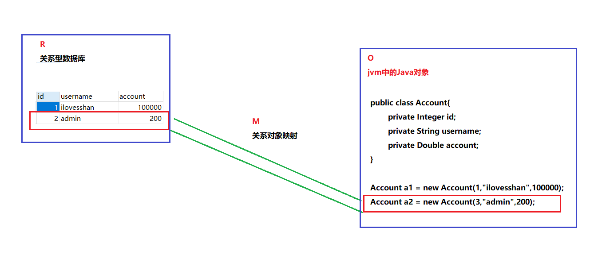
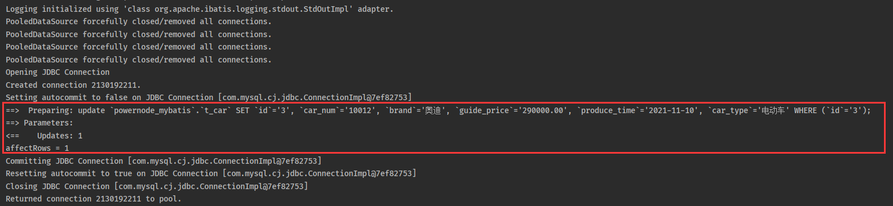
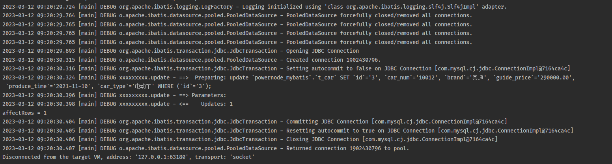
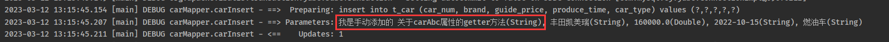

# MyBatis

## 第一章：MyBatis概述

### 什么是框架

1. freamwork被译为”框架”一词。

2. 什么是框架？

   + 一个框架是一个半成品，简单理解就是：把通用的、公共的一部分代码进行封装，封装成一大堆类和接口提供给开发者调用。
   + 为什么是半成品？因为框架仅仅提供了一些提高发者开发效率、简化开发配置的类库，但是实际开发中业务会很复杂，我们开发者通常都是基于这些框架进行开发。
   + 一个框架提供的一大堆类和接口通常会被打包成一个 jar文件，通常我们说的 jar包。项目中引入这些jar包就可以使用这些框架进行开发了。

3. java常见的框架有哪些？

   + Spring

   + SpringMVC

   + MyBatis

   + SpringBoot

     .....

### JDBC的缺点

1. 先看一段代码

   ```java
   //1.注册数据库的驱动
   DriverManager.registerDriver(new com.mysql.jdbc.Driver());
   //2.通过 DriverManager获取数据库连接
   String url=”jdbc:mysql://localhost:3306/chapter01”;
   String usernames=”root”;
   String password=”itcast”;
   Connection conn=DriverManager.getConnection(url, username, password);
   //3.通过 Connection对象获取 Statement对象
   Statement stmt= conn.createStatement();
   //4.使用 Statement执行SQL语句
   String sql=”select * from users”;
   ResultSet rs=stmt.executeQuery(sql);
   //5、操作 ResultSet结果集
   System.out.println(”id|name|password|email|birthday”);
   while (rs.next()) {
       //通过列名获取指定字段的值
       int id=rs.getInt(”id”);     
       String name=rs.getString(”name”);
       String psw=rs.getString(”password”);
       String email=rs.getString(”email”);
       Date birthday=rs.getDate(”birthday”);
       System.out.println(id+”|”+name+”|”+psw+”|”+email+”|”+birthday); 
   }
   //6、回收数据库连接
   if(rs!=null) {
       try {
           rs.close();
       }catch (SQLException e) {
           e.printStackTrace();
       }
       rs=null;
   }
   if(stmt!=null) {
       try {
           stmt.close();
       }catch (SQLException e) {
           e.printStackTrace();
       }
       stmt=null;
   }
   if(conn!=null) {
       try {
           conn.close();
       } catch (SQLException e) {
           e.printStackTrace();
       }
       conn=null;
   }
   ```

   

2. 总结JDBC缺点，引出Mybatis

   + 注册数据库的驱动、获取数据库连接、回收数据库连接这中繁琐又没技术含量的代码内能不能交给机器去完成？不用我们程序员来编写！
   + 编写的SQL语句直接和Java代码耦合在一起了，如果要更改Sql语句，那势必要改Java代码吧，违背了OCP原则不说还得重新编译打包部署！！
   + 通过列名获取指定字段的值这种代码能不能让机器通过反射去做？这里有5个字段就要写5个rs.getXxx()，万一有100个字段那不是要写100次rs.getXxx()？？

### ORM思想

1. ORM：Object Relational Mapper （对象关系映射），ORM主要是一种思想，使O（jvm中的java对象）和 R（关系型数据库）之间互相映射。

   

2. MyBatis是一个半自动化ORM，Hibernate是一个全自动化ORM。

### Mybatis简介

[Mybatis3-中文文档  传送门](https://mybatis.org/mybatis-3/zh/index.html)

[Mybatis3-英文文档  传送门](https://blog.mybatis.org/)

[MyBatis3-Github  传送门](https://github.com/mybatis/mybatis-3)

1. Mybatis简介
   + Mybatis是一个框架，它就是我们常听说的SSM框架中的M（MyBatis）。
   + Mybatis是一个优秀的持久层框架，它支持自定义Sql，存储过程以及高级映射。
   + MyBatis 免除了几乎所有的 JDBC 代码以及设置参数和获取结果集的工作。
   + MyBatis 可以通过简单的 XML 或注解来配置和映射原始类型、接口和 Java POJO为数据库中的记录。
   + Mybatis本是Apache的一个开源项目Ibatis，2010年这个项目由Apache software foundation迁移到了Google Code，并改名为Mybatis。2013年11月迁移到Github
2. Mybatis和JDBC
   + 简而言之：Mybatis的出现就是来解决JDBC缺点，本质上Mybatis的底层还是JDBC，只不过Mybatis开发人员是对JDBC进行了一层封装。
   + 对于我们开发者来说，MyBatis简单易用，功能强大，开发效率更高，免除了繁琐的配置！
3. Mybatis在三层架构的位置
   + 三层架构：Controller（视图层）、Service（业务逻辑层）、Dao（数据持久层）
   + 刚刚说过：Mybatis是一个优秀的持久层框架，那自然就是处于三层架构中的数据持久层了。


## 第二章：MyBatis 入门案例

仅仅入门而已，不懂没关系，后面会一一讲解，先感受一下MyBatis 这个框架的强大！

### 数据库准备

```sql
create database powernode_mybatis;

use powernode_mybatis;

create table t_car(
    id bigint primary key auto_increment,
    car_num varchar(50) comment '汽车编号',
    brand varchar(50) comment '品牌',
    guide_price decimal(10,2) comment '厂家指导价',
    produce_time char(10) comment '生产日期',
    car_type varchar(20) comment '汽车类型'
);

insert into 
t_car(car_num, brand, guide_price, produce_time, car_type) 
values 
('10010', '奔驰',500000.00, '2018-10-15', '燃油车'),
('10011', '宝马',400000.00, '2022-05-10', '电动车'),
('10012', '奥迪',290000.00, '2021-11-10', '电动车');

select car_num, brand, guide_price, produce_time, car_type from t_car;
```


### 新建项目并添加依赖

1. 使用IDEA新建Maven项目

2. 添加mybatis和mysql驱动依赖

   + 在pom.xml文件中添加相关依赖，并刷新，第一次下载会有点慢！！

     ```xml
     <dependencies>
     
         <!-- mybatis框架依赖-->
         <dependency>
             <groupId>org.mybatis</groupId>
             <artifactId>mybatis</artifactId>
             <version>3.5.10</version>
         </dependency>
     
         <!-- mysql数据库驱动依赖-->
         <dependency>
             <groupId>com.mysql</groupId>
             <artifactId>mysql-connector-j</artifactId>
             <version>8.0.31</version>
         </dependency>
     
     </dependencies>
     ```

### Mybaits基本使用五部曲

1. 五部曲

   + 第一步：添加mybatis依赖

   + 第二步：编写mybatis核心配置文件
   + 第三步：编写xxxMapper.xml
   + 第四步：在mybatis核心配置文件中关联xxxMapper.xml
   + 第五步：编写Java代码，对表进行CRUD

2. 具体实现步骤

   + 第二步：编写mybatis核心配置文件

     + 这里我叫做”mybatis-config.xml”（取名随意），大家都比较喜欢将mybatis核心配置文件命名成“mybatis-config.xml”，那我们也就遵循这些大家都遵循的规范吧。

     + 配置文件里面的信息建议到[mybatis中文官网](https://mybatis.org/mybatis-3/zh/getting-started.html)复制粘贴，再按需求进行更改，手写很容易出错！

       ```xml
       <?xml version=”1.0” encoding=”UTF-8” ?>
       <!DOCTYPE configuration
           PUBLIC ”-//mybatis.org//DTD Config 3.0//EN”
           ”https://mybatis.org/dtd/mybatis-3-config.dtd”>
       <configuration>
           <environments default=”development”>
               <environment id=”development”>
                   <transactionManager type=”JDBC”/>
                   <dataSource type=”POOLED”>
                       <!-- 这部分内容换成自己mysql的配置信息-->
                       <property name=”driver” value=”com.mysql.cj.jdbc.Driver”/>
                       <property name=”url”
                                 value=”jdbc:mysql://localhost:3306/powernode_mybatis?serverTimezone=UTC&amp;characterEncoding=utf8&amp;useUnicode=true&amp;useSSL=false”/>
                       <property name=”username” value=”root”/>
                       <property name=”password” value=”123456”/>
                   </dataSource>
               </environment>
           </environments>
           <mappers>
               <mapper resource=”org/mybatis/example/BlogMapper.xml”/>
           </mappers>
       </configuration>
       ```

       

   + 第三步：编写xxxMapper.xml

     + 编写carMapper.xml映射文件，叫carMapper.xml原因：一般情况xxxMapper.xml文件就对应一张表，xxx就对应着表的名称，大家都遵循这种命名规范
     + 文件名称和文件存放路随意（我这里放在resources文件下）

     ```xml
     <?xml version=”1.0” encoding=”UTF-8” ?>
     <!DOCTYPE mapper
             PUBLIC ”-//mybatis.org//DTD Mapper 3.0//EN”
             ”https://mybatis.org/dtd/mybatis-3-mapper.dtd”>
     
     <!-- namespace 命名空间，暂时先不管-->
     <mapper namespace=”xxxxxxxxx”>
     
         <!-- 这里编写sql语句, 每个标签代都表着对应的sql语法-->
         <!-- id属性，到时候需要根据id来找到需要执行sql语句-->
         <select id=”select”>
             select car_num, brand, guide_price, produce_time, car_type from t_car
         </select>
     
         <update id=”update”>
             update 
             `powernode_mybatis`.`t_car`
             SET 
             `id`='3', `car_num`='10012', `brand`='奥迪', `guide_price`='290000.00', `produce_time`='2021-11-10', `car_type`='电动车'
             WHERE 
             (`id`='3');
         </update>
         
         <delete id=”delete”>
     
         </delete>
         <insert id=”insert”>
     
         </insert>
     </mapper>
     ```

     

   + 第四步：在mybatis核心配置文件中关联xxxMapper.xml

     ```xml
     <configuration>
         <mappers>
             <!--  这个mapper标签对应一个XxxMapper.xml映射文件-->
             <!--  resource表示: 这个文件从resource文件夹下查找 -->
             <mapper resource=”carMapper.xml”/>
         </mappers>
     </configuration>
     ```

     

   + 第五步：编写Java代码，对表进行增删改查

     + 从 XML 中构建 SqlSessionFactory
     + 从 SqlSessionFactory 中获取 SqlSession
     + 通过SqlSession对表进行CRUD

     ```java
     // 从 XML 中构建 SqlSessionFactory
     InputStream inputStream = Resources.getResourceAsStream(”mybatis-config.xml”);
     SqlSessionFactory sqlSessionFactory = new SqlSessionFactoryBuilder().build(inputStream);
     
     // 从 SqlSessionFactory 中获取 SqlSession
     SqlSession sqlSession = sqlSessionFactory.openSession();
     
     
     // xxxxxxxxx 对应着xxxMapper.xml文件的namespace
     // select 对应xxxMapper.xml文件中标签的id
     
     // 执行DQL语句 返回查询结结果
     List<Object> list = sqlSession.selectList(”xxxxxxxxx.select”);
     System.out.println(”list.size() = ” + list.size()); //3 对应着t_car表中的三条数据
     
     // 执行DML语句 返回表中受影响的行数
     int affectRows = sqlSession.update(”xxxxxxxxx.update”);
     System.out.println(”affectRows = ” + affectRows);
     
     // 如果执行DML语句， 需要手动提交事务
     sqlSession.commit();
     sqlSession.close();
     ```

### Mybaits使用细节

1. 关于xxxMapper.xml文件中的sql语句“;”问题，sql语句结束其实加不加“;”都可以！

2. Resources.getResourceAsStream(”mybatis-config.xml”)

   + Resources是ibatis提供的一个类，本质底层还是通过ClassLoader去加载文件的。之后如果是看到getResource或者xxxtResource之类的方法或者类，那一般都表示是从类路径下加载资源。

   + Resources.getResourceAsStream(”mybatis-config.xml”)返回一个InputStream流，还有其他方式去加载mybatis配置文件

     + 通过ClassLoader去类路径下加载资源（推荐方式）

       +  InputStream inputStream = ClassLoader.getSystemClassLoader().getResourceAsStream(”mybatis-config.xml”);

       + InputStream inputStream = Thread.currentThread().getContextClassLoader().getResourceAsStream(”mybatis-config.xml”);

         

     + 通过 FileInputStream输入流去加载文件（不推荐，移植性太差了）

       + InputStream inputStream = new FileInputStream(”磁盘绝对路径\\mybatis-config.xml”);

       

3. mybatis核心配置文件和xxxMapper.xml文件

   + 关于命名和路径都是随意的！！

4.  \<mapper resource=”xxxMapper.xml”/>

   + \<mapper resource=”xxxMapper.xml”/>：从类路径下加载资源
   + \<mapper url=”file:///d:/work/xxxMapper.xml”/>：通过绝对路径加载资源（不推荐，移植性太差了）

### Mybaits事务管理器

[事务管理器（transactionManager）](https://mybatis.org/mybatis-3/zh/configuration.html#environments)

在 MyBatis 中有两种类型的事务管理器（也就是 type="[JDBC|MANAGED]"），也就是\<transactionManager type="JDBC"/>标签的types属性值

+ JDBC ：将事务管理权交给mybatis来管理，这个配置底层是使用了 JDBC 的提交和回事务功能

  + SqlSession sqlSession = sqlSessionFactory.openSession(); 

    底层代码表现形式：

    openSessionFromDataSource() -> newTransaction() ->  new JdbcTransaction() -> JdbcTransaction类的setDesiredAutoCommit()方法

    ```java
    protected void setDesiredAutoCommit(boolean desiredAutoCommit) {
        if (this.connection.getAutoCommit() != desiredAutoCommit) {
            if (log.isDebugEnabled()) {
                // ...
            }
            this.connection.setAutoCommit(desiredAutoCommit);
        }
    }
    ```

    

  + SqlSession sqlSession = sqlSessionFactory.openSession(false); 

    + 表示不开启事务，实际上setDesiredAutoCommit方法中的 this.connection.setAutoCommit(true);不会执行，因为JDBC的AutoCommit默认就是true，那个IF语句进不去。

      ```java
      protected void setDesiredAutoCommit(boolean desiredAutoCommit) {
          // true != true ==> false
          if (this.connection.getAutoCommit() != desiredAutoCommit) {
              // ...
              // IF语句不成立， 这句话压根不执行
              this.connection.setAutoCommit(desiredAutoCommit);
          }
      }
      ```

      

  + sqlSession.commit(); 底层代码表现形式：

    ```java
    public void commit() throws SQLException {
        // this.connection.getAutoCommit() 默认是false
        if (this.connection != null && !this.connection.getAutoCommit()) {
            if (log.isDebugEnabled()) {
                log.debug("Committing JDBC Connection [" + this.connection + "]");
            }
            // IF语句不成立， 下面这句话不执行。
            this.connection.commit();
        }
    }
    ```

    

+ MANAGED： 这个配置几乎没做什么，意思就是 mybatis不负责管理事务了，而是将事务管理权交给其他容器管理，例如：spring

  \<transactionManager type="MANAGED"/>表示：不开启事务，因为 mybatis不负责管理事务了，目前我们项目没有spring容器，没人来接管管理事务这个事。

总结：关于autoCommit

+ 值为false：表示开启事务，不自动提交事务，提交事务的控制权由程序员来控制。
+ 值为true：表示自动提交事务，提交事务的控制权不由程序员来控制。

### 完整的MyBatis示例代码

```java
public class Test02 {
    public static void main(String[] args) {
        SqlSession sqlSession = null;
        try {
            // 从 XML 中构建 SqlSessionFactory
            InputStream inputStream = Resources.getResourceAsStream("mybatis-config.xml");
            SqlSessionFactory sqlSessionFactory = new SqlSessionFactoryBuilder().build(inputStream);

            // 从 SqlSessionFactory 中获取 SqlSession
            sqlSession = sqlSessionFactory.openSession();

            // 执行DML语句 返回表中受影响的行数
            int affectRows = sqlSession.update("xxxxxxxxx.update");
            System.out.println("affectRows = " + affectRows);

            // 如果执行DML语句， 需要手动提交事务
            sqlSession.commit();
        } catch (IOException e) {
            e.printStackTrace();
        } finally {
            if (sqlSession != null) {
                sqlSession.close();
            }
        }
    }
}
```


### Mybatis工具类

```java
public class SqlSessionUtil {
    private SqlSessionUtil() {
    }

    private static SqlSessionFactory sqlSessionFactory = null;

    static {
        try {
             InputStream inputStream = Resources.getResourceAsStream("mybatis-config.xml");
            sqlSessionFactory = new SqlSessionFactoryBuilder().build(inputStream);
        } catch (IOException e) {
            e.printStackTrace();
        }
    }

    public static SqlSession getSqlSession() {
        return sqlSessionFactory.openSession();
    }
}
```


### 集成单元测试

1. [Junit单元测试简介](http://jboot.com.cn/docs/junit.html)

   + 单元测试（unit testing），是指对软件中的最小可测试单元进行检查和验证。

   + JUnit 是一个 Java 编程语言的单元测试框架，目前市面上主要是使用 Junit4 和 Junit5 对 Java 程序进行单元测试。

2. Junit基本使用

   + 引入jar包依赖

     ```xml
     <!-- junit单元测试依赖-->
     <dependency>
         <groupId>junit</groupId>
         <artifactId>junit</artifactId>
         <version>4.13.2</version>
         <scope>test</scope>
     </dependency>
     ```

   + 编写单元测试程序

     ```java
     @RunWith(JUnit4.class)
     public class JunitTest {
     
         @Test
         public void testAdd() {
             System.out.println("JunitTest testAdd...");
         }
     
         @Test
         public void testSub() {
             System.out.println("JunitTest testSub...");
         }
     }
     ```

     

3. Junit测试mybatis程序

   ```java
   @RunWith(JUnit4.class)
   public class CarMapperTest {
   
       @Test
       public void testSelect() {
           SqlSession sqlSession = SqlSessionUtil.getSqlSession();
           List<Object> list = sqlSession.selectList("xxxxxxxxx.select");
           System.out.println("list = " + list.size());
           sqlSession.close();
       }
   
       @Test
       public void testUpdate() {
           SqlSession sqlSession = SqlSessionUtil.getSqlSession();
           int affectRows = sqlSession.update("xxxxxxxxx.update");
           System.out.println("affectRows = " + affectRows);
           sqlSession.commit();
           sqlSession.close();
       }
   }
   ```

   

### 集成日志框架

1. [mybtis内置的实现日志](https://mybatis.org/mybatis-3/zh/configuration.html#settings)，STDOUT_LOGGING  标准控制台输出日志。

   + 有时候希望看到mybatis执行sql语句时的具体信息（也是方便排查错误），比如：sql语句、sql参数、DML语句执行结果受影响的行数等等...，那就需要开启日志来实现这种效果。

   + 要开启mybatis内置的实现日志很简单，在mybatis-config.xml文件中配置即可，是不是很简单！！！

     ```xml
     <settings>
         <setting name="logImpl" value="STDOUT_LOGGING"/>
     </settings>
     ```

     现在相比之前是不是日志信息更加清晰了！！

     

   + mybatis-config.xml文件中标签书写顺序是有规则的，但是具体的规则不用记，因为mybatis-config.xml文件受一个dtd文件约束，那么我们仅仅需要参考这个dtd文件就ok了。

     ```xml
     <!DOCTYPE configuration
             PUBLIC "-//mybatis.org//DTD Config 3.0//EN"
             "https://mybatis.org/dtd/mybatis-3-config.dtd">
     ```

2. 常见的日志框架

   + 目前的日志框架可以分为两种：一种是jdk自带的，另一种是第三方实现的。

     + jdk自带

       + jdk自带的日志是jdk-logging，简称jul（java.util.logging包的简称），jul的配置文件是`logging.properties`。

       + Tomcat本身的日志实现是`tomcat-juli.jar`，从jar名就可以看出来，它是对jul的实现，内部对jul进行了一定的封装。

         ```java
         import java.util.logging.Level;
         import java.util.logging.Logger;
         
         public class Hello {
             public static void main(String[] args) {
                 Logger logger = Logger.getGlobal();
                 logger.info("start process...");
                 logger.warning("memory is running out...");
                 logger.fine("ignored.");
                 logger.severe("process will be terminated...");
             }
         }
         ```

         

     + 第三方实现

       + 常见的有logback、log4j、log4j2这三大日志框架，其中log4j2是log4j 1.x的升级版，因为改动很大，所以作为一个新的日志框架独立使用。
       + logback的配置文件是 logback.xml，log4j的配置文件是`log4j.xml`，log4j2的配置文件是`log4j2.xml`。

   + 日志门面

     + 日志门面commons-logging

       

     + slf4j是Simple Logging Facade for Java，即简单日志门面，是目前较为流行的门面接口，用法和jcl一样，即使用slf4j自身提供的接口来打印日志。

       ```java
       import org.slf4j.Logger;
       import org.slf4j.LoggerFactory;
       
       public class Test {
           public static void main(String[] args) {
               Logger logger = LoggerFactory.getLogger(getClass());
               logger.info("Test");
           }
       }
       ```

       使用Lombok框架，可以通过一个简单的`@Slf4j`注解来简洁方便地使用Slf4j打印日志

       ```xml
       <dependency>
           <groupId>org.projectlombok</groupId>
           <artifactId>lombok</artifactId>
           <version>1.18.24</version>
       </dependency>
       ```

       

       ```java
       @Slf4j
       public class Test {
           public static void main(String[] args) {
               log.info("Test");
           }
       }
       ```

       

3. 集成日志框架

   + STDOUT_LOGGING，也是mybatis内置的，功能不够强大，比如看不到当前执行时间、当前执行线程、当前日志打印级别等等...

   + 集成三方日志框架：使用slf4j作为日志门面，使用logback作为实现。

     + 引入依赖，只需要引入logback就好了，因为logback中依赖slf4j，由于Maven有依赖传递关系，所以会自动帮我们下载！

       ```xml
       <dependency>
           <groupId>ch.qos.logback</groupId>
           <artifactId>logback-classic</artifactId>
           <version>1.2.11</version>
       </dependency>
       ```

       

     + 编写logback的配置文件，

       + 名字叫“logback.xml”或者“logback-test.xml”，文件位置需要放在类路径下，记住：文件名称和文件路径都不能乱写！！
       + 这个文件信息建议从[网上复制](https://www.cnblogs.com/gavincoder/p/10091757.html)，再按照需要进行更改，自己写很容易出错！！！

       ```xml
       <?xml version="1.0" encoding="UTF-8"?>
       <configuration debug="false">
       
           <!--定义日志文件的存储地址 勿在 LogBack 的配置中使用相对路径-->
           <property name="LOG_HOME" value="${LOG_PATH:-.}/logs"/>
       
           <!--控制台日志， 控制台输出 -->
           <appender name="STDOUT" class="ch.qos.logback.core.ConsoleAppender">
               <encoder class="ch.qos.logback.classic.encoder.PatternLayoutEncoder">
                   <!--格式化输出：%d表示日期，%thread表示线程名，%-5level：级别从左显示5个字符宽度,%msg：日志消息，%n是换行符-->
                   <pattern>%d{yyyy-MM-dd HH:mm:ss.SSS} [%thread] %-5level %logger{50} - %msg%n</pattern>
               </encoder>
           </appender>
       
           <!--文件日志， 按照每天生成日志文件 -->
           <appender name="FILE" class="ch.qos.logback.core.rolling.RollingFileAppender">
               <rollingPolicy class="ch.qos.logback.core.rolling.TimeBasedRollingPolicy">
                   <!--日志文件输出的文件名-->
                   <FileNamePattern>${LOG_HOME}/TestWeb.log.%d{yyyy-MM-dd}.log</FileNamePattern>
                   <!--日志文件保留天数-->
                   <MaxHistory>30</MaxHistory>
               </rollingPolicy>
               <encoder class="ch.qos.logback.classic.encoder.PatternLayoutEncoder">
                   <!--格式化输出：%d表示日期，%thread表示线程名，%-5level：级别从左显示5个字符宽度%msg：日志消息，%n是换行符-->
                   <pattern>%d{yyyy-MM-dd HH:mm:ss.SSS} [%thread] %-5level %logger{50} - %msg%n</pattern>
               </encoder>
               <!--日志文件最大的大小-->
               <triggeringPolicy class="ch.qos.logback.core.rolling.SizeBasedTriggeringPolicy">
                   <MaxFileSize>10MB</MaxFileSize>
               </triggeringPolicy>
           </appender>
       
           <!-- show parameters for hibernate sql 专为 Hibernate 定制 -->
           <!-- <logger name="org.hibernate.type.descriptor.sql.BasicBinder" level="TRACE"/>-->
           <!-- <logger name="org.hibernate.type.descriptor.sql.BasicExtractor" level="DEBUG"/>-->
           <!-- <logger name="org.hibernate.SQL" level="DEBUG"/>-->
           <!-- <logger name="org.hibernate.engine.QueryParameters" level="DEBUG"/>-->
           <!-- <logger name="org.hibernate.engine.query.HQLQueryPlan" level="DEBUG"/>-->
       
           <!--mybatis log configure 专为 mybatis 定制 -->
           <logger name="com.apache.ibatis" level="TRACE"/>
           <logger name="java.sql.Connection" level="DEBUG"/>
           <logger name="java.sql.Statement" level="DEBUG"/>
           <logger name="java.sql.PreparedStatement" level="DEBUG"/>
       
           <!-- 日志输出级别 -->
           <root level="DEBUG">
               <appender-ref ref="STDOUT"/>
               <appender-ref ref="FILE"/>
           </root>
       </configuration>
       ```

     + 关掉mybatis-config.xml中的settings标签配置信息，原因是mybatis官网有这样一句话：“指定 MyBatis 所用日志的具体实现，未指定时将自动查找”，当然也可以不用关闭。我们项目用slf4j，那就指定成SLF4J 。

       ```xml
       <settings>
           <setting name="logImpl" value="SLF4J"/>
       </settings>
       ```

       


## 第三章：MyBatis的增删改查

### 完成insert使用Map传参

1. 分析代码并发现存在的问题

   ```xml
   <insert id="carInsert">
       insert into 
       	t_car (car_num, brand, guide_price, produce_time, car_type) 
       values 
       	('4', '10014', '丰田凯美瑞', '160000.00', '2022-10-15', '燃油车')
   </insert>
   ```

   + 数据直接写死了，真实开发中新增的数据应该是前端动态传递的。

   + 在JDBC中是怎么解决的呢？

     + 通过PreparedSatement来预处理sql，sql语句中使用“?”占位符来防止sql预编译，也方便动态传参！
     + 然后通过ps.setXXX(index, data)来给占位符参数赋值。

   + 在mybatis中我们可以使用“#{}” 来动态传递参数，同时也能防止sql注入，本质上mybatis中的“#{}”和PreparedSatement中的“?”功能是一样的。

     ```xml
     <insert id="carInsert">
         insert into
         	t_car (car_num, brand, guide_price, produce_time, car_type)
         values
         	(#{},#{},#{},#{},#{})
     </insert>
     ```

2. 在mybatis中我们可以使用“#{}” 来动态传递参数，那具体怎么传递呢？换句话说怎么可以把动态的数据按某个规则传递到“#{}”中呢？

   + 分析SqlSession的insert方法

     ```java
     // var1 传递 xxxMapper.xml文件的nameSpace.标签ID
     int insert(String var1);
     
     // var1 传递 xxxMapper.xml文件的nameSpace.标签ID
     // var2 向标签中传递的数据
     int insert(String var1, Object var2);
     ```

   + 我们新建一个Map对象，通过insert(String var1, Object var2)方法，传递数据

     ```java
     SqlSession sqlSession = SqlSessionUtil.getSqlSession();
     
     HashMap<String, Object> hashMap = new HashMap<>();
     hashMap.put("k1", "'10014'");
     hashMap.put("k2", "丰田凯美瑞");
     hashMap.put("k3", 160000.00);
     hashMap.put("k4", "2022-10-15");
     hashMap.put("k5", "'燃油车'");
     
     sqlSession.insert("xxxxxxxxx.carInsert", hashMap);
     
     sqlSession.commit();
     sqlSession.close();
     ```

   + 回到carMapper.xml文件中，现在的问题是怎么把传递的参数取出来呢？“#{}” 这里面怎么写？？

     很简单：“#{}”里面直接写Map对象的key就ok啦！！

     注意：如果key写错了取到的就是“nul”，假如数据库添加了非空约束，那就直接报错了！

     ```xml
     <insert id="carInsert">
         insert into
             t_car (car_num, brand, guide_price, produce_time, car_type)
         values
             (#{k1},#{k2},#{k3},#{k4},#{k5})
     </insert>
     ```

3. 运行单元测试，注意观察日志或者看数据库记录，新增就OK了吧！

   + 但是我们new Map的时候，key名称是不是太low了？？k1、k2、k3...哪有这样命名的？

   + 建议命名的时候还是尽量做到“见名知意”

     ```java
     HashMap<String, Object> hashMap = new HashMap<>();
     hashMap.put("carNum", "10014");
     hashMap.put("brand", "丰田凯美瑞");
     hashMap.put("guidePrice", 160000.00);
     hashMap.put("produceTime", "2022-10-15");
     hashMap.put("carType", "燃油车");
     ```

     ```xml
     <insert id="carInsert">
         insert into
        		t_car (car_num, brand, guide_price, produce_time, car_type)
         values
         	(#{carNum},#{brand},#{guidePrice},#{produceTime},#{carType})
     </insert>
     ```

     

### 完成insert使用Pojo传参

1. 那就顾名思义呗，把刚刚Map当成一个Pojo作为instert的第二个参数传递进去呗，okok，开干！先弄一Pojo对象

   用了一下[Lombok](https://projectlombok.org/)插件！！

   ```java
   @Data
   @AllArgsConstructor
   @NoArgsConstructor
   public class Car {
   
       // 注意使用包装类的原因：防止数据库查出的数据为null，而null赋值给基本数据类型会报错！
       private Integer id;
       private String carNum;
       private String brand;
       private Double guidePrice;
       private String produceTime;
       private String carType;
   }
   ```

2. 编写java代码

   ```java
   Car car = new Car(null, "10014", "丰田凯美瑞", 160000.00, "2022-10-15", "燃油车");
   sqlSession.insert("carMapper.carInsert", car);
   ```

3. 回到carMapper.xml文件中, 把参数取出来放到对应的“#{}”中呗！

   + 怎么取？刚刚从Map中取是通过key取的，那现在Pojo对象呢？

   + “#{}”从Pojo对象取数据，严谨来说是通过getXxx方法的xx（名称）来取的，不严谨的说话就是通过Pojo属性名称取，为什么这样说呢？？

   + 直接上代码

     + 常规做法以及原理剖析（推荐，推荐！！！！）

       ```xml
       <insert id="carInsert">
           insert into
           	t_car (car_num, brand, guide_price, produce_time, car_type)
           values
           	(#{carNum},#{brand},#{guidePrice},#{produceTime},#{carType})
       </insert>
       ```

       lombook会通过注解，在编译阶段帮我们生成一个类，这类中包含了对应属性的构造器，getter和setter等等方法...

       比如：

       + #{carNum}  --> 会调用car.getCarNum  --> carNum
       + #{brand}  --> 会调用car.getBrand --> brand
       + #{guidePrice} --> 会调用car.getGuidePrice  -->guidePrice

       #{carNum}中放的名称，本质就是car对象中对应getter方法去掉“get”之后的单词再首字母再小写的结果！

     + 属性名称写错了的补救办法（开发中按照上面的方法正常写就对了，当前这种属于没事找事做！）

       + 假如手抖写错了，把#{carNum}写成了#{carAbc}，那运行直接报错呗！！

          There is no getter for property named 'carAbc' in 'class com.ilovesshan.pojo.Car'，这句话意思很简单！！，Car对象中没找到carAbc对应的getter方法。

       + 怎么解决？

         那我在Car对象中再弄一个getCarAbc方法不就OK了!!

         ```java
         @Data
         @AllArgsConstructor
         @NoArgsConstructor
         public class Car {
             // 其他属性省略了...
             public String getCarAbc() {
                 return "我是手动添加的 关于carAbc属性的getter方法";
             }
         }
         ```

         

### 完成delete

1. 老套路，在carMapper.xml中先写delete标签并补充sql语句，一样的感觉，一样的套路！！

   ```xml
   <delete id="deleteById">
       delete from t_car where id = #{?}
   </delete>
   ```

2. 编写java代码。

   ```java
   @Test
   public void testCarDeleteById() {
       SqlSession sqlSession = SqlSessionUtil.getSqlSession();
       sqlSession.delete("carMapper.deleteById", 7);
       // 执行DML语句 记得提交事务
       sqlSession.commit();
       sqlSession.close();
   }
   ```

   

### 完成update

+ 套路一样，直接上代码！！

  ```xml
  <update id="update">
      update t_car
      	set car_num = #{carNum}, brand = #{brand}, guide_price = #{guidePrice}, produce_time = #{produceTime} , car_type = #{carType}
      where
      	id = #{id}
  </update>
  ```

  ```java
  @Test
  public void testCarUpdate() {
      SqlSession sqlSession = SqlSessionUtil.getSqlSession();
      Car car = new Car(4, "10014", "丰田卡罗拉", 120000.00, "2021-10-15", "氢气车");
      sqlSession.update("carMapper.update",car);
      sqlSession.commit();
      sqlSession.close();
  }
  ```

  


### 完成select查询单个

1. carMapper.xml编写sql代码

   ```xml
   <select id="selectById">
      select id, car_num, brand, guide_price, produce_time, car_type from t_car where id = #{id};
   </select>
   ```

2. 编写Java代码

   ```java
   @Test
   public void testSelectById() {
       SqlSession sqlSession = SqlSessionUtil.getSqlSession();
       Object selectOne = sqlSession.selectOne("carMapper.selectById", 1);
       System.out.println("selectOne = " + selectOne);
       sqlSession.commit();
       sqlSession.close();
   }
   ```

   会发现运行就报错了， A query was run and no Result Maps were found for the Mapped Statement 'carMapper.selectById'.  It's likely that neither a Result Type nor a Result Map was specified.

3. 怎么解决呢？

   + 回想写JDBC代码的时候，我们从ResultSet中取数据的时候，是不是把这些数据都封装成了一个实体对象。

     ```java
     User user = null;
     if (rs.next()) {
         //通过列名获取指定字段的值
         int id=rs.getInt(”id”);     
         String name=rs.getString(”name”);
         // 封装成了一个实体对象
         user = new User(id, name);
     }
     // ...
     ```

   + 回到mybatis里面，你压根没告诉mybatis，你这次查询到的数据给我封装成一个啥实体类对象？是封装成User、Ssudent还是Car？？你得告诉一下mybatis，因为mybatis是一个半自动ORM框架，所以mybatis就会通过反射给你传入的实体类的属性赋值然后返再还给你这个对象！

     怎么告诉mybatis这次查询的结果要封装成啥对象呢？通过resultType属性指定即可，注意这里的resultType值对应的pojo对象，暂时写成类全限定名称，后面有简化写法！！

     ```java
     <select id="selectById"  resultType="com.ilovesshan.pojo.Car">
         select id, car_num, brand, guide_price, produce_time, car_type from t_car where id = #{id};
     </select>
     ```

   + 再执行一次代码，发现不报错了，但是值不对。。。。id和brand有值，其他的没值。

     selectOne = Car(id=1, carNum=null, brand=奔驰, guidePrice=null, produceTime=null, carType=null)

     原因是：mybatis是通过反射对属性进行赋值的，你这里叫carNum，但是查出来的数据名称叫car_num，名称都不一样能赋值？？

     解决办法：修改一下sql语句手动加一个别名就ok啦（后面会有更简单的办法）！！

     ```xml
     <select id="selectById" resultType="com.ilovesshan.pojo.Car">
         select id, car_num carNum, brand, guide_price guidePrice, produce_time produceTime, car_type carType from t_car where id = #{id};
     </select>
     ```

     ok，查询结果也正确了

     selectOne = Car(id=1, carNum=10010, brand=奔驰, guidePrice=500000.0, produceTime=2018-10-15, carType=燃油车)

### 完成select查询列表

1. select查询单个已经学会了，select查询列表也很简单

   注意：如果是查询多条记录，resultType的值并不是返回值的类型，而是返回集合中元素的类型，例如：List\<Car>

   ```xml
   <select id="selectList" resultType="com.ilovesshan.pojo.Car">
       select id, car_num carNum, brand, guide_price guidePrice, produce_time produceTime, car_type carType from t_car
   </select>
   ```

   ```java
   @Test
   public void testSelectList() {
       SqlSession sqlSession = SqlSessionUtil.getSqlSession();
       List<Object> list = sqlSession.selectList("carMapper.selectList");
       list.forEach(System.out::println);
       sqlSession.commit();
       sqlSession.close();
   }
   ```

### MyBatis命名空间

1. 命名空间的作用

    每一个Mapper映射文件都有一个namespace，这个namespace主要是来防止sql id冲突的，举个例子：

   

   + AMapper.xml

     ```xml
     <mapper namespace="xxx">
         <select id="selectList" resultType="com.ilovesshan.pojo.Car">
             select 
             	id, car_num carNum, brand, guide_price guidePrice, produce_time produceTime, car_type carType 
             from 
            	 	t_car
         </select>
     </mapper>
     ```

     

   + BMapper.xml

     ```xml
     <mapper namespace="xxx">
         <select id="selectList" resultType="com.ilovesshan.pojo.Car">
             select 
                 id, car_num carNum, brand, guide_price guidePrice, produce_time produceTime, car_type carType 
             from 
                 t_car
         </select>
     </mapper>
     ```

     

   + mybatis配置文件中注册

     ```xml
     <mappers>
         <mapper resource="aMapper.xml"/>
         <mapper resource="bMapper.xml"/>
     </mappers>
     ```

     

   + 编写java代码

     ```java
     public class NameSpaceMapperTest {
         @Test
         public void testSelectList() {
             SqlSession sqlSession = SqlSessionUtil.getSqlSession();
             List<Object> list = sqlSession.selectList("xxx.selectList");
             list.forEach(System.out::println);
             sqlSession.close();
         }
     }
     ```

     运行就直接报错了：Error parsing Mapper XML. The XML location is 'bMapper.xml'. Cause: java.lang.IllegalArgumentException: Mapped Statements collection already contains value for xxx.selectList. please check aMapper.xml and bMapper.xml

   

2. 解决命名空间冲突

   + 解决这个问题也很简单，我们只需要给每个Mapper文件的命名空间（namespace）取一个不一样的名字就好了！！

   + 调用的时候通过namespace.id格式进行调用，通过namespace就可以明确要执行那个映射文件的sql语句，比如：
     + sqlSession.selectList("aMapper.selectList");
     + sqlSession.selectList("bMapper.selectList");

   

## 第四章：MyBatis配置文件详解

### 多环境配置 environments

[多环境配置参考地址](https://mybatis.org/mybatis-3/zh/configuration.html#environments)

1. MyBatis 可以配置成适应多种环境，例如，开发、测试和生产环境需要有不同的配置。

   + 每个数据库（环境）应该对应一个 SqlSessionFactory 实例。

   ```xml
   <!-- 
   	environments 表示可以配置多个环境
   	default 表示默认启用那个环境
   	注意：environment的id属性值不能重复
   -->
   
   <environments default="development">
       <environment id="development">
           <transactionManager type="JDBC"/>
           <dataSource type="POOLED">
               <property name="driver" value="com.mysql.cj.jdbc.Driver"/>
               <property name="url" value="jdbc:mysql://localhost:3306/powernode_mybatis"/>
               <property name="username" value="root"/>
               <property name="password" value="123456"/>
           </dataSource>
       </environment>
   
       <!-- 这个是线上的环境-->
       <environment id="production">
           <transactionManager type="JDBC"/>
           <dataSource type="POOLED">
               <property name="driver" value="com.mysql.cj.jdbc.Driver"/>
               <property name="url" value="jdbc:mysql://110.23.56.8:3306/powernode_mybatis"/>
               <property name="username" value="ilovesshan"/>
               <property name="password" value="ilovesshan!@#123"/>
           </dataSource>
       </environment>
   
   </environments>
   ```

2. 通过代码创建指定环境

   ```java
   InputStream in = Resources.getResourceAsStream("mybatis-config.xml");
   
   // 使用默认环境
   SqlSessionFactory sessionFactory1 = new SqlSessionFactoryBuilder().build(in);
   
   // 创建指定环境
   SqlSessionFactory sessionFactory2 = new SqlSessionFactoryBuilder().build(in, "环境ID");
   ```


### 事务管理器 transactionManager

入门案例中提到过，这里简单回顾一下

+ MyBatis 中有两种类型的事务管理器：JDBC / MANAGED

  + JDBC ：mybatis来负责管理事务，管理事务的方式是通过原始JDBC的方式。

    conn.setAutoCommit(false);

    .......

    conn.cmmit()

  + MANAGED：mybatis将事务权交给JEE容器来管理，例如：Spring。

+ \<transactionManager type="">，type值可以取JDBC或者MANAGED，大小写无所谓，但是只能是二选一。

  + mybatis底层提供了一个Transaction接口和两个对应实现类：JdbcTransaction和ManagedTransaction。

  + type="JDBC"，那么mybatis底层就创建JdbcTransaction实例来处理相关逻辑。

  + type="MANAGED"，那么mybatis底层就创建ManagedTransaction实例来处理相关逻辑。

    

### 数据源 dataSource

1. 什么是数据源？

   + dataSource 翻译为中文就是：“数据源”，字面意思翻译就是：“数据的源头”。
   + 其实学过JDBC之后，我们可以将数据源理解成是一个数据库连接池，比如常见的数据源：
     + 阿里巴巴的德鲁伊（druid）
     + dbcp
     + c3po
     + ...

2. mybatis中，通过\<dataSource type=""> 标签来配置数据源，type的值有三个可以选择：POOLED | UNPOOLED | JNDI，只能是三选一。

   + UNPOOLED ：采用传统的获取连接的方式，虽然也实现Javax.sql.DataSource接口，但是并没有使用池的思想 。 

     + 每次请求时都会打开和关闭连接，在并发量比较大的时候，这种设定会比较耗费性能。 
     + 一些常用属性，具体配置可以参考mybatis[官方网站](https://mybatis.org/mybatis-3/zh/configuration.html#environments)。
       + `driver` – 这是 JDBC 驱动的 Java 类全限定名（并不是 JDBC 驱动中可能包含的数据源类）。
       + `url` – 这是数据库的 JDBC URL 地址。
       + `username` – 登录数据库的用户名。
       + `password` – 登录数据库的密码。
       + ...

   + POOLED ：采用传统的javax.sql.DataSource规范中的连接池，mybatis中有针对规范的实现 。 

     + 这种数据源的实现利用“池”的概念将 JDBC 连接对象组织起来，避免了创建新的连接实例时所必需的初始化和认证时间。 这种处理方式很流行，能使并发 Web 应用快速响应请求。

     + 列举一些常用的属性（这些属性对应的值需根据对应业务进行测试，配置的好可能达到事半功倍的效果！）。
       - `poolMaximumActiveConnections` – 在任意时间可存在的活动（正在使用）连接数量，默认值：10
       - `poolMaximumIdleConnections` – 任意时间可能存在的空闲连接数。
       - `poolMaximumCheckoutTime` – 在被强制返回之前，池中连接被检出时间，默认值：20000 毫秒（即 20 秒）
       - ...

   + JNDI：采用服务器提供的JNDI技术实现，来获取DataSource对象，不同的服务器所能拿到DataSource是不一样。 

     + 这个数据源实现是为了能在如 EJB 或应用服务器这类容器中使用，容器可以集中或在外部配置数据源，然后放置一个 JNDI 上下文的数据源引用。

     + 注意：如果不是web或者maven的war工程，JNDI是不能使用的。

       

### 属性 properties

1. Java中有个Properties对象，底层维护了一个Map，这个Map的key和value都是字符串类型。其实\<properties>标签也是这个原理。

2. properties基本使用

   定义好的属性可以在整个配置文件中使用，通过${name}取值。

   ```xml
   <properties>
       <property name="jdbc.driver" value="jdbc:mysql://110.23.56.8:3306/powernode_mybatis"/>
       <property name="jdbc.url" value="com.mysql.cj.jdbc.Driver"/>
       <property name="jdbc.username" value="root"/>
       <property name="jdbc.password" value="123456"/>
   </properties>
   ```

   ```xml
   <dataSource type="POOLED">
       <property name="jdbc.driver" value="${driver}"/>
       <property name="jdbc.url" value="${url}"/>
       <property name="jdbc.username" value="${username}"/>
       <property name="jdbc.password" value="${password}"/>
   </dataSource>
   ```

3. properties标签有一个resource属性。

   + 一看到resource是不是就可以联想到从类路径下加载资源及文件，没问题，就是这样的！！
   + 我们可以把一些配置属性放到properties文件中，然后通过properties标签的resource属性进行引用

   ```properties
   # jdbc.properties
   driver=com.mysql.cj.jdbc.Driver
   url=jdbc:mysql://localhost:3306/powernode_mybatis
   username=root
   password=123456
   ```

   ```xml
   <properties resource="jdbc.properties">
       <!-- 也可以在这里面配置一些其他属性 -->
       <!-- 这里配置属性比resource指定文件中的属性，使用优先级更高 -->
       <property name="logLevel" value="debug"/>
       <property name="debugTag" value="com.ilovesshan"/>
   </properties>
   ```

4. properties标签还有一个url属性，表示从绝对路径下查找资源，这种方式不推荐！！！

   

### properties 和 mapper 的url属性

```xml
<!-- 推荐 类路径下查找资源 -->
<mapper resource="carMapper.xml"/>
<properties resource="jdbc.properties"/>

<!-- 不推荐 绝对路径下查找资源 移植性很差-->
<mapper resource="file:///D:/路径"/>
<properties resource="file:///D:/路径"/>
```


## 第五章：WEB应用中使用MyBatyis

### 项目介绍和技术点

1. 掌握使用三层架构实现银行转账案例
2. 掌握在WEB应用中使用MyBatyis
3. 掌握使用ThreadLocal来解决事务问题
4. 引出MyBatyis接口代理机制

### 项目搭建

1. 新建数据库和数据表（Account）

   ```sql
   create database powernode_mybatis;
   use powernode_mybatis;
   
   create table account(
       id int primary key auto_increment,
       username varchar(20),
       account decimal(10,2)
   );
   
   insert into account(username, account) values ("ilovesshan", 1000.00),("admin", 0.00);
   
   select id, username, account from account;
   ```

   

2. 新建maven工程，使用 “maven-archety-webapp”作为项目模板，注意修改 “web.xml”文件内容。

   ```xml
   <web-app xmlns="https://jakarta.ee/xml/ns/jakartaee"
            xmlns:xsi="http://www.w3.org/2001/XMLSchema-instance"
            xsi:schemaLocation="https://jakarta.ee/xml/ns/jakartaee
                                https://jakarta.ee/xml/ns/jakartaee/web-app_5_0.xsd"
            version="5.0"
            metadata-complete="false">
   </web-app>
   ```

   

3. pom.xml中添加项目依赖

   ```xml
   <dependency>
       <groupId>jakarta.servlet</groupId>
       <artifactId>jakarta.servlet-api</artifactId>
       <version>4.0.4</version>
   </dependency>
   
   <dependency>
       <groupId>org.mybatis</groupId>
       <artifactId>mybatis</artifactId>
       <version>3.5.10</version>
   </dependency>
   
   <dependency>
       <groupId>org.projectlombok</groupId>
       <artifactId>lombok</artifactId>
       <version>1.18.24</version>
   </dependency>
   
   <dependency>
       <groupId>mysql</groupId>
       <artifactId>mysql-connector-java</artifactId>
       <version>8.0.31</version>
   </dependency>
   ```

   

4. 准备数据库配置文件（jdbc.properties）

   ```properties
   jdbc.driver=com.mysql.cj.jdbc.Driver
   jdbc.url=jdbc:mysql://localhost:3306/powernode_mybatis
   jdbc.username=root
   jdbc.password=123456
   ```

5. 准备mybatis配置文件（mybatis-config.xml）

   ```xml
   <?xml version="1.0" encoding="UTF-8" ?>
   <!DOCTYPE configuration
           PUBLIC "-//mybatis.org//DTD Config 3.0//EN"
           "http://mybatis.org/dtd/mybatis-3-config.dtd">
   <configuration>
       <properties resource="jdbc.properties"/>
   
       <settings>
           <setting name="logImpl" value="STDOUT_LOGGING"/>
       </settings>
   
       <environments default="development">
           <environment id="development">
               <transactionManager type="JDBC"/>
               <dataSource type="POOLED">
                   <property name="driver" value="${jdbc.driver}"/>
                   <property name="url" value="${jdbc.url}"/>
                   <property name="username" value="${jdbc.username}"/>
                   <property name="password" value="${jdbc.password}"/>
               </dataSource>
           </environment>
       </environments>
       <mappers>
           <mapper resource="AccountMapper.xml"/>
       </mappers>
   </configuration>
   ```

   

6. 准备Mapper映射文件（AccountMapper.xml）

   ```xml
   <?xml version="1.0" encoding="UTF-8" ?>
   <!DOCTYPE mapper
           PUBLIC "-//mybatis.org//DTD Mapper 3.0//EN"
           "http://mybatis.org/dtd/mybatis-3-mapper.dtd">
   <mapper namespace="account">
   
   </mapper>
   ```

7. 准备前端页面

   ```html
   <!doctype html>
   <html lang="en">
       <head>
           <meta charset="UTF-8">
           <meta name="viewport"
                 content="width=device-width, user-scalable=no, initial-scale=1.0, maximum-scale=1.0, minimum-scale=1.0">
           <meta http-equiv="X-UA-Compatible" content="ie=edge">
           <title>账户交易</title>
       </head>
       <body>
           <form method="post" action="/account/transfer">
               出账账户：<input type="text" name="from" value="ilovesshan">
               <br/>
               入账账户：<input type="text" name="to" value="admin">
               <br/>
               交易金额：<input type="text" name="account" value="100">
               <br/>
               <input type="submit" value="确认交易">
           </form>
       </body>
   </html>
   ```

8. 按照三层架构对项目分层以及建包

   参考JavaWeb中的[MVC讲解章节](https://ilovesshan.github.io/pages/backend/javaWeb.html#%E4%BD%BF%E7%94%A8%E4%B8%89%E5%B1%82%E6%9E%B6%E6%9E%84%E6%94%B9%E9%80%A0%E9%A1%B9%E7%9B%AE)

9. 新建Accountshi实体类

   ```java
   @Data
   @NoArgsConstructor
   @AllArgsConstructor
   public class Account {
       private Integer id;
       private String username;
       private Double account;
   }
   ```

   

10. 自定义异常

    ```java
    public class TransferException extends Exception {
        public TransferException() {
        }
    
        public TransferException(String message) {
            super(message);
        }
    }
    ```

    

11. sqlSession工具类

    ```java
    public class SqlSessionUtil {
        private SqlSessionUtil() {
        }
    
        private static SqlSessionFactory sqlSessionFactory = null;
    
        static {
            try {
                InputStream inputStream = Resources.getResourceAsStream("mybatis-config.xml");
                sqlSessionFactory = new SqlSessionFactoryBuilder().build(inputStream);
            } catch (IOException e) {
                e.printStackTrace();
            }
        }
    
        public static SqlSession getSqlSession() {
            return sqlSessionFactory.openSession();
        }
    }
    ```

    

### 项目实现具体实现

1. 编写AccountServlet

   ```java
   @WebServlet("/transfer")
   public class AccountServlet extends HttpServlet {
   
       private final AccountService accountService = new AccountServiceImpl();
   
       @Override
       protected void doPost(HttpServletRequest req, HttpServletResponse resp) throws ServletException, IOException {
           resp.setContentType("text/html;charset=utf-8");
           PrintWriter writer = resp.getWriter();
   
           String from = req.getParameter("from");
           String to = req.getParameter("to");
           Double account = Double.parseDouble(req.getParameter("account"));
   
           try {
               accountService.transfer(from, to, account);
               writer.write("转账成功!!");
           } catch (Exception e) {
               e.printStackTrace();
               writer.write(e.getMessage());
           }
       }
   }
   ```

   

   

2. 编写AccountSerVice接口和实现类（AccountSerViceImpl）

   ```java
   public interface AccountService {
       void transfer(String from, String to, Double account) throws TransferException;
   }
   ```

   ```java
   public class AccountServiceImpl implements AccountService {
       private final AccountDao accountDao = new AccountDaoImpl();
   
       @Override
       public void transfer(String from, String to, Double account) throws TransferException {
           Account fromAccount = accountDao.selectByUsername(from);
   
           if (fromAccount.getAccount() < account) {
               throw new TransferException("转账失败，余额不足!!!");
           }
           Account toAccount = accountDao.selectByUsername(to);
   
           fromAccount.setAccount(fromAccount.getAccount() - account);
           toAccount.setAccount(toAccount.getAccount() + account);
   
           int affectRows = accountDao.update(fromAccount);
           affectRows += accountDao.update(toAccount);
   
           if (affectRows != 2) {
               throw new TransferException("转账失败，未知原因!!!");
           }
       }
   }
   
   ```

   

3. 编写AccountDao接口和实现类（AccountDaoImpl）

   ```java
   public interface AccountDao {
       Account selectByUsername(String from);
   
       int update(Account fromAccount);
   }
   ```

   ```java
   public class AccountDaoImpl implements AccountDao {
       @Override
       public Account selectByUsername(String username) {
           SqlSession sqlSession = SqlSessionUtil.getSqlSession();
           Account account = sqlSession.selectOne("account.selectByUsername", username);
           sqlSession.close();
           return account;
       }
   
       @Override
       public int update(Account fromAccount) {
           SqlSession sqlSession = SqlSessionUtil.getSqlSession();
           int affectRow = sqlSession.update("account.update", fromAccount);
           sqlSession.commit();
           sqlSession.close();
           return affectRow;
       }
   }
   ```

4. 补充AccountMapper.xml

   ```java
   <?xml version="1.0" encoding="UTF-8" ?>
   <!DOCTYPE mapper
           PUBLIC "-//mybatis.org//DTD Mapper 3.0//EN"
           "http://mybatis.org/dtd/mybatis-3-mapper.dtd">
   <mapper namespace="account">
       
       <select id="selectByUsername" resultType="com.ilovesshan.pojo.Account">
           select id, username, account from account where username like #{username}
       </select>
   
       <update id="update">
          update account set account = #{account} where id = #{id}
       </update>
           
   </mapper>
   ```


### ThreadLocal控制事务

1. 为什么要使用ThreadLocal控制事务，请参考 [ThreadLocal剖析](https://ilovesshan.github.io/pages/backend/javaWeb.html#threadlocal)

2. 使用ThreadLocal升级一下SqlSessionUtil工具类

   ```java
   public class SqlSessionUtil {
       private static final ThreadLocal<SqlSession> threadLocal = new ThreadLocal<>();
   
       private SqlSessionUtil() {
       }
   
       private static SqlSessionFactory sqlSessionFactory = null;
   
       static {
           try {
               InputStream inputStream = Resources.getResourceAsStream("mybatis-config.xml");
               sqlSessionFactory = new SqlSessionFactoryBuilder().build(inputStream);
           } catch (IOException e) {
               e.printStackTrace();
           }
       }
   
       public static SqlSession getSqlSession() {
           SqlSession sqlSession = threadLocal.get();
           if (sqlSession == null) {
               sqlSession = sqlSessionFactory.openSession();
               threadLocal.set(sqlSession);
           }
           return sqlSession;
       }
   
       public static void close(SqlSession sqlSession) {
           if (sqlSession != null) {
               sqlSession.close();
               threadLocal.remove();
           }
       }
   }
   ```
   
3. 修改 AccountDaoImpl 和 AccountServiceImpl 代码

   ```java
   public class AccountDaoImpl implements AccountDao {
       @Override
       public Account selectByUsername(String username) {
           SqlSession sqlSession = SqlSessionUtil.getSqlSession();
           // 这里不关闭sqlSession， 暂时交给Service层管理
           return sqlSession.selectOne("account.selectByUsername", username);
       }
   
       @Override
       public int update(Account fromAccount) {
           SqlSession sqlSession = SqlSessionUtil.getSqlSession();
           // 这里不处理 sqlSession的事务提交和关闭， 暂时交给Service层管理
           return sqlSession.update("account.update", fromAccount);
       }
   }
   
   ```

   

   ```java
   @Override
   public void transfer(String from, String to, Double account) throws TransferException {
       // 获取sqlSession 进行事务控制
       SqlSession sqlSession = SqlSessionUtil.getSqlSession();
   
       Account fromAccount = accountDao.selectByUsername(from);
   
       if (fromAccount.getAccount() < account) {
           throw new TransferException("转账失败，余额不足!!!");
       }
       Account toAccount = accountDao.selectByUsername(to);
   
       fromAccount.setAccount(fromAccount.getAccount() - account);
       toAccount.setAccount(toAccount.getAccount() + account);
   
       int affectRows = accountDao.update(fromAccount);
   
       // 模拟异常
       String x = null;
       x.toString();
   
       affectRows += accountDao.update(toAccount);
   
       if (affectRows != 2) {
           throw new TransferException("转账失败，未知原因!!!");
       }
   
       // 程序走到这里再提交事务
       sqlSession.commit();
   }
   ```

4. 这样修改一下就OK了，可以处理事务了！！


### 项目总结

1. 回顾了WEB项目的三层架构开发模式

2. 通过ThreadLocal来解决事务管理问题

3. AccountServiceImpl中事务控制代码也显得很冗余，10个Service就要写10次这种没技术含量的代码！！

   + 可以使用JDK动态代理技术进行优化！！

4. AccountDaoImpl中的代码有点重复并且很单一

   + 无非就是传递参数，并且对表中数据进行CRUD
   + 要么是查询，要么是修改，要么是更新，要么是新增，这些代码能不能交给机器完成呢？？
   + 当然是可以的，可以使用 [javassist](https://www.cnblogs.com/rickiyang/p/11336268.html)、[cglib](https://zhuanlan.zhihu.com/p/115744594)动态代理技术，来根据AccountDao接口在内存中生成AccountDaoImpl实现类，之后开发中直接写接口就ok啦！！！

   

## 第六章：使用Javassist生成类

### Javassist简单介绍

​		Javaassist 就是一个用来 处理 Java 字节码的类库。它可以在一个已经编译好的类中添加新的方法，或者是修改已有的方法，并且不需要对字节码方面有深入的了解。同时也可以去生成一个新的类对象，通过完全手动的方式。

```xml
<dependency>
    <groupId>org.javassist</groupId>
    <artifactId>javassist</artifactId>
    <version>3.29.1-GA</version>
</dependency>
```

```java
// 解决高版本(17)编译失败
--add-opens java.base/java.lang=ALL-UNNAMED
--add-opens java.base/sun.net.util=ALL-UNNAMED
```


### 动态生成类

```java
@Test
public void testCreateClass() throws Exception {
    // 获取类池
    ClassPool classPool = ClassPool.getDefault();
    // 创建一个空类
    CtClass ctClass = classPool.makeClass("com.ilovesshan.controller.UserController");

    // 制造方法
    String methodText = "public void selectUser(){System.out.println(\"调用UserService查询用户列表....\");}";
    CtMethod ctMethod = CtMethod.make(methodText, ctClass);
    ctClass.addMethod(ctMethod);

    // 生成类并放到内存中
    ctClass.toClass();

    // 通过反射获取类实例，并调用对应方法
    Class<?> aClass = Class.forName("com.ilovesshan.controller.UserController");
    Object instance = aClass.getDeclaredConstructor().newInstance();
    aClass.getMethod("selectUser").invoke(instance);
}
```


### 动态实现接口

```java
public interface UserService {
    void selectUserList();
}

```

```java
// 获取类池
ClassPool classPool = ClassPool.getDefault();
// 制造类
CtClass ctClass = classPool.makeClass("com.ilovesshan.service.UserService");
//制造接口
CtClass ctInterface = classPool.makeInterface("com.ilovesshan.UserService");

// 制造方法
String methodText = "public void selectUserList(){System.out.println(\"调用UserDao查询用户列表....\");}";
CtMethod ctMethod = CtMethod.make(methodText, ctClass);

// 添加方法和接口
ctClass.addMethod(ctMethod);
ctClass.addInterface(ctInterface);

//装载类
Class<?> aClass = ctClass.toClass();

// 调用方法
UserService userService = (UserService) aClass.getDeclaredConstructor().newInstance();
userService.selectUserList();
```


### 动态实现接口中全部方法

```java
public interface UserDao {
    String selectByCondition(String username, int age);
    int deleteById(int id);
    void update();
}
```

```java
@Test
public void testCreateClassAndImplementInterfaceAndAllMethods() throws Exception {
    // 获取类池
    ClassPool classPool = ClassPool.getDefault();
    // 制造类
    CtClass ctClass = classPool.makeClass("com.ilovesshan.dao.UserDaoImpl");
    //制造接口
    CtClass ctInterface = classPool.makeInterface("com.ilovesshan.dao.UserDao");

    // 制造方法
    Method[] methods = UserDao.class.getMethods();
    Arrays.stream(methods).forEach(method -> {
        //public String selectByCondition(String username, int age){};
        StringBuilder methodText = new StringBuilder();
        methodText.append("public "); // 方法修饰符
        methodText.append(method.getReturnType().getName()); // 返回值类型
        methodText.append(" ");
        methodText.append(method.getName());// 方法名称

        // 处理方法参数
        methodText.append("(");
        Class<?>[] parameterTypes = method.getParameterTypes();
        for (int i = 0; i < parameterTypes.length; i++) {
            methodText.append(parameterTypes[i].getName());// 参数类型
            methodText.append(" ");
            methodText.append("arg");
            methodText.append(i);// 形参名称

            // 如果不是最后一个参数 就需要加 ”,“
            if (i != parameterTypes.length - 1) {
                methodText.append(" ,");
            }
        }

        methodText.append("){");
        // 添加方法体
        methodText.append("System.out.println(\"我是javassits动态生成的方法(" + method.getName() + ")！！！\");");

        // 处理方法返回值
        String simpleName = method.getReturnType().getSimpleName();
        if ("int".equals(simpleName)) {
            methodText.append("return 110;");
        } else if ("String".equals(simpleName)) {
            methodText.append("return \"我是返回值...\";");
        }
        methodText.append("}");

        System.out.println("methodText.toString() = " + methodText.toString());
        try {
            CtMethod ctMethod = CtMethod.make(methodText.toString(), ctClass);
            // 添加方法
            ctClass.addMethod(ctMethod);
        } catch (Exception e) {
            e.printStackTrace();
        }
    });

    // 添加接口
    ctClass.addInterface(ctInterface);

    //装载类
    Class<?> aClass = ctClass.toClass();


    // 调用方法
    UserDao userDao = (UserDao) aClass.getDeclaredConstructor().newInstance();
    userDao.deleteById(10);
    userDao.selectByCondition("ta", 10);
    userDao.update();
}
```


### SqlSessionProxy代理类

1. 在第五章中预留了一个问题，AccountDaoImpl中的代码很单一，程序员不想写实现类了，之后开发只关注Dao层接口即可，实现类交给机器根据对应Dao层接口自动生成。 也就是根据AccountDao接口在内存中生成AccountDaoImpl实现类

   ```java
   public interface AccountDao {
       Account selectByUsername(String from);
   
       int update(Account fromAccount);
   }
   ```

   ```java
   public class AccountDaoImpl implements AccountDao {
       @Override
       public Account selectByUsername(String username) {
           SqlSession sqlSession = SqlSessionUtil.getSqlSession();
           return sqlSession.selectOne("account.selectByUsername", username);
       }
   
       @Override
       public int update(Account fromAccount) {
           SqlSession sqlSession = SqlSessionUtil.getSqlSession();
           return sqlSession.update("account.update", fromAccount);
       }
   }
   ```

   

2. 下面根据AccountDao写一个代理类AccountDaoImplProxy

   ```java
   public class SqlSessionProxy {
       public static <T> T generatorProxy(SqlSession sqlSession, Class<T> interfaceClass) throws Exception {
           // 获取类池
           ClassPool classPool = ClassPool.getDefault();
   
           // 制作类
           CtClass ctClass = classPool.makeClass(interfaceClass.getName() + "Impl");
   
           // 制作接口并实现
           CtClass ctInterface = classPool.makeInterface(interfaceClass.getName());
           ctClass.addInterface(ctInterface);
   
           /**
            * 接口：
            *      public interface AccountDao {
            *          Account selectByUsername(String from);
            *
            *          int update(Account fromAccount);
            *      }
            *
            *
            * 实现类：
            *
            *     @Override
            *     public Account selectByUsername(String username) {
            *         SqlSession sqlSession = SqlSessionUtil.getSqlSession();
            *         return sqlSession.selectOne("account.selectByUsername", username);
            *     }
            *
            *     @Override
            *     public int update(Account fromAccount) {
            *         SqlSession sqlSession = SqlSessionUtil.getSqlSession();
            *         return sqlSession.update("account.update", fromAccount);
            *     }
            *
            *
            */
   
           Method[] interfaceClassMethods = interfaceClass.getMethods();
           Arrays.stream(interfaceClassMethods).forEach(method -> {
               // 具体的方法Code
               StringBuilder code = new StringBuilder();
   
               // 重写标识符
               // code.append("@Override");
               // code.append(" ");
   
               // 方法修饰符
               code.append("public");
               code.append(" ");
   
               // 方法饭返回值
               String methodReturnType = method.getReturnType().getName();
               code.append(methodReturnType);
               code.append(" ");
   
               // 方法名称
               String methodName = method.getName();
               code.append(methodName);
   
               // 方法参数
               code.append("(");
               Class<?>[] parameterTypes = method.getParameterTypes();
   
               for (int i = 0; i < parameterTypes.length; i++) {
                   String parameterTypeName = parameterTypes[i].getName();
                   // 形参类型
                   code.append(parameterTypeName);
                   code.append(" ");
                   // 形参名称
                   code.append("arg");
                   code.append(i);
   
                   // 处理多个参数之间的分隔符,如果是最后一个参数就不加","
                   if (i != parameterTypes.length - 1) {
                       code.append(" , ");
                   }
               }
   
               code.append(")");
   
   
               // 方法体
               code.append("{");
   
               /**
                *
                * 这个SqlSession对象 干脆让外界传进来
                *      code.append("SqlSession sqlSession = SqlSessionUtil.getSqlSession();");
                *
                *
                * 这里是重点：动态搞定这里就ok了~~~~~~~~~~~~~~~~
                *      return sqlSession.selectOne("account.selectByUsername", username);
                *      return sqlSession.update("account.update", fromAccount);
                *
                *
                * 思路分析：
                *      现在我们是Mybatis框架的开发人员, 而Dao层的接口和xxxMapper.xml是使用Mybatis框架开发的程序员
                *      现在针对于Mybatis框架的开发人员问题是：在动态生成实现类的具体代码时，无从下手！！
                *              Mybatis框架的开发人员可以获取到sqlSession对象的，因为规定了调用generatorProxy方法就必须传进来
                *              那么Mybatis框架的开发人员在根据Dao层的接口动态生成实现类的时候时怎么调用呢？
                *              具体调用那个方法呢？
                *              确定了调用那个方法之后传递什么参数呢？（主要是是确定调用那个xxxMapper.xml文件中的那个sql语句）
                *                  1.sqlSession.select(xxx)
                *                  2.sqlSession.update(xxx)
                *                  2.sqlSession.insert(xxx)
                *                  2.sqlSession.....
                *              因为这Dao层的接口以及xxxMapper.xml是用Mybatis框架开发的程序员后面才写出来的，对于Mybatis框架的开发人员压根不知道！！
                *
                *
                *      所以Mybatis框架的开发人员就做了一个强制的规定：
                *      ***********************************************************
                *
                *           1、xxxMapper.xml的namespace必须是Dao层接口的全限定名称
                *           2、xxxMapper.xml的sql的id必须对于对应Dao层接口中的方法名称
                *
                *      ***********************************************************
                *      当然用Mybatis框架开发的程序员也可以不按照这个规定来写，那就你就不用这个代理类呗，很简单！！！
                *
                */
   
               // 分析了上面原理之后，开始编码
   
               // 接口权限名称.方法名称
               String sqlUri = interfaceClass.getName() + "." + method.getName();
   
               /**
                * 先确定调用哪个哪个方法（是delete、update、insert...）,
                * 步骤：
                *      通过sqlSession去获取配置文件，再进行标签解析,获取标签类型
                *
                * sqlUri: 能够标识sql语句的id
                *
                */
   
               SqlCommandType sqlCommandType = sqlSession.getConfiguration().getMappedStatement(sqlUri).getSqlCommandType();
   
               // 不添加这句话会报错（ [source error] no such class: sqlSession），意思是程序在编译的时候 找不到sqlSession是哪里来的
               code.append("org.apache.ibatis.session.SqlSession sqlSession =  com.ilovesshan.util.SqlSessionUtil.getSqlSession();");
   
               if (sqlCommandType == SqlCommandType.INSERT) {
                   // insert 语句
               }
   
               if (sqlCommandType == SqlCommandType.DELETE) {
                   // delete 语句
               }
   
               if (sqlCommandType == SqlCommandType.UPDATE) {
                   // update 语句
                   code.append("return sqlSession.update(\"" + sqlUri + "\", arg0);"); // 参数列表(直接写死了)
               }
   
               if (sqlCommandType == SqlCommandType.SELECT) {
                   // select 语句
                   String resultType = method.getReturnType().getName();// 返回值类型(这里需要强转)
                   code.append("return (" + resultType + ")sqlSession.selectOne(\"" + sqlUri + "\", arg0);"); // 参数列表(直接写死了)
               }
               code.append("}");
   
               System.out.println(code);
   
               try {
                   // 制作方法
                   CtMethod ctMethod = CtMethod.make(code.toString(), ctClass);
                   // 添加方法
                   ctClass.addMethod(ctMethod);
               } catch (CannotCompileException e) {
                   e.printStackTrace();
               }
           });
   
   
           // 动态生成类，并加载到内存中
           Class<?> aClass = ctClass.toClass();
   
           //创建实例 返回给外部使用
           return (T) aClass.newInstance();
       }
   }
   
   ```

3. 用一下吧，超级爽！！

   ```java
   // 直接new一个自己写实现类 
   final AccountDao accountDao = new AccountDaoImpl();
   ```

   ```java
   // 使用 SqlSessionProxy.generatorProxy() 返回一个代理类，就不用自己写实现类了
   final AccountDao accountDao = SqlSessionProxy.generatorProxy(SqlSessionUtil.getSqlSession(), AccountDao.class);
   ```

4. 其实mybatis已经给我们提供了这个技术了，这个工具类不用我们自己写，用一下mybatis提供的吧

   ```java
   // 用mybatis的
   AccountDao accountDao = SqlSessionUtil.getSqlSession().getMapper(AccountDao.class);
   ```

   

