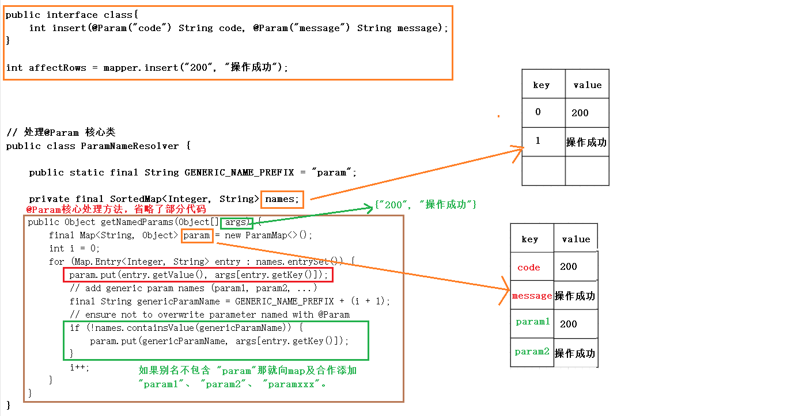
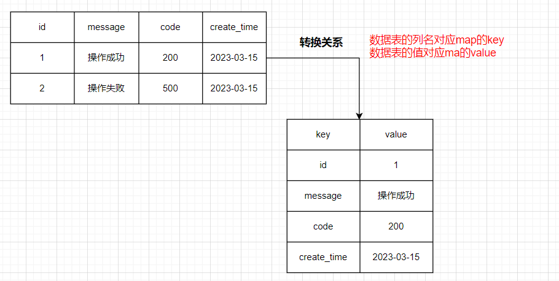
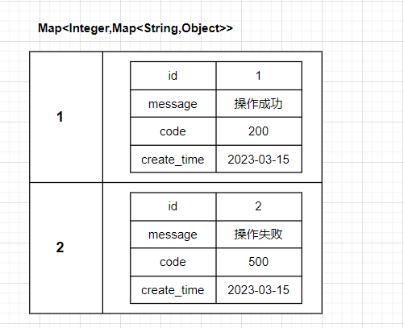

# MyBatis

## MyBatis 概述

### 什么是框架

1. freamwork被译为”框架”一词。

2. 什么是框架？

   + 一个框架是一个半成品，简单理解就是：把通用的、公共的一部分代码进行封装，封装成一大堆类和接口提供给开发者调用。
   + 为什么是半成品？因为框架仅仅提供了一些提高发者开发效率、简化开发配置的类库，但是实际开发中业务会很复杂，我们开发者通常都是基于这些框架进行开发。
   + 一个框架提供的一大堆类和接口通常会被打包成一个 jar文件，通常我们说的 jar包。项目中引入这些jar包就可以使用这些框架进行开发了。

3. java常见的框架有哪些？

   + Spring

   + SpringMVC

   + MyBatis

   + SpringBoot

     .....

### JDBC的缺点

1. 先看一段代码

   ```java
   //1.注册数据库的驱动
   DriverManager.registerDriver(new com.mysql.jdbc.Driver());
   //2.通过 DriverManager获取数据库连接
   String url=”jdbc:mysql://localhost:3306/chapter01”;
   String usernames=”root”;
   String password=”itcast”;
   Connection conn=DriverManager.getConnection(url, username, password);
   //3.通过 Connection对象获取 Statement对象
   Statement stmt= conn.createStatement();
   //4.使用 Statement执行SQL语句
   String sql=”select * from users”;
   ResultSet rs=stmt.executeQuery(sql);
   //5、操作 ResultSet结果集
   System.out.println(”id|name|password|email|birthday”);
   while (rs.next()) {
       //通过列名获取指定字段的值
       int id=rs.getInt(”id”);     
       String name=rs.getString(”name”);
       String psw=rs.getString(”password”);
       String email=rs.getString(”email”);
       Date birthday=rs.getDate(”birthday”);
       System.out.println(id+”|”+name+”|”+psw+”|”+email+”|”+birthday); 
   }
   //6、回收数据库连接
   if(rs!=null) {
       try {
           rs.close();
       }catch (SQLException e) {
           e.printStackTrace();
       }
       rs=null;
   }
   if(stmt!=null) {
       try {
           stmt.close();
       }catch (SQLException e) {
           e.printStackTrace();
       }
       stmt=null;
   }
   if(conn!=null) {
       try {
           conn.close();
       } catch (SQLException e) {
           e.printStackTrace();
       }
       conn=null;
   }
   ```

   

2. 总结JDBC缺点，引出Mybatis

   + 注册数据库的驱动、获取数据库连接、回收数据库连接这中繁琐又没技术含量的代码内能不能交给机器去完成？不用我们程序员来编写！
   + 编写的SQL语句直接和Java代码耦合在一起了，如果要更改Sql语句，那势必要改Java代码吧，违背了OCP原则不说还得重新编译打包部署！！
   + 通过列名获取指定字段的值这种代码能不能让机器通过反射去做？这里有5个字段就要写5个rs.getXxx()，万一有100个字段那不是要写100次rs.getXxx()？？

### ORM思想

1. ORM：Object Relational Mapper （对象关系映射），ORM主要是一种思想，使O（jvm中的java对象）和 R（关系型数据库）之间互相映射。

   

2. MyBatis是一个半自动化ORM，Hibernate是一个全自动化ORM。

### Mybatis简介

[Mybatis3-中文文档  传送门](https://mybatis.org/mybatis-3/zh/index.html)

[Mybatis3-英文文档  传送门](https://blog.mybatis.org/)

[MyBatis3-Github  传送门](https://github.com/mybatis/mybatis-3)

1. Mybatis简介
   + Mybatis是一个框架，它就是我们常听说的SSM框架中的M（MyBatis）。
   + Mybatis是一个优秀的持久层框架，它支持自定义Sql，存储过程以及高级映射。
   + MyBatis 免除了几乎所有的 JDBC 代码以及设置参数和获取结果集的工作。
   + MyBatis 可以通过简单的 XML 或注解来配置和映射原始类型、接口和 Java POJO为数据库中的记录。
   + Mybatis本是Apache的一个开源项目Ibatis，2010年这个项目由Apache software foundation迁移到了Google Code，并改名为Mybatis。2013年11月迁移到Github
2. Mybatis和JDBC
   + 简而言之：Mybatis的出现就是来解决JDBC缺点，本质上Mybatis的底层还是JDBC，只不过Mybatis开发人员是对JDBC进行了一层封装。
   + 对于我们开发者来说，MyBatis简单易用，功能强大，开发效率更高，免除了繁琐的配置！
3. Mybatis在三层架构的位置
   + 三层架构：Controller（视图层）、Service（业务逻辑层）、Dao（数据持久层）
   + 刚刚说过：Mybatis是一个优秀的持久层框架，那自然就是处于三层架构中的数据持久层了。


## MyBatis 入门案例

仅仅入门而已，不懂没关系，后面会一一讲解，先感受一下MyBatis 这个框架的强大！

### 数据库准备

```sql
create database powernode_mybatis;

use powernode_mybatis;

create table t_car(
    id bigint primary key auto_increment,
    car_num varchar(50) comment '汽车编号',
    brand varchar(50) comment '品牌',
    guide_price decimal(10,2) comment '厂家指导价',
    produce_time char(10) comment '生产日期',
    car_type varchar(20) comment '汽车类型'
);

insert into 
t_car(car_num, brand, guide_price, produce_time, car_type) 
values 
('10010', '奔驰',500000.00, '2018-10-15', '燃油车'),
('10011', '宝马',400000.00, '2022-05-10', '电动车'),
('10012', '奥迪',290000.00, '2021-11-10', '电动车');

select car_num, brand, guide_price, produce_time, car_type from t_car;
```


### 新建项目并添加依赖

1. 使用IDEA新建Maven项目

2. 添加mybatis和mysql驱动依赖

   + 在pom.xml文件中添加相关依赖，并刷新，第一次下载会有点慢！！

     ```xml
     <dependencies>
     
         <!-- mybatis框架依赖-->
         <dependency>
             <groupId>org.mybatis</groupId>
             <artifactId>mybatis</artifactId>
             <version>3.5.10</version>
         </dependency>
     
         <!-- mysql数据库驱动依赖-->
         <dependency>
             <groupId>com.mysql</groupId>
             <artifactId>mysql-connector-j</artifactId>
             <version>8.0.31</version>
         </dependency>
     
     </dependencies>
     ```

### Mybaits基本使用五部曲

1. 五部曲

   + 第一步：添加mybatis依赖

   + 第二步：编写mybatis核心配置文件
   + 第三步：编写xxxMapper.xml
   + 第四步：在mybatis核心配置文件中关联xxxMapper.xml
   + 第五步：编写Java代码，对表进行CRUD

2. 具体实现步骤

   + 第二步：编写mybatis核心配置文件

     + 这里我叫做”mybatis-config.xml”（取名随意），大家都比较喜欢将mybatis核心配置文件命名成“mybatis-config.xml”，那我们也就遵循这些大家都遵循的规范吧。

     + 配置文件里面的信息建议到[mybatis中文官网](https://mybatis.org/mybatis-3/zh/getting-started.html)复制粘贴，再按需求进行更改，手写很容易出错！

       ```xml
       <?xml version=”1.0” encoding=”UTF-8” ?>
       <!DOCTYPE configuration
           PUBLIC ”-//mybatis.org//DTD Config 3.0//EN”
           ”https://mybatis.org/dtd/mybatis-3-config.dtd”>
       <configuration>
           <environments default=”development”>
               <environment id=”development”>
                   <transactionManager type=”JDBC”/>
                   <dataSource type=”POOLED”>
                       <!-- 这部分内容换成自己mysql的配置信息-->
                       <property name=”driver” value=”com.mysql.cj.jdbc.Driver”/>
                       <property name=”url”
                                 value=”jdbc:mysql://localhost:3306/powernode_mybatis?serverTimezone=UTC&amp;characterEncoding=utf8&amp;useUnicode=true&amp;useSSL=false”/>
                       <property name=”username” value=”root”/>
                       <property name=”password” value=”123456”/>
                   </dataSource>
               </environment>
           </environments>
           <mappers>
               <mapper resource=”org/mybatis/example/BlogMapper.xml”/>
           </mappers>
       </configuration>
       ```

       

   + 第三步：编写xxxMapper.xml

     + 编写carMapper.xml映射文件，叫carMapper.xml原因：一般情况xxxMapper.xml文件就对应一张表，xxx就对应着表的名称，大家都遵循这种命名规范
     + 文件名称和文件存放路随意（我这里放在resources文件下）

     ```xml
     <?xml version=”1.0” encoding=”UTF-8” ?>
     <!DOCTYPE mapper
             PUBLIC ”-//mybatis.org//DTD Mapper 3.0//EN”
             ”https://mybatis.org/dtd/mybatis-3-mapper.dtd”>
     
     <!-- namespace 命名空间，暂时先不管-->
     <mapper namespace=”xxxxxxxxx”>
     
         <!-- 这里编写sql语句, 每个标签代都表着对应的sql语法-->
         <!-- id属性，到时候需要根据id来找到需要执行sql语句-->
         <select id=”select”>
             select car_num, brand, guide_price, produce_time, car_type from t_car
         </select>
     
         <update id=”update”>
             update 
             `powernode_mybatis`.`t_car`
             SET 
             `id`='3', `car_num`='10012', `brand`='奥迪', `guide_price`='290000.00', `produce_time`='2021-11-10', `car_type`='电动车'
             WHERE 
             (`id`='3');
         </update>
         
         <delete id=”delete”>
     
         </delete>
         <insert id=”insert”>
     
         </insert>
     </mapper>
     ```

     

   + 第四步：在mybatis核心配置文件中关联xxxMapper.xml

     ```xml
     <configuration>
         <mappers>
             <!--  这个mapper标签对应一个XxxMapper.xml映射文件-->
             <!--  resource表示: 这个文件从resource文件夹下查找 -->
             <mapper resource=”carMapper.xml”/>
         </mappers>
     </configuration>
     ```

     

   + 第五步：编写Java代码，对表进行增删改查

     + 从 XML 中构建 SqlSessionFactory
     + 从 SqlSessionFactory 中获取 SqlSession
     + 通过SqlSession对表进行CRUD

     ```java
     // 从 XML 中构建 SqlSessionFactory
     InputStream inputStream = Resources.getResourceAsStream(”mybatis-config.xml”);
     SqlSessionFactory sqlSessionFactory = new SqlSessionFactoryBuilder().build(inputStream);
     
     // 从 SqlSessionFactory 中获取 SqlSession
     SqlSession sqlSession = sqlSessionFactory.openSession();
     
     
     // xxxxxxxxx 对应着xxxMapper.xml文件的namespace
     // select 对应xxxMapper.xml文件中标签的id
     
     // 执行DQL语句 返回查询结结果
     List<Object> list = sqlSession.selectList(”xxxxxxxxx.select”);
     System.out.println(”list.size() = ” + list.size()); //3 对应着t_car表中的三条数据
     
     // 执行DML语句 返回表中受影响的行数
     int affectRows = sqlSession.update(”xxxxxxxxx.update”);
     System.out.println(”affectRows = ” + affectRows);
     
     // 如果执行DML语句， 需要手动提交事务
     sqlSession.commit();
     sqlSession.close();
     ```

### Mybaits使用细节

1. 关于xxxMapper.xml文件中的sql语句“;”问题，sql语句结束其实加不加“;”都可以！

2. Resources.getResourceAsStream(”mybatis-config.xml”)

   + Resources是ibatis提供的一个类，本质底层还是通过ClassLoader去加载文件的。之后如果是看到getResource或者xxxtResource之类的方法或者类，那一般都表示是从类路径下加载资源。

   + Resources.getResourceAsStream(”mybatis-config.xml”)返回一个InputStream流，还有其他方式去加载mybatis配置文件

     + 通过ClassLoader去类路径下加载资源（推荐方式）

       +  InputStream inputStream = ClassLoader.getSystemClassLoader().getResourceAsStream(”mybatis-config.xml”);

       + InputStream inputStream = Thread.currentThread().getContextClassLoader().getResourceAsStream(”mybatis-config.xml”);

         

     + 通过 FileInputStream输入流去加载文件（不推荐，移植性太差了）

       + InputStream inputStream = new FileInputStream(”磁盘绝对路径\\mybatis-config.xml”);

       

3. mybatis核心配置文件和xxxMapper.xml文件

   + 关于命名和路径都是随意的！！

4.  \<mapper resource=”xxxMapper.xml”/>

   + \<mapper resource=”xxxMapper.xml”/>：从类路径下加载资源
   + \<mapper url=”file:///d:/work/xxxMapper.xml”/>：通过绝对路径加载资源（不推荐，移植性太差了）

### Mybaits事务管理器

[事务管理器（transactionManager）](https://mybatis.org/mybatis-3/zh/configuration.html#environments)

在 MyBatis 中有两种类型的事务管理器（也就是 type="[JDBC|MANAGED]"），也就是\<transactionManager type="JDBC"/>标签的types属性值

+ JDBC ：将事务管理权交给mybatis来管理，这个配置底层是使用了 JDBC 的提交和回事务功能

  + SqlSession sqlSession = sqlSessionFactory.openSession(); 

    底层代码表现形式：

    openSessionFromDataSource() -> newTransaction() ->  new JdbcTransaction() -> JdbcTransaction类的setDesiredAutoCommit()方法

    ```java
    protected void setDesiredAutoCommit(boolean desiredAutoCommit) {
        if (this.connection.getAutoCommit() != desiredAutoCommit) {
            if (log.isDebugEnabled()) {
                // ...
            }
            this.connection.setAutoCommit(desiredAutoCommit);
        }
    }
    ```

    

  + SqlSession sqlSession = sqlSessionFactory.openSession(false); 

    + 表示不开启事务，实际上setDesiredAutoCommit方法中的 this.connection.setAutoCommit(true);不会执行，因为JDBC的AutoCommit默认就是true，那个IF语句进不去。

      ```java
      protected void setDesiredAutoCommit(boolean desiredAutoCommit) {
          // true != true ==> false
          if (this.connection.getAutoCommit() != desiredAutoCommit) {
              // ...
              // IF语句不成立， 这句话压根不执行
              this.connection.setAutoCommit(desiredAutoCommit);
          }
      }
      ```

      

  + sqlSession.commit(); 底层代码表现形式：

    ```java
    public void commit() throws SQLException {
        // this.connection.getAutoCommit() 默认是false
        if (this.connection != null && !this.connection.getAutoCommit()) {
            if (log.isDebugEnabled()) {
                log.debug("Committing JDBC Connection [" + this.connection + "]");
            }
            // IF语句不成立， 下面这句话不执行。
            this.connection.commit();
        }
    }
    ```

    

+ MANAGED： 这个配置几乎没做什么，意思就是 mybatis不负责管理事务了，而是将事务管理权交给其他容器管理，例如：spring

  \<transactionManager type="MANAGED"/>表示：不开启事务，因为 mybatis不负责管理事务了，目前我们项目没有spring容器，没人来接管管理事务这个事。

总结：关于autoCommit

+ 值为false：表示开启事务，不自动提交事务，提交事务的控制权由程序员来控制。
+ 值为true：表示自动提交事务，提交事务的控制权不由程序员来控制。

### 完整的MyBatis示例代码

```java
public class Test02 {
    public static void main(String[] args) {
        SqlSession sqlSession = null;
        try {
            // 从 XML 中构建 SqlSessionFactory
            InputStream inputStream = Resources.getResourceAsStream("mybatis-config.xml");
            SqlSessionFactory sqlSessionFactory = new SqlSessionFactoryBuilder().build(inputStream);

            // 从 SqlSessionFactory 中获取 SqlSession
            sqlSession = sqlSessionFactory.openSession();

            // 执行DML语句 返回表中受影响的行数
            int affectRows = sqlSession.update("xxxxxxxxx.update");
            System.out.println("affectRows = " + affectRows);

            // 如果执行DML语句， 需要手动提交事务
            sqlSession.commit();
        } catch (IOException e) {
            e.printStackTrace();
        } finally {
            if (sqlSession != null) {
                sqlSession.close();
            }
        }
    }
}
```


### Mybatis工具类

```java
public class SqlSessionUtil {
    private SqlSessionUtil() {
    }

    private static SqlSessionFactory sqlSessionFactory = null;

    static {
        try {
             InputStream inputStream = Resources.getResourceAsStream("mybatis-config.xml");
            sqlSessionFactory = new SqlSessionFactoryBuilder().build(inputStream);
        } catch (IOException e) {
            e.printStackTrace();
        }
    }

    public static SqlSession getSqlSession() {
        return sqlSessionFactory.openSession();
    }
}
```


### 集成单元测试

1. [Junit单元测试简介](http://jboot.com.cn/docs/junit.html)

   + 单元测试（unit testing），是指对软件中的最小可测试单元进行检查和验证。

   + JUnit 是一个 Java 编程语言的单元测试框架，目前市面上主要是使用 Junit4 和 Junit5 对 Java 程序进行单元测试。

2. Junit基本使用

   + 引入jar包依赖

     ```xml
     <!-- junit单元测试依赖-->
     <dependency>
         <groupId>junit</groupId>
         <artifactId>junit</artifactId>
         <version>4.13.2</version>
         <scope>test</scope>
     </dependency>
     ```

   + 编写单元测试程序

     ```java
     @RunWith(JUnit4.class)
     public class JunitTest {
     
         @Test
         public void testAdd() {
             System.out.println("JunitTest testAdd...");
         }
     
         @Test
         public void testSub() {
             System.out.println("JunitTest testSub...");
         }
     }
     ```

     

3. Junit测试mybatis程序

   ```java
   @RunWith(JUnit4.class)
   public class CarMapperTest {
   
       @Test
       public void testSelect() {
           SqlSession sqlSession = SqlSessionUtil.getSqlSession();
           List<Object> list = sqlSession.selectList("xxxxxxxxx.select");
           System.out.println("list = " + list.size());
           sqlSession.close();
       }
   
       @Test
       public void testUpdate() {
           SqlSession sqlSession = SqlSessionUtil.getSqlSession();
           int affectRows = sqlSession.update("xxxxxxxxx.update");
           System.out.println("affectRows = " + affectRows);
           sqlSession.commit();
           sqlSession.close();
       }
   }
   ```

   

### 集成日志框架

1. [mybtis内置的实现日志](https://mybatis.org/mybatis-3/zh/configuration.html#settings)，STDOUT_LOGGING  标准控制台输出日志。

   + 有时候希望看到mybatis执行sql语句时的具体信息（也是方便排查错误），比如：sql语句、sql参数、DML语句执行结果受影响的行数等等...，那就需要开启日志来实现这种效果。

   + 要开启mybatis内置的实现日志很简单，在mybatis-config.xml文件中配置即可，是不是很简单！！！

     ```xml
     <settings>
         <setting name="logImpl" value="STDOUT_LOGGING"/>
     </settings>
     ```

     现在相比之前是不是日志信息更加清晰了！！

     

   + mybatis-config.xml文件中标签书写顺序是有规则的，但是具体的规则不用记，因为mybatis-config.xml文件受一个dtd文件约束，那么我们仅仅需要参考这个dtd文件就ok了。

     ```xml
     <!DOCTYPE configuration
             PUBLIC "-//mybatis.org//DTD Config 3.0//EN"
             "https://mybatis.org/dtd/mybatis-3-config.dtd">
     ```

2. 常见的日志框架

   + 目前的日志框架可以分为两种：一种是jdk自带的，另一种是第三方实现的。

     + jdk自带

       + jdk自带的日志是jdk-logging，简称jul（java.util.logging包的简称），jul的配置文件是`logging.properties`。

       + Tomcat本身的日志实现是`tomcat-juli.jar`，从jar名就可以看出来，它是对jul的实现，内部对jul进行了一定的封装。

         ```java
         import java.util.logging.Level;
         import java.util.logging.Logger;
         
         public class Hello {
             public static void main(String[] args) {
                 Logger logger = Logger.getGlobal();
                 logger.info("start process...");
                 logger.warning("memory is running out...");
                 logger.fine("ignored.");
                 logger.severe("process will be terminated...");
             }
         }
         ```

         

     + 第三方实现

       + 常见的有logback、log4j、log4j2这三大日志框架，其中log4j2是log4j 1.x的升级版，因为改动很大，所以作为一个新的日志框架独立使用。
       + logback的配置文件是 logback.xml，log4j的配置文件是`log4j.xml`，log4j2的配置文件是`log4j2.xml`。

   + 日志门面

     + 日志门面commons-logging

       

     + slf4j是Simple Logging Facade for Java，即简单日志门面，是目前较为流行的门面接口，用法和jcl一样，即使用slf4j自身提供的接口来打印日志。

       ```java
       import org.slf4j.Logger;
       import org.slf4j.LoggerFactory;
       
       public class Test {
           public static void main(String[] args) {
               Logger logger = LoggerFactory.getLogger(getClass());
               logger.info("Test");
           }
       }
       ```

       使用Lombok框架，可以通过一个简单的`@Slf4j`注解来简洁方便地使用Slf4j打印日志

       ```xml
       <dependency>
           <groupId>org.projectlombok</groupId>
           <artifactId>lombok</artifactId>
           <version>1.18.24</version>
       </dependency>
       ```

       

       ```java
       @Slf4j
       public class Test {
           public static void main(String[] args) {
               log.info("Test");
           }
       }
       ```

       

3. 集成日志框架

   + STDOUT_LOGGING，也是mybatis内置的，功能不够强大，比如看不到当前执行时间、当前执行线程、当前日志打印级别等等...

   + 集成三方日志框架：使用slf4j作为日志门面，使用logback作为实现。

     + 引入依赖，只需要引入logback就好了，因为logback中依赖slf4j，由于Maven有依赖传递关系，所以会自动帮我们下载！

       ```xml
       <dependency>
           <groupId>ch.qos.logback</groupId>
           <artifactId>logback-classic</artifactId>
           <version>1.2.11</version>
       </dependency>
       ```

       

     + 编写logback的配置文件，

       + 名字叫“logback.xml”或者“logback-test.xml”，文件位置需要放在类路径下，记住：文件名称和文件路径都不能乱写！！
       + 这个文件信息建议从[网上复制](https://www.cnblogs.com/gavincoder/p/10091757.html)，再按照需要进行更改，自己写很容易出错！！！

       ```xml
       <?xml version="1.0" encoding="UTF-8"?>
       <configuration debug="false">
       
           <!--定义日志文件的存储地址 勿在 LogBack 的配置中使用相对路径-->
           <property name="LOG_HOME" value="${LOG_PATH:-.}/logs"/>
       
           <!--控制台日志， 控制台输出 -->
           <appender name="STDOUT" class="ch.qos.logback.core.ConsoleAppender">
               <encoder class="ch.qos.logback.classic.encoder.PatternLayoutEncoder">
                   <!--格式化输出：%d表示日期，%thread表示线程名，%-5level：级别从左显示5个字符宽度,%msg：日志消息，%n是换行符-->
                   <pattern>%d{yyyy-MM-dd HH:mm:ss.SSS} [%thread] %-5level %logger{50} - %msg%n</pattern>
               </encoder>
           </appender>
       
           <!--文件日志， 按照每天生成日志文件 -->
           <appender name="FILE" class="ch.qos.logback.core.rolling.RollingFileAppender">
               <rollingPolicy class="ch.qos.logback.core.rolling.TimeBasedRollingPolicy">
                   <!--日志文件输出的文件名-->
                   <FileNamePattern>${LOG_HOME}/TestWeb.log.%d{yyyy-MM-dd}.log</FileNamePattern>
                   <!--日志文件保留天数-->
                   <MaxHistory>30</MaxHistory>
               </rollingPolicy>
               <encoder class="ch.qos.logback.classic.encoder.PatternLayoutEncoder">
                   <!--格式化输出：%d表示日期，%thread表示线程名，%-5level：级别从左显示5个字符宽度%msg：日志消息，%n是换行符-->
                   <pattern>%d{yyyy-MM-dd HH:mm:ss.SSS} [%thread] %-5level %logger{50} - %msg%n</pattern>
               </encoder>
               <!--日志文件最大的大小-->
               <triggeringPolicy class="ch.qos.logback.core.rolling.SizeBasedTriggeringPolicy">
                   <MaxFileSize>10MB</MaxFileSize>
               </triggeringPolicy>
           </appender>
       
           <!-- show parameters for hibernate sql 专为 Hibernate 定制 -->
           <!-- <logger name="org.hibernate.type.descriptor.sql.BasicBinder" level="TRACE"/>-->
           <!-- <logger name="org.hibernate.type.descriptor.sql.BasicExtractor" level="DEBUG"/>-->
           <!-- <logger name="org.hibernate.SQL" level="DEBUG"/>-->
           <!-- <logger name="org.hibernate.engine.QueryParameters" level="DEBUG"/>-->
           <!-- <logger name="org.hibernate.engine.query.HQLQueryPlan" level="DEBUG"/>-->
       
           <!--mybatis log configure 专为 mybatis 定制 -->
           <logger name="com.apache.ibatis" level="TRACE"/>
           <logger name="java.sql.Connection" level="DEBUG"/>
           <logger name="java.sql.Statement" level="DEBUG"/>
           <logger name="java.sql.PreparedStatement" level="DEBUG"/>
       
           <!-- 日志输出级别 -->
           <root level="DEBUG">
               <appender-ref ref="STDOUT"/>
               <appender-ref ref="FILE"/>
           </root>
       </configuration>
       ```

     + 关掉mybatis-config.xml中的settings标签配置信息，原因是mybatis官网有这样一句话：“指定 MyBatis 所用日志的具体实现，未指定时将自动查找”，当然也可以不用关闭。我们项目用slf4j，那就指定成SLF4J 。

       ```xml
       <settings>
           <setting name="logImpl" value="SLF4J"/>
       </settings>
       ```

       


## MyBatis 增删改查

### 完成insert使用Map传参

1. 分析代码并发现存在的问题

   ```xml
   <insert id="carInsert">
       insert into 
       	t_car (car_num, brand, guide_price, produce_time, car_type) 
       values 
       	('4', '10014', '丰田凯美瑞', '160000.00', '2022-10-15', '燃油车')
   </insert>
   ```

   + 数据直接写死了，真实开发中新增的数据应该是前端动态传递的。

   + 在JDBC中是怎么解决的呢？

     + 通过PreparedSatement来预处理sql，sql语句中使用“?”占位符来防止sql预编译，也方便动态传参！
     + 然后通过ps.setXXX(index, data)来给占位符参数赋值。

   + 在mybatis中我们可以使用“#{}” 来动态传递参数，同时也能防止sql注入，本质上mybatis中的“#{}”和PreparedSatement中的“?”功能是一样的。

     ```xml
     <insert id="carInsert">
         insert into
         	t_car (car_num, brand, guide_price, produce_time, car_type)
         values
         	(#{},#{},#{},#{},#{})
     </insert>
     ```

2. 在mybatis中我们可以使用“#{}” 来动态传递参数，那具体怎么传递呢？换句话说怎么可以把动态的数据按某个规则传递到“#{}”中呢？

   + 分析SqlSession的insert方法

     ```java
     // var1 传递 xxxMapper.xml文件的nameSpace.标签ID
     int insert(String var1);
     
     // var1 传递 xxxMapper.xml文件的nameSpace.标签ID
     // var2 向标签中传递的数据
     int insert(String var1, Object var2);
     ```

   + 我们新建一个Map对象，通过insert(String var1, Object var2)方法，传递数据

     ```java
     SqlSession sqlSession = SqlSessionUtil.getSqlSession();
     
     HashMap<String, Object> hashMap = new HashMap<>();
     hashMap.put("k1", "'10014'");
     hashMap.put("k2", "丰田凯美瑞");
     hashMap.put("k3", 160000.00);
     hashMap.put("k4", "2022-10-15");
     hashMap.put("k5", "'燃油车'");
     
     sqlSession.insert("xxxxxxxxx.carInsert", hashMap);
     
     sqlSession.commit();
     sqlSession.close();
     ```

   + 回到carMapper.xml文件中，现在的问题是怎么把传递的参数取出来呢？“#{}” 这里面怎么写？？

     很简单：“#{}”里面直接写Map对象的key就ok啦！！

     注意：如果key写错了取到的就是“nul”，假如数据库添加了非空约束，那就直接报错了！

     ```xml
     <insert id="carInsert">
         insert into
             t_car (car_num, brand, guide_price, produce_time, car_type)
         values
             (#{k1},#{k2},#{k3},#{k4},#{k5})
     </insert>
     ```

3. 运行单元测试，注意观察日志或者看数据库记录，新增就OK了吧！

   + 但是我们new Map的时候，key名称是不是太low了？？k1、k2、k3...哪有这样命名的？

   + 建议命名的时候还是尽量做到“见名知意”

     ```java
     HashMap<String, Object> hashMap = new HashMap<>();
     hashMap.put("carNum", "10014");
     hashMap.put("brand", "丰田凯美瑞");
     hashMap.put("guidePrice", 160000.00);
     hashMap.put("produceTime", "2022-10-15");
     hashMap.put("carType", "燃油车");
     ```

     ```xml
     <insert id="carInsert">
         insert into
        		t_car (car_num, brand, guide_price, produce_time, car_type)
         values
         	(#{carNum},#{brand},#{guidePrice},#{produceTime},#{carType})
     </insert>
     ```

     

### 完成insert使用Pojo传参

1. 那就顾名思义呗，把刚刚Map当成一个Pojo作为instert的第二个参数传递进去呗，okok，开干！先弄一Pojo对象

   用了一下[Lombok](https://projectlombok.org/)插件！！

   ```java
   @Data
   @AllArgsConstructor
   @NoArgsConstructor
   public class Car {
   
       // 注意使用包装类的原因：防止数据库查出的数据为null，而null赋值给基本数据类型会报错！
       private Integer id;
       private String carNum;
       private String brand;
       private Double guidePrice;
       private String produceTime;
       private String carType;
   }
   ```

2. 编写java代码

   ```java
   Car car = new Car(null, "10014", "丰田凯美瑞", 160000.00, "2022-10-15", "燃油车");
   sqlSession.insert("carMapper.carInsert", car);
   ```

3. 回到carMapper.xml文件中, 把参数取出来放到对应的“#{}”中呗！

   + 怎么取？刚刚从Map中取是通过key取的，那现在Pojo对象呢？

   + “#{}”从Pojo对象取数据，严谨来说是通过getXxx方法的xx（名称）来取的，不严谨的说话就是通过Pojo属性名称取，为什么这样说呢？？

   + 直接上代码

     + 常规做法以及原理剖析（推荐，推荐！！！！）

       ```xml
       <insert id="carInsert">
           insert into
           	t_car (car_num, brand, guide_price, produce_time, car_type)
           values
           	(#{carNum},#{brand},#{guidePrice},#{produceTime},#{carType})
       </insert>
       ```

       lombook会通过注解，在编译阶段帮我们生成一个类，这类中包含了对应属性的构造器，getter和setter等等方法...

       比如：

       + #{carNum}  --> 会调用car.getCarNum  --> carNum
       + #{brand}  --> 会调用car.getBrand --> brand
       + #{guidePrice} --> 会调用car.getGuidePrice  -->guidePrice

       #{carNum}中放的名称，本质就是car对象中对应getter方法去掉“get”之后的单词再首字母再小写的结果！

     + 属性名称写错了的补救办法（开发中按照上面的方法正常写就对了，当前这种属于没事找事做！）

       + 假如手抖写错了，把#{carNum}写成了#{carAbc}，那运行直接报错呗！！

          There is no getter for property named 'carAbc' in 'class com.ilovesshan.pojo.Car'，这句话意思很简单！！，Car对象中没找到carAbc对应的getter方法。

       + 怎么解决？

         那我在Car对象中再弄一个getCarAbc方法不就OK了!!

         ```java
         @Data
         @AllArgsConstructor
         @NoArgsConstructor
         public class Car {
             // 其他属性省略了...
             public String getCarAbc() {
                 return "我是手动添加的 关于carAbc属性的getter方法";
             }
         }
         ```

         

### 完成delete

1. 老套路，在carMapper.xml中先写delete标签并补充sql语句，一样的感觉，一样的套路！！

   ```xml
   <delete id="deleteById">
       delete from t_car where id = #{?}
   </delete>
   ```

2. 编写java代码。

   ```java
   @Test
   public void testCarDeleteById() {
       SqlSession sqlSession = SqlSessionUtil.getSqlSession();
       sqlSession.delete("carMapper.deleteById", 7);
       // 执行DML语句 记得提交事务
       sqlSession.commit();
       sqlSession.close();
   }
   ```

   

### 完成update

+ 套路一样，直接上代码！！

  ```xml
  <update id="update">
      update t_car
      	set car_num = #{carNum}, brand = #{brand}, guide_price = #{guidePrice}, produce_time = #{produceTime} , car_type = #{carType}
      where
      	id = #{id}
  </update>
  ```

  ```java
  @Test
  public void testCarUpdate() {
      SqlSession sqlSession = SqlSessionUtil.getSqlSession();
      Car car = new Car(4, "10014", "丰田卡罗拉", 120000.00, "2021-10-15", "氢气车");
      sqlSession.update("carMapper.update",car);
      sqlSession.commit();
      sqlSession.close();
  }
  ```

  


### 完成select查询单个

1. carMapper.xml编写sql代码

   ```xml
   <select id="selectById">
      select id, car_num, brand, guide_price, produce_time, car_type from t_car where id = #{id};
   </select>
   ```

2. 编写Java代码

   ```java
   @Test
   public void testSelectById() {
       SqlSession sqlSession = SqlSessionUtil.getSqlSession();
       Object selectOne = sqlSession.selectOne("carMapper.selectById", 1);
       System.out.println("selectOne = " + selectOne);
       sqlSession.commit();
       sqlSession.close();
   }
   ```

   会发现运行就报错了， A query was run and no Result Maps were found for the Mapped Statement 'carMapper.selectById'.  It's likely that neither a Result Type nor a Result Map was specified.

3. 怎么解决呢？

   + 回想写JDBC代码的时候，我们从ResultSet中取数据的时候，是不是把这些数据都封装成了一个实体对象。

     ```java
     User user = null;
     if (rs.next()) {
         //通过列名获取指定字段的值
         int id=rs.getInt(”id”);     
         String name=rs.getString(”name”);
         // 封装成了一个实体对象
         user = new User(id, name);
     }
     // ...
     ```

   + 回到mybatis里面，你压根没告诉mybatis，你这次查询到的数据给我封装成一个啥实体类对象？是封装成User、Ssudent还是Car？？你得告诉一下mybatis，因为mybatis是一个半自动ORM框架，所以mybatis就会通过反射给你传入的实体类的属性赋值然后返再还给你这个对象！

     怎么告诉mybatis这次查询的结果要封装成啥对象呢？通过resultType属性指定即可，注意这里的resultType值对应的pojo对象，暂时写成类全限定名称，后面有简化写法！！

     ```java
     <select id="selectById"  resultType="com.ilovesshan.pojo.Car">
         select id, car_num, brand, guide_price, produce_time, car_type from t_car where id = #{id};
     </select>
     ```

   + 再执行一次代码，发现不报错了，但是值不对。。。。id和brand有值，其他的没值。

     selectOne = Car(id=1, carNum=null, brand=奔驰, guidePrice=null, produceTime=null, carType=null)

     原因是：mybatis是通过反射对属性进行赋值的，你这里叫carNum，但是查出来的数据名称叫car_num，名称都不一样能赋值？？

     解决办法：修改一下sql语句手动加一个别名就ok啦（后面会有更简单的办法）！！

     ```xml
     <select id="selectById" resultType="com.ilovesshan.pojo.Car">
         select id, car_num carNum, brand, guide_price guidePrice, produce_time produceTime, car_type carType from t_car where id = #{id};
     </select>
     ```

     ok，查询结果也正确了

     selectOne = Car(id=1, carNum=10010, brand=奔驰, guidePrice=500000.0, produceTime=2018-10-15, carType=燃油车)

### 完成select查询列表

1. select查询单个已经学会了，select查询列表也很简单

   注意：如果是查询多条记录，resultType的值并不是返回值的类型，而是返回集合中元素的类型，例如：List\<Car>

   ```xml
   <select id="selectList" resultType="com.ilovesshan.pojo.Car">
       select id, car_num carNum, brand, guide_price guidePrice, produce_time produceTime, car_type carType from t_car
   </select>
   ```

   ```java
   @Test
   public void testSelectList() {
       SqlSession sqlSession = SqlSessionUtil.getSqlSession();
       List<Object> list = sqlSession.selectList("carMapper.selectList");
       list.forEach(System.out::println);
       sqlSession.commit();
       sqlSession.close();
   }
   ```

### MyBatis命名空间

1. 命名空间的作用

    每一个Mapper映射文件都有一个namespace，这个namespace主要是来防止sql id冲突的，举个例子：

   

   + AMapper.xml

     ```xml
     <mapper namespace="xxx">
         <select id="selectList" resultType="com.ilovesshan.pojo.Car">
             select 
             	id, car_num carNum, brand, guide_price guidePrice, produce_time produceTime, car_type carType 
             from 
            	 	t_car
         </select>
     </mapper>
     ```

     

   + BMapper.xml

     ```xml
     <mapper namespace="xxx">
         <select id="selectList" resultType="com.ilovesshan.pojo.Car">
             select 
                 id, car_num carNum, brand, guide_price guidePrice, produce_time produceTime, car_type carType 
             from 
                 t_car
         </select>
     </mapper>
     ```

     

   + mybatis配置文件中注册

     ```xml
     <mappers>
         <mapper resource="aMapper.xml"/>
         <mapper resource="bMapper.xml"/>
     </mappers>
     ```

     

   + 编写java代码

     ```java
     public class NameSpaceMapperTest {
         @Test
         public void testSelectList() {
             SqlSession sqlSession = SqlSessionUtil.getSqlSession();
             List<Object> list = sqlSession.selectList("xxx.selectList");
             list.forEach(System.out::println);
             sqlSession.close();
         }
     }
     ```

     运行就直接报错了：Error parsing Mapper XML. The XML location is 'bMapper.xml'. Cause: java.lang.IllegalArgumentException: Mapped Statements collection already contains value for xxx.selectList. please check aMapper.xml and bMapper.xml

   

2. 解决命名空间冲突

   + 解决这个问题也很简单，我们只需要给每个Mapper文件的命名空间（namespace）取一个不一样的名字就好了！！

   + 调用的时候通过namespace.id格式进行调用，通过namespace就可以明确要执行那个映射文件的sql语句，比如：
     + sqlSession.selectList("aMapper.selectList");
     + sqlSession.selectList("bMapper.selectList");

   

## MyBatis 配置文件详解

### 多环境配置 environments

[多环境配置参考地址](https://mybatis.org/mybatis-3/zh/configuration.html#environments)

1. MyBatis 可以配置成适应多种环境，例如，开发、测试和生产环境需要有不同的配置。

   + 每个数据库（环境）应该对应一个 SqlSessionFactory 实例。

   ```xml
   <!-- 
   	environments 表示可以配置多个环境
   	default 表示默认启用那个环境
   	注意：environment的id属性值不能重复
   -->
   
   <environments default="development">
       <environment id="development">
           <transactionManager type="JDBC"/>
           <dataSource type="POOLED">
               <property name="driver" value="com.mysql.cj.jdbc.Driver"/>
               <property name="url" value="jdbc:mysql://localhost:3306/powernode_mybatis"/>
               <property name="username" value="root"/>
               <property name="password" value="123456"/>
           </dataSource>
       </environment>
   
       <!-- 这个是线上的环境-->
       <environment id="production">
           <transactionManager type="JDBC"/>
           <dataSource type="POOLED">
               <property name="driver" value="com.mysql.cj.jdbc.Driver"/>
               <property name="url" value="jdbc:mysql://110.23.56.8:3306/powernode_mybatis"/>
               <property name="username" value="ilovesshan"/>
               <property name="password" value="ilovesshan!@#123"/>
           </dataSource>
       </environment>
   
   </environments>
   ```

2. 通过代码创建指定环境

   ```java
   InputStream in = Resources.getResourceAsStream("mybatis-config.xml");
   
   // 使用默认环境
   SqlSessionFactory sessionFactory1 = new SqlSessionFactoryBuilder().build(in);
   
   // 创建指定环境
   SqlSessionFactory sessionFactory2 = new SqlSessionFactoryBuilder().build(in, "环境ID");
   ```


### 事务管理器 transactionManager

入门案例中提到过，这里简单回顾一下

+ MyBatis 中有两种类型的事务管理器：JDBC / MANAGED

  + JDBC ：mybatis来负责管理事务，管理事务的方式是通过原始JDBC的方式。

    conn.setAutoCommit(false);

    .......

    conn.cmmit()

  + MANAGED：mybatis将事务权交给JEE容器来管理，例如：Spring。

+ \<transactionManager type="">，type值可以取JDBC或者MANAGED，大小写无所谓，但是只能是二选一。

  + mybatis底层提供了一个Transaction接口和两个对应实现类：JdbcTransaction和ManagedTransaction。

  + type="JDBC"，那么mybatis底层就创建JdbcTransaction实例来处理相关逻辑。

  + type="MANAGED"，那么mybatis底层就创建ManagedTransaction实例来处理相关逻辑。

    

### 数据源 dataSource

1. 什么是数据源？

   + dataSource 翻译为中文就是：“数据源”，字面意思翻译就是：“数据的源头”。
   + 其实学过JDBC之后，我们可以将数据源理解成是一个数据库连接池，比如常见的数据源：
     + 阿里巴巴的德鲁伊（druid）
     + dbcp
     + c3po
     + ...

2. mybatis中，通过\<dataSource type=""> 标签来配置数据源，type的值有三个可以选择：POOLED | UNPOOLED | JNDI，只能是三选一。

   + UNPOOLED ：采用传统的获取连接的方式，虽然也实现Javax.sql.DataSource接口，但是并没有使用池的思想 。 

     + 每次请求时都会打开和关闭连接，在并发量比较大的时候，这种设定会比较耗费性能。 
     + 一些常用属性，具体配置可以参考mybatis[官方网站](https://mybatis.org/mybatis-3/zh/configuration.html#environments)。
       + `driver` – 这是 JDBC 驱动的 Java 类全限定名（并不是 JDBC 驱动中可能包含的数据源类）。
       + `url` – 这是数据库的 JDBC URL 地址。
       + `username` – 登录数据库的用户名。
       + `password` – 登录数据库的密码。
       + ...

   + POOLED ：采用传统的javax.sql.DataSource规范中的连接池，mybatis中有针对规范的实现 。 

     + 这种数据源的实现利用“池”的概念将 JDBC 连接对象组织起来，避免了创建新的连接实例时所必需的初始化和认证时间。 这种处理方式很流行，能使并发 Web 应用快速响应请求。

     + 列举一些常用的属性（这些属性对应的值需根据对应业务进行测试，配置的好可能达到事半功倍的效果！）。
       - `poolMaximumActiveConnections` – 在任意时间可存在的活动（正在使用）连接数量，默认值：10
       - `poolMaximumIdleConnections` – 任意时间可能存在的空闲连接数。
       - `poolMaximumCheckoutTime` – 在被强制返回之前，池中连接被检出时间，默认值：20000 毫秒（即 20 秒）
       - ...

   + JNDI：采用服务器提供的JNDI技术实现，来获取DataSource对象，不同的服务器所能拿到DataSource是不一样。 

     + 这个数据源实现是为了能在如 EJB 或应用服务器这类容器中使用，容器可以集中或在外部配置数据源，然后放置一个 JNDI 上下文的数据源引用。

     + 注意：如果不是web或者maven的war工程，JNDI是不能使用的。

       

### 属性 properties

1. Java中有个Properties对象，底层维护了一个Map，这个Map的key和value都是字符串类型。其实\<properties>标签也是这个原理。

2. properties基本使用

   定义好的属性可以在整个配置文件中使用，通过${name}取值。

   ```xml
   <properties>
       <property name="jdbc.driver" value="jdbc:mysql://110.23.56.8:3306/powernode_mybatis"/>
       <property name="jdbc.url" value="com.mysql.cj.jdbc.Driver"/>
       <property name="jdbc.username" value="root"/>
       <property name="jdbc.password" value="123456"/>
   </properties>
   ```

   ```xml
   <dataSource type="POOLED">
       <property name="jdbc.driver" value="${driver}"/>
       <property name="jdbc.url" value="${url}"/>
       <property name="jdbc.username" value="${username}"/>
       <property name="jdbc.password" value="${password}"/>
   </dataSource>
   ```

3. properties标签有一个resource属性。

   + 一看到resource是不是就可以联想到从类路径下加载资源及文件，没问题，就是这样的！！
   + 我们可以把一些配置属性放到properties文件中，然后通过properties标签的resource属性进行引用

   ```properties
   # jdbc.properties
   driver=com.mysql.cj.jdbc.Driver
   url=jdbc:mysql://localhost:3306/powernode_mybatis
   username=root
   password=123456
   ```

   ```xml
   <properties resource="jdbc.properties">
       <!-- 也可以在这里面配置一些其他属性 -->
       <!-- 这里配置属性比resource指定文件中的属性，使用优先级更高 -->
       <property name="logLevel" value="debug"/>
       <property name="debugTag" value="com.ilovesshan"/>
   </properties>
   ```

4. properties标签还有一个url属性，表示从绝对路径下查找资源，这种方式不推荐！！！

   

### properties 和 mapper 的url属性

```xml
<!-- 推荐 类路径下查找资源 -->
<mapper resource="carMapper.xml"/>
<properties resource="jdbc.properties"/>

<!-- 不推荐 绝对路径下查找资源 移植性很差-->
<mapper resource="file:///D:/路径"/>
<properties resource="file:///D:/路径"/>
```


## WEB应用中使用MyBatis

### 项目介绍和技术点

1. 掌握使用三层架构实现银行转账案例
2. 掌握在WEB应用中使用MyBatis
3. 掌握使用ThreadLocal来解决事务问题
4. 引出MyBatis接口代理机制

### 项目搭建

1. 新建数据库和数据表（Account）

   ```sql
   create database powernode_mybatis;
   use powernode_mybatis;
   
   create table account(
       id int primary key auto_increment,
       username varchar(20),
       account decimal(10,2)
   );
   
   insert into account(username, account) values ("ilovesshan", 1000.00),("admin", 0.00);
   
   select id, username, account from account;
   ```

   

2. 新建maven工程，使用 “maven-archety-webapp”作为项目模板，注意修改 “web.xml”文件内容。

   ```xml
   <web-app xmlns="https://jakarta.ee/xml/ns/jakartaee"
            xmlns:xsi="http://www.w3.org/2001/XMLSchema-instance"
            xsi:schemaLocation="https://jakarta.ee/xml/ns/jakartaee
                                https://jakarta.ee/xml/ns/jakartaee/web-app_5_0.xsd"
            version="5.0"
            metadata-complete="false">
   </web-app>
   ```

   

3. pom.xml中添加项目依赖

   ```xml
   <dependency>
       <groupId>jakarta.servlet</groupId>
       <artifactId>jakarta.servlet-api</artifactId>
       <version>4.0.4</version>
   </dependency>
   
   <dependency>
       <groupId>org.mybatis</groupId>
       <artifactId>mybatis</artifactId>
       <version>3.5.10</version>
   </dependency>
   
   <dependency>
       <groupId>org.projectlombok</groupId>
       <artifactId>lombok</artifactId>
       <version>1.18.24</version>
   </dependency>
   
   <dependency>
       <groupId>mysql</groupId>
       <artifactId>mysql-connector-java</artifactId>
       <version>8.0.31</version>
   </dependency>
   ```

   

4. 准备数据库配置文件（jdbc.properties）

   ```properties
   jdbc.driver=com.mysql.cj.jdbc.Driver
   jdbc.url=jdbc:mysql://localhost:3306/powernode_mybatis
   jdbc.username=root
   jdbc.password=123456
   ```

5. 准备mybatis配置文件（mybatis-config.xml）

   ```xml
   <?xml version="1.0" encoding="UTF-8" ?>
   <!DOCTYPE configuration
           PUBLIC "-//mybatis.org//DTD Config 3.0//EN"
           "http://mybatis.org/dtd/mybatis-3-config.dtd">
   <configuration>
       <properties resource="jdbc.properties"/>
   
       <settings>
           <setting name="logImpl" value="STDOUT_LOGGING"/>
       </settings>
   
       <environments default="development">
           <environment id="development">
               <transactionManager type="JDBC"/>
               <dataSource type="POOLED">
                   <property name="driver" value="${jdbc.driver}"/>
                   <property name="url" value="${jdbc.url}"/>
                   <property name="username" value="${jdbc.username}"/>
                   <property name="password" value="${jdbc.password}"/>
               </dataSource>
           </environment>
       </environments>
       <mappers>
           <mapper resource="AccountMapper.xml"/>
       </mappers>
   </configuration>
   ```

   

6. 准备Mapper映射文件（AccountMapper.xml）

   ```xml
   <?xml version="1.0" encoding="UTF-8" ?>
   <!DOCTYPE mapper
           PUBLIC "-//mybatis.org//DTD Mapper 3.0//EN"
           "http://mybatis.org/dtd/mybatis-3-mapper.dtd">
   <mapper namespace="account">
   
   </mapper>
   ```

7. 准备前端页面

   ```html
   <!doctype html>
   <html lang="en">
       <head>
           <meta charset="UTF-8">
           <meta name="viewport"
                 content="width=device-width, user-scalable=no, initial-scale=1.0, maximum-scale=1.0, minimum-scale=1.0">
           <meta http-equiv="X-UA-Compatible" content="ie=edge">
           <title>账户交易</title>
       </head>
       <body>
           <form method="post" action="/account/transfer">
               出账账户：<input type="text" name="from" value="ilovesshan">
               <br/>
               入账账户：<input type="text" name="to" value="admin">
               <br/>
               交易金额：<input type="text" name="account" value="100">
               <br/>
               <input type="submit" value="确认交易">
           </form>
       </body>
   </html>
   ```

8. 按照三层架构对项目分层以及建包

   参考JavaWeb中的[MVC讲解章节](https://ilovesshan.github.io/pages/backend/javaWeb.html#%E4%BD%BF%E7%94%A8%E4%B8%89%E5%B1%82%E6%9E%B6%E6%9E%84%E6%94%B9%E9%80%A0%E9%A1%B9%E7%9B%AE)

9. 新建Accountshi实体类

   ```java
   @Data
   @NoArgsConstructor
   @AllArgsConstructor
   public class Account {
       private Integer id;
       private String username;
       private Double account;
   }
   ```

   

10. 自定义异常

    ```java
    public class TransferException extends Exception {
        public TransferException() {
        }
    
        public TransferException(String message) {
            super(message);
        }
    }
    ```

    

11. sqlSession工具类

    ```java
    public class SqlSessionUtil {
        private SqlSessionUtil() {
        }
    
        private static SqlSessionFactory sqlSessionFactory = null;
    
        static {
            try {
                InputStream inputStream = Resources.getResourceAsStream("mybatis-config.xml");
                sqlSessionFactory = new SqlSessionFactoryBuilder().build(inputStream);
            } catch (IOException e) {
                e.printStackTrace();
            }
        }
    
        public static SqlSession getSqlSession() {
            return sqlSessionFactory.openSession();
        }
    }
    ```

    

### 项目实现具体实现

1. 编写AccountServlet

   ```java
   @WebServlet("/transfer")
   public class AccountServlet extends HttpServlet {
   
       private final AccountService accountService = new AccountServiceImpl();
   
       @Override
       protected void doPost(HttpServletRequest req, HttpServletResponse resp) throws ServletException, IOException {
           resp.setContentType("text/html;charset=utf-8");
           PrintWriter writer = resp.getWriter();
   
           String from = req.getParameter("from");
           String to = req.getParameter("to");
           Double account = Double.parseDouble(req.getParameter("account"));
   
           try {
               accountService.transfer(from, to, account);
               writer.write("转账成功!!");
           } catch (Exception e) {
               e.printStackTrace();
               writer.write(e.getMessage());
           }
       }
   }
   ```

   

   

2. 编写AccountSerVice接口和实现类（AccountSerViceImpl）

   ```java
   public interface AccountService {
       void transfer(String from, String to, Double account) throws TransferException;
   }
   ```

   ```java
   public class AccountServiceImpl implements AccountService {
       private final AccountDao accountDao = new AccountDaoImpl();
   
       @Override
       public void transfer(String from, String to, Double account) throws TransferException {
           Account fromAccount = accountDao.selectByUsername(from);
   
           if (fromAccount.getAccount() < account) {
               throw new TransferException("转账失败，余额不足!!!");
           }
           Account toAccount = accountDao.selectByUsername(to);
   
           fromAccount.setAccount(fromAccount.getAccount() - account);
           toAccount.setAccount(toAccount.getAccount() + account);
   
           int affectRows = accountDao.update(fromAccount);
           affectRows += accountDao.update(toAccount);
   
           if (affectRows != 2) {
               throw new TransferException("转账失败，未知原因!!!");
           }
       }
   }
   
   ```

   

3. 编写AccountDao接口和实现类（AccountDaoImpl）

   ```java
   public interface AccountDao {
       Account selectByUsername(String from);
   
       int update(Account fromAccount);
   }
   ```

   ```java
   public class AccountDaoImpl implements AccountDao {
       @Override
       public Account selectByUsername(String username) {
           SqlSession sqlSession = SqlSessionUtil.getSqlSession();
           Account account = sqlSession.selectOne("account.selectByUsername", username);
           sqlSession.close();
           return account;
       }
   
       @Override
       public int update(Account fromAccount) {
           SqlSession sqlSession = SqlSessionUtil.getSqlSession();
           int affectRow = sqlSession.update("account.update", fromAccount);
           sqlSession.commit();
           sqlSession.close();
           return affectRow;
       }
   }
   ```

4. 补充AccountMapper.xml

   ```java
   <?xml version="1.0" encoding="UTF-8" ?>
   <!DOCTYPE mapper
           PUBLIC "-//mybatis.org//DTD Mapper 3.0//EN"
           "http://mybatis.org/dtd/mybatis-3-mapper.dtd">
   <mapper namespace="account">
       
       <select id="selectByUsername" resultType="com.ilovesshan.pojo.Account">
           select id, username, account from account where username like #{username}
       </select>
   
       <update id="update">
          update account set account = #{account} where id = #{id}
       </update>
           
   </mapper>
   ```


### ThreadLocal控制事务

1. 为什么要使用ThreadLocal控制事务，请参考 [ThreadLocal剖析](https://ilovesshan.github.io/pages/backend/javaWeb.html#threadlocal)

2. 使用ThreadLocal升级一下SqlSessionUtil工具类

   ```java
   public class SqlSessionUtil {
       private static final ThreadLocal<SqlSession> threadLocal = new ThreadLocal<>();
   
       private SqlSessionUtil() {
       }
   
       private static SqlSessionFactory sqlSessionFactory = null;
   
       static {
           try {
               InputStream inputStream = Resources.getResourceAsStream("mybatis-config.xml");
               sqlSessionFactory = new SqlSessionFactoryBuilder().build(inputStream);
           } catch (IOException e) {
               e.printStackTrace();
           }
       }
   
       public static SqlSession getSqlSession() {
           SqlSession sqlSession = threadLocal.get();
           if (sqlSession == null) {
               sqlSession = sqlSessionFactory.openSession();
               threadLocal.set(sqlSession);
           }
           return sqlSession;
       }
   
       public static void close(SqlSession sqlSession) {
           if (sqlSession != null) {
               sqlSession.close();
               threadLocal.remove();
           }
       }
   }
   ```
   
3. 修改 AccountDaoImpl 和 AccountServiceImpl 代码

   ```java
   public class AccountDaoImpl implements AccountDao {
       @Override
       public Account selectByUsername(String username) {
           SqlSession sqlSession = SqlSessionUtil.getSqlSession();
           // 这里不关闭sqlSession， 暂时交给Service层管理
           return sqlSession.selectOne("account.selectByUsername", username);
       }
   
       @Override
       public int update(Account fromAccount) {
           SqlSession sqlSession = SqlSessionUtil.getSqlSession();
           // 这里不处理 sqlSession的事务提交和关闭， 暂时交给Service层管理
           return sqlSession.update("account.update", fromAccount);
       }
   }
   
   ```

   

   ```java
   @Override
   public void transfer(String from, String to, Double account) throws TransferException {
       // 获取sqlSession 进行事务控制
       SqlSession sqlSession = SqlSessionUtil.getSqlSession();
   
       Account fromAccount = accountDao.selectByUsername(from);
   
       if (fromAccount.getAccount() < account) {
           throw new TransferException("转账失败，余额不足!!!");
       }
       Account toAccount = accountDao.selectByUsername(to);
   
       fromAccount.setAccount(fromAccount.getAccount() - account);
       toAccount.setAccount(toAccount.getAccount() + account);
   
       int affectRows = accountDao.update(fromAccount);
   
       // 模拟异常
       String x = null;
       x.toString();
   
       affectRows += accountDao.update(toAccount);
   
       if (affectRows != 2) {
           throw new TransferException("转账失败，未知原因!!!");
       }
   
       // 程序走到这里再提交事务
       sqlSession.commit();
   }
   ```

4. 这样修改一下就OK了，可以处理事务了！！


### 项目总结

1. 回顾了WEB项目的三层架构开发模式

2. 通过ThreadLocal来解决事务管理问题

3. AccountServiceImpl中事务控制代码也显得很冗余，10个Service就要写10次这种没技术含量的代码！！

   + 可以使用JDK动态代理技术进行优化！！

4. AccountDaoImpl中的代码有点重复并且很单一

   + 无非就是传递参数，并且对表中数据进行CRUD
   + 要么是查询，要么是修改，要么是更新，要么是新增，这些代码能不能交给机器完成呢？？
   + 当然是可以的，可以使用 [javassist](https://www.cnblogs.com/rickiyang/p/11336268.html)、[cglib](https://zhuanlan.zhihu.com/p/115744594)动态代理技术，来根据AccountDao接口在内存中生成AccountDaoImpl实现类，之后开发中直接写接口就ok啦！！！

   

## 使用Javassist生成类

### Javassist简单介绍

​		Javaassist 就是一个用来 处理 Java 字节码的类库。它可以在一个已经编译好的类中添加新的方法，或者是修改已有的方法，并且不需要对字节码方面有深入的了解。同时也可以去生成一个新的类对象，通过完全手动的方式。

```xml
<dependency>
    <groupId>org.javassist</groupId>
    <artifactId>javassist</artifactId>
    <version>3.29.1-GA</version>
</dependency>
```

```java
// 解决高版本(17)编译失败
--add-opens java.base/java.lang=ALL-UNNAMED
--add-opens java.base/sun.net.util=ALL-UNNAMED
```


### 动态生成类

```java
@Test
public void testCreateClass() throws Exception {
    // 获取类池
    ClassPool classPool = ClassPool.getDefault();
    // 创建一个空类
    CtClass ctClass = classPool.makeClass("com.ilovesshan.controller.UserController");

    // 制造方法
    String methodText = "public void selectUser(){System.out.println(\"调用UserService查询用户列表....\");}";
    CtMethod ctMethod = CtMethod.make(methodText, ctClass);
    ctClass.addMethod(ctMethod);

    // 生成类并放到内存中
    ctClass.toClass();

    // 通过反射获取类实例，并调用对应方法
    Class<?> aClass = Class.forName("com.ilovesshan.controller.UserController");
    Object instance = aClass.getDeclaredConstructor().newInstance();
    aClass.getMethod("selectUser").invoke(instance);
}
```


### 动态实现接口

```java
public interface UserService {
    void selectUserList();
}

```

```java
// 获取类池
ClassPool classPool = ClassPool.getDefault();
// 制造类
CtClass ctClass = classPool.makeClass("com.ilovesshan.service.UserService");
//制造接口
CtClass ctInterface = classPool.makeInterface("com.ilovesshan.UserService");

// 制造方法
String methodText = "public void selectUserList(){System.out.println(\"调用UserDao查询用户列表....\");}";
CtMethod ctMethod = CtMethod.make(methodText, ctClass);

// 添加方法和接口
ctClass.addMethod(ctMethod);
ctClass.addInterface(ctInterface);

//装载类
Class<?> aClass = ctClass.toClass();

// 调用方法
UserService userService = (UserService) aClass.getDeclaredConstructor().newInstance();
userService.selectUserList();
```


### 动态实现接口中全部方法

```java
public interface UserDao {
    String selectByCondition(String username, int age);
    int deleteById(int id);
    void update();
}
```

```java
@Test
public void testCreateClassAndImplementInterfaceAndAllMethods() throws Exception {
    // 获取类池
    ClassPool classPool = ClassPool.getDefault();
    // 制造类
    CtClass ctClass = classPool.makeClass("com.ilovesshan.dao.UserDaoImpl");
    //制造接口
    CtClass ctInterface = classPool.makeInterface("com.ilovesshan.dao.UserDao");

    // 制造方法
    Method[] methods = UserDao.class.getMethods();
    Arrays.stream(methods).forEach(method -> {
        //public String selectByCondition(String username, int age){};
        StringBuilder methodText = new StringBuilder();
        methodText.append("public "); // 方法修饰符
        methodText.append(method.getReturnType().getName()); // 返回值类型
        methodText.append(" ");
        methodText.append(method.getName());// 方法名称

        // 处理方法参数
        methodText.append("(");
        Class<?>[] parameterTypes = method.getParameterTypes();
        for (int i = 0; i < parameterTypes.length; i++) {
            methodText.append(parameterTypes[i].getName());// 参数类型
            methodText.append(" ");
            methodText.append("arg");
            methodText.append(i);// 形参名称

            // 如果不是最后一个参数 就需要加 ”,“
            if (i != parameterTypes.length - 1) {
                methodText.append(" ,");
            }
        }

        methodText.append("){");
        // 添加方法体
        methodText.append("System.out.println(\"我是javassits动态生成的方法(" + method.getName() + ")！！！\");");

        // 处理方法返回值
        String simpleName = method.getReturnType().getSimpleName();
        if ("int".equals(simpleName)) {
            methodText.append("return 110;");
        } else if ("String".equals(simpleName)) {
            methodText.append("return \"我是返回值...\";");
        }
        methodText.append("}");

        System.out.println("methodText.toString() = " + methodText.toString());
        try {
            CtMethod ctMethod = CtMethod.make(methodText.toString(), ctClass);
            // 添加方法
            ctClass.addMethod(ctMethod);
        } catch (Exception e) {
            e.printStackTrace();
        }
    });

    // 添加接口
    ctClass.addInterface(ctInterface);

    //装载类
    Class<?> aClass = ctClass.toClass();


    // 调用方法
    UserDao userDao = (UserDao) aClass.getDeclaredConstructor().newInstance();
    userDao.deleteById(10);
    userDao.selectByCondition("ta", 10);
    userDao.update();
}
```


### SqlSessionProxy代理类

1. 在第五章中预留了一个问题，AccountDaoImpl中的代码很单一，程序员不想写实现类了，之后开发只关注Dao层接口即可，实现类交给机器根据对应Dao层接口自动生成。 也就是根据AccountDao接口在内存中生成AccountDaoImpl实现类

   ```java
   public interface AccountDao {
       Account selectByUsername(String from);
   
       int update(Account fromAccount);
   }
   ```

   ```java
   public class AccountDaoImpl implements AccountDao {
       @Override
       public Account selectByUsername(String username) {
           SqlSession sqlSession = SqlSessionUtil.getSqlSession();
           return sqlSession.selectOne("account.selectByUsername", username);
       }
   
       @Override
       public int update(Account fromAccount) {
           SqlSession sqlSession = SqlSessionUtil.getSqlSession();
           return sqlSession.update("account.update", fromAccount);
       }
   }
   ```

   

2. 下面根据AccountDao写一个代理类AccountDaoImplProxy

   ```java
   public class SqlSessionProxy {
       public static <T> T generatorProxy(SqlSession sqlSession, Class<T> interfaceClass) throws Exception {
           // 获取类池
           ClassPool classPool = ClassPool.getDefault();
   
           // 制作类
           CtClass ctClass = classPool.makeClass(interfaceClass.getName() + "Impl");
   
           // 制作接口并实现
           CtClass ctInterface = classPool.makeInterface(interfaceClass.getName());
           ctClass.addInterface(ctInterface);
   
           /**
            * 接口：
            *      public interface AccountDao {
            *          Account selectByUsername(String from);
            *
            *          int update(Account fromAccount);
            *      }
            *
            *
            * 实现类：
            *
            *     @Override
            *     public Account selectByUsername(String username) {
            *         SqlSession sqlSession = SqlSessionUtil.getSqlSession();
            *         return sqlSession.selectOne("account.selectByUsername", username);
            *     }
            *
            *     @Override
            *     public int update(Account fromAccount) {
            *         SqlSession sqlSession = SqlSessionUtil.getSqlSession();
            *         return sqlSession.update("account.update", fromAccount);
            *     }
            *
            *
            */
   
           Method[] interfaceClassMethods = interfaceClass.getMethods();
           Arrays.stream(interfaceClassMethods).forEach(method -> {
               // 具体的方法Code
               StringBuilder code = new StringBuilder();
   
               // 重写标识符
               // code.append("@Override");
               // code.append(" ");
   
               // 方法修饰符
               code.append("public");
               code.append(" ");
   
               // 方法饭返回值
               String methodReturnType = method.getReturnType().getName();
               code.append(methodReturnType);
               code.append(" ");
   
               // 方法名称
               String methodName = method.getName();
               code.append(methodName);
   
               // 方法参数
               code.append("(");
               Class<?>[] parameterTypes = method.getParameterTypes();
   
               for (int i = 0; i < parameterTypes.length; i++) {
                   String parameterTypeName = parameterTypes[i].getName();
                   // 形参类型
                   code.append(parameterTypeName);
                   code.append(" ");
                   // 形参名称
                   code.append("arg");
                   code.append(i);
   
                   // 处理多个参数之间的分隔符,如果是最后一个参数就不加","
                   if (i != parameterTypes.length - 1) {
                       code.append(" , ");
                   }
               }
   
               code.append(")");
   
   
               // 方法体
               code.append("{");
   
               /**
                *
                * 这个SqlSession对象 干脆让外界传进来
                *      code.append("SqlSession sqlSession = SqlSessionUtil.getSqlSession();");
                *
                *
                * 这里是重点：动态搞定这里就ok了~~~~~~~~~~~~~~~~
                *      return sqlSession.selectOne("account.selectByUsername", username);
                *      return sqlSession.update("account.update", fromAccount);
                *
                *
                * 思路分析：
                *      现在我们是Mybatis框架的开发人员, 而Dao层的接口和xxxMapper.xml是使用Mybatis框架开发的程序员
                *      现在针对于Mybatis框架的开发人员问题是：在动态生成实现类的具体代码时，无从下手！！
                *              Mybatis框架的开发人员可以获取到sqlSession对象的，因为规定了调用generatorProxy方法就必须传进来
                *              那么Mybatis框架的开发人员在根据Dao层的接口动态生成实现类的时候时怎么调用呢？
                *              具体调用那个方法呢？
                *              确定了调用那个方法之后传递什么参数呢？（主要是是确定调用那个xxxMapper.xml文件中的那个sql语句）
                *                  1.sqlSession.select(xxx)
                *                  2.sqlSession.update(xxx)
                *                  2.sqlSession.insert(xxx)
                *                  2.sqlSession.....
                *              因为这Dao层的接口以及xxxMapper.xml是用Mybatis框架开发的程序员后面才写出来的，对于Mybatis框架的开发人员压根不知道！！
                *
                *
                *      所以Mybatis框架的开发人员就做了一个强制的规定：
                *      ***********************************************************
                *
                *           1、xxxMapper.xml的namespace必须是Dao层接口的全限定名称
                *           2、xxxMapper.xml的sql的id必须对于对应Dao层接口中的方法名称
                *
                *      ***********************************************************
                *      当然用Mybatis框架开发的程序员也可以不按照这个规定来写，那就你就不用这个代理类呗，很简单！！！
                *
                */
   
               // 分析了上面原理之后，开始编码
   
               // 接口权限名称.方法名称
               String sqlUri = interfaceClass.getName() + "." + method.getName();
   
               /**
                * 先确定调用哪个哪个方法（是delete、update、insert...）,
                * 步骤：
                *      通过sqlSession去获取配置文件，再进行标签解析,获取标签类型
                *
                * sqlUri: 能够标识sql语句的id
                *
                */
   
               SqlCommandType sqlCommandType = sqlSession.getConfiguration().getMappedStatement(sqlUri).getSqlCommandType();
   
               // 不添加这句话会报错（ [source error] no such class: sqlSession），意思是程序在编译的时候 找不到sqlSession是哪里来的
               code.append("org.apache.ibatis.session.SqlSession sqlSession =  com.ilovesshan.util.SqlSessionUtil.getSqlSession();");
   
               if (sqlCommandType == SqlCommandType.INSERT) {
                   // insert 语句
               }
   
               if (sqlCommandType == SqlCommandType.DELETE) {
                   // delete 语句
               }
   
               if (sqlCommandType == SqlCommandType.UPDATE) {
                   // update 语句
                   code.append("return sqlSession.update(\"" + sqlUri + "\", arg0);"); // 参数列表(直接写死了)
               }
   
               if (sqlCommandType == SqlCommandType.SELECT) {
                   // select 语句
                   String resultType = method.getReturnType().getName();// 返回值类型(这里需要强转)
                   code.append("return (" + resultType + ")sqlSession.selectOne(\"" + sqlUri + "\", arg0);"); // 参数列表(直接写死了)
               }
               code.append("}");
   
               System.out.println(code);
   
               try {
                   // 制作方法
                   CtMethod ctMethod = CtMethod.make(code.toString(), ctClass);
                   // 添加方法
                   ctClass.addMethod(ctMethod);
               } catch (CannotCompileException e) {
                   e.printStackTrace();
               }
           });
   
   
           // 动态生成类，并加载到内存中
           Class<?> aClass = ctClass.toClass();
   
           //创建实例 返回给外部使用
           return (T) aClass.newInstance();
       }
   }
   
   ```

3. 用一下吧（回到WEB项目中使用！！），超级爽！！

   ```java
   // 直接new一个自己写实现类 
   final AccountDao accountDao = new AccountDaoImpl();
   ```

   ```java
   // 使用 SqlSessionProxy.generatorProxy() 返回一个代理类，就不用自己写实现类了
   final AccountDao accountDao = SqlSessionProxy.generatorProxy(SqlSessionUtil.getSqlSession(), AccountDao.class);
   ```

4. 其实mybatis已经给我们提供了这个技术了，这个工具类不用我们自己写，用一下mybatis提供的吧

   ```java
   // 用mybatis的
   AccountDao accountDao = SqlSessionUtil.getSqlSession().getMapper(AccountDao.class);
   ```

   

### 面向接口实现CRUD

1. AccontMapper.xml

   ```xml
   <?xml version="1.0" encoding="UTF-8" ?>
   <!DOCTYPE mapper
           PUBLIC "-//mybatis.org//DTD Mapper 3.0//EN"
           "http://mybatis.org/dtd/mybatis-3-mapper.dtd">
   <mapper namespace="com.ilovesshan.AccountMapper">
   
       <insert id="insert">
           insert into account(username, account) values (#{username}, #{account})
       </insert>
   
       <delete id="deleteById">
           delete from account where id = #{id}
       </delete>
   
       <select id="selectById" resultType="com.ilovesshan.Account">
           select id, username, account from account where id = #{id}
       </select>
   
       <select id="selectList" resultType="com.ilovesshan.Account">
           select id, username, account from account
       </select>
   
       <update id="update">
           update account set account = #{account} where id = #{id}
       </update>
   
   </mapper>
   ```

   

2. AccountMapper，AccountMapper和AccountDao表达的含义是一样的，只不过叫法不一样。

   学了mybatis之后我们一般都把dao层叫做mapper层了，自然而然：AccountMapper -> AccountDao!!

   ```java
   public interface AccountMapper {
   
       Account selectById(int id);
   
       List<Account> selectList();
   
       int deleteById(int id);
   
       int insert(Account account);
   
       int update(Account account);
   }
   ```

   

   

3. 编写测试类

   ```java
   @RunWith(JUnit4.class)
   public class AccountMapperTest {
   
       private AccountMapper accountMapper = null;
       private SqlSession sqlSession;
   
       @Before
       public void before() {
           sqlSession = SqlSessionUtil.getSqlSession();
           accountMapper = sqlSession.getMapper(AccountMapper.class);
       }
   
       @Test
       public void testSelectById() {
           Account account = accountMapper.selectById(1);
           System.out.println("account = " + account);
       }
   
       @Test
       public void SelectList() {
           List<Account> accountList = accountMapper.selectList();
           SqlSessionUtil.close(sqlSession);
           accountList.forEach(System.out::println);
       }
   
       @Test
       public void DeleteById() {
           int affectsRow = accountMapper.deleteById(5);
           sqlSession.commit();
           SqlSessionUtil.close(sqlSession);
           System.out.println("affectsRow = " + affectsRow);
       }
   
       @Test
       public void Insert() {
           int affectsRow = accountMapper.insert(new Account(3, "winnie", 10000000.00));
           sqlSession.commit();
           SqlSessionUtil.close(sqlSession);
           System.out.println("affectsRow = " + affectsRow);
       }
   
       @Test
       public void Update() {
           int affectsRow = accountMapper.update(new Account(5, "winnie", 1000.00));
           sqlSession.commit();
           SqlSessionUtil.close(sqlSession);
           System.out.println("affectsRow = " + affectsRow);
   
       }
   
   }
   ```


## MyBatis 小技巧

### #{}和${}区别

1. #{}和${}概念上的区别

   + #{}和${}都是mybatis中的占位符

   + #{}：先进行sql预编译，再进行占位符赋值，底层是基于PreapredStatement实现的，能够防止sql注入，使用得比较多！
   + ${}：直接进行sql语句拼接，再编译sql语句，底层是基于Statement实现的，不能够防止sql注入，使用场景比较少，通常用于sql语句中特殊关键字进行处理。

2. #{}和${}代码上的区别

   + 代码准备

     ```java
     public interface CarMapper {
         List<Car> select(String type);
     }
     ```

     ```xml
     <mapper namespace="com.ilovesshan.mapper.CarMapper">
         <select id="select" resultType="com.ilovesshan.pojo.Car">
             select
                 car_num, brand, guide_price, produce_time, car_type
             from
                 t_car
             where
                 car_type like #{ carType }
         </select>
     </mapper>
     ```

     

   + 使用#{}

     ==> Preparing: select car_num, brand, guide_price, produce_time, car_type from t_car where car_type like ?
     ==> Parameters: 燃油车(String)

     

   + 使用${}，直接报错了

     ==> Preparing: select car_num, brand, guide_price, produce_time, car_type from t_car where car_type like 燃油车
     ==> Parameters: 

     SQL: select  car_num, brand, guide_price, produce_time, car_type from t_car  where   car_type like 燃油车

     Cause: java.sql.SQLSyntaxErrorException: Unknown column '燃油车' in 'where clause'

3.  根据字段名称和字段值并排序 实现动态查询

   @Param("") 注解后面会说，这里为了取值方便先用一下！！

   ```java
   public interface CarMapper {
       /**
        * 根据字段名称和字段值并排序 实现动态查询
        *
        * @param columnKey   查询列名
        * @param columnValue 查询条件
        * @param descOrAsc   排序规则
        * @return ist<Car>
        */
       List<Car> selectByCondition(@Param("columnKey") String columnKey, @Param("columnValue") String columnValue, @Param("descOrAsc") String descOrAsc);
   }
   ```

   需要分清楚xml中什么时候用${}什么时候用#{}

   ```xml
       <select id="selectByCondition" resultType="com.ilovesshan.pojo.Car">
           select
               car_num, brand, guide_price, produce_time, car_type
           from
               t_car
           where
               ${columnKey} like #{columnValue}
           order by
               produce_time ${descOrAsc}
       </select>
   ```

   

4. 根据日期查询对应日志表信息

   + 准备数据表

     ```sql
     create table t_log_20230314(
         id bigint primary key auto_increment,
         `code` varchar(50) comment '状态码',
         `message` varchar(255) comment '日志消息'
     );
     
     
     create table t_log_20230315(
         id bigint primary key auto_increment,
         `code` varchar(50) comment '状态码',
         `message` varchar(255) comment '日志消息'
     );
     
     
     insert into 
     	t_log_20230314(code, message) 
     values 
     	('200', 't_log_20230314日志信息'),
     	('200', 't_log_20230314日志信息'),
     	('200', 't_log_20230314日志信息');
     
     
     insert into 
     	t_log_20230315(code, message) 
     values 
     	('200', 't_log_20230315日志信息'),
     	('200', 't_log_20230315日志信息'),
     	('200', 't_log_20230315日志信息');
     ```

     

   + 编写代码

     ```java
     public interface LogMapper {
         List<Log> selectByTableName(String tableName);
     }
     ```

     ```xml
     <select id="selectByTableName" resultType="com.ilovesshan.pojo.Log">
         select
         	id, code, message
         from
        	 t_log_${date}
     </select>
     
     ```

     

     这是只能用${date}：

     ​	Setting autocommit to false on JDBC Connection [com.mysql.cj.jdbc.ConnectionImpl@1afdd473]
     ​	==>  Preparing: select id, code, message from t_log_20230314

     

     假如使用#{date}：编译都不通过！！

     ​	==> Preparing: select id, code, message from t_log_‘20230314’

     

### 模糊查询

1. 常用
   + select * from t_car where car_type like "%"#{kw}"%"
   + select * from t_car where car_type like concat("%",#{kw},"%")
2. 扩展
   + select * from t_car where car_type like "%"'${kw}'"%"
   + select * from t_car where car_type like concat("%",'${kw}',"%")

### 别名机制

1. 类型别名可为 Java 类型设置一个缩写名字。 它仅用于 XML 配置，意在降低冗余的全限定类名书写，比如每个SqlMapper.xml文件中的查询语句，resultType值都是实体类的全限定名称，比如：

   ```xml
   resultType="com.ilovesshan.pojo.Car"
   resultType="com.ilovesshan.pojo.Log"
   ```

   

2. 这样写太繁琐了，有没有更简洁的写法呢？有，在mybatis配置文件中在配置\<typeAliases> 别名标签

   ```xml
   <typeAliases>
       <typeAlias alias="log" type="com.ilovesshan.pojo.Log"/>
       <typeAlias alias="car" type="com.ilovesshan.pojo.Car"/>
   </typeAliases>
   ```

   

   + 注意：alias属性可以省略， 省略之后默认值是：实体类的类名(不区分大小写)，例如：

     + com.ilovesshan.pojo.Log ---> log/LOG/LoG

     + com.ilovesshan.pojo.Car ---> car/CAR/CaR

     + 若有注解，则别名为其注解值。

       ```java
       @Alias("user")
       public class User {
           // ...
       }
       ```

   + 在SqlMapper.xml文件中，关于resultType的值那就可以简写了，

     ```xml
     resultType="car"
     resultType="log"
     ```

3. 在\<typeAliases>标签中写\<typeAlias>其实也很繁琐，100个实体类写100个？？，当然不可能，mybatis又提供了package包查找的机制，可以指定一个包名，mybatis会在包名下面搜索需要的 Java Bean。

   ```xml
   <package name="com.ilovesshan.pojo"/>
   ```

   + 这下是不是很爽？？


### mapper标签

1. url属性（不推荐）

   + 使用完全限定资源定位符（URL），通过绝对路径查找！

     ```xml
     <mappers>
         <mapper url="file:///d:/mappers/CarMapper.xml"/>
     </mappers>
     ```

     

2. resouorces属性

   + 使用相对于类路径的资源引用！

     ```xml
     <mappers>
         <mapper resource="CarMapper.xml"/>
         <mapper resource="LogMapper.xml"/>
     </mappers>
     ```

     

3. class属性

   + 使用映射器接口实现类的完全限定类名！

     ```xml
     <mappers>
         <mapper class="com.ilovesshan.mapper.CarMapper"/>
         <mapper class="com.ilovesshan.mapper.LogMapper"/>
     </mappers>
     ```

   + 注意，使用这种方式需要保证：

     + 映射文件和接口需要在同一个目录

     + 映射文件和接口文件名称必须一样

       

4. package标签

   +  将包内的映射器接口全部注册为映射器

     ```xml
     <mappers>
         <package name="com.ilovesshan.mapper"/>
     </mappers>
     ```

   + 注意，使用这种方式需要保证：

     + 映射文件和接口需要在同一个目录
     + 映射文件和接口文件名称必须一样

5. 提示：

   + 在maven项目中，java目录和resources目录，两个文件夹中被打包的资源都会放到类的根路径下！！

   + resources目录下，没有建包的概念，只有文件夹。

     + 新建文件夹：com/ilovesshan/mapper 就OK了，中间不要使用"." 来分割！

   + java目录下的com.ilovesshan.mapper和resources目录下com/ilovesshan/mapper打包之后，会放在同一目录下！！

     

### 返回自增ID

1. 返回自增ID需求

   + 多表关联新增数据时，B表需要依赖A表新增数据的ID，这时候我们使用mybatis提供的返回自增ID来实现这一需求，当然你也可以分两步查询（不太推荐，因为mybatis已经提供了更方便方式）

   + 插入数据时返回的ID值放在实体类中（新增数据传递的实体类），举个例子：

     ```java
     public interface LogMapper {
         int insert(@Param("date") String date, @Param("log") Log log);
     }
     ```

     ```java
     @Test
     public void testInsert() {
         Log log = new Log(null, "500", "server error!!!");
         // 此时 log.id 是null
         mapper.insert("20230314", log);
         // 此时 log.id 数据库自动生成的ID
     
         sqlSession.commit();
         sqlSession.close();
     }
     ```

     + useGeneratedKeys="true" 使用自动生成ID

     + keyProperty 将生成的ID放到实体类的那个属性上

     + keyColumn 对应表的列名（主键名称）

       

     ```xml
     <insert id="insert" useGeneratedKeys="true" keyColumn="id" keyProperty="log.id">
         insert into t_log_${date}(code, message) values(#{log.code},#{log.message})
     </insert>
     ```


## MyBatis 参数处理

### 单个简单类型参数

1. 常用的简单类型

   + char、byte、short、int、float、double、long
   + Charactor、Byte、Short、Integer、Float、Double、Long
   + Date
   + String

2. 关于paramterType属性

   + paramterType：表示参数的数据类型，通常我们都省略了没有写！！
   + 底层实现过程简述：
     +  【JDBC代码】select * from log where code = ？
     + 【JDBC代码】conn.setXxx(index, data)，
     + 执行上面这句话之前mybatis是需要知道“?” 到底是什么数据类型的，那不然是执行conn.setString() 还是 conn.setInt()呢？
   + mybatis数据类型推断功能
     + mybatis功能很强大、能够帮助我们进行了数据类型推断
     + 通过反射获取接口中方法参数的类型，然后就可以确定参数类型了。
   + mybatis也提供了很多内置的参数类型，可以参考：[类型别名（typeAliases）](https://mybatis.org/mybatis-3/zh/configuration.html#typeAliases)

   ```xml
   <insert id="insert" parameterType="log">
       insert into log(code, message) values(#{code}, #{message})
   </insert>
   
   <insert id="selectByCode" parameterType="int">
       select * from log where code = #{code}
   </insert>
   
   <insert id="selectByMessage" parameterType="int">
       select * from log where message like "%"#{code}"%"
   </insert>
   ```

3. 关于#{}隐藏知识

   + 开发中很少这样写，如果写了那么mybatis就不用再进行数据类型推断了。

     + javaType：Java参数的数据类型
     + jdbcType：数据库字段数据类型

     ```xml
     <insert id="selectByMessage" parameterType="int">
         select * from log where message like "%"#{message, javaType=String, jdbcType=VARCHAR}"%"
     </insert>
     ```

   + Mybatis中jdbcType和javaType的对应关系

     ```te
     1 JDBC Type           Java Type  
     
     2 CHAR                String  
     3 VARCHAR             String  
     4 LONGVARCHAR         String  
     5 NUMERIC             java.math.BigDecimal  
     6 DECIMAL             java.math.BigDecimal  
     7 BIT                 boolean  
     8 BOOLEAN             boolean  
     9 TINYINT             byte  
     10 SMALLINT            short  
     11 INTEGER             int  
     12 BIGINT              long  
     13 REAL                float  
     14 FLOAT               double  
     15 DOUBLE              double  
     16 BINARY              byte[]  
     17 VARBINARY           byte[]  
     18 LONGVARBINARY               byte[]  
     19 DATE                java.sql.Date  
     20 TIME                java.sql.Time  
     21 TIMESTAMP           java.sql.Timestamp  
     22 CLOB                Clob  
     23 BLOB                Blob  
     24 ARRAY               Array  
     25 DISTINCT            mapping of underlying type  
     26 STRUCT              Struct  
     27 REF                         Ref  
     28 DATALINK            java.net.URL[color=red][/color]  
     ```

     

### Map类型参数

1. 参考[mybatis的增删改查](https://ilovesshan.github.io/pages/backend/myBatis.html#mybatis%E7%9A%84%E5%A2%9E%E5%88%A0%E6%94%B9%E6%9F%A5)

### Pojo类型参数

1. 参考[mybatis的增删改查](https://ilovesshan.github.io/pages/backend/myBatis.html#mybatis%E7%9A%84%E5%A2%9E%E5%88%A0%E6%94%B9%E6%9F%A5)

### 批量删除

```java
int deleteBatch(String ids);
```

```java
@Test
public void testDeleteBatch() {
    int count = mapper.deleteBatch("11,12,13");

    sqlSession.commit();
    sqlSession.close();
}
```

```xml
<insert id="deleteBatch">
    delete from  t_log_20230314 where id in (${ids})
</insert>
```


### 多个简单类型参数

1. 需求根据code和message查询日志信息

   ```java
   	/**
        * mybatis解析到这个方法的时候，底层会用一个Map将参数存起来
        *      key         value
        *
        *      arg0        code
        *      arg1        message
        *      ....
        *
        *      param1      code
        *      param1      message
        *      ....
        */
   List<Log> selectByCondition(String code, String message);
   ```

   

   + 【会报错】直接写形参名称

     ```xml
     <insert id="selectByCondition">
         select * from log where code = #{code} and message like "%"#{message}"%"
     </insert>
     ```

     

   + 【OK】使用 arg0 和 arg1（需要注意参数位置）

     ```xml
     <insert id="selectByCondition">
         select * from log where code = #{arg0 } and message like "%"#{arg1}"%"
     </insert>
     ```

     

   + 【OK】使用 param1 和 param1（需要注意参数位置）

     ```xml
     <insert id="selectByCondition">
         select * from log where code = #{param1} and message like "%"#{param1}"%"
     </insert>
     ```

   2. 使用argxx或者paramxxx感觉有点麻烦，我还要注意参数位置，不优雅！，我们可以使用@Param注解来实现

      ```java
      @Documented
      @Retention(RetentionPolicy.RUNTIME)
      @Target(ElementType.PARAMETER)
      public @interface Param {
          String value();
      }
      ```

      

      + 用法也很简单，接口的方法中声明

        ```java
        int insert(@Param("code") String code, @Param("msg") String message);
        ```

      + 【OK】xml中直接使用别名，#{}中填写对应@Param注解的value值

        ```xml
        <insert id="selectByCondition">
            select * from log where code = #{code} and message like "%"#{msg}"%"
        </insert>
        ```

      + 【OK】使用 param1 和 param1

      + 【会报错】使用 arg0 和 arg1，使用了@Param注解，argxx就失效了！！

        

### 多个复杂类型参数

1. 项目中由于访问量很大，所以数据库中每天会生成一张日志表，现在需求是：滚动日志插入，将当天的日志存到当天的表中。

   + 表命名格式：t_log_20230315、t_log_20230316、t_log_2023031....
   + 日志实体类字段：id、code、message

2. 编码实现

   ```java
   	/**
        * 滚动日志插入
        *
        * @param date 当天日期 20230215
        * @param log 日志对象
        */
   int insert(@Param("date") String date, @Param("log") Log log);
   ```

   需要注意：

   + ${} 和 #{} 使用场景

   + 取code和message时、需要通过log.code 和 log.message取，因为在接口方法中给定了别名！！

     ```xml
     <insert id="insert" useGeneratedKeys="true" keyColumn="id" keyProperty="log.id">
         insert into t_log_${date}(code, message) values(#{log.code},#{log.message})
     </insert>
     ```

     

### @Param源码解析

```java
public interface class{
    int insert(@Param("code") String code, @Param("message") String message);
}
```

```java
int affectRows = mapper.insert("200", "操作成功");
```


```java
// 处理@Param 核心类
public class ParamNameResolver {

    public static final String GENERIC_NAME_PREFIX = "param";

    /**
     * 赋值完之后的names
     *
     * 		key      value
     * 
     * 		0        code
     * 		1        操作成功
     */
    private final SortedMap<Integer, String> names;

    
    
    /**
     * args 是外面动态传递过来的数据 {"200", "操作成功"}
     */
    public Object getNamedParams(Object[] args) {
        final int paramCount = names.size();
        if (args == null || paramCount == 0) {
            // 无参数
            return null;
        } else if (!hasParamAnnotation && paramCount == 1) {
            // 没有使用@Param注解并且只有一个参数
            Object value = args[names.firstKey()];
            return wrapToMapIfCollection(value, useActualParamName ? names.get(0) : null);
        } else {
            final Map<String, Object> param = new ParamMap<>();
            int i = 0;
            for (Map.Entry<Integer, String> entry : names.entrySet()) {
                // entry.getValue() -> 0 / 1`	
                // args[entry.getKey() -> 500 / 操作成功
                param.put(entry.getValue(), args[entry.getKey()]);
                // add generic param names (param1, param2, ...)
                final String genericParamName = GENERIC_NAME_PREFIX + (i + 1);
                // ensure not to overwrite parameter named with @Param
                if (!names.containsValue(genericParamName)) {
                    param.put(genericParamName, args[entry.getKey()]);
                }
                i++;
            }
            return param;
        }
    }
}
```




## MyBatis 查询结果

### 返回Pojo和Pojo列表

1. 【OK】查询一条数据，返回Pojo
2. 【OK】查询一条数据，返回List\<Pojo>
3. 【OK】查询多条数据，返回List\<Pojo>
4. 【ERROR】查询多条数据，返回Pojo
   +  Expected one result (or null) to be returned by selectOne(), but found: xxx(真实返回的数据条数)

### 返回Map和Map列表

1. 查询数据时，如果Java代码中没有合适的Pojo对象时，可以选择返回一个Map对象。

   + 结果是 \<String,Object> 这种数据格式。

   

2. 返回Map列表也就是同一个道理！！

   + 结果是 List<Map<String,Object>> 这种数据格式。

###  返回大Map对象

1. 使用场景：

   + 快速找到集合中的数据，可以通过ID作为Map的可以，value保存数据！

     

```java
@MapKey("id")
Map<String, Object> selectRtruenMap();
```

```xml
<select id="selectRtruenMap" resultType="map">
    select * from  t_log_20230314
</select>
```


### 返回查询记录条数

```java
int selectCount();
```

```xml
<select id="selectCount" resultType="java.lang.Integer">
    select count(1) from  t_log_20230314
</select>
```


### 结果集映射

1. 数据库字段名称和实体类名称不一样时、映射出来的字段值是 null，有三种办法解决

   ```xml
   <select id="select" resultType="car">
       select
       	car_num, brand, guide_price, produce_time, car_type
       from
       	t_car
       where
       	car_type like #{ carType }
   </select>
   ```

   ```tex
   Car(id=null, carNum=null, brand=奔驰, guidePrice=null, produceTime=null, carType=null)
   Car(id=null, carNum=null, brand=丰田凯美瑞, guidePrice=null, produceTime=null, carType=null)
   Car(id=null, carNum=null, brand=本田雅阁, guidePrice=null, produceTime=null, carType=null)
   ```

   + 给查询字段取别名

     ```xml
     <select id="select" resultType="car">
         select
         	car_num carNum, brand, guide_price guidePrice, produce_time produceTime, car_type carType
         from
         	t_car
         where
         	car_type like #{ carType }
     </select>
     ```

     

   + 通过resultMap处理

     ```xml
     <!-- id:  resultMap的ID, 需要在 select标签使用， 作为resultMap的值-->
     <!-- type:  java实体类的名称(开启了别名注册，就可以享受这一机制)-->
     <resultMap id="carResultMap" type="car">
         <!-- mybatis推荐给每一个resultMap加上一个id，这样会提高执行效率 -->
         <!-- property: java实体类的字段名称 -->
         <!-- column: 数据表的字段名称 -->
         <id property="id" column="id"/>
         <result property="carNum" column="car_num"/>
         <!-- java实体类字段名称和数据表的字段名称一样时，可以省略不写-->
         <result property="brand" column="brand"/>
         <result property="guidePrice" column="guide_price"/>
         <result property="produceTime" column="produce_time"/>
         <result property="carType" column="car_type"/>
     </resultMap>
     
     
     <!-- 使用结果集映射时，不要写resultType属性了， 请使用resultMap属性，值是对应resultMap标签的ID -->
     <select id="select" resultMap="carResultMap">
         select
         	car_num, brand, guide_price, produce_time, car_type
         <!-- car_num carNum, brand, guide_price guidePrice, produce_time produceTime, car_type carType  -->
         from
         	t_car
         where
         	car_type like #{ carType }
     </select>
     ```

     

   + 开启驼峰命名自动映射

     ```xml
     <settings>
         <!-- 是否开启驼峰命名自动映射，即从经典数据库列名 A_COLUMN 映射到经典 Java 属性名 aColumn。-->
         <setting name="mapUnderscoreToCamelCase" value="true"/>
     </settings>
     ```

     开启驼峰命名自动映射需要遵循的规则：

     1. Java实体类命名规则：遵顼大驼峰命名方式！
     2. 数据表命名规则：多个单词之间通过下划线分割！
     3. 遵循1、2规则基础上，保证命名相同，例如：
        + carNum --> car_num
        + produceTime --> produce_time

     如果字段不遵循命名规范，那么开启驼峰命名自动映射会失效！！

## MyBatis 动态SQL

​		如果你使用过 JDBC 或其它类似的框架，你应该能理解根据不同条件拼接 SQL 语句有多痛苦，例如拼接时要确保不能忘记添加必要的空格，还要注意去掉列表最后一个列名的逗号。利用动态 SQL，可以彻底摆脱这种痛苦。


### if 标签

if 标签常用于根据条件包含where子句的一部分。看几个案例吧！

```java
public interface CarMapper {

   List<Car> selectWithIf(@Param("brand") String brand, @Param("guidePrice") Long guidePrice, @Param("carType") String carType);
}
```

```xml
<select id="selectWithIf" resultType="com.ilovesshan.pojo.Car">
        select
               *
        from
             t_car
        <!-- 这里需要添加一个 1=1 保证sql语句完整性(如果if全部不成立就会多一个"where"字符串)-->
        where 1=1
          <!-- if标签中的test属性是必填的，接收一个boolean值 -->
          <!-- test的标签中不能出现 &&, 如有需要请使用 and 代替 -->
        <if test="brand!=null and brand != ''">
            and brand like "%"#{brand}"%"
        </if>
        <!-- 如果使用<(小于) 请使用转义字符代替-->
        <if test="guidePrice!=null and guidePrice != ''">
            and guide_price &lt; #{guidePrice}
        </if>
        <if test="carType!=null and carType != ''">
            and car_type like #{carType}
        </if>
    </select>
```


+ 查询条件：全部为空

  ```java
  List<Car> cars = carMapper.selectWithIf("", null, "");
  
  // ==>  Preparing: select * from t_car where 1=1
  // ==> Parameters:
  ```

  

+ 查询条件：全部不为空

  ```java
  List<Car> cars = carMapper.selectWithIf("田", 290000L, "燃油车");
  
  // ==>  Preparing: select * from t_car where 1=1 and brand like "%"?"%" and guide_price < ? and car_type like ?
  // ==> Parameters: 田(String), 290000(Long), 燃油车(String)
  ```

  

+ 查询条件： 部分为空

  ```java
  List<Car> cars = carMapper.selectWithIf("田", null, "燃油车");
  
  // ==>  Preparing: select * from t_car where 1=1 and brand like "%"?"%" and car_type like ?
  // ==> Parameters: 田(String), 燃油车(String)
  ```

  

### when 标签

​		where元素只会在子元素返回任何内容的情况下才插入 “WHERE” 子句。而且，若子句的开头为 “AND” 或 “OR”，*where* 元素也会将它们去除。

使用where标签将上面的sql语句更新一下，可以干掉"1=1"了，注意点：

```xml
<select id="selectWithIf" resultType="com.ilovesshan.pojo.Car">
    select
    	*
    from
    	t_car
    <where>
        <if test="brand!=null and brand != ''">
            and brand like "%"#{brand}"%"
        </if>
        <if test="guidePrice!=null and guidePrice != ''">
            and guide_price &lt; #{guidePrice}
        </if>
        <if test="carType!=null and carType != ''">
            and car_type like #{carType}
        </if>
    </where>

</select>
```


+ when 标签只能去掉子句的**开头**为 “AND” 或 “OR”的关键字，如果在结尾也不行或者其他关键字无效！！

  ```java
  carMapper.selectWithIf("田", null, "");
  ```

  ```xml
  <where>
      <if test="brand!=null and brand != ''">
          brand like "%"#{brand}"%" and
      </if>
      <if test="guidePrice!=null and guidePrice != ''">
          guide_price &lt; #{guidePrice} and
      </if>
      <if test="carType!=null and carType != ''">
          car_type like #{carType}
      </if>
  </where>
  ```

  ```sql
  # 结果就报错了， 这种sql压根没法执行！！
  SQL: select * from t_car WHERE brand like "%"?"%" and
  ```

  

### trim 标签

如果 where 元素与你期望的不太一样，你也可以通过自定义 trim 元素来定制 where元素的功能。

比如，和 where元素等价的自定义 trim 元素为：

+  prefix 前缀
+  suffix 后缀
+ prefixOverrides 删除多余的前缀
+ suffixOverrides 删除多余的后缀

```xml
<trim prefix="where" prefixOverrides="and | or">
    <if test="brand!=null and brand != ''">
        and  brand like "%"#{brand}"%"
    </if>
    <if test="guidePrice!=null and guidePrice != ''">
        and   guide_price &lt; #{guidePrice}
    </if>
    <if test="carType!=null and carType != ''">
        and  car_type like #{carType}
    </if>
</trim>
```

```xml
<!-- 和上面等价 -->
<trim prefix="where"  suffixOverrides="and | or">
    <if test="brand!=null and brand != ''">
        brand like "%"#{brand}"%" and
    </if>
    <if test="guidePrice!=null and guidePrice != ''">
        guide_price &lt; #{guidePrice} and
    </if>
    <if test="carType!=null and carType != ''">
        car_type like #{carType}
    </if>
</trim>
```


### set 标签

有时候防止垃圾数据（null或者""，具体也看业务需求）更新到数据库中，此时可以这样做，注意：关于ID字段请在业务代码中处理空值！！

```java
public interface CarMapper {
    int  updateWithSet(@Param("car") Car car);
}

```

```java
@Test
public void testUpdateWithSet() {
    Car car = new Car(6L, "999999", "本田凌度", 190000D, "2022-05-23", "燃油车");
    // Car car = new Car(6L, "999999", "", null, "", "");
    int affectRows = carMapper.updateWithSet(car);
    System.out.println("affectRows = " + affectRows);

    sqlSession.commit();
    sqlSession.close();
}
```

```xml
<update id="updateWithSet">
    update
    	t_car
    <set>
        <if test="car.carNum !=null and car.carNum != ''">
            car_num = #{car.carNum},
        </if>
        <if test="car.brand !=null and car.brand != ''">
            brand = #{car.brand},
        </if>
        <if test="car.guidePrice !=null and car.guidePrice != ''">
            guide_price = #{car.guidePrice},
        </if>
        <if test="car.produceTime !=null and car.produceTime != ''">
            produce_time = #{car.produceTime},
        </if>
        <if test="car.carType !=null and car.carType != ''">
            car_type = #{car.carType}
        </if>
    </set>
    where id=#{car.id}
</update>
```


### choose 标签

​		有时候，我们不想使用所有的条件，而只是想从多个条件中选择一个使用。针对这种情况，MyBatis 提供了 choose 元素，它有点像 Java 中的 switch 语句。

```xml
<select id="selectWithChoose" resultType="com.ilovesshan.pojo.Car">
    select
    	*
    from
    	t_car
    <where>
        <choose>
            <when test="brand!=null and brand != ''">
                brand like "%"#{brand}"%"
            </when>

            <when test="carType!=null and carType != ''">
                car_type like #{carType}
            </when>

            <otherwise>
                guide_price &lt; #{guidePrice}
            </otherwise>
        </choose>
    </where>
</select>
```


### foreach 标签

1. 【批量更新】将ID=1或者3或者5 的车辆类型改成“混动车”

   ```java
   int updateBatch(@Param("ids") Long[] ids, @Param("carType")String carType);
   ```

   ```xml
   <update id="updateBatch">
       update
       	t_car
       set
       	car_type = #{carType}
       where
           id in
           <foreach collection="ids" item="id" separator=","  open="(" close=")">
               #{id}
           </foreach>
   </update>
   ```

   ```java
   @Test
   public void testUpdateBatch() {
       int affectRows = carMapper.updateBatch(new Long[]{1L, 3L, 5L}, "油电混动车");
       System.out.println("affectRows = " + affectRows);
       sqlSession.commit();
       sqlSession.close();
   }
   // Preparing: update t_car set car_type = ? where id in ( ? , ? , ? )
   ```

   

   

2. 【批量新增】

   ```java
   int insertBatch(@Param("carList") List<Car> carList);
   ```

   ```xml
   <insert id="insertBatch">
       insert into
           t_car
       values
           <foreach item="car" collection="carList" separator="," >
               (null ,#{car.carNum}, #{car.brand} ,#{car.guidePrice}, #{car.produceTime} ,#{car.carType})
           </foreach>
   </insert>
   
   ```

   ```java
   @Test
   public void testInsertBatch() {
       ArrayList<Car> cars = new ArrayList<>() {{
           add(new Car(null, "666666", "雪佛兰", 160000D, "2019-05-12", "氢气车"));
           add(new Car(null, "777777", "现代伊兰特", 140000D, "2022-10-12", "油车"));
           add(new Car(null, "999999", "大众cc", 220000D, "201-05-19", "油车"));
       }};
       int affectRows = carMapper.insertBatch(cars);
       System.out.println("affectRows = " + affectRows);
       sqlSession.commit();
       sqlSession.close();
   }
   
   // Preparing: insert into t_car values (null ,?, ? ,?, ? ,?) , (null ,?, ? ,?, ? ,?) , (null ,?, ? ,?, ? ,?)
   ```

   

3. 【批量删除】删除ID=1或者3或者5 的车辆类

   ```java
   int deleteBatch(@Param("ids") Long[] ids);
   ```

   ```xml
   <delete id="deleteBatch">
       delete from
       	t_car
       where
       	id in
           <foreach collection="ids" item="id" separator=","  open="(" close=")">
               #{id}
           </foreach>
   </delete>
   ```

   ```java
   @Test
   public void testDeleteBatch() {
       int affectRows = carMapper.deleteBatch(new Long[]{3L, 5L});
       System.out.println("affectRows = " + affectRows);
       sqlSession.commit();
       sqlSession.close();
   }
   
   // Preparing: delete from t_car where id in ( ? , ? )
   ```

   

### include 和 sql 标签

1. sql 标签用于定义通用的sql代码片段、例如：查询的属性名称

   ```xml
   <sql id="allColumns">
       id, car_num, brand, guide_price, produce_time, car_type
   </sql>
   ```

   

2. include 标签用于应用sql 标签定义的代码片段

   ```xml
   <select id="t1" resultType="car">
       select <include refid="allColumns"/> from t_car
   </select>
   ```

   ```xml
   <select id="t2" resultType="car">
       select <include refid="allColumns"/> from t_car where id = #{id}
   </select>
   ```

   

## Mybatis 高级映射和延迟加载

### 数据表准备

+ 班级表

  ```sql
  create table `t_clazz` (
      `cid` int not null auto_increment,
      `cname` varchar(255) not null,
      primary key (`cid`)
  ) engine=innodb auto_increment=3 default charset=utf8mb3;
  
  insert into `powernode_mybatis`.`t_clazz` (`cid`, `cname`) values ('1', '前端开发就业班');
  insert into `powernode_mybatis`.`t_clazz` (`cid`, `cname`) values ('2', 'java开发就业班');
  ```

  

+ 学生表

  ```sql
  create table `t_student` (
      `sid` int not null auto_increment,
      `sname` varchar(255) not null,
      `cid` int not null,
      primary key (`sid`)
  ) engine=innodb auto_increment=6 default charset=utf8mb3;
  
  insert into `powernode_mybatis`.`t_student` (`sid`, `sname`, `cid`) values ('1', '张三', '1');
  insert into `powernode_mybatis`.`t_student` (`sid`, `sname`, `cid`) values ('2', '李四', '1');
  insert into `powernode_mybatis`.`t_student` (`sid`, `sname`, `cid`) values ('3', '王五', '2');
  insert into `powernode_mybatis`.`t_student` (`sid`, `sname`, `cid`) values ('4', '赵六', '2');
  insert into `powernode_mybatis`.`t_student` (`sid`, `sname`, `cid`) values ('5', '钱七', '2');
  ```

  

### 数据库关联关系

1. 数据库中常见的表关联关系：一对一、一对多、多对一、多对多。

2. 进行非一对一的Java实体类关系设计时，记住规则：

   + 一对多、多对一，前者是主表后者是副表，在jvm中表示：前者是主对象者是副对象，主对象包含副对象。

   + 比如现有两张表，学生表（t_student）、班级表（t_clazz），两个表分别对应两个实体类。

     ```java
     public class Student {
         private Integer sid;
         private String sname;
     }
     ```

     ```java
     public class Clazz {
         private Integer cid;
         private String cname;
     }
     ```

     

     + 一对多

       + 一个班级对应多个学生，t_clazz是主表，t_student是附表。

       + clazz对象中，通过一个数组或者集合保存Student信息。

         ```java
         // 班级对象
         public class Clazz {
             private Integer cid;
             private String cname;
             // 学生列表
             private List<Student> studentList;
         }
         ```

         

     + 多对一

       + 多个学生对应一个班级，t_student是主表，t_clazz是附表。

       + Student对象中保存一个clazz对象。

         ```java
         // 学生对象
         public class Student {
             private Integer sid;
             private String sname;
             // 班级信息
             private Clazz clazz;
         }
         ```

         

### 一对多

1. 任务需求

   + 需求

     + 查询每个班级包含了那些学生！

   + 实现方式

     + 通过collection标签进行映射，一条sql语句实现。

       ```xml
       <!-- 结果集映射-->
       <mapper namespace="com.ilovesshan.mapper.ClazzMapper">
           <resultMap id="selectWithCollectionMap" type="clazz">
               <id column="cid" property="cid"/>
               <result column="cname" property="cname"/>
               <!--
                   collection标签: 用于一对多情况
                       property: 实体类的属性名称
                       ofType: 集合中保存的数据类型
          		 -->
               <collection property="studentList" ofType="student">
                   <id column="sid" property="sid"/>
                   <result column="sname" property="sname"/>
               </collection>
           </resultMap>
       
       
           <select id="selectWithCollection" resultMap="selectWithCollectionMap">
               select 
               	s.sid, s.sname, c.cid, c.cname
               from 
               	t_student s left join t_clazz c on s.cid = c.cid
               where 
               	c.cid = #{cid}
           </select>
       </mapper>
       ```

       

     + 分步查询，两条sql语句实现。

       ```xml
       <mapper namespace="com.ilovesshan.mapper.ClazzMapper">
          <!-- 结果集映射-->
           <resultMap id="selectByIdMap" type="clazz">
               <id column="cid" property="cid"/>
               <result column="cname" property="cname"/>
               <!--
                   select: 要执行的SQL语句ID
                   column: 向要执行的SQL语句中传递的参数
               -->
               <collection property="studentList" select="com.ilovesshan.mapper.StudentMapper.selectByCid" column="cid" />
           </resultMap>
       
       
           
           <select id="selectById" resultMap="selectByIdMap">
               select cid, cname from  t_clazz  where cid = #{cid}
           </select>
       </mapper>
       ```

       ```xml
       <mapper namespace="com.ilovesshan.mapper.StudentMapper">
           <select id="selectByCid" resultType="student">
               select sid, sname from t_student where cid = #{cid}
           </select>
       </mapper>
       ```

       

### 多对一

1. 任务需求

   + 需求

     + 查询每个学生对应的班级信息！

   + 实现方式

     + 通过属性级联查询、一条sql语句实现。

       ```xml
       <!-- 结果集映射-->
       <mapper namespace="com.ilovesshan.mapper.StudentMapper">
           <resultMap id="selectBySidMap" type="student">
               <id column="sid" property="sid"/>
               <result column="sname" property="sname"/>
               <result column="cid" property="clazz.cid"/>
               <result column="cname" property="clazz.cname"/>
           </resultMap>
       
           <select id="selectBySid" resultMap="selectBySidMap">
               select
               	s.sid, s.sname, c.cid, c.cname
               from
               	t_student s left join t_clazz c on s.cid = c.cid
               where 
               	s.sid = #{sid}
           </select>
       </mapper>
       ```

       

     + 通过association 标签进行映射、一条sql语句实现。

       ```xml
       <!-- 结果集映射-->
       <mapper namespace="com.ilovesshan.mapper.StudentMapper">
           <resultMap id="selectBySidWithAssociationMap" type="student">
               <id column="sid" property="sid"/>
               <result column="sname" property="sname"/>
               <!--
                 association: 用于多对一的关系
                  property: 实体类的名称
                  javaType: 实体类的类型
                -->
               <association property="clazz" javaType="clazz">
                   <id column="cid" property="cid"/>
                   <result column="cname" property="cname"/>
               </association>
           </resultMap>
       
           <select id="selectBySidWithAssociation" resultMap="selectBySidWithAssociationMap">
               select
               	s.sid, s.sname, c.cid, c.cname
               from
               	t_student s left join t_clazz c on s.cid = c.cid
               where 
               	s.sid = #{sid}
           </select>
       </mapper>
       ```

       

     + 分步查询，两条sql语句实现。

       ```xml
       <mapper namespace="com.ilovesshan.mapper.StudentMapper">
           <resultMap id="selectBySidWithStepMap" type="student">
               <id column="sid" property="sid"/>
               <result column="sname" property="sname"/>
               <association select="com.ilovesshan.mapper.ClazzMapper.selectByCId" property="clazz" column="cid"/>
           </resultMap>
       
           <select id="selectBySidWithStep" resultMap="selectBySidWithStepMap">
               select sid, sname, cid from t_student where sid = #{sid}
           </select>
       </mapper>
       ```

       ```xml
       <mapper namespace="com.ilovesshan.mapper.ClazzMapper">
           <select id="selectByCId" resultType="clazz">
               select cid, cname from  t_clazz  where cid = #{cid}
           </select>
       </mapper>
       ```


### 查询结果延迟加载

1. 查询结果延迟加载

   + 等数据用到了再进行查询，不用就不查询！
   + 目的是提高系统性能，避免查询无用的数据，不使用就不查呗！！

2. 要使用 查询结果延迟加载 的前提是：**使用分步查询**，我们可以在collection 或者 association标签中配置 fetchType属性来设置是否要启用延迟加载。

   + fetchType="eager"：不启用延迟加载（默认）
   + fetchType="lazy"：启用延迟加载

3. 全局配置开启 查询结果延迟加载

   + 在mybatis配置文件中添加如下配置

     ```xml
     <settings>
         <!-- 
           延迟加载的全局开关。当开启时，所有关联对象都会延迟加载。 
           特定关联关系中可通过设置 fetchType 属性来覆盖该项的开关状态。
         -->
         <setting name="lazyLoadingEnabled" value="true"/>
     </settings>
     ```


### collection 和 association 区别

1. collection 和 association 区别

   + collection

     + collection标签：用于 一对多的关系

     + collection标签的“ofType”属性，用于指定及集合中元素的类型

       

   + association

     + association标签：用于 多对一的关系

     + association标签的“javaType”属性，用于指定实体类属性类型

       

2. collection 和 association 相同点

   + “property”属性，用于指定实体类属性名称

   + “fetchType”属性，用于设置是否启用延迟加载

   + “select”属性，用于指定执行某个SQL的ID

   + “columns”属性，向执行的SQL语句传递参数。注意注意： 在处理组合键时，您可以使用***\*column= “{prop1=col1,prop2=col2}”\****这样的语法，设置多个列名传入到嵌套查询语句。这就会把*prop1*和*prop2*设置到目标嵌套选择语句的参数对象中。

     

## MyBatis 缓存机制

### 什么是缓存

1. 缓存含义：将数据缓存在内存中，使用时直接从内存中取，减少IO操作。
2. 常见的缓存
   + 字符串常量池
   + 整型常量池，范围在[-128, 127]内的整数，装箱成包装类时，底层不会new对象。共用在整数常量池当中的256个Integer对象。
   + 线程池
   + mongodb、memcached、Redis....

### MyBatis 的缓存

1. MyBatis 缓存分为：一级缓存和二级缓存
2. MyBatis 缓存分：
   + 执行DQL语句时，如果缓存中有数据那就从缓存中取，如果没有那就再从数据库中查询！
   + 使用MyBatis 缓存可以提高系统性能，减少IO操作。

###  一级缓存

1. mybatis默认开启一级缓存，作用域范围是SqlSession，当SqlSession被 flush（刷新）或者 close（关闭）之后，SqlSession中所有缓存就会被清空。

   

2. 在参数和SQL语句完全一样的情况下，通过同一个SqlSession对象调用同一个Mapper的方法，Mybatis往往只会发送一次SQL语句到数据库，原因是：因为第一次执行SQL之后，会将数据放在缓存中，如果SqlSession没有刷新/关闭/缓存没有超时的情况下，第二次查询就直接从缓存中取，就不会再次发送SQL语句到数据库。

   

3. 由于SqlSession是隔离的，使用不同的SqlSession对象调用相同的Mapper方法，mybatis还是会再次再次发送SQL语句到数据库。

   

4. 代码演示

   ```java
   public interface CarMapper {
       Car selectById(Long id);
       int deleteById(Long id);
       int deleteOtherTableById(Long id);
   }
   ```

   ```xml
   <mapper namespace="com.ilovesshan.mapper.CarMapper">
   
       <sql id="allColumns">
           id, car_num, brand, guide_price, produce_time, car_type
       </sql>
   
       <delete id="deleteById">
           delete from t_car where id = #{id}
       </delete>
   
       <!-- 仅仅测试，代码并不规范-->
       <delete id="deleteOtherTableById">
           delete from t_log_20230314 where id = #{id}
       </delete>
   
       <select id="selectById" resultType="car">
           select <include refid="allColumns" /> from t_car where id = #{id}
       </select>
   
   </mapper>
   ```

   ```java
   @Test
   public void testSelectById() {
       Car car1 = mapper.selectById(9L);
       System.out.println("car1 = " + car1);
   
       // 清空缓存(下面的查询不走缓存)
       // sqlSession.clearCache();
   
       // 执行DML语句，和表没关系(下面的查询不走缓存)
       // int affectRows = mapper.deleteById(11L);
       // int affectRows = mapper.deleteOtherTableById(10L);
       // System.out.println("affectRows = " + affectRows);
   
       Car car2 = mapper.selectById(9L);
       System.out.println("car2 = " + car2);
   
       sqlSession.commit();
       sqlSession.close();
   }
   ```

   

   

### 二级缓存

1. MyBatis 二级缓存（全局缓存）其实也是默认开启的，仅仅在于你用不用的问题。

   ```xml
   <settings>
       <!-- 全局性地开启或关闭所有映射器配置文件中已配置的任何缓存（默认是开始）-->
       <setting name="cacheEnabled" value="true"/>
   </settings>
   ```

   

2. MyBatis 二级缓存作用域范围是SqlSessionFactory，前面说过SqlSession是通过SqlSessionFactory造出来的，也就意味着，MyBatis 二级缓存中的缓存数据是被同一个SqlSessionFactory对象造出来SqlSession共享的。

   

3. 使用mybatis二级缓存的步骤

   + mybatis配置文件中配置 cacheEnabled="true"，默认就是开启的。

     ```xml
     <settings>
         <setting name="cacheEnabled" value="true" />
     </settings>
     ```

     

   + 在SqlMapper.xml中开启缓存（默认不开启），通过添加\<cache>标签开启。

     ```xml
     <mapper namescape="com.ilovesshan.mapper.CarMapper">
         <!-- cache配置 -->
         <cache />
     </mapper>
     ```

   + 在 mapper 文件配置支持 cache 后，如果需要对个别查询进行调整，可以单独设置 cache

     ```xml
     <select id="selectList" resultType="car" usecache="true">
         ...
     </select>
     ```

     

4. 关于cache标签的属性说明

   ```xml
   <cache
          eviction="FIFO"
          flushInterval="60000"
          size="512"
          readOnly="true" />
   ```

   

   + eviction，代表的是缓存回收策略，目前 MyBatis 提供以下策略。

     + LRU：使用较少（最近最少使用），移除最长时间不用的对象；

     + FIFO：先进先出，按对象进入缓存的顺序来移除它们；

     + SOFT：软引用，移除基于垃圾回收器状态和软引用规则的对象；

     + WEAK：弱引用，更积极地移除基于垃圾收集器状态和弱引用规则的对象。

       

   + flushInterval

     + 刷新间隔时间，单位为毫秒，这里配置的是 100 秒刷新，如果省略该配置，那么只有当 SQL 被执行的时候才会刷新缓存。

       

   + size

     + 引用数目，正整数，代表缓存最多可以存储多少个对象。

     + 不宜设置过大，设置过大会导致内存溢出。这里配置的是 1024 个对象。

       

   + readOnly

     + 只读，默认值为 false，意味着缓存数据只能读取而不能修改，这样设置的好处是可以快速读取缓存，缺点是没有办法修改缓存。
     + readOnly = "false"
       + 缓存的对象在jvm中是同一个（堆地址一样），优点：不频繁创建对象快速读取缓存，缺点是：高并发时修改数据会导致数据混乱。
     + readOnly = "true"
       + 缓存的对象每个都是独立的，被clone了一份。优点：可以安全修改数据，缺点是：会频繁创建对象性能不及readOnly = "false"。

5. 代码演示

   ```java
   @Test
   public void testSelectById2() throws IOException {
       SqlSessionFactory sqlSessionFactory = new SqlSessionFactoryBuilder().build(Resources.getResourceAsStream("mybatis-config.xml"));
       SqlSession sqlSession1 = sqlSessionFactory.openSession();
       SqlSession sqlSession2 = sqlSessionFactory.openSession();
   
       // 注意： 使用mybatis的默认二级缓存 Car实体类需要实现Serializable接口
       // 观察日志：Cache Hit Ratio [com.ilovesshan.mapper.CarMapper]: 0.0
       Car car1 = sqlSession1.getMapper(CarMapper.class).selectById(9L);
       System.out.println("car1 = " + car1);
   
   
       // (相同的sqlSessionFactory造出的任意SqlSession对象)执行DML语句（下面的查询不走缓存）
       //  int affectRows = sqlSession2.getMapper(CarMapper.class).deleteOtherTableById(10L);
       // System.out.println("affectRows = " + affectRows);
       // sqlSession2.commit();
   
       // 注意， 这里需要关闭sqlSession1， 数据才会从一级缓 存缓存到二级缓存中
       sqlSession1.close();
   
       // 观察日志：Cache Hit Ratio [com.ilovesshan.mapper.CarMapper]: 0.5
       Car car2 = sqlSession2.getMapper(CarMapper.class).selectById(9L);
       System.out.println("car2 = " + car2);
       sqlSession2.close();
   }
   ```

   

   

###   一级、二级缓存总结

1.   一级、二级缓存相同点

   + 只有执行DQL语句才有缓存的说法
   + 减少磁盘IO，直接从内存中取数据提高系统性能。

2. 一级、二级缓存不同点

   + 作用域不同
     + 【一级】SqlSession，不是同一个SqlSession对象即使调用相同接口Mapper的方法也不走缓存。
     + 【二级】SqlSessionFactory
   + 缓存机制不同
     + 【一级】缓存的是SQL语句
     + 【二级】缓存的是数据结果

3. 什么时候走缓存？

   + 【一级缓存】同一个SqSession对象调用同一个Mapper接口的方法
   + 【二级缓存】同一个SqSessionFactory造出来的SqSession对象，并且调用同一个Mapper接口的方法。

4. 什么时候缓存会失效？

   + 【一级/二级缓存】在两次查询之间，执行DML语句（INSERT、DELETE、UPDATE）。
   + 【一级缓存】手动清空缓存。

5. 使用二级缓存的注意点

   + 需要commit事务或者关闭sqlSession之后才会生效

   + 如果使用的是默认缓存，那么结果集对象需要实现序列化接口(Serializable)

     

### 集成三方缓存

1. 集成 ehcache

   ```xml
   <dependency>
       <groupId>org.mybatis.caches</groupId>
       <artifactId>mybatis-ehcache</artifactId>
       <version>1.2.1</version>
   </dependency>
   
   ```

   ehcache.xml

   ```xml
   <?xml version="1.0" encoding="UTF-8"?>
   <ehcache xmlns:xsi="http://www.w3.org/2001/XMLSchema-instance"
            xsi:noNamespaceSchemaLocation="http://ehcache.org/ehcache.xsd"
            updateCheck="false" dynamicConfig="false"
            >
       <!-- 磁盘保存路径 -->
       <diskStore path="D:\www\ehcache" />
   
       <defaultCache
                     maxElementsInMemory="10000"
                     maxElementsOnDisk="10000000"
                     eternal="false"
                     overflowToDisk="true"
                     timeToIdleSeconds="120"
                     timeToLiveSeconds="120"
                     diskExpiryThreadIntervalSeconds="120"
                     memoryStoreEvictionPolicy="LRU">
       </defaultCache>
   </ehcache>
   
   <!--
           属性说明：
           l diskStore：指定数据在磁盘中的存储位置。
           l defaultCache：当借助CacheManager.add("demoCache")创建Cache时，EhCache便会采用<defalutCache/>指定的的管理策略
            -->
   
   ```

   ```xml
   <mapper namespace="com.ilovesshan.mapper.CarMapper">
       <!-- 使用第三方缓存 EhcacheCache -->
       <cache type="org.mybatis.caches.ehcache.EhcacheCache"/>
   </mapper>
   ```

   

2. 使用自定义缓存

   + 继承 org.mybatis.caches.ehcache.AbstractEhcacheCache 抽象类

     ```java
     public class MyCache extends AbstractEhcacheCache {
     
         private final Map<Object, Object> cache = new HashMap<>();
     
         private String id = null;
     
     
         public MyCache(String id) {
             super(id);
             this.id = id;
             System.out.println("constructor【" + id + "】");
         }
     
         @Override
         public String getId() {
             return id;
         }
     
         @Override
         public void putObject(Object key, Object value) {
             System.out.println("putObject   key = " + key);
             System.out.println("putObject   value = " + value);
     
             cache.put(key, value);
     
         }
     
         @Override
         public Object getObject(Object key) {
             System.out.println("getObject   key = " + key);
             return cache.get(key);
         }
     
         @Override
         public Object removeObject(Object key) {
             System.out.println("removeObject   key = " + key);
             return cache.remove(key);
         }
     
         @Override
         public void clear() {
             cache.clear();
             System.out.println("clear  ...");
         }
     
         @Override
         public int getSize() {
             System.out.println("getSize  ...");
             return cache.size();
         }
     }
     
     ```

   + 使用自定义缓存

     ```xml
     <mapper namespace="com.ilovesshan.mapper.CarMapper">
         <!-- 使用自定义缓存-->
         <cache type="com.ilovesshan.cache.MyCache"/>
     </mapper>
     ```

     

     ```java
     @Test
     public void testSelectById2() throws IOException {
         SqlSessionFactory sqlSessionFactory = new SqlSessionFactoryBuilder().build(Resources.getResourceAsStream("mybatis-config.xml"));
         SqlSession sqlSession1 = sqlSessionFactory.openSession();
         SqlSession sqlSession2 = sqlSessionFactory.openSession();
     
         Car car1 = sqlSession1.getMapper(CarMapper.class).selectById(9L);
         System.out.println("car1 = " + car1);
         sqlSession1.close();
         
         Car car2 = sqlSession2.getMapper(CarMapper.class).selectById(9L);
         System.out.println("car2 = " + car2);
         sqlSession2.close();
     
     }
     ```

     ```java
     Checking to see if class com.ilovesshan.mapper.CarMapper matches criteria [is assignable to Object]
     constructor【com.ilovesshan.mapper.CarMapper】
     
     
     // 第一次查询，尝试从缓存取数据（取不到）
     getObject   key = 1092708538:2426216153:com.ilovesshan.mapper.CarMapper.selectById:0:2147483647:select  
     id, car_num, brand, guide_price, produce_time, car_type
     from t_car where id = ?:9:development
     
     
     // 发送SQL语句到数据库查询
     Cache Hit Ratio [com.ilovesshan.mapper.CarMapper]: 0.0
     Opening JDBC Connection
     Created connection 1907604549.
     Setting autocommit to false on JDBC Connection [com.mysql.cj.jdbc.ConnectionImpl@71b3bc45]
     ==>  Preparing: select id, car_num, brand, guide_price, produce_time, car_type from t_car where id = ?
     ==> Parameters: 9(Long)
     <==    Columns: id, car_num, brand, guide_price, produce_time, car_type
     <==        Row: 9, 777777, 现代伊兰特, 140000.00, 2022-10-12, 油车
     <==      Total: 1
     
     // 查询结果
     car1 = Car(id=9, carNum=777777, brand=现代伊兰特, guidePrice=140000.0, produceTime=2022-10-12, carType=油车)
     
     
     // 放到缓存中（一级缓存缓存SQL）
     putObject   key = 1092708538:2426216153:com.ilovesshan.mapper.CarMapper.selectById:0:2147483647:select  
     id, car_num, brand, guide_price, produce_time, car_type
     from t_car where id = ?:9:development
     // 放到缓存中（二级缓存缓存查询结果）
     putObject   value = [Car(id=9, carNum=777777, brand=现代伊兰特, guidePrice=140000.0, produceTime=2022-10-12, carType=油车)]
     
     // 归还连接对象
     Resetting autocommit to true on JDBC Connection [com.mysql.cj.jdbc.ConnectionImpl@71b3bc45]
     Closing JDBC Connection [com.mysql.cj.jdbc.ConnectionImpl@71b3bc45]
     Returned connection 1907604549 to pool.
     
     // 第二次查询，尝试从缓存取数据
     getObject   key = 1092708538:2426216153:com.ilovesshan.mapper.CarMapper.selectById:0:2147483647:select  
     id, car_num, brand, guide_price, produce_time, car_type
     from t_car where id = ?:9:development
     Cache Hit Ratio [com.ilovesshan.mapper.CarMapper]: 0.5
     
     car2 = Car(id=9, carNum=777777, brand=现代伊兰特, guidePrice=140000.0, produceTime=2022-10-12, carType=油车)
     
     Disconnected from the target VM, address: '127.0.0.1:64931', transport: 'socket'
     Process finished with exit code 0
     
     ```


## MyBatis 逆向工程

### 正向工程和逆向工程区别

1. 正向工程
   + 先创建实体类，由框架负责根据实体类生成数据库表。
2. 逆向工程
   + 先创建数据库表，由框架负责根据数据库表，反向生成如下资源：
     + Java实体类
     + Mapper接口
     + Mapper配置文件

### 使用插件生成MyBatis 逆向工程

```xml
<!-- 控制Maven在构建过程中相关配置 -->
<build>
    <!-- 构建过程中用到的插件 -->
    <plugins>
        <!-- maven 编译插件 -->
        <plugin>
            <groupId>org.apache.maven.plugins</groupId>
            <artifactId>maven-compiler-plugin</artifactId>
            <version>3.8.1</version>
            <configuration>
                <source>17</source>
                <target>17</target>
            </configuration>
        </plugin>

        <!-- 具体插件，逆向工程的操作是以构建过程中插件形式出现的 -->
        <plugin>
            <groupId>org.mybatis.generator</groupId>
            <artifactId>mybatis-generator-maven-plugin</artifactId>
            <version>1.3.2</version>
            <configuration>
                <configurationFile>${basedir}/src/main/resources/generator-config.xml</configurationFile>
                <overwrite>true</overwrite>
                <verbose>true</verbose>
            </configuration>
            <!-- 插件的依赖 -->
            <dependencies>
                <!-- 逆向工程的核心依赖 -->
                <dependency>
                    <groupId>org.mybatis.generator</groupId>
                    <artifactId>mybatis-generator-core</artifactId>
                    <version>1.3.2</version>
                </dependency>
                <!-- MySQL驱动 -->
                <dependency>
                    <groupId>mysql</groupId>
                    <artifactId>mysql-connector-java</artifactId>
                    <version>8.0.30</version>
                </dependency>
            </dependencies>
        </plugin>
    </plugins>
</build>
```

```xml
<?xml version="1.0" encoding="UTF-8"?>
<!DOCTYPE generatorConfiguration
        PUBLIC "-//mybatis.org//DTD MyBatis Generator Configuration 1.0//EN"
        "http://mybatis.org/dtd/mybatis-generator-config_1_0.dtd">
<generatorConfiguration>
    <!--
        targetRuntime: 执行生成的逆向工程的版本
        MyBatis3Simple: 生成基本的CRUD（清新简洁版）
        MyBatis3: 生成带条件的CRUD（奢华尊享版）
    -->
    <context id="DB2Tables" targetRuntime="MyBatis3Simple">

        <!--定义生成的java类的编码格式-->
        <property name="javaFileEncoding" value="UTF-8"/>

        <!--去掉注释-->
        <commentGenerator>
            <property name="suppressAllComments" value="true"/>
        </commentGenerator>

        <!-- 数据库的连接信息 -->
        <jdbcConnection
                        driverClass="com.mysql.cj.jdbc.Driver"
                        connectionURL="jdbc:mysql://localhost:3306/powernode_mybatis"
                        userId="root"
                        password="123456">
        </jdbcConnection>

        <!-- javaBean的生成策略-->
        <javaModelGenerator targetPackage="com.ilovesshan.pojo" targetProject=".\src\main\java">
            <property name="enableSubPackages" value="true"/>
            <property name="trimStrings" value="true"/>
        </javaModelGenerator>

        <!-- SQL映射文件的生成策略 -->
        <sqlMapGenerator targetPackage="com.ilovesshan.mapper" targetProject=".\src\main\resources">
            <property name="enableSubPackages" value="true"/>
        </sqlMapGenerator>

        <!-- Mapper接口的生成策略 -->
        <javaClientGenerator type="XMLMAPPER" targetPackage="com.ilovesshan.mapper" targetProject=".\src\main\java">
            <property name="enableSubPackages" value="true"/>
        </javaClientGenerator>

        <!-- 逆向分析的表 -->
        <!-- tableName设置为*号，可以对应所有表，此时不写domainObjectName -->
        <!-- domainObjectName属性指定生成出来的实体类的类名 -->
        <table tableName="t_car" domainObjectName="Car"/>

    </context>

</generatorConfiguration>

```


## MyBatis 分页插件

### Limit关键字

1. select * from t_car limit x, y;

   + x：起始索引
   + y：查询条数

2. select * from t_car limit 5，5；

   + 此条SQL语句表示含义：从第6条开始取，取5条！

3. select * from t_car limit 5 和 select * from t_car limit 0，5等价！！

4. 前端传递的参数格式：uri?pageNum=1&pageSize=10，如何根据pageNum和pageSize动态计算起始索引呢？

   + pageNum = 1， pageSize = 5 【select * from t_car  limit 0,  5】
   + pageNum = 2， pageSize = 5 【select * from t_car  limit 5,  5】
   + pageNum = 3， pageSize = 5 【select * from t_car  limit 10,  5】
   + ....
   + pageNum = x， pageSize = y【select * from t_car  limit (pageSize -1 ) * y,  y】

5. 代码举例

   ```java
   public interface CarMapper {
       List<Car> selectWithLimit(@Param("offset") Integer offset, @Param("pageSize") Integer pageSize);
   }
   ```

   ```xml
   <mapper namespace="com.ilovesshan.mapper.CarMapper">
       <select id="selectWithLimit" resultType="com.ilovesshan.pojo.Car">
           select
           	id, car_num, brand, guide_price, produce_time, car_type
           from
           	t_car
           limit #{offset}, #{pageSize}
       </select>
   </mapper>
   ```

   ```java
   @Test
   public void testSelectList() {
       int pageNum = 1, pageSize = 3;
       int offset = (pageNum - 1) * pageSize;
   
       List<Car> carList = mapper.selectWithLimit(offset, pageSize);
       for (Car car : carList) {
           System.out.println(car);
       }
   }
   
   // ==>  Preparing: select id, car_num, brand, guide_price, produce_time, car_type from t_car limit ?, ?
   // ==> Parameters: 0(Integer), 3(Integer)
   ```

   

### PageHelper 插件

1. 下载依赖，[PageHelper文档地址](https://github.com/pagehelper/Mybatis-PageHelper/blob/master/wikis/zh/HowToUse.md)

   ```xml
   <dependency>
       <groupId>com.github.pagehelper</groupId>
       <artifactId>pagehelper</artifactId>
       <version>5.3.2</version>
   </dependency>
   
   ```

   

2. 在 MyBatis 配置 xml 中配置拦截器插件

   ```xml
   <!--
       plugins在配置文件中的位置必须符合要求，否则会报错，顺序如下:
       properties?, settings?,
       typeAliases?, typeHandlers?,
       objectFactory?,objectWrapperFactory?,
       plugins?,
       environments?, databaseIdProvider?, mappers?
   -->
   <plugins>
       <!-- com.github.pagehelper为PageHelper类所在包名 -->
       <plugin interceptor="com.github.pagehelper.PageInterceptor">
           <!-- 使用下面的方式配置参数，后面会有所有的参数介绍 -->
           <property name="param1" value="value1"/>
       </plugin>
   </plugins>
   ```

   

3. 编写Java代码

   ```java
   public interface CarMapper {
       List<Car> selectList();
   }
   ```

   ```xml
   <select id="selectList" resultType="car">
       select
           id, car_num, brand, guide_price, produce_time, car_type
       from
       	t_car
   </select>
   ```

   ```java
   @Test
   public void testSelectList() {
       int pageNum = 2, pageSize = 3;
   
       // 开启分页功能需要在执行DQL语句之前
       PageHelper.startPage(pageNum, pageSize);
   
       List<Car> carList = mapper.selectList();
       for (Car car : carList) {
           System.out.println(car);
       }
   }
   
   // ==>  Preparing: SELECT count(0) FROM t_car
   // ==> Parameters:
   // <==    Columns: count(0)
   // <==        Row: 8
   // <==      Total: 1
   // ==>  Preparing: select id, car_num, brand, guide_price, produce_time, car_type from t_car LIMIT ?, ?
   // ==> Parameters: 3(Long), 3(Integer)
   // <==    Columns: id, car_num, brand, guide_price, produce_time, car_type
   // <==        Row: 6, 999999, 本田凌度, 190000.00, 2022-05-23, 氢气车
   // <==        Row: 8, 666666, 雪佛兰, 160000.00, 2019-05-12, 氢气车
   // <==        Row: 9, 777777, 现代伊兰特, 140000.00, 2022-10-12, 燃油车
   // <==      Total: 3
   ```

4. `PageInfo`的用法

   ```java
   List<Car> carList = mapper.selectList();
   // 将查询结果直接放入
   PageInfo<Car> carPageInfo = new PageInfo<>(carList, 2);
   System.out.println("carPageInfo = " + carPageInfo);
   
   // PageInfo{pageNum=2, pageSize=3, size=3, startRow=4, endRow=6, total=8, pages=3, list=Page{count=true, pageNum=2, pageSize=3, startRow=3, endRow=6, total=8, pages=3, reasonable=false, pageSizeZero=false}[com.ilovesshan.pojo.Car@75b25825, com.ilovesshan.pojo.Car@18025ced, com.ilovesshan.pojo.Car@13cf7d52], prePage=1, nextPage=3, isFirstPage=false, isLastPage=false, hasPreviousPage=true, hasNextPage=true, navigatePages=2, navigateFirstPage=1, navigateLastPage=2, navigatepageNums=[1, 2]}
   ```

   

## MyBatis 注解开发

1. 摘自mybatis官网的一句话：使用注解来映射简单语句会使代码显得更加简洁，但对于稍微复杂一点的语句，Java 注解不仅力不从心，还会让本就复杂的 SQL 语句更加混乱不堪。 因此，如果你需要做一些很复杂的操作，最好用 XML 来映射语句。
2. 总结就是：简单sql语句可以使用注解，复杂sql语句使用xml文件。

### @Select

```java
@Select("select * from t_car where id = #{id}")
Car selectById(Long id);

@Select("select * from t_car")
List<Car> selectList();
```


### @Update

```java
@Update("update t_car set car_num = #{carNum}, brand = #{brand}, guide_price = #{guidePrice}, produce_time = #{produceTime}, car_type = #{carType} where id = #{id}")
int update(Car car);
```


### @Delete

```java
@Delete("delete from t_car where id = #{id}")
int deleteById(Long id);
```


### @Insert

```java
@Insert("insert into t_car values(null, #{carNum}, #{brand}, #{guidePrice}, #{produceTime}, #{carType})")
int insert(Car record);
```


### @ResultSet

```java
@Results({
    @Result(property = "id", column = "id"),
    @Result(property = "carNum", column = "car_num"),
    @Result(property = "brand", column = "brand"),
    @Result(property = "guidePrice", column = "guide_price"),
    @Result(property = "produceTime", column = "produce_time"),
    @Result(property = "carType", column = "car_type"),
})
@Select("select * from t_car where id = #{id}")
Car selectById(Long id);
```


## 手写  MyBatis

### SqlSessionFactoryBuilder

```java
public class SqlSessionFactoryBuilder {
    public SqlSessionFactoryBuilder() {
    }

    public SqlSessionFactory build(InputStream inputStream) {
        SqlSessionFactory sqlSessionFactory = null;
        try {
            // 解析XML文件， 将xml中的获取的信息包装成Transaction和MappedStatement对象 传递给SqlSessionFactory
            SAXReader saxReader = new SAXReader();
            Document document = saxReader.read(inputStream);
            Element configurationElement = document.getRootElement();

            Element environmentsElements = (Element) configurationElement.selectSingleNode("/configuration/environments");
            String defaultId = environmentsElements.attributeValue("default");

            Element environmentElement = (Element) configurationElement.selectSingleNode("/configuration/environments/environment[@id='" + defaultId + "']");

            Element mappersElement = (Element) configurationElement.selectSingleNode("//mappers");

            // 解析 TransactionManager
            Transaction transactionManager = parseTransactionManager(environmentElement);

            Map<String, MappedStatement> mappedStatement = parseMappedStatement(mappersElement);

            // 创建 sqlSessionFactory对象
            sqlSessionFactory = new SqlSessionFactory(transactionManager, mappedStatement);
        } catch (DocumentException e) {
            e.printStackTrace();
        }
        return sqlSessionFactory;
    }

    private Map<String, MappedStatement> parseMappedStatement(Element mappersElement) {
        Map<String, MappedStatement> mappedStatements = new HashMap<>();
        List<String> mapperPaths = new ArrayList<>();

        List<Element> mapperElements = mappersElement.elements();
        mapperElements.forEach(mapper -> mapperPaths.add(mapper.attributeValue("resource")));

        mapperPaths.forEach(mapperPath -> {
            try {
                SAXReader saxReader = new SAXReader();
                Document document = saxReader.read(Resources.getResourceAsStream(mapperPath));

                Element mapperElement = (Element) document.selectSingleNode("//mapper");
                String namespace = mapperElement.attributeValue("namespace");

                List<Element> sqlStatementLabels = mapperElement.elements();
                sqlStatementLabels.forEach(sqlStatementLabel -> {
                    String id = sqlStatementLabel.attributeValue("id");
                    String resultType = sqlStatementLabel.attributeValue("resultType");
                    String sqlStatement = sqlStatementLabel.getTextTrim();

                    String sqlId = namespace + "." + id;
                    MappedStatement mappedStatement = new MappedStatement(resultType, sqlStatement);

                    mappedStatements.put(sqlId, mappedStatement);
                });

            } catch (Exception e) {
                e.printStackTrace();
            }
        });
        return mappedStatements;
    }


    private Transaction parseTransactionManager(Element environmentElement) {
        Transaction transaction = null;
        DataSource dataSource = null;
        Map<String, String> dataSourceInfo = new HashMap<>();

        // 事务管理器
        Element transactionManagerElement = environmentElement.element("transactionManager");
        String transactionManagerType = transactionManagerElement.attributeValue("type");

        // 数据源
        Element dataSourceElement = environmentElement.element("dataSource");
        String dataSourceType = dataSourceElement.attributeValue("type");
        List<Element> propertyElement = dataSourceElement.elements();

        propertyElement.forEach(element -> {
            dataSourceInfo.put(element.attributeValue("name"), element.attributeValue("value"));
        });

        if (Constants.TRANSACTION_MANAGER_TYPE_UN_POOLED.equals(dataSourceType.trim())) {
            dataSource = new UnPooledDataSource(
                dataSourceInfo.get("driver"),
                dataSourceInfo.get("url"),
                dataSourceInfo.get("username"),
                dataSourceInfo.get("password")
            );
        }

        if (Constants.TRANSACTION_MANAGER_TYPE_POOLED.equals(dataSourceType.trim())) {
            // 暂未实现...
        }

        if (Constants.TRANSACTION_MANAGER_TYPE_JNDI.equals(dataSourceType.trim())) {
            // 暂未实现...
        }


        if (Constants.TRANSACTION_MANAGER_TYPE_JDBC.equals(transactionManagerType.trim())) {
            transaction = new JdbcTransaction(dataSource, false);
        }

        if (Constants.TRANSACTION_MANAGER_TYPE_MANAGED.equals(transactionManagerType.trim())) {
            // 暂未实现...
        }
        return transaction;
    }
}

```


### SqlSessionFactory

```java

public class SqlSessionFactory {
    /**
     * 事务管理器对象
     */
    private Transaction transaction;


    /**
     * Mapper对象
     */
    private Map<String, MappedStatement> mappedStatement;

    public SqlSessionFactory(Transaction transaction, Map<String, MappedStatement> mappedStatement) {
        this.transaction = transaction;
        this.mappedStatement = mappedStatement;
    }

    public Transaction getTransaction() {
        return transaction;
    }

    public Map<String, MappedStatement> getMappedStatement() {
        return mappedStatement;
    }

    public SqlSession openSession() {
        transaction.openConnection();
        return new SqlSession(this);
    }
}

```


### SqlSession

```java
public class SqlSession {
    private SqlSessionFactory sqlSessionFactory;


    public SqlSession(SqlSessionFactory sqlSessionFactory) {
        this.sqlSessionFactory = sqlSessionFactory;
    }

    public Object selectOne(String sqlId, Object o) {
        Object object = null;
        try {
            Connection connection = sqlSessionFactory.getTransaction().getConnection();
            MappedStatement mappedStatement = sqlSessionFactory.getMappedStatement().get(sqlId);

            String sqlStatement = mappedStatement.getSqlStatement();
            String resultType = mappedStatement.getResultType();

            String sql = sqlStatement.replaceAll("#\\{[a-zA-Z0-9_$]*}", "?");

            PreparedStatement preparedStatement = connection.prepareStatement(sql);
            preparedStatement.setString(1, o.toString());

            ResultSet resultSet = preparedStatement.executeQuery();

            if (resultSet.next()) {
                ResultSetMetaData metaData = resultSet.getMetaData();
                Class<?> aClass = Class.forName(resultType);
                object = aClass.getDeclaredConstructor().newInstance();
                for (int i = 0; i < metaData.getColumnCount(); i++) {
                    String columnName = metaData.getColumnName(i + 1);
                    String columnValue = resultSet.getString(columnName);
                    // 通过反射给对象赋值
                    String methodName = "set" + columnName.toUpperCase().charAt(0) + columnName.substring(1);
                    Method declaredMethod = aClass.getDeclaredMethod(methodName, String.class);
                    declaredMethod.invoke(object, columnValue);
                }
            }
        } catch (Exception e) {
            e.printStackTrace();
        }
        return object;
    }

    public int update(String sqlId, Object o) {
        int count = 0;
        try {
            // 数据库连接对象
            Connection connection = sqlSessionFactory.getTransaction().getConnection();
            // SQL语句对象
            MappedStatement mappedStatement = sqlSessionFactory.getMappedStatement().get(sqlId);

            // SQL语句
            String sqlStatement = mappedStatement.getSqlStatement();

            // 将SQL语句中的 #{?} 替换成 ？
            String sql = sqlStatement.replaceAll("#\\{[A-Za-z0-9_$]*}", "?");
            System.out.println("sqlStatement = " + sqlStatement);

            int currentPositionIndex = 0;
            int currentIndex = 0;
            PreparedStatement preparedStatement = connection.prepareStatement(sql);

            while (true) {
                int beginIndex = sqlStatement.indexOf("#{", currentPositionIndex);
                if (beginIndex == -1) {
                    break;
                }
                int endIndex = sqlStatement.indexOf("}", currentPositionIndex);
                currentPositionIndex = endIndex + 1;
                ++currentIndex;
                String propertyName = sqlStatement.substring(beginIndex + 2, endIndex);

                Method method = o.getClass().getMethod("get" + propertyName.toUpperCase().charAt(0) + propertyName.substring(1));
                Object value = method.invoke(o);
                preparedStatement.setString(currentIndex, value.toString());
                System.out.println("currentIndex = " + currentIndex);
                System.out.println("propertyName = " + propertyName + ", propertyValue = " + value);
            }

            count = preparedStatement.executeUpdate();
        } catch (Exception e) {
            e.printStackTrace();
        }
        return count;
    }


    public void commit() {
        sqlSessionFactory.getTransaction().commit();
    }


    public void rollback() {
        sqlSessionFactory.getTransaction().rollback();
    }


    public void close() {
        sqlSessionFactory.getTransaction().close();
    }


    //    public static void main(String[] args) {
    //        String sql = "insert into  t_phone values(#{id}, #{name}, #{price})";
    //
    //        int currentPositionIndex = 0;
    //        int currentIndex = 0;
    //
    //        while (true) {
    //            int beginIndex = sql.indexOf("#{", currentPositionIndex);
    //            if (beginIndex == -1) {
    //                break;
    //            }
    //            int endIndex = sql.indexOf("}", currentPositionIndex);
    //            currentPositionIndex = endIndex + 1;
    //            ++currentIndex;
    //            String propertyName = sql.substring(beginIndex + 2, endIndex);
    //            System.out.println("propertyName = " + propertyName);
    //            System.out.println("currentIndex = " + currentIndex);
    //        }
    //    }
}

```


### Resources工具类

```java
public class Resources {
    private Resources() {
    }

    public static InputStream getResourceAsStream(String resources) {
        return ClassLoader.getSystemClassLoader().getResourceAsStream(resources);
    }
}

```


### 常量工具类

```java
public class Constants {
    public static final String TRANSACTION_MANAGER_TYPE_JDBC = "JDBC";
    public static final String TRANSACTION_MANAGER_TYPE_MANAGED = "MANAGED";

    public static final String TRANSACTION_MANAGER_TYPE_POOLED = "POOLED";
    public static final String TRANSACTION_MANAGER_TYPE_UN_POOLED = "UNPOOLED";
    public static final String TRANSACTION_MANAGER_TYPE_JNDI = "JNDI";
}

```


### 事务管理器

1. JdbcTransaction（简单实现）
2. ManagedTransaction

```java
public interface Transaction {

    /**
     * 提交事务
     */
    void commit();

    /**
     * 回滚事务
     */
    void rollback();


    /**
     * 关闭连接
     */
    void close();


    /**
     * 打开链接
     */
    void openConnection();

    /**
     * 获取连接
     */
    Connection getConnection();
}

```

```java
public class JdbcTransaction implements Transaction {

    /**
     * 数据源对象, 凡是是数据源就必须实现javax.sql.DataSource接口
     * 这里使用面向接口编方式, 可能的实现类有三种：
     * UNPOOLED
     * POOLED
     * JNDI
     */
    private DataSource dataSource;

    /**
     * 是否开启事务
     */
    private boolean autoCommit;

    /**
     * 连接对象
     */
    private Connection connection = null;


    public JdbcTransaction(DataSource dataSource, boolean autoCommit) {
        this.dataSource = dataSource;
        this.autoCommit = autoCommit;
    }

    @Override
    public void commit() {
        try {
            connection.commit();
        } catch (SQLException e) {
            e.printStackTrace();
        }
    }

    @Override
    public void rollback() {
        try {
            connection.rollback();
        } catch (SQLException e) {
            e.printStackTrace();
        }
    }

    @Override
    public void close() {
        try {
            connection.close();
        } catch (SQLException e) {
            e.printStackTrace();
        }
    }


    /**
     * 保证当前实例对象 拿到的Connection对象是同一个
     */
    @Override
    public void openConnection() {
        if (this.connection == null) {
            try {
                connection = dataSource.getConnection();
            } catch (SQLException e) {
                e.printStackTrace();
            }
        }
    }


    /**
     * 将Connection对象暴露给外部
     */
    @Override
    public Connection getConnection() {
        return connection;
    }

}

```

```java
public class ManagedTransaction implements Transaction {
	// ...
}

```


### 数据源

1. UnPooledDataSource（简单实现）
2. JNDIDataSource
3. PooledDataSource

```java
public class UnPooledDataSource implements DataSource {

    private String driver;
    private String url;
    private String user;
    private String password;

    public UnPooledDataSource(String driver, String url, String user, String password) {
        try {
            Class.forName(driver);
            System.out.println("加载数据库链接【" + driver + "】...");
        } catch (ClassNotFoundException e) {
            e.printStackTrace();
        }
        this.driver = driver;
        this.url = url;
        this.user = user;
        this.password = password;
    }

    /**
     * 获取数据库连接对象
     *
     * @return Connection
     * @throws SQLException
     */
    @Override
    public Connection getConnection() throws SQLException {
        return DriverManager.getConnection(url, user, password);
    }

    @Override
    public Connection getConnection(String username, String password) throws SQLException {
        return null;
    }

    @Override
    public PrintWriter getLogWriter() throws SQLException {
        return null;
    }

    @Override
    public void setLogWriter(PrintWriter out) throws SQLException {

    }

    @Override
    public void setLoginTimeout(int seconds) throws SQLException {

    }

    @Override
    public int getLoginTimeout() throws SQLException {
        return 0;
    }

    @Override
    public Logger getParentLogger() throws SQLFeatureNotSupportedException {
        return null;
    }

    @Override
    public <T> T unwrap(Class<T> iface) throws SQLException {
        return null;
    }

    @Override
    public boolean isWrapperFor(Class<?> iface) throws SQLException {
        return false;
    }
}

```

```java
public class PooledDataSource implements DataSource {
    // ...
}
```

```java
public class JNDIDataSource implements DataSource {
    // ...
}
```


### MappedStatement

```java
@Data
@NoArgsConstructor
@AllArgsConstructor
public class MappedStatement {
    private String resultType;
    private String sqlStatement;
}
```


### 配置文件模板

```xml
<?xml version="1.0" encoding="UTF-8" ?>
<configuration>

    <environments default="development">
        <environment id="development">
            <transactionManager type="JDBC"/>
            <dataSource type="UNPOOLED">
                <property name="driver" value="com.mysql.cj.jdbc.Driver"/>
                <property name="url" value="jdbc:mysql://localhost:3306/powernode_mybatis"/>
                <property name="username" value="root"/>
                <property name="password" value="123456"/>
            </dataSource>
        </environment>

        <environment id="production">
            <transactionManager type="JDBC"/>
            <dataSource type="UNPOOLED">
                <property name="driver" value="com.mysql.cj.jdbc.Driver"/>
                <property name="url" value="jdbc:mysql://localhost:3306/powernode_mybatis"/>
                <property name="username" value="production_root"/>
                <property name="password" value="production_root123!@#"/>
            </dataSource>
        </environment>
    </environments>

    <mappers>
        <mapper resource="phoneMapper.xml"/>
    </mappers>

</configuration>
```


### SqlMapper.xml模板

```xml
<?xml version="1.0" encoding="UTF-8" ?>
<!DOCTYPE mapper
    PUBLIC "-//mybatis.org//DTD Mapper 3.0//EN"
    "http://mybatis.org/dtd/mybatis-3-mapper.dtd">
<mapper namespace="phone">

    <select id="selectById" resultType="org.god.batis.pojo.Phone">
        select id, name, price from t_phone where id = #{id}
    </select>

    <select id="insert" >
        insert into  t_phone values(#{id}, #{name}, #{price})
    </select>

    <select id="update" >
        update t_phone set name = #{name}, price = #{price} where id = #{id}
    </select>

    <delete id="delete">
        delete from t_phone where id = #{id}
    </delete>
</mapper>
```


### 测试代码

```java
@RunWith(JUnit4.class)
public class GodBatisTest {

    @Test
    public void testSqlSessionFactory() {
        SqlSessionFactoryBuilder sqlSessionFactoryBuilder = new SqlSessionFactoryBuilder();
        SqlSessionFactory sessionFactory = sqlSessionFactoryBuilder.build(Resources.getResourceAsStream("godbatis-config.xml"));
        System.out.println("sessionFactory = " + sessionFactory);

        SqlSession sqlSession = sessionFactory.openSession();

        // 查询单个
        Object object = sqlSession.selectOne("phone.selectById", 2);
        System.out.println("object = " + object);


        // 更新数据
        // int count = sqlSession.update("phone.update", new Phone("1", "小米11", "8888"));
        // System.out.println("count = " + count);
    }
}
```
