Spring

## Spring 启示录

### 分析三层架构代码

1. Dao层

   ```java
   public interface UserDao {
       void selectById(String userId);
   }
   ```

   ```java
   public class UserDaoImplForMySql implements UserDao {
       @Override
       public void selectById(String userId) {
           System.out.println("UserDaoImpl, 从MySql数据库中查询用户信息...");
       }
   }
   ```

   

2. Service层

   ```java
   public interface UserService {
       void selectUserById(String userId);
   }
   ```

   ```java
   public class UserServiceImpl implements UserService {
       UserDao userDao = new UserDaoImplForMySql();
   
       @Override
       public void selectUserById(String userId) {
           userDao.selectById(userId);
       }
   }
   ```

   

3. Controller层

   ```java
   public class UserController {
       UserService userService = new UserServiceImpl();
   
       public void selectUserByIdRequest(String userId) {
           userService.selectUserById(userId);
       }
   }
   ```

   

4. 客户端（测试）

   ```java
   public class Browser {
       public static void main(String[] args) {
           new UserController().selectUserByIdRequest("1");
       }
   }
   ```

5. 上面代码是一个常见的三层架构代码，执行流程没问题，执行结果也是预期的，那么分析一下这样写有什么弊端呢？

   + 违背了软件开发七大原则之一：开闭原则

     + 目前代码中UserServiceImpl层依赖了UserDaoImplForMySql，见名知意使用的是“MySql”数据库嘛，那现在有个需求项目升级使用“Oracle”数据库。

     + 之前使用“MySql”数据库，现在要使用“Oracle”数据库，代码该怎么设计呢？？很多人会像下面这样做

       + 编写一个类UserDaoImplForOracel，并实现UserDao。

         ```java
         public class UserDaoImplForOracle implements UserDao {
             @Override
             public void selectById(String userId) {
                 System.out.println("UserDaoImpl, 从Oracle数据库中查询用户信息...");
             }
         }
         ```

         

       + 在UserServiceImpl替换一下实现类。

         ```java
         public class UserServiceImpl implements UserService {
             // UserDao userDao = new UserDaoImplForMySql();
             UserDao userDao = new UserDaoImplForOracle();
         
             @Override
             public void selectUserById(String userId) {
                 userDao.selectById(userId);
             }
         }
         ```

       + 这样该，目的是达到了，但是违背了开闭原则

         

   + 违背了软件开发七大原则之一：依赖倒置原则

     + 现在的代码依赖关系很强，上层依赖下层。

       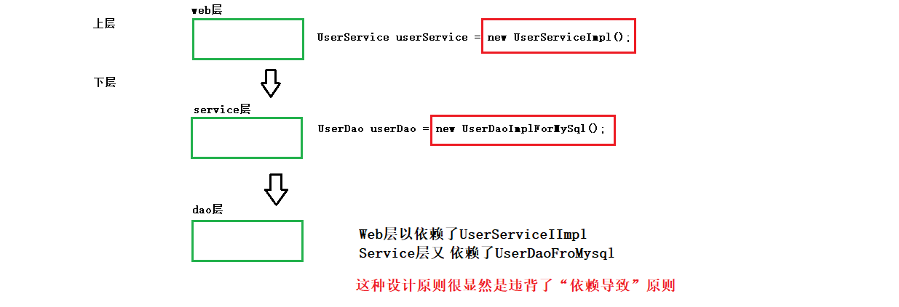


### 开闭原则

1. 什么是开闭原则？

   + 开闭原则（OCP），O表示打开（Open），C表示关闭（Close），P表示原则（Principle），OCP原则又叫开闭原则。
   + 开什么？对拓展开放
   + 闭什么？对修改关闭

2. 符合OCP原则的代码设计

   + 当有一天，需要在原有功能上升级，如果添加新功能时，你修改了之前的代码，那就违背了OCP原则，这个设计是失败的！
   + 如果你没有修改之前的代码，那就符合OCP原则。

3. 软件开发的7大设计原则中，另外6个设计原则都是为了OCP原则而服务的。

   

### 依赖倒置原则 

1. 依赖倒置原则

   + 上面分析三层架构代码中，提到了依赖导致原则，并且分析了出了这个代码是有背于依赖倒置原则的。

2. 什么是依赖倒置原则？

   + 依赖倒置原则又叫做：DIP原则（Dependence Inversion Principle）

   + 依赖倒置原则另一个隐式含义叫做：面向接口编程。
   + 主要意思就是：上次不要依赖于下层，上层应该做到面向接口，面向抽象类，而不要面向具体的实现。

3. 符合依赖倒置原则的代码，拿Service层和Dao层来举例

   + UserService

     ```java
     public class UserServiceImpl implements UserService {
         // UserDao userDao = new UserDaoImplForMySql();
         // UserDao userDao = new UserDaoImplForOracle();
     
         // 摒弃上面的写法，不写具体的实现，让这个类中只存在一个UserDao对象，具体的实例对象由程序/框架提供。
         // Spring框架通过依赖注入就能实现这种技术
         private UserDao userDao;
     
         @Override
         public void selectUserById(String userId) {
             userDao.selectById(userId);
         }
     }

   + 在UserServiceImpl类中没有写具体的实现，面向接口编程，那是不是就满足了赖倒置原则？

   

### 控制反转

1. 上面三层架构代码中即违背了开闭原则又违背了依赖倒置原则，那怎么解决呢？通过“控制反转”的思想来解决

2. 什么是控制反转？Spring框架实现了这种思想。

   + 控制反转（Inversion of controller），控制反转是一种思想，也可以看作是一种设计模式。
   + 控制反转，反转的是什么呢？
     + 第一：不在程序中采用硬编码的方式new对象了（将new对象的权利交出去，程序员不在手动new了）
     + 第二：不在程序中采用硬编码的方式进行对象和对象的关系维护（将对象和对象之前的关系交出去，程序员不再手动维护）

3. 基于“控制反转”的思想，我们可以对web层和service的代码改造一下、

   ```java
   public class UserServiceImpl implements UserService {
       // UserDao userDao = new UserDaoImplForMySql();
       // UserDao userDao = new UserDaoImplForOracle();
   
       // 不依赖具体的实现（满足依赖倒置原则）
       // 不手动new对象（满足依赖注入思想）
       // 不维护 UserServiceImpl 和 UserDaoImplForMySql/UserDaoImplForOracle之间的关系（满足依赖注入思想）
       private UserDao userDao;
   
       @Override
       public void selectUserById(String userId) {
           userDao.selectById(userId);
       }
   }
   ```

   ```java
   public class UserController {
       // UserService userService = new UserServiceImpl();
   
       UserService userService;
       public void selectUserByIdRequest(String userId) {
           userService.selectUserById(userId);
       }
   }
   ```

+ 但是有个问题，这个程序虽然是满足了“控制反转”的思想，但是userService和userDao是null，结果肯定一运行就报错！
+ 怎么解决？？
  + 可以使用依赖注入的手段，来解决这个问题！
  + 依赖注入马上讲解！！


### 依赖注入

1. 依赖注入 DI（Dependence Inject），依赖注入是“控制反转”的一种实现方式！
2. 控制反转和依赖注入
   + 控制反转是一种编程思想
   + 依赖注入是一种实现，实现了控制反转这种编程思想
3. 依赖注入，依赖是什么意思？注入是什么意思？
   + 依赖：A对象和B对象之间的关系
   + 注入：是一种手段，通过这种手段可以让A对象和B对象之间产生关系
   + A对象和B对象之间的关系通过注入的手段来维护
4. 依赖注入，常见的注入方式
   + setter注入（通过setter方法给属性赋值）
   + 构造器注入（通过构造方法给属性赋值）

### 常见术语

1. OCP：开闭u原则（开发原则）
2. DIP：依赖倒置原则（开发原则）
3. IOC：控制反转（编程思想）
4. DI：依赖注入（控制反转的一种实现）


## Spring 概述

### Spring 简介

[Spring官网-国外](https://spring.io/)

[Spring官网-国内](https://spring.p2hp.com/)

1. Spring是一个轻量级的Java框架，目的是为了解决企业级应用开发的业务逻辑层和其他各层的耦合问题。
2. Spring为企业级开发提供了很多丰富的功能，但是这些功能的底层都是依赖于他的两个核心特点，“依赖注入”和“面向切面编程”！
3. Spring最根本的使命是：解决JavaEE企业级项目开发中的复杂性，简化开发。

### Spring 八大模块

1. Spring5版本之后是8个模块。在Spring5中新增了WebFlux模块。

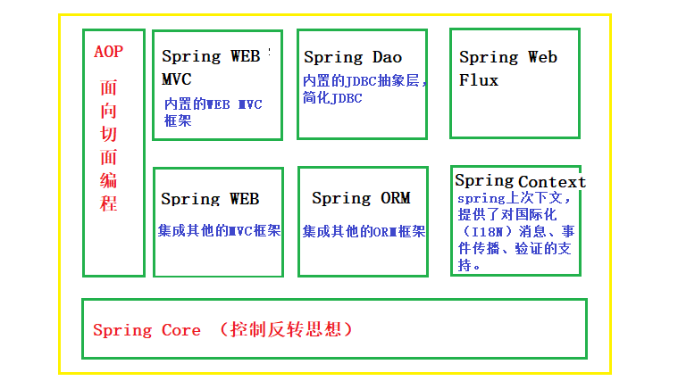


### Spring 特点	

1. 轻量级、非侵入式
   + 轻量级：spring的核心jar包体积很小，但是功能很强大！
   + 非侵入式
     + 入侵式：你的代码需要依其他赖框架的代码，如果把框架拿掉或者换一个框架，就需要重新修改代码。
     + 非侵入式：Spring是一个非侵入式框架，它的运行不依赖其他三方框架。
2. 容器
   + Spring包含并管理应用对象的配置和生命周期，并且能够管理项目中所有的对象。
3. 控制反转
   + 降低代码中的耦合度，一个对象依赖其他对象会通过“注入”的方式传递进来，而不是程序员通过手动new对象的方式，将对象的创建权力交给Spring。
     + 注入方式，这里是指“依赖注入”，常见的注入方式：构造器注入、setter方法注入、根据注解注入。
   + Spring容器会根据配置文件去创建实例和维护各个对象之间的关系，使用到了反射的机制！！
4. 面向切面编程
   + 将纵向公共行为、重复的逻辑代码（权限认证、事务、日志）横向抽离出来封装成一个可重用的模块，这个模块被命名为 “切面”（Aspect）。
   + Spring框架应用了面向切面的思想，主要体现在为容器中管理的对象生成动态代理对象。


## Spring 入门程序

### Spring 版本说明

1. 项目使用Spring6.x，注意：使用Spring6.x时JDK版本需要>=17.x

2. 项目使用maven来管理依赖，直接引入spring-context就ok了，maven会自动依赖其他的相关依赖。

3. Spring6.x还未正式发布，可以使用以下配置来使用Spring6.x

   ```xml
   <!-- 使用内部仓库地址 -->
   <repository>
       <id>repository.spring.milestone</id>
       <name>Spring Milestone Repository</name>
       <url>https://repo.spring.io/milestone</url>
   </repository>
   
   ...
   
   <!-- 引入依赖-->
   <dependency>
       <groupId>org.springframework</groupId>
       <artifactId>spring-context</artifactId>
       <version>6.0.0-M2</version>
   </dependency>
   ```

   

4. 事实上，现在最新版本是spring6.0.6了，那就直接引入依赖就ok了

   ```xml
   <dependency>
       <groupId>org.springframework</groupId>
       <artifactId>spring-context</artifactId>
       <version>6.0.6</version>
   </dependency>
   ```

   

### Spring 第一个程序

1. 新建项目

2. 导入依赖

   + 导入spring-context依赖，spring-context又依赖了下面四个依赖项（maven已经帮我们自动导入了）
     +  lorg.springframework:spring-aop:6.0.4
     + org.springframeworkspring-beans:6.0.4
     + org.springframeworkspring-core:6.0.4
     + org.springframework:spring-expression:6.0.4
   + 导入junit依赖，做单元测试

   ```xml
   <dependencies>
       <dependency>
           <groupId>org.springframework</groupId>
           <artifactId>spring-context</artifactId>
           <version>6.0.4</version>
       </dependency>
   
       <dependency>
           <groupId>junit</groupId>
           <artifactId>junit</artifactId>
           <version>4.13.2</version>
           <scope>test</scope>
       </dependency>
   </dependencies>
   ```

3. 建一个bean对象

   ```java
   public class User {
       public User() {
           System.out.println("User 无参方法被调用...");
       }
   }
   ```

4. 建立spring.xml配置文件（推荐使用IDEA内置的模板文件）

   + 选中resources资源文件夹右击，New -> XML Configuration File -> Spring Config

     ```xml
     <?xml version="1.0" encoding="UTF-8"?>
     <beans xmlns="http://www.springframework.org/schema/beans"
            xmlns:xsi="http://www.w3.org/2001/XMLSchema-instance"
            xsi:schemaLocation="http://www.springframework.org/schema/beans http://www.springframework.org/schema/beans/spring-beans.xsd">
     
         <!--
             bean: bean对象，在beans标签中配置的所有的bean对象会被Spring容器管理，Spring容器管理会负责这些bean的创建、销毁以及bean与bean之间的关系维护。
             id: 能够“唯一标识”一个bean对象的字符序列
             class: 这个bean的全限定名称
         -->
         <bean id="userBean" class="com.ilovesshan.pojo.User"/>
     </beans>
     ```

     

5. 代码测试

   

   ```java
   @RunWith(JUnit4.class)
   public class UserBeanTest {
   
       @Test
       public void test1() {
           // 表示从类路径下加载 spring配置文件
           // new ClassPathXmlApplicationContext("spring配置文件地址")，spring配置文件地址推荐放在类路径下。
   
           // 当执行 new ClassPathXmlApplicationContext()的时候,
           // 1、创建Spring容器
           // 2、解析spring配置文件，根据配置文件去创建Bean对象实例以及维护Bean和Bean之间的关系
           // 3、将创建好的这个Spring容器返回，也就是这个app对象
           ApplicationContext app = new ClassPathXmlApplicationContext("spring.xml");
   
           // 我们可以通过Spring容器来获取容器中的Bean对象，通过app.getBean()方法
           // app.getBean()重载方法有点多，后面慢慢讲解
           Object userBean = app.getBean("userBean");
           System.out.println("userBean = " + userBean);
       }
   }
   ```


### Spring 入门程序细节分析

1. spring配置文件的名称和路径问题

   + spring配置文件的名称和路径问题都是可以完全自定义的！！

   + 两种方式加载spring配置文件

     + ClassPathXmlApplicationContext（类路径下加载文件，推荐的方式）

       ```java
       ApplicationContext app = new ClassPathXmlApplicationContext("spring.xml");
       ```

       

     + FileSystemXmlApplicationContext（通过绝对路径加载文件，不推荐的方式）

       ```java
       ApplicationContext app = new FileSystemXmlApplicationContext("file:///E:/workspace/xxx/spring.xml");
       ```

2. spring加载多个配置文件

   + springa.xml

     ```xml
     <bean id="userBean" class="com.ilovesshan.pojo.User"/>
     ```

   + springb.xml

     ```xml
     <bean id="studentBean" class="com.ilovesshan.pojo.Student"/>
     ```

   + ClassPathXmlApplicationContext是一个重载方法

     ```java
     public ClassPathXmlApplicationContext(String... configLocations) throws BeansException{}
     ```

     ```java
     @Test
     public void test3() {
         // 可以填写多个配置文件
         ApplicationContext app = new ClassPathXmlApplicationContext("springa.xml", "springb.xml");
         User userBean = app.getBean("userBean", User.class);
         Student studentBean = app.getBean(Student.class);
         System.out.println("userBean = " + userBean);
         System.out.println("studentBean = " + studentBean);
     }
     ```

     

3.  bean的id可以重复吗?

   + 不能重复，因为一个id只能标识一个bean

     ```xml
     <bean id="bean" class="com.ilovesshan.pojo.User"/>
     <bean id="bean" class="com.ilovesshan.pojo.Student"/>
     ```

     

   

4. application.getBean("beanId")，id不存在返回值是null还是要报错呢？

   + 不存在就直接报错了！！

     ```xml
     <bean id="userBean" class="com.ilovesshan.pojo.User"/>
     <bean id="studentBean" class="com.ilovesshan.pojo.Student"/>
     ```

     ```java
     Object userBean = app.getBean("userBean1");
     ```

     

   

5. bean只能配置自定义的Java对象吗？可不可以配置JDK中的内置对象？

   + 可以配置JDK中的内置对象，程序运行时OK的！！

     ```xml
     <bean id="dateBean" class="java.util.Date"/>
     ```

     ```java
     ApplicationContext app = new ClassPathXmlApplicationContext("spring.xml");
     Date date = app.getBean("dateBean", Date.class);
     String format = new SimpleDateFormat("yyy-MM-dd hh:mm:ss").format(date);
     System.out.println("format = " + format);
     ```

     

6. 如何确定从Spring容器中取出来的对象类型(不用强转)

   ```java
   // 这种方式获取的bean默认是Object类型
   Object userBean1 = app.getBean("userBean");
   
   
   // 先根据名称找bean、再根据Clazz类型确定最终的bean对象
   User userBean2 = app.getBean("userBean", User.class);
   
   // 直接根据Clazz类型确定最终的bean对象
   Student studentBean = app.getBean(Student.class);
   ```

7. bean对象是什么时候被创建出来的？如何创建出来的？

   + bean对象被创建的时机?

     + 可以观察日志，容器启动的时候，bena就会被创建，并且默认调用bean对象的无参构造方法！

       ```tex
       User 无参方法被调用...
       Student 无参方法被调用...
       
       userBean = com.ilovesshan.pojo.User@6aeb35e6
       studentBean = com.ilovesshan.pojo.Student@1283bb96
       ```

     + 需要被Spring容器管理的对象，就必须提供无参构造方法，否则会报错！！

     + 我们现在去掉User对象的无参构造，看一下报什么错？

       ```java
       public class User {
           // public User() { System.out.println("User 无参方法被调用...");}
           public User(String s){}
       }
       ```

       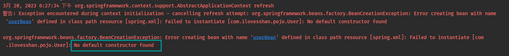

   + bean对象是如何被创建出来的?

     + bean对象是通过反射创建出来的

       

8. 写一个简单版本的spring容器，模拟bean对象创建过程。

   + 新建一个bean.properties文件，用于配置bean

     ```properties
     userBean=com.ilovesshan.pojo.User
     studentBean=com.ilovesshan.pojo.Student
     ```

     

   + 编写核心代码 MySpring.class

     ```java
     public class MySpring {
     
         /**
          * 保存bean对象的容器
          */
         private Map<String, Object> containers = new HashMap<>();
     
     
         public MySpring(String config) {
             try {
                 // 获取 properties 文件
                 Properties properties = new Properties();
                 properties.load(ClassLoader.getSystemResourceAsStream("bean.properties"));
     
                 // 遍历 properties 文件
                 Iterator<Map.Entry<Object, Object>> iterator = properties.entrySet().iterator();
                 while (iterator.hasNext()) {
                     Map.Entry<Object, Object> bean = iterator.next();
                     Object beanId = bean.getKey(); // bean的key studentBean
                     Object beanClassName = bean.getValue(); // bean的value com.ilovesshan.pojo.Student
     
                     // 通过反射去构造对象实例
                     Class<?> aClass = Class.forName((String) beanClassName);
                     Object instance = aClass.getDeclaredConstructor().newInstance();
     
                     // 将bean的id作为map的key, bean的实例对象作为map的value
                     containers.put((String) beanId, instance);
                 }
             } catch (Exception e) {
                 e.printStackTrace();
             }
         }
     
         public Object getBean(String beanId) {
             Object o = containers.get(beanId);
             if (o == null) {
                 throw new RuntimeException("No Bean Named \"" + beanId + "\" available");
             }
             return o;
         }
     
         public <T> T getBean(String beanId, Class<T> tClass) {
             Object o = containers.get(beanId);
             if (o == null) {
                 throw new RuntimeException("No Bean Named \"" + beanId + "\" available");
             }
             return (T) o;
         }
     
         public <T> T getBean(Class<T> tClass) {
             Iterator<Map.Entry<String, Object>> iterator = containers.entrySet().iterator();
     
             Object findObject = null;
     
             while (iterator.hasNext()) {
                 Object value = iterator.next().getValue();
                 Class<?> aClass = value.getClass();
                 if (tClass == aClass) {
                     findObject = value;
                     break;
                 }
             }
             if (findObject == null) {
                 throw new RuntimeException("No Clazz type \"" + tClass + "\" available");
             }
             return (T) findObject;
         }
     }
     
     ```

     

   + 代码测试

     ```java
     @RunWith(JUnit4.class)
     public class MyContainerTest {
     
         @Test
         public void test1() {
             MySpring mySpring = new MySpring("bean.properties");
             Object userBean = mySpring.getBean("userBean");
             System.out.println("userBean = " + userBean);
     
             Student studentBean = mySpring.getBean("studentBean", Student.class);
             System.out.println("studentBean = " + studentBean);
     
             Student studentBean2 = mySpring.getBean(Student.class);
             System.out.println("studentBean2 = " + studentBean2);
         }
     }
     ```

     ```tex
     Student 无参方法被调用...
     User 无参方法被调用...
     
     userBean = com.ilovesshan.pojo.User@75bd9247
     studentBean = com.ilovesshan.pojo.Student@7d417077
     studentBean2 = com.ilovesshan.pojo.Student@7d417077
     ```


### Spring 集成日志框架

1. 集成logback

   + 导入依赖，额外引入了lombok

     ```xml
     <dependency>
         <groupId>ch.qos.logback</groupId>
         <artifactId>logback-classic</artifactId>
         <version>1.2.11</version>
     </dependency>
     
     <dependency>
         <groupId>org.projectlombok</groupId>
         <artifactId>lombok</artifactId>
         <version>1.18.24</version>
     </dependency>
     ```

     ```java
     @Slf4j
     public class Student {
         public Student() {
             log.debug("Student 无参方法被调用...");
         }
     }
     
     ```

   + 自定义logback.xml，配置日志信息

     + [参考地址](https://ilovesshan.github.io/pages/backend/myBatis.html#%E9%9B%86%E6%88%90%E6%97%A5%E5%BF%97%E6%A1%86%E6%9E%B6)

2. 集成log4j2（需要spring5.之后）

   + 导入依赖

     ```xml
     <dependency>
         <groupId>org.projectlombok</groupId>
         <artifactId>lombok</artifactId>
         <version>1.18.24</version>
     </dependency>
     
     <dependency>
         <groupId>org.apache.logging.log4j</groupId>
         <artifactId>log4j-slf4j2-impl</artifactId>
         <version>2.19.0</version>
     </dependency>
     
     <dependency>
         <groupId>org.apache.logging.log4j</groupId>
         <artifactId>log4j-core</artifactId>
         <version>2.19.0</version>
     </dependency>
     ```

     

   + 自定义配置文件，文件放在类路径下，叫：log4j2.xml 名字是固定的！！

     [log4j2.xml 配置文件详解](https://blog.csdn.net/weixin_40816738/article/details/111407832)

     ```xml
     <?xml version="1.0" encoding="UTF-8"?>
     <Configuration status="DEBUG">
         <Appenders>
             <Console name="Console" target="SYSTEM_OUT">
                 <PatternLayout pattern="%d{HH:mm:ss.SSS} [%t] %-5level %logger{36} - %msg%n"/>
             </Console>
         </Appenders>
         <Loggers>
             <Root level="debug">
                 <AppenderRef ref="Console"/>
             </Root>
         </Loggers>
     </Configuration>
     
     ```

   

## Spring 对IOC的实现

### 反转控制和依赖注入

1. 反转控制（一种编程思想）
   + 将对象的创建权交给Spring容器
   + 将对象和对象之间关系的维护权交给Spring容器
2. 依赖注入（反转控制的实现方式）
   + 通过注入的方式来维护对象和对象之间的关系，注入是一种手段，是值的传递。
   + 常见的注入方式有：set注入和构造器注入。

### 基于set注入

1. 基于set注入，见名知意就是通过setter方法注入呗，那肯定就要求这个bean必须提供setter方法。

   ```java
   public class UserController {
   
       private UserService userService;
   
       /**
        * 这里的setter方法可以自己随便写名称（随便写的前提是：方法名称开头必须是setXxxx,set不能丢了）
        *      我们写的setXxx会音响到<bean><bean/>标签中,property标签的name属性
        *       setAbc --> <property name="abc" ref="userServiceBean"/>
        *       setAxx--> <property name="xxx" ref="userServiceBean"/>
        *
        *       为了不给自己找麻烦， 推荐按照setter规范来写，使用的时候直接复制属性名称就ok了
        *       这样做的目的是：
        *          1、让代码更规范，更严谨
        *          2、避免出错
        *       setUserService--> <property name="userService" ref="userServiceBean"/>
        */
       public void setUserService(UserService userService) {
           this.userService = userService;
       }
   
       public void deleteUserRequest() {
           userService.deleteUser();
       }
   }
   
   ```

   ```java
   @Slf4j
   public class UserService {
   
       public void deleteUser() {
           log.debug("删除用户...");
       }
   }
   
   ```

   

2. xml书写方式

   ```xml
   <?xml version="1.0" encoding="UTF-8"?>
   <beans>
   
       <!-- UserService bean对象 -->
       <bean id="userServiceBean" class="com.ilovesshan.UserService"/>
   
       <!-- UserController bean对象 -->
       <bean id="userControllerBean" class="com.ilovesshan.UserController">
           <!--
               property标签：UserController bean对象中有一个属性，这个属性可以通过set方法进行赋值
               name: set方法名称（去掉set三个字母之后的单词首字母小写）
                       setAbc ==> abc
                       setXxx ==> xxx
                       setUserService  ==> userService
                       也就意味着：可以通过name属性，反推出来set方法嘛！
   
               ref: 引用(reference)的意思，表示set方法的参数
                      ref="userServiceBean"意思就是：把UserService bean对象实例当作参数传递给setUserService()方法
           -->
           <property name="userService" ref="userServiceBean"/>
       </bean>
   
   </beans>
   ```


### 基于构造器注入

1. 基于构造器注入那也就见名知意，被Spring容器多理的bean需要提供构造方法（带参数），由Spring容器来调用bean对象的构造方法从而给属性赋值。

   ```java
   @Slf4j
   public class StudentService {
       public void doSomething() {
           log.debug("StudentService doSomething...");
       }
   }
   
   @Slf4j
   public class TeacherService {
       public void doSomething(){
           log.debug("TeacherService doSomething...");
       }
   }
   
   ```

   ```java
   public class StudentController {
   
       private StudentService studentService;
       private TeacherService teacherService;
   
       // 提供构造方法给Spring调用，目的是给属性赋值
       public StudentController(StudentService studentService, TeacherService teacherService) {
           this.studentService = studentService;
           this.teacherService = teacherService;
       }
   
       public void HaveAClass() {
           studentService.doSomething();
           teacherService.doSomething();
       }
   }
   
   ```

   

2. 构造器注入可以分成三种方式

   + 通过构造方法形参名称注入

     ```xml
     <bean id="studentController1" class="com.ilovesshan.controller.StudentController">
         <!--
                 name: 指的是构造器方法对应的形参名称
                     例如:  public StudentController(StudentService studentService, TeacherService teacherService) {}
                     name的值就只能是: studentService/teacherService
                 ref: 已经用过了(不再解释)
             -->
         <constructor-arg ref="studentServiceBean" name="studentService"/>
         <constructor-arg ref="teacherServiceBean" name="teacherService"/>
     </bean>
     ```

     

   + 通过构造方法参数位置注入

     ```xml
     <bean id="studentController2" class="com.ilovesshan.controller.StudentController">
         <!--
                 index: 参数的位置，需要注意参数位置默认是从0开始
             -->
         <constructor-arg ref="studentServiceBean" index="0"/>
         <constructor-arg ref="teacherServiceBean" index="1"/>
     </bean>
     ```

     

   + 通过类型注入

     ```xml
     
     <bean id="studentController3" class="com.ilovesshan.controller.StudentController">
         <!--
                 不指定name也不指定index，那么Spring就会进行自动类型推断
                 注意: 如果ref指定的类型不符合构造器形参类型，那么会报错！
             -->
         <constructor-arg ref="studentServiceBean"/>
         <constructor-arg ref="teacherServiceBean"/>
     </bean>
     ```


### 基于set注入专题

1. 内部bean和外部bean注入，内部bean和外部bean注入效果是一样的，只不过配置方式不一样。

   ```java
   public class OrderController {
       private OrderService orderService;
   
       // 通过set方法注入
       public void setOrderService(OrderService orderService) {
           this.orderService = orderService;
       }
   
       public void createOrderRequest() {
           orderService.createOrder();
       }
   }
   
   ```

   ```java
   @Slf4j
   public class OrderService {
       public void createOrder() {
           log.debug("OrderService createOrder...");
       }
   }
   
   ```

   + 外部bena注入方式

     ```xml
     <bean id="orderControllerBean1" class="com.ilovesshan.controller.OrderController">
         <!--
                 property标签中使用了属性ref="xxx", 表示这是一个外部bean
             -->
         <property name="orderService" ref="orderServiceBean"/>
     </bean>
     ```

     

   + 内部bena注入方式

     ```xml
     <bean id="orderControllerBean2" class="com.ilovesshan.controller.OrderController">
         <!--
                property标签中使用了嵌套ref标签, 表示这是一个内部bean
                更推荐使用外部bean注入方式
                     1、更好的实现bean复用
                     2、代码层级简洁/易于阅读
            -->
         <property name="orderService">
             <ref bean="orderServiceBean"/>
         </property>
     </bean>
     ```

     

   

2. 简单类型注入

   + 如何判断在Spring容器中，那些数据类型是简单数据类型？

     + Spring源码中有一个工具类，里面提供了一个方法用来判断是不是简单数据类型！
     + org.springframework.beans.BeanUtils类中isSimpleValueType方法

     ```java
     public static boolean isSimpleValueType(Class<?> type) {
         return (Void.class != type && void.class != type &&
                 // 八大简单类型和包装类
                 (ClassUtils.isPrimitiveOrWrapper(type) ||
                  // 枚举
                  Enum.class.isAssignableFrom(type) ||
                  // 字符序列(String、StringBuilder、StringBuffer)
                  CharSequence.class.isAssignableFrom(type) ||
                  // Number
                  Number.class.isAssignableFrom(type) ||
                  // Date (java.util.Date)
                  Date.class.isAssignableFrom(type) ||
                  // jdk8.x之后出现的， 是一组时间对象的接口
                  Temporal.class.isAssignableFrom(type) ||
                  // URI 对象
                  URI.class == type ||
                  // URL 对象
                  URL.class == type ||
                  // Locale 对象
                  Locale.class == type ||
                  // Class 对象
                  Class.class == type));
     }
     ```

   + 简单测试一下

     ```java
     @Data
     @AllArgsConstructor
     @NoArgsConstructor
     public class User {
         private int i1;
         private Integer i2;
     
         private boolean b1;
         private Boolean b2;
     
         private char c1;
         private Character c2;
     
         private Direction direction;
     
         private Class aClass;
     
     }
     ```

     ```xml
     <bean id="userBean" class="com.ilovesshan.pojo.User">
         <!--
                 注意：
                     1、简单数据类型请使用 value="xxx"
                     2、复杂数据类型请使用 ref="xxx"
             -->
         <property name="i1" value="1"/>
         <property name="i2" value="100"/>
         <property name="b1" value="true"/>
         <property name="b2" value="false"/>
         <property name="c1" value="A"/>
         <property name="c2" value="B"/>
         <property name="direction" value="BOTTOM"/>
         <property name="AClass" value="com.ilovesshan.pojo.User"/>
     </bean>
     ```

     ```tex
     user = User(i1=1, i2=100, b1=true, b2=false, c1=A, c2=B, direction=BOTTOM, aClass=class com.ilovesshan.pojo.User)
     ```

     

     

3. Date类型注入

   + 由于Date类型比较特殊一点，单独开一节聊聊，通过阅读 `isSimpleValueType` 方法发现好像Date也是简单数据类型，是不是简单数据数据类型不妨写代码测一测

     ```java
     @Data
     @AllArgsConstructor
     @NoArgsConstructor
     public class User {
         private Date birth;
     }
     ```

     

   + 使用value方式

     ```xml
     <bean id="userBean" class="com.ilovesshan.pojo.User">
         <property name="birth" value="2023-6-20 12:00:00"/>
     </bean>
     ```

     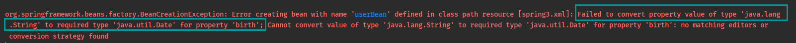

     直接就报错了，说一个字符串不能转换成一个java.util.Date对象

     注意：如果想把Date类型当作简单数据类型使用，那么在写 value="xxx"的时候， xxx必须遵守固定格式，例如：

     ```tex
     Tue Mar 21 10:13:38 CST 2023
     ```

     

   + 使用ref方式

     ```xml
     <bean id="d" class="java.util.Date"/>
     
     <bean id="userBean" class="com.ilovesshan.pojo.User">
         <property name="birth" ref="d"/>
     </bean>

   

4. 级联属性注入（用的很少）

   ```java
   public class Address {
       private String name;
   
       public void setName(String name) {
           this.name = name;
       }
   
       @Override
       public String toString() {
           return "Address{" +
               "name='" + name + '\'' +
               '}';
       }
   }
   ```

   

   ```java
   public class Student {
       private String name;
       private Address address;
   
       public void setName(String name) {
           this.name = name;
       }
   
       public void setAddress(Address address) {
           this.address = address;
       }
   
       // 使用级联属性赋值时，需要提供get方法
       public Address getAddress() {
           return address;
       }
   
       @Override
       public String toString() {
           return "Student{" +
               "name='" + name + '\'' +
               ", address=" + address +
               '}';
       }
   }
   ```

   ```xml
   <bean id="studentBean" class="com.ilovesshan.pojo.Student">
       <property name="name" value="张三"/>
       <property name="address" ref="addressBean"/>
       <!--
         使用级联属性赋值，注意，需要在Student类中提供getAddress()方法
        -->
       <property name="address.name" value="四川省巴中市"/>
   </bean>
   
   <bean id="addressBean" class="com.ilovesshan.pojo.Address">
       <!-- <property name="name" value="四川省成都市"/> -->
   </bean>
   ```

   

   

5. 数组注入

   ```java
   public class Start {
   
       // 数组(基本类型)
       private String[] jobs;
   
       // 数组(引用类型)
       private Address[] addresses;
   
       // 省略get方法
   }
   ```

   ```xml
   
   <bean id="address1" class="com.ilovesshan.pojo.Address">
       <property name="name" value="四川巴中"/>
   </bean>
   
   <bean id="address2" class="com.ilovesshan.pojo.Address">
       <property name="name" value="四川成都"/>
   </bean>
   
   <bean id="startBean" class="com.ilovesshan.pojo.Start">
       <property name="jobs">
           <!--
                   array: 表示这个属性的数据类型是一个数组
                   value: 简单数据类型使用value
               -->
           <array>
               <value>唱歌</value>
               <value>跳舞</value>
           </array>
       </property>
   
       <property name="addresses">
           <array>
               <!--
                      array: 表示这个属性的数据类型是一个数组
                      ref: 复杂数据类型
                           bean: 对应的beanId
                  -->
               <ref bean="address1"/>
               <ref bean="address2"/>
           </array>
       </property>
   </bean>
   ```

   

6. List/Set注入

   ```java
   public class Start {
       //List(基本类型)
       private List<String> hobbies;
   
       //Set(基本类型)
       private Set<String> phones;
   
       // 省略get方法
   
   }
   ```

   ```xml
   <bean id="startBean" class="com.ilovesshan.pojo.Start">
       <property name="hobbies">
           <!--
                    list: 表示这个属性的数据类型是一个列表
                    List有序可以重复
                       value: 简单数据类型
                       ref: 复杂数据类型
               -->
           <list>
               <value>抽烟</value>
               <value>抽烟</value>
               <value>喝酒</value>
               <value>打扑克</value>
               <value>打扑克</value>
           </list>
       </property>
   
       <property name="phones">
           <!--
                   注入Set对象
                   Set: 无需不能重复
               -->
           <set>
               <value>110</value>
               <value>120</value>
               <value>130</value>
               <value>130</value>
               <value>120</value>
               <value>110</value>
           </set>
       </property>
   </bean>
   ```

   

7. Map/Properties注入

   ```java
   public class Start {
       // Map
       private Map<String, Object> concatMap;
   
       // Properties
       private Properties info;
       
       // 省略get方法
   }
   ```

   ```xml
   <bean id="startBean" class="com.ilovesshan.pojo.Start">
       <property name="concatMap">
           <!--
                   注入Map<String,Object>
                   map标签属性(一般不写属性)
                       key-type: map的key的数据类型
                       value-type: map的value的数据类型
                   entry标签属性
                       key: map的key(简单数据源类型)
                       value: map的value(复杂数据源类型)
   
                       key-ref:map的key(简单数据源类型)
                       value-ref: map的value(复杂数据源类型)
               -->
           <map key-type="java.lang.String" value-type="java.lang.Object">
               <entry key="张三" value-ref="address1"/>
               <entry key="李四" value-ref="address1"/>
           </map>
       </property>
   
       <property name="info">
           <!--
             注入 Properties
            -->
           <props>
               <prop key="name">男明星</prop>
               <prop key="age">22</prop>
               <prop key="salary">9999999999999999999999999.99</prop>
           </props>
       </property>
   </bean>
   ```

   

8. 注入null或者空字符串

   ```java
   public class Car {
       String carName;
   
       public void setCarName(String carName) {
           this.carName = carName;
       }
   }
   ```

   

   + 注入null方法

     + 啥都不写 默认就是null

     + 使用\<null/>标签

       ```xml
       <property name="carName">
           <null/>
       </property>
       ```

       

     + 注意： 这不是注入了null, 而是注入了 null字符串

       ```xml
       <property name="carName" value="null"/>
       ```

       

   + 注入空字符串方法（两种方式）

     ```xml
       <property name="carName" value=""/>
     ```

     ```xml
     <property name="carName">
         <value/>
     </property>
     ```

   

9. 特殊字符注入

   ```java
   public class N {
       String n1;
       String n2;
       String n3;
       
       // 省略get方法
   }
   ```

   

   + 有时候需注入一些特殊字符，比如：`>、>=、<、<=、&`等等等..

   + 直接写会报错，编译都会不通过

     ```xml
     <bean id="nBean" class="com.ilovesshan.pojo.N">
         <property name="n1" value=" 5 < 3"/>
         <property name="n2" value=" 5 >= 3"/>
     </bean>
     ```

   + 解决办法一：

     + 使用转义字符

       ```xml
       <property name="n1" value=" 5 &lt; 3"/>
       <property name="n2" value=" 5 &gt;  3"/>
       <property name="n3" value=" 5 &amp;  3"/>
       ```

       

   + 解决办法二：

     + 使用\<![CDATA[<<特殊字符>>]]>

       ```xml
       <property name="n1">
           <value type="java.lang.String"><![CDATA[1 < 2]]></value>
       </property>
       
       <property name="n2">
           <value type="java.lang.String"><![CDATA[1 >= 2]]></value>
       </property>
       
       <property name="n3">
           <value type="java.lang.String"><![CDATA[1 & 2]]></value>
       </property>
       ```

       

### P命名空间注入

1. P命名空间注入主要是用来简化set注入的，既然是简化set注入的，那就要求需要提供set方法

   ```java
   public class School {
       private String name;
       private String address;
       // set 方法省略...
   }
   ```

2. 使用p命名空间的步骤

   + 在beans标签中添加 命名空间：xmlns:p="http://www.springframework.org/schema/p"

     ```xml
     <!--
             p 命名空间主要是用来简化set注入的，本质上还是set注入
             注入方式：
                 简单数据类型    p:属性名 = "属性值"
                 复杂数据类型    p:属性名-ref = "beanId"
         -->
     <bean id="schoolBean1" class="com.ilovesshan.pojo.School" p:name="school name" p:address="sichuan chengdu"/>
     ```

     

### C命名空间注入

1. c命名空间主要是用来简化构造器注入的，当然这个bean肯定就需要提供构造方法哈

   ```java
   public class School {
       private String name;
       private String address;
       // 构造方法省略...
   }
   ```

   

2. c命名空间注入使用步骤

   + 在beans标签中添加 命名空间：xmlns:p="http://www.springframework.org/schema/c"

     ```xml
     <!--
             c 命名空间注入
             注入方式：
                 简单数据类型
                     c:index index从0开始
                     c:name  name就是参数名称
                 复杂数据类型
                     c:index-ref index从0开始
                     c:name-ref  name就是参数名称
         -->
     <bean id="schoolBean2" class="com.ilovesshan.pojo.School" c:_0="school name" c:_1="sichuan chengdu"/>
     ```

     

### util命名空间注入复用配置

1. util命名空间注入主要功能是：复用配置

   ```java
   public class MySqlDataSource {
   
       private Properties properties;
   
       public void setProperties(Properties properties) {
           this.properties = properties;
       }
   }
   ```

   ```java
   public class OracleDataSource {
       private Properties properties;
   
       public void setProperties(Properties properties) {
           this.properties = properties;
       }
   }
   ```

   

2. util命名空间使用步骤

   + 在beans标签中添加 命名空间：xmlns:util="http://www.springframework.org/schema/util"

   + 在xsi:schemaLocation中添加： http://www.springframework.org/schema/util http://www.springframework.org/schema/util/spring-util.xsd

     ```xml
     <!--
         通过 util命名空间 可以复用配置
         可以处理以下几种类型
             list
             set
             map
             properties
             property-path
             constants
     -->
     <util:properties id="ds">
         <prop key="driver">com.mysql.cj.jdbc.Driver</prop>
         <prop key="url"> jdbc:mysql://localhost:3306/spring</prop>
         <prop key="username">root</prop>
         <prop key="password">123456</prop>
     </util:properties>
     
     
     
     <!-- MySql数据源配置-->
     <bean id="mysqlDs" class="com.ilovesshan.datasources.MySqlDataSource">
         <property name="properties" ref="ds"/>
     </bean>
     
     <!-- Oracle数据源配置-->
     <bean id="oracleDs" class="com.ilovesshan.datasources.OracleDataSource">
         <property name="properties" ref="ds"/>
     </bean>
     ```

​				

### 自动装配

1. Spring提供了自动装配机制，可以根据名称或者类型进行自动装配，也相当于简化了注入配置，注意：不管是根据名称还是类型进行自动装配他们都是基于set注入的，所以说还是得提供set方法!

   ```java
   public class StudentController {
       private StudentService studentService;
       private TeacherService teacherService;
       // 省略了set方法
   }
   ```

   

2. 根据名称自动装配（byName）

   ```xml
   
   <bean id="teacherService" class="com.ilovesshan.service.TeacherService"/>
   <bean id="studentService" class="com.ilovesshan.service.StudentService"/>
   
   <!--
           autowire="byName": 表示根据名称进行自动装配
               要求: bean对象的id和被注入对象提供的set方法(去掉set剩余的字母，首字母小写)的值一样。
                   bean的Id = abc, 对应set方法: setAbc
                   bean的Id = teacherService, 对应set方法: setTeacherService
               但是建议开发中遵守开发规范，生成符合规范的set方法，那就可以保证属性名称和bean的id一样！！
       -->
   <bean id="studentController" class="com.ilovesshan.controller.StudentController" autowire="byName"/>
   ```

   

3. 根据类型自动装配（byType）

   ```xml
   <bean id="teacherService1" class="com.ilovesshan.service.TeacherService"/>
   <bean id="studentService" class="com.ilovesshan.service.StudentService"/>
   
   <!--
           autowire="byType": 表示根据类型进行自动装配
           使用autowire="byType"要求：
               1、保证容器中仅有一个相同类型的bean实例对象，会报错
               2、如果不存在需要的类型的bean实例对象， 会注入失败
       -->
   <bean id="studentController" class="com.ilovesshan.controller.StudentController" autowire="byType"/>
   ```


### 引入外部配置文件

1. 通常会将一些配置信息抽离成一个单独的配置文件，例如jdbc.properties专门用于配置数据库连接信息

2. 引入外部配置文件步骤

   + resources目录下新建 jdbc.properties文件

     ```properties
     jdbc.driver=com.mysql.cj.jdbc.Driver
     jdbc.url=jdbc:mysql://localhost:3306/spring?serverTimezone=UTC&characterEncoding=utf8&useUnicode=true&useSSL=false
     jdbc.username=root
     jdbc.password=123456
     ```

     

   + 在beans标签中添加context命名空间（推荐使用idea自动补充功能，不容易出错）

     ```xml
     <beans
            xmlns="http://www.springframework.org/schema/beans"
            xmlns:xsi="http://www.w3.org/2001/XMLSchema-instance"
            xmlns:context="http://www.springframework.org/schema/context"
            xsi:schemaLocation="http://www.springframework.org/schema/beans http://www.springframework.org/schema/beans/spring-beans.xsd http://www.springframework.org/schema/context https://www.springframework.org/schema/context/spring-context.xsd">
     
     </beans>
     ```

     

   + 引入外部属性文件

     ```xml
     <context:property-placeholder location="jdbc.properties"/>
     ```

   + 使用配置文件中的属性，通过 ${属性名}使用

     ```xml
     <bean class="com.ilovesshan.datasources.MyDataSource">
         <property name="url" value="${jdbc.url}"/>
         <property name="password" value="${jdbc.password}"/>
         <property name="username" value="${jdbc.username}"/>
         <property name="driver"  value="${jdbc.driver}"/>
     </bean>
     ```


## Spring Bean的作用域

### 单例bean和多实例bean

1. 默认情况下，Spring容器中的bean对象都是单例的，每个bean实例对象只会被创建一次。

2. 这些bean对象在spring容器构建阶段进行实例化，也就是调用 new ClassPathXmlApplicationContext("spring.xml")的时候。

3. 在bean标签中有一个scope属性，其中有两个值

   + singleton（单例）

     + bean标签的scope属性默认值就是 singleton。
     + spring容器中每个类型的实例仅存在一份。
     + spring容器在构建阶段，就会调用bean对象的构造方法创建实例对象。

   + prototype（多例/原型）

     + spring容器中每个类型的实例可以存在多份。
     + spring容器在构建阶段，不会调用bean对象的构造方法创建实例对象，具体的调用时机是：从spring容器中获取bean对象时，再调用该对象的构造方法，获取一次就会调用一次该bean的构造方法。

     

### Singleton

```java
public class User {
    public User() {
        System.out.println("User 对象 构造器被调用...");
    }
}
```

```xml
<!--
 	scope 属性默认就是 "singleton"
 	写了scope="singleton" 和不写没区别
-->
<bean id="user" class="com.ilovesshan.pojo.User" scope="prototype"/>
```

```java
@Test
public void testSingleton() {
    ApplicationContext app = new ClassPathXmlApplicationContext("spring.xml");

    User user1 = app.getBean("user", User.class);
    System.out.println("user1 = " + user1);

    User user2 = app.getBean("user", User.class);
    System.out.println("user2 = " + user2);

    User user3 = app.getBean("user", User.class);
    System.out.println("user3 = " + user3);
}
```

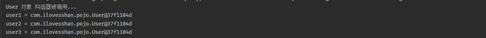

### Property

```xml
<bean id="user" class="com.ilovesshan.pojo.User" scope="prototype"/>
```

```java
@Test
public void testSingleton() {
    ApplicationContext app = new ClassPathXmlApplicationContext("spring.xml");

    User user1 = app.getBean("user", User.class);
    System.out.println("user1 = " + user1);

    User user2 = app.getBean("user", User.class);
    System.out.println("user2 = " + user2);

    User user3 = app.getBean("user", User.class);
    System.out.println("user3 = " + user3);
}
```

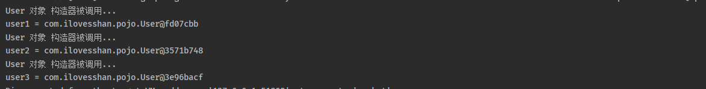


### Scope其他属性

scope属性的值不止两个，它一共包括8个选项：

- singleton：默认的，单例。
- prototype：原型。每调用一次getBean()方法则获取一个新的Bean对象。或每次注入的时候都是新对象。
- request：一个请求对应一个Bean。仅限于在WEB应用中使用。
- session：一个会话对应一个Bean。仅限于在WEB应用中使用。
- global session：portlet应用中专用的。如果在Servlet的WEB应用中使用global session的话，和session一个效果。（portlet和servlet都是规范。servlet运行在servlet容器中，例如Tomcat。portlet运行在portlet容器中。）
- application：一个应用对应一个Bean。仅限于在WEB应用中使用。
- websocket：一个websocket生命周期对应一个Bean。仅限于在WEB应用中使用。
- 自定义scope：很少使用。


## GoF之工厂模式

### 软件开发7大原则

1. 开闭原则：对扩展开放，对修改关闭
2. 依赖倒置原则：高层不应该依赖低层，要面向接口编程
3. 接口隔离原则：一个接口只干一件事，接口要精简单一
4. 单一原则：一个类只干一件事，实现类要单一
5. 迪米特法则：不该知道的不要知道，一个类应该保持对其它对象最少的了解，降低耦合度
6. 里氏替换原则：不要破坏继承体系，子类重写方法功能发生改变，不应该影响父类方法的含义
7. 合成复用原则：尽量使用组合或者聚合关系实现代码复用，少使用继承

### GoF设计模式

1. 什么是设计模式？

   + 解决某种固定问题的方法/模板。

2. 设计模式和软件开发的原则

   + 设计模式：是为了解决某种固定问题方法/模板。
   + 软件开发的原则：是一种原则/规范，大家开发过程中都遵守这7大原则，准没错。

3. GoF设计模式简介

   + 1995 年，GoF（Gang of Four，四人组）合作出版了《Design Patterns: Elements of Reusable Object-Oriented Software》一书，共收录了 23 种设计模式，从此树立了软件设计模式领域的里程碑，人称【GoF设计模式】。

4. GoF设计模式一共分成三大类

   + 创建型模式
     + 主要关心对象如何创建
   + 结构型模式
     + 主要关心每个类之间的组合关系
   + 行为模式
     + 主要关心每个类之间的调用关系

5. GoF设计模式具体分类

   + 创建型模式【5个】
     + 单例（Singleton）模式：类只能产生一个实例，保证全局使用的是同一对象。
     + 原型（Prototype）模式：将一个对象作为原型，通过对其进行复制而克隆出多个和原型类似的新实例。
     + 工厂方法（FactoryMethod）模式：定义一个用于创建产品的接口，由子类决定生产什么产品。
     + 抽象工厂（AbstractFactory）模式：提供一个创建产品族的接口，其每个子类可以生产一系列相关的产品。
     + 建造者（Builder）模式：将一个复杂对象分解成多个相对简单的部分，然后根据不同需要分别创建它们，最后构建成该复杂对象
   + 结构型模式【7个】
     + 代理（Proxy）模式：为某对象提供一种代理以控制对该对象的访问。即客户端通过代理间接地访问该对象，从而限制、增强或修改该对象的一些特性。
     + 适配器（Adapter）模式：将一个类的接口转换成客户希望的另外一个接口，使得原本由于接口不兼容而不能一起工作的那些类能一起工作。
     + 桥接（Bridge）模式：将抽象与实现分离，使它们可以独立变化。它是用组合关系代替继承关系来实现的，从而降低了抽象和实现这两个可变维度的耦合度。
     + 装饰（Decorator）模式：动态地给对象增加一些职责，即增加其额外的功能。
     + 外观（Facade）模式：为多个复杂的子系统提供一个一致的接口，使这些子系统更加容易被访问。
     + 享元（Flyweight）模式：运用共享技术来有效地支持大量细粒度对象的复用。
     + 组合（Composite）模式：将对象组合成树状层次结构，使用户对单个对象和组合对象具有一致的访问性。
   + 行为型模式【11个】
     + 模板方法（Template Method）模式：定义一个操作中的算法骨架，将算法的一些步骤延迟到子类中，使得子类在可以不改变该算法结构的情况下重定义该算法的某些特定步骤。
     + 策略（Strategy）模式：定义了一系列算法，并将每个算法封装起来，使它们可以相互替换，且算法的改变不会影响使用算法的客户。
     + 命令（Command）模式：将一个请求封装为一个对象，使发出请求的责任和执行请求的责任分割开。
     + 职责链（Chain of Responsibility）模式：把请求从链中的一个对象传到下一个对象，直到请求被响应为止。通过这种方式去除对象之间的耦合。
     + 状态（State）模式：允许一个对象在其内部状态发生改变时改变其行为能力。
     + 观察者（Observer）模式：多个对象间存在一对多关系，当一个对象发生改变时，把这种改变通知给其他多个对象，从而影响其他对象的行为。
     + 中介者（Mediator）模式：定义一个中介对象来简化原有对象之间的交互关系，降低系统中对象间的耦合度，使原有对象之间不必相互了解。
     + 迭代器（Iterator）模式：提供一种方法来顺序访问聚合对象中的一系列数据，而不暴露聚合对象的内部表示。
     + 访问者（Visitor）模式：在不改变集合元素的前提下，为一个集合中的每个元素提供多种访问方式，即每个元素有多个访问者对象访问。
     + 备忘录（Memento）模式：在不破坏封装性的前提下，获取并保存一个对象的内部状态，以便以后恢复它。
     + 解释器（Interpreter）模式：提供如何定义语言的文法，以及对语言句子的解释方法，即解释器。

   

### 工厂模式

1. 工厂方法模式一共分成三种

   + 简单工厂模式
   + 工厂方法模式
   + 抽象工厂模式

2. 简单工厂

   + 简单工厂又叫做静态工厂，简单工厂属于GoF设计模式中，创建型模式其中的一种设计模式。

   + 简单工厂涉及的是三个角色

     + 抽象产品类
     + 具体产品角色
     + 工厂角色

   + 简单工厂代码演示

     + 抽象产品类

       ```java
       // 【抽象产品】 手机
       public abstract class Phone {
           
           // 上网
           public abstract void surfTheInternet();
       }
       
       ```

       

     + 具体产品角色

       ```java
       // 【具体产品角色】 华为手机
       public class HuaWei extends Phone {
           @Override
           public void surfTheInternet() {
               System.out.println("华为手机上网...");
           }
       }
       ```

       ```java
       // 【具体产品角色】 小米手机
       public class XiaoMi extends Phone {
           @Override
           public void surfTheInternet() {
               System.out.println("小米手机上网...");
           }
       }
       
       ```

       

     + 工厂角色

       ```java
       // 【工厂角色】 负责生产产品
       public class PhoneFactory {
           public static final String PHONE_XIAOMI = "xiaomi";
           public static final String PHONE_HUAWEI = "huawei";
       
           public static Phone create(String phoneType) {
               if (PHONE_XIAOMI.equals(phoneType)) {
                   // 生产小米手机
                   return new XiaoMi();
               } else if (PHONE_HUAWEI.equals(phoneType)) {
                   // 生产华为手机
                   return new HuaWei();
               } else {
                   throw new RuntimeException("抱歉，该工厂不持支生产\"" + phoneType + "\"类型的产品!");
               }
           }
       }
       ```

       ```java
       // 消费者
       public class PhoneFactoryConsumer {
           public static void main(String[] args) {
               // 工厂类负责生产产品
               // 消费者不关心产品的生产过程，直接通过工厂类获取即可
               Phone huawei = PhoneFactory.create(PhoneFactory.PHONE_HUAWEI);
               Phone xiaomi = PhoneFactory.create(PhoneFactory.PHONE_XIAOMI);
       
               huawei.surfTheInternet();
               xiaomi.surfTheInternet();
           }
       }
       ```

       

   + 简单工厂的优缺点

     + 优点

       + 做到职责分离，工厂负责生产品，消费者直接从工厂获取需要的产品而不用关心产品的具体实现。

     + 缺点

       + 如果需要新增产品，那必定会修改工厂类中的核心代码，违背了OCP。

       + 工厂类是一个核心类，一旦出现问题，必定系统瘫痪，有人称这个类是上帝零类，简而言之这个类很重要！！

3. 工厂方法模式

   + 工厂方法模式用来弥补 简单工厂新增产品时违背OCP原则的问题。

     + 简单工厂模式：所有的产品都对应同一个工厂
     + 工厂方法模式：每个产品都对应一个工厂

   + 工厂方法模式涉及的四个角色

     + 抽象产品角色
     + 具体产品角色
     + 抽象产品工厂角色
     + 具体产品工厂角色

   + 工厂方法模式代码演示

     + 抽象产品角色

       ```java
       public abstract class Phone {
           public abstract void surfTheInternet();
       }
       ```

       

     + 具体产品角色

       ```java
       public class HuaWei extends Phone {
           @Override
           public void surfTheInternet() {
               System.out.println("华为手机可以上网...");
           }
       }
       ```

       ```java
       public class XiaoMi extends Phone {
           @Override
           public void surfTheInternet() {
               System.out.println("小米手机可以上网...");
           }
       }
       ```

       

     + 抽象产品工厂角色

       ```java
       public abstract class PhoneFactory {
           public abstract Phone create();
       }
       ```

       

     + 具体产品工厂角色

       ```java
       public class HuaWeiFactory extends PhoneFactory{
           @Override
           public Phone create() {
               return new HuaWei();
           }
       }
       ```

       ```java
       public class XiaoMiFactory extends PhoneFactory{
           @Override
           public Phone create() {
               return new XiaoMi();
           }
       }
       
       ```

     + 消费者

       ```java
       public class PhoneFactoryConsumer {
           public static void main(String[] args) {
               // 生产HuaWei手机
               HuaWeiFactory huaWeiFactory = new HuaWeiFactory();
               huaWeiFactory.create().surfTheInternet();
       
               // 生产XiaoMi手机
               XiaoMiFactory xiaoMiFactory = new XiaoMiFactory();
               xiaoMiFactory.create().surfTheInternet();
           }
       }
       ```

   + 工厂方法模式优缺点

     + 优点
       + 新增产品时，不违背OCP原则。
       + 做到生产和消费分离
     + 缺点
       + 新增产品时需要新加两个类，具体产品角色和具体产品工厂角色，久而久之会出现类爆炸。


## Bean 实例化方式

### 通过构造方法注入

```java
public class Phone {}
```

```xml
<bean id="phone" class="com.ilovesshan.pojo.Phone"/>
```


### 通过简单工厂

```java
public class Phone {}
```

```java
// 简单工厂
public class PhoneFactory {
    // 注意：这是一个静态方法！！
    public static Phone createPhone() {
        return new Phone();
    }
}

```

```xml
<!--
        class: 静态工厂类
        factory-method: 调用静态工厂类中的那个方法可以获取对象

        最终放入到Spring容器的对象的类型是: factory-method的值对应的方法的返回值
        简单理解: PhoneFactory类中createPhone方法的返回值类型
    -->
<bean id="phone2" class="com.ilovesshan.pojo.PhoneFactory" factory-method="createPhone"/>

```


### 通过工厂方法

```java
public class Computer {}
```

```java
// 工厂方法设计模式: 具体产品工厂角色
public class ComputerFactory {
    // 注这是一个实例方法, 调用该方法前提是要创建实例
    public Computer createComputer() {
        return new Computer();
    }
}
```

```xml
<!--
        第一个bean:
            属于工厂方法模式中的”具体产品工厂角色“, 负责生产产品(一个产品对应一个工厂)
            具体产品工厂角色中的方法是实例方法，要想索要产品就必须先创建实例才能访问实例方法

        第二个bean:
            从 factory-bean 中调用 factory-method 方法就可以获取一个bean
            factory-bean: 目标的工厂bean对象
            factory-method: 调用目标的工厂bean对象的那个方法

        通过factory-bean这个特殊的bean对象获取一个新的bean对象
    -->

<bean id="computerFactory" class="com.ilovesshan.pojo.ComputerFactory"/>
<bean id="computer" factory-bean="computerFactory" factory-method="createComputer"/>
```


### 通过实现BeanFactory接口

​		在spring中，如果实现了 FactoryBean\<T> 接口，那么  factory-bean 和 factory-method 属性就不用指定了，这种方式是通过工厂方法实例化对象的简化方式

```java
public class WatchFactory implements FactoryBean<Watch> {
    @Override
    public Watch getObject() throws Exception {
        // 要返回的bean对象
        return new Watch();
    }

    @Override
    public Class<?> getObjectType() {
        // bean对象的字节码信息
        return Watch.class;
    }

    @Override
    public boolean isSingleton() {
        // 是否是单例模式
        // 默认是true
        return FactoryBean.super.isSingleton();
    }
}
```

```xml
<!--
    实现了FactoryBean<T>接口的对象需要实现 getObject() 和 getObjectType() 两个方法
    getObject: 返回bean对象
    getObjectType: 返回bean对象的类型

    因为实现了FactoryBean<T>接口，所以就不用配置 factory-bean 和 factory-method 这些属性了
-->
<bean id="watch" class="com.ilovesshan.pojo.WatchFactory"/>
```


### BeanFactory、FactoryBean区别

1. BeanFactory（bean工厂）

   + BeanFactory是Spring容器的的顶级父类。
   + BeanFactory是一个工厂，主要用于创建bean对象。

2. FactoryBean（工厂bean）

   + FactoryBean也是一个bean对象，只不过这是一个特殊的bean对象，它能够辅助Spring容器创建bean对象。

   + Spring中，bean对象分分为两种

     + 普通bean
     + 工厂bean，它能够辅助Spring容器创建bean对象。

     

### FactoryBean实际应用

1. set注入篇章，学习过关于Date类型注入的问题，既可以当简单类型注入也可以当作非简单类型注入

   ```java
   public class Student {
       private Date birth;
       // 省略 get和toString方法
   }
   ```

   

2. 简单类型注入

   ```xml
   <bean id="student1" class="com.ilovesshan.pojo.Student">
       <!-- 请注意写法， 一定要按照规定, 这种写法太难受了!!!!!!!! -->
       <property name="birth" value="Tue Mar 21 10:13:38 CST 2023"/>
   </bean>
   ```

   

3. 非简单类型注入

   ```xml
   <!-- 这种写法也有缺陷， 拿到的只能是系统当前时间，没法自己定义时间-->
   <bean id="date" class="java.util.Date"/>
   <bean id="student2" class="com.ilovesshan.pojo.Student">
       <property name="birth" ref="date"/>
   </bean>
   ```

4. 通过FactoryBean来解决写法麻烦和不能自定义时间问题

   ```java
   public class DateFactoryBean implements FactoryBean<Date> {
       private String date;
   
       public DateFactoryBean(String date) {
           this.date = date;
       }
   
       @Override
       public Date getObject() throws Exception {
           // 将自定义时间的字符串转成Date类型，通过DateFactoryBean来辅助Spring容器创建这个实例对象
           return new SimpleDateFormat("yyyy-MM-dd hh:mm:ss").parse(date);
       }
   
       @Override
       public Class<?> getObjectType() {
           return null;
       }
   }
   ```

   ```xml
   <bean id="date" class="com.ilovesshan.factorybean.DateFactoryBean">
       <constructor-arg value="1999-05-12 12:59:59"/>
   </bean>
   
   <bean id="student" class="com.ilovesshan.pojo.Student">
       <!-- 将自定义的Date注入给student对象的birth属性-->
       <property name="birth" ref="date"/>
   </bean>
   ```


## Bean 生命周期

### 生命周期

1. 生命周期是啥？
   + 生命周期四个字应该不陌生了吧？接触过了很多框架了，比如多线程、Servlet等等技术，它们都有自己的生命周期。
   + 生命周期简单理解：一个对象从创建到销毁的过程。
2. 生命周期作用？
   + 作为开发人员来说，我们仅仅关心一个对象在什么时候什么方法会被调用，至于这个方法怎么被调用，被谁调用？可以暂不研究。
   + 我们可以在恰当的时机做一些事情，例如：
     + 初始方法：做一些初始化工作，例如：读取配置文件信息、初始化线程池、数据预热等等...
     + 销毁方法：做一些销毁前置工作，例如：释放资源、保存数据等等...

### Bean 生命周期五步

1. Bean 生命周期可以简略的分成五步走

   可以参考：org.springframework.beans.factory.support.AbstractAutowireCapableBeanFactory类的createBean方法

   + 第一步：bean实例创建

   + 第二步：属性赋值

   + 第三步：调用init-method配置的方法

   + 第四步：使用bean

   + 第五步：调用destroy-method配置的方法

     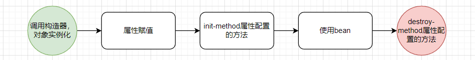

2. 代码演示

   ```java
   public class User {
       private String name;
   
       public User() {
           System.out.println("第一步: 初始化，调用无参构造创建实例...");
       }
   
       public void setName(String name) {
           this.name = name;
           System.out.println("第二步: 属性赋值...");
       }
   
       // 该方法需要在 spring.xml文件中进行配置才生效
       // 方法名称随便写
       public void initMethod() {
           System.out.println("第三步: 调用initMethod...");
       }
   
       // 该方法需要在 spring.xml文件中进行配置才生效
       // 方法名称随便写
       public void destroyMethod() {
           System.out.println("第五步: 调用destroyMethod...");
       }
   }
   
   ```

   ```xml
   <!--
           需要通过init-method和destroy-method属性指定调用哪个方法
           init-method: bean对象属性赋值完成时调用
           destroy-method: bean对象销毁即将销毁时调用
       -->
   <bean id="user" class="com.ilovesshan.pojo.User" init-method="initMethod" destroy-method="destroyMethod">
       <property name="name" value="ilovesshan"/>
   </bean>
   ```

   ```java
   @Test
   public void testStep5() {
       ApplicationContext applicationContext = new ClassPathXmlApplicationContext("spring.xml");
       User user = applicationContext.getBean("user", User.class);
       System.out.println("第四步: 使用bean " + user);
   
       // 调用close方法就可以将容器销毁
       // 虽然ApplicationContext 没有close方法, 但是ClassPathXmlApplicationContext是ApplicationContext的子类。
       // ClassPathXmlApplicationContext有close方法, 做一个强转就可以调用close方法了
       ((ClassPathXmlApplicationContext) applicationContext).close();
   }
   ```

   ```tex
   第一步: 初始化，调用无参构造创建实例...
   第二步: 属性赋值...
   第三步: 调用initMethod...
   第四步: 使用bean com.ilovesshan.pojo.User@2cd2a21f
   第五步: 调用destroyMethod...
   ```

   


### Bean 生命周期七步

1. Bean 生命周期也可以分成7步，那么这多出来的两个点在哪里呢？

   + 点位一：调用init-method配置的方法 之前，调用 bean后处理器的before方法
   + 点位二：调用init-method配置的方法 之后，调用 bean后处理器的after方法

2. 需要注意

   + 如果想Spring容器调用 bean后处理器的before和after方法，那要求这个bena必须实现 beanPostProcesser 接口，并且实现postProcessBeforeInitialization和postProcessAfterInitialization方法。

   + 当前这个类需要在xml中配置，并且该配置会作用域当前xml中所有的bena对象。

     ```java
     public class LogBeanPostProcessor implements BeanPostProcessor {
     
         @Override
         public Object postProcessBeforeInitialization(Object bean, String beanName) throws BeansException {
             System.out.println("第三步: bean后处理器 postProcessBeforeInitialization...");
             return BeanPostProcessor.super.postProcessBeforeInitialization(bean, beanName);
         }
     
         @Override
         public Object postProcessAfterInitialization(Object bean, String beanName) throws BeansException {
             System.out.println("第五步: bean后处理器 postProcessAfterInitialization...");
             return BeanPostProcessor.super.postProcessAfterInitialization(bean, beanName);
         }
     }
     ```

     ```xml
     <!--
             配置 bean后处理器
             注意: 此配置会作用域当前配置文件中所有的bean对象
         -->
     <bean class="com.ilovesshan.beanpostprocessor.LogBeanPostProcessor"/>
     ```

     

3. Bean 生命周期7步

   + 第一步：bean实例创建
   + 第二步：属性赋值
   + 第三步：调用 bean后处理器的before方法
   + 第四步：调用init-method配置的方法
   + 第五步：调用 bean后处理器的after方法
   + 第六步：使用bean
   + 第七步：调用destroy-method配置的方法

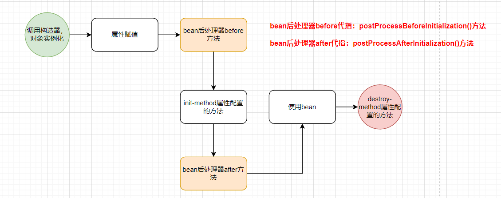


### Bean 生命周期十步

1. Bean 生命周期也可以分成10步，相比7步，那么这多出来的三个点在哪里呢？

   + 点位一：bean后处理器before调用之前：查看是否实现了Aware相关接口，如果实现了就调用对应方法
   + 点位二：bean后处理器before调用之后：查看是否实现了InitializingBean相关接口，如果实现了就调用对应方法
   + 点位三：destroy-method属性配置的方法调用之前，查看是否实现了DisposableBean相关接口，如果实现了就调用对应方法

2. Bean 生命周期10步

   + 第一步：bean实例创建
   + 第二步：属性赋值
   + 第三步：查看是否实现了Aware相关接口，如果实现了就调用对应方法
   + 第第四：调用 bean后处理器的before方法
   + 第五步：查看是否实现了InitializingBean相关接口，如果实现了就调用对应方法
   + 第六步：调用init-method配置的方法
   + 第七步：调用 bean后处理器的after方法
   + 第八步：使用bean
   + 第九步：查看是否实现了DisposableBean相关接口，如果实现了就调用对应方法
   + 第十步：调用destroy-method配置的方法

   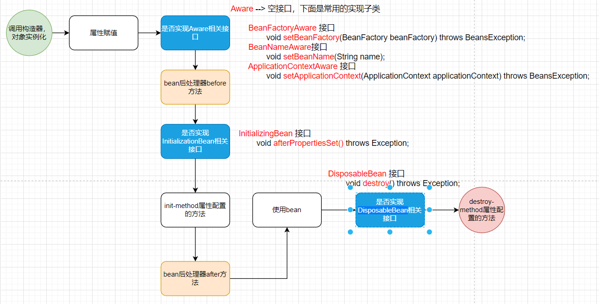

   

3. 代码演示

   ```java
   public class User implements BeanFactoryAware, BeanNameAware, ApplicationContextAware, InitializingBean, DisposableBean {
       private String name;
   
       public User() {
           System.out.println("第一步: 初始化，调用无参构造创建实例...");
       }
   
       public void setName(String name) {
           this.name = name;
           System.out.println("第二步: 属性赋值...");
       }
   
       // 该方法需要在 spring.xml文件中进行配置才生效
       // 方法名称随便写
       public void initMethod() {
           System.out.println("第四步: 调用initMethod...");
       }
   
       // 该方法需要在 spring.xml文件中进行配置才生效
       // 方法名称随便写
       public void destroyMethod() {
           System.out.println("第七步: 调用destroyMethod...");
       }
   
   
       @Override
       public void setBeanFactory(BeanFactory beanFactory) throws BeansException {
           System.out.println("检查是否实现Aware相关接口, BeanFactoryAware setBeanFactory【" + beanFactory + "】...");
       }
   
       @Override
       public void setBeanName(String name) {
           System.out.println("检查是否实现Aware相关接口, BeanNameAware setBeanName【name = " + name + "】...");
       }
   
       @Override
       public void setApplicationContext(ApplicationContext applicationContext) throws BeansException {
           // 这个applicationContext 就是当前Spring容器对象
           System.out.println("检查是否实现Aware相关接口, ApplicationContextAware setApplicationContext【" + applicationContext + "】...");
       }
   
       @Override
       public void afterPropertiesSet() throws Exception {
           System.out.println("检查是否实现InitializingBean相关接口, InitializingBean afterPropertiesSet...");
       }
   
       @Override
       public void destroy() throws Exception {
           System.out.println("检查是否实现DisposableBean相关接口, DisposableBean destroy...");
       }
   }
   
   ```

   


### Bean 作用域范围

1. scope = "singleton"
   + Spring容器会管理该bean对象的完整生命周期，从创建到销毁...
2. scope = "propertype"
   + Spring容器会管理该bean对象的部分生命周期，当【第七步】bean后处理器 postProcessAfterInitialization方法执行完成之后，Spring容器就不再管理该对象了的生命周期了...


### Spring 管理自定义Bean

1. 有些时候，我们自定义的对象默认是不被Spring容器所管理的，如果想该对象也被SPringle容器管理起来，该怎么办呢？

   ```java
   public class Student {
   }
   ```

   ```java
   @Test
   public void testCustomBean() {
       DefaultListableBeanFactory beanFactory = new DefaultListableBeanFactory();
   
       Student s1 = new Student();
       // 将自定义对象放入到Spring容器中
       beanFactory.registerSingleton("student",s1);
   
       // 从Spring容器中根据ID取出自定义对象
       Object s2 = beanFactory.getBean("student");
   
       System.out.println("s1 = " + s1);
       System.out.println("s2 = " + s2);
   }
   ```

   ```tex
   s1 = com.ilovesshan.pojo.Student@1a3869f4
   s2 = com.ilovesshan.pojo.Student@1a3869f4
   ```


## Spring 循环依赖

### 什么是循环依赖

假如有两个对象A和B，A对象中依赖B对象，而B对象中又依赖A对象，你依赖我我也依赖你，这就产生了循环引用!! !

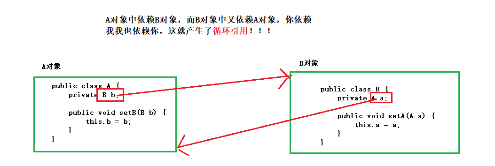

### setter注入 + singleton模式

1. 回顾一下bean的作用域

   + scope="singleton"的时候，容器创建阶段就会去实例化Bean对象，这个Bean再容器中是单例的。
   + scope="prototype"的时候实例化Bean的时机延迟到了bean对象被使用的时候，才会实例化，并且是使用一次就会实例化一次。

2. setter注入 + singleton模式其实不会产生循环依赖问题，为什么？？

   + 当是setter注入 + singleton模式下，Spring容器创建bean实例会分成两步，分成了：实例创建与属性赋值。
   + 实例创建
     + 因为scope="singleton"，那么这个Bean只会被实例化一次（早晚都得创建），当其中某个bean被实例化之后，Spring会对该Bena进行"曝光"，"曝光"一词可以理解成：告诉大家（其他bean）我这个bena实例已经创建好了。
   + 属性赋值
     + 属性赋值这一步时机是当bean实例创建完成之后再进行，那么此时对象已经创建好了，需要那个对象可以直接从Spring容器获取。
     + A需要B（注意: A和B对象已经创建好了），那直接从Spring容器中取B对象就好了，当B对象需要A的时候，直接从Spring容器中取A对象就好了！！

3. 代码演示以下

   ```java
   public class A {
       private String name;
       private B b;
   
       // 省略get和set方法...
   
       @Override
       public String toString() {
           return "A{" +
               // 这里注意不能直接输入b对象，不然会产生递归调用
               // A类中调用B对象的toString方法， B类中又要调用A对象的toString方法，
               "a=" + b.getName() +
               '}';
       }
   }
   ```

   ```java
   public class B {
       private String name;
       private A a;
       
       // 省略get和set方法...
       @Override
       public String toString() {
           return "B{" +
               // 这里注意不能直接输入a对象，不然会产生递归调用
               // B类中调用A对象的toString方法， A类中又要调用B对象的toString方法，
               "a=" + a.getName()+
               '}';
       }
   }
   
   ```

   ```xml
   <bean id="a" class="com.ilovesshan.pojo1.A">
       <property name="name" value="A对象"/>
       <property name="b" ref="b"/>
   </bean>
   
   <bean id="b" class="com.ilovesshan.pojo1.B">
       <property name="name" value="B对象"/>
       <property name="a" ref="a"/>
   </bean>
   
   ```

   ```java
   @Test
   public void test1() {
       ApplicationContext app = new ClassPathXmlApplicationContext("spring.xml");
   
       Object a = app.getBean("a");
       Object b = app.getBean("b");
   
       System.out.println("a = " + a);
       System.out.println("b = " + b);
   }
   ```

   ```tex
   a = A{a=B对象}
   b = B{a=A对象}
   ```

   

### setter注入 + prototype模式

1. setter注入 + prototype模式下，两个bean是scope="prototype"就会产生循环依赖

   + 为什么会产生循环依赖？

     + scope="prototype"实例被创建的时机延迟到了该对象被使用的时候（使用一次创建一次新对象），分析下面代码

       ```xml
       <!--
               1、A对象创建完成之后
               2、对name属性赋值 【OK】
               3、对b属性赋值时，发现b是一个非简单类型，由于scope="prototype"，那就去创建B对象呗
       
               4、创建B对象之后，
               5、对name属性赋值 【OK】
               3、对a属性赋值时，发现a是一个非简单类型，由于scope="prototype"，那就又要去重新去创建A对象(又回到了第1步)
       
               这不就直接循环下去了, 所以就产生了循环依赖...
           -->
       <bean id="a" class="com.ilovesshan.pojo1.A" scope="prototype">
           <property name="name" value="A对象"/>
           <property name="b" ref="b"/>
       </bean>
       
       <bean id="b" class="com.ilovesshan.pojo1.B" scope="prototype">
           <property name="name" value="B对象"/>
           <property name="a" ref="a"/>
       </bean>
       ```

       

   + 循环引用的异常信息

     ```tex
     Error creating bean with name 'xxxx': Requested bean is currently in creation: Is there an unresolvable circular reference?
     
     创建名称为“xxxx”的bean时出错:请求的bean当前正在创建中:是否存在无法解析的循环引用?
     ```

     

2. setter注入 + prototype模式下，任意一个bean是scope="singleton"就不会产生循环依赖

   + 为什么这种模式下不会产生循环依赖？看下面这个段代码分析一下

     ```xml
     <!--
             1、A这个bean对象scope="singleton", 那就先创建对象暂不赋值
             2、B这个bean对象scope="prototype", 那就等使用了再创建新的对象
             3、该创建的都创建完了，接下来执行第二步: 赋值
             4、对A对象的name属性赋值 【OK】
             5、对A对象的b属性赋值时，发现b是一个非简单类型，那就去创建B对象呗
     
             6、创建B对象之后
             7、对name属性赋值 【OK】
             8、对a属性赋值时，发现a是一个非简单类型，但是A对象的scope="singleton"，那就直接从Spring容器中取就可以了
     
             至此，对象的创建与赋值就完成了...
     
         -->
     <bean id="a" class="com.ilovesshan.pojo1.A" scope="prototype">
         <property name="name" value="A对象"/>
         <property name="b" ref="b"/>
     </bean>
     
     <bean id="b" class="com.ilovesshan.pojo1.B" scope="prototype">
         <property name="name" value="B对象"/>
         <property name="a" ref="a"/>
     </bean>
     ```

     

### constroctor注入 + singleton模式

1. constroctor注入 + singleton模式这种模式必定会产生循环依赖。

2. 为什么会产生循环依赖？

   + 创建一个对象是通过构造器的吧？因为这是基于构造器注入，所以有以下步骤：

     + 针对A对象来说，在调用构造器的时候，必定需要B这个对象才能完成A对象的实例创建。

     + 针对B对象来说，在调用构造器的时候，必定需要A这个对象才能完成B对象的实例创建。

   + 很明显，这也就产生了循环依赖...

3. constroctor注入 + singleton模式产生的循环依赖问题，是没办法解决的！！

4. 看个代码吧

   ```java
   // Java代码还是 通过A对象和B对象进行测试
   // 在刚刚的基础上把 set方法改成了构造方法(因为里演示constroctor注入)
   ```

   

   ```xml
   <bean id="a" class="com.ilovesshan.pojo2.A">
       <constructor-arg name="name" value="A对象"/>
       <constructor-arg name="b" ref="b"/>
   </bean>
   
   <bean id="b" class="com.ilovesshan.pojo2.B">
       <constructor-arg name="name" value="B对象"/>
       <constructor-arg name="a" ref="a"/>
   </bean>
   ```

   ```java
   // 测试方法也不用改了....
   ```

   一运行就报错了....

   ```tex
   Caused by: org.springframework.beans.factory.BeanCurrentlyInCreationException: Error creating bean with name 'a': Requested bean is currently in creation: Is there an unresolvable circular reference?
   ```


### Spring 如何解决循环依赖

1. 通过setter注入 + singleton模式可以解决循环依赖问题。

   + 核心点就是：将对象创建和对象属性赋值分成两步，并且无要求两步在同一时间完成。
   + 第一步先创建对象实例，对象实例创建完成后，会将该对象暴露给外界，本质就是将创建好的bena的实例放到一个Map对象中
   + 第二步遍历Map再进行属性赋值

2. 阅读 org.springframework.beans.factory.support.AbstractAutowireCapableBeanFactory类的createBean

   看几个核心方法

   + Instantiate the bean  （第一步：实例化bean）  
     +  createBeanInstance(beanName, mbd, args);
   + Eagerly cache singletons to be able to resolve circular references    （急切地缓存单例对象，以便能够解析循环引用）
     + addSingletonFactory(beanName, () -> getEarlyBeanReference(beanName, mbd, bean));
   + Initialize the bean instance （第二步：初始化bena，给bean对象的属性赋值）
     +  populateBean(beanName, mbd, instanceWrapper);

   ```java
   protected Object doCreateBean(String beanName, RootBeanDefinition mbd, @Nullable Object[] args)
       throws BeanCreationException {
   
       // Instantiate the bean.
       BeanWrapper instanceWrapper = null;
       if (mbd.isSingleton()) {
           instanceWrapper = this.factoryBeanInstanceCache.remove(beanName);
       }
       if (instanceWrapper == null) {
           instanceWrapper = createBeanInstance(beanName, mbd, args);
       }
       Object bean = instanceWrapper.getWrappedInstance();
       Class<?> beanType = instanceWrapper.getWrappedClass();
       if (beanType != NullBean.class) {
           mbd.resolvedTargetType = beanType;
       }
   
       // Allow post-processors to modify the merged bean definition.
       synchronized (mbd.postProcessingLock) {
           if (!mbd.postProcessed) {
               try {
                   applyMergedBeanDefinitionPostProcessors(mbd, beanType, beanName);
               }
               catch (Throwable ex) {
                   throw new BeanCreationException(mbd.getResourceDescription(), beanName,
                                                   "Post-processing of merged bean definition failed", ex);
               }
               mbd.markAsPostProcessed();
           }
       }
   
       // Eagerly cache singletons to be able to resolve circular references
       // even when triggered by lifecycle interfaces like BeanFactoryAware.
       boolean earlySingletonExposure = (mbd.isSingleton() && this.allowCircularReferences &&
                                         isSingletonCurrentlyInCreation(beanName));
       if (earlySingletonExposure) {
           if (logger.isTraceEnabled()) {
               logger.trace("Eagerly caching bean '" + beanName +
                            "' to allow for resolving potential circular references");
           }
           addSingletonFactory(beanName, () -> getEarlyBeanReference(beanName, mbd, bean));
       }
   
       // Initialize the bean instance.
       Object exposedObject = bean;
       try {
           populateBean(beanName, mbd, instanceWrapper);
           exposedObject = initializeBean(beanName, exposedObject, mbd);
       }
       catch (Throwable ex) {
           if (ex instanceof BeanCreationException bce && beanName.equals(bce.getBeanName())) {
               throw bce;
           }
           else {
               throw new BeanCreationException(mbd.getResourceDescription(), beanName, ex.getMessage(), ex);
           }
       }
   
       if (earlySingletonExposure) {
           Object earlySingletonReference = getSingleton(beanName, false);
           if (earlySingletonReference != null) {
               if (exposedObject == bean) {
                   exposedObject = earlySingletonReference;
               }
               else if (!this.allowRawInjectionDespiteWrapping && hasDependentBean(beanName)) {
                   String[] dependentBeans = getDependentBeans(beanName);
                   Set<String> actualDependentBeans = new LinkedHashSet<>(dependentBeans.length);
                   for (String dependentBean : dependentBeans) {
                       if (!removeSingletonIfCreatedForTypeCheckOnly(dependentBean)) {
                           actualDependentBeans.add(dependentBean);
                       }
                   }
                   if (!actualDependentBeans.isEmpty()) {
                       throw new BeanCurrentlyInCreationException(beanName,
                                                                  "Bean with name '" + beanName + "' has been injected into other beans [" +
                                                                  StringUtils.collectionToCommaDelimitedString(actualDependentBeans) +
                                                                  "] in its raw version as part of a circular reference, but has eventually been " +
                                                                  "wrapped. This means that said other beans do not use the final version of the " +
                                                                  "bean. This is often the result of over-eager type matching - consider using " +
                                                                  "'getBeanNamesForType' with the 'allowEagerInit' flag turned off, for example.");
                   }
               }
           }
       }
   
       // Register bean as disposable.
       try {
           registerDisposableBeanIfNecessary(beanName, bean, mbd);
       }
       catch (BeanDefinitionValidationException ex) {
           throw new BeanCreationException(
               mbd.getResourceDescription(), beanName, "Invalid destruction signature", ex);
       }
   
       return exposedObject;
   }
   ```

3. 关注一下，addSingletonFactory() 方法，缓存bean的实例，Spring到底做了什么？

   + 首先会调用org.springframework.beans.factory.support.DefaultSingletonBeanRegistry类中的addSingletonFactory方法。

     

   + 先看一下DefaultSingletonBeanRegistry类中的几个Map集合，很重要！！

     + singletonObjects是一级缓存 、earlySingletonObjects是二级缓存 、singletonFactories是三级缓存 
     + 这三个Map有一个共同属性，key存储的都是bean的id
     + 一级缓存的value缓存的是：完整的单例bean对象，该bean对象已经给属性赋值了。
     + 二级缓存的value缓存的是：早期的单例bean对象，该对象的属性还未赋值，存放的仅仅是bean的实例对象。
     + 三级缓存的value缓存的是：创建bean对象的单例工厂对象，每个单例bean都会对应一个单例工厂对象。

     ```java
     /** Cache of singleton objects: bean name to bean instance. */
     private final Map<String, Object> singletonObjects = new ConcurrentHashMap<>(256);
     
     /** Cache of early singleton objects: bean name to bean instance. */
     private final Map<String, Object> earlySingletonObjects = new ConcurrentHashMap<>(16);
     
     /** Cache of singleton factories: bean name to ObjectFactory. */
     private final Map<String, ObjectFactory<?>> singletonFactories = new HashMap<>(16);
     ```

   + 回到 addSingletonFactory 方法中

     ```java
     protected void addSingletonFactory(String beanName, ObjectFactory<?> singletonFactory) {
         Assert.notNull(singletonFactory, "Singleton factory must not be null");
         synchronized (this.singletonObjects) {
             // 如果一级缓存中不包含该bena的名称
             if (!this.singletonObjects.containsKey(beanName)) {
                 // 将该bean添加到三级缓存中
                 this.singletonFactories.put(beanName, singletonFactory);
                 this.earlySingletonObjects.remove(beanName);
                 this.registeredSingletons.add(beanName);
             }
         }
     }
     ```

   + 看一个获取Bean会发生什么，关注该类中的 Object getSingleton(String beanName, boolean allowEarlyReference)方法 

     ```java
     @Nullable
     protected Object getSingleton(String beanName, boolean allowEarlyReference) {
         // Quick check for existing instance without full singleton lock
         Object singletonObject = this.singletonObjects.get(beanName);
         if (singletonObject == null && isSingletonCurrentlyInCreation(beanName)) {
             singletonObject = this.earlySingletonObjects.get(beanName);
             if (singletonObject == null && allowEarlyReference) {
                 synchronized (this.singletonObjects) {
                     // Consistent creation of early reference within full singleton lock
                     // 根据bean的id从一级缓存中获取 该bean对象
                     singletonObject = this.singletonObjects.get(beanName);
                     if (singletonObject == null) {
                         //   根据bean的id从二级缓存中获取 该bean对象
                         singletonObject = this.earlySingletonObjects.get(beanName);
                         if (singletonObject == null) {
                             //   根据bean的id从三级缓存中获取 该bean对象对应的bean工厂
                             ObjectFactory<?> singletonFactory = this.singletonFactories.get(beanName);
                             if (singletonFactory != null) {
                                 // 通过bean工厂获取一个bean实例
                                 singletonObject = singletonFactory.getObject();
                                 // 将bean实例放到二级缓存中(注意还没对属性赋值)
                                 this.earlySingletonObjects.put(beanName, singletonObject);
                                 // 通过bean的id从三级缓存中移除该bean的对应的工厂
                                 this.singletonFactories.remove(beanName);
                             }
                         }
                     }
                 }
             }
         }
         return singletonObject;
     } 
     ```

     

### Spring 三个级别缓存

1. singletonObjects（一级缓存）
   + 完整的单例bean对象，该bean对象已经给属性赋值了。
2. earlySingletonObjects（二级缓存）
   + 早期的单例bean对象，该对象的属性还未赋值，存放的仅仅是每个bean的实例对象。
3. singletonFactories（三级缓存）
   + 创建bean对象的单例工厂对象，每个单例bean都会对应一个单例工厂对象。


## 手写 Spring 框架简单版

### 回顾反射机制

1. 调用方法的核心四要素（从那个类调用那个方法，传递什么参数返回值是什么）

   + 从那个类中调用方法
   + 调用这个类的那个方法
   + 调用方法传递什么类型的参数
   + 调用方法的返回值是什么类型

2. 通过反射机制调用类中方法

   + User类

     ```java
     public class User {
         public void doSome() {
             System.out.println("com.ilovesshan.reflect.User doSome() execution....");
         }
     
         public boolean doSome(String t1, int t2) {
             System.out.println("com.ilovesshan.reflect.User doSome(String t1, int t2)  execution....");
             return false;
         }
     }
     ```

     

   + 通过反射机制，调用doSome()方法

     ```java
     public class Test {
         public static void main(String[] args) throws Exception {
             // 通过反射加载类
             Class<?> clazz = Class.forName("com.ilovesshan.reflect.User");
             // 通过构造器创建实例对象
             Object instance = clazz.getDeclaredConstructor().newInstance();
             // 获取方法
             Method method = clazz.getMethod("doSome");
             // 调用方法
             method.invoke(instance);
         }
     }
     ```

     

   + 通过反射机制，调用doSome(String t1, int t2)方法

     ```java
     public class Test {
         public static void main(String[] args) throws Exception {
             // 通过反射加载类
             Class<?> clazz = Class.forName("com.ilovesshan.reflect.User");
             // 通过构造器创建实例对象
             Object instance = clazz.getDeclaredConstructor().newInstance();
             // 获取方法
             Method method = clazz.getMethod("doSome", String.class, int.class);
             // 调用方法并接收返回值
             Object invoke = method.invoke(instance, "ilovesshan", 250);
             System.out.println("调用结果返回值 = " + invoke);
         }
     }
     ```

     

### Spring核心DI实现

1. 已知条件

   + 该类的全限定名称是：com.ilovesshan.reflect.Student
   + 该类有一个私有属性name，属性类型是String
   + 该类满足JavaBean规范，实现了get和set方法

   要求：通过反射机制实现对name属性赋值，并且再获取值输出到控制台!

2. 通过反射实现

   ```java
   public class Test {
       public static void main(String[] args) throws Exception {
           String classPath = "com.ilovesshan.reflect.Student";
           String propertyName = "name";
   
           // 通过反射加载对象并创建实例
           Class<?> clazz = Class.forName(classPath);
           Object instance = clazz.getDeclaredConstructor().newInstance();
   
           // 通过属性获取名称获取类型
           Class<?> propertyType = clazz.getDeclaredField(propertyName).getType();
   
   
           // 拼凑get和set名称
           String getMethodName = "get" + propertyName.toUpperCase().charAt(0) + propertyName.substring(1);
           String setMethodName = "set" + propertyName.toUpperCase().charAt(0) + propertyName.substring(1);
   
   
           // 调用set赋值
           Method declaredSetMethod = clazz.getDeclaredMethod(setMethodName, propertyType);
           declaredSetMethod.invoke(instance, "ilovesshan");
   
   
           // 通过get取值
           Method declaredGetMethod = clazz.getDeclaredMethod(getMethodName);
           Object returnValue = declaredGetMethod.invoke(instance);
           System.out.println("returnValue = " + returnValue);
       }
   }
   ```

3. 回顾一下spring.xml文件中配置的bena

   是不是知道类的全限定名称：class="xxxx"

   是不是知道属性名称：name="xxxx"

   是不是知道属性名称对应的值：value="xxxx"

   知道这些信息了，解析一下xml是不是就可以通过反射机制实现依赖注入！！

   ```xml
   <bean id="studentBean" class="com.ilovesshan.pojo.Student">
       <property name="name" value="张三"/>
       <property name="address" ref="addressBean"/>
       <property name="address.name" value="四川省巴中市"/>
   </bean>
   ```

   

### 实现 godspring

1. 实现godspring核心代码

   ```java
   public interface Application {
       Object getBean(String beanName);
   }
   ```

   ```java
   public class ClassPathApplicationContext implements Application {
   
       /**
        * 保存单例bean的实例 ,key bean的id, value bean对象
        */
       private final Map<String, Object> singletonObjects = new HashMap<>();
   
       public ClassPathApplicationContext(String configFile) {
           try {
               // 通过dom4j解析xml文件
               SAXReader saxReader = new SAXReader();
               InputStream inputStream = ClassLoader.getSystemClassLoader().getResourceAsStream(configFile);
               Document document = saxReader.read(inputStream);
               Element rootElement = document.getRootElement();
               List<Element> beanList = rootElement.elements("bean");
   
               // 循环遍历创建对象实例
               beanList.forEach(bean -> {
                   String beanName = bean.attributeValue("id");
                   String beanClass = bean.attributeValue("class");
                   try {
                       // 通过反射创建对象 放到singletonObjects中
                       Class<?> clazz = Class.forName(beanClass);
                       Object instance = clazz.getDeclaredConstructor().newInstance();
                       singletonObjects.put(beanName, instance);
                   } catch (Exception e) {
                       e.printStackTrace();
                   }
               });
   
               // 循环遍历给对象属性赋值
               beanList.forEach(bean -> {
                   String beanName = bean.attributeValue("id");
                   String beanClass = bean.attributeValue("class");
   
                   List<Element> propertyList = bean.elements("property");
                   // 可能会有多个 <property name="xxx" value="xxx"/> 标签
                   propertyList.forEach(property -> {
                       try {
                           // 属性名称
                           String name = property.attributeValue("name");
   
                           // 根据beanName从singletonObjects中获取bean对象
                           Object beanInstance = singletonObjects.get(beanName);
   
                           // 通过singletonObjects
                           Class<?> aClass = Class.forName(beanClass);
   
                           String setMethodName = "set" + name.toUpperCase().charAt(0) + name.substring(1);
   
                           // 获取参数类型
                           Class<?> parameterTypeClazz = aClass.getDeclaredField(name).getType();
   
                           // 获取成员方法
                           Method declaredSetMethod = aClass.getDeclaredMethod(setMethodName, parameterTypeClazz);
   
                           String value = property.attributeValue("value");
                           String ref = property.attributeValue("ref");
   
                           // 简单类型
                           if (value != null) {
                               // 获取参数类型字符串
                               String parameterType = parameterTypeClazz.getSimpleName().toUpperCase();
                               Object determineValue = value;
                               // 暂时只接受: byte、short、char、int、login、float、double、boolean以及对应的包装类,还有String
                               switch (parameterType) {
                                       // 处理基本数据类型
                                   case "byte":
                                       determineValue = Byte.parseByte(value);
                                       break;
                                   case "short":
                                       determineValue = Short.parseShort(value);
                                       break;
                                   case "char":
                                       determineValue = value.charAt(0);
                                       break;
                                   case "int":
                                       determineValue = Integer.parseInt(value);
                                       break;
                                   case "long":
                                       determineValue = Long.parseLong(value);
                                       break;
                                   case "float":
                                       determineValue = Float.parseFloat(value);
                                       break;
                                   case "double":
                                       determineValue = Double.parseDouble(value);
                                       break;
                                   case "boolean":
                                       determineValue = Boolean.parseBoolean(value);
                                       break;
   
                                       // 处理基本数据类型对应的包装类
                                   case "Byte":
                                       determineValue = Byte.valueOf(value);
                                       break;
                                   case "Short":
                                       determineValue = Short.valueOf(value);
                                       break;
                                   case "Character":
                                       determineValue = Character.valueOf(value.charAt(0));
                                       break;
                                   case "Integer":
                                       determineValue = Integer.valueOf(value);
                                       break;
                                   case "Long":
                                       determineValue = Long.valueOf(value);
                                       break;
                                   case "Float":
                                       determineValue = Float.valueOf(value);
                                       break;
                                   case "Double":
                                       determineValue = Double.valueOf(value);
                                       break;
                                   case "Boolean":
                                       determineValue = Boolean.valueOf(value);
                                       break;
                               }
                               declaredSetMethod.invoke(beanInstance, determineValue);
                           }
   
                           // 非简单类型
                           if (ref != null) {
                               declaredSetMethod.invoke(beanInstance, singletonObjects.get(ref));
                           }
                       } catch (Exception e) {
                           e.printStackTrace();
                       }
                   });
               });
           } catch (Exception e) {
               e.printStackTrace();
           }
       }
   
       @Override
       public Object getBean(String beanName) {
           return singletonObjects.get(beanName);
       }
   }
   
   ```

   

2. 测试godspring框架

   ```java
   public class User {
       private String username;
       private String password;
       // 省略set和toString方法
   }
   ```

   ```java
   public class UserService {
       public void deleteUser() {
           System.out.println("UserService deleteUser...");
       }
   }
   
   ```

   ```java
   public class UserController {
   
       private UserService userService;
   
       public void setUserService(UserService userService) {
           this.userService = userService;
       }
   
       public void deleteUserRequest(){
           userService.deleteUser();
       }
   }
   
   ```

   ```xml
   <bean id="user" class="com.ilovesshan.User">
       <property name="username" value="ilovesshan"/>
       <property name="password" value="ilovesshan123!@#"/>
   </bean>
   
   <bean id="userService" class="com.ilovesshan.UserService"/>
   
   <bean id="userController" class="com.ilovesshan.UserController">
       <property name="userService" ref="userService"/>
   </bean>
   ```

   ```java
   @RunWith(JUnit4.class)
   public class GodSpringTest {
   
       @Test
       public void testDi() {
           Application app = new ClassPathApplicationContext("godspring.xml");
   
           Object user = app.getBean("user");
           System.out.println("user = " + user);
   
           UserController userController = (UserController) app.getBean("userController");
           userController.deleteUserRequest();
       }
   }
   ```

   ```tex
   user = User{username='ilovesshan', password='ilovesshan123!@#'}
   UserService deleteUser...
   ```

   


## Spring IOC注解式开发

### 注解回顾

1. 注解概念

   + Java 注解用于为 Java 代码提供元数据。作为元数据，注解不直接影响你的代码执行，但也有一些类型的注解实际上可以用于这一目的。
   + Java 注解是从 Java5 开始添加到 Java 的。

2. 注解分类

   + Java自带的标准注解

     + 包括@Override、@Deprecated、@SuppressWarnings等，使用这些注解后编译器就会进行检查。

   + 元注解（修饰注解的注解）

     + @Documented
       + 是否生成doc文档
     + @Retention(RetentionPolicy.RUNTIME)
       + RetentionPolicy.SOURCE，注解作用域范围编译阶段
       + RetentionPolicy.CLASS，注解作用域范围源文件
       + RetentionPolicy.RUNTIME，注解作用域范围字节码文件
     + @Target(ElementType.ANNOTATION_TYPE)
       + ElementType.TYPE，该注解可以用于类上
       + ElementType.FIELD，该注解可以用于属性上
       + ElementType.METHOD，该注解可以用于方法上
       + ElementType.CONSTRUCTOR。该注解可以用于构造器上
       + ...

   + 自定义注解

     + 当属性名称"value"时，可以省略不写
     + 当属性类型是数组时，如果只有一个值，可以省略"{}" 不写

     ```java
     @Target(ElementType.TYPE)
     @Retention(RetentionPolicy.RUNTIME)
     public @interface Component {
         String value();
     }
     ```

     ```java
     @Component("user")
     public class User {}
     ```

     

### 反射获取注解信息

```java
@Component("student")
public class Student {}
```

```java
public class AnnotationTest {
    public static void main(String[] args) {
        try {
            Class<?> clazz = Class.forName("com.ilovesshan.pojo.Student");
            boolean annotationPresent = clazz.isAnnotationPresent(Component.class);
            if (annotationPresent) {
                Component annotation = clazz.getAnnotation(Component.class);
                String value = annotation.value();
                System.out.println("value = " + value);
            }
        } catch (Exception e) {
            e.printStackTrace();
        }
    }
}
```


### 组件扫描原理

1. 扫描一个包下全部的类，将被@Component("xxx")注解修饰的类进行实例化，新建一个map对象，xxx作为map的key，实例对象作为map的value。

2. 编码实现

   ```java
   public class AnnotationTest {
       public static void main(String[] args) {
           HashMap<String, Object> beans = new HashMap<>();
           String basePackageName = "com.ilovesshan.pojo";
           String basePackageDirPath = basePackageName.replaceAll("\\.", "/");
           URL resource = ClassLoader.getSystemClassLoader().getResource(basePackageDirPath);
           String path = resource.getPath();
           File file = new File(path);
           String[] fileList = file.list();
           for (String f : fileList) {
               try {
                   String ClassName = f.split("\\.")[0];
                   String fullName = basePackageName + "." + ClassName;
                   Class<?> clazz = Class.forName(fullName);
                   Object instance = clazz.getDeclaredConstructor().newInstance();
                   boolean annotationPresent = clazz.isAnnotationPresent(Component.class);
                   if (annotationPresent) {
                       Component annotation = clazz.getAnnotation(Component.class);
                       String value = annotation.value();
                       beans.put(value, instance);
                   }
               } catch (Exception e) {
                   e.printStackTrace();
               }
           }
           System.out.println("beans = " + beans);
       }
   }
   
   ```

   


### 负责声明Bean的注解

1. Spring中实例化Bean的注解有四个常用的@Component、@Controller、@Service、@Repository

   + 这几个注解作用域都是类上，可以将该类实例化之后注册到Spring容器中。

   + 核心注解还是的@Component，剩下的三个注解都是为了提高代码的可读性而生的

   + @Controller一般用于三层架构中的Controller层，@Service一般用于三层架构中的Service层，@Repository一般用于三层架构中的Dao层

   + 了解一下四个注解的源码

     + 每个注解都有一个value属性，其实这个value属性就是该对象被实例化之后，放到Spring容器的Bena的Id，如果省略value值，默认值就是类名称（首字母小写）
     + @Controller、@Service、@Repository三个注解中每个value属性上有一个@AliasFor() 注解，当前注解作为@Component注解的别名，本质上还是@Component。

     ```java
     @Target(ElementType.TYPE)
     @Retention(RetentionPolicy.RUNTIME)
     @Documented
     @Indexed
     public @interface Component {
         String value() default "";
     }
     ```

     ```java
     @Target(ElementType.TYPE)
     @Retention(RetentionPolicy.RUNTIME)
     @Documented
     @Component
     public @interface Service {
     	@AliasFor(annotation = Component.class)
     	String value() default "";
     }
     ```

     ```java
     @Target(ElementType.TYPE)
     @Retention(RetentionPolicy.RUNTIME)
     @Documented
     @Component
     public @interface Repository {
     	@AliasFor(annotation = Component.class)
     	String value() default "";
     }
     ```

     

     ```java
     @Target(ElementType.TYPE)
     @Retention(RetentionPolicy.RUNTIME)
     @Documented
     @Component
     public @interface Repository {
     	@AliasFor(annotation = Component.class)
     	String value() default "";
     }
     ```

2. 这些注解怎么使用？

   + 第一步：添加依赖，这些实例化Bean的注解都需要 spring-aop.jar ，由于是maven项目直接依赖spring-context就好了，相关依赖maven会自动下载。

   + 第二步：创建对象，并添加注解

     ```java
     @Component
     public class User {}
     ```

     ```java
     @Component("stu")
     public class Student {}
     ```

     

   + 在配置spring.xml中配置包扫描

     ```xml
     <!--
             需要添加context命名空间(推荐使用idea自动补充)
             base-package: 扫描该包(子包)下的所有类
         -->
     <context:component-scan base-package="com.ilovesshan.bean"/>
     ```

     

   + 单元测试

     ```java
     @Test
     public void t1() {
         ApplicationContext applicationContext = new ClassPathXmlApplicationContext("spring.xml");
         Object user = applicationContext.getBean("user");
         Object stu = applicationContext.getBean("stu");
         System.out.println("user = " + user);
         System.out.println("stu = " + stu);
     }
     ```

     ```tex
     user = com.ilovesshan.bean.User@6e9a5ed8
     stu = com.ilovesshan.bean.Student@7e057f43
     ```

     

### 选择性的实例化Bean

1. 扫描指定注解(包含)

   ```xml
   <!-- use-default-filters="false" 不扫描该包下的类的注解(注解失效) -->
   <context:component-scan base-package="com.ilovesshan.bean2" use-default-filters="false">
       <!-- 只扫描@Controller注解 和 @Service注解-->
       <context:include-filter type="annotation" expression="org.springframework.stereotype.Controller"/>
       <context:include-filter type="annotation" expression="org.springframework.stereotype.Service"/>
   </context:component-scan>
   ```

2. 

3. 排除扫描指定注解(排除)

   ```xml
   <!-- use-default-filters="true" 扫描该包下的类的注解(默认就是true) -->
   <context:component-scan base-package="com.ilovesshan.bean2" use-default-filters="true">
       <!-- 不扫描@Controller注解 和 @Service注解-->
       <context:exclude-filter type="annotation" expression="org.springframework.stereotype.Controller"/>
       <context:exclude-filter type="annotation" expression="org.springframework.stereotype.Service"/>
   </context:component-scan>
   ```


### 负责注入的注解

1. @Value

   + @Value 注解用于注入简单数据类型

     ```java
     @Target({ElementType.FIELD, ElementType.METHOD, ElementType.PARAMETER, ElementType.ANNOTATION_TYPE})
     @Retention(RetentionPolicy.RUNTIME)
     @Documented
     public @interface Value {
         String value();
     }
     ```

   + @Value 注解可以作用域于属性上、方法上、方法参数上、注解上

     + 属性上

       ```java
       @Component
       public class Student {
       
           @Value("ilovesshan")
           private String username;
       
           @Value("20")
           private int age;
       }
       ```

       

     + 方法上(setter方法)

       ```java
       @Component
       public class Student {
           @Value("ilovesshan")
           public void setUsername(String username) {
               this.username = username;
           }
           
           @Value("20")
           public void setAge(int age) {
               this.age = age;
           }
       }
       ```

       

     + 方法参数上（构造方法）

       ```java
       @Component
       public class Student {
           public Student(@Value("ilovesshan")String username, @Value("20")int age) {
               this.username = username;
               this.age = age;
           }
       
       }
       ```

       

     

2. @Autowired + @Qualifier

   + @Autowired 注入非简单数据类型，默认根据类型注入(byType)，@Autowired直接使用即可，不用填写参数。

   + 当Spring容器中有相同类型的Bean时，@Autowired注解会根据属性名称进行注入，如果没匹配成功就会报错，这时候需要配合@Qualifier("beanName")指定名称进行注入

   + @Autowired + @Qualifier，@Autowired默认根据类型匹配 + @Qualifier注解可以指定bean名称（byType + byName）

     ```java
     // 作用域于 构造器上、方法上、方法参数上、属性上、注解上
     @Target({ElementType.CONSTRUCTOR, ElementType.METHOD, ElementType.PARAMETER, ElementType.FIELD, ElementType.ANNOTATION_TYPE})
     @Retention(RetentionPolicy.RUNTIME)
     @Documented
     public @interface Autowired {
     	boolean required() default true;
     }
     ```

     ```java
     // 作用域于 属性上、方法上、方法参数上、类上、注解上
     @Target({ElementType.FIELD, ElementType.METHOD, ElementType.PARAMETER, ElementType.TYPE, ElementType.ANNOTATION_TYPE})
     @Retention(RetentionPolicy.RUNTIME)
     @Inherited
     @Documented
     public @interface Qualifier {
         String value() default "";
     }
     ```

   + 举个例子

     + 新建bean对象，一个接口 + 两个实现类（实际开发中一般是一个接口对应一个实现类），这里为了演示@Autowired + @Qualifier才这样设计。

       ```java
       public interface OrderDao {
           void insert();
       }
       ```

       ```java
       @Repository
       public class OrderDaoImplForMySql implements OrderDao {
           @Override
           public void insert() {
               System.out.println("MySql 数据库正在创建订单....");
           }
       }
       ```

       ```java
       @Repository
       public class OrderDaoImplForOracle implements OrderDao {
           @Override
           public void insert() {
               System.out.println("Oracle 数据库正在创建订单....");
           }
       }
       ```

       

     

     + 属性注入

       ```java
       @Service
       public class OrderService {
       
           @Autowired
           @Qualifier("orderDaoImplForOracle")
           private OrderDao orderDao;
       
           public void createOrder() {
               orderDao.insert();
           }
       }
       ```

     + set方法注入

       ```java
       @Service
       public class OrderService {
           private OrderDao orderDao;
       
           @Autowired
           @Qualifier("orderDaoImplForOracle")
           public void setOrderDao(OrderDao orderDao) {
               this.orderDao = orderDao;
           }
       }
       ```

       

     + 构造器注入

       ```java
       @Service
       public class OrderService {    
           private OrderDao orderDao;
           public OrderService(@Autowired @Qualifier("orderDaoImplForOracle") OrderDao orderDao) {
               this.orderDao = orderDao;
           }
       }
       ```

       ```java
       // 如果类中只有一个构造器、并且构造器参数类型和属性类型匹配，那么(@Autowired就可以不写了(Spring容器中没有相同类型的Bean)
       
       @Service
       public class OrderService {    
           private OrderDao orderDao;
           public OrderService(OrderDao orderDao) {
               this.orderDao = orderDao;
           }
       }
       ```

       

       

3. @Resources

   + @Resources 和 @Autowired 注解都是用来实现依赖注入的，@Resources它属于JSR-250规范的一个注解。

   + @Resources 注解默认根据名称进行注入(byName)，byName注入失败时会根据属性名称注入，属性名称注入失败时，再根据类型注入(byType)。

     主要看name和type两个属性

     name: 指定根据名称注入

     type： 指定根据类型注入

     ```java
     @Target({ElementType.TYPE, ElementType.FIELD, ElementType.METHOD})
     @Retention(RetentionPolicy.RUNTIME)
     @Repeatable(Resources.class)
     public @interface Resource {
         String name() default "";
     
         String lookup() default "";
     
         Class<?> type() default Object.class;
     
         Resource.AuthenticationType authenticationType() default Resource.AuthenticationType.CONTAINER;
     
         boolean shareable() default true;
     
         String mappedName() default "";
     
         String description() default "";
     
         public static enum AuthenticationType {
             CONTAINER,
             APPLICATION;
     
             private AuthenticationType() {
             }
         }
     }
     
     ```

     

   + 使用@Resources注解需要注意（@Resource属于JDK的扩展包，不在JDK中，JDK是8的话不用引入依赖，如过高于11或者低于8就需要引入以下依赖）

     + 如果是Spring6+，需要导入如下依赖

       ```xml
       <dependency>
           <groupId>jakarta.annotation</groupId>
           <artifactId>jakarta.annotation-api</artifactId>
           <version>2.1.1</version>
       </dependency>
       ```

       

     + 如果是Spring5-，需要导入如下依赖

       ```xml
       <dependency>
           <groupId>javax.annotation</groupId>
           <artifactId>javax.annotation-api</artifactId>
           <version>1.3.2</version>
       </dependency>
       ```

     + 代码演示

       ```java
       public interface OrderDao {
           void insert();
       }
       
       
       
       @Repository
       public class OrderDaoImplForMySql implements OrderDao {
           @Override
           public void insert() {
               System.out.println("MySql 数据库正在创建订单....");
           }
       }
       
       
       @Repository
       public class OrderDaoImplForOracle implements OrderDao {
           @Override
           public void insert() {
               System.out.println("Oracle 数据库正在创建订单....");
           }
       }
       
       ```

       ```java
       @Service
       public class OrderService {
       
           // @Resource(name = "orderDaoImplForOracle")
           private OrderDao orderDao;
       
       
           @Resource(name = "orderDaoImplForOracle")
           public void setOrderDao(OrderDao orderDao) {
               this.orderDao = orderDao;
           }
       
           public void createOrder() {
               orderDao.insert();
           }
       }


### @AutoWired 和 @Recurce总结

1. 查找机制
   + @AutoWired注入查找顺序：根据类型(byType) -> 属性作为名称(byName)
   + @AutoWired + @Qualifier("beanName")  -> 根据类型(byType) + 名称(byName)
   + @Recurce注入查找顺序：bean名称(byName) -> 属性名称作为name  -> 根据类型 (byType) 
2. 作用范围
   + @AutoWired：属性、方法(setter)、方法参数(构造器)、构造器、注解
   + @Recurce：类、属性、方法(setter)


### 全注解开发

1. 启用全注解开发模式，就可以摒弃xml文件了。

2. 新建一个入口类，也叫做配置类

   ```java
   @Configuration
   @ComponentScan(basePackages = "com.ilovesshan")
   public class SpringApplication {
   }
   ```

3. 编写单元测试

   ```java
   @RunWith(JUnit4.class)
   public class AllAnnotationTest {
   
       @Test
       public void t() {
           // 注意: 现在是全注解开发，已经没有xml文件了，不要使用ClassPathXmlApplicationContext类了
           ApplicationContext app = new AnnotationConfigApplicationContext(SpringApplication.class);
           OrderService orderService = app.getBean("orderService", OrderService.class);
           orderService.createOrder();
       }
   }
   ```


## JdbcTemplate 模板

JdbcTemplate 模板是Spring内置的对数据库实现增删改查的工具类库，一般情况下我们都会使用Spring来集成一些三方的ORM库，例如：MyBatis、Hibernate等等，下面简单了解就行了。

### 依引入赖和准备数据库

```xml
<!-- Spring核心依赖-->
<dependency>
    <groupId>org.springframework</groupId>
    <artifactId>spring-context</artifactId>
    <version>6.0.6</version>
</dependency>

<!-- JdbcTemplate-->
<dependency>
    <groupId>org.springframework</groupId>
    <artifactId>spring-jdbc</artifactId>
    <version>6.0.6</version>
</dependency>

<!-- 德鲁数据库连接池-->
<dependency>
    <groupId>com.alibaba</groupId>
    <artifactId>druid</artifactId>
    <version>1.2.16</version>
</dependency>
```

```sql
drop table if exists `user`;
create table `user` (
    `id` int(10) primary key auto_increment,
    `name` varchar(30) default null,
    `cid` int(10) default null
);

insert into `user` values (1, '邸智伟', 1),(2, '成虹', 2),(3, '康永亮', 1),(4, '杨春旺', 2),(5, '陈建强', 1);
```


### 构建JdbcTemplate对象

```properties
jdbc.driver=com.mysql.cj.jdbc.Driver
jdbc.url=jdbc:mysql://localhost:3306/spring
jdbc.username=root
jdbc.password=123456
```

```xml
<!-- 引入外部配置文件-->
<context:property-placeholder location="jdbc.properties"/>

<!-- 配置JdbcTemplate模板-->
<bean id="jdbcTemplate" class="org.springframework.jdbc.core.JdbcTemplate">
    <property name="dataSource" ref="db"/>
</bean>

<!-- 配置德鲁伊数据源-->
<bean id="db" class="com.alibaba.druid.pool.DruidDataSource">
    <property name="driverClassName" value="${jdbc.driver}"/>
    <property name="url" value="${jdbc.url}"/>
    <property name="username" value="${jdbc.username}"/>
    <property name="password" value="${jdbc.password}"/>
</bean>
```

```java
@Data
@NoArgsConstructor
@AllArgsConstructor
public class User {
    private Integer id;
    private String name;
    private Integer cid;
}
```

```java
@RunWith(JUnit4.class)
public class JdbcTemplateTest {

    private JdbcTemplate jdbcTemplate;

    @Before
    public void before() {
        ClassPathXmlApplicationContext applicationContext = new ClassPathXmlApplicationContext("spring.xml");
        jdbcTemplate = applicationContext.getBean("jdbcTemplate", JdbcTemplate.class);
    }

    @Test
    public void t() {
        System.out.println("jdbcTemplate = " + jdbcTemplate);
        // jdbcTemplate = org.springframework.jdbc.core.JdbcTemplate@20bd8be5
    }
}
```


### 执行 DQL语句

```java
@Test
public void testSelectSingle() {
    String sql = "select * from user where id = ?;";
    User user = jdbcTemplate.queryForObject(sql, new BeanPropertyRowMapper<>(User.class), 1);
    System.out.println("user = " + user);
}
```

```java
@Test
public void testSelectList() {
    String sql = "select * from user;";
    List<User> userList = jdbcTemplate.query(sql, new BeanPropertyRowMapper<>(User.class));
    System.out.println("userList = " + userList);
}
```

```java
@Test
public void testSelectSingleFiled() {
    String sql = "select count(1) from user;";
    int count = jdbcTemplate.queryForObject(sql, int.class);
    System.out.println("count = " + count);
}
```


### 执行 DML语句

```java
@Test
public void testInsert() {
    String sql = "insert into user values (?, ?, ?);";
    int affectRows = jdbcTemplate.update(sql, null, "赵大乏", 3);
    System.out.println("affectRows = " + affectRows);
}

```

```java
@Test
public void testUpdate() {
    String sql = "update user set name = ? ,cid = ? where id = ?;";
    int affectRows = jdbcTemplate.update(sql, "赵大乏11", 6, 6);
    System.out.println("affectRows = " + affectRows);
}

```

````java
@Test
public void testDelete() {
    String sql = "delete from user where id = ?;";
    int affectRows = jdbcTemplate.update(sql, 6);
    System.out.println("affectRows = " + affectRows);
}
````


### 批量执行DML语句

```java
@Test
public void testBatchInsert() {
    Object[] o1 = {21, "张三1", 21};
    Object[] o2 = {22, "张三2", 22};
    Object[] o3 = {23, "张三3", 23};
    Object[] o4 = {24, "张三4", 24};

    List<Object[]> objectList = new ArrayList<>() {{
        add(o1);
        add(o2);
        add(o3);
        add(o4);
    }};

    String sql = "insert into user values (?, ?, ?);";
    int[] affectRows = jdbcTemplate.batchUpdate(sql, objectList);
    System.out.println("affectRows = " + Arrays.toString(affectRows));
}

// affectRows = [1, 1, 1, 1]
```

```java
@Test
public void testBatchUpdate() {
    Object[] o1 = {"张三4", 21, 21};
    Object[] o2 = {"张三3", 22, 22};
    Object[] o3 = {"张三2", 23, 23};
    Object[] o4 = {"张三1", 24, 24};

    List<Object[]> objectList = new ArrayList<>() {{
        add(o1);
        add(o2);
        add(o3);
        add(o4);
    }};

    String sql = "update user set name = ? ,cid = ? where id = ?;";
    int[] affectRows = jdbcTemplate.batchUpdate(sql, objectList);
    System.out.println("affectRows = " + Arrays.toString(affectRows));
}
// affectRows = [1, 1, 1, 1]
```

```java
@Test
public void testBatchDelete() {
    Object[] o1 = {21};
    Object[] o2 = {22};
    Object[] o3 = {23};
    Object[] o4 = {24};

    List<Object[]> objectList = new ArrayList<>() {{
        add(o1);
        add(o2);
        add(o3);
        add(o4);
    }};

    String sql = "delete from user where id = ?;";
    int[] affectRows = jdbcTemplate.batchUpdate(sql, objectList);
    System.out.println("affectRows = " + Arrays.toString(affectRows));
}
// affectRows = [1, 1, 1, 1]
```


## GoF 代理模式

### 代理模式深入理解

1. 什么是代理模式？

   + 代理模式属于GoF设计莫模式中的结构型设计模式
   + 代理模式，意在“代理”二字，代理含义就是：一个对象（代理对象）去保护或者增强目标对象。

2. 通过生活案例来讲解代理模式

   + 小王去找大明星要个亲笔签名，但是小王又没法直接和大明星沟通，没办法只能找大明星的经纪人，让经纪人去和大明星沟通从而转达小王的请求。
   + 小王取深圳租房子，小王想和房东直租但是一直没找到，没办法只能找中介，让中介去帮忙租房子，中介租房子的能力比小王更强，到时候，租好了再和小王说一声，中介从中收取一点费用就ok了。
   + 小王是一个大明星演员，拍高空作业戏的时候，小王担心自己受伤而去找了一个替身演员（小花）来完成这一次高空作业戏。
   + 上面这两个生活案例中都涉及到了几个角色
     + 要亲笔签名案例中：小王【客户端】，经纪人【代理对象】，大明星【目标对象】
     + 深圳租房子案例中：小王【客户端】，中介【代理对象】，房东【目标对象】
     + 高空作业戏案例中：观众【客户端】，小王【目标对象】，小花【代理对象】，

3. 代理模式涉及的角色

   + 代理对象
   + 目标对象
   + 公共接口（代理对象和目标对象实现同一个接口，目的是让客户端使用代理对象时就像在使用目标对象一样的效果）。

4. 代理模式的使用场景

   + 使用场景一

     + 当一个对象需要收到保护时，可以考虑使用代理模式【高空作业戏案例】。

   + 使用场景二

     + 当一个对象需要做功能增强时，可以考虑使用代理模式【深圳租房子案例】。

   + 使用场景三

     + 当一个对象A和另一个对象B无法直接沟通时，可以考虑使用代理模式【亲笔签名案例】。

       

### 静态代理

1. 线上运行的代码

   ```java
   public interface OrderService {
       // 创建订单
       void createOrder();
       // 查询订单
       void selectOrder();
   }
   ```

   ```java
   public class OrderServiceImpl implements OrderService {
       @Override
       public void createOrder() {
           // 模拟业务延时
           try {
               Thread.sleep(1234);
           } catch (InterruptedException e) {
               e.printStackTrace();
           }
           System.out.println("订单创建成功...");
       }
   
       @Override
       public void selectOrder() {
           // 模拟业务延时
           try {
               Thread.sleep(4321);
           } catch (InterruptedException e) {
               e.printStackTrace();
           }
           System.out.println("订单查询成功...");
       }
   }
   ```

   ```java
   @RunWith(JUnit4.class)
   public class StaticProxyTest {
       @Test
       public void t1() {
           final OrderService orderService = new OrderServiceImpl();
           orderService.createOrder();
           orderService.selectOrder();
       }
   }
   ```

   

2. 新需求：统计每个接口的耗时时间

   

3. 需求变更第一版

   + 缺点一：直接修改了源代码，违背了OCP原则。
   + 缺点二：代码重复，1000个业务接口就要写一千次 "long start = System.currentTimeMillis();" 这种代码。

   ```java
   public class OrderServiceImpl implements OrderService {
       @Override
       public void createOrder() {
           long start = System.currentTimeMillis();
           // 模拟业务延时
           try {
               Thread.sleep(1234);
           } catch (InterruptedException e) {
               e.printStackTrace();
           }
           System.out.println("订单创建成功...");
           long end = System.currentTimeMillis();
           System.out.println("创建订单操作耗时" + (end - start));
       }
   
       @Override
       public void selectOrder() {
           long start = System.currentTimeMillis();
           // 模拟业务延时
           try {
               Thread.sleep(4321);
           } catch (InterruptedException e) {
               e.printStackTrace();
           }
           System.out.println("订单查询成功...");
           long end = System.currentTimeMillis();
           System.out.println("查询订单操作耗时" + (end - start));
       }
   }
   ```

   

4. 需求变更第二版

   OrderServiceImplSub继承OrderServiceImpl类，重写了createOrder()方法和selectOrder()方法

   + 缺点一：使用继承关系耦合度变高了。
   + 缺点二：久而久之，子类的数量会急剧膨胀导致类爆炸。
   + 缺点三：代码没得到复用。

   ```java
   public class OrderServiceImplSub extends OrderServiceImpl{
   
       @Override
       public void createOrder() {
           long start = System.currentTimeMillis();
           super.createOrder();
           long end = System.currentTimeMillis();
           System.out.println("创建订单操作耗时" + (end - start));
       }
   
       @Override
       public void selectOrder() {
           long start = System.currentTimeMillis();
           super.selectOrder();
           long end = System.currentTimeMillis();
           System.out.println("查询订单操作耗时" + (end - start));
       }
   }
   ```

   ```java
   final OrderService orderService = new OrderServiceImplSub();
   orderService.createOrder();
   orderService.selectOrder();
   ```

   

5. 需求变更第三版

   新建一个OrderServiceImplProxy代理类同时需要实现OrderService接口，来代理OrderServiceImpl类中的功能，并做功能增强。

   + 缺点一：一个业务模块有一个对应的Service类，一个业务模块就会有一个对应的Service代理类，久而久之也会产生类爆炸。
   + 缺点二：代码没得到复用。

   ```java
   public class OrderServiceImplProxy implements OrderService {
       private OrderService orderService;
   
       // 这里采用组合关系，组合比泛化（继承）产生的耦合度更低
       public OrderServiceImplProxy(OrderServiceImpl orderService) {
           this.orderService = orderService;
       }
       public void createOrder() {
           long start = System.currentTimeMillis();
           orderService.createOrder();
           long end = System.currentTimeMillis();
           System.out.println("创建订单操作耗时" + (end - start));
       }
   
       public void selectOrder() {
           long start = System.currentTimeMillis();
           orderService.selectOrder();
           long end = System.currentTimeMillis();
           System.out.println("创建订单操作耗时" + (end - start));
       }
   }
   ```

   ```java
   final OrderService orderService = new OrderServiceImplProxy(new OrderServiceImpl());
   orderService.createOrder();
   orderService.selectOrder();
   ```

   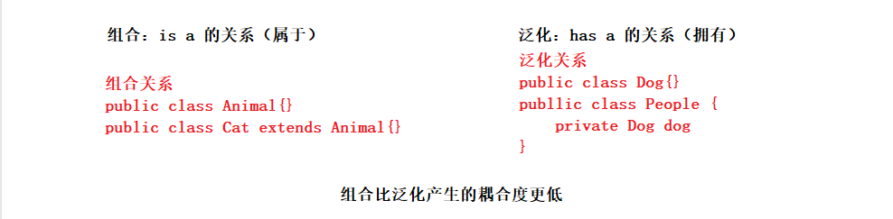

   

### 动态代理概念

1. 什么是动态代理？

   + 在程序运行期间，动态的在内存中生成一个字节码文件，生产这个字节码文件的这种技术叫做动态代理。

2. 动态代理可以解决哪些问题？

   + 动态代理主要是解决上面静态代理遗留下来的问题，比如：类爆炸、代码没得到复用等等。
   + 核心功能是：可以在不改变原来目标方法功能的前提下， 可以在代理中增强自己的功能代码。

3. 动态代理可以分为三大类

   + JDK 动态代理
     + JDK动态代理是Java的内置库，需要注意的是JDK动态代理只能通过实现接口的方式进行代理类的生成。
   + CGLIB 动态代理
     + CGLIB(Code Generation Library)是一个开源、高性能、高质量的Code生成类库（代码生成包）。
     + CGLIB的底层是通过使用一个小而快的字节码处理框架ASM，来转换字节码并生成新的类。但不鼓励大家直接使用ASM框架，因为对底层技术要求比较高。
     + CGLIB动态代理可以通过继承类的方式也可以通过实现接口的凡是生产代理对象。
   + Javassis t动态代理
     + Javaassist 是一个用来处理 Java 字节码的类库。它可以在一个已经编译好的类中添加新的方法，或者是修改已有的方法，并且不需要对字节码方面有深入的了解。同时也可以去生成一个新的类对象，通过完全手动的方式。

   

### JDK 动态代理

1. JDK动态代理主要是通过java.lang.reflect.Proxy类，调用Proxy类中的newInstance()方法来实现。

2. newInstance()有集合核心参数，这里重点说明

   + ClassLoader loader（类加载器）

     + 凡是将一个字节码文件加载到内存中去，那么都需要一个类加载器，当然JDK动态代理生成的字节码文件想要加载到内存中去也不例外，需要提供一个类加载器对象。

     + JDK规定，代理对象使用的类加载器需要和目标对象的类加载器一样，所说newInstance()方法的第一个参数传入目标对象的类加载器就ok了。

       

   + Class<?>[] interfaces（代理对象和目标对象都要实现的共同的接口）

     + JDK动态代理的特点是：只能通过实现接口的方式进行代理类的生成，要想通过JDK动态代理生成代理类，那就需要提供一些接口呗。

     + 提供的接口也不是随意乱写的，需要满足一个条件：代理对象和目标对象都要实现共同的接口

     + newInstance()方法的第二个参数那就传入目标对象实现了的接口呗。

       

   + InvocationHandler h（目标方法调用处理器，该参数是一个接口）

     + InvocationHandler 是一个接口，其中有一个未实现的方法，方法名称是：invoke。

     + 这个方法也有三个参数，下面解释一下这些参数

       + Object proxy（代理类对象）

         + 这个proxy对象，就是JDK帮我们在内存中动态生成的代理对象。

           

       +  Method method（目标对象的方法）

         + 代理的有一个初衷就是：不改变原有代码的基础上实现功能的增加，注意是不改变原有代码，也就是还得保证原来代码正常执行

         + method就是目标对象的方法，简单理解就是：调用哪个方法，这个method就是那个方法。

           + target.createOrder()， 那么method就是createOrder这个方法。

           + target.selectOrder()， 那么method就是selectOrder这个方法。

             

       + Object[] args（目标对象的方法的实际参数）

         + 标对象的方法的实际参数，就是说调用方法的时候可能会传递参数，那么这些参数参数就放在args中

         + invoke方法将args参数传递给我们的程序员的意思是：在调用目标方法时，请将args作为参数传递给目标方法，别让目标方法的参数搞丢了。

           

       + invoke方法有返回值，返回值顾名思义了吧，那就是目标方法也有可能有返回值撒，在invoke方法里面将目标方法的执行结果作为invoke方法的返回值就ok了，这样客户端也能够收到目标方法的返回值。

     ```java
     public class Proxy implements java.io.Serializable {  
         // ...
     
         @CallerSensitive
         public static Object newProxyInstance(ClassLoader loader, Class<?>[] interfaces, InvocationHandler h) {
             // ...
         }
     }
     
     private InvocationHandler h = new InvocationHandler() {
         @Override
         public Object invoke(Object proxy, Method method, Object[] args) throws Throwable {
             return null;
         }
     }
     ```

3. 看实际代码

   ```java
   public interface OrderService {
       // 创建订单
       void createOrder();
   
       // 查询订单
       void selectOrder();
   }
   ```

   ```java
   public class OrderServiceImpl implements OrderService {
   
       @Override
       public void createOrder() {
           // 模拟业务延时
           try {
               Thread.sleep(1234);
           } catch (InterruptedException e) {
               e.printStackTrace();
           }
           System.out.println("订单创建成功...");
       }
   
       @Override
       public void selectOrder() {
           // 模拟业务延时
           try {
               Thread.sleep(4321);
           } catch (InterruptedException e) {
               e.printStackTrace();
           }
           System.out.println("订单查询成功...");
       }
   }
   ```

   ```java
   public class Test {
       public static void main(String[] args) {
   
           final OrderService orderService = new OrderServiceImpl();
   
           OrderService orderServiceProxy = (OrderService) Proxy.newProxyInstance(
               orderService.getClass().getClassLoader(),
               orderService.getClass().getInterfaces(),
               new InvocationHandler() {
                   @Override
                   public Object invoke(Object proxy, Method method, Object[] args) throws Throwable {
                       // 前置代码增强
                       long start = System.currentTimeMillis();
   
                       // 调用目标方法(注意需要手动调用)
                       Object returnValue = method.invoke(orderService, args);
   
                       // 后置代码增强
                       long end = System.currentTimeMillis();
                       System.out.println("执行代码耗时:" + (end - start));
   
                       return returnValue;
                   }
               });
           orderServiceProxy.createOrder();
           orderServiceProxy.selectOrder();
       }
   }
   ```


### CGLIB动态代理

1. CGLIB动态代理相比之下，要比JDK动态代理功能强大一点，底层是通过继承方式实现的，不仅能通过实现接口方式生成代理对象还能通过继承类的方式生成代理对象

2. 引入CGLIB依赖

   ```xml
   <dependency>
       <groupId>cglib</groupId>
       <artifactId>cglib</artifactId>
       <version>3.3.0</version>
   </dependency>
   ```

3. 编码实现

   ```java
   public class OrderService {
   
       public void createOrder() {
           // 模拟业务延时
           try {
               Thread.sleep(1234);
           } catch (InterruptedException e) {
               e.printStackTrace();
           }
           System.out.println("订单创建成功...");
       }
   
       public void selectOrder() {
           // 模拟业务延时
           try {
               Thread.sleep(4321);
           } catch (InterruptedException e) {
               e.printStackTrace();
           }
           System.out.println("订单查询成功...");
       }
   }
   
   ```

   ```java
   public class TestCglibProxy {
       public static void main(String[] args) {
   
           // 创建一个增强器
           Enhancer enhancer = new Enhancer();
   
           // 设置父类(目标类)
           enhancer.setSuperclass(OrderService.class);
   
           // 设置回调函数, 可以理解成JDK动态代理的InvocationHandler, 在invoke方法里面做功能的增强。
           // 注意这里不是InvocationHandler， 而是 MethodInterceptor方法拦截器，在intercept方法里面做方法功能的增强。
           enhancer.setCallback(new MethodInterceptor() {
               @Override
               public Object intercept(Object o, Method method, Object[] objects, MethodProxy methodProxy) throws Throwable {
                   // 前置代码增强
                   long start = System.currentTimeMillis();
   
                   // 调用目标方法
                   Object returnValue = method.invoke(o, objects);
   
                   // 后置代码增强
                   long end = System.currentTimeMillis();
                   System.out.println("执行代码耗时:" + (end - start));
   
                   return returnValue;
               }
           });
   
           OrderService orderService = (OrderService) enhancer.create();
   
           orderService.createOrder();
           orderService.selectOrder();
       }
   }
   ```


### 静态代理和动态代理区别

1. 静态代理
   + 代理类实在程序编译前就写好了，是程序员手动编写的代码。
2. 动态代理
   + 代理类是程序在运行过程中，在内存中动态生产的类。这个类不用程序员手动编写，底层也是通过反射技术来实现的。
3. 简单理解：一个是静态手写的，另一个是动态生成的。


### JDK代理和CGLIB代理区别

1. JDK代理
   + JDK代理只能通过实现接口方式生成代理对象
   + 底层是基于实现接口的方式
2. CGLIB代理
   + 不仅能通过实现接口方式生成代理对象还能通过继承类的方式生成代理对象
   + 底层是基于继承的方式
   + 底层使用了ASM字节码操作技术


## Spring AOP

###  AOP 概念

1. AOP（Aspect Oriented Programming）， 面向“切面”编程，AOP是一种技术。

2. 什么是切面？什么是面向切面编程？

   + 切面：把一些公共的、通用的非业务代码抽离出来，封装成一个组件，这个组件就可以叫做一个切面。
   + 面向切面编程：把这些组件通过横向的方式织入到纵向的业务代码中，这一织入的过程就可以叫做面向切面编程。

3. 常见的交叉业务

   + 交叉业务就是非业务代码，比如：事务管理、日志记录、安全校验等等，这些模块基本上每个系统都会用到。
   + 其实既然很多系统都要用到这些非业务代码，显而易见这些非业务代码中的代码都是大同小异的，那为什么不抽取成一个切面呢？

4. AOP是对OOP的扩展，AOP底层使用的是动态代理技术。

5. Spring中的 AOP。

   + Spring中的 AOP底层是使用 JDK动态代理 + CGLIB动态代理实现的，如果目标对象有实现接口，那么Spring会采用JDK动态代理，如果目标对象没有实现接口那么Spring底层会自动切换成CGLIB动态代理。
   + 也可以通过配置的方式来确定要使用JDK动态代理 还是  CGLIB动态代理。

   

   


### AOP 七大术语

1. 连接点 JiontPoint

   + 在程序流程执行过程中，切面可以织入的位置，方法执行前后，异常抛出之后等位置。

2. 切点 PointCut

   + 在程序流程执行过程中，真正织入的切面方法（一个切点对应多个连接点）。

3. 通知 Advice

   具体要执行的增强的代码

   + 前置通知
   + 后置通知
   + 环绕通知
   + 异常通知
   + 最终通知

4. 切面 Aspect

   + 切点 + 通知 构成一个切面。

5. 织入 Weaving

   + 把通知应用到目标对象的过程。

6. 代理对象 Proxy

   + 一个目标被织入通知之后产生的新对象。

7. 目标对象 Target

   + 被织入通知的对象。

### 切入点表达式

1. 切入点表达式是定位一个或多个具体的连接点。
2. 切入点表达式语法：

   + pointCut("execution(\*..\*.*(..))")

   + [方法修饰符] 返回值 全限定包名 类名.方法名称 (参数列表) [异常]
     + 方法修饰符： 可以省略，省略就默认是四个访问修饰符。
     + 返回值：可以使用 * 来代替任意返回值
     + 全限定包名：使用 * 表示任意包，使用*..表示当前包及其子包
     + 类名.方法名称：类名和方法名称都可以使用 * 作为通配符
     + 参数列表：* 表示一个任意类型的参数，.. 表示任意个任意类型参数
     + 异常：可以省略不写
3. 开发中常见的切入点表达式写法

   + execution(* com.ilovesshan.oa.service.Impl.\*.*(..))


### Spring AOP

1. Spring中AOP一共有三种方式实现
   + Spring + AspectJ 框架（注解方式）
   + Spring + AspectJ 框架（XML配置方式）
   + Spring 内置API实现 AOP
2. AspectJ 框架
   + AspectJ 是一个基于 Java 语言的 AOP 框架。在 Spring 2.0 以后，新增了对 AspectJ 框架的支持。在 Spring 框架中建议使用 AspectJ 框架开发 AOP
   + AspectJ 框架中的通知类型
     + 前置通知（before），在调用目标方法之前执行。
     + 后置通知（afterReturing），在调用目标方法之后执行。
     + 环绕通知（around），在调用目标方法之前和之后执行。
     + 最终通知（after），无论程序发生什么，都会执行。
     + 异常通知（afterThrowing），程序发生异常时执行。

### Spring + AspectJ 注解方式实现AOP

1. 实现步骤

   + 添加依赖

     ```xml
     <dependencies>
         <!-- Spring 核心依赖-->
         <dependency>
             <groupId>org.springframework</groupId>
             <artifactId>spring-context</artifactId>
             <version>6.0.4</version>
         </dependency>
     
         <!-- Spring AOP依赖(不用手动引入)-->
         <dependency>
             <groupId>org.springframework</groupId>
             <artifactId>spring-aop</artifactId>
             <version>6.0.4</version>
         </dependency>
     
         <!-- Spring aspects 切面支持-->
         <dependency>
             <groupId>org.springframework</groupId>
             <artifactId>spring-aspects</artifactId>
             <version>6.0.4</version>
         </dependency>
     </dependencies>
     ```

     

   + 定义业务类

     ```java
     @Service
     public class UserService {
         public void login() {
             System.out.println("UserService login...");
         }
     }
     ```

     

   + 定义切面

     ```java
     @Aspect
     @Component
     public class LogAspect {
     
         // @Before 前后通知、目标方法执行前执行.
         // "execution()" 定义切入点
         @Before("execution(* com.ilovesshan.service.*.*(..))")
         public void beforeAdvice() {
             System.out.println("LogAspect before...");
         }
     }
     ```

     

   + 配置xml文件

     ```xml
     <context:component-scan base-package="com.ilovesshan.service"/>
     
     <!--
             开启自动代理(不开启就不能生成代理类)
             开启了该配置之后，当扫描到该类被@Aspect注解修饰时，底层就会为该类生成一个代理对象。
             proxy-target-class="true"
                     强制使用CGLIB进行动态代理
             proxy-target-class="false"
                     默认值就是false, 根据目标对象是否实现了接口来决定使用JDK动态代理还是CGLIB动态代理
         -->
     <aop:aspectj-autoproxy proxy-target-class="true"/>
     ```

     

   + 单元测试

     ```java
     @RunWith(JUnit4.class)
     public class AspectJTest {
     
         @Test
         public void beforeTest() {
             ClassPathXmlApplicationContext app = new ClassPathXmlApplicationContext("spring.xml");
     
             UserService userService = app.getBean("userService", UserService.class);
             userService.login();
         }
     }
     ```

2. 五种通知类型

   + 前置通知（before）

     ```java
     @Before("execution(* com.ilovesshan.service.*.*(..))")
     public void beforeAdvice() {
         System.out.println("LogAspect Before...");
     }
     ```

     

   + 环绕通知（around）

     ```java
     @AfterReturning("execution(* com.ilovesshan.service.*.*(..))")
     public void afterReturningAdvice() {
         System.out.println("LogAspect AfterReturning...");
     }
     ```

     

   + 后置通知（afterRerutning）

     ```java
     @Around("execution(* com.ilovesshan.service.*.*(..))")
     public Object aroundAdvice(ProceedingJoinPoint joinPoint) throws Throwable {
         System.out.println("LogAspect Around Before...");
         // 调用目标方法
         // joinPoint.getArgs() 目标方法的参数
         // proceed 目标方法的返回值
         Object proceed = joinPoint.proceed(joinPoint.getArgs());
         System.out.println("LogAspect Around After...");
         return proceed;
     }
     ```

     

   + 异常通知（afterThrowing）

     ```java
     @After("execution(* com.ilovesshan.service.*.*(..))")
     public void afterAdvice() throws Throwable {
         System.out.println("LogAspect After...");
     }
     ```

     

   + 最终通知（after）

     ```java
     @AfterThrowing("execution(* com.ilovesshan.service.*.*(..))")
     public void afterThrowingAdvice() throws Throwable {
         System.out.println("LogAspect AfterThrowing...");
     }
     ```

     

3. 代码复用定义切入点

   + 上面代码有个缺点就是每个切入点表达式中的表达式都是一模一样，能不能抽取一下呢？不用重复写很多次？当然可以

   + 定义切入点表达式

     ```java
     // 这就是一个空方法，方法名称随意，里面不用写任何代码。
     @Pointcut("execution(* com.ilovesshan.service.*.*(..))")
     public void logPointCut(){}
     ```

   + 使用切入点表达式

     ```java
     @Before("logPointCut()")
     public void beforeAdvice(){}
     
     @AfterReturning("logPointCut()")
     public void afterReturningAdvice(){}
     
     @Around("logPointCut()")
     public void aroundAdvice(ProceedingJoinPoint joinPoint){}
     
     @After("logPointCut()")
     public void afterAdvice(){}
     
     @AfterThrowing("logPointCut()")
     public void afterThrowingAdvice(){}
     ```

4. 多个切面执行顺序

   + 通过@Order(value)来控制多个切面执行的先后顺序，value值越小越先执行。

     ```java
     @Aspect
     @Component
     @Order(2)
     public class SecurityAspect {}
     ```

     ```java
     @Aspect
     @Component
     @Order(1)
     public class LogAspect {}
     ```

   + LogAspect 切面执行时机 优先于 SecurityAspect切面，因为 1 比 2 小。

     

5. 通知方法的参数（连接点）

   + 连接点是，切面可以织入的位置（方法执行前后、异常抛出之后等等）

   + 被@Around环绕通知注解修饰的方法，有一个参数 ProceedingJoinPoint。

     ```java
     @Around("logPointCut()")
     public Object aroundAdvice(ProceedingJoinPoint joinPoint) throws Throwable {
         // 调用目标方法
         // joinPoint.getArgs() 目标方法的参数
         // proceed 目标方法的返回值
         Object proceed = joinPoint.proceed(joinPoint.getArgs());
     }
     ```

   + 前置通知、后置通知、最终通知、异常通知都有一个 JoinPoint 参数。

     ```java
     @Before("logPointCut()")
     public void beforeAdvice(JoinPoint joinPoint) {
         // JoinPoint  有几个常用的方法
         Signature signature = joinPoint.getSignature(); // 获取目标方法的方法签名
         Object[] args = joinPoint.getArgs();  // 获取目标方法的形参列表
         Object target = joinPoint.getTarget();  // 获取代理对象
     }
     ```

     

### Spring + AspectJ XML方式实现AOP

```java
public class LogAspect {
    public void beforeAdvice(JoinPoint joinPoint) {
        System.out.println("LogAspect(日志) Before...");
    }

    public void afterReturningAdvice() {
        System.out.println("LogAspect(日志) AfterReturning...");
    }

    public Object aroundAdvice(ProceedingJoinPoint joinPoint) throws Throwable {
        System.out.println("LogAspect(日志) Around Before...");
        Object proceed = joinPoint.proceed(joinPoint.getArgs());
        System.out.println("LogAspect(日志) Around After...");
        return proceed;
    }

    public void afterAdvice() throws Throwable {
        System.out.println("LogAspect(日志) After...");
    }

    public void afterThrowingAdvice() throws Throwable {
        System.out.println("LogAspect(日志) AfterThrowing...");
    }
}
```


```xml
<bean id="userService" class="com.ilovesshan.service.UserService"/>
<bean id="logAspect" class="com.ilovesshan.service.LogAspect"/>

<aop:aspectj-autoproxy />

<aop:config>
    <!-- 定义切入点表达式-->
    <aop:pointcut id="logPointCut" expression="execution(* com.ilovesshan.service..*(..))"/>
    <aop:aspect ref="logAspect">
        <!-- 定义前置通知 -->
        <aop:before method="beforeAdvice" pointcut-ref="logPointCut"/>
        <!-- 定义最终置通知 -->
        <aop:after method="afterAdvice" pointcut-ref="logPointCut"/>
        <!-- 定义后置通知 -->
        <aop:after-returning method="afterReturningAdvice" pointcut-ref="logPointCut"/>
        <!-- 定义异常通知 -->
        <aop:after-throwing method="afterThrowingAdvice" pointcut-ref="logPointCut"/>
        <!-- 定义环绕通知 -->
        <aop:around method="aroundAdvice" pointcut-ref="logPointCut"/>
    </aop:aspect>
</aop:config>
```


### Spring + AspectJ 纯注解实现AOP

```java
@Configuration
@ComponentScan(basePackages = {"com.ilovesshan.service"})
@EnableAspectJAutoProxy
public class Application {
}
```

```java
@Test
public void noXmlTest() {
    AnnotationConfigApplicationContext app = new AnnotationConfigApplicationContext(Application.class);
    UserService userService = app.getBean("userService", UserService.class);
    userService.login();
}
```


### AOP实际应用 - 事务管理

```java
@Service
public class AccountService {
    public void transfer() {
        System.out.println("账户交易中....");
    }
}
```

```java
@Service
public class OrderService {

    public void createOrder() {
        System.out.println("订单创建中....");
        if (Math.random() > 0.1) {
            throw new RuntimeException("订单创建发生异常...");
        }
    }
}
```

```java
@Aspect
@Component
public class TransactionAspect {
    @Pointcut("execution(* com.ilovesshan.service..*(..))")
    public void pointCount() {
    }

    @Around("pointCount()")
    public Object aroundAdvice(ProceedingJoinPoint joinPoint) {
        Object proceed = null;
        System.out.println("开启事务");
        try {
            proceed = joinPoint.proceed(joinPoint.getArgs());
            System.out.println("提交事务");
        } catch (Throwable e) {
            System.out.println("回滚事务");
        }
        return proceed;
    }
}
```


### AOP实际应用 - 日志记录

```java
@Service
public class StudentService {
    public void addStudent() {
        System.out.println("addStudent...");
    }

    public void deleteStudent() {
        System.out.println("deleteStudent...");
    }

    public void updateStudent() {
        System.out.println("updateStudent...");
    }

    public void selectStudent() {
        System.out.println("selectStudent...");
    }
}

```

```java
@Service
public class UserService {
    public void addUser() {
        System.out.println("addUser...");
    }

    public void deleteUser() {
        System.out.println("deleteUser...");
    }

    public void updateUser() {
        System.out.println("updateUser...");
    }

    public void selectUser() {
        System.out.println("selectUser...");
    }
}
```

```java
@Aspect
@Component
public class LogAspect {

    // 新增操作
    @Pointcut("execution(* com.ilovesshan.service..add*(..))")
    public void addPointCount() {
    }

    // 删除操作
    @Pointcut("execution(* com.ilovesshan.service..delete*(..))")
    public void deletePointCount() {
    }

    // 更新操作
    @Pointcut("execution(* com.ilovesshan.service..update*(..))")
    public void updatePointCount() {
    }

    @Before("addPointCount() || deletePointCount() || updatePointCount()")
    public void aroundAdvice(JoinPoint joinPoint) {
        SimpleDateFormat simpleDateFormat = new SimpleDateFormat("yyyy-MM-dd hh:mm:ss SSS");
        String format = simpleDateFormat.format(new Date());
        String s = joinPoint.getSignature().getDeclaringTypeName() + "." + joinPoint.getSignature().getName();
        System.out.println(format + ", ilovesshan 操作接口" + s);
    }
}
```


## Spring 事务管理

### 什么是事务

1. 事务的概念
   + 当执行一组DML（update insert delete）语句时，这一组语句要么全部成功要么全部失败！
2. 事务的使用步骤
   + 开启事务
   + 执行业务代码
   + 提交事务（业务代码中没有发生异常）
   + 回滚事务（业务代码中发生了异常）
3. 事务的四大特性
   + A 原子性（将一组DML操作视为一个原子，原子具有不可再分的概念）
   + C 一致性（执行一组DML语句要么全部成功要么全部失败）
   + I 隔离性（多个事务同时操作数据库的时候，事务和事务之间应该隔离开）
   + D 持久性（持久性的标志是事务的提交）

### 事务引出

1. 使用MCV架构模式，完成银行转账的案例进而引出事务！

2. 引入依赖，和数据库脚本。

   + 数据库脚本

     + 数据库脚本使用的是[javaweb mvc架构模式章节](https://ilovesshan.github.io/pages/backend/javaWeb.html#%E6%95%B0%E6%8D%AE%E5%BA%93%E8%84%9A%E6%9C%AC)用到的数据库。

   + pom依赖

     ```xml
     <dependencies>
         <dependency>
             <groupId>org.springframework</groupId>
             <artifactId>spring-context</artifactId>
             <version>6.0.4</version>
         </dependency>
     
         <dependency>
             <groupId>org.springframework</groupId>
             <artifactId>spring-jdbc</artifactId>
             <version>5.3.23</version>
         </dependency>
     
         <dependency>
             <groupId>org.springframework</groupId>
             <artifactId>spring-tx</artifactId>
             <version>5.3.23</version>
         </dependency>
     
         <dependency>
             <groupId>jakarta.annotation</groupId>
             <artifactId>jakarta.annotation-api</artifactId>
             <version>2.1.1</version>
         </dependency>
     
         <dependency>
             <groupId>mysql</groupId>
             <artifactId>mysql-connector-java</artifactId>
             <version>8.0.31</version>
         </dependency>
     
         <dependency>
             <groupId>com.alibaba</groupId>
             <artifactId>druid</artifactId>
             <version>1.2.13</version>
         </dependency>
     
         <dependency>
             <groupId>ch.qos.logback</groupId>
             <artifactId>logback-classic</artifactId>
             <version>1.2.11</version>
         </dependency>
     
         <dependency>
             <groupId>org.projectlombok</groupId>
             <artifactId>lombok</artifactId>
             <version>1.18.24</version>
         </dependency>
     
         <dependency>
             <groupId>junit</groupId>
             <artifactId>junit</artifactId>
             <version>4.13.2</version>
             <scope>test</scope>
         </dependency>
     </dependencies>
     ```

     

3. 配置文件 spring.xml

   ```xml
   <context:component-scan base-package="com.ilovesshan"/>
   <!-- 引入外部配置文件-->
   <context:property-placeholder location="jdbc.properties"/>
   
   <!-- 配置JdbcTemplate模板-->
   <bean id="jdbcTemplate" class="org.springframework.jdbc.core.JdbcTemplate">
       <property name="dataSource" ref="ds"/>
   </bean>
   
   <!-- 配置德鲁伊数据源-->
   <bean id="ds" class="com.alibaba.druid.pool.DruidDataSource">
       <property name="driverClassName" value="${jdbc.driver}"/>
       <property name="url" value="${jdbc.url}"/>
       <property name="username" value="${jdbc.username}"/>
       <property name="password" value="${jdbc.password}"/>
   </bean>
   ```

   

4. 搭建项目基本结构，Controller层(单元测试)、Service层、Dao层、Pojo层

   + Service层

     ```java
     public interface AccountService {
         void transfer(String fromAccount, String toAccount, double money);
     }
     ```

     ```java
     @Service("accountService")
     public class AccountServiceImpl implements AccountService {
     
         @Resource
         private AccountDao accountDao;
     
         @Override
         public void transfer(String fromAccount, String toAccount, double money) {
             Account selectFromAccount = accountDao.selectByUsername(fromAccount);
     
             if (selectFromAccount.getAccount() < money) {
                 throw new RuntimeException("余额不足~");
             }
     
             Account selectToAccount = accountDao.selectByUsername(toAccount);
     
             selectFromAccount.setAccount(selectFromAccount.getAccount() - money);
             selectToAccount.setAccount(selectToAccount.getAccount() + money);
     
             int affectRows = accountDao.update(selectFromAccount);
     
             // 模拟异常
             String s = null;
             s.toString();
     
             affectRows += accountDao.update(selectToAccount);
     
             if (affectRows != 2) {
                 throw new RuntimeException("转账失败，未知问题~");
             }
         }
     }
     ```

     

   + Dao层

     ```java
     public interface AccountDao {
         Account selectByUsername(String username);
         int update(Account account);
     }
     ```

     ```java
     @Repository
     public class AccountDaoImpl implements AccountDao {
     
         @Resource
         private JdbcTemplate jdbcTemplate;
     
         @Override
         public Account selectByUsername(String username) {
             String sql = "select id, username, account from account where username like ?";
             return jdbcTemplate.queryForObject(sql, new BeanPropertyRowMapper<>(Account.class), username);
         }
     
         @Override
         public int update(Account account) {
             String sql = "update account set account = ? where username like ?";
             return jdbcTemplate.update(sql, account.getAccount(), account.getUsername());
         }
     }
     ```

     

   + Pojo层

     ```java
     @Data
     @NoArgsConstructor
     @AllArgsConstructor
     public class Account {
         private Integer id;
         private String username;
         private Double account;
     }

   + Controller层(单元测试)

     ```java
     @RunWith(JUnit4.class)
     public class TxTest {
         @Test
         public void testTx() {
             ApplicationContext app = new ClassPathXmlApplicationContext("spring.xml");
             AccountService accountService = app.getBean("accountService", AccountService.class);
     
             try {
                 accountService.transfer("ilovesshan", "admin", 100);
                 System.out.println("转账成功");
             } catch (Exception e) {
                 e.printStackTrace();
             }
         }
     }
     ```

5. 总结

   + 上诉代码中如果正常流程执行(不发生异常)是ok了，但是发生了异常就完蛋了！！！
   + 下面 通过Spring 事务管理来解决这种问题。


### Spring 事务管理

1. Spring 事务管理可以分成两种方式
   + 声明式事务（掌握）
     + 通过注解方式实现
     + 通过配置文件方式实现
   + 编程式事务
     + 通过编写事务代码实现


### Spring 事务管理器

1. Spring 事务管理器

   + 在 Spring 框架中提供了多种事务管理器来进行事务管理。Spring 的事务管理器是基于AOP 实现的。在 Spring 的事务管理器中包含了配置事务传播行为、隔离级别、只读和超时属性，这些属性提供了事务应用的方法和描述策略。

   + 在 Java EE 项目开发经常会使用分层模式，Spring 的事务处理位于业务逻辑层，它提供了针对事务的解决方案。

     

2. Spring 中包含的事务管理器

   + org.springframework.jdbc.datasourc.DataSourceTransactionManager
     + 针对于JDBC技术提供的事务管理器，适用于JDBC、MyBatis。
   + org.springframework.orm.hibernate3.HibernateTransactionManager
     + 针对于Hibernate框架提供的事务管理器，适用于Hibernate框架。
   + org.springframework.orm.jpa.JpaTransactionManager
     + 针对于JPA技术提供的事务管理器，适用于JPA技术。
   + org.springframework.transaction.jta.JtaTransactionManager
     + 跨越多个事务管理源，适合在多个数据源中实现事务控制。


### Spring 注解方式实现事务管理 

1. 解决银行转账案例中发生的异常问题。

2. 在spring.xml中 配置事务管理（注意添加命名空间）

   ```xml
   <!-- 配置事务管理器-->
   <bean id="transactionManager" class="org.springframework.jdbc.datasource.DataSourceTransactionManager">
       <property name="dataSource" ref="ds"/>
   </bean>
   
   <!-- 采用声明式事务 -->
   <tx:annotation-driven/>
   ```

   

3. 在Service层的AccountServiceImpl类中 使用事务注解

   + @Transactional 注解可可以用在类上和方法上
     + 类上：类中全部方法执行时都开启事务
     + 方法上：当前方法执行时开启事务

   ```java
   @Service("accountService")
   @Transactional
   public class AccountServiceImpl implements AccountService {
   
       @Resource
       private AccountDao accountDao;
   
       @Override
       public void transfer(String fromAccount, String toAccount, double money) {}
   }
   ```

   

### Spring 事务传播特性

1. 先看@Transaction注解源码

   ```java
   
   // @Transactional 注解可用于类和方法上面
   @Target({ElementType.TYPE, ElementType.METHOD})
   @Retention(RetentionPolicy.RUNTIME)
   @Inherited
   @Documented
   public @interface Transactional {
       @AliasFor("transactionManager")
       String value() default "";
   
       @AliasFor("value")
       String transactionManager() default "";
   
       String[] label() default {};
   
       // 事务传播特性 默认 Propagation.REQUIRED
       Propagation propagation() default Propagation.REQUIRED;
   
       // 事务隔离级别  默认 Isolation.DEFAULT
       Isolation isolation() default Isolation.DEFAULT;
   
       // 超时时间
       int timeout() default -1;
   
       String timeoutString() default "";
   
       // 是否是只读事务
       boolean readOnly() default false;
   
       // 遇到什么异常会进行回滚
       Class<? extends Throwable>[] rollbackFor() default {};
   
       String[] rollbackForClassName() default {};
   
       // 遇到什么异常不会进行回滚
       Class<? extends Throwable>[] noRollbackFor() default {};
   
       String[] noRollbackForClassName() default {};
   }
   ```

   

2. Propagation 对象是一个枚举类，类中一共有7个属性，分别代表着不同的含义。

   + REQUIRED：支持当前事务，如果不存在则创建一个新事务。
     + 既受外层调用者影响，也会影响外层事务。
   + REQUIRES_NEW：创建一个新事务，如果存在当前事务，则挂起当前事务。
     + 不受外层调用者影响，但会影响外层事务。
   + SUPPORTS：支持当前事务，如果不存在则以非事务方式执行。
   + MANDATORY：支持当前事务，如果不存在则抛出异常。
     + 异常日志： No existing transaction found for transaction marked with propagation 'mandatory'
   + NOT_SUPPORTED：以非事务方式执行，如果存在当前事务，则暂停当前事务。
     + 不受外层调用者影响，但是会影响外层调用者。
   + NEVER：以非事务方式执行，如果存在事务则抛出异常。
     + 异常日志：Existing transaction found for transaction marked with propagation 'never'
   + NESTED：如果当前事务存在，则在嵌套事务中执行，否则表现为REQUIRED。

   ```java
   public enum Propagation {
       REQUIRED(0),
       SUPPORTS(1),
       MANDATORY(2),
       REQUIRES_NEW(3),
       NOT_SUPPORTED(4),
       NEVER(5),
       NESTED(6);
   
       private final int value;
   
       private Propagation(int value) {
           this.value = value;
       }
   
       public int value() {
           return this.value;
       }
   }
   ```


### Spring 事务隔离界级别

1. 什么是事务隔离界级别?

   + 事务隔离级别就像教室和教室之间的隔墙一样，隔墙越厚就表示事务隔离级别越高。
   + 事务隔离主要是防止在线程并发操作表情况下而应用的。

2. 事务隔离界别中，三大“读”问题？

   + 读未提交/脏读（一个事务读取另一个事务未提交的数据）
   + 不可重复读（一个事务范围内两个相同的查询却返回了不同数据，重点在于UPDATE或DELETE）
   + 幻读（一个事务范围内两个相同的查询却返回了不同数据，重点在于INSERT）

3. 事务隔离级别分为哪几种？

   + 读未提交（READ UNCOMMITTED ）
   + 读已提交（READ COMMITTED）
   + 可重复读（REPEATABLE READ）
   + 序列化（SERIALIZABLE）

   |          | 脏读 | 不可重复读 | 幻读 |
   | -------- | ---- | ---------- | ---- |
   | 读未提交 | ×    | ×          | ×    |
   | 读已提交 | √    | ×          | ×    |
   | 可重复读 | √    | √          | ×    |
   | 序列化   | √    | √          | √    |

   

4. Mysql默认事务隔离级别？

   + 读已提交（READ COMMITTED）

5. Oracle默认事务隔离级别？

   + 可重复读（REPEATABLE READ）

6. Spring中通过代码设置事务隔离级别

   ```java
   public enum Isolation {
       // 默认
       DEFAULT(TransactionDefinition.ISOLATION_DEFAULT),
       // 读未提交
       READ_UNCOMMITTED(TransactionDefinition.ISOLATION_READ_UNCOMMITTED),
       // 读已提交
       READ_COMMITTED(TransactionDefinition.ISOLATION_READ_COMMITTED),
       // 可重复读
       REPEATABLE_READ(TransactionDefinition.ISOLATION_REPEATABLE_READ),
       // 序列化
       SERIALIZABLE(TransactionDefinition.ISOLATION_SERIALIZABLE);
   
       private final int value;
       Isolation(int value) {
           this.value = value;
       }
   
       public int value() {
           return this.value;
       }
   }
   ```

   

### Spring  事务超时

1. 超时时间是说一个事务允许执行的最长时间，如果超过该时间限制但事务还没有完成，则自动回滚事务。

   ```java
   @Transactional(timeout = 10)
   ```

2. 超时时间是指：事务开始时间 + 最后一个Statement执行结束的时间。

3. 看一段代码

   + 会报错：事务超时

     ```java
     @Transactional(timeout = 10)
     public class AccountService {
         @Resource
         private AccountDao accountDao;
     
         public void insert(Account account) {
             try {
                 // 睡眠 20s
                 Thread.sleep(20000);
             } catch (InterruptedException e) {
                 e.printStackTrace();
             }
             accountDao.insert(account);
         }
     }
     ```

     

   + 不会报错

     ```java
     @Transactional(timeout = 10)
     public class AccountService {
         @Resource
         private AccountDao accountDao;
     
         public void insert(Account account) {
             accountDao.insert(account);
             try {
                 // 睡眠 20s
                 Thread.sleep(20000);
             } catch (InterruptedException e) {
                 e.printStackTrace();
             }
         }
     }
     ```

     

### Spring 只读事务

+ 只读事务一般设置在查询方法上，但不是所有的查询方法都需要只读事务，要看具体情况。
+ 一般来说，如果这个业务方法只有一个查询 SQL，那么就没必要添加事务，强行添加最终效果适得其反。
+ 但是如果一个业务方法中有多个查询 SQL，情况就不一样了：多个查询 SQL，默认情况下，每个查询 SQL 都会开启一个独立的事务，这样，如果有并发操作修改了数据，那么多个查询 SQL 就会查到不一样的数据。此时，如果我们开启事务，并设置为只读事务，那么多个查询 SQL 将被置于同一个事务中，多条相同的 SQL 在该事务中执行将会获取到相同的查询结果。

```java
@Transactional(readOnly = true)
```


### Spring 事务异常回滚

1. 发生指定异常时进行事务回滚

   + 发生RuntimeException异常时，事务回滚

   ```java
   @Transactional(rollbackFor = RuntimeException.class)
   ```

   

2. 发生指定异常时不进行事务回滚

   + 发生RuntimeException异常或者IOException异常时，事务不回滚

   ```java
   @Transactional(noRollbackFor = {RuntimeException.class, IOException.class})
   ```

   

### Spring XML方式实现事务管理 

1. 使用 XML方式实现事务管理，就是不在Service的实现类中使用 @Transaction注解了，也不在spring.xml中配置注解驱动了。

   ```java
   @Transactional()
   ```

   ```xml
   <tx:annotation-driven/>
   ```

   

2. 通过配置通知 + 切面方式来实现事务管理 

   ```xml
   <context:component-scan base-package="com.ilovesshan"/>
   
   <!-- 引入外部配置文件-->
   <context:property-placeholder location="jdbc.properties"/>
   
   <!-- 配置德鲁伊数据源-->
   <bean id="ds" class="com.alibaba.druid.pool.DruidDataSource">
       <property name="driverClassName" value="${jdbc.driver}"/>
       <property name="url" value="${jdbc.url}"/>
       <property name="username" value="${jdbc.username}"/>
       <property name="password" value="${jdbc.password}"/>
   </bean>
   
   <!-- 配置JdbcTemplate模板-->
   <bean id="jdbcTemplate" class="org.springframework.jdbc.core.JdbcTemplate">
       <property name="dataSource" ref="ds"/>
   </bean>
   
   <!-- 配置事务管理器-->
   <bean id="transactionManager" class="org.springframework.jdbc.datasource.DataSourceTransactionManager">
       <property name="dataSource" ref="ds"/>
   </bean>
   
   <!-- 配置通知 -->
   <tx:advice id="tx" transaction-manager="transactionManager">
       <tx:attributes>
           <!-- 可以配置属性, 就和在@Transaction()注解中写的属性一样-->
           <tx:method name="transfer" propagation="REQUIRED" read-only="false" isolation="DEFAULT" timeout="-1"/>
   
           <!-- 使用通配符匹匹配方法名称(对方法取名有要求)-->
           <tx:method name="select*" read-only="true"/>
           <tx:method name="find*" read-only="true"/>
           <tx:method name="insert"/>
           <tx:method name="add*"/>
           <tx:method name="delete*"/>
           <tx:method name="remove*"/>
           <tx:method name="update*"/>
           <tx:method name="modify*"/>
       </tx:attributes>
   </tx:advice>
   
   <!-- 配置切面 (切面 = 切入点+通知) -->
   <aop:config>
       <aop:pointcut id="pt" expression="execution(* com.ilovesshan.service.impl..*(..))"/>
       <aop:advisor advice-ref="tx" pointcut-ref="pt"/>
   </aop:config>
   
   ```

   

### Spring 全注解式开发

```java
@Configuration
@ComponentScan("com.ilovesshan")
@EnableTransactionManagement
@PropertySource(value = "classpath:jdbc.properties", ignoreResourceNotFound = false)
public class TxApplication {

    // 配置 德鲁伊数据源 
    @Bean
    public DataSource getDataSource(
        @Value("${jdbc.driver}") String driverClassName,
        @Value("${jdbc.url}") String url,
        @Value("${jdbc.username}") String username,
        @Value("${jdbc.password}") String password
    ) {
        DruidDataSource druidDataSource = new DruidDataSource();
        druidDataSource.setDriverClassName(driverClassName);
        druidDataSource.setUrl(url);
        druidDataSource.setUsername(username);
        druidDataSource.setPassword(password);
        return druidDataSource;
    }

    // 配置 事务管理器
    @Bean
    public DataSourceTransactionManager getDataSourceTransactionManager(DataSource dataSource) {
        DataSourceTransactionManager dataSourceTransactionManager = new DataSourceTransactionManager();
        dataSourceTransactionManager.setDataSource(dataSource);
        return dataSourceTransactionManager;
    }

    // 配置 JdbcTemplate
    @Bean
    public JdbcTemplate getJdbcTemplate(DataSource dataSource) {
        JdbcTemplate jdbcTemplate = new JdbcTemplate();
        jdbcTemplate.setDataSource(dataSource);
        return jdbcTemplate;
    }
}
```


## Spring 整合Junit

### Junit 原始使用方式

1. 添加依赖

   ```xml
   <dependencies>
       <dependency>
           <groupId>org.springframework</groupId>
           <artifactId>spring-context</artifactId>
           <version>6.0.4</version>
       </dependency>
   
       <dependency>
           <groupId>junit</groupId>
           <artifactId>junit</artifactId>
           <version>4.13.2</version>
           <scope>test</scope>
       </dependency>
   </dependencies>
   ```

   

2. 编写测试代码

   ```java
   public class User {
   
       private String username;
   
       public void setUsername(String username) {
           this.username = username;
       }
   
       @Override
       public String toString() {
           return "User{" +
               "username='" + username + '\'' +
               '}';
       }
   }
   ```

   ```xml
   <bean id="user" class="com.ilovesshan.pojo.User">
       <property name="username" value="ilovesshan"/>
   </bean>
   ```

   ```java
   @RunWith(JUnit4.class)
   public class JunitTest {
   
       @Test
       public void testJunit() {
           ApplicationContext app = new ClassPathXmlApplicationContext("spring.xml");
           User user = app.getBean("user", User.class);
           System.out.println("user = " + user);
       }
   }
   ```

   

### Spring 整合Junit4

1. 添加依赖

   ```xml
   <dependencies>
       <dependency>
           <groupId>org.springframework</groupId>
           <artifactId>spring-context</artifactId>
           <version>6.0.4</version>
       </dependency>
   
       <dependency>
           <groupId>org.springframework</groupId>
           <artifactId>spring-test</artifactId>
           <version>6.0.4</version>
       </dependency>
   
       <dependency>
           <groupId>junit</groupId>
           <artifactId>junit</artifactId>
           <version>4.13.2</version>
           <scope>test</scope>
       </dependency>
   </dependencies>
   ```

   

2. 编写测试代码

   ```java
   @RunWith(SpringJUnit4ClassRunner.class)
   @ContextConfiguration("classpath:spring.xml")
   public class SpringJunit4Test {
   
       @Autowired
       private User user;
   
       @Test
       public void testJunit() {
           System.out.println("user = " + user);
       }
   }
   ```

   

### Spring 整合Junit5

1. 添加依赖

   ```xml
   <dependencies>
       <dependency>
           <groupId>org.springframework</groupId>
           <artifactId>spring-context</artifactId>
           <version>6.0.4</version>
       </dependency>
   
       <dependency>
           <groupId>org.springframework</groupId>
           <artifactId>spring-test</artifactId>
           <version>6.0.4</version>
       </dependency>
   
       <dependency>
           <groupId>org.junit.jupiter</groupId>
           <artifactId>junit-jupiter</artifactId>
           <version>5.9.2</version>
           <scope>test</scope>
       </dependency>
   </dependencies>
   ```

   

2. 编写测试代码

   ```java
   @ExtendWith(SpringExtension.class)
   @ContextConfiguration("classpath:spring.xml")
   public class SpringJunit5Test {
   
       @Autowired
       private User user;
   
       @Test
       public void testJunit() {
           System.out.println("user = " + user);
       }
   }
   ```

   

## Spring 整合 Mybatis

### 整合步骤

1. 准备数据库表

2. pom.xml中添加依赖

3. 项目基本结构搭建和编码
   + com.ilovesshan.pojo.Account（类）
   
   + com.ilovesshan.mapper.AccountMapper（接口）
   
   + com.ilovesshan.service.AccountService（接口）
   
   + com.ilovesshan.service..impl.AccountServiceImpl（实现类）
   + com.ilovesshan.service.AccountController（类，转移到单元测试中）
   
4. 添加数据源信息配置文件
   
   + jdbc.properties
   
4. 添加mybatis核心配置文件
   
   + mybatis配置文件可以省略，spring整合mybatis之后，mybatis配置文件中大部分配置选项都转移到了spring配置文件中。
   + mybatis配置文件如果省略了，那么关于mybatis部分系统设置将无法配置，就是\<settings> 标签中配置的信息。
   
6. 添加AccountMapper.xml映射文件

6. 添加spring核心配置文件
   + 配置 包扫描
   + 配置 导入外部配置文件
   + 配置 数据源
   + 配置 SqlSessionFactoryBean
     + 别名映射路径（包扫描）
     + 数据源
     + mybatis核心配置文件路径
   + 配置mapper接口的扫描器
   + 配置事务管理器
   + 开启事务注解驱动
   
7. 添加测试代码


### 实现步骤

1. 准备数据库表

2. pom.xml中添加依赖

   ```xml
   <dependencies>
       <!-- spring核心依赖 -->
       <dependency>
           <groupId>org.springframework</groupId>
           <artifactId>spring-context</artifactId>
           <version>6.0.4</version>
       </dependency>
       <!-- spring切面支持依赖 -->
       <dependency>
           <groupId>org.springframework</groupId>
           <artifactId>spring-aspects</artifactId>
           <version>6.0.4</version>
       </dependency>
       <!-- spring支持jdbc依赖 -->
       <dependency>
           <groupId>org.springframework</groupId>
           <artifactId>spring-jdbc</artifactId>
           <version>5.3.23</version>
       </dependency>
       <!-- JDK注解 -->
       <dependency>
           <groupId>jakarta.annotation</groupId>
           <artifactId>jakarta.annotation-api</artifactId>
           <version>2.1.1</version>
       </dependency>
       <!-- spring事务支持依赖 -->
       <dependency>
           <groupId>org.springframework</groupId>
           <artifactId>spring-tx</artifactId>
           <version>5.3.23</version>
       </dependency>
       <!-- myBats依赖 -->
       <dependency>
           <groupId>org.mybatis</groupId>
           <artifactId>mybatis</artifactId>
           <version>3.5.10</version>
       </dependency>
       <!-- mybatis和spring整合依赖 -->
       <dependency>
           <groupId>org.mybatis</groupId>
           <artifactId>mybatis-spring</artifactId>
           <version>2.0.7</version>
       </dependency>
       <!-- 德鲁伊数据源依赖 -->
       <dependency>
           <groupId>com.alibaba</groupId>
           <artifactId>druid</artifactId>
           <version>1.2.13</version>
       </dependency>
       <!-- mysql驱动 -->
       <dependency>
           <groupId>mysql</groupId>
           <artifactId>mysql-connector-java</artifactId>
           <version>8.0.31</version>
       </dependency>
       <!-- lombok -->
       <dependency>
           <groupId>org.projectlombok</groupId>
           <artifactId>lombok</artifactId>
           <version>1.18.24</version>
       </dependency>
       <!-- junit单元测试 -->
       <dependency>
           <groupId>junit</groupId>
           <artifactId>junit</artifactId>
           <version>4.13.2</version>
           <scope>test</scope>
       </dependency>
       <!-- logback日志依赖 -->
       <dependency>
           <groupId>ch.qos.logback</groupId>
           <artifactId>logback-classic</artifactId>
           <version>1.2.11</version>
       </dependency>
   </dependencies>
   ```

   

3. 项目基本结构搭建和编码

   + com.ilovesshan.pojo.Account（类）

     ```java
     @Data
     @NoArgsConstructor
     @AllArgsConstructor
     public class Account {
         private Integer id;
         private String username;
         private Double account;
     }
     ```

   + com.ilovesshan.mapper.AccountMapper（接口）

     ```java
     @Mapper
     public interface AccountMapper {
         Account selectByUsername(String username);
         int update(Account account);
     }
     ```

   + com.ilovesshan.service.AccountService（接口）

     ```java
     public interface AccountService {
         void transfer(String fromAccount, String toAccount, double money);
     }
     ```

   + com.ilovesshan.service..impl.AccountServiceImpl（实现类）

     ```java
     @Service
     public class AccountServiceImpl implements AccountService {
         @Resource
         private AccountMapper accountMapper;
     
         @Override
         public void transfer(String fromAccount, String toAccount, double money) {
             Account selectFromAccount = accountMapper.selectByUsername(fromAccount);
     
             if (selectFromAccount.getAccount() < money) {
                 throw new RuntimeException("余额不足~");
             }
     
             Account selectToAccount = accountMapper.selectByUsername(toAccount);
     
             selectFromAccount.setAccount(selectFromAccount.getAccount() - money);
             selectToAccount.setAccount(selectToAccount.getAccount() + money);
     
             int affectRows = accountMapper.update(selectFromAccount);
     
             // 模拟异常
             // String s = null;
             // s.toString();
     
             affectRows += accountMapper.update(selectToAccount);
     
             if (affectRows != 2) {
                 throw new RuntimeException("转账失败，未知问题~");
             }
         }
     }
     ```

   + com.ilovesshan.service.AccountController（类，转移到单元测试中）

     

4. 添加数据源信息配置文件

   ```properties
   jdbc.driver=com.mysql.cj.jdbc.Driver
   jdbc.url=jdbc:mysql://localhost:3306/powernode_mybatis
   jdbc.username=root
   jdbc.password=123456
   ```

5. 添加mybatis核心配置文件

   ```xml
   <?xml version="1.0" encoding="UTF-8" ?>
   <!DOCTYPE configuration
           PUBLIC "-//mybatis.org//DTD Config 3.0//EN"
           "http://mybatis.org/dtd/mybatis-3-config.dtd">
   <configuration>
       <settings>
           <setting name="logImpl" value="STDOUT_LOGGING"/>
           <setting name="mapUnderscoreToCamelCase" value="true"/>
       </settings>
   </configuration>
   ```

6. 添加AccountMapper.xml映射文件

   ```xml
   <?xml version="1.0" encoding="UTF-8" ?>
   <!DOCTYPE mapper
           PUBLIC "-//mybatis.org//DTD Mapper 3.0//EN"
           "http://mybatis.org/dtd/mybatis-3-mapper.dtd">
   <mapper namespace="com.ilovesshan.mapper.AccountMapper">
       <update id="update">
           update account set account = #{account} where username like #{username};
       </update>
   
       <select id="selectByUsername" resultType="com.ilovesshan.pojo.Account">
           select * from account where username like #{username};
       </select>
   </mapper>
   ```

   

7. 添加spring核心配置文件

   ```xml
   <?xml version="1.0" encoding="UTF-8"?>
   <beans xmlns="http://www.springframework.org/schema/beans"
          xmlns:xsi="http://www.w3.org/2001/XMLSchema-instance"
          xmlns:context="http://www.springframework.org/schema/context"
          xmlns:tx="http://www.springframework.org/schema/tx"
          xsi:schemaLocation="
                   http://www.springframework.org/schema/beans http://www.springframework.org/schema/beans/spring-beans.xsd
                   http://www.springframework.org/schema/context https://www.springframework.org/schema/context/spring-context.xsd
                   http://www.springframework.org/schema/tx http://www.springframework.org/schema/tx/spring-tx.xsd
   ">
   
   
       <!-- 包扫描-->
       <context:component-scan base-package="com.ilovesshan"/>
   
       <!-- 导入外部配置文件-->
       <context:property-placeholder location="jdbc.properties"/>
   
       <!-- 开启事务注解驱动-->
       <tx:annotation-driven/>
   
       <!-- 配置数据源-->
       <bean id="ds" class="com.alibaba.druid.pool.DruidDataSource">
           <property name="driverClassName" value="${jdbc.driver}"/>
           <property name="url" value="${jdbc.url}"/>
           <property name="password" value="${jdbc.password}"/>
           <property name="username" value="${jdbc.username}"/>
       </bean>
   
       <!-- 配置事务管理器-->
       <bean id="transactionManager" class="org.springframework.jdbc.datasource.DataSourceTransactionManager">
           <property name="dataSource" ref="ds"/>
       </bean>
   
       <!-- 配置SqlSessionFactoryBean-->
       <bean class="org.mybatis.spring.SqlSessionFactoryBean">
           <!-- 配置数据源 -->
           <property name="dataSource" ref="ds"/>
           <!-- 配置mybatis配置文件路径 -->
           <property name="configLocation" value="mybatis-config.xml"/>
           <!-- 配置别名包扫描路径 -->
           <property name="typeAliasesPackage" value="com.ilovesshan.pojo"/>
       </bean>
   
       <!-- 配置mapper接口的扫描器 -->
       <bean class="org.mybatis.spring.mapper.MapperScannerConfigurer">
           <property name="basePackage" value="com.ilovesshan.mapper"/>
       </bean>
   </beans>
   
   ```

   

8. 添加测试代码

   ```java
   @RunWith(JUnit4.class)
   public class SMTest {
       @Test
       public void testSM() {
           ApplicationContext app = new ClassPathXmlApplicationContext("spring.xml");
           AccountService accountService = app.getBean("accountService", AccountService.class);
           try {
               accountService.transfer("ilovesshan", "admin", 100);
               System.out.println("转账成功");
           } catch (Exception e) {
               e.printStackTrace();
           }
       }
   }
   ```

   

## Spring 框架中经典设计模式

### 简单工厂（不属于G0F设计模式）

1. 实现方式
   + BeanFactory。Spring中的BeanFactory就是简单工厂模式的体现，根据传入一个唯一的标识来获得Bean对象，但是否是在传入参数后创建还是传入参数前创建这个要根据具体情况来定。
2. 实质
   + 由一个工厂类根据传入的参数，动态决定应该创建哪一个产品类。

### 工厂方法设计模式

1. 实现方式
   + FactoryBean接口
2. 实现原理
   + 实现了FactoryBean接口的bean是一类叫做factory的bean。其特点是，spring会在使用getBean()调用获得该bean时，会自动调用该bean的getObject()方法，所以返回的不是factory这个bean，而是这个bean.getOjbect()方法的返回值。

### 单例设计模式

1. Spring依赖注入Bean实例默认是单例的。 

### 适配器设计模式

1. 实现方式
   + SpringMVC中的适配器HandlerAdatper。
2. 实现原理
   + HandlerAdatper根据Handler规则执行不同的Handler。

### 代理设计模式

1. 实现方式
   + AOP底层，就是动态代理模式的实现。
2. 动态代理
   + 在内存中构建的，不需要手动编写代理类
3. 静态代理
   + 需要手工编写代理类，代理类引用被代理对象。
4. 实现原理
   + 切面在应用运行的时刻被织入。一般情况下，在织入切面时，AOP容器会为目标对象创建动态的创建一个代理对象。SpringAOP就是以这种方式织入切面的。
   + 织入：把切面应用到目标对象并创建新的代理对象的过程。

### 模板方法设计模式 

1. 概念
   + 父类定义了骨架（调用哪些方法及顺序），某些特定方法由子类实现。
   + 最大的好处：代码复用，减少重复代码。除了子类要实现的特定方法，其他方法及方法调用顺序都在父类中预先写好了。
2. 具体实现
   + JDBC的抽象和对Hibernate的集成，都采用了一种理念或者处理方式，那就是模板方法模式与相应的Callback接口相结合。

### 装饰设设计模式

1. 实现方式

   + Spring中用到的包装器模式在类名上有两种表现：一种是类名中含有Wrapper，另一种是类名中含有Decorator。

2. 实质

   + 动态地给一个对象添加一些额外的职责。

   + 就增加功能来说，Decorator模式相比生成子类更为灵活。

### 观察者设计模

1. 实现方式：
   + spring的事件驱动模型使用的是 观察者模式 ，Spring中Observer模式常用的地方是listener的实现。
2. 具体实现
   + 事件机制的实现需要三个部分,事件源,事件,事件监听器。

### 策略设计模式

1. 实现方式
   + Spring框架的资源访问Resource接口。该接口提供了更强的资源访问能力，Spring 框架本身大量使用了 Resource 接口来访问底层资源。
2. Resource 接口介绍
   + source 接口是具体资源访问策略的抽象，也是所有资源访问类所实现的接口
3. Resource 接口本身没有提供访问任何底层资源的实现逻辑，针对不同的底层资源，Spring 将会提供不同的 Resource 实现类，不同的实现类负责不同的资源访问逻辑。
   + Spring 为 Resource 接口提供了如下实现类：
     - **UrlResource：** 访问网络资源的实现类。
     - **ClassPathResource：** 访问类加载路径里资源的实现类。
     - **FileSystemResource：** 访问文件系统里资源的实现类。
     - **ServletContextResource：** 访问相对于 ServletContext 路径里的资源的实现类.
     - **InputStreamResource：** 访问输入流资源的实现类。
     - **ByteArrayResource：** 访问字节数组资源的实现类。
