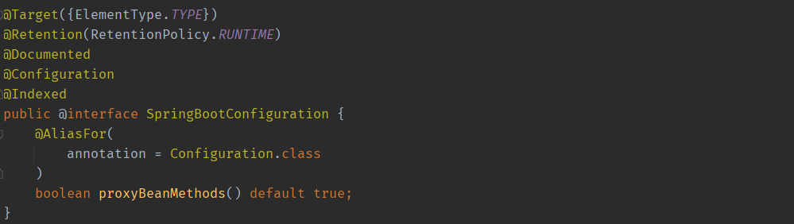
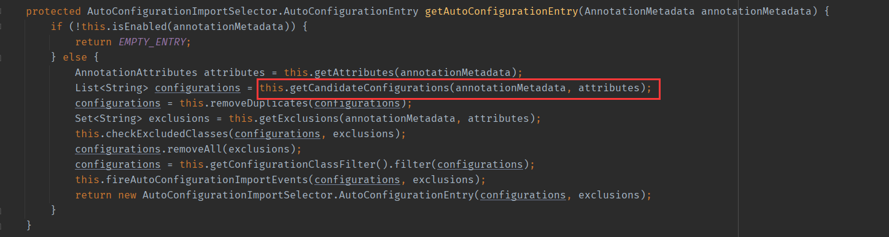

SpringBoot

## SpringBoot 起步

### SpringBoot 简介

1. [SpringBoot官网](https://spring.io/projects/spring-boot)
2. SpringBoot是一个微服务框架，SpringBoot使用“约定大于配置”的理念。SpringBoot其设计目的是用来简化Spring应用的创建、运行、调试、部署等，使用Spring Boot可以做到专注于Spring应用的开发。
3. Spring Boot是开发者和Spring 本身框架的中间层，帮助开发者统筹管理应用的配置，提供基于实际开发中常见配置的默认处理（即约定大于配置），简化应用的开发，简化应用的运维。
4. 总的来说，其目的SpringBoot就是为了对JavaWEB的开发进行“简化”和加“快”速度，简化开发过程中引入或启动相关Spring 功能的配置。这样带来的好处就是降低开发人员对于框架的关注点，可以把更多的精力放在自己的业务代码上。

### SpringBoot 特点

1.  可独立运行的Spring项目：SpringBoot可以以jar包的形式独立运行。
2. 内嵌的Servlet容器：SpringBoot可以选择内嵌Tomcat、Jetty或者Undertow，无须以war包形式部署项目。
3. 简化的Maven配置：Spring提供推荐的基础 POM 文件来简化Maven 配置。
4. 自动配置Spring：SpringBoot会根据项目依赖来自动配置Spring 框架，极大地减少项目要使用的配置。
5. 提供生产就绪型功能：提供可以直接在生产环境中使用的功能，如性能指标、应用信息和应用健康检查。
6. 无代码生成和xml配置：SpringBoot不生成代码。完全不需要任何xml配置即可实现Spring的所有配置。

### SpringBoot3 新特性

1. 最低要求 Java 17 和 Java 19 支持 。
   + Spring Boot 3.0 要求 Java 17 作为最低版本，Spring Boot 3.0 运行良好，并已通过 JDK 19 测试。
   + 如果你当前使用的是 Java 8 或 Java 11，则需要先升级 JDK，然后才能开发 Spring Boot 3.0 应用程序。
2. 支持用 GraalVM 生成原生镜像，取代了实验性的 Spring Native 项目。
3. 通过 Micrometer 和 Micrometer 跟踪改进可观察性。
4. 支持具有 EE 9 baseline 的 Jakarta EE 10
   + 对于所有依赖项，Spring Boot 3.0 已从 Java EE 迁移到 Jakarta EE api。


## SpringBoot 脚手架

### 什么是脚手架

1. 脚手架是一种用在建筑领域的辅助工具，或者说是为了保证各施工过程顺利进行而搭设的工作平台，有兴趣的读者可自行查看维基百科上的定义。
2. 对应到软件工程领域，脚手架可以解释为帮助开发人员在开发过程中使用的开发工具、开发框架，使用脚手架你无须从头开始搭建或者编写底层软件。
3. 脚手架是一种元编程的方法，程序员编写一份规格说明书（Specification），用来描述怎样去使用数据库，然后由编译器脚手架根据这份规格说明书生成相应的代码，进行增、删、改、查等数据库的操作，在脚手架上更高效地建造出强大的应用。（本段话来自于Stack Overflow）

### SpringBoot 默认脚手架

1. [SpringBoot 默认脚手架地址](https://start.spring.io/)：https://start.spring.io/

### 阿里云脚手架

1. [阿里云脚手架地址](https://start.aliyun.com/)：https://start.aliyun.com/

### 创建SpringBoot 项目

1. 两种方式
   + 通过WEB浏览器端创建项目，将配置好的项目下载到本地，再通过IDEA导入进行开发。
   + 直接使用IDEA提供的 spring initializr选项进行创建项目（常用）。
2. 创建SpringBoot项目注意点
   + 本套文档的案例代码使用SpringBoot3进行开发，请注意各个依赖项的版本兼容问题。
   + 使用IDEA创建项目，是可以手动选择使用SpringBoot 默认脚手架（IDEA默认）还是阿里云脚手架。

## SpringBoot 初体验

### SpringBoot 入门案例

1. 案例要求

   + 浏览器输入：http://localhost:8080/time， 服务端会响应给浏览器当前时间。

2. 定义控制器（需要用到SpringMVC知识）

   ```java
   @Controller
   public class TimeController {
       @GetMapping("/time")
       public String getCurrentTime() {
           return new SimpleDateFormat("yyyy-MM-dd hh:mm:ss").format(new Date());
       }
   }
   ```

3. 运行main方法（Application类的main方法）

   ```java
   @SpringBootApplication
   public class Application {
       public static void main(String[] args) {
           SpringApplication.run(Application.class, args);
       }
   }
   ```

4. 观察控制台，查看日志信息！

   

   

### SpringBoot 项目结构

1. SpringBoot 默认项目结构

   + 可以删除文件/文件夹

     +  HELP.md文件、mvnw文件、mvnw.cmd文件、.mvn文件夹 可以删除。
     + 也可以在IDEA中通过设置来屏蔽不显示这些文件夹。

   + 引入spring-boot-starter-web依赖，IDEA就会默认生成的文件夹

     + static 文件夹 
     + templates 文件夹

     ```bat
     │  .gitignore
     │  HELP.md(可以删掉)
     │  mvnw(可以删掉)
     │  mvnw.cmd(可以删掉)
     │  pom.xml
     │  springboot01-start.iml
     │  
     ├─.mvn(可以删掉)
     │  └─wrapper
     │          maven-wrapper.jar
     │          maven-wrapper.properties
     │
     └─src
         ├─main
         │  ├─java
         │  │  └─com
         │  │      └─ilovesshan
         │  │              Springboot01StartApplication.java(入口类)
         │  │
         │  └─resources
         │      │  application.properties(配置文件)
         │      │
         │      ├─static (静态资源)
         │      └─templates(模板文件)
         └─test
             └─java
                 └─com
                     └─ilovesshan
                             Springboot01StartApplicationTests.java（单元测试类）
     
     ```

2. SpringBoot 单一项目结构

   + 适用于项目功能模块比较少的场景。

   ```bat
   │  .gitignore
   │  HELP.md
   │  mvnw
   │  mvnw.cmd
   │  pom.xml
   │  springboot02-project-structure-single.iml
   │  
   ├─.mvn
   │  └─wrapper
   │          maven-wrapper.jar
   │          maven-wrapper.properties
   │          
   └─src
       ├─main
       │  ├─java
       │  │  └─com
       │  │      └─ilovesshan
       │  │          └─application
       │  │              │  Application.java
       │  │              │  
       │  │              ├─controller
       │  │              │      OrderController.java
       │  │              │      UserController.java
       │  │              │      
       │  │              ├─mapper
       │  │              │      OrderMapper.java
       │  │              │      UserMapper.java
       │  │              │      
       │  │              ├─model
       │  │              │      Order.java
       │  │              │      User.java
       │  │              │
       │  │              └─service
       │  │                  │  OrderService.java
       │  │                  │  UserService.java
       │  │                  │
       │  │                  └─impl
       │  │                          OrderServiceImpl.java
       │  │                          UserServiceImpl.java
       │  │
       │  └─resources
       │      │  application.properties
       │      │
       │      ├─static
       │      └─templates
       └─test
           └─java
               └─com
                   └─ilovesshan
                       └─application
                               ApplicationTests.java
   ```

   

3. SpringBoot 复杂项目结构

   + 适用于项目功能模块比较多、比较复杂的场景。

   ```bat
   │  .gitignore
   │  HELP.md
   │  mvnw
   │  mvnw.cmd
   │  pom.xml
   │  springboot03-project-structure-multiple.iml
   │  
   ├─.mvn
   │  └─wrapper
   │          maven-wrapper.jar
       │  │              │  ├─mapper
       │  │              │  ├─model
       │  │              │  └─service
       │  │              │      └─impl
       │  │              └─user
       │  │                  ├─controller
       │  │                  ├─impl
       │  │                  ├─mapper
       │  │                  └─model
       │  └─resources
       │      │  application.properties
       │      │
       │      ├─static
       │      └─templates
       └─test
           └─java
               └─com
                   └─ilovesshan
                       └─application
                               ApplicationTests.java
   ```


### SpringBoot starter 启动器

1. 先看一下项目默认的pom.xml文件

   ```xml
   <?xml version="1.0" encoding="UTF-8"?>
   <project xmlns="http://maven.apache.org/POM/4.0.0" xmlns:xsi="http://www.w3.org/2001/XMLSchema-instance"
            xsi:schemaLocation="http://maven.apache.org/POM/4.0.0 https://maven.apache.org/xsd/maven-4.0.0.xsd">
       <modelVersion>4.0.0</modelVersion>
   
       <!-- 父模块依赖 -->
       <parent>
           <groupId>org.springframework.boot</groupId>
           <artifactId>spring-boot-starter-parent</artifactId>
           <version>3.0.5</version>
           <relativePath/>
       </parent>
   
       <!-- 当前项目信息 -->
       <groupId>com.ilovesshan</groupId>
       <artifactId>springboot01-start</artifactId>
       <version>0.0.1-SNAPSHOT</version>
       <name>springboot01-start</name>
       <description>springboot01-start</description>
   
       <!-- JDK版本 -->
       <properties>
           <java.version>17</java.version>
       </properties>
   
       <!-- 项目依赖 -->
       <dependencies>
   
           <!-- WEB项目依赖 -->
           <dependency>
               <groupId>org.springframework.boot</groupId>
               <artifactId>spring-boot-starter-web</artifactId>
           </dependency>
   
           <!-- lombok -->
           <dependency>
               <groupId>org.projectlombok</groupId>
               <artifactId>lombok</artifactId>
               <optional>true</optional>
           </dependency>
   
           <!-- 单元测试 -->
           <dependency>
               <groupId>org.springframework.boot</groupId>
               <artifactId>spring-boot-starter-test</artifactId>
               <scope>test</scope>
           </dependency>
       </dependencies>
   
       <build>
           <plugins>
               <!-- maven对SpringBoot支持的插件-->
               <plugin>
                   <groupId>org.springframework.boot</groupId>
                   <artifactId>spring-boot-maven-plugin</artifactId>
                   <configuration>
                       <excludes>
                           <exclude>
                               <groupId>org.projectlombok</groupId>
                               <artifactId>lombok</artifactId>
                           </exclude>
                       </excludes>
                   </configuration>
               </plugin>
           </plugins>
       </build>
   </project>
   
   ```

2. starter 启动器分类

   + spring-boot-starter-xxx，这是Spring官方提供的依赖。
   + xxx-starter，这是一些三方组织提供的依赖。

### SpringBoot 父项目

1. 回到pom.xml中，观察 \<parent> 标签

   ```xml
   <parent>
       <groupId>org.springframework.boot</groupId>
       <artifactId>spring-boot-starter-parent</artifactId>
       <version>3.0.5</version>
       <relativePath/>
   </parent>
   ```

   

2. 不妨按住ctrl键，用鼠标点到spring-boot-starter-parent中去看看，里面配置项比较多，下面浅析总结一下

   + spring-boot-starter-parent的parent是spring-boot-dependencies

   + 依赖版本管理
   + 属性配置
   + 资源过滤
   + 插件配置

3. 再进到 spring-boot-dependencies中，浅析总结一下

   + 定义了很多依赖的版本号，注意这些依赖的版本号SpringBoot已经测试过了，表示这些版本在一起使用不会出现兼容问题，开发程序员可以大胆使用。
   + 通过\<dependencyManagement> 标签定义了很多依赖项，我们要是有的话，通过maven的依赖传递特性直接使用就好了，依赖也有版本号也定义好了！

4. 关系整理

   + 开发工程中的pom.xml 继承了 spring-boot-starter-parent
   +  spring-boot-starter-parent  继承了 spring-boot-dependencies

### SpringBoot 启动类剖析 

1. SpringBoot  核心注解

   ```java
   @SpringBootApplication
   public class Application {
       public static void main(String[] args) {
           SpringApplication.run(Application.class, args);
       }
   }
   ```

   

   + @SpringBootApplication是一个复合注解，也是SpringBoot项目的核心注解，被@SpringBootApplication注解标识的类可以称之为SpringBoot项目的启动类。

   + @SpringBootApplication注解又被三个注解所标识，分别是： 

     + @SpringBootConfiguration

       + 注解作用：标识当前类是一个配置类，可以配合@Bean注解自定义Bena对象并实例化到IOC容器中。

     + @EnableAutoConfiguration

       + 注解作用：启用自动配置，帮助SpringBoot应用将所有符合条件的@Configuration配置，可以是将项目中的Bean对象也可以是第三方的Bean对象自动实例化到并放入到IOC容器中。

     + @ComponentScan

       + 开启组件扫描功能

       + 注意点，组件扫描功能规则是：只扫描启动类所在的包或者子包（启动类所在的包我们一般称之为根包），根包之外的类SpringBoot不会自动扫描。

         + 符合规则

           ```bat
           ├─src
           │  ├─main
           │  │  ├─java
           │  │  │  └─com
           │  │  │      └─ilovesshan
           │  │  │          └─pk01
           │  │  │              │  Application.java(入口类)
           │  │  │              │
           │  │  │              └─controller
           │  │  │                      TimeController.java
           ```

           

         + 不符合规则

           ```bat
           ├─src
           │  ├─main
           │  │  ├─java
           │  │  │  └─com
           │  │  │      └─ilovesshan
           │  │  │          ├─pk01
           │  │  │          │      Application.java(入口类)
           │  │  │          │
           │  │  │          └─pk02
           │  │  │              └─controller
           │  │  │                      TimeController.java
           ```

   

2. SpringApplication.run 方法

   + run 方法 分析

     ```java
     // run方法会返回一个ConfigurableApplicationContext对象，这个对象就是Spring的IOC容器。
     // run一个重载方法，将primarySource可以作为一个数组传递，但是我们推荐SpringBoot项目仅有一个启动类。
     // primarySource 启动类的字节码
     // args 传递给JVM的参数信息
     public static ConfigurableApplicationContext run(Class<?> primarySource, String... args) {
         return run(new Class[]{primarySource}, args);
     }
     
     // run 重载方法
     public static ConfigurableApplicationContext run(Class<?>[] primarySources, String[] args) {
         return (new SpringApplication(primarySources)).run(args);
     }
     ```

   + 测试启动类的复合注解，自定义Bean对象并获取

     ```java
     @SpringBootApplication
     public class Application {
     
         @Bean(name = "date")
         public Date getDate() {
             return new Date();
         }
     
         public static void main(String[] args) {
             // applicationContext IOC容器
             ApplicationContext applicationContext = SpringApplication.run(Application.class, args);
     
             // 从IOC容器中获取Bean实例
             Date bean = applicationContext.getBean("date", Date.class);
             System.out.println("bean = " + bean); // bean = Tue Apr 04 08:57:44 CST 2023
         }
     }
     ```

     在Controller中通过依赖注入方式获取Bean对象

     ```java
     @RestController
     public class TimeController {
     
         @Resource
         private Date date;
     
         @GetMapping("/time")
         public String getCurrentTime() {
             return new SimpleDateFormat("yyyy-MM-dd hh:mm:ss").format(date);
         }
     }
     ```

   

### SpringBoot  运行三种方式

1. 通过IDEA工具进行运行（普通运行和debug运行、开发中一般采用debug方便调试）

   

2. 通过Maven插件 方式运行，首次运行会有点慢，因为要下载一些依赖。

   ```mvn
   mvn spring-boot:run
   ```

   

3. 通过 java -jar xxx.jar 方式运行，这种方式得需要现有一个SpringBoot项目得jar包。

   + 通过Maven打包该项目得到：springboot-start.jar 文件

     ```java
     // 这个表示测试失败导致的打包失败，解决方法就是跳过test打包。
     
     There are test failures.
         
     Please refer to E:\workspace\java\springBoot\code\springboot\springboot01-start\target\surefire-reports for the individual test results.
     Please refer to dump files (if any exist) [date].dump, [date]-jvmRun[N].dump and [date].dumpstream.
     ```

   + 运行 springboot-start.jar 文件

     ```bat
     java -jar .\springboot-start.jar
     ```

   

### SpringBoot jar包和普通jar包区别

​		Spring Boot 中默认打包成的 jar 叫做 可执行 jar，这种 jar 不同于普通的 jar，普通的 jar 不可以通过 java -jar xxx.jar 命令执行，普通的 jar 主要是被其他应用依赖，Spring Boot 打成的 jar 可以执行，但是不可以被其他的应用所依赖，即使强制依赖，也无法获取里边的类。但是可执行 jar 并不是 Spring Boot 独有的，Java 工程本身就可以打包成可执行 jar 。


## SpringBoot 配置文件

### SpringBoot 配置文件介绍

1. 当我们构建完Spring Boot项目后，会在resources目录下给我们一个默认的全局配置文件 application.properties，这是一个空文件，因为Spring Boot在底层已经把配置都给我们自动配置好了，当在配置文件进行配置时，会修改SpringBoot自动配置的默认值。

2. 配置文件名是固定的application.properties， 但是我们可以修改成application.yml，这两个文件本质是一样的，区别只是其中的语法略微不同

3. 项目中application.properties和application.yml同时存在情况下，优先使用application.properties，但是在实际开发中我们更青睐于application.yml文件，因为yml文件格式采用扁平化风格书写易于阅读。

4. 配置文件的路径和名都是可以改变的，但是不推荐改变，因为在SpringBoot中我们都遵循“约定大于配置”！，配置文件可以存放的路径

   + 项目根目录下
   + 项目根目录/config
   + resurces目录下
   + resurces/config目录下

5. properties 文件语法：key=value

   ```properties
   port=1001
   app.name=springboot-project
   ```

6. yml 文件语法：key:[空格]值

   ```yaml
   port: 1001
   app:
     name: springboot-project
   ```

   

### properties 文件

1. properties 文件注意事项

   + properties 文件中不会转义字符串里面的特殊字符。

2. properties 文件中各种数据类型的写法

   + 数字、字符串、布尔值

     ```properties
     port=1001
     app.name=springboot-project
     ```

     

   + 对象、Map（属性和值）（键值对）

     ```properties
     user.username=ilovesshan
     user.age=18
     user.address=四川巴中
     ```

     

   +  数组（List、Set）

     ```properties
     user.hobby[0]=running
     user.hobby[1]=read
     user.hobby[2]=code
     ```

     

### yml 文件

1. yml 文件注意事项

   + 注意空格

2. yml  文件中各种数据类型的写法

   + 数字、字符串、布尔值

     ```yaml
     port: 1001
     app:
       name: springboot-project
     ```

     

   + 对象、Map（属性和值）（键值对）

     ```yaml
     user:
       username: ilovesshan
       age: 18
       address: 四川巴中
     ```

     

   + 数组（List、Set）

     ```yaml
     student:
       hobby:
         - running
         - read
         - code
     ```

### 读取配置文件信息

1. springboot获取配置资源，主要分3种方式：@Value、 @ConfigurationProperties、Enviroment对象直接调用。

   + @Value、 @ConfigurationProperties底层实现原理，都是通过Enviroment对象方式实现的。
   + @Value 注入时、如果没找到对应的key并且也没有默认值，会报错！
   +  @ConfigurationProperties和Enviroment如果没获取到值就是null！

2. 通过@Value读取

   + 通过@Value("${key:默认值}")

     ```java
     @Value("${port}")
     private int port;
     
     @Value("${app.name}")
     private String name;
     
     @Value("${app.version: 0.0.1}")
     private String version;
     ```

     

3. 通过@ConfigurationProperties读取（后面详解）

   + 读取Map

     ```java
     @Configuration("user")
     @ConfigurationProperties(prefix = "user")
     public class User {
         private String username;
         private int age;
         private String address;
         
         // 省略了getter和setter...
     }
     ```

     ```java
     @Resource(name = "user")
     private User user;
     ```

     

   + 读取List

     ```java
     @Configuration("student")
     @ConfigurationProperties(prefix = "student")
     public class Student {
         private List<String> hobby;
         // 省略了getter和setter...
     }
     ```

     ```java
     @Resource(name = "student")
     private Student student;
     ```

     

4. 通过Environment对象直接调用

   + Environment对象是多个·配置文件组合的对象，也就是从这个对象中可以读取项目配置文件中的信息、系统环境信息等等，使用Environment对象，需要先注入到IOC容器中。

   + 读取配置文件信息

     ```java
     @SpringBootTest
     class EnvironmentTest {
     
         @Resource
         private Environment environment;
     
         @Test
         void testEnvironment() {
             // 读不到就是null
             String name = environment.getProperty("app.name");
             String username = environment.getProperty("user.username");
     
             // 读不到就使用默认值
             Integer port = environment.getProperty("port", int.class, 8080);
         }
     }
     ```

   + 读取系统环境变量信息

     ```java
     @SpringBootTest
     class EnvironmentTest {
         @Resource
         private Environment environment;
     
         @Test
         void testEnvironmentWithSystem() {
             // Key名称 不区分大小写
             String userdomainRoamingprofile = environment.getProperty("userdomain_roamingprofile");
             String processorLevel = environment.getProperty("PROCESSOR_LEVEL");
             String javaHome = environment.getProperty("JAVA_HOME");
         }
     }
     ```


### 读取指定配置文件信息

1. 读取指定配置文件信息可以通过@PropertySource(value = "classpath:xxx.yml") 读取指定的配置文件。

   + temp.yml

     ```yaml
     name: ilovesshan
     age: 20
     ```

   + 读取配置文件

     ```java
     @Configuration(proxyBeanMethods = false)
     @PropertySource(value = "classpath:temp.yml")
     public class TempData {
         @Value("${name}")
         private String name;
     
         @Value("${age}")
         private int age;
     
         public void print() {
             System.out.println("name = " + name + ", age = " + age);
         }
     }
     ```

     

   

### 绑定 Bean

1. 简单属性绑定

   + @Configuration，标识该类是一个配置类。
     + proxyBeanMethods = false， 表示该类是一个普通的JavaBean对象
     + proxyBeanMethods = true（默认）， 表示该类是一个非普通的JavaBean对象，底层对该对象进行了一层代理。
   + @ConfigurationProperties
     + prefix = "xxx"，配置文件中多个属性的公共前缀。
   + 进行属性绑定时，请保证Bena的属性名（按规范生成getter和setter）和配置文件的属性名称保持一致，否则可能会赋值失败！

   ```yaml
   app:
   version: 1.0.0
   devGroup: ilovesshan
   describe: 网捷回收【1.0.0】 版本正式发布啦!
   ```

   ```java
   @Data
   @Configuration(proxyBeanMethods = false)
   @ConfigurationProperties(prefix = "app")
   public class AppBean {
       private String version;
       private String devGroup;
       private String describe;
   }
   ```

   

2. 嵌套Bean

   ```yaml
   app:
     version: 1.0.0
     devGroup: ilovesshan
     describe: 网捷回收【1.0.0】 版本正式发布啦!
     responsiblePerson:
       username: ilovesshan
       github: https://github.com/ilovesshan/wjhs
   ```

   ```java
   @Data
   public class ResponsiblePerson {
       private String username;
       private String github;
   }
   ```

   ```java
   @Data
   @Configuration(proxyBeanMethods = false)
   @ConfigurationProperties(prefix = "app")
   public class AppBean {
       private String version;
       private String devGroup;
       private String describe;
       private  ResponsiblePerson responsiblePerson;
   }
   ```

   

3. 扫描注解

   + 配置扫描@ConfigurationProperties注解的注解，配置了扫描注解之后，就可以省略@Configuration了！

   + 配置扫描注解有两种方式

     + 添加EnableConfigurationProperties注解，并传递Bean的Clazz信息，一般将该注解放在启动类上。

       ```java
       @EnableConfigurationProperties({AppBean.class})
       @SpringBootApplication
       public class Application {
           // ...
       }
       ```

       

     + 添加@ConfigurationPropertiesScan注解，通过配置指定包，来扫描@ConfigurationProperties注解

       ```java
       @ConfigurationPropertiesScan("com.ilovesshan.bean")
       @SpringBootApplication
       public class Application {
           // ...
       }
       ```

       

4. 绑定第三方Bean

   + 上面案例中我们都是绑定自定义的Bean，我们可以将@ConfigurationProperties注解直接加在源文件上。

   + 如果选择要绑定第三方Bean对象，我们看不到源文件怎么办？？

     + 可以通过@Bean + @ConfigurationProperties方式。
     + @Bean + @ConfigurationProperties注解都放在方法上。

   + 代码演示，如何绑定第三方Bean

     + 假设这是一个第三方的Bean

       ```java
       @Data
       public class YfDataSources {
           private String driver;
           private String username;
           private String password;
       }
       ```

     ```yaml
     data-sources:
       driver: jdbc:mysql://localhost:8080/db
       username: username
       password: username123
     ```

     ```java
     @Configuration
     public class YfBeanService {
         @Bean
         @ConfigurationProperties(prefix = "data-sources")
         public YfDataSources getYfDataSources() {
             return new YfDataSources();
         }
     }
     ```

5. List/Map/Array类型数据绑定

   ```java
   @Data
   public class Friend {
       private String username;
       private String gender;
   }
   ```

   ```java
   @Data
   @Configuration(value = "multipleData", proxyBeanMethods = false)
   @ConfigurationProperties(prefix = "multiple")
   public class MultipleData {
       private String[] names;
       private List<Friend> friendList;
       private Map<String, Friend> friendMap;
   }
   ```

   ```yaml
   multiple:
     # String[] names 定义Array类型, 每个值通过 -[空格] 进行分割
     names:
       - jack
       - tom
       - lucy
   
     # List<Friend> friendList 定义List类型
     friendList:
       - username: jack
         gender: 男
       - username: tom
         gender: 男
       - username: lucy
         gender: 女
   
     # Map<String,Student> friendMap 定义类型
     friendMap:
       f1:
         username: jack
         gender: 男
       f2:
         username: tom
         gender: 男
       f3:
         username: lucy
         gender: 女
   ```


### 创建Bena的三种方式

1. 通过 @Bean + @Configuration 注解

2. 通过 @Component、@Controller、@Service、@Repository注解

3. 通过xml配置\<bean> 标签（不推荐），如果有需求怎么实现呢？可以通过@ImportResource(locations = "classpath:/xxx.xml")方式导入指定的配置文件。

   + User 

     ```java
     @Data
     public class User {
         private String uname;
         private String pwd;
     }
     ```

     

   + user.xml

     ```xml
     <bean id="user" class="com.ilovesshan.bean.User">
         <property name="uname" value="ilovesshan"/>
         <property name="pwd" value="ilovesshan123"/>
     </bean>
     ```

     

   + 测试

     ```java
     @ImportResource(locations = "classpath:/user.xml")
     class UserService {
         @Resource
         private User user;
     }
     ```

     

### 多文件配置

1. 大型项目中，如果将所有的配置信息全部都放在application.yml中，那势必会将application.yml撑的很大，对于一些配置文件我们应该按模块单独进行抽离，例如redis、mysql配置文件等等等...，只需要在application.yml中导入这些文件即可！

2. 配置文件抽离

   + redis.yml

     ```yaml
     redis:
       host: 1270.0.1
       port: 6379
     ```

     

   + mysql.yml

     ```yaml
     mysql:
       driver: jdbc:mysql://localhost:3306/db
       username: admin
       password: 123465
     ```

     

   

3. 配日文件导入

   ```yaml
   # 导入配置文件, 多个配置文件使用 , 进行分割 
   spring:
     config:
       import: conf/redis.yml, conf/mysql.yml
   ```

   

4. 读取导入的配置文件

   ```java
   @Value("${redis.host}")
   private String redisHost;
   @Value("${redis.port}")
   private int redisPort;
   
   @Value("${mysql.driver}")
   private String mysqlDriver;
   ```

   

### 多环境配置

1. 什么是多环境？

   + 在开发过程中一般将环境会划分成多种，每个环境的配置信息都有可能不同，目的是在不同环境中运行保证程序的稳定性和可靠性，例如开发环境可能是一套配置文件、测试环境也是一套配置文件、线上环境又是另一套配置文件。
   + SpringBoot支持多环境配置，关于多环境配置文件命名有个约定
     + 开发 dev
     + 测试 test
     + 线上 prod
     + 新特性 feature

2. SpringBoot项目中定义多环境，直接在resources文件夹下新建这些文件即可!

   + application-dev.yml

     ```yaml
     spring:
       application:
         name: 开发环境
     
       config:
         activate:
           # 定义环境名称, 推荐环境名称和该文件名称application-xxx保持一致(方便阅读)
           on-profile: dev
     ```

     

   + application-test.yml

     ```yaml
     spring:
       application:
         name: 测试环境
     
       config:
         activate:
           # 定义环境名称, 推荐环境名称和该文件名称application-xxx保持一致(方便阅读)
           on-profile: test
     ```

     

   + application-prod.yml

     ```yaml
     spring:
       application:
         name: 线上环境
         
       config:
         activate:
           # 定义环境名称, 推荐环境名称和该文件名?
     ```

     

3. 在application.yml中激活某个环境

   ```yaml
   spring:
     config:
     	# 指定激活的环境名称(线上环境)
     	profiles:
         active: prod
   ```

4. 测试获取当前环境变量信息

   

   ```java
   @SpringBootTest
   public class ProfilesTest {
   
       @Value("${spring.application.name}")
       private String name;
   
       @Test
       void testProfile() {
           System.out.println("name = " + name); // name = 线上环境
       }
   }
   ```


## SpringBoot AOP

### AOP 概念

相关AOP概念可以参考 [Spring AOP](https://ilovesshan.github.io/pages/backend/spring.html#spring-aop) ，里面介绍的非常详细！！

### 业务方法日志记录

1. SpringBoot 项目中使用 AOP需要先导入依赖

   + spring-boot-starter-aop 中包含了 spring-aop 和 aspectj的依赖

   ```xml
   <dependency>
       <groupId>org.springframework.boot</groupId>
       <artifactId>spring-boot-starter-aop</artifactId>
   </dependency>
   ```

2. 编写业务代码

   ```java
   public interface UserService {
       void deleteUser(String userId);
       void updateUser(String userId, String username);
   }
   ```

   ```java
   @Service
   public class UserServiceImpl implements UserService {
       @Override
       public void deleteUser(String userId) {
           System.out.println("删除用户...");
       }
   
       @Override
       public void updateUser(String userId, String username) {
           System.out.println("更新用户...");
       }
   }
   ```

   

3. 定义切面

   ```java
   @Component
   @Aspect
   public class LogAspect {
       // 前置通知
       @Before("execution(* com.example.spring06aop.service..*.*(..))")
       public void beforeAdvice(JoinPoint joinPoint) {
           String methodName = joinPoint.getSignature().getName();
           Object[] methodArgs = joinPoint.getArgs();
           System.out.println("==============" + methodName + ", " + Arrays.toString(methodArgs) + "==============");
       }
   }
   ```

   

4. 单元测试

   ```java
   @SpringBootTest
   class ApplicationTests {
   
       @Resource
       private UserService userService;
   
       @Test
       void contextLoads() {
           userService.deleteUser("1");
           userService.updateUser("1", "jack");
       }
   }
   ```


## SpringBoot 自动配置解析

### SpringBoot 自动配置概念

1. 先聊以下SpringBoot 自动配置是啥意思，再进行代码分析，后面可能会茅塞顿开。
2. SpringBoot 自动配置概念
   + 在SpringBoot项目启动阶段，SpringBoot会尝试去加载项目中所需要的默认的Bean，具体是通过读取这些Bean的属性/注解信息然后尝试去项目的配置文件中加载所需的数据资源，从而完成自动配置功能。

### 三个核心注解介绍

1. 搭建SpringBoot环境的时候，有没有觉得非常简单。无须各种的配置文件，无须各种繁杂的pom坐标，一个main方法，就能run起来了。与其他框架整合也贼方便，使用一些注解就可以搞起来了，下面聊聊SpringBoot是如何实现自动配置的~

   

2. 先看入口类的main方法，有一个@SpringBootApplication注解，不用多想这个注解肯定干了很多活！！

   

   

3. 进入到@SpringBootApplication注解中，有三个核心注解。

   + @SpringBootConfiguration
   + @EnableAutoConfiguration
   + @ComponentScan

   

   

4. 经源码观察，我们可以理解成启动函数是这样的，@SpringBootApplication是一个复合注解！！

   ```java
   @SpringBootConfiguration
   @EnableAutoConfiguration
   @ComponentScan(
       excludeFilters = {@ComponentScan.Filter(
           type = FilterType.CUSTOM,
           classes = {TypeExcludeFilter.class}
       ), @ComponentScan.Filter(
           type = FilterType.CUSTOM,
           classes = {AutoConfigurationExcludeFilter.class}
       )}
   )
   public class Application {
   
       public static void main(String[] args) {
           SpringApplication.run(Application.class, args);
       }
   
   }
   ```


### @SpringBootConfiguration

1. 进入到SpringBootConfiguration注解中

   

2. 会发现，这个注解又被@Configuration注解所标识，说白了就是被@SpringBootConfiguration标识的类支持以JavaConfig的方式进行配置，使用Configuration配置类等同于XML配置。

   

### @ComponentScan

1. @ComponentScan注解应该不陌生，我们学习Spring的时候会经常使用到。

2. @ComponentScan主要是进行注解扫描（@Component、@Controller、@Service、@Repository），默认扫描当前类下的包。

   

### @EnableAutoConfiguration

1. @EnableAutoConfiguration（开启自动配置），SpringBoot中遵循“约定大于配置”，那么是怎么做到的呢？其实就是靠这个注解来实现的，简单来说，这个注解可以帮我们载入系统中所需要的所有的默认配置！

   

2. 进入到@EnableAutoConfiguration注解中，有两个重要的注解

   + @AutoConfigurationPackage，自动配置包（ 添加该注解的类所在的package作为自动配置package进行管理）。
   + @Import({AutoConfigurationImportSelector.class})，给IOC容器导入组件

   

   

3. 看一下@AutoConfigurationPackage注解信息，其实还是使用了@Import注解，可见@Import注解应该很重要！！

   + 

   

   + 进到Register.class中就是以下代码，主要观察registerBeanDefinitions方法。

     ```java
     static class Registrar implements ImportBeanDefinitionRegistrar, DeterminableImports {
         Registrar() {
         }
     
         public void registerBeanDefinitions(AnnotationMetadata metadata, BeanDefinitionRegistry registry) {
             AutoConfigurationPackages.register(registry, (String[])(new AutoConfigurationPackages.PackageImports(metadata)).getPackageNames().toArray(new String[0]));
         }
     
         public Set<Object> determineImports(AnnotationMetadata metadata) {
             return Collections.singleton(new AutoConfigurationPackages.PackageImports(metadata));
         }
     }
     ```

     

   + 打断点调试一下，可以得到结论：SpringBoot项目启动时，默认扫描启动类所在包及其子包里边的组件扫描到Spring容器中。

     

     

   + 看完这里，有没有发现@AutoConfigurationPackage和@ComponentScan的功能好像有点像？？都是扫描组件并且添加到IOC容器中？？

     + 其实这二者扫描的对象是不一样的。

     + `@Controller/@Service/@Component/@Repository`这些注解是由`ComponentScan`来扫描并加载的。

     + 比如说，你用了Spring Data JPA，可能会在实体类上写`@Entity`注解。这个`@Entity`注解由`@AutoConfigurationPackage`扫描并加载。

       

4. 回到@Import注解中，那就先回到@EnableAutoConfiguration注解中。

   + 进入到AutoConfigurationImportSelector.class类中，找到getAutoConfigurationEntry方法。

     

     

   + 进入到getCandidateConfigurations方法中。

     

     

   + 从Assert描述信息得知，load方法好像是在加载什么文件，为了一探究竟那就进入到load方法。

     

     

   + 从项目jar包寻找和`"META-INF/spring/%s.imports"`路径相关的文件，在org.springframework.boot.autoconfigure包下面，这是SpringBoot的包。

     

     

   + 可以发现 org.springframework.boot.autoconfigure.AutoConfiguration.imports文件中存放了大量配置类，也就是SpringBoot启动时回去尝试加载这些类（SpringBoot3.0.5版本是142个类），再根据配置类中的信息尝试去项目配置文件中加载配置信息，换句话说就时我们不用手动来配置这些类了，仅仅提供一些配置数据源就ok了！

     

   + 可以浅析分析一下org.springframework.boot.autoconfigure.jdbc.DataSourceAutoConfiguration配置类。

     + 根据该路径找到DataSourceAutoConfiguration这个类

       

       

     + 观察一下@ConditionalOnClass({DataSource.class, EmbeddedDatabaseType.class})注解

       + 这个注解通俗的说就是SpringBoot工程中引用了DataSource相关的包 才会构建这个bean。
       
     + 还记得@EnableConfigurationProperties()注解吗？如果忘记了请看[绑定Bena章节](https://ilovesshan.github.io/pages/backend/springBoot.html#%E7%BB%91%E5%AE%9A-bean)。
     
       + @EnableConfigurationProperties意思是：将使用了@ConfigurationProperties注解的类进行属性绑定呗！！
     
       + @EnableConfigurationProperties({DataSourceProperties.class})注解含义就是对DataSourceProperties类中的属性进行绑定呗，进入到DataSourceProperties中。
     
         
     
       + 看到这个注解和类中属性吗，是不是就豁然开朗了？？，我们直接在配置文件中配置以`spring.datasource` 作为前缀配置相关属性就ok啦！！！！
     
     

## SpringBoot 集成 JdbcTemplate

### JdbcTemplate介绍

1. 相信JdbcTemplate肯定不陌生了吧，学习Spring的时候学习过，忘记了的话可以参考[JdbcTemplate 模板](https://ilovesshan.github.io/pages/backend/spring.html#jdbctemplate-%E6%A8%A1%E6%9D%BF)章节。

### 准备数据库资源

1. book（图书表）

   ```sql
   drop table if exists `book`;
   create table `book`  (
       `id` int(11) not null auto_increment,
       `type` varchar(20) character set utf8 collate utf8_general_ci null default null,
       `name` varchar(50) character set utf8 collate utf8_general_ci null default null,
       `description` varchar(255) character set utf8 collate utf8_general_ci null default null,
       primary key (`id`) using btree
   ) engine = innodb auto_increment = 13 character set = utf8 collate = utf8_general_ci row_format = dynamic;
   ```

   ```sql
    insert into `book` values (1, 'java', 'spring实战 第5版', 'spring入门经典教程，深入理解spring原理技术内幕');
    insert into `book` values (2, 'java', 'spring 5核心原理与30个类手写实战', '十年沉淀之作，手写spring精华思想');
    insert into `book` values (3, 'java', 'spring 5设计模式', '全方位解析面向web应用的轻量级框架，带你成为spring mvc开发高手');
    insert into `book` values (4, 'java', 'spring mvc+mybatis开发从入门到项目实战', '源码级剖析spring框架，适合已掌握java基础的读者');
    insert into `book` values (5, 'java', '轻量级java web企业应用实战', '源码级剖析spring框架，适合已掌握java基础的读者');
    insert into `book` values (6, 'java', 'java核心技术卷i基础知识(原书第11版)', 'core java第11版，jolt大奖获奖作品，针对java se9、10、11全面更新');
    insert into `book` values (7, 'java', '深入理解java虚拟机', '5个维度全面剖析jvm，大厂面试知识点全覆盖');
    insert into `book` values (8, 'java', 'java编程思想(第4版)', 'java学习必读经典,殿堂级著作!赢得了全球程序员的广泛赞誉');
    insert into `book` values (9, 'java', '零基础学java(全彩版)', '零基础自学编程的入门图书，由浅入深，详解java语言的编程思想和核心技术');
    insert into `book` values (10, '市场营销', '直播就该这么做:主播高效沟通实战指南', '李子染、李佳琦、薇娅成长为网红的秘密都在书中');
    insert into `book` values (11, '市场营销', '直播销讲实战—本通', '和秋叶—起学系列网络营销书籍');
    insert into `book` values (12, '市场营销', '直播带货:淘宝、天猫直播从新手到高手', '—本教你如何玩转直播的书，10堂课轻松实现带货月入3w+');
   
   ```

   

2. article（文章表）

   ```sql
   drop table if exists article;
   create table `article` (
       `id` bigint(20) unsigned not null auto_increment comment '文章表主键',
       `title` char(100) not null comment '标题',
       `author` varchar(15) not null comment '作者',
       `cid` tinyint(2) not null default '0' comment '分类id',
       `keywords` varchar(255) not null comment '关键字',
       `description` char(255) not null comment '文章描述',
       primary key (`id`)
   ) engine=innodb comment '文章表';
   ```

   ```sql
   insert into 
   	`spring-boot-db`.`article` (`id`, `title`, `author`, `cid`, `keywords`, `description`) 
   values 
   	(1, 'spring实战 第5版', 'jack', 1, 'spring', '十年沉淀之作，手写spring精华思想'),
   	(2, '市场营销', 'tom', 3, '市场营销', '和秋叶—起学系列网络营销书籍'),
   	(3, '零基础学java(全彩版)', 'lucy', 3, 'spring', '零基础自学编程的入门图书，由浅入深，详解java语言的编程思想和核心技术');
   ```

   

3. article_detail（文章详情表）

   ```sql
   drop table if exists article_detail;
   create table `article_detail` (
       `id` bigint(20) unsigned not null auto_increment,
       `aid` bigint(20) unsigned not null,
       `content` mediumtext not null comment '文章内容',
       `is_show` tinyint(1) not null default '1' comment '文章是否显示 1是 0否',
       `is_delete` tinyint(1) not null default '0' comment '是否删除 1是 0否',
       `is_top` tinyint(1) not null default '0' comment '是否置顶 1是 0否',
       `is_original` tinyint(1) not null default '1' comment '是否原创',
       `click` int(10) not null default '0' comment '点击数',
       `addtime` int(10) not null default '0' comment '添加时间',
       primary key (`id`)
   ) engine=innodb comment '文章详情表';
   ```

   ```sql
   insert into 
   	`spring-boot-db`.`article_detail` (`id`, `aid`, `content`, `is_show`, `is_delete`, `is_top`, `is_original`, `click`, `addtime`)
   values 
   	(1, 1, '十年沉淀之作，手写spring精华思想', 1, 0, 0, 1, 20, '2023-04-05 18:58:14'),
   	(2, 2, '和秋叶—起学系列网络营销书籍', 1, 0, 0, 1, 30, '2023-04-05 18:58:14'),
   	(3, 3, '零基础自学编程的入门图书，由浅入深，详解java语言的编程思想和核心技术', 1, 0, 1, 1, 100, '2023-04-05 18:58:14');
   
   ```


### 准备POJO对象

1. Book

   ```java
   @Data
   @NoArgsConstructor
   @AllArgsConstructor
   public class Book {
       private long id;
       private String type;
       private String name;
       private String description;
   }
   ```

   

2. Article

   ```java
   @Data
   @NoArgsConstructor
   @AllArgsConstructor
   public class Article {
       private long id;
       private String title;
       private String author;
       private long cid;
       private String keywords;
       private String description;
       private ArticleDetail detail;
   }
   ```

   

3. ArticleDetail

   ```java
   @Data
   @NoArgsConstructor
   @AllArgsConstructor
   public class ArticleDetail {
       private long id;
       private long aid;
       private String content;
       private long isShow;
       private long isDelete;
       private long isTop;
       private long isOriginal;
       private long click;
       private Date addtime;
   }
   ```

   

### JdbcTemplate 增删改查

1. 添加依赖（依赖可以在创建项目的时候进行按需要勾选）

   ```xml
   <dependency>
       <groupId>org.springframework.boot</groupId>
       <artifactId>spring-boot-starter-jdbc</artifactId>
   </dependency>
   
   <dependency>
       <groupId>com.mysql</groupId>
       <artifactId>mysql-connector-j</artifactId>
       <scope>runtime</scope>
   </dependency>
   
   <dependency>
       <groupId>org.projectlombok</groupId>
       <artifactId>lombok</artifactId>
   </dependency>
   ```

   

2. 配置数据源（使用yml格式，可以直接将默认生成的application.properties改成application.yml）。

   ```yaml
   spring:
     datasource:
       driver-class-name: com.mysql.cj.jdbc.Driver
       url: jdbc:mysql://localhost:3306/spring-boot-db
       username: root
       password: 123456
   ```

   

3. 注入JdbcTemplate模板，使用 @Resource注入进来就OK啦！

   ```java
   @SpringBootTest
   class ApplicationTests {
   
       @Resource
       private JdbcTemplate jdbcTemplate;
   }
   ```

4. 编写sql语句，通过JdbcTemplate对象执行对应sql语句

   + SQL语句就不编写了，可以参考[JdbcTemplate 执行SQL语句](https://ilovesshan.github.io/pages/backend/spring.html#%E6%93%8D%E4%BD%9C-dql%E8%AF%AD%E5%8F%A5)。


### JdbcTemplate 命名参数

1. 注意，如果要使用JdbcTemplate 命名参数，需要注入 NamedParameterJdbcTemplate 对象，使用时请保证参数名称的一致性。

   ```java
   @SpringBootTest
   class ApplicationTests {
   
       @Resource
       private NamedParameterJdbcTemplate namedParameterJdbcTemplate;
   
       @Test
       void testSelectWithNameParams() {
   
           String sql = """
               insert into
               `spring-boot-db`.`book` (`id`, `type`, `name`, `description`)
               values
               (:id, :type, :name, :description);
           """;
   
           HashMap<String, Object> queryCondition = new HashMap<>();
           // 需要保证Map的key名称和sql语句中:xxx  的名称一致。
           queryCondition.put("type", "Java");
           queryCondition.put("name", "Java");
           queryCondition.put("description", "Java");
           queryCondition.put("id", 39);
           int rows = namedParameterJdbcTemplate.update(sql, queryCondition);
           System.out.println("rows = " + rows);
       }
   }
   ```


## SpringBoot 集成 MyBtais

### MyBtais介绍

1. 都学到了SpringBoot了，默认MyBatis就已经会了哈！！
2. 如果有遗忘可以回去补一补，[MyBtais传送门](https://ilovesshan.github.io/pages/backend/myBatis.html)。

### MyBtais 实现单表增删改查

1. 添加依赖（推荐创建项目时勾选所需依赖）

   ```xml
   <dependency>
       <groupId>org.mybatis.spring.boot</groupId>
       <artifactId>mybatis-spring-boot-starter</artifactId>
       <version>3.0.0</version>
   </dependency>
   ```

   

2. 添加数据源配置

   ```yaml
   spring:
     datasource:
       driver-class-name: com.mysql.cj.jdbc.Driver
       url: jdbc:mysql://localhost:3306/spring-boot-db
       username: root
       password: 123456
   ```

   

3. 添加mybatis配置

   ```yaml
   mybatis:
     configuration:
       # 驼峰命名 支持
       map-underscore-to-camel-case: true
       # 控制台标准日志输出 支持
       log-impl: org.apache.ibatis.logging.stdout.StdOutImpl
   ```

   

4. 在启动类添加Mybatis包扫描

   ```java
   @MapperScan("com.ilovesshan.mapper")
   @SpringBootApplication
   public class Application {
       public static void main(String[] args) {
           SpringApplication.run(Application.class, args);
       }
   }
   ```

5. 编写单元测试，实现增删改查

   + 查询 @Select，可以配合@Results和@Result注解进行别名映射（也可添加mybatis的驼峰命名支持配置）

     ```java
     @Mapper
     public interface BookMapper {
         @Select("""
                 select id, type, name, description from book where id = #{id};
                 """)
         Book selectById(Integer id);
     
                 
         @Select("""
                 select id, type, name, description from book;
                 """)
         List<Book> selectList();
     }
     ```

     

   + 新增 @Insert

     ```java
     @Mapper
     public interface BookMapper {
         
         @Insert("""
                 insert into
                     book (id, type, name, description) 
                 values 
                     (#{id}, #{type}, #{name}, #{description});                                 
                 """)
         int insert(Book book);
     }
     ```

     

   + 删除 @Delete

     ```java
     @Mapper
     public interface BookMapper {
         
         @Update("""
                 update  book 
                 set 
                     type= #{type}, name= #{name}, description= #{description}
                 where 
                     (id= #{id});         
                 """)
         int update(Book book);
     }
     ```

     

   + 更新 @Update

     ```java
     @Mapper
     public interface BookMapper {
         
         @Delete("delete from book where id = ${id}")
         int delete(Integer id);
     }
     ```


### XxxMapper.xml 文件使用

1. 简单的SQL查询可以使用注解开发，但是复杂的SQL语句推荐使用XML方式开发。

2. SpringBoot项目中集成了MyBatis之后，使用XxxMapper.xml用法和在MyBatis中一模一样，不过我们需要在配置文件中指定XxxMapper.xml文件存放的位置。

   ```xml
   mybatis:  
     # 指定 Xxxmapper.xml文件位置
     mapper-locations: classpath:/mapper/**/*.xml
     # 配置 POJO实体类路径 方便使用别名
     type-aliases-package: com.ilovesshan.pojo
   ```

   

### @ResultMap 注解

1. @ResultMap注解主要是用于做别名映射，处理POJO对象和数据库列名不一致的情况，也能做代码复用。

2. @ResultMap有两种用法

   + @ResultMap 配合 @Results 使用

     ```java
     @Mapper
     public interface BookMapper {
         @Select("""
                 select id, type, name, description from book where id = #{id};
                 """)
         @Results(
                 id = "bookResultMap",
                 value = {
                         @Result(column = "xxx", property = "xxx"),
                         @Result(column = "xxx", property = "xxx"),
                 }
         )
         Book selectById(Integer id);
                    
                    
         @Select("""
                 select id, type, name, description from book;
                 """)
       	@ResultMap("bookResultMap")  //使用本类这@Results注解的ID 
     	List<Book> selectList();
     }
     ```

     

   + @ResultMap  配合 xml文件中 \<resultMap> 标签使用

     ```xml
     <mapper namespace="com.ilovesshan.mapper.BookMapper">
         <resultMap id="bookResultMap" type="book">
             <id property="xxx" column="xxx"/>
             <result property="xxx" column="xxx"/>
             <result property="xxx" column="xxx"/>
         </resultMap>
     </mapper>
     ```

     ```java
     @Mapper
     public interface BookMapper {
         @Select("""
                 select id, type, name, description from book;
                 """)
       	@ResultMap("bookResultMap")  //使用xml文件中resultMap标签的ID 
     	List<Book> selectList();
     }

   

### SqlProvider 

1. MyBatis提供了多个注解如：@InsertProvider,@UpdateProvider,@DeleteProvider和@SelectProvider，这些都是建立动态语言和让MyBatis执行这些语言。

2. 新建一个类，里面提供四个静态方法分别如返回对book表增删改查的SQL语句

   ```java
   public class BookSqlProvider {
   
       public static String selectListSql() {
           return """
               select id, type, name, description from book;
           """;
       }
   
       public static String updateSql() {
           return """
               update  book 
               set 
               type= #{type}, name= #{name}, description= #{description}
           where 
               (id= #{id});    
           """;
       }
   
       public static String deleteSql() {
           return """
               delete from book where id = ${id};
           """;
       }
   
       public static String insertSql() {
           return """
               insert into
               book (id, type, name, description) 
               values 
               (#{id}, #{type}, #{name}, #{description});
           """;
       }
   }
   
   ```

   

3. 新建BookMapper接口，定义方法来引用这个类中对应的静态方法

   ```java
   @Mapper
   public interface BookMapper {
       @SelectProvider(value = BookSqlProvider.class, method = "selectListSql")
       List<Book> selectList();
   
       @InsertProvider(value = BookSqlProvider.class, method = "insertSql")
       int insert(Book book);
   
       @UpdateProvider(value = BookSqlProvider.class, method = "updateSql")
       int update(Book book);
   
       @DeleteProvider(value = BookSqlProvider.class, method = "deleteSql")
       int delete(Integer id);
   }
   ```

   

4. 单元测试

   + 注入BookMapper对象，然后接调用相关方法即可！！

     ```java
     @SpringBootTest
     class ApplicationTests {
     
         @Resource
         private BookMapper bookMapper;
     }
     ```

     

### 一对多、多对一查询

1. [MyBtais一对一查询](https://ilovesshan.github.io/pages/backend/myBatis.html#%E4%B8%80%E5%AF%B9%E5%A4%9A)
2. [MyBtais多对多查询](https://ilovesshan.github.io/pages/backend/myBatis.html#%E5%A4%9A%E5%AF%B9%E4%B8%80)


### 事务管理

1. 关于事务的概念，参考：[spring-事务管理](https://ilovesshan.github.io/pages/backend/spring.html#spring-%E4%BA%8B%E5%8A%A1%E7%AE%A1%E7%90%86)吧，里面介绍得比较详细。

2. 简单回顾一下@Transactional 事务注解。

   ```java
   // @Transactional 注解可用于类和方法上面
   @Target({ElementType.TYPE, ElementType.METHOD})
   @Retention(RetentionPolicy.RUNTIME)
   @Inherited
   @Documented
   public @interface Transactional {
       @AliasFor("transactionManager")
       String value() default "";
   
       @AliasFor("value")
       String transactionManager() default "";
   
       String[] label() default {};
   
       // 事务传播特性 默认 Propagation.REQUIRED
       Propagation propagation() default Propagation.REQUIRED;
   
       // 事务隔离级别  默认 Isolation.DEFAULT
       Isolation isolation() default Isolation.DEFAULT;
   
       // 超时时间
       int timeout() default -1;
   
       String timeoutString() default "";
   
       // 是否是只读事务
       boolean readOnly() default false;
   
       // 遇到什么异常会进行回滚
       Class<? extends Throwable>[] rollbackFor() default {};
   
       String[] rollbackForClassName() default {};
   
       // 遇到什么异常不会进行回滚
       Class<? extends Throwable>[] noRollbackFor() default {};
   
       String[] noRollbackForClassName() default {};
   }
   ```

   

3. 关于事务失效的场景

   + 非事务方法A调用事务方法B，那么B方法的事务会失效。
   + A方法调用事务方法B，B方法中开启子线程去执行业务代码，那么B方法的事务会失效。


### MyBtais  自动配置

1. MyBatis相关的自动配置，查看MybatisAutoConfiguration类。

   + 进入到org.mybatis.spring.boot.autoconfigure.MybatisAutoConfiguration类中，这些注解应该都不陌生！！

     + sqlSessionFactory，用于创建SqlSessiobn对象。
     + sqlSessionTemplate，用于执行SQL语句，Spring和Mybatis整合时使用的模板对象。
     + MapperFactoryBean，用于创建Mapper接口的代理对象。

     

     

   

### MyBatis 常用设置

1. 相关MyBatis的常用设置可以参考[MyBatis官网 XML配置-设置](https://mybatis.org/mybatis-3/zh/configuration.html#settings)：https://mybatis.org/mybatis-3/zh/configuration.html#settings
2. 将MyBatis的配置信息单独放到一个xml文件中，在application.yml文件中引入。

+ mybatis-config.xml

  ```xml
  <?xml version="1.0" encoding="UTF-8" ?>
  <!DOCTYPE configuration
          PUBLIC "-//mybatis.org//DTD Config 3.0//EN"
          "http://mybatis.org/dtd/mybatis-3-config.dtd">
  <configuration>
      <settings>
          <setting name="logImpl" value="STDOUT_LOGGING"/>
          <setting name="useGeneratedKeys" value="true"/>
          <setting name="mapUnderscoreToCamelCase" value="true"/>
      </settings>
  </configuration>
  ```

+ application.yml

  ```yaml
  mybatis:
    # 指定MyBatis配置文件路径
    config-location: classpath:/conf/mybatis-config.xml
  ```

  


## SpringBoot 构建WEB项目

### SpringBoot 对WEB项目的支持

1. SpringBoot拥有快速构建WEB项目的能力，目前SpringBoot可以快速构建两种项目

   + 基于SpringMVC框架，SpringMVC是一种基于Spring实现了Web MVC设计模式的请求驱动类型的轻量级Web框架，使用了MVC的架构模式思想，将Web层进行指责解耦，并管理应用所需的生命周期，为简化日常开发，提供了很大便利。

     

   + 基于WebFlux框架，WebFlux是一个响应式、非阻塞的WEB框架，WebFlux 使用Netty作为默认的web服务器，其依赖于非阻塞IO，并且每次写入都不需要额外的线程进行支持。

2. 学到这里了，应该要会使用SringMVC框架哈，因为本章节主要也是围绕SpringMVC来讲的，只不过现在是在SpringBoot这个环境中来使用SpringMVC，总之万变不离其宗，如果有遗忘可以参考：[SpringMVC学习笔记](https://ilovesshan.github.io/pages/backend/springMVC.html)。


### SpringBoot 快速构建WEB项目

1. 前置说明、关于在SpringMVC项目中使用的一些常用的注解就不详细解释说明了哈，简单列举一下。

   + @RestuController、@Controller
   + @RequestParams、@RequestBody、@PathVariable 、@ResponseBody
   + @RequestMapping、@GetMapping、@PostMapping、@PutMapping、@DeleteMapping
   + ...

   

2. 新建WEB项目时，勾选：Spring Web、Lombook、Thymeleaf依赖三个依赖暂时就够了！！

   + Spring Web包含了很多依赖：jackson、embed-tomcat（内嵌的tomcat）、spring-web、spring-mvc等等...

   ```xml
   <dependency>
       <groupId>org.springframework.boot</groupId>
       <artifactId>spring-boot-starter-web</artifactId>
   </dependency>
   
   <dependency>
       <groupId>org.springframework.boot</groupId>
       <artifactId>spring-boot-starter-thymeleaf</artifactId>
   </dependency>
   
   <dependency>
       <groupId>org.projectlombok</groupId>
       <artifactId>lombok</artifactId>
       <optional>true</optional>
   </dependency>
   ```

   

3. 返回视图页面，使用Thymeleaf作为页面视图

   + 新建Controller

     ```java
     @Controller
     public class ViewController {
     
         @GetMapping("/view/page")
         public String getViewPage(Model model) {
             model.addAttribute("title", "SpringBoot 快速构建WEB项目");
             model.addAttribute("time", LocalDateTime.now());
             return "index";
         }
     }
     ```

     

   + 在resources/template目录下 新建index.html

     ```html
     <!DOCTYPE html>
     <html lang="en">
         <head>
             <meta charset="UTF-8">
             <title>index page</title>
         </head>
         <body>
             <div style="margin-left: 100px">
                 <h2>INDEX PAGE</h2>
                 <p th:text="${title}"></p>
                 <p th:text="${time}"></p>
             </div>
         </body>
     </html>
     ```

     

   + 浏览测试访问：http://localhost:8080/view/page

     

     

   

4. 返回JSON数据

   + 新建一个POJO对象，用于承载返回数据

     ```java
     @Data
     @NoArgsConstructor
     @AllArgsConstructor
     public class R {
         private Integer code;
         private String message;
         private Object data;
     }
     ```

     

   + 新建Controller

     ```java
     @Controller
     public class ViewController {
         @GetMapping("/view/json")
         @ResponseBody
         public R getViewJson() {
             HashMap<String, String> data = new HashMap<>();
             data.put("title", "SpringBoot 快速构建WEB项目");
             data.put("time", String.valueOf(LocalDateTime.now()));
             return new R(200, "请求成功", data);
         }
     }
     ```

     

   + 浏览测试访问：http://localhost:8080/view/json

     


### URI匹配策略

1. SpringMVC支持多种策略，匹配请求路径到控制器方法，SpringMVC提供有两种：PathPattern、AntPathMatcher。

2. SpringBoot3中推荐使用PathPattern策略，相比之下PathPattern策略比AntPathMatcher策略的吞吐量提高了6-8倍，PathPattern去掉了Ant字样，但保持了很好的向下兼容性：除了不支持将\*\*写在path中间之外（以消除歧义），其它的匹配规则从行为上均保持和AntPathMatcher一致，并且还新增了强大的{*pathVariable} 的支持。整体上可认为后者兼容了前者的功能。

   ```yaml
   spring:
     mvc:
       pathmatch:
         # 使用path_pattern_parser策略（默认）
         matching-strategy: path_pattern_parser
         
         # 使用ant_path_matcher策略
         # matching-strategy: ant_path_matcher
   ```

3. PathPattern常见的匹配规则

   + 使用通配符进行匹配

     + ？匹配一个字符

       + 【ok】http://localhost:8080/p1/web
       + 【error】 http://localhost:8080/p1/weeb

       ```java
       @GetMapping("/p1/w?b")
       @ResponseBody
       public String p1(HttpServletRequest request) {
           return "p1 请求路径: " + request.getRequestURI();
       }
       ```

     

     *  \*  匹配0个或者多个字符

       + 【ok】http://localhost:8080/p1/web
       + 【ok】 http://localhost:8080/p1/weeb
       + 【error】http://localhost:8080/p1/webb

       ```java
       @GetMapping("/p2/w*b")
       @ResponseBody
       public String p2(HttpServletRequest request) {
           return "p2 请求路径: " + request.getRequestURI();
       }
       ```

       

     *  ** 匹配url中的0个或多个子目录

        + 【ok】http://localhost:8080/p3/a/b/c
        + 【ok】http://localhost:8080/p3

        ```java
        @GetMapping("/p3/**")
        @ResponseBody
        public String p3(HttpServletRequest request) {
            return "p3 请求路径: " + request.getRequestURI();
        }
        ```

        

     *  {spring:[a-z]+} 匹配满足正则表达式[a-z]+的路径，这些路径赋值给变量"spring"

        + 【ok】http://localhost:8080/p4/abc
        + 【error】http://localhost:8080/p4
        + 【error】http://localhost:8080/p4/abc123
        + 【error】http://localhost:8080/p4/abc/def

        ```java
        @GetMapping("/p4/{name:[a-z]+}")
        @ResponseBody
        public String p4(HttpServletRequest request, @PathVariable("name") String name) {
            return "p3 请求路径: " + request.getRequestURI() + ", name = " + name;
        }
        ```

        

   + 支持路径变量

     + {变量名称}

       + 【ok】http://localhost:8080/p5/abc
       + 【ok】http://localhost:8080/p5/abc123
       + 【error】http://localhost:8080/p5
       + 【error】http://localhost:8080/p5/abc/def

       ```java
       @GetMapping("/p5/{name}")
       @ResponseBody
       public String p5(HttpServletRequest request, @PathVariable("name") String name) {
           return "p5 请求路径: " + request.getRequestURI() + ", name = " + name;
       }
       ```

       

     + {name:[a-z]+}，匹配a-z的多个字符，路径变量名称“name”

       + 上面演示过了！！

         

     + {*name}，匹配多个路径一直到URI结尾

       + 【ok】http://localhost:8080/p6
       + 【ok】http://localhost:8080/p6/abc
       + 【ok】http://localhost:8080/p6/abc123
       + 【ok】http://localhost:8080/p6/abc/def

       ```java
       @GetMapping("/p6/{*name}")
       @ResponseBody
       public String p6(HttpServletRequest request, @PathVariable("name") String name) {
           return "p6 请求路径: " + request.getRequestURI() + ", name = " + name;
       }
       ```

       


### 控制器方法参数

1. [参考地址](https://docs.spring.io/spring-framework/docs/current/reference/html/web.html#mvc-ann-arguments)：https://docs.spring.io/spring-framework/docs/current/reference/html/web.html#mvc-ann-arguments

2. 下表描述了支持的控制器方法参数。任何参数都不支持响应式类型。

   | 控制器方法参数                                               | 描述                                                         |
   | :----------------------------------------------------------- | :----------------------------------------------------------- |
   | `WebRequest`,`NativeWebRequest`                              | 对请求参数以及请求和会话属性的一般访问，无需直接使用 Servlet API。 |
   | `jakarta.servlet.ServletRequest`,`jakarta.servlet.ServletResponse` | 选择任何特定的请求或响应类型——例如，`ServletRequest`,`HttpServletRequest`或 Spring 的`MultipartRequest`, `MultipartHttpServletRequest`。 |
   | `jakarta.servlet.http.HttpSession`                           | 强制会话的存在。因此，这样的论点永远不会`null`。请注意，会话访问不是线程安全的。如果允许多个请求同时访问一个会话，请考虑将`RequestMappingHandlerAdapter`实例的`synchronizeOnSession`标志设置为 。`true` |
   | `jakarta.servlet.http.PushBuilder`                           | 用于编程式 HTTP/2 资源推送的 Servlet 4.0 推送构建器 API。请注意，根据 Servlet 规范，`PushBuilder`如果客户端不支持该 HTTP/2 功能，则注入的实例可以为 null。 |
   | `java.security.Principal`                                    | 当前经过身份验证的用户——`Principal`如果已知，可能是一个特定的实现类。请注意，如果此参数被注释以允许自定义解析器在通过`HttpServletRequest#getUserPrincipal`. 例如，Spring Security`Authentication`实现`Principal`并将通过 注入 `HttpServletRequest#getUserPrincipal`，除非它也被注释，`@AuthenticationPrincipal`在这种情况下，它由自定义 Spring Security 解析器通过 解析`Authentication#getPrincipal`。 |
   | `HttpMethod`                                                 | 请求的 HTTP 方法。                                           |
   | `java.util.Locale`                                           | 当前请求区域设置，由最具体的`LocaleResolver`可用区域（实际上是配置的`LocaleResolver`或`LocaleContextResolver`）确定。 |
   | `java.util.TimeZone`+`java.time.ZoneId`                      | 与当前请求关联的时区，由`LocaleContextResolver`.             |
   | `java.io.InputStream`,`java.io.Reader`                       | 用于访问由 Servlet API 公开的原始请求主体。                  |
   | `java.io.OutputStream`,`java.io.Writer`                      | 用于访问由 Servlet API 公开的原始响应主体。                  |
   | `@PathVariable`                                              | 用于访问 URI 模板变量。请参阅[URI 模式](https://docs.spring.io/spring-framework/docs/current/reference/html/web.html#mvc-ann-requestmapping-uri-templates)。 |
   | `@MatrixVariable`                                            | 用于访问 URI 路径段中的名称-值对。请参阅[矩阵变量](https://docs.spring.io/spring-framework/docs/current/reference/html/web.html#mvc-ann-matrix-variables)。 |
   | `@RequestParam`                                              | 用于访问 Servlet 请求参数，包括多部分文件。参数值被转换为声明的方法参数类型。参见[Multipart](https://docs.spring.io/spring-framework/docs/current/reference/html/web.html#mvc-multipart-forms)。[`@RequestParam`](https://docs.spring.io/spring-framework/docs/current/reference/html/web.html#mvc-ann-requestparam)_`@RequestParam`请注意，对于简单参数值， 使用是可选的。请参阅本表末尾的“任何其他参数”。 |
   | `@RequestHeader`                                             | 用于访问请求标头。标头值被转换为声明的方法参数类型。看[`@RequestHeader`](https://docs.spring.io/spring-framework/docs/current/reference/html/web.html#mvc-ann-requestheader)。 |
   | `@CookieValue`                                               | 用于访问 cookie。Cookies 值被转换为声明的方法参数类型。看[`@CookieValue`](https://docs.spring.io/spring-framework/docs/current/reference/html/web.html#mvc-ann-cookievalue)。 |
   | `@RequestBody`                                               | 用于访问 HTTP 请求正文。主体内容通过使用实现转换为声明的方法参数类型`HttpMessageConverter`。看[`@RequestBody`](https://docs.spring.io/spring-framework/docs/current/reference/html/web.html#mvc-ann-requestbody)。 |
   | `HttpEntity<B>`                                              | 用于访问请求标头和正文。正文使用`HttpMessageConverter`. 请参阅[HttpEntity](https://docs.spring.io/spring-framework/docs/current/reference/html/web.html#mvc-ann-httpentity)。 |
   | `@RequestPart`                                               | 要访问`multipart/form-data`请求中的某个部分，请使用`HttpMessageConverter`. 请参阅[多部分](https://docs.spring.io/spring-framework/docs/current/reference/html/web.html#mvc-multipart-forms)。 |
   | `java.util.Map`, `org.springframework.ui.Model`,`org.springframework.ui.ModelMap` | 用于访问在 HTML 控制器中使用并作为视图呈现的一部分暴露给模板的模型。 |
   | `RedirectAttributes`                                         | 指定在重定向情况下使用的属性（即附加到查询字符串）和临时存储的 flash 属性，直到重定向后的请求。请参阅[重定向属性](https://docs.spring.io/spring-framework/docs/current/reference/html/web.html#mvc-redirecting-passing-data)和[Flash 属性](https://docs.spring.io/spring-framework/docs/current/reference/html/web.html#mvc-flash-attributes)。 |
   | `@ModelAttribute`                                            | 用于访问应用了数据绑定和验证的模型中的现有属性（如果不存在则实例化）。参见[Model](https://docs.spring.io/spring-framework/docs/current/reference/html/web.html#mvc-ann-modelattrib-methods)[`@ModelAttribute`](https://docs.spring.io/spring-framework/docs/current/reference/html/web.html#mvc-ann-modelattrib-method-args)和 。_[`DataBinder`](https://docs.spring.io/spring-framework/docs/current/reference/html/web.html#mvc-ann-initbinder)请注意，使用 of`@ModelAttribute`是可选的（例如，设置其属性）。请参阅此表末尾的“任何其他参数”。 |
   | `Errors`,`BindingResult`                                     | 用于访问来自命令对象（即参数）的验证和数据绑定的错误或来自 a或 参数`@ModelAttribute`的验证的错误。您必须在经过验证的方法参数之后立即声明一个, 或参数。`@RequestBody``@RequestPart``Errors``BindingResult` |
   | `SessionStatus`+  class-level`@SessionAttributes`            | 用于标记表单处理完成，这会触发通过类级`@SessionAttributes`注释声明的会话属性的清理。[`@SessionAttributes`](https://docs.spring.io/spring-framework/docs/current/reference/html/web.html#mvc-ann-sessionattributes)有关详细信息，请参阅 。 |
   | `UriComponentsBuilder`                                       | 用于准备与当前请求的主机、端口、方案、上下文路径和 servlet 映射的文字部分相关的 URL。请参阅[URI 链接](https://docs.spring.io/spring-framework/docs/current/reference/html/web.html#mvc-uri-building)。 |
   | `@SessionAttribute`                                          | 用于访问任何会话属性，与作为类级别`@SessionAttributes`声明的结果存储在会话中的模型属性相反。[`@SessionAttribute`](https://docs.spring.io/spring-framework/docs/current/reference/html/web.html#mvc-ann-sessionattribute)有关详细信息，请参阅 。 |
   | `@RequestAttribute`                                          | 用于访问请求属性。[`@RequestAttribute`](https://docs.spring.io/spring-framework/docs/current/reference/html/web.html#mvc-ann-requestattrib)有关详细信息，请参阅。 |
   | `Any other argument`                                         | [如果方法参数与此表中的任何早期值都不匹配，并且它是简单类型（由BeanUtils#isSimpleProperty](https://docs.spring.io/spring-framework/docs/6.0.7/javadoc-api/org/springframework/beans/BeanUtils.html#isSimpleProperty-java.lang.Class-)确定 ），则它被解析为`@RequestParam`. 否则，它被解析为`@ModelAttribute`. |

### 控制器方法返回值

1. [参考地址](https://docs.spring.io/spring-framework/docs/current/reference/html/web.html#mvc-ann-return-types)：https://docs.spring.io/spring-framework/docs/current/reference/html/web.html#mvc-ann-return-types

2. 表描述了支持的控制器方法返回值。所有返回值都支持反应类型。

   | 控制器方法返回值                                             | 描述                                                         |
   | :----------------------------------------------------------- | :----------------------------------------------------------- |
   | `@ResponseBody`                                              | 返回值通过`HttpMessageConverter`实现转换并写入响应。看[`@ResponseBody`](https://docs.spring.io/spring-framework/docs/current/reference/html/web.html#mvc-ann-responsebody)。 |
   | `HttpEntity<B>`,`ResponseEntity<B>`                          | 指定完整响应（包括 HTTP 标头和正文）的返回值将通过`HttpMessageConverter`实现转换并写入响应。请参阅[响应实体](https://docs.spring.io/spring-framework/docs/current/reference/html/web.html#mvc-ann-responseentity)。 |
   | `HttpHeaders`                                                | 用于返回带有标题但没有正文的响应。                           |
   | `ErrorResponse`                                              | 要在正文中呈现包含详细信息的 RFC 7807 错误响应，请参阅[错误响应](https://docs.spring.io/spring-framework/docs/current/reference/html/web.html#mvc-ann-rest-exceptions) |
   | `ProblemDetail`                                              | 要在正文中呈现包含详细信息的 RFC 7807 错误响应，请参阅[错误响应](https://docs.spring.io/spring-framework/docs/current/reference/html/web.html#mvc-ann-rest-exceptions) |
   | `String`                                                     | `ViewResolver`与实现解析并与隐式模型一起使用的视图名称- 通过命令对象和`@ModelAttribute`方法确定。处理程序方法还可以通过声明参数以编程方式丰富模型`Model`（请参阅[显式注册](https://docs.spring.io/spring-framework/docs/current/reference/html/web.html#mvc-ann-requestmapping-registration)）。 |
   | `View`                                                       | `View`与隐式模型一起用于渲染的实例——通过命令对象和方法确定`@ModelAttribute`。处理程序方法还可以通过声明参数以编程方式丰富模型`Model`（请参阅[显式注册](https://docs.spring.io/spring-framework/docs/current/reference/html/web.html#mvc-ann-requestmapping-registration)）。 |
   | `java.util.Map`,`org.springframework.ui.Model`               | 要添加到隐式模型的属性，视图名称通过`RequestToViewNameTranslator`. |
   | `@ModelAttribute`                                            | 要添加到模型的属性，视图名称通过 隐式确定`RequestToViewNameTranslator`。请注意，这`@ModelAttribute`是可选的。请参阅此表末尾的“任何其他返回值”。 |
   | `ModelAndView Object`                                        | 要使用的视图和模型属性，以及可选的响应状态。                 |
   | `void`                                                       | `void`具有返回类型（或返回值）的方法`null`如果还具有`ServletResponse`、`OutputStream`参数或`@ResponseStatus`注释，则被认为已完全处理响应。如果控制器进行了肯定的 `ETag`或`lastModified`时间戳检查（有关详细信息，请参阅[控制器），情况也是如此。](https://docs.spring.io/spring-framework/docs/current/reference/html/web.html#mvc-caching-etag-lastmodified)如果以上都不成立，则`void`返回类型还可以指示 REST 控制器的“无响应主体”或 HTML 控制器的默认视图名称选择。 |
   | `DeferredResult<V>`                                          | 从任何线程异步生成任何前面的返回值——例如，作为某些事件或回调的结果。请参阅[异步请求](https://docs.spring.io/spring-framework/docs/current/reference/html/web.html#mvc-ann-async)和[`DeferredResult`](https://docs.spring.io/spring-framework/docs/current/reference/html/web.html#mvc-ann-async-deferredresult)。 |
   | `Callable<V>`                                                | 在 Spring MVC 管理的线程中异步生成上述任何返回值。请参阅[异步请求](https://docs.spring.io/spring-framework/docs/current/reference/html/web.html#mvc-ann-async)和[`Callable`](https://docs.spring.io/spring-framework/docs/current/reference/html/web.html#mvc-ann-async-callable)。 |
   | `ListenableFuture<V>`, `java.util.concurrent.CompletionStage<V>`, `java.util.concurrent.CompletableFuture<V>` | 替代`DeferredResult`, 以方便使用（例如，当基础服务返回其中之一时）。 |
   | `ResponseBodyEmitter`,`SseEmitter`                           | 异步发出对象流以写入带有 `HttpMessageConverter`实现的响应。还支持作为`ResponseEntity`. 请参阅[异步请求](https://docs.spring.io/spring-framework/docs/current/reference/html/web.html#mvc-ann-async)和[HTTP 流](https://docs.spring.io/spring-framework/docs/current/reference/html/web.html#mvc-ann-async-http-streaming)。 |
   | `StreamingResponseBody`                                      | 异步写入响应`OutputStream`。还支持作为 `ResponseEntity`. 请参阅[异步请求](https://docs.spring.io/spring-framework/docs/current/reference/html/web.html#mvc-ann-async)和[HTTP 流](https://docs.spring.io/spring-framework/docs/current/reference/html/web.html#mvc-ann-async-http-streaming)。 |
   | Reactor and other reactive types registered via `ReactiveAdapterRegistry` | 单个值类型（例如 ）`Mono`与返回 相当`DeferredResult`。多值类型，例如`Flux`，可以根据请求的媒体类型（例如“text/event-stream”、“application/json+stream”）被视为流，或者以其他方式收集到 List 并呈现为单个价值。请参阅[异步请求](https://docs.spring.io/spring-framework/docs/current/reference/html/web.html#mvc-ann-async)和 [反应类型](https://docs.spring.io/spring-framework/docs/current/reference/html/web.html#mvc-ann-async-reactive-types)。 |
   | `Other return values`                                        | [如果返回值以任何其他方式仍未解决，则将其视为模型属性，除非它是由BeanUtils#isSimpleProperty](https://docs.spring.io/spring-framework/docs/6.0.7/javadoc-api/org/springframework/beans/BeanUtils.html#isSimpleProperty-java.lang.Class-)确定的简单类型， 在这种情况下它仍未解决。 |


### 请求参数 验证 

1. 请求参数验证主要是防止前端提交一些不符合规则的数据，例如年龄不能是汉字而且需要大于0吧，出生日期肯定是有一个过去时间，更新数据时主键ID不能为空撒等等操作，都是需要验证的，两种验证办法

   + 在Controller控制器方法中通过编写代码进行校验。

   + 使用Java Bean Validation进行校验，我们可以在JavaBean中使用注解对字段进行校验。

     

2. Bean Validation API 是 Java 标准化组织维护的一套标准 API，也就是官方的 JSR 规范，该接口的实现类可以为 Bean Validation 的自定义约束注解提供校验逻辑，Hibernate Validator 是对 Bean Validation 的实现，并进行了扩展。

   + Bean Validation API 校验

     | 约束名称                        | 支持数据类型                                                 | 约束作用                                                     |
     | ------------------------------- | ------------------------------------------------------------ | ------------------------------------------------------------ |
     | @Max                            | BigDecimal、BigInteger、byte/short/int/long 及其包装类       | 标注的值必须小于等于给定值                                   |
     | @Min                            | BigDecimal、BigInteger、byte/short/int/long 及其包装类       | 标注的值必须大于等于给定值                                   |
     | @DecimalMax(value=, inclusive=) | BigDecimal、BigInteger、CharSequence、byte、short、int、long 及对应的包装类 | 如果 `inclusive` 为 false，标注的结构必须小于 `value`；如果 `inclusive` 为 true，标注的结构必须小于等于 `value`。 |
     | @DecimalMin(value=, inclusive=) | BigDecimal、BigInteger、CharSequence、byte、short、int、long 及对应的包装类 | 如果 `inclusive` 为 false，标注的结构必须大于 `value`；如果 `inclusive` 为 true，标注的结构必须大于等于 `value`。 |
     | @Digits(integer=, fraction=)    | BigDecimal、BigInteger、CharSequence、byte、short、int、long 及对应的包装类 | 标注的结构必须有整数部分位数上限为`integer`、小数部分位数上限为`fraction`。 |
     | @NotBlank                       | CharSequence                                                 | 标注的字符序列不能为null，并且至少包含一个非空白字符         |
     | @NotEmpty                       | CharSequence、Collection、Map、Array                         | 标注的元素不能为空                                           |
     | @Null                           | Object                                                       | 标注的结构必须为 null                                        |
     | @NotNull                        | Object                                                       | 注解的元素不能为null                                         |
     | @Pattern                        | CharSequence                                                 | 标注的字符序必须符合某个给定的正则表达式                     |
     | @Size                           | CharSequence、Collection、Map、Array                         | 标注的元素的大小必须符合给定的区间大小                       |
     | @Email                          | CharSequence                                                 | 标注的元素必须为有效的电子邮箱地址。                         |
     | @AssertFalse                    | Boolean, boolean                                             | 标注的结构必须为 false                                       |
     | @AssertTrue                     | Boolean, boolean                                             | 标注的结构必须为 true                                        |
     | @Future                         | CharSequence                                                 | 标注的日期必须是未来                                         |
     | @FutureOrPresent                | CharSequence                                                 | 标注的日期必须是未来或现在                                   |
     | @Past                           | CharSequence                                                 | 标注的日期必须是过去                                         |
     | @PastOrPresent                  | CharSequence                                                 | 标注的日期必须是过去或现在                                   |

     

   + Hibernate Validator 扩展校验

     | 约束                                           | 支持数据类型                                                 | 约束作用                                                     |
     | ---------------------------------------------- | ------------------------------------------------------------ | ------------------------------------------------------------ |
     | `@Length(min=, max=)`                          | CharSequence                                                 | 标注的字符序列长度在[min,max]之间                            |
     | `@Range(min=, max=)`                           | BigDecimal，BigInteger，CharSequence，byte、short、 int、 long 及其包装类 | 标注的结构的值在[min,max]之间                                |
     | @URL(protocol=, host=, port=, regexp=, flags=) | CharSequence                                                 | 检查标注的字符序列是否是一个有效的URL（根据RFC2396），如果`protocol`、`host`、`port`有指定值，则相应URL片段需要完全匹配。 |

   

3. 使用  Bean Validation步骤

   +  引入依赖

     ```xml
     <dependency>
     <groupId>org.springframework.boot</groupId>
     <artifactId>spring-boot-starter-validation</artifactId>
     </dependency>
     ```

   + 定义JavaBean对象，并添加相关注解

     ```java
     @Data
     @NoArgsConstructor
     @AllArgsConstructor
     public class UserDto {
     
         private Long id;
     
         @NotBlank(message = "姓名不能为空")
         @Size(min = 2, max = 3, message = "姓名长度在2-3个字符")
         private String name;
     
         @NotBlank(message = "个人简介不能为空")
         @Size(min = 10, max = 30, message = "个人简介长度在10-30个字符")
         private String introduce;
     
         @Min(message = "年龄必须大于0", value = 1)
         private int age;
     
         @Past(message = "出生日期不正确")
         @JsonFormat(pattern = "yyyy-MM-dd hh:mm:ss")
         private Date birthday;
     
         @Pattern(regexp = "^(?:(?:\\+|00)86)?1[3-9]\\d{9}$", message = "手机号码格式不正确")
         private String phone;
     }
     ```

     

   + 编写控制器方法

     + 需要添加 @Validated注解，否则参数校验不生效
     + BindingResult是校验的结果

     ```java
     @RestController
     public class ParamsValidationController {
     
         @PostMapping("/user")
         public R insert(@Validated @RequestBody UserDto userDto, BindingResult bindResult) {
             if (bindResult.hasErrors()) {
                 String errorMessage = bindResult.getAllErrors().get(0).getDefaultMessage();
                 return new R(400, "新增失败", errorMessage);
             }
             return new R(200, "新增成功", null);
         }
     }
     ```

   

4. 分组校验

   + 分组校验使用场景，比如在UserDto中，新增时ID可以为null，但是更新时ID就不能为空了，那在UserDto中ID到底写不写校验注解呢?还是再添加一个JavaBean？？这个时候就需要用到分组校验了，下面看代码吧！

     

   + 更新UserDto对象

     ```java
     @Data
     @NoArgsConstructor
     @AllArgsConstructor
     public class UserDto {
         // 新增组
         public interface AddGroup { }
     
         // 编辑组
         public interface EditGroup { }
     
         @NotEmpty(message = "ID不能为空", groups = {EditGroup.class})
         private Long id;
     
         @NotBlank(message = "姓名不能为空", groups = {AddGroup.class, EditGroup.class})
         @Size(min = 2, max = 3, message = "姓名长度在2-3个字符", groups = {AddGroup.class, EditGroup.class})
         private String name;
     
         @NotBlank(message = "个人简介不能为空", groups = {AddGroup.class, EditGroup.class})
         @Size(min = 10, max = 30, message = "个人简介长度在10-30个字符", groups = {AddGroup.class, EditGroup.class})
         private String introduce;
     
         @Min(value = 1, message = "年龄必须大于0", groups = {AddGroup.class, EditGroup.class})
         private int age;
     
         @Past(message = "出生日期不正确", groups = {AddGroup.class, EditGroup.class})
         @JsonFormat(pattern = "yyyy-MM-dd hh:mm:ss")
         private Date birthday;
     
         @Pattern(regexp = "^(?:(?:\\+|00)86)?1[3-9]\\d{9}$", message = "手机号码格式不正确", groups = {AddGroup.class, EditGroup.class})
         private String phone;
     }
     
     ```

     

   + 编写控制器方法

     ```java
     @RestController
     public class ParamsValidationController {
     
         @PostMapping("/user")
         // UserDto.AddGroup.class 指定使用添加组中的校验规则
         public R insert(@Validated({UserDto.AddGroup.class}) @RequestBody UserDto userDto, BindingResult bindResult) {
             if (bindResult.hasErrors()) {
                 String errorMessage = bindResult.getAllErrors().get(0).getDefaultMessage();
                 return new R(400, "新增失败", errorMessage);
             }
             return new R(200, "新增成功", null);
         }
     
         @PutMapping("/user")
         // UserDto.EditGroup.class 指定使用编辑组中的校验规则
         public R update(@Validated({UserDto.EditGroup.class}) @RequestBody UserDto userDto, BindingResult bindResult) {
             if (bindResult.hasErrors()) {
                 String errorMessage = bindResult.getAllErrors().get(0).getDefaultMessage();
                 return new R(400, "更新失败", errorMessage);
             }
             return new R(200, "更新成功", null);
         }
     }
     ```


###   SpringMVC  执行流程

1. 参考[springmvc-执行流程](https://ilovesshan.github.io/pages/backend/springMVC.html#springmvc-%E6%89%A7%E8%A1%8C%E6%B5%81%E7%A8%8B)。

   

### SpringMVC  自动配置

1. Spring Boot对Spring MVC的默认配置

   + 包含了 `ContentNegotiatingViewResolver` and `BeanNameViewResolver` beans。
     + 自动配置了ViewResolver(视图解析器)，根据方法的返回值得到视图对象（View），视图对象决定如何渲染，转发还是重定向。
     + ContentNegotiatingViewResolver作用：组合所有的视图解析器的，如需定制视图解析器，可以自己给容器中添加一个视图解析器，SpringBoot将自动把它组合进来。
     
   + 支持为静态资源提供服务，包括对webjar的支持。
   + 静态首页访问的支持。
   + 自定义的Favicon支持。
   + 自动注册了`Converter`, `GenericConverter`, `Formatter` beans。
     + `Converter`：类型转换器
     + `Formatter`：格式化器，如将字符串“2023-02-45 14:12:45” 转化为Date类型
   + 支持`HttpMessageConverters`
     + HttpMessageConverters：SpringMvc用来转换http请求和响应的转换器
     + HttpMessageConverters 是从容器中获取所有的HttpMessageConverter，如果如需定制HttpMessageConverter，可以自己给容器中添加HttpMessageConverter，只需要将自己的组件注册到容器中（@Bean,@Component）
   + `MessageCodesResolver`的自动注册：用于定义错误代码的生成规则

   

2. DispatcherServletAutoConfiguration

   + SpringBoot 在启动的时候会去读取根目录下面的META-INF的spring.factories。这里面都是一些springboot写好的配置类，spring容器会依次扫描这些类并且加载到容器中去，org.springframework.boot.autoconfigure.AutoConfiguration.imports文件中有大量的自动配置类，其中就包括了DispatcherServletAutoConfiguration。

     

     

   + 进入到DispatcherServletAutoConfiguration类中

     

     

   + DispatcherServletAutoConfiguration有两个比较重要的内部类，DispatcherServletRegistrationConfiguration和DispatcherServletConfiguration。

     + DispatcherServletConfiguration是配置DispatcherServlet
     + DispatcherServletRegistrationConfiguration是配置DispatcherServlet的注册类。
     + 我们知道Servlet实例是要被添加（注册）到如tomcat这样的ServletContext里的，这样才能够提供请求服务。所以，DispatcherServletRegistrationConfiguration将生成一个Bean，负责将DispatcherServlet给注册到ServletContext中。

   

3. WebMvcConfigurationSupport

   + 这个类暂时还没搞清楚，就知道WebMvcConfigurationSupport是webmvc的配置类，我们可以使用WebMvcConfigurationSupport配置webmvc的一些方法。

     ```java
     @Configuration
     public class Configurer extends WebMvcConfigurationSupport{
         //自定义的拦截器
         @Autowired
         private XxxInterceptor xxxInterceptor;
     
         //定义时间格式转换器
         @Bean
         public MappingJackson2HttpMessageConverter jackson2HttpMessageConverter() {
             MappingJackson2HttpMessageConverter converter = new MappingJackson2HttpMessageConverter();
             ObjectMapper mapper = new ObjectMapper();
             mapper.configure(DeserializationFeature.FAIL_ON_UNKNOWN_PROPERTIES, false);
             mapper.setDateFormat(new SimpleDateFormat("yyyy-MM-dd hh:mm:ss"));
             converter.setObjectMapper(mapper);
             return converter;
         }
     
         //添加转换器
         //配置springmvc返回数据时 输出数据的格式，这里只配置了时间的输出格式
         @Override
         public void configureMessageConverters(List<HttpMessageConverter<?>> converters) {
             //将我们定义的时间格式转换器添加到转换器列表中,
             //这样jackson格式化时候但凡遇到Date类型就会转换成我们定义的格式
             converters.add(jackson2HttpMessageConverter());
         }
     
         @Override
         protected void addInterceptors(InterceptorRegistry registry) {
             // TODO Auto-generated method stub
             //将我们自定义的拦截器注册到配置中 
             registry.addInterceptor(httpInterceptor).addPathPatterns("/**");
             super.addInterceptors(registry);
         }   
     
     
         /**
          * 防止@EnableMvc把默认的静态资源路径覆盖了，手动设置的方式
          * 配置了静态资源访问
          * 还能配置视图解析 访问服务器上的资源
          * @param registry
          */
         @Override
         protected void addResourceHandlers(ResourceHandlerRegistry registry) {
             // 解决静态资源无法访问
             registry.addResourceHandler("/**").addResourceLocations("classpath:/static/");
             //配置视图解析，把url中后面带/image/***的路径映射到c盘photo文件中的资源
             registry.addResourceHandler("/image/**").addResourceLocations("file:C://photo/");
             super.addResourceHandlers(registry);
         }
     
         //配置服务器跨域请求被允许
         @Override
         public void addCorsMappings(CorsRegistry registry) {
             registry.addMapping("/**")
                 .allowedOrigins("*")
                 .allowedMethods("GET", "POST", "PUT", "OPTIONS", "DELETE", "PATCH")
                 .allowCredentials(true).maxAge(3600);
         }
     }
     ```


## SpringBoot 中使用Servlet

1. 在Spring Boot 项目中，创建一个继承HttpServlet的类来处理Servlet请求。在该类中，需要覆盖 doGet() 或 doPost() 方法以处理来自客户端的请求。

   ```java
   public class LoginServlet extends HttpServlet {
       @Override
       protected void doGet(HttpServletRequest req, HttpServletResponse resp) throws ServletException, IOException {
           PrintWriter out = resp.getWriter();
           out.print("hello login servlet!");
       }
   }
   ```

   

2. 注册 Servlet（方式一）

   + 在Servlet类上使用 @WebServlet 注解来指定它应该由容器管理，并在启动时自动注册。

     ```java
     @WebServlet("/login")
     public class LoginServlet extends HttpServlet {
         // ...
     }
     ```

     

   +  在Spring Boot应用程序的配置类上使用 @ServletComponentScan 注解，配置包扫描。

     ```java
     @ServletComponentScan("com.ilovesshan.servlet")
     @SpringBootApplication
     public class Application {
         // ...
     }
     ```

3. 注册Servlet（方式二）

   + 如果需要自定义 Servlet 的配置，例如 URL 映射或参数设置，您可以创建一个 ServletRegistrationBean 并在其中指定Servlet。

     ```java
     @Configuration
     public class AppConfiguration {
         @Bean
         public ServletRegistrationBean getLoginServletRegistrationBean() {
             ServletRegistrationBean<LoginServlet> servletServletRegistrationBean = new ServletRegistrationBean<>();
             LoginServlet loginServlet = new LoginServlet();
             servletServletRegistrationBean.setServlet(loginServlet);
             servletServletRegistrationBean.setLoadOnStartup(1);
             servletServletRegistrationBean.addUrlMappings("/login");
             return servletServletRegistrationBean;
         }
     }
     ```


## SpringBoot 中使用Filter

### SpringBoot提供的Filter

1. CharacterEncodingFilter 字符过滤器

### 自定义 Filter

1. 定义一个类实现Filter接口

   ```java
   @WebFilter("/*")
   public class LoginFilter implements Filter {
       @Override
       public void doFilter(ServletRequest servletRequest, ServletResponse servletResponse, FilterChain filterChain) throws IOException, ServletException {
           System.out.println("LoginFilter doFilter...");
           filterChain.doFilter(servletRequest, servletResponse);
       }
   }
   ```

   

2. 注册Filter，配置扫包（方式一）

   ```java
   @ServletComponentScan({"com.ilovesshan.filter"})
   @SpringBootApplication
   public class Application {}
   ```

   

3. 注册Filter，配置FilterRegistrationBean对象（方式二）

   ```java
   @Bean
   public FilterRegistrationBean getFilterRegistrationBean() {
       FilterRegistrationBean<LoginFilter> filterRegistrationBean = new FilterRegistrationBean<>();
       LoginFilter loginFilter = new LoginFilter();
       filterRegistrationBean.setFilter(loginFilter);
       filterRegistrationBean.addUrlPatterns("/*");
       return filterRegistrationBean;
   }
   ```


### 多个 Filter执 行优先级

1. 默认按照Filter名称排序执行
2. 可以通过Order来控制Filter执行顺序，Order值越小优先级越高


SpringBoot中使用Listener

### Servlet中提供的 Listener

1. jakarta.servlet包下的
   - ServletContextListenner
   - ServlettRequestListenner
   - ServletContextAttributeListenner
   - ServletRequestAttributeListenner
2. jakarta.servlet.http包下的
   - HttpSessionListenner
   - HttpSessionAttributeListener
     - 需要使用@WebListener注解，核心功能是监听Session域中数据变化，当Session域中数据发生变化（绑定/替换/解绑）就会调用相关方法。
   - HttpSessionBindingListener
     - 不需要使用@WebListener注解
     - User类实现了HttpSessionBindingListener接口，当Session域中绑定或者解绑的value值是User对象时，会调用User类的valueBound或者valueUnbound方法。
     - Person类没有实现了HttpSessionBindingListener接口，当Session域中绑定或者解绑的value值是Person对象时，不会调用Person类的valueBound或者valueUnbound方法。
   - HttpSessionIdListenner
   - HttpSessionActivationListenner

### 使用 Listener

1. 定义类并实现相关的接口，ServletContextListenner

   ```java
   @WebListener
   public class ApplicationContextListener implements ServletContextListener {
       @Override
       public void contextInitialized(ServletContextEvent sce) {
           System.out.println("ApplicationContextListener contextInitialized...");
       }
   
       @Override
       public void contextDestroyed(ServletContextEvent sce) {
           System.out.println("ApplicationContextListener contextDestroyed...");
       }
   }
   ```

   

2. 注册Listener， 配置扫包（方式一）

   ```java
   @ServletComponentScan({"com.ilovesshan.listener"})
   @SpringBootApplication
   public class Application {}
   ```

   

3. 注册Listener，配置FilterRegistrationBean对象（方式二）

   ```java
   @Bean
   public ServletListenerRegistrationBean getServletListenerRegistrationBean() {
       ServletListenerRegistrationBean<ApplicationContextListener> listenerRegistrationBean = new ServletListenerRegistrationBean<>();
       ApplicationContextListener contextListener = new ApplicationContextListener();
       listenerRegistrationBean.setListener(contextListener);
       return listenerRegistrationBean;
   }
   ```


## WebMvcConfigurer 接口

### WebMvcConfigurer 简介

1. WebMvcConfigurer接口其实是`Spring`内部的一种配置方式，采用`JavaBean`的形式来代替传统的`xml`配置文件形式进行针对框架个性化定制，可以自定义一些Handler，Interceptor，ViewResolver，MessageConverter。基于java-based方式的spring mvc配置，需要创建一个配置类并实现WebMvcConfigurer 接口。

2. WebMvcConfigurer 接口分析

   ```java
   public interface WebMvcConfigurer {
       default void configurePathMatch(PathMatchConfigurer configurer) {
       }
   
       // 配置内容裁决的一些参数
       default void configureContentNegotiation(ContentNegotiationConfigurer configurer) {
       }
   
       default void configureAsyncSupport(AsyncSupportConfigurer configurer) {
       }
   
       // 默认静态资源处理器
       default void configureDefaultServletHandling(DefaultServletHandlerConfigurer configurer) {
       }
   
       // 格式化器
       default void addFormatters(FormatterRegistry registry) {
       }
   
       // 拦截器
       default void addInterceptors(InterceptorRegistry registry) {
       }
   
       // 静态资源
       default void addResourceHandlers(ResourceHandlerRegistry registry) {
       }
   
       // 配置跨域
       default void addCorsMappings(CorsRegistry registry) {
       }
   
       // 页面控制器
       default void addViewControllers(ViewControllerRegistry registry) {
       }
   
       // 视图解析器
       default void configureViewResolvers(ViewResolverRegistry registry) {
       }
   
       default void addArgumentResolvers(List<HandlerMethodArgumentResolver> resolvers) {
       }
   
       default void addReturnValueHandlers(List<HandlerMethodReturnValueHandler> handlers) {
       }
   
       // 信息转换器
       default void configureMessageConverters(List<HttpMessageConverter<?>> converters) {
       }
   
       default void extendMessageConverters(List<HttpMessageConverter<?>> converters) {
       }
   
       // 异常处理
       default void configureHandlerExceptionResolvers(List<HandlerExceptionResolver> resolvers) {
       }
   
       default void extendHandlerExceptionResolvers(List<HandlerExceptionResolver> resolvers) {
       }
   
       @Nullable
       default Validator getValidator() {
           return null;
       }
   
       @Nullable
       default MessageCodesResolver getMessageCodesResolver() {
           return null;
       }
   }
   ```


### 定义页面控制器

```java
@Configuration
public class WebMvcConfiguration implements WebMvcConfigurer {
    @Override
    public void addViewControllers(ViewControllerRegistry registry) {
        /**
         * 	@GetMapping("/auth")
         *	public String loginPage(){
         *      return "auth_page";
         * 	}
         */
        //相当于上面代码
        registry.addViewController("/auth").setViewName("auth_page");
        registry.addViewController("/register").setViewName("register_page");
    }
}
```


### 定义格式化器

1. 案例一，后端将前端传入的时间戳格式化成 “yyyy-MM-dd hh:mm:ss” 格式（仅仅展示Formatter用法）。

   ```java
   // 前端输入：http://localhost:8080/order?time=1680827651582
   // 后端格式化结果：2023-04-07 08:34:11
   public class DateFormatter implements Formatter<String> {
       @Override
       public String parse(String text, Locale locale) throws ParseException {
           return new SimpleDateFormat("yyyy-MM-dd hh:mm:ss").format(new Date(Long.parseLong(text)));
       }
   
       @Override
       public String print(String object, Locale locale) {
           return null;
       }
   }
   ```

   ```java
   @Configuration
   public class WebMvcConfiguration implements WebMvcConfigurer {
       @Override
       public void addFormatters(FormatterRegistry registry) {
           registry.addFormatter(new DateFormatter());
       }
   }
   ```

   

2. 案例一，后端将前端传入的字符串对象，格式化成指定POJO对象（仅仅展示Formatter用法）。

   ```java
   @Data
   @NoArgsConstructor
   @AllArgsConstructor
   public class Custom {
       private String id;
       private String name;
       private String tarCode;
       private String actualCode;
   }
   ```

   ```java
   // 前端输入：http://localhost:8080/order?customParameter=DSJDNSJ@自动感应装置@456@123
   // 后端格式化结果：Custom(id=DSJDNSJ, name=自动感应装置, tarCode=456, actualCode=123)
   public class CustomFormatter implements Formatter<Custom> {
       @Override
       public Custom parse(String text, Locale locale) throws ParseException {
           Custom custom = new Custom();
           if (StringUtils.hasLength(text)) {
               String[] split = text.split("@");
               custom.setId(split[0]);
               custom.setName(split[1]);
               custom.setTarCode(split[2]);
               custom.setActualCode(split[3]);
           }
           return custom;
       }
   
       @Override
       public String print(Custom object, Locale locale) {
           return object.toString();
       }
   }
   
   ```

   ```java
   @Configuration
   public class WebMvcConfiguration implements WebMvcConfigurer {
       @Override
       public void addFormatters(FormatterRegistry registry) {
           registry.addFormatter(new DateFormatter());
           registry.addFormatter(new CustomFormatter());
       }
   }
   ```

   

### 定义拦截器

1. 拦截器在[SpringMVC章节](https://ilovesshan.github.io/pages/backend/springMVC.html#springmvc-%E6%8B%A6%E6%88%AA%E5%99%A8)中学习过，这里就简单回顾以下用法。

2. 定义两个拦截器

   + AuthInterceptor，授权拦截器

     ```java
     public class LoginInterceptor implements HandlerInterceptor {
         @Override
         public boolean preHandle(HttpServletRequest request, HttpServletResponse response, Object handler) throws Exception {
             // 模拟权限校验(对于用户模块一共四个接口分别是增删改查, 普通用户只能查询，管理员用户可以增删改查)
             // 普通用户角色ROLE_USER、管理员用户角色ROLE_ADMIN
     
             boolean canPass = true;
     
             String role = request.getParameter("ROLE");
             String requestURI = request.getRequestURI();
             String method = request.getMethod().toUpperCase();
     
             System.out.println("role = " + role);
             System.out.println("requestURI = " + requestURI);
             System.out.println("method = " + method);
     
             if ("ROLE_USER".equals(role)) {
                 // 普用用户
                 if (!("GET".equals(method) && requestURI.startsWith("/users"))) {
                     canPass = false;
                 }
             } else if ("ROLE_ADMIN".equals(role)) {
                 // 管理员
             } else {
                 // 非法用户
                 canPass = false;
             }
             return canPass;
         }
     }
     ```

   + CharacterInterceptor，字符过滤拦截器（拦截低俗文字、危险字符）

     ```java
     public class CharacterInterceptor implements HandlerInterceptor {
         @Override
         public boolean preHandle(HttpServletRequest request, HttpServletResponse response, Object handler) throws Exception {
             System.out.println("字符过滤拦截器（拦截低俗文字、危险字符）....");
             return true;
         }
     }
     
     ```

     

3. 在WebMvcConfiguration中注册拦截器

   ```java
   @Configuration
   public class WebMvcConfiguration implements WebMvcConfigurer {
       @Override
       public void addInterceptors(InterceptorRegistry registry) {
           // order(num) 指定拦截器执行顺序，num值越小优先级越高（先有权限访问接口再做敏感字过滤） 
           registry.addInterceptor(new CharacterInterceptor()).addPathPatterns("/**").order(2);
           registry.addInterceptor(new LoginInterceptor()).addPathPatterns("/users/**").order(1);
       }
   }
   ```


## SpringBoot 文件上传

1. 文件上传是项目开发中最常见的功能。为了能上传文件，必须将表单的method设置为POST，并将enctype设置为multipart/form-data。一旦设置了enctype为multipart/form-data，浏览器即会采用二进制流的方式来处理表单数据，只有在这样的情况下，浏览器才会把用户选择的文件以二进制数据发送给服务器。
2. 在Spring MVC中为文件上传提供了直接的支持，这种支持是用即插即用的 MultipartResolver 实现的。Spring MVC 使用 Apache Commons FileUpload技术实现了一个 MultipartResolver 实现类：CommonsMultipartResolver 。因此，SpringMVC的文件上传还需要依赖Apache Commons FileUpload的组件。
3. 在SpringBoot中、已经对文件上传做了更进一步的封装，上传文件时我们只需要在控制器方法的形参上添加MultipartFile类型参数即可，SpringBoot就会把上传的文件信息封装到MultipartFile中，下面看例子吧。


### 文件上传自动配置

1. 自动配置是SpringBoot为我们提供的便利之一，开发者可以在不作任何配置的情况下，使用SpringBoot提供的默认设置，如处理文件需要的MultipartResolver。

   ```java
   @AutoConfiguration
   @ConditionalOnClass({Servlet.class, StandardServletMultipartResolver.class, MultipartConfigElement.class})
   @ConditionalOnProperty(
       prefix = "spring.servlet.multipart",
       name = {"enabled"},
       matchIfMissing = true
   )
   @ConditionalOnWebApplication(
       type = Type.SERVLET
   )
   @EnableConfigurationProperties({MultipartProperties.class})
   public class MultipartAutoConfiguration {
       private final MultipartProperties multipartProperties;
   
       public MultipartAutoConfiguration(MultipartProperties multipartProperties) {
           this.multipartProperties = multipartProperties;
       }
   
       @Bean
       @ConditionalOnMissingBean({MultipartConfigElement.class})
       public MultipartConfigElement multipartConfigElement() {
           return this.multipartProperties.createMultipartConfig();
       }
   
       @Bean(
           name = {"multipartResolver"}
       )
       @ConditionalOnMissingBean({MultipartResolver.class})
       public StandardServletMultipartResolver multipartResolver() {
           StandardServletMultipartResolver multipartResolver = new StandardServletMultipartResolver();
           multipartResolver.setResolveLazily(this.multipartProperties.isResolveLazily());
           return multipartResolver;
       }
   }
   
   ```

   

2. Spring3.1之后支持`StandardServletMultipartResolver`，且默认使用`StandardServletMultipartResolver`，它的优点在于：使用Servlet所提供的功能支持，不需要依赖任何其他的项目，想要自动配置生效，需要配置`spring.servlet.multipart.enabled=true`，当然这个配置默认就是true。

   

3. 相关的配置设置在`MultipartProperties`中，其中字段就是对应的属性设置，经典字段有

   + `enabled`：是否开启文件上传自动配置，默认开启。
   + `location`：上传文件的临时目录。
   + `maxFileSize`：最大文件大小，以字节为单位，默认为1M。
   + `maxRequestSize`：整个请求的最大容量，默认为10M。
   + `fileSizeThreshold`：文件大小达到该阈值，将写入临时目录，默认为0，即所有文件都会直接写入磁盘临时文件中。
   + `resolveLazily`：是否惰性处理请求，默认为false。

   ```yaml
   spring:
     servlet:
       multipart:
         enabled: true
         location: D://upload/images/
         max-file-size: 10MB
         max-request-size: 30MB
         file-size-threshold: 0B
         resolve-lazily: false
   ```

   

   

### 单文件上传

```java
@RestController
public class FileController {
    @PostMapping("/uploadSingle")
    public String uploadSingle(@RequestParam("file") MultipartFile multipartFile) {
        String originalFilename = multipartFile.getOriginalFilename();
        String ext = originalFilename.substring(originalFilename.lastIndexOf("."));
        try {
            File file = new File("D://upload/images/" + UUID.randomUUID() + ext);
            if (!file.getParentFile().exists()) {
                file.mkdirs();
            }
            if (!file.exists()) {
                file.createNewFile();
            }
            multipartFile.transferTo(file);
        } catch (IOException e) {
            e.printStackTrace();
        }
        return originalFilename + " upload ok";
    }
}
```


### 多文件上传

1. 多文件上传，将MultipartFile 类型改成MultipartFile[] 数组即可，具体的业务逻辑可以不改！

   ```java
   @RestController
   public class FileController {
       @PostMapping("/uploadMultiple")
       public String uploadMultiple(@RequestParam("file") MultipartFile[] multipartFiles) {
           List<String> fileNames = new ArrayList<>();
           for (MultipartFile multipartFile : multipartFiles) {
               String originalFilename = multipartFile.getOriginalFilename();
               String ext = originalFilename.substring(originalFilename.lastIndexOf("."));
               try {
                   File file = new File("D://upload/images/" + UUID.randomUUID() + ext);
                   if (!file.getParentFile().exists()) {
                       file.mkdirs();
                   }
                   if (!file.exists()) {
                       file.createNewFile();
                   }
                   multipartFile.transferTo(file);
               } catch (IOException e) {
                   e.printStackTrace();
               }
               fileNames.add(originalFilename);
           }
           return fileNames + "  upload ok";
       }
   }
   ```

   

## SpringBoot 全局异常处理

1. 在 SpringBoot  应用的开发中，不管是操作底层数据库，还是业务层或控制层，都会不可避免地遇到各种可预知的、不可预知的异常。我们需要捕捉处理异常，才能保证程序不被终止。

2. 在 SpringBoot  应用的开发中常见的处理异常方式有两种

   + 返回异常页面视图 ，一般是 @ControllerAdvice + @ExceptionHandler 组合

     + @ControllerAdvice 标识该类是一个异常通知类，可以用来处理全局异常信息，本质是一个Controller。

     + @ExceptionHandler({XxxAException.clazz, XxxBException.clazz})，表示程序中抛出了XxxAException或者XxxBException异常，那么就会被该控制器方法处理，您可以选择返回页面视图或者数据视图，返回数据那就再加一个@ResponseBody注解，和我们在Controlle层当以的控制器方法一样使用。

       

   + 返回异常的数据视图 ，一般是 @RestControllerAdvice + @ExceptionHandler 组合

     + @RestControllerAdvice包含了@ControllerAdvice，并且在类中每一个方法上都加了一个@ResponseBody。所以说使用@RestControllerAdvice + @ExceptionHandler 组合更方便处理返回数据视图。

3. 注意

   + 我们可以通过@ExceptionHandler来处理指定异常信息，为了程序的健壮性我们一般会通过@ExceptionHandler来处理最大的异常Exception，防止某些异常未能被捕获处理导致程序发生意外。


### 异常处理返回 页面视图

```java
@ControllerAdvice
public class GlobalExceptionHandler {
    // 处理指定异常
    @ExceptionHandler(ArithmeticException.class)
    public String handleArithmeticException(Exception e, Model model) {
        e.printStackTrace();
        // 向request域中存数据
        model.addAttribute("error", e.getMessage());
        // 转发到页面视图
        return "error";
    }

    // 处理根(容错)异常
    @ExceptionHandler(Exception.class)
    public String handleException(Exception e, Model model) {
        e.printStackTrace();
        model.addAttribute("error", e.getMessage());
        return "error";
    }
}
```


### 异常处理返回 数据视图

```java
@RestControllerAdvice
public class GlobalExceptionHandler {
    // 处理指定异常
    @ExceptionHandler(ArithmeticException.class)
    // 也可以自定义JavaBean, 不使用ResponseEntity<String>对象
    public ResponseEntity<String> handleArithmeticException(Exception e) {
        e.printStackTrace();
        // HttpStatus.BAD_REQUEST 400错误
        return new ResponseEntity<>(e.getMessage(), HttpStatus.BAD_REQUEST);
    }

    // 处理根(容错)异常
    @ExceptionHandler(Exception.class)
    public ResponseEntity<String> handleException(Exception e) {
        e.printStackTrace();
        // HttpStatus.INTERNAL_SERVER_ERROR 500错误
        return new ResponseEntity<>(e.getMessage(), HttpStatus.INTERNAL_SERVER_ERROR);
    }
}

```


### JSR303 异常处理

1. 当定义了JSR303校验器后，校验不通过都会产生一个 MethodArgumentNotValidException，输出错误信息。若要对异常处理，我们可以定义一个全局异常处理的拦截器。

   

   

2. 定义JSR303异常处理器

   ```java
   @RestControllerAdvice
   public class GlobalExceptionHandler {
       @ExceptionHandler(BindException.class)
       public ResponseEntity<String> handleBindException(Exception e) {
           e.printStackTrace();
           return new ResponseEntity<>(e.getMessage(), HttpStatus.BAD_REQUEST);
       }
   }
   ```

   


###  RFC7807  异常处理

1. 在SproingBoot项目中，目前来说绝大多数都是restful接口，请求成功直接会返回业务数据，失败的话，一般都是抛出运行时异常，并统一捕获转化为对应的http状态码以及描述错误Json内容，这部分一般都是自定义的，Spring官方文档，[Spring错误响应 ](https://docs.spring.io/spring-framework/docs/current/reference/html/web.html#mvc-ann-rest-exceptions)也有指出在自定义错误时，也是有规范的。

   

2. REST服务的一个常见要求是在错误响应的正文中包含详细信息。Spring Framework 支持“HTTP API 的问题详细信息”规范[RFC 7807](https://www.rfc-editor.org/rfc/rfc7807.html)。以下是此支持的主要抽象：

   - `ProblemDetail` — RFC 7807 问题细节的表示；规范中定义的标准字段和非标准字段的简单容器。

   - `ErrorResponse` — 公开 HTTP 错误响应详细信息的合同，包括 HTTP 状态、响应标头和 RFC 7807 格式的正文；这允许异常封装和公开它们如何映射到 HTTP 响应的细节。所有 Spring MVC 异常都实现了这一点。

   - `ErrorResponseException` —`ErrorResponse`其他人可以用作方便的基类的基本实现。

   - `ResponseEntityExceptionHandler`—处理所有 Spring MVC 异常和任何异常的[@ControllerAdvice](https://docs.spring.io/spring-framework/docs/current/reference/html/web.html#mvc-ann-controller-advice) 的方便基类 `ErrorResponseException`，并使用主体呈现错误响应。

     

3. 阅读[RFC7808规范](https://www.rfc-editor.org/rfc/rfc7807.html)，错误部分也有了一个规范，它包含五个部分

   + type: 问题描述文档地址，如果不存在，则"about:blank"
   + title: 简短的描述问题
   + status: http 状态码，比如400、401、500等
   + detail: 详细说明发生问题的原因
   + instance: 问题发生的URL地址

   

4. ProblemDetail

   + ProblemDetail，问题细节的表示；规范中定义的标准字段和非标准字段的简单容器。

     

   

   + 响应默认字段

     ```java
     @RestControllerAdvice
     public class GlobalExceptionHandler {
         @ExceptionHandler(RuntimeException.class)
         public ProblemDetail handleRuntimeException(Exception e) {
             e.printStackTrace();
             return ProblemDetail.forStatusAndDetail(HttpStatus.INTERNAL_SERVER_ERROR, "服务器异常，请联系管理员");
         }
     }
     ```

     ```json
     {
         "type": "about:blank",
         "title": "Internal Server Error",
         "status": 500,
         "detail": "服务器异常，请联系管理员",
         "instance": "/test"
     }
     ```

     

   + 响应扩展字段

     ```java
     @ExceptionHandler(RuntimeException.class)
     public ProblemDetail handleRuntimeException(Exception e) {
         e.printStackTrace();
         ProblemDetail problemDetail = ProblemDetail.forStatusAndDetail(HttpStatus.INTERNAL_SERVER_ERROR, "服务器异常，请联系管理员");
         problemDetail.setProperty("level", "lower");
         problemDetail.setProperty("phone", "15875120033");
         problemDetail.setProperty("email", "ilovesshan@qq.com");
         return problemDetail;
     }
     ```

     ```json
     {
         "type": "about:blank",
         "title": "Internal Server Error",
         "status": 500,
         "detail": "服务器异常，请联系管理员",
         "instance": "/test",
         "level": "lower",
         "phone": "15875120033",
         "email": "ilovesshan@qq.com"
     }
     ```

   

5. ErrorResponse

   + ErrorResponse 是一个接口，ErrorResponseException是ErrorResponse 的实现子类。

     

   ```java
   @ExceptionHandler(RuntimeException.class)
   public ProblemDetail handleRuntimeException(Exception e) {  
       @ExceptionHandler(RuntimeException.class)
       public ErrorResponseException handleRuntimeException(Exception e) {
           e.printStackTrace();
           ProblemDetail problemDetail = ProblemDetail.forStatusAndDetail(HttpStatus.INTERNAL_SERVER_ERROR, "服务器异常，请联系管理员");
           return new ErrorResponseException(HttpStatus.INTERNAL_SERVER_ERROR, problemDetail, e);
       }
   }
   ```

   ```json
   {
       "type": "about:blank",
       "title": "Internal Server Error",
       "status": 500,
       "detail": "服务器异常，请联系管理员",
       "instance": "/test"
   }
   ```


## SpringBoot 远程访问

### SpringBoot  远程访问介绍

1. 远程访问简单理解就是：在自己的项目中访问/调用其他服务器的接口。
2. 在Spring 6.0之前，我们访问第三方服务或者微服务的http接口主要有这些方式：
   + RestTemplate：可同步访问HTTP服务。
   + WebClient：可同步或异步访问HTTP服务。
   + Feign：在微服务架构中（不限于微服务），用声明式的方式访问HTTP服务。
3. 在Spring 6.0中，我们有了一个更方便的HTTP请求的手段，HTTP Interfaces，我们只需要声明接口就可以完成工作，框架会直接给我们自动代理一个实现。

### 在线REST HTTP 服务

1. https://jsonplaceholder.typicode.com/

### 远程访问 HTTP 接口

1. Spring Framework 第 6 版和 Spring Boot 第 3 版使我们能够使用 Java 接口定义声明式 HTTP 服务。该方法受到流行的 HTTP 客户端库（如[Feign）](https://www.baeldung.com/spring-boot-feignclient-vs-webclient)的启发，类似于我们在 Spring Data 中定义存储库的方式，声明性 HTTP 接口包括用于 HTTP 交换的注释方法。我们可以使用带注释的 Java 接口简单地表达远程 API 细节，让 Spring生成一个实现该接口并执行交换的代理。这有助于减少样板代码。

   

2. 所有 HTTP 方法的注解

   + @HttpExchange：最通用的一个注解，代表这个方法代替执行一个 HTTP请求，在类级别将会被所有方法继承，如基础路径地址；在方法级别，需要指定具体的method类型。相当@RequestMapping，

   + 与此对应，Spring 还包含了其他类似的注解：

     + *@GetExchange*用于 HTTP GET 请求
     + *@PostExchange*用于 HTTP POST 请求
     + *@PutExchange*用于 HTTP PUT 请求
     + *@PatchExchange*用于 HTTP PATCH 请求
     + *@DelectExchange*用于 HTTP DELETE 请求

     ```java
     @HttpExchange("https:xxx.com/todos")
     public interface ToDoService {
         @GetExchange
         List<Todo> getAll();
     
         @GetExchange("/{id}")
         Todo getById(@PathVariable("id") Integer id);
     
         @PostExchange
         Todo save(@RequestBody Todo todo);
     
         @DeleteExchange("/{id}")
         void deleteById(@PathVariable("id") Integer id);
     
         @PutExchange("/{id}")
         Todo update(@PathVariable("id") Integer id, @RequestBody Todo todo);
     }
     ```

   + 我们应该注意，所有 HTTP 方法特定的注释都是使用*@HttpExchange*进行元注释的。因此，@GetExchange(“/books”)等价于@HttpExchange(url = “/books”, method = “GET”)。

     

3. 方法参数

   | 参数           | 说明                                                         |
   | -------------- | ------------------------------------------------------------ |
   | URI            | 动态设置请求的URL，覆盖注解属性                              |
   | HttpMethod     | 动态设置请求的HTTP方法，覆盖注解属性                         |
   | @RequestHeader | 添加请求头名称和值，参数可以是*Map*或*MultiValueMap*         |
   | @PathVariable  | 替换请求 URL 中具有占位符的值                                |
   | @RequestBody   | 提供请求的主体作为要序列化的对象，或者[反应流](https://www.baeldung.com/reactor-core)发布者，如*Mono* 或*Flux* |
   | @RequestParam  | 添加请求参数名称和值，参数可以是*Map*或*MultiValueMap*       |
   | @CookieValue   | 添加 cookie 名称和值，参数可以是*Map*或*MultiValueMap*       |

   

4. 返回值

   | 返回值类型            | 说明                                                         |
   | --------------------- | ------------------------------------------------------------ |
   | void、JavaBean        | 执行请求并释放响应内容                                       |
   | HttpHeaders、JavaBean | 执行请求，释放响应内容，返回响应头                           |
   | ResponseEntity\<Void> | 执行请求，释放响应内容，返回一个包含状态和头部的ResponseEntity |
   | ResponseEntity\<T>    | 执行请求，释放响应内容，并返回一个包含状态、头和解码主体的*ResponseEntity* |


### 远程访问接口实战

1. 项目搭建，依赖选择：Spring Web、Spring Reactive Web、Lombok（此时我们还是常规使用Tomcat的同步调用，添加Spring Reactive Web是为了使用WebClient）。

2. 编写在线服务的POJO对象

   ```java
   @Data
   @AllArgsConstructor
   @NoArgsConstructor
   public class Todo {
       private Long id;
       private Long userId;
       private String title;
       private Boolean completed;
   }
   ```

   

3. 定义ToDoService

   ```java
   // @HttpExchange("https://jsonplaceholder.typicode.com/todos")
   public interface ToDoService {
       @GetExchange
       List<Todo> getAll();
   
       @GetExchange("/{id}")
       Todo getById(@PathVariable("id") Integer id);
   
       @PostExchange
       Todo save(@RequestBody Todo todo);
   
       @DeleteExchange("/{id}")
       void deleteById(@PathVariable("id") Integer id);
   
       @PutExchange("/{id}")
       Todo update(@PathVariable("id") Integer id, @RequestBody Todo todo);
   }
   ```

   

4. 创建ToDoService代理对象

   ```java
   @Configuration
   public class HttpExchangeConfiguration {
       @Bean
       public ToDoService getWebClient() {
           // 基于webClient 创建服务接口的代理对象
           WebClient webClient = WebClient.builder().baseUrl("https://jsonplaceholder.typicode.com/todos").build();
           // 创建代理工厂
           HttpServiceProxyFactory httpServiceProxyFactory = HttpServiceProxyFactory.builder(WebClientAdapter.forClient(webClient)).build();
           // 创建代理服务
           return httpServiceProxyFactory.createClient(ToDoService.class);
       }
   }
   ```

   

5. 单元测试

   ```java
   @SpringBootTest
   class ApplicationTests {
   
       @Resource
       private ToDoService toDoService;
   
       @Test
       void testGetById() {
           Todo todo = toDoService.getById(1);
           System.out.println("todo = " + todo);
       }
   
   
       @Test
       void testGetAll() {
           List<Todo> todoList = toDoService.getAll();
           System.out.println("todoList = " + todoList);
       }
   
   
       @Test
       void testGetSave() {
           Todo newTodo = new Todo(10010L, 100L, "明天挣99999999999999999999", false);
           Todo todo = toDoService.save(newTodo);
           System.out.println("todo = " + todo);
       }
   
   
       @Test
       void testGetDeleteById() {
           toDoService.deleteById(1);
       }
   
   
       @Test
       void testUpdate() {
           Todo newTodo = new Todo(1L, 1L, "明天挣6666666666666666666666", false);
           Todo todo = toDoService.update(1, newTodo);
           System.out.println("todo = " + todo);
       }
   }
   ```

   

