Spring Cloud

## 微服务导学

### 什么是微服务

1. 微服务简单总结就是：微服务是一种架构风格，将一个大的项目拆分成多个模块（服务），每一个模块可以独立运行。
2. 总结的确实有点简单，对于初学者来说知道这个概念就OK了。
3. 至于为什么要拆分成多个模块？怎么样拆分模块？拆分的模块如何进行管理和维护，各个模块之间如何通信？这些都不用担心，后面会学习！！


### 单体架构

1. 先看一个单体架构的简单结构图，项目中使用同一个数据库，而且没有对项目服务模块拆分，而是将项目部署在同一台服务器上。

   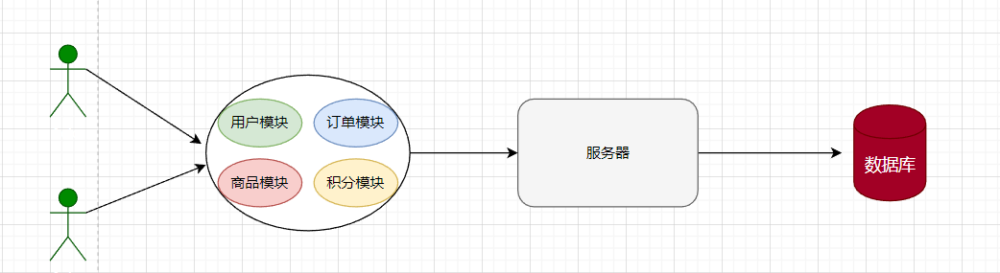

2. 单体架构有什么优点？

   + 部署简单、架构成本低，比较适用于中小型项目。

3. 单体架构的缺点？

   + 项目代码耦合度高、扩展性差、一旦服务器宕机整个项目将无法运行。
   + 单体架构所有的模块开发都是要使用一样的技术。

### 分布式架构

1. 下面是基于分布式架构的简单示意图，将项目的模块进行了拆分并且部署到不同的服务器上、每个模块都对应不同的数据库。

   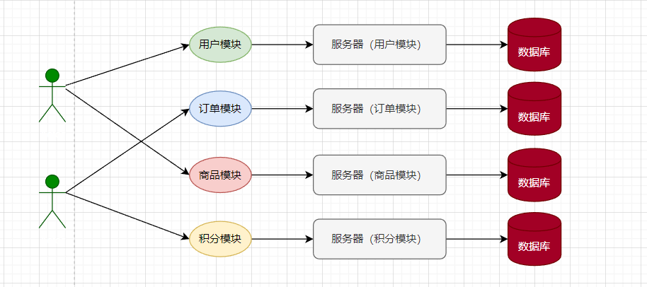

2. 分布式架构有什么优点？

   + 代码松耦合、扩展性较强、每个模块都可以使用不同的技术开发模式更灵活。
   + 即使是某个服务器宕机、也不会影响整个项目，微服务架构比较适用于开发互联网大型项目，例如：京东、淘宝。

3. 分布式架构的缺点？

   + 架构比较复杂、开发难度较大。

     

### 微服务架构

1. 微服务架构是经过良好架构设计的分布式架构方案，微服务架构特点：
   + 单一职责：微服务拆分力度更小，每一个服务都对应唯一的业务能力，做到单一职责避免业务重复开发。
   + 面向服务：微服务对外暴露业务接口，方便各模块之间数据通信。
   + 独立自治：团队对立、技术独立、数据独立、部署独立。
   + 隔离性：服务调用做好隔离、容错、降级避免出现级联问题。
2. 微服务是一种良好的分布四架构方案
   + 优点：拆分力度更小、服务更独立、耦合度更低。
   + 缺点：架构非常复杂、监控、部署难度提高。


### Spring Cloud 简介

1. Spring Cloud是目前国内使用最广泛的微服务框架，官网地址：https://spring.io/projects/spring-cloud。

2. SpringCloud集成了各种微服务功能组件，并基于springcloud实现了这些组件的自动装配，从而提供了良好的开箱即用体验

   + 服务注册发现

     + Eureka、Nacos、Consul

   + 统一配置管理

     + SpringCloudCoofig、Nacos

   + 服务远程调用

     + OpenFeign、Dubbo

   + 统一网关路由

     + SpringCloudGetWay、Zuul

   + 服务链路监控

     + ZipKin、Sleuth

   + 流控、降级、保护

     + Hystix、Sentinel

       

3. Spring Cloud和springcloud版本查询地址： https://start.spring.io/actuator/info 

4. Spring Cloud和springcloud版本关系对照表

   | Release Train                                                | Release Train                         |
   | ------------------------------------------------------------ | ------------------------------------- |
   | [2022.0.x](https://github.com/spring-cloud/spring-cloud-release/wiki/Spring-Cloud-2022.0-Release-Notes) aka Kilburn | 3.0.x                                 |
   | [2021.0.x](https://github.com/spring-cloud/spring-cloud-release/wiki/Spring-Cloud-2021.0-Release-Notes) aka Jubilee | 2.6.x, 2.7.x (Starting with 2021.0.3) |
   | [2020.0.x](https://github.com/spring-cloud/spring-cloud-release/wiki/Spring-Cloud-2020.0-Release-Notes) aka Ilford | 2.4.x, 2.5.x (Starting with 2020.0.3) |
   | [Hoxton](https://github.com/spring-cloud/spring-cloud-release/wiki/Spring-Cloud-Hoxton-Release-Notes) | 2.2.x, 2.3.x (Starting with SR5)      |
   | [Greenwich](https://github.com/spring-projects/spring-cloud/wiki/Spring-Cloud-Greenwich-Release-Notes) | 2.1.x                                 |
   | [Finchley](https://github.com/spring-projects/spring-cloud/wiki/Spring-Cloud-Finchley-Release-Notes) | 2.0.x                                 |
   | [Edgware](https://github.com/spring-projects/spring-cloud/wiki/Spring-Cloud-Edgware-Release-Notes) | 1.5.x                                 |
   | [Dalston](https://github.com/spring-projects/spring-cloud/wiki/Spring-Cloud-Dalston-Release-Notes) | 1.5.x                                 |


### 微服务拆分案例

1. 将项目拆分成两个模块，分别是user-server（用户模块）和order-service（订单模块），springcloud01作为user-server和order-server的父模块，user-server和order-server都是springcloud项目（需要手动写一下启动口类和相关配置文件application.yml，因为这是创建的Maven工程而不是通过spring initializr创建的工程），我们需要在springcloud01的pom文件中引入公共依赖，再在user-server和order-server子工程中引入所需要的依赖。

   ```xml
   <!-- 将当前项目声明为 springcloud 项目 -->
   <parent>
       <artifactId>spring-boot-starter-parent</artifactId>
       <groupId>org.springframework.boot</groupId>
       <version>2.5.0</version>
   </parent>
   
   <!-- 定义依赖版本 -->
   <properties>
       <maven.compiler.source>17</maven.compiler.source>
       <maven.compiler.target>17</maven.compiler.target>
       <spring-boot-starter-web.version>3.0.5</spring-boot-starter-web.version>
       <mysql-connector-j.version>8.0.32</mysql-connector-j.version>
       <mybatis-spring-boot-starter.version>2.2.2</mybatis-spring-boot-starter.version>
       <spring-cloud-dependencies.version>2021.0.1</spring-cloud-dependencies.version>
       <lombok.version>1.18.26</lombok.version>
   </properties>
   
   <dependencyManagement>
       <dependencies>
           <!-- spring-cloud依赖 -->
           <dependency>
               <groupId>org.springframework.cloud</groupId>
               <artifactId>spring-cloud-dependencies</artifactId>
               <version>${spring-cloud-dependencies.version}</version>
               <type>pom</type>
           </dependency>
   
           <dependency>
               <groupId>org.springframework.boot</groupId>
               <artifactId>spring-boot-starter-web</artifactId>
               <version>${spring-boot-starter-web.version}</version>
           </dependency>
   
           <dependency>
               <groupId>com.mysql</groupId>
               <artifactId>mysql-connector-j</artifactId>
               <version>${mysql-connector-j.version}</version>
           </dependency>
   
           <dependency>
               <groupId>org.mybatis.spring.boot</groupId>
               <artifactId>mybatis-spring-boot-starter</artifactId>
               <version>${mybatis-spring-boot-starter.version}</version>
           </dependency>
   
           <dependency>
               <groupId>org.projectlombok</groupId>
               <artifactId>lombok</artifactId>
               <version>${lombok.version}</version>
           </dependency>
       </dependencies>
   </dependencyManagement>
   ```

   

2. user-server使用 springcloud-user数据库，order-service使用 springcloud-order数据库，再分别提供一个根据ID查询信息的接口。省略了实体类、service层和mapper层代码...（和平时使用springcloud框架开发一样搞就行了）。

   + springcloud-user

     ```java
     @RestController
     @RequiredArgsConstructor
     public class UserController {
     
         private final UserService userService;
     
         @GetMapping("/{id}")
         public Object getUserById(@PathVariable("id") Integer id) {
             return userService.selectById(id);
         }
     }
     ```

     

   + order-service

     ```java
     @RestController
     @RequiredArgsConstructor
     public class OrderController {
     
         private final OrderService orderService;
     
         @GetMapping("/{id}")
         public Object getOrderById(@PathVariable("id") Integer id) {
             return orderService.selectById(id);
         }
     }
     ```

3. 分别配置user-server和order-server的application.yml文件，因为他们是两个单独的服务，使用的数据库也不一样，所以要单独配置服务端口和数据库连接信息。

   + user-server

     ```yaml
     server:
       port: 8081
       servlet:
         context-path: /orders
     
     spring:
       datasource:
         driver-class-name: com.mysql.cj.jdbc.Driver
         url: jdbc:mysql://localhost:3306/springcloud-order
         username: root
         password: 123456
     
     mybatis:
       configuration:
         log-impl: org.apache.ibatis.logging.stdout.StdOutImpl
         map-underscore-to-camel-case: true
     ```

     

   + order-server

     ```yaml
     server:
       port: 8082
       servlet:
         context-path: /users
     
     spring:
       datasource:
         driver-class-name: com.mysql.cj.jdbc.Driver
         url: jdbc:mysql://localhost:3306/springcloud-user
         username: root
         password: 123456
     
     mybatis:
       configuration:
         log-impl: org.apache.ibatis.logging.stdout.StdOutImpl
         map-underscore-to-camel-case: true
     ```

4. 浏览器访问两个服务的接口

   + user-server

     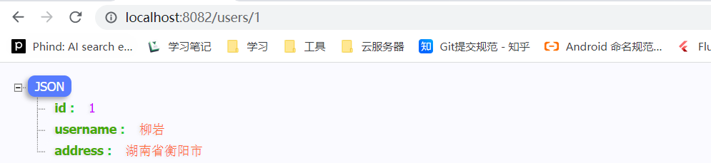

   + order-server

     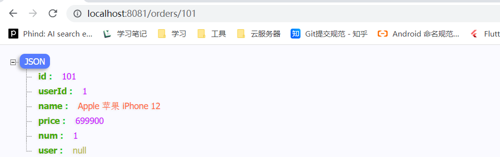


### 服务间接口调用

1. 现在有一个新需要，访问订单信息的时候，我需要拿到用户信息！

   + 在单体架构中，我们搞一个UserService调一下业务方法就ok了，但是现在不是单体架构是基于微服务架构，用户模块和订单模块已经分开了，部署在两个不同的服务器，你要是现在还在想UserService那就没搞头了！！
   + order-server模块怎么样才能访问到user-server模块的数据呢？
     + 浏览器可以发送HTTP请求去获取user-server中的数据，user-server到时候会响应一串json字符串回来。
     + 那么在order-server模块中不一样也可以发送HTTP请求嘛，我在OrdeService中请求user-serve模块中的接口，user-server到时候再给我响应一串json，我都能拿到数据了，我自己再处理一下不就ok了？
     + 有了这个思路，那就成功了一大半了，在SprinBoot项目中可以使用RestTemplate对象发送Http请求，RestTemplate还能够将json字符串转成JavaBean对象，太爽了...

2. 微服务调用方式

   + 基于RestTemplate发起的HTTP请求实现远程调用。
   + HTTP请求做远程调用是与语言无关的调用，只要知道对方的ip、端口、接口路径、请求参数即可。

3. 使用RestTemplate访问服务API接口

   + 先将RestTemplate注入到Sring容器中

     ```java
     @Configuration
     public class AppConfiguration {
         /**
          * RestTemplate 提供远程服务接口调用能力
          */
         @Bean
         public RestTemplate restTemplate() {
             return new RestTemplate();
         }
     }
     ```

     

   + 在OrderService的业务方法中，使用RestTemplate访问服务API接口

     ```java
     @Service
     @RequiredArgsConstructor
     public class OrderServiceImpl implements OrderService {
     
         private final OrderMapper orderMapper;
         private final RestTemplate restTemplate;
     
         @Override
         public Order selectById(Integer id) {
             Order order = orderMapper.selectById(id);
     
             // 通过 restTemplate 调用user-service服务模块的API接口
             String url = "http://localhost:8082/users/" + order.getUserId();
             User user = restTemplate.getForObject(url, User.class);
             order.setUser(user);
             return order;
         }
     }
     
     ```

     

   + 浏览器测试（okok，搞定~~）

     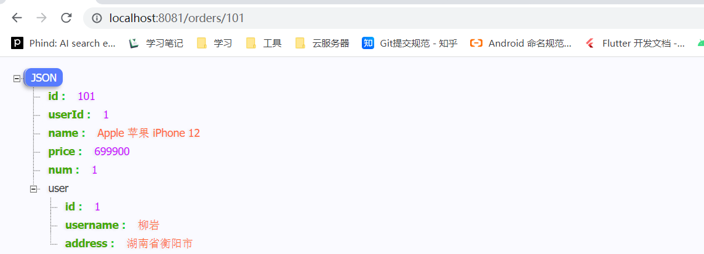


## Eureka 注册中心

### Eureka 解决什么问题

1. 远程服务调用中出现的问题

   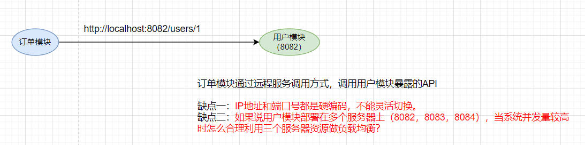

   

2. Eureka 注册中心其实就可以解决上述问题，Eureka原理简单示意图。

   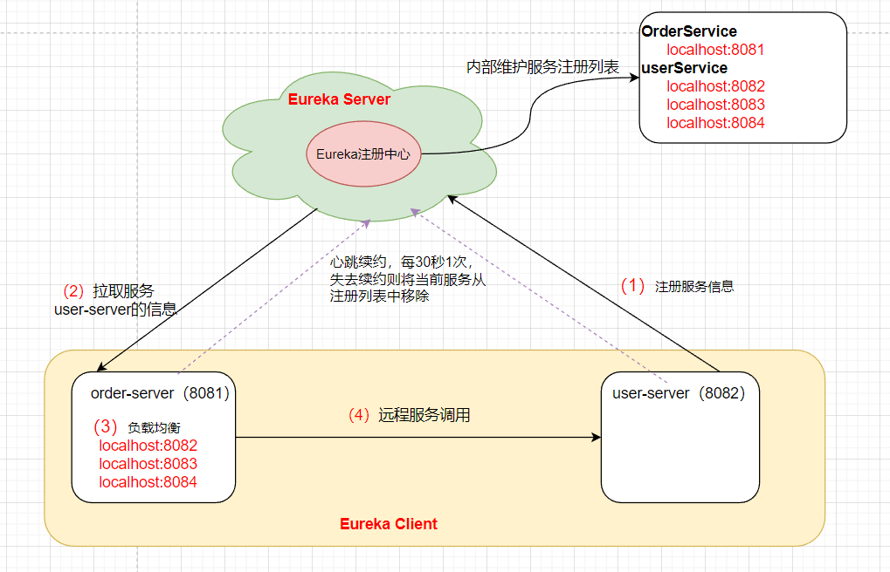

   


### 服务提供者和服务消费者

1. 什么是服务提供者？什么是服务消费者？
   + order-server调用user-server的服务接口，那么user-server就是服务提供者，反之order-server就是服务消费者！
2. A服务调用B服务，B服务又调用C服务，那么B是服务提供者还是服务消费者？
   + 这是一个相对问题概念，B服务对于A服务来说B服务就充当服务提供者，B服务对C服务来说B服务就充当服务消费者。
   + 任何一个服务都可以充当服务提供者角色也可以充当服务消费者角色，只不过看相对于谁。
3. 在Eureka架构中，微服务角色有两类
   + EurekaServer：服务端，注册中心
     + 记录服务信息、心跳监控
   + EurekaClient：客户端
     + Provider：服务提供者，例如案例中的 user-server
       + 注册自己的信息到EurekaServer
       + 每隔30秒向EurekaServer发送心跳
     + consumer：服务消费者，例如案例中的 order-server
       + 根据服务名称从EurekaServer拉取服务列表
       + 基于服务列表做负载均衡，选中一个微服务后发起远程调用

### 搭建Eureka Server

1. 引入依赖（需要新建立一个模块eureka-server，案例代码还是在springcloud01工程基础上），依赖统一在父工程进行声明。

   ```xml
   <!-- 手动指定了版本号、按道理可以不用管版本号的（可能是Maven或者IDEA问题）-->
   <dependency>
       <groupId>org.springframework.cloud</groupId>
       <artifactId>spring-cloud-starter-netflix-eureka-server</artifactId>
       <version>3.1.5</version>
   </dependency>
   ```

2. 启动类添加@EnableEurekaServer注解

   ```java
   @EnableEurekaServer
   @springcloudApplication
   public class EurekaApplication {
       public static void main(String[] args) {
           SpringApplication.run(EurekaApplication.class, args);
       }
   }
   ```

   

3. 编辑配置文件

   ```yaml
   server:
   # eureka 服务端口
     port: 10010
   
   spring:
     application:
       # eureka 服务名称
       name: eurekaServer
   
   eureka:
     client:
       service-url:
         # eureka 服务运行地址(浏览器访问的是http://127.0.0.1:10010, 但是eureka/后缀不能省略)
         defaultZone: http://127.0.0.1:10010/eureka/
   ```

   

4. 浏览器访问：http://localhost:10010/，在DS Replicas下，Instances currently registered with Eureka中会发现有一个运行实例，名字叫：EUREKASERVER，这就是当前的Eureka服务（也被注册到注册中心了）。

   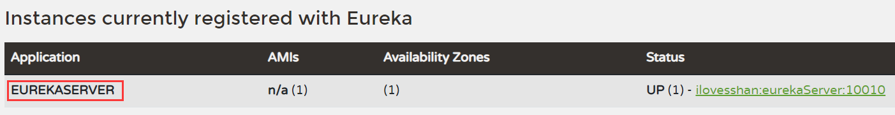

   

### 服务注册

1. 在user-server和order-server模块中分别添加依赖

   ```xml
   <!-- 注意：这是eureka的客户端依赖， 上面那个是eureka服务端依赖，可以使用相同版本-->
   <dependency>
       <groupId>org.springframework.cloud</groupId>
       <artifactId>spring-cloud-starter-netflix-eureka-client</artifactId>
   </dependency>
   ```

   

2. 在user-server和order-server模块中分别添加配置

   ```yaml
   spring:
     application:
       # 配置服务名称（order-server模块同理）
       name: userService
   
   eureka:
     client:
       service-url:
         # 配置服务地址，将当前服务注册到该地址上
         defaultZone: http://127.0.0.1:10010/eureka/
   ```

   

3. 重启服务，再次访问http://localhost:10010/

   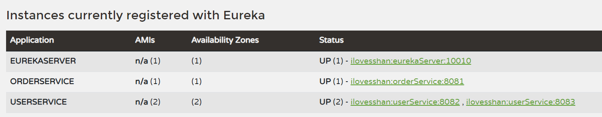

   

4. 重启之后，再次访问页面，如果界面中有一串下面这种红色文字，可以参考：https://blog.csdn.net/hadues/article/details/105023709

   `EMERGENCY! EUREKA MAY BE INCORRECTLY CLAIMING INSTANCES ARE UP WHEN THEY'RE NOT. RENEWALS ARE LESSER THAN THRESHOLD AND HENCE THE INSTANCES ARE NOT BEING EXPIRED JUST TO BE SAFE`

   

### 服务发现

1. 服务发现主要就是来解决，远程服务调用中存在的问题呗！

   + IP地址和端口号硬编码问题，多个服务如何做负载均衡？

     

2. 在OrderServiceImpl业务方法中进行代码修改

   ```java
   @Service
   @RequiredArgsConstructor
   public class OrderServiceImpl implements OrderService {
   
       private final OrderMapper orderMapper;
       private final RestTemplate restTemplate;
   
       @Override
       public Order selectById(Integer id) {
           Order order = orderMapper.selectById(id);
   
           // 通过 restTemplate 调用user-service服务模块的API接口
           // String url = "http://localhost:8082/users/" + order.getUserId();
   
           // 对于IP地址和端口号不再采用硬编码方式，而是通过服务名称向eureka注册中心索要服务信息
           String url = "http://userServer/users/" + order.getUserId();
           User user = restTemplate.getForObject(url, User.class);
           order.setUser(user);
           return order;
       }
   }
   
   ```

   

3. 如何做服务负载均衡？在配置RestTemplateBean的时候，方法上面加一个@LoadBalanced注解就搞定了！

   ```java
   @Configuration
   public class AppConfiguration {
   
       @LoadBalanced
       @Bean
       public RestTemplate restTemplate() {
           return new RestTemplate();
       }
   }
   ```

4. 重启order-server服务，浏览器多次访问http://localhost:8081/orders/id，观察控制台会发现8083/8082服务器会交替响应客户请求，说明负载均衡是有效果的。


## Ribbon 负载均衡

### 负载均衡流程

1. 负载均衡流程

   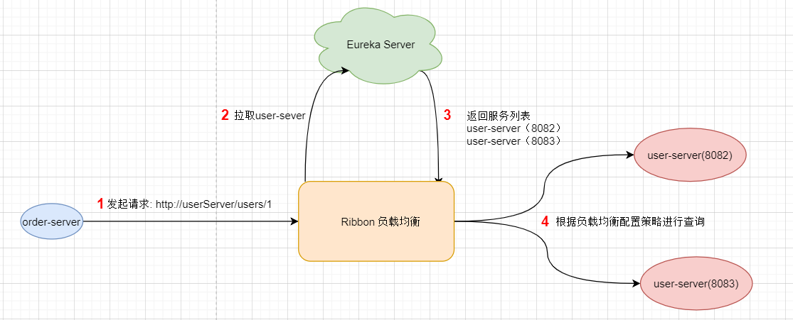

   

### 负载均衡策略

1. IRule接口

   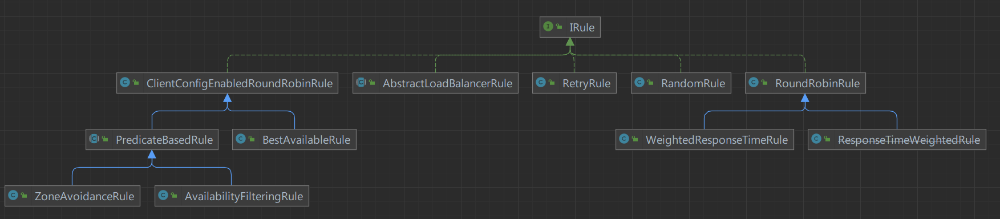

   

2. Ribbon的负载均衡规则是一个叫做IRule的接口来定义的，每一个子接口都是一种规则：

   | **内置负载均衡规则类**    | **规则描述**                                                 |
   | ------------------------- | ------------------------------------------------------------ |
   | RoundRobinRule            | 简单轮询服务列表来选择服务器。它是Ribbon默认的负载均衡规则。 |
   | AvailabilityFilteringRule | 对以下两种服务器进行忽略： （1）在默认情况下，这台服务器如果3次连接失败，这台服务器就会被设置为“短路”状态。短路状态将持续30秒，如果再次连接失败，短路的持续时间就会几何级地增加。（2）并发数过高的服务器。如果一个服务器的并发连接数过高，配置了AvailabilityFilteringRule规则的客户端也会将其忽略。并发连接数的上限，可以由客户端的\<clientName>.\<clientConfigNameSpace>.ActiveConnectionsLimit属性进行配置。 |
   | WeightedResponseTimeRule  | 为每一个服务器赋予一个权重值。服务器响应时间越长，这个服务器的权重就越小。这个规则会随机选择服务器，这个权重值会影响服务器的选择。 |
   | ZoneAvoidanceRule         | 以区域可用的服务器为基础进行服务器的选择。使用Zone对服务器进行分类，这个Zone可以理解为一个机房、一个机架等。而后再对Zone内的多个服务做轮询。 |
   | BestAvailableRule         | 忽略那些短路的服务器，并选择并发数较低的服务器。             |
   | RandomRule                | 随机选择一个可用的服务器。                                   |
   | RetryRule                 | 重试机制的选择逻辑                                           |

   

3. 配置 负载均衡策略

   + 代码方式：在order-server中的OrderApplication类中，定义一个新的IRule

     ```java
     @Bean
     public IRule randomRule(){ 
         return new RandomRule();
     }
     ```

   + 配置文件方式：在order-server的application.yml文件中，添加新的配置也可以修改规则：

     ```yaml
     userservice:
       ribbon:
       	# 负载均衡规则 
         NFLoadBalancerRuleClassName: com.netflix.loadbalancer.RandomRule
     ```

     

### 饥饿加载

1. Ribbon默认是采用懒加载，即第一次访问时才会去创建LoadBalanceClient，请求时间会很长，而饥饿加载则会在项目启动时创建，降低第一次访问的耗时，通过下面配置开启饥饿加载：

   ```yaml
   ribbon:
     eager-load:
       enabled: true # 开启饥饿加载 
         clients: userservice # 指定对userservice这个服务饥饿加载 
   ```

   

## Nacos 注册中心

### Nacos 简介

1. Nacos官网地址：https://nacos.io/zh-cn/docs/v2/what-is-nacos.html
2. Nacos官网Github地址：https://github.com/alibaba/nacos
3. 什么是Nacos
   + Nacos /nɑ:kəʊs/ 是 Dynamic Naming and Configuration Service的首字母简称，一个更易于构建云原生应用的动态服务发现、配置管理和服务管理平台。
   + Nacos 致力于帮助您发现、配置和管理微服务。Nacos 提供了一组简单易用的特性集，帮助您快速实现动态服务发现、服务配置、服务元数据及流量管理。
   + Nacos 帮助您更敏捷和容易地构建、交付和管理微服务平台。 Nacos 是构建以“服务”为中心的现代应用架构 (例如微服务范式、云原生范式) 的服务基础设施。
4. Nacos 的关键特性
   + 服务发现和服务健康监测
   + 动态配置服务
   + 动态 DNS 服务
   + 服务及其元数据管理

### Nacos 环境搭建

1. 下载Nacos，直接到Github下载即可，[Nacos 1.X](https://nacos.io/zh-cn/docs/quick-start.html)是老版本，将来会停止维护。 建议您使用[2.X版本](https://nacos.io/zh-cn/docs/v2/quickstart/quick-start.html)。Nacos的下载地址：https://github.com/alibaba/nacos/releases。

2. 可以根据需求下载Linux版本或者Windows版本（我选择Windows），下载之后解压。

   + bin：启动目录
   + conf：配置文件

   

   

3. Ncos端口配置

   + Nacos的默认端口是8848，如果你电脑上的其它进程占用了8848端口，请先尝试关闭该进程。如果无法关闭占用8848端口的进程，也可以进入nacos的conf目录，修改application.properties配置文件中的端口。

     

4. 启动Nacos

   + 进入到bin目录下执行

     ```bat
     startup.cmd -m standalone
     ```

   + 显式下面LOGO信息，并且无报错就表示启动成功了

     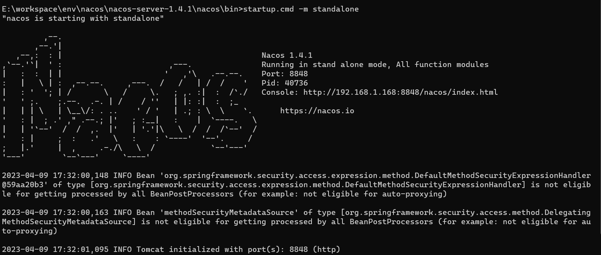

   

5. 浏览器输入：http://192.168.1.168:8848/nacos/index.html，能够正常访问就表示OK了！！

   

### Nacos 服务注册

1. 父工程中添加spring-cloud-alilbaba的管理依赖（将之前代码copy了一份叫做springcloud-nacos）。

   ```xml
   <dependency>
       <groupId>com.alibaba.cloud</groupId>
       <artifactId>spring-cloud-alibaba-dependencies</artifactId>
       <version>2.2.6.RELEASE</version>
       <type>pom</type>
       <scope>import</scope>
   </dependency>
   ```

   

2. 注释掉order-service和user-service中原有的eureka依赖，再添加nacos的客户端依赖

   ```xml
   <dependency>
       <groupId>com.alibaba.cloud</groupId>
       <artifactId>spring-cloud-starter-alibaba-nacos-discovery</artifactId>
   </dependency>
   ```

   

3. 修改order-service和user-service的配置文件，注释eureka地址，添加nacos地址。

   ```yaml
   spring:
     cloud:
       nacos:
         # 配置Nacos 服务端地址(也可以不用配置，因为默认就是localhost:8848)
         server-addr: localhost:8848
   ```

   

4. 重新启动order-service和user-service服务，访问order-service接口，不报错表示已经成功将服务注册到Nacos上面了。

   + 需要提前将Nacos服务启动起来哈！！
   + 因为现在是将服务注册到Nacos上，而不是Eureka上面，所以eureka-service服务可以不用启动。

### Nacos 服务分级存储模型

1. 服务分级模型

   + 一级：服务，例如userService
   + 二级：集群，例如上海机房、北京机房
   + 三级：实例，北京机房部署了userService的实例

   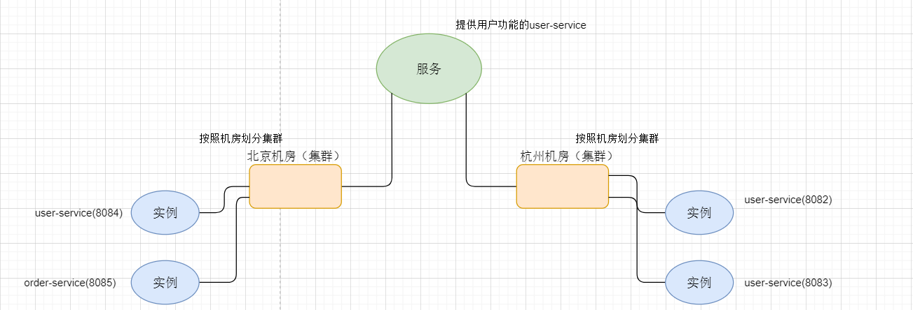

   

2. 服务跨集群调用问题

   + 服务调用尽可能选择本地集群服务调用，因为跨集群服务调用延迟较高。

   + 本地集群不可访问时，再去访问其它集群。

     

3. 配置服务集群属性

   + 简单理解就是，将user-service实例1部署到哪一个集群，将user-service实例2部署到哪一个集群，以此类推，默认情况下可以在Nacos中发现集群叫做：DEFAULT

     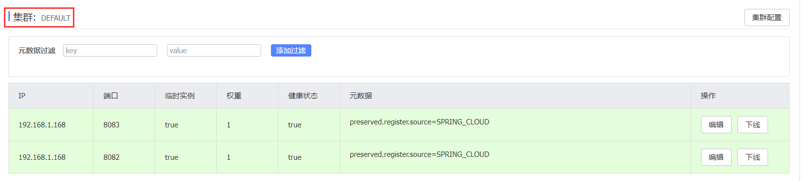

     

   + 修改服务的配置文件（user-service和order-service都需要修改）

     + 将user-service实例一（8082）和实例二（8083）以及order-service配置集群到HZ
     + 将user-service实例三（8084）配置集群到SH

     ```yaml
     spring:
       cloud:
         inetutils:
           # 配置Nacos 服务端地址
           default-ip-address: localhost:8848
         nacos:
           discovery:
               # 集群名称 杭州(HZ)
             cluster-name: HZ
     ```

     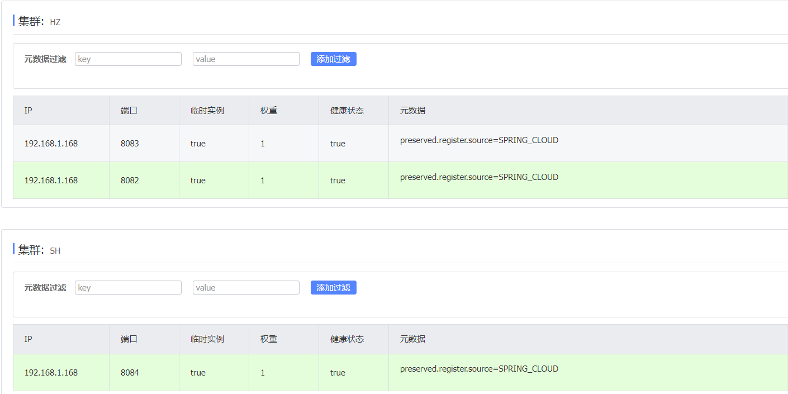

     

### Nacos 负载均衡

1. 将集群属性配置好之后，访问http://localhost:8081/orders/id，会发现三个实例是随机访问的，其实并没有满足服务跨集群调用问题，优先访问本地集群，本地集群不能访问时再访问其他集群（这时候IDEA控制台会有警告信息，告诉你跨集群调用服务了）。

   

2. 其实这个问题，可以通过配置Nacos负载均衡来实现

   ```yaml
   # 在order-service中设置负载均衡的IRule为NacosRule，这个规则优先会寻找与自己同集群的服务
   userServer:
     ribbon:
       # 负载均衡规则 
       NFLoadBalancerRuleClassName: com.alibaba.cloud.nacos.ribbon.NacosRule 
   ```

3. 如果上述配置不生效，请查看项目中是否自定义了IRule负载均衡规则覆盖住NacosRule，例如：

   ```java
   @Bean
   public IRule iRule() {
       return new RandomRule();
   }
   ```

   

4. 负载均衡权重问题

   + 项目中可能一部分服务器性能较好，另一部分略差，那么多个并发请求时，当然是性能好的服务器处理更多的请求，就目前配置来看每个服务的访问频率都大差不差。

   + 要解决这个问题，我们可以在Nacos控制台上配置权重（默认是1），权重值是0.1 - 1之间， 权重值越大访问频率越高，如果权重是0，则完全不会被访问，直接在Nacos控制台更改权重就可以了。

     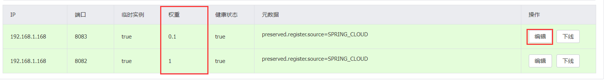


### Nacos 环境隔离

1. Nacos中服务存储和数据存储的最外层都是一个名为namespace的东西，用来做最外层隔离。

2. 在Nacos控制台可以创建namespace，用来隔离不同环境。

   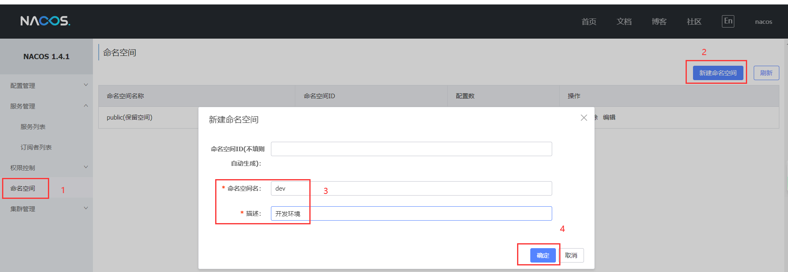

3. 创建完成之后，会得到一个命名空间ID

   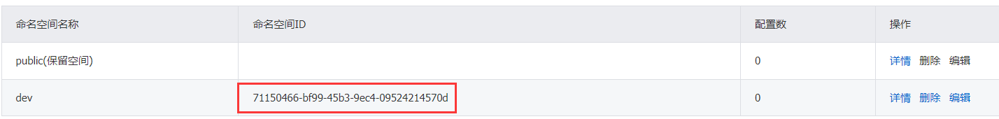

4. 修改order-service的application.yml，添加namespace

   ```yaml
   spring:
     application:
       # 配置服务名称
       name: orderServer
       
     cloud:
       inetutils:
         # 配置Nacos 服务端地址
         default-ip-address: localhost:8848
       nacos:
         discovery:
           # 集群名称 杭州(HZ)
           cluster-name: HZ
           # 设置环境ID
           namespace: 71150466-bf99-45b3-9ec4-09524214570d
   ```

5. 重启order-service服务，再次访问http://localhost:8081/orders/101，会发现order-service调用user-service服务接口时失败了，因为不同namespace下的服务互相不可见。

   + order-service在dev命名空间下
   + user-service在默认的public(保留空间)命名空间下

   ```tex
   No instances available for userServer
   ```

### Nacos 临时和非临时实例

1. Nacos中默认都是临时实例，如果想将某个服务配置成非临时实例，可以修改对应服务的配置文件

   ```yml
   spring:
      nacos:
        # 设置为非临时实例
   	 ephemeral: false 
   ```

2. 临时实例和非临时实例有什么区别？

   + 临时实例
     + 采用心跳检测来告诉Nacos当前服务的状态。
     + 如果服务挂掉了，那么Nacos会从注册列表中将当前服务移除。
   + 非临时实例
     + Nacos主动询问当前服务的状态。
     + 如果服务挂掉了，Nacos不会从注册列表中将当前服务移除，而是继续等待服务重启。

### Nacos 统一配置管理

1. 微服务中每个服务都会与自己对应的配置文件，一般情况下我们修改了配置文件就需要重启服务器，每次都重启服务器那肯定是不可取的，有什么办法来解决这个痛点？

   + 我们可以将多个服务上线后可能会变更的配置信息交给Nacos来管理，将一些不变的配置到各自服务的配置文件即可，是的你没听错，Nacos不仅能做服务注册还能做配置管理。

   + Spring读取到Nacos配置文件之后再和本地文件做一个合并。

     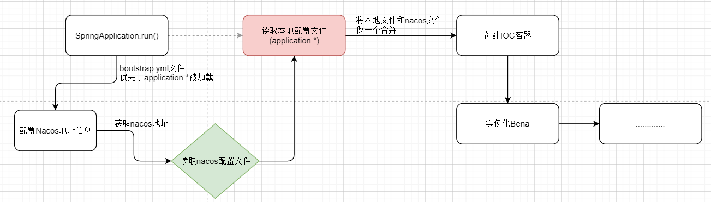

   

2. 添加Nacos配置文件文件，在Nacos控制台进行配置。

   + 注意分组（如果将配置建到dev下面，就需要在bootstrap.yml中添加分组配置），建议建到public下吧。

     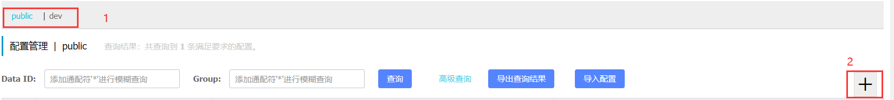

   + 填写配置信息，点击发布即可！

     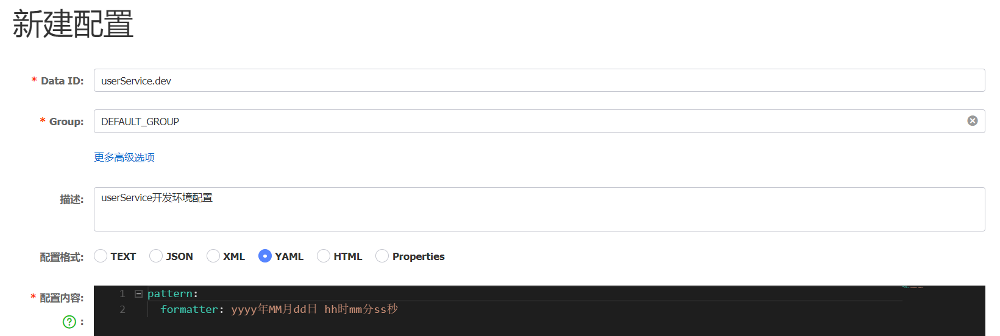

   

3. 服务中读取Nacos配置文件

   + 添加Nacos配置管理依赖

     ```xml
     <!-- nacos配置管理依赖 -->
     <dependency>
         <groupId>com.alibaba.cloud</groupId>
         <artifactId>spring-cloud-starter-alibaba-nacos-config</artifactId>
     </dependency>
     ```

     

   + 新建bootstrap.yml文件，可以删除掉application.yml文件中关于nacos的配置信息。

     ```yaml
     spring:
       application:
         # 服务名称
         name: userService
       profiles:
         # 开发环境 dev
         active: dev
       cloud:
         nacos:
           # 服务地址
           server-addr: localhost:8848
           config:
             # 文件扩展名(Nacos控制台配置的文件)
             file-extension: yaml
             # 如果将配置文件建立到其他组下(非public)，这里需要添加组的ID
             # namespace: 71150466-bf99-45b3-9ec4-09524214570d
     ```

     

   + 编写Controller，读取Nacos配置文件中信息

     ```java
     @RestController
     public class DateTimeController {
     
         @Value("${pattern.formatter}")
         private String datePattern;
     
         @GetMapping("/time")
         public String getCurrentTime() {
             return LocalDateTime.now().format(DateTimeFormatter.ofPattern(datePattern));
         }
     }
     ```

     

   + 访问：http://localhost:8082/time，成功了！！！

     

   

4. 注意点

   + 不是将所有的配置都放到Nacos中，维护起来比较麻烦。
   + 建议将一些关键参数，运行中需要调整的参数放到Nacos中。

### Nacos 配置热更新

1. 上面实现了在服务中读取Nacos中配置文件信息，这一节聊聊做Nacos配置文件热更新，让服务能够自动感知Nacos配置文件做了更新。

2. 实现配置热更新有两种方式

   + @Value属性注入 + @RefreshScope方式

     ```java
     @RestController
     @RefreshScope
     public class DateTimeController {
     
         @Value("${pattern.formatter}")
         private String datePattern;
     
         @GetMapping("/time")
         public String getCurrentTime() {
             return LocalDateTime.now().format(DateTimeFormatter.ofPattern(datePattern));
         }
     }
     ```

     

   + @ConfigurationProperties（自动刷新）

     ```java
     @Data
     @Component
     @ConfigurationProperties(prefix = "pattern")
     public class NacosConfig {
         private String formatter;
     }
     ```

     ```java
     @RestController
     // @RefreshScope
     public class DateTimeController {
     
         // @Value("${pattern.formatter}")
         // private String datePattern;
     
         @Resource
         private NacosConfig nacosConfig;
     
         @GetMapping("/time")
         public String getCurrentTime() {
             return LocalDateTime.now().format(DateTimeFormatter.ofPattern(nacosConfig.getFormatter()));
         }
     }
     ```


### Nacos 多环境配置共享

1. 需求：在dev、test、prod环境中都有共享的数据，总不能在每个环境都写一份吧？？

2. Nacos 读取环境时，会默认读取两个配置文件

   + servername-[spring.profiles.active].yml，例如：userService-dev.yaml（根据spring.profiles.active读取）

     ```yaml
     pattern:
       formatter: yyyy-MM-dd hh:mm:ss
     ```

     

   + servername.yml，例如： userService.yaml（无论如何都会读取）

     ```yaml
     pattern:
       formatter: yyyy年MM月dd日 hh时mm分ss秒
       envName: 多环境共享参数
     ```

3. 在userService中读取共享环境数据

   + 更改NacosConfig和添加EnvShareController

     ```java
     @Data
     @Component
     @ConfigurationProperties(prefix = "pattern")
     public class NacosConfig {
         private String formatter;
         private String envName;
     }
     ```

     ```java
     @RestController
     public class EnvShareController {
         @Resource
         private NacosConfig nacosConfig;
         
         @GetMapping("/time")
         public NacosConfig getNacosConfig() {
             return nacosConfig;
         }
     }
     ```

   + 重启user-service（8082）端口，访问http://localhost:8082/envShared

     ```json
     {
         "formatter": "yyyy-MM-dd hh:mm:ss",
         "envName": "多环境共享参数"
     }
     ```

   + 在IDEA服务列表中，copy一个服务修改端口号和启动参数

     + 端口号（VM options）：-Dserver.port=8085（8085 端口）

     + 启动参数（active profiles）：test（以测试环境启动）

       

   + 浏览器访问：http://localhost:8085/envShared，也可看到userService.yaml配置文件的数据，说明多环境参数共享生效了。

     ```json
     {
         "formatter": "yyyy-MM-dd hh:mm:ss",
         "envName": "多环境共享参数"
     }
     ```

4. application.yml、userService.yml、userService-dev.yml优先级比较

   + userService-dev.yml > userService.yml > application.yml


### Nacos 和 Eureka 对比

1. 相同点

   + 都支持服务注册和服务拉去。
   + 都支持服务提供者的心跳机制做健康检测。
2. 不同点

   + Nacos支持服务端主动检测服务提供者状态，临时实例采用心跳模式，非临时实例采用主动检测模式，临时实例心跳不正常会被剔除，非临时实例不会。
   + Nacos支持服务列表变更的消息推送模式，让服务消费者中的服务列表更新更及时。
   + Nacos集群默认采用AP方式，当集群中存在非临时实例时，采用CP模式；Eureka采用AP方式


##  Feign

### Feign 简介

1. Feign 是声明式 Web 服务客户端，它使编写 Web 服务客户端更加容易。Feign 不做任何请求处理，通过处理注解相关信息生成 Request，并对调用返回的数据进行解码，从而实现 简化 HTTP API 的开发。
2. Feign 的底层依赖了ribbon，默认情况下Feign 也会帮助我们做负载均衡。
3. Feign 和 Openfeign 的区别
   + Feign 最早是由 Netflix 公司进行维护的，后来 Netflix 不再对其进行维护，最终 Feign 由社区进行维护，更名为 Openfeign。

### RestTemplate 缺点

+ 代码可读性差，维护麻烦。

  ```java
  String url = "http://userServer/users/" + order.getUserId();
  User user = restTemplate.getForObject(url, User.class);
  ```

+ Feign可以来解决RestTemplate 的不足


### Feign 基本使用

1. 添加依赖

   ```xml
   <dependency>
       <groupId>org.springframework.cloud</groupId>
       <artifactId>spring-cloud-starter-openfeign</artifactId>
   </dependency>
   ```

   

2. 启动类添加Feign自动配置注解@EnableFeignClients

   ```java
   @EnableFeignClients
   @SpringBootApplication
   public class OrderServerApplication {
   
       public static void main(String[] args) {
           SpringApplication.run(OrderServerApplication.class, args);
       }
   }
   ```

   

3. 编写服务接口，并添加注解（声明该接口需要访问那个服务）

   ```java
   @FeignClient(name = "userService")
   public interface UserClient {
       
       @GetMapping("users/{id}")
       User selectById(@PathVariable("id") Integer id);
   
   }
   ```

   

4. 通过Feign来替换RestTemplate 发送HTTP请求

   ```java
   @Service
   @RequiredArgsConstructor
   public class OrderServiceImpl implements OrderService {
   
       private final OrderMapper orderMapper;
       private final RestTemplate restTemplate;
       private final UserClient userClient;
   
       @Override
       public Order selectById(Integer id) {
           Order order = orderMapper.selectById(id);
           // 使用openFeign发送HTTP请求
           User user = userClient.selectById(order.getUserId());
           order.setUser(user);
           return order;
       }
   }
   ```


### Feign 自定义配置

1. 使用Feign默认配置可能不能满足需求，这时就需要我们实现自己的Feign配置，配置方式有两种

   + 配置方式:

     - application.yml中配置全局和局部(针对单个Feign接口)

       

     - Java Config 方式全局配置和局部(针对单个Feign接口)

   

2. 具体配置项如下，如何配置可以参考FeignClientsConfiguration或Feign.Builder类

   | 配置项             | 作用                                                         |
   | ------------------ | ------------------------------------------------------------ |
   | Logger.Level       | 日志级别，logger有四种类型:`NONE`,`BASIC`,`HEADERS`, `FULL`  |
   | Retryer            | 重试机制                                                     |
   | ErrorDecoder       | 错误解码器                                                   |
   | Request.Options    | 请求配置                                                     |
   | RequestIntercepto  | 请求拦截器                                                   |
   | Contract           | 处理Feign接口注解，Spring Cloud Feign 使用SpringMvcContract 实现，处理Spring mvc 注解，也就是我们为什么可以用Spring mvc 注解的原因。 |
   | Client             | Http客户端接口，默认是Client.Default，但是我们是不使用它的默认实现，Spring Cloud Feign为我们提供了okhttp3和ApacheHttpClient两种实现方式，只需使用maven引入以下两个中的一个依赖即可,版本自由选择。 |
   | Encoder            | 将一个对象转换成http请求体中， Spring Cloud Feign 使用 SpringEncoder |
   | Decoder            | 将一个http响应转换成一个对象，Spring Cloud Feign 使用 ResponseEntityDecoder |
   | FeignLoggerFactory | 日志工厂参考Spring Cloud Feign 之日志自定义扩展              |
   | Feign.Builder      | Feign接口构建类，覆盖默认Feign.Builder，比如：HystrixFeign.Builder |
   | FeignContext       | 管理了所有的java config 配置                                 |

   

3. 通过配置日志方式来熟悉feign的自定义配置

   + application.yml中配置

     + 全局配置

       ```yaml
       feign:
         client:
           config:
             default:  # 这里用default就是全局配置，如果是写服务名称，则是针对某个微服务的配置
               loggerLevel: FULL # 日志级别
       ```

     + 局部配置

       ```yaml
       feign:
         client:
           config: 
             userService: # 这里用default就是全局配置，如果是写服务名称，则是针对某个微服务的配置
               loggerLevel: FULL #  日志级别 
       ```

   + Java Config 方式

     + 先声明一个Bean

       ```java
       public class FeignClientConfiguration {
           @Bean
           public Logger.Level feignLogLevel() {
               return Logger.Level.BASIC;
           }
       }
       ```

     + 全局配置，则把它放到@EnableFeignClients这个注解中

       ```java
       // 全局配置
       @EnableFeignClients(defaultConfiguration = {FeignClientConfiguration.class})
       @SpringBootApplication
       public class OrderServerApplication {
           // ...
       }
       ```

     + 局部配置，则把它放到@FeignClient这个注解中

       ```java
       @FeignClient(name = "userService",configuration = {FeignClientConfiguration.class})
       public interface UserClient {
           // ...
       }
       ```


### Feign 性能优化

1. Feign底层的客户端实现：

   + URLConnection：默认实现，不支持连接池
   + Apache HttpClient ：支持连接池
   + OKHttp：支持连接池

2. 因此优化Feign的性能主要包括：

   + 使用连接池代替默认的URLConnection
   + 日志级别，最好用basic或none

3. Feign添加HttpClient的支持

   + httpClient的依赖

     ```xml
     <!--httpClient的依赖 -->
     <dependency>
         <groupId>io.github.openfeign</groupId>
         <artifactId>feign-httpclient</artifactId>
     </dependency>	
     ```

     

   + 配置连接池

     ```yaml
     feign:
       client:
         config:
           default: # 这里用default就是全局配置，如果是写服务名称，则是针对某个微服务的配置
             loggerLevel: FULL #  日志级别
             
       httpclient:
         enabled: true # 开启feign对HttpClient的支持
         max-connections: 200 # 最大的连接数
         max-connections-per-route: 50 # 每个路径的最大连接数
     ```


### Feign 最佳实践

1. 现状

   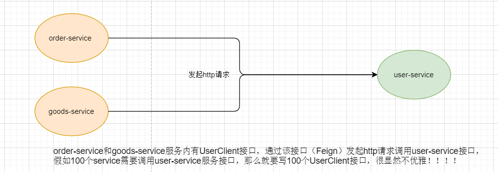

   

2. 最佳实践一

   + 给服务消费者的FeignClient和服务提供者的controller定义统一的父接口作为标准。，因为FeignClient和controller中方法都是一样的。

   + 这种方式有个缺点：耦合度较高，只要接口一动势必会掀起所有实现类进行更改！！

     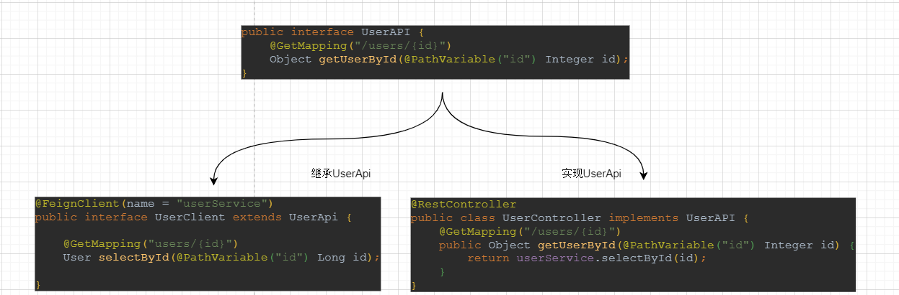

   

3. 最佳实践二

   + 将FeignClient抽取为独立模块，并且把接口有关的POJO、默认的Feign配置都放到这个模块中，提供给所有消费者使用。

     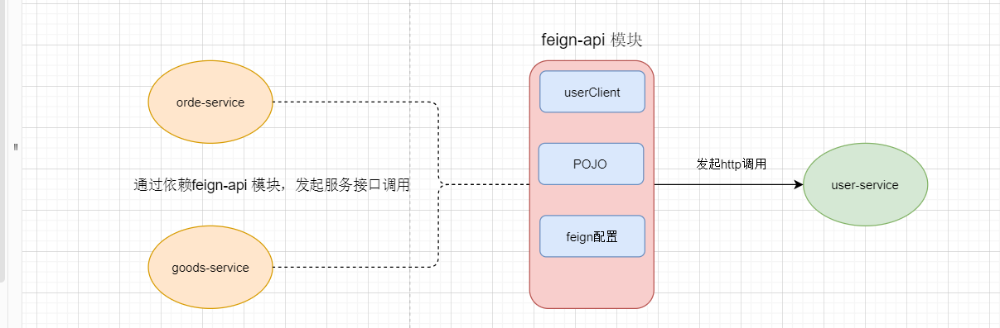

4. 最佳实践二实现步骤

   + 新建feign-api模块（子模块），并添加feign的依赖

   + 将order-service中关于feign的配置copy到feign-api模块中

   + 在order-service中引入feign-api模块依赖（将报错部分重新导包，从feign-api中导入）

   + 重启服务测试

     + 加入报错，可能是扫包问题，当定义的FeignClient不在SpringBootApplication的扫描包范围时，这些FeignClient无法使用。有两种方式解决：

       + 指定FeignClient所在包

         ```java
         @EnableFeignClients(basePackages = "com.xxx.feign.clients")
         ```

         

       + 指定FeignClient字节码

         ```java
         @EnableFeignClients(clients = {UserClient.class})
         ```

## Gateway 网关

### Gateway 网关简介

1. 网关的角色是作为一个 API 架构，用来保护、增强和控制对于 API 服务的访问。

2. API 网关是一个处于应用程序或服务（提供 REST API 接口服务）之前的系统，用来管理授权、访问控制和流量限制等，这样 REST API 接口服务就被 API 网关保护起来，对所有的调用者透明。因此，隐藏在 API 网关后面的业务系统就可以专注于创建和管理服务，而不用去处理这些策略性的基础设施。

3. 网关的作用

   + 身份认证和权限校验
   + 服务路由和负载均衡
   + 请求限流

   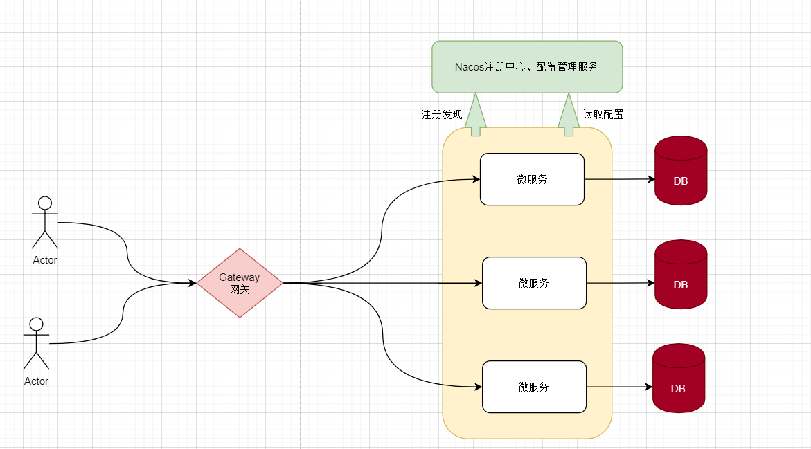

4. 在SpringCloud中网关的实现包括两种：

   + gateway
   + Zuul，Zuul是基于Servlet的实现，属于阻塞式编程。而SpringCloudGateway则是基于Spring5中提供的WebFlux，属于响应式编程的实现，具备更好的性能。


### Gateway 网关服务搭建

1. 新建模块（gateway），并到导入两个依赖：gateway依赖和nacos服务发现依赖

   ```xml
   <!-- gateway 网关依赖-->
   <dependency>
       <groupId>org.springframework.cloud</groupId>
       <artifactId>spring-cloud-starter-gateway</artifactId>
   </dependency>
   
   <!-- nacos 服务发现依赖-->
   <dependency>
       <groupId>com.alibaba.cloud</groupId>
       <artifactId>spring-cloud-starter-alibaba-nacos-discovery</artifactId>
   </dependency>
   ```

   

2. 新建SpringBoot项目的启动类

   ```java
   @SpringBootApplication
   public class GatewayApplication {
       public static void main(String[] args) {
           SpringApplication.run(GatewayApplication.class, args);
       }
   }
   ```

   

3. 添加配置文件（配置网关）

   + 配置网关端口号和网关服务名称

     ```yaml
     server:
       port: 10010
     spring:
       application:
         name: gateway
     ```

   + 配置nacos地址（因为网关需要做路由，也需要从nacos中拉取服务列表）

     ```yaml
     spring:
       cloud:
         nacos:
           server-addr: localhost:8848
     ```

   + 配置gateway路由信息

     + id（只要满足唯一标识即可）
     + uri（路由目标地址，两种写法）
     + predicates（路由断言，当前请求地址是否满足断言条件）

     ```yaml
     spring:
       cloud:
         gateway:
           routes:
             - id: user-service
               # uri: http://127.0.0.1:8081 # 路由的目标地址 http就是固定地址
               uri: lb://userService # 路由的目标地址 lb就是负载均衡，后面跟服务名称
               predicates: # 路由断言(路由断言，当前请求地址是否满足断言条件)
                 - Path: /users/** # /users/** 的请求都去请求服务名称是userService的服务
             - id: order-service
               uri: lb://orderServer
               predicates:
                 - Path: /orders/**
     ```

4. 重启项目，访问网关服务（注意这是访问网关服务，让网关路由到对应的服务上，不是直接放访问user-service或order-service）

   + 访问order-service接口：http://localhost:10010/users/1

     ```json
     {
         "id": 1,
         "username": "柳岩",
         "address": "湖南省衡阳市"
     }
     ```

     

   + 访问user-service接口：http://localhost:10010/orders/101

     ```json
     {
         "id": 101,
         "userId": 1,
         "name": "Apple 苹果 iPhone 12 ",
         "price": 699900,
         "num": 1,
         "user": {
             "id": 1,
             "username": "柳岩",
             "address": "湖南省衡阳市"
         }
     }
     ```

5. 至此，网关就搭建成功了！！

### Gateway 断言工厂

1. 我们在配置文件中写的断言规则只是字符串，这些字符串会被RoutePredicateFactory接口的实现子类所解析读取并处理，转变为路由判断的条件。（org.springframework.cloud.gateway.handler.predicate.RoutePredicateFactory） 

   + 例如Path=/user/**是按照路径匹配
   + 这个规则是由org.springframework.cloud.gateway.handler.predicate.PathRoutePredicateFactory类来处理的。

2. 像这样的断言工厂在SpringCloudGateway还有十几个，可以参考sprincloud文档地址：https://docs.spring.io/spring-cloud-gateway/docs/4.0.4/reference/html/#gateway-request-predicates-factories

   | **名称**   | **说明**                       | **示例**                                                     |
   | ---------- | ------------------------------ | ------------------------------------------------------------ |
   | After      | 是某个时间点后的请求           | - After=2037-01-20T17:42:47.789-07:00[America/Denver]        |
   | Before     | 是某个时间点之前的请求         | - Before=2031-04-13T15:14:47.433+08:00[Asia/Shanghai]        |
   | Between    | 是某两个时间点之前的请求       | - Between=2037-01-20T17:42:47.789-07:00[America/Denver], 2037-01-21T17:42:47.789-07:00[America/Denver] |
   | Cookie     | 请求必须包含某些cookie         | - Cookie=chocolate, ch.p                                     |
   | Header     | 请求必须包含某些header         | - Header=X-Request-Id, \d+                                   |
   | Host       | 请求必须是访问某个host（域名） | - Host=**.somehost.org,**.anotherhost.org                    |
   | Method     | 请求方式必须是指定方式         | - Method=GET,POST                                            |
   | Path       | 请求路径必须符合指定规则       | - Path=/red/{segment},/blue/**                               |
   | Query      | 请求参数必须包含指定参数       | - Query=name, Jack或者- Query=name                           |
   | RemoteAddr | 请求者的ip必须是指定范围       | - RemoteAddr=192.168.1.1/24                                  |
   | Weight     | 权重处理                       |                                                              |


### Gateway 过滤器工厂

1. springCloud中提供了30多种过滤器工厂，参考文档：https://docs.spring.io/spring-cloud-gateway/docs/4.0.4/reference/html/#gatewayfilter-factories。

2. 配置过滤器工厂

   + 针对某个服务，给user-service配置两个请求头参数，requestTag1=ilovesshan11&requestTag2=ilovesshan22

     ```yaml
     spring:
       application:
         name: gateway
       cloud:
         nacos:
           server-addr: localhost:8848
         gateway:
           routes:
             - id: user-service
               uri: lb://userService 
               predicates:
                 - Path=/users/** 
                 - Before=2031-04-13T15:14:47.433+08:00[Asia/Shanghai]
               filters:
                 - AddRequestHeader=requestTag1, ilovesshan11
                 - AddRequestHeader=requestTag2, ilovesshan22
     ```

   + 全局配置

     ```yaml
     spring:
       application:
         name: gateway
       cloud:
         nacos:
           server-addr: localhost:8848
         gateway:
           routes:
             - id: user-service
               uri: lb://userService 
               predicates:
                 - Path=/users/** 
                 - Before=2031-04-13T15:14:47.433+08:00[Asia/Shanghai]
           default-filters: # 默认过滤器，会对所有的路由请求都生效
             - AddRequestHeader=requestTag1, ilovesshanaa
             - AddRequestHeader=requestTag2, ilovesshanbb
     
     ```

   + 在user-service的Controller中获取请求头参数

     ```java
     @PostMapping("/users")
     public HashMap<String, Object> getCurrentTime(@RequestHeader("requestTag1") String requestTag1, @RequestHeader("requestTag2") String requestTag2) {
         return new HashMap<String, Object>() {{
             put("time", LocalDateTime.now().format(DateTimeFormatter.ofPattern(nacosConfig.getFormatter())));
             put("requestTag1", requestTag1);
             put("requestTag2", requestTag2);
         }};
     }
     ```

   + postman中访问：http://localhost:10010/users

     ```java
     {
         "requestTag1": "ilovesshan11",
         "time": "2023-04-10 10:51:16",
         "requestTag2": "ilovesshan22"
     }
     ```

3. 过滤器的作用

   + 对路由的请求或响应做加工处理，比如添加请求头
   + 配置在路由下的过滤器只对当前路由的请求生效

4. defaultFilters的作用

   + 对所有路由都生效的过滤器


### Gateway 统一网关

1. 全局过滤器，全局过滤器的作用也是处理一切进入网关的请求和微服务响应，与GatewayFilter的作用一样。

   + 区别在于GatewayFilter通过配置定义，处理逻辑是固定的。
   + 而GlobalFilter的逻辑需要自己写代码实现，定义方式是写一个类实现GlobalFilter接口。

2. 定义全局过滤器，拦截并判断用户身份

   ```java
   // 配置当前AuthorizationFilter执行顺序(默认是2147483647)
   @Order(value = -1)
   @Component
   public class AuthorizationFilter implements GlobalFilter {
       @Override
       public Mono<Void> filter(ServerWebExchange exchange, GatewayFilterChain chain) {
           MultiValueMap<String, String> queryParams = exchange.getRequest().getQueryParams();
           String authorization = queryParams.getFirst("authorization");
           if (!("admin".equals(authorization))) {
               exchange.getResponse().setStatusCode(HttpStatus.UNAUTHORIZED);
               return exchange.getResponse().setComplete();
           } else {
               return chain.filter(exchange);
           }
       }
   }
   ```

3. 重启gateway服务

   + 浏览器访问：http://localhost:10010/users/1?authorization=admin 【OK】
   + 浏览器访问：http://localhost:10010/users/1 【UNAUTHORIZED】

   

4. 过滤器执行顺序

   + 请求进入到网关之后会碰到三种过滤器：全局过滤器、路由过滤器和默认过滤器。

   + 请求路由后，会将当前路由过滤器和DefaultFilter、GlobalFilter，合并到一个过滤器链（集合）中，排序后依次执行每个过滤器。

     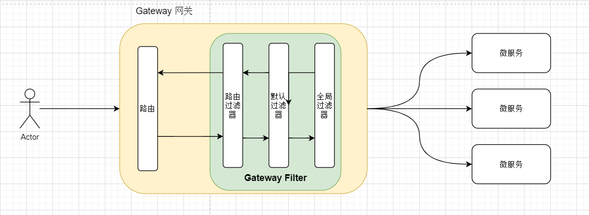

   

5. 过滤器执行优先级

   + GlobalFilter可以通过Order注解或者是实现Order接口来设定执行优先级。

   + 路由过滤器和DefaultFilter则是按声明顺序来自动设定Order的值，越靠前Order值越小（默认从0开始），这个顺序是由Spring指定的。

     ```yaml
     spring:
       application:
         name: gateway
       cloud:
         nacos:
           server-addr: localhost:8848
         gateway:
           routes:
             - id: user-service
               uri: lb://userService 
               predicates:
                 - Path=/users/**
                 - Before=2031-04-13T15:14:47.433+08:00[Asia/Shanghai]
               filters: # 当前路由过滤器
                 - AddRequestHeader=requestTag11, ilovesshan11 # 【默认Order值是1】
                 - AddRequestHeader=requestTag22, ilovesshan22 # 【默认Order值是2】
             - id: order-service
               uri: lb://orderServer
               predicates:
                 - Path=/orders/**
           default-filters: # 全局路由过滤器
             - AddRequestHeader=requestTag33, ilovesshan33 # 【默认Order值是1】
             - AddRequestHeader=requestTag44, ilovesshan44 # 【默认Order值是2】
             - AddRequestHeader=requestTag55, ilovesshan55 # 【默认Order值是3】
     ```

     

   + 前路由过滤器和DefaultFilter、GlobalFilter的Order值相同情况下，谁先执行呢？

     + DefaultFilter > 前路由过滤器 > GlobalFilter

   


### Gateway 跨域处理

1. 造成跨域原因？

   + 造成跨域原因大多数是Ajax访问服务器时，受到浏览器同源策略限制，所以跨域。
   + 同源策略限？以下三种其中一种不同都会造成跨域！！
     + 协议
     + 域名
     + 端口

2. Gateway 中如何处理跨域呢？

   + 通过CORS解决跨域问题。CORS跨域要配置的参数包括哪几个？

     + 允许哪些域名跨域？
     + 允许哪些请求头？
     + 允许哪些请求方式？
     + 是否允许使用cookie？
     + 有效期是多久？

     

   + 配置CORS跨域详细写法~

     ```yaml
     spring:
       application:
         name: gateway
       cloud:
         nacos:
           server-addr: localhost:8848
         gateway:
           globalcors:
             cors-configurations:
               '[/**]':
                 # 允许向该服务器提交请求的URI
                 allowedOrigins:
                   - "http://localhost:5500"
                   - "http://www.leyou.com"
                 # 允许跨域的方法
                 allowedMethods:
                   - GET
                   - POST
                   - DELETE
                   - PUT
                 # 预检请求的缓存时间（秒），即在这个时间段里对于相同的跨域请求不会再预检
                 maxAge: 180
                 allowedHeaders: "*" # 允许在请求中携带的头信息
                 allowCredentials: true # 是否允许携带cookie
     ```

     

   + 配置CORS，懒人版写法，一律写\*…

     ```yaml
     spring:
       application:
         #服务名配置
         name: app-gateway
       cloud:
         gateway:
           globalcors:
             cors-configurations:
               '[/**]':
                 #是否允许cookie跨域  true允许
                 allowCredentials: true
                 #允许跨域的url * 则允许全部
                 allowedOrigins: '*'
                 # 允许跨域的方法 * 则全部
                 allowedMethods: '*'
                 # 跨域预检时间
                 maxAge: 180
     ```

     


## MQ 

### 同步通信和异步通信

1. 同步通信的概念
   + 以数据块为单位进行发送,每个数据块包含多个字符,每个字符5-8bit。每个数据块前面加上起始标志,后面加上结束标志。
2. 异步通信的概念
   + 以字符为单位发送,一次传输一个字符,每个字符5- 8bit,字符前面有一个起始位,后面有1个或2个停止位。无字符发送时一直发送停止位。
3. 同步和异步通信的举例
   + 车道
     + 【同步】只有一个车道，同一时刻只能有一辆车通过，剩余的车都在后面排队等。
     + 【异步】有8个车道，同时可以通过8辆车，大大提高车流量。
   + 取快递
     + 【同步】送快递的面对面交给你，交互过程中双方都需要在同一时间内反应，否则会造成另一方阻塞等待。
     + 【异步】送快递的放在门卫或快递箱，你自己去取，中间不是同步完成的。


### 同步调用的优缺点

1. 卡面学习的微服务中，基于feign的远程服务调用就是同步调用，那么同步调用有什么缺点呢？

   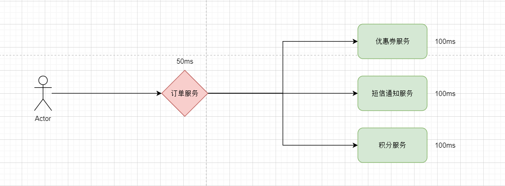

   

2. 同步调用缺点

   + 性能下降，吞吐量低，调用者需要等待服务提供者响应，如果调用链过长则响应时间等于每次调用的时间之和。
   + 系统资源浪费，调用链中的每个服务在等待响应过程中，不能释放请求占用的资源，高并发场景下会极度浪费系统资源。
   + 耦合度高，每次加入新的需求，都要修改原来的代码。
   + 级联失败，如果服务提供者出现问题，所有调用方都会跟着出问题，如同多米诺骨牌一样，迅速导致整个微服务群故障。

3. 同步调用优点

   + 时效性较强，可以立即得到结果。
   + 业务逻辑线较清晰。


### 异步调用优缺点

1. 异步调用通过事件发布和订阅者模式，用户调用下单接口后会发出一个事件到Broker中，这时候下单接口就可以给用户响应了，至于那些订阅该事件的服务受到通知后就慢慢去异步执行。

   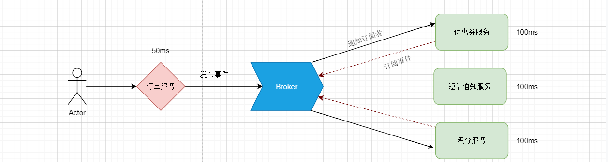

   

2. 异步调用优点

   + 代码解耦，新增功能和消减功能无需修改源代码，只需要控制是否订阅该事件。
   + 吞吐量提高，下单接口的吞吐量大大提高。
   + 故障隔离，假如远程服务挂了其中一个并不会影响其他服务，也不会导致整个微服务群故障。
   + 流量削峰，高并发下大量的请求信息会形成一个队列堆积在Broker中，由Broker从队列中取出消息通知给订阅者。

3. 异步调用缺点

   + 依赖于Broker的可靠性、安全性、吞吐能力。
   + 架构复杂了，业务没有明显的流程线，不好追踪管理。


### MessageQueue

1. MessageQueue意思就是消息队列，用来存放消息的队列，也就是事件驱动架构中的Broker。

2. 市面上常用的MQ有四个，分别是：RabbitMQ、ActiveMQ、RocketMQ、Kafka。

   |            | RabbitMQ               | ActiveMQ                           | RocketMQ   | Kafka      |
   | ---------- | ---------------------- | ---------------------------------- | ---------- | ---------- |
   | 公司/社区  | Rabbit                 | Apahce                             | 阿里       | Apahce     |
   | 开发语言   | Erlang                 | Java                               | Java       | Java&Scala |
   | 协议支持   | AMQP、XMPP、SMTP、STMP | OpenEire、STOPMP、REST、XMPP、AMQP | 自定义协议 | 自定义协议 |
   | 可用性     | 高                     | 一般                               | 高         | 高         |
   | 吞吐量     | 一般                   | 差                                 | 高         | 非常高     |
   | 消息延迟   | 微秒级                 | 毫秒级                             | 毫秒级     | 毫秒内     |
   | 消息可靠性 | 高                     | 一般                               | 高         | 一般       |


## RabbitMQ

### RabbitMQ 安装

1. RabbitMQ 是一个基于Erlang语言开发的消息中间件，RabbitMQ 官网地址：https://www.rabbitmq.com/

2. 在CentOS中通过Docker安装RabbitMQ 

   + 在线拉取镜像

     ```shell
     docker pull rabbitmq:3-management
     ```

     

   + 从本地加载

     ```shell
     docker load -i mq.tar
     ```

     

   + 安装MQ

     ```shell
     docker run \
      -e RABBITMQ_DEFAULT_USER=admin \
      -e RABBITMQ_DEFAULT_PASS=123456 \
      --name mq \
      --hostname mq1 \
      -p 15672:15672 \
      -p 5672:5672 \
      -d \
      rabbitmq:3-management
     ```

     

### RabbitMQ结构模型

1. RabbitMQ的工作结构

   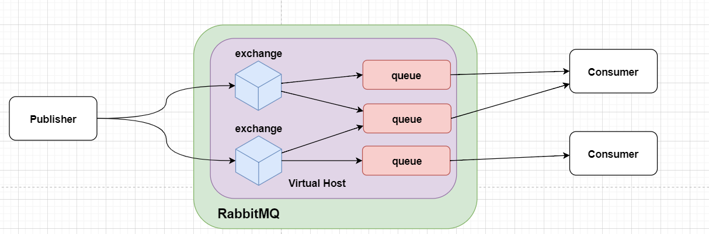

   

2. RabbitMQ中的几个概念

   + channel：操作MQ的工具
   + exchange：路由消息到队列中
   + queue：缓存消息
   + virtual host：虚拟主机，是对queue、exchange等资源的逻辑分组


### 常见消息模型

1. MQ的[官方文档](https://www.rabbitmq.com/getstarted.html)中给出了5个MQ的Demo示例，对应了几种不同的用法
   + 基本消息队列（BasicQueue）和工作消息队列（WorkQueue）。
   + 发布订阅（Publish、Subscribe），又根据交换机类型不同分为三种：
     + Fanout Exchange：广播
     + Direct Exchange：路由
     + Topic Exchange：主题

### 基础消息队列

1. 基础消息队列模型

   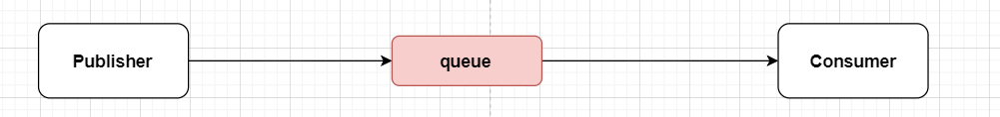

   

2. 基础消息队列涉及的角色

   + Publisher：消息发布者，负责将消息推送到队列中。

   + queue：消息队列，负责接收并缓存消息。

   + Consumer：消息消费者，负责处理消息队列中的消息。

     

3. 通过基础消息队列实现“hello, rabbitmq!”案例。

   + 新建父工程（rabbitmq）并添加相关依赖，再建两个子工程（consumer和publisher）分别编写SpringBoot的启动类。

     ```xml
     <dependencies>
         <!-- lombok -->
         <dependency>
             <groupId>org.projectlombok</groupId>
             <artifactId>lombok</artifactId>
         </dependency>
         <!--AMQP依赖，包含RabbitMQ-->
         <dependency>
             <groupId>org.springframework.boot</groupId>
             <artifactId>spring-boot-starter-amqp</artifactId>
         </dependency>
         <!--单元测试-->
         <dependency>
             <groupId>org.springframework.boot</groupId>
             <artifactId>spring-boot-starter-test</artifactId>
         </dependency>
     </dependencies>
     ```

     

   + publisher模块中编写单元测试代码

     ```java
     public class PublisherTest {
         @Test
         public void testSendMessage() throws IOException, TimeoutException {
             // 1.建立连接
             ConnectionFactory factory = new ConnectionFactory();
             // 1.1.设置连接参数，分别是：主机名、端口号、vhost、用户名、密码
             factory.setHost("192.168.186.129");
             factory.setPort(5672);
             factory.setVirtualHost("/");
             factory.setUsername("admin");
             factory.setPassword("123456");
             // 1.2.建立连接
             Connection connection = factory.newConnection();
     
             // 2.创建通道Channel
             Channel channel = connection.createChannel();
     
             // 3.创建队列
             String queueName = "simple.queue";
             channel.queueDeclare(queueName, false, false, false, null);
     
             // 4.发送消息
             String message = "hello, rabbitmq!";
             channel.basicPublish("", queueName, null, message.getBytes());
             System.out.println("发送消息成功：【" + message + "】");
     
             // 5.关闭通道和连接
             channel.close();
             connection.close();
     
         }
     }
     ```

     

   + consumer模块中编写单元测试代码

     ```java
     public class ConsumerTest {
     
         public static void main(String[] args) throws IOException, TimeoutException {
             // 1.建立连接
             ConnectionFactory factory = new ConnectionFactory();
             // 1.1.设置连接参数，分别是：主机名、端口号、vhost、用户名、密码
             factory.setHost("192.168.186.129");
             factory.setPort(5672);
             factory.setVirtualHost("/");
             factory.setUsername("admin");
             factory.setPassword("123456");
             // 1.2.建立连接
             Connection connection = factory.newConnection();
     
             // 2.创建通道Channel
             Channel channel = connection.createChannel();
     
             // 3.创建队列
             String queueName = "simple.queue";
             channel.queueDeclare(queueName, false, false, false, null);
     
             // 4.订阅消息
             channel.basicConsume(queueName, true, new DefaultConsumer(channel){
                 @Override
                 public void handleDelivery(String consumerTag, Envelope envelope, AMQP.BasicProperties properties, byte[] body) throws IOException {
                     // 5.处理消息
                     String message = new String(body);
                     System.out.println("接收到消息：【" + message + "】");
                 }
             });
             System.out.println("等待接收消息。。。。");
         }
     }
     ```

   + 分别运行publisher和consumer单元测试就可以看到效果了~~

4. 基本消息队列的消息发送流程

   + 建立connection
   + 创建channel
   + 利用channel声明队列
   + 利用channel向队列发送消息

5. 基本消息队列的消息接收流程

   + 建立connection
   + 创建channel
   + 利用channel声明队列
   + 定义consumer的消费行为handleDelivery()
   + 利用channel将消费者与队列绑定


## SpringAMQP

### SpringAMQP 简介

1. Spring AMQP是基于AMQP协议定义的一套API规范，提供了模板来发送和接收消息。包含两部分，其中spring-amqp是基础抽象，spring-rabbit是底层的默认实现。
2. Spring AMQP就像MyBatis封装JDBC一样，简化繁杂的开发过程一般，SpringAMQP则是基于RabbitMQ封装的一套模板，并且利用SpringBoot对其实现了自动装配，使用起来非常方便。

### Basic Queue 简单队列模型

1. 添加依赖（publisher和consumer都要添加，也可以在父工程中添加）。

   ```xml
   <!--AMQP依赖，包含RabbitMQ-->
   <dependency>
       <groupId>org.springframework.boot</groupId>
       <artifactId>spring-boot-starter-amqp</artifactId>
   </dependency>
   ```

2. 编写配置文件（publisher和consumer都要编写）

   ```yaml
   spring:
     rabbitmq:
       # 主机地址
       addresses: 192.168.186.129
       # 端口
       port: 5672
       # 虚拟主机地址
       virtual-host: /
       # 用户名
       username: admin
       # 密码
       password: 123456
   ```

3. 在publisher模块中编写代码，发布消息

   ```java
   @RunWith(SpringRunner.class)
   @SpringBootTest
   public class SpringAmqpConsumerTest {
   
       @Resource
       private RabbitTemplate rabbitTemplate;
   
       @Test
       public void test() {
           rabbitTemplate.convertAndSend("simple.queue", "[" + System.currentTimeMillis() + "] Hello SpringAMQP~~~");
       }
   }
   ```

4. 在consumer模块中编写代码，消费消息

   ```java
   @Component
   public class SpringAmqpConsumer {
       @RabbitListener(queues = "simple.queue")
       public void receive(String message) {
           System.out.println("接收到消息：【" + message + "】");
       }
   }
   ```


### Work Queue 工作队列模型

1. Work queue，工作队列，可以提高消息处理速度，避免队列消息堆积。

   + 特点
     + 多个消费者绑定到一个队列，同一条消息只会被一个消费者处理。
     + 通过设置prefetch来控制消费者预取的消息数量。

   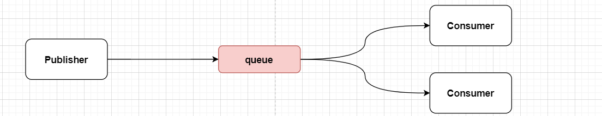

   

2. 模拟实现一个工作队列模型，一个队列绑定多个消费者。

   + 定义消息发布者，每秒发送50条消息。

     ```java
     @RunWith(SpringRunner.class)
     @SpringBootTest
     public class SpringAmqpConsumerTest {
     
         @Resource
         private RabbitTemplate rabbitTemplate;
     
         @Test
         public void testWorkQueue() throws InterruptedException {
             for (int i = 1; i <= 50; i++) {
                 rabbitTemplate.convertAndSend("simple.queue", "[" + i + "] Hello SpringAMQP~~~");
                 // 避免消息太快
                 Thread.sleep(20);
             }
         }
     }
     ```

   + 定义两个消息监听者，消费者1每秒处理50条消息，消费者2每秒处理5条消息。

     ```java
     @Component
     public class SpringAmqpConsumer {
         @RabbitListener(queues = "simple.queue")
         public void receiveBasicWorkMessage1(String message) throws InterruptedException {
             System.out.println("消费者1收到消息：【" + message + "】 ===> " + LocalDateTime.now());
             Thread.sleep(25);
         }
     
         @RabbitListener(queues = "simple.queue")
         public void receiveBasicWorkMessage2(String message) throws InterruptedException {
             System.err.println("消费者2收到消息：【" + message + "】 ===> " + LocalDateTime.now());
             Thread.sleep(100);
         }
     }
     ```

3. 消费预取限制

   ```yaml
   spring:
     rabbitmq:
       listener:
         simple:
           prefetch: 1 # 每次只能获取一条消息，处理完成才能获取下一个消息
   ```

   

### 发布订阅模式

1. 发布订阅模式和之前案例区别就是允许将同一消息发送给多个消费者。实现方式是加入了exchange（交换机）。

2. 常见exchange类型包括：Fanout（广播）、Direct（路由）、Topic（主题）。

   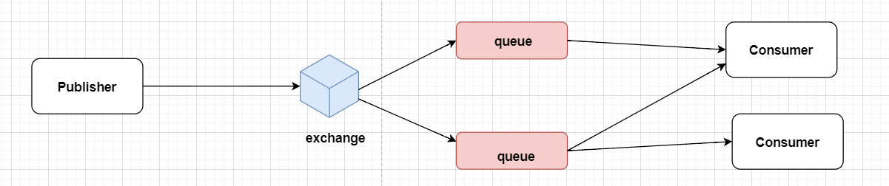

   

3. 注意：exchange负责消息路由，而不是存储，路由失败则消息丢失

### Fanout Exchange 模型

1. 在consumer服务中，利用代码声明队列、交换机，并将两者绑定。

   ```java
   @Configuration
   public class FanoutExchangeConfiguration {
   
       // 创建交换机
       @Bean
       public FanoutExchange fanoutExchange() {
           return new FanoutExchange("ilovesshan.fanout");
       }
   
   
       // 创建队列1
       @Bean
       public Queue queue1() {
           return new Queue("ilovesshan.queue1");
       }
   
       // 创建队列2
       @Bean
       public Queue queue2() {
           return new Queue("ilovesshan.queue2");
       }
   
       // 将队列1绑定到交换机上
       @Bean
       public Binding bindingQueue1(Queue queue1, FanoutExchange fanoutExchange) {
           return BindingBuilder.bind(queue1).to(fanoutExchange);
       }
   
       // 将队列2绑定到交换机上
       @Bean
       public Binding bindingQueue2(Queue queue2, FanoutExchange fanoutExchange) {
           return BindingBuilder.bind(queue2).to(fanoutExchange);
       }
   }
   ```

   

2. 在consumer服务中，编写两个消费者方法，分别监听fanout.queue1和fanout.queue2。

   ```java
   @Component
   public class SpringAmqpConsumer { 
       @RabbitListener(queues = "ilovesshan.queue1")
       public void receiveFanoutExchangeMessage1(String message) {
           System.out.println("消费者1收到消息：【" + message + "】 ===> " + LocalDateTime.now());
       }
   
       @RabbitListener(queues = "ilovesshan.queue2")
       public void receiveFanoutExchangeMessage2(String message) {
           System.out.println("消费者2收到消息：【" + message + "】 ===> " + LocalDateTime.now());
       }
   }
   
   ```

   

3. 在publisher中编写测试方法，向ilovesshan.fanout发送消息

   ```java
   @RunWith(SpringRunner.class)
   @SpringBootTest
   public class SpringAmqpConsumerTest {
       @Resource
       private RabbitTemplate rabbitTemplate;
   
       @Test
       public void testFanoutExchange(){
           // 发送消息，参数分别是：交互机名称、RoutingKey（暂时为空）、具体消息
           rabbitTemplate.convertAndSend("ilovesshan.fanout", "", " Hello every one ~~~");
       }
   }
   ```

   

### Direct Exchange 模型

1. Direct Exchange可以将消息发送给指定的消费者，publisher服务通过routingKey和consumer服务的bingdingKey做绑定，从而来实现消息发送给指定消费者。

2. 创建交换机、队列、消费者、绑定队列和交换机时，不再使用@Bean的方式申明Bean了，因为这种方式太繁琐了，我们可以使用@RabbitListener注解来完成这些Bean的声明及关系绑定，还有别忘记了给消费者添加一个“bindingKey”。

   ```java
   @Component
   public class SpringAmqpConsumer {
       @RabbitListener(bindings = @QueueBinding(
           // 创建队列
           value = @Queue("ilovesshan.queue1"),
           // 创建交换机(默认类型就是ExchangeTypes.DIRECT)
           exchange = @Exchange(name = "ilovesshan.direct", type = ExchangeTypes.DIRECT),
           // 设置 绑定key
           key = {"news", "weather"}
       ))
       public void receiveDirectExchangeMessage1(String message) {
           System.out.println("消费者1收到消息：【" + message + "】 ===> " + LocalDateTime.now());
       }
   
   
       @RabbitListener(bindings = @QueueBinding(
           value = @Queue("ilovesshan.queue2"),
           exchange = @Exchange(name = "ilovesshan.direct"),
           key = {"news", "people"}
       ))
       public void receiveDirectExchangeMessage2(String message) {
           System.err.println("消费者2收到消息：【" + message + "】 ===> " + LocalDateTime.now());
       }
   }
   ```

   

3. 在publisher服务中发布消息

   ```java
   @RunWith(SpringRunner.class)
   @SpringBootTest
   public class SpringAmqpConsumerTest {
   
       @Resource
       private RabbitTemplate rabbitTemplate;
       @Test
       public void testDirectExchange() {
           // key包含weather的消费者可以收到消息（1个）
           rabbitTemplate.convertAndSend("ilovesshan.direct", "weather", " Hello every one ~~~");
   
           // key包含news的消费者可以收到消息（2个）
           // rabbitTemplate.convertAndSend("ilovesshan.direct", "news", " Hello every one ~~~");
       }
   }
   ```


### Topic Exchange 模型

1. Topic Exchange 模型其实和Direct Exchange 模型差不多，Topic Exchange就只是在Direct Exchange基础上增加了key匹配通配符。

   + \* 单个字符
   + \# 任意长度字符

2. 在consumer服务中消费消息

   ```java
   @Component
   public class SpringAmqpConsumer {   
       @RabbitListener(bindings = @QueueBinding(
           value = @Queue("topic.queue1"),
           exchange = @Exchange(name = "ilovesshan.topic", type = ExchangeTypes.TOPIC),
           // 配置 china.任意字符
           key = {"china.#"}
       ))
       public void receiveTopicExchangeMessage1(String message) {
           System.out.println("消费者1收到消息：【" + message + "】 ===> " + LocalDateTime.now());
       }
   
   
       @RabbitListener(bindings = @QueueBinding(
           value = @Queue("topic.queue2"),
           exchange = @Exchange(name = "ilovesshan.topic", type = ExchangeTypes.TOPIC),
           // 配置 任意字符.news
           key = {"#.news"}
       ))
       public void receiveTopicExchangeMessage2(String message) {
           System.err.println("消费者2收到消息：【" + message + "】 ===> " + LocalDateTime.now());
       }
   }
   
   ```

   

3. 在publisher服务中发布消息

   ```java
   @RunWith(SpringRunner.class)
   @SpringBootTest
   public class SpringAmqpConsumerTest {
       @Test
       public void testTopicExchange() {
           // 两个消费者都可以接收到消息
           // rabbitTemplate.convertAndSend("ilovesshan.topic", "china.news", "学习微服务~~");
   
           // 消费者(key包含chins.#)可以接收到消息
           rabbitTemplate.convertAndSend("ilovesshan.topic", "china.weather", "今天天气很OK~~");
       }
   }
   
   ```


### MessageConveter 消息转换器 

1. 之前在向队列中发送的都是简单消息（一串字符串，字符序列），那么试想一下发送一个JavaBean、Map对象或者Object可以吗？因为在实际开发中传递消息并不是一个简简单单的字符串，而是使用JavaBean或者Map数据类型的场景较多。

2. 向队列中发送一个Map或者JavaBean试试。

   + 发布消息

     ```java
     @Test
     public void testObjectQueue() {
         HashMap<Object, String> data = new HashMap<>();
         data.put("name", "ilovesshan");
         data.put("time", LocalDateTime.now().toString());
         rabbitTemplate.convertAndSend("object.exchange","objectKey", data);
     }
     ```

     

   + 消费消息

     ```java
     @RabbitListener(bindings = @QueueBinding(
         value = @Queue("object.queue"),
         exchange = @Exchange(value = "object.exchange", type = ExchangeTypes.DIRECT),
         key = "objectKey"
     ))
     public void receiveTopicExchangeMessage1(HashMap<Object, String> message) {
         System.out.println("消费者收到消息：【" + message + "】");
     }
     ```

     ```tex
     消费者收到消息：【{name=ilovesshan, time=2023-04-13T09:55:12.242}】
     ```

     

   + 在RabbitMQ的控制台中可以发现，队列中的消息是一串字节，并不能直接看到我们发送的Map信息（JavaBean也一样），但是在消费者接收消息的时候可以正确获取到消息，那只能说明SpringBoot可能帮我们做了处理了。

     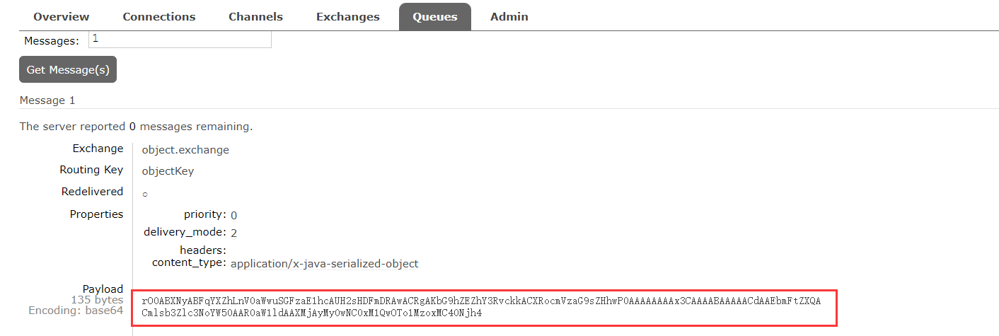

   

3. Spring的对消息对象的处理是由org.springframework.amqp.support.converter.MessageConverter来处理的。而默认实现是SimpleMessageConverter，基于JDK的ObjectOutputStream完成序列化。

4. 如果要修改只需要定义一个MessageConverter 类型的Bean即可。推荐用JSON方式序列化，步骤如下：

   + 在consumer和publisher中引入依赖（也可以在父工程中引入）

     ```xml
     <dependency>
         <groupId>com.fasterxml.jackson.core</groupId>
         <artifactId>jackson-databind</artifactId>
     </dependency>
     ```

     

   + 在consumer和publisher中定义

     ```java
     @Bean
     public MessageConverter jsonMessageConverter(){
         return new Jackson2JsonMessageConverter(); 
     }
     ```

   + 现在就可以清晰看到数据信息了

     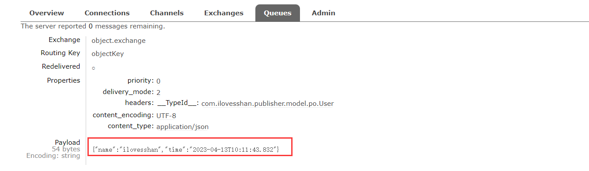


## 环境依赖对照表

1. 环境依赖

   | 环境/依赖名称 | 版本号    |
   | :------------ | --------- |
   | jdk           | 1.8.0_181 |
   | maven         | 3.3.9     |
   | nacos         | 1.4.1     |

   

2. jar包依赖

   | 环境/依赖名称                                | 版本号        |
   | :------------------------------------------- | ------------- |
   | jdk                                          | 1.8.0_181     |
   | maven                                        | 3.3.9         |
   | nacos                                        | 1.4.1         |
   | spring-boot-starter-parent                   | 2.3.9.RELEASE |
   | spring-boot-starter                          | 2.3.4.RELEASE |
   | spring-boot-starter-web                      | 2.3.9.RELEASE |
   | spring-cloud-dependencies                    | Hoxton.SR10   |
   | spring-cloud-starter-netflix-eureka-server   | 2.2.7.RELEASE |
   | spring-cloud-alibaba-dependencies            | 2.2.6.RELEASE |
   | spring-cloud-starter-alibaba-nacos-discovery | 2.2.6.RELEASE |
   | spring-cloud-starter-alibaba-nacos-config    | 2.2.6.RELEASE |
   | spring-cloud-starter-openfeign               | 2.2.7.RELEASE |
   | feign-httpclient                             | 10.10.1       |
   | spring-cloud-starter-gateway                 | 2.2.7.RELEASE |

