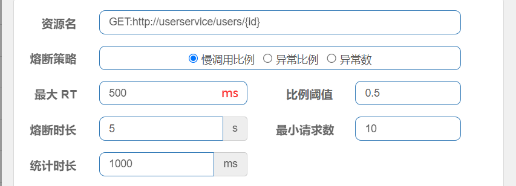
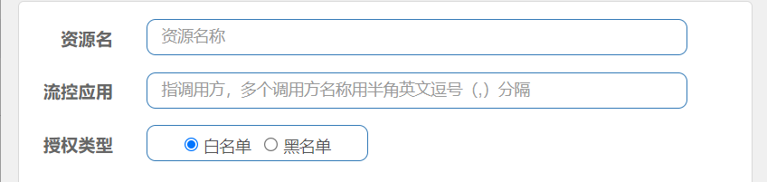

Spring Cloud

## 微服务导学

### 什么是微服务

1. 微服务简单总结就是：微服务是一种架构风格，将一个大的项目拆分成多个模块（服务），每一个模块可以独立运行。
2. 总结的确实有点简单，对于初学者来说知道这个概念就OK了。
3. 至于为什么要拆分成多个模块？怎么样拆分模块？拆分的模块如何进行管理和维护，各个模块之间如何通信？这些都不用担心，后面会学习！！


### 单体架构

1. 先看一个单体架构的简单结构图，项目中使用同一个数据库，而且没有对项目服务模块拆分，而是将项目部署在同一台服务器上。

   

2. 单体架构有什么优点？

   + 部署简单、架构成本低，比较适用于中小型项目。

3. 单体架构的缺点？

   + 项目代码耦合度高、扩展性差、一旦服务器宕机整个项目将无法运行。
   + 单体架构所有的模块开发都是要使用一样的技术。

### 分布式架构

1. 下面是基于分布式架构的简单示意图，将项目的模块进行了拆分并且部署到不同的服务器上、每个模块都对应不同的数据库。

   

2. 分布式架构有什么优点？

   + 代码松耦合、扩展性较强、每个模块都可以使用不同的技术开发模式更灵活。
   + 即使是某个服务器宕机、也不会影响整个项目，微服务架构比较适用于开发互联网大型项目，例如：京东、淘宝。

3. 分布式架构的缺点？

   + 架构比较复杂、开发难度较大。

     

### 微服务架构

1. 微服务架构是经过良好架构设计的分布式架构方案，微服务架构特点：
   + 单一职责：微服务拆分力度更小，每一个服务都对应唯一的业务能力，做到单一职责避免业务重复开发。
   + 面向服务：微服务对外暴露业务接口，方便各模块之间数据通信。
   + 独立自治：团队对立、技术独立、数据独立、部署独立。
   + 隔离性：服务调用做好隔离、容错、降级避免出现级联问题。
2. 微服务是一种良好的分布式架构方案
   + 优点：拆分力度更小、服务更独立、耦合度更低。
   + 缺点：架构非常复杂、监控、部署难度提高。


### Spring Cloud 简介

1. Spring Cloud是目前国内使用最广泛的微服务框架，官网地址：https://spring.io/projects/spring-cloud。

2. SpringCloud集成了各种微服务功能组件，并基于springcloud实现了这些组件的自动装配，从而提供了良好的开箱即用体验

   + 服务注册发现

     + Eureka、Nacos、Consul

   + 统一配置管理

     + SpringCloudConfig、Nacos

   + 服务远程调用

     + OpenFeign、Dubbo

   + 统一网关路由

     + SpringCloudGateway、Zuul

   + 服务链路监控

     + ZipKin、Sleuth

   + 流控、降级、保护

     + Hystrix、Sentinel

       

3. Spring Cloud和Spring Boot版本查询地址： https://start.spring.io/actuator/info 

4. Spring Cloud和Spring Boot版本关系对照表

   | SpringCloud                                                  | SpringBoot                            |
   | ------------------------------------------------------------ | ------------------------------------- |
   | [2022.0.x](https://github.com/spring-cloud/spring-cloud-release/wiki/Spring-Cloud-2022.0-Release-Notes) aka Kilburn | 3.0.x                                 |
   | [2021.0.x](https://github.com/spring-cloud/spring-cloud-release/wiki/Spring-Cloud-2021.0-Release-Notes) aka Jubilee | 2.6.x, 2.7.x (Starting with 2021.0.3) |
   | [2020.0.x](https://github.com/spring-cloud/spring-cloud-release/wiki/Spring-Cloud-2020.0-Release-Notes) aka Ilford | 2.4.x, 2.5.x (Starting with 2020.0.3) |
   | [Hoxton](https://github.com/spring-cloud/spring-cloud-release/wiki/Spring-Cloud-Hoxton-Release-Notes) | 2.2.x, 2.3.x (Starting with SR5)      |
   | [Greenwich](https://github.com/spring-projects/spring-cloud/wiki/Spring-Cloud-Greenwich-Release-Notes) | 2.1.x                                 |
   | [Finchley](https://github.com/spring-projects/spring-cloud/wiki/Spring-Cloud-Finchley-Release-Notes) | 2.0.x                                 |
   | [Edgware](https://github.com/spring-projects/spring-cloud/wiki/Spring-Cloud-Edgware-Release-Notes) | 1.5.x                                 |
   | [Dalston](https://github.com/spring-projects/spring-cloud/wiki/Spring-Cloud-Dalston-Release-Notes) | 1.5.x                                 |


### 微服务拆分案例

1. 将项目拆分成两个模块，分别是user-server（用户模块）和order-service（订单模块），springcloud01作为user-server和order-server的父模块，user-server和order-server都是springboot项目（需要手动补充启动类和相关配置文件application.yml，因为这是创建的Maven工程而不是通过spring initializr创建的工程），我们需要在springcloud01的pom文件中引入公共依赖，再在user-server和order-server子工程中引入所需要的依赖。

   ```xml
   <!-- 将当前项目声明为 springcloud 项目 -->
   <parent>
       <groupId>org.springframework.boot</groupId>
       <artifactId>spring-boot-starter-parent</artifactId>
       <version>2.3.9.RELEASE</version>
       <relativePath/>
   </parent>
   
   <!-- 定义依赖版本 -->
   <properties>
       <maven.compiler.source>8</maven.compiler.source>
       <maven.compiler.target>8</maven.compiler.target>
       <spring-boot-starter-web.version>2.3.4.RELEASE</spring-boot-starter-web.version>
       <mysql-connector-j.version>8.0.32</mysql-connector-j.version>
       <mybatis-spring-boot-starter.version>2.2.2</mybatis-spring-boot-starter.version>
       <spring-cloud-dependencies.version>Hoxton.SR10</spring-cloud-dependencies.version>
       <lombok.version>1.18.26</lombok.version>
   </properties>
   
   <dependencyManagement>
       <dependencies>
           <!-- spring-cloud依赖 -->
           <dependency>
               <groupId>org.springframework.cloud</groupId>
               <artifactId>spring-cloud-dependencies</artifactId>
               <version>${spring-cloud-dependencies.version}</version>
               <type>pom</type>
           </dependency>
   
           <dependency>
               <groupId>org.springframework.boot</groupId>
               <artifactId>spring-boot-starter-web</artifactId>
               <version>${spring-boot-starter-web.version}</version>
           </dependency>
   
           <dependency>
               <groupId>com.mysql</groupId>
               <artifactId>mysql-connector-j</artifactId>
               <version>${mysql-connector-j.version}</version>
           </dependency>
   
           <dependency>
               <groupId>org.mybatis.spring.boot</groupId>
               <artifactId>mybatis-spring-boot-starter</artifactId>
               <version>${mybatis-spring-boot-starter.version}</version>
           </dependency>
   
           <dependency>
               <groupId>org.projectlombok</groupId>
               <artifactId>lombok</artifactId>
               <version>${lombok.version}</version>
           </dependency>
       </dependencies>
   </dependencyManagement>
   ```

   

2. user-server使用 springcloud-user数据库，order-service使用 springcloud-order数据库，再分别提供一个根据ID查询信息的接口。省略了实体类、service层和mapper层代码...（和平时使用springboot框架开发一样搞就行了）。

   + springcloud-user

     ```java
     @RestController
     @RequiredArgsConstructor
     public class UserController {
     
         private final UserService userService;
     
         @GetMapping("/{id}")
         public Object getUserById(@PathVariable("id") Integer id) {
             return userService.selectById(id);
         }
     }
     ```

     

   + order-service

     ```java
     @RestController
     @RequiredArgsConstructor
     public class OrderController {
     
         private final OrderService orderService;
     
         @GetMapping("/{id}")
         public Object getOrderById(@PathVariable("id") Integer id) {
             return orderService.selectById(id);
         }
     }
     ```

3. 分别配置user-server和order-server的application.yml文件，因为他们是两个单独的服务，使用的数据库也不一样，所以要单独配置服务端口和数据库连接信息。

   + user-server

     ```yaml
     server:
       port: 8081
       servlet:
         context-path: /orders
     
     spring:
       datasource:
         driver-class-name: com.mysql.cj.jdbc.Driver
         url: jdbc:mysql://localhost:3306/springcloud-order
         username: root
         password: 123456
     
     mybatis:
       configuration:
         log-impl: org.apache.ibatis.logging.stdout.StdOutImpl
         map-underscore-to-camel-case: true
     ```

     

   + order-server

     ```yaml
     server:
       port: 8082
       servlet:
         context-path: /users
     
     spring:
       datasource:
         driver-class-name: com.mysql.cj.jdbc.Driver
         url: jdbc:mysql://localhost:3306/springcloud-user
         username: root
         password: 123456
     
     mybatis:
       configuration:
         log-impl: org.apache.ibatis.logging.stdout.StdOutImpl
         map-underscore-to-camel-case: true
     ```

4. 浏览器访问两个服务的接口

   + user-server

     

   + order-server

     


### 服务间接口调用

1. 现在有一个新需求，访问订单信息的时候，需要拿到用户信息！

   + 在单体架构中，我们搞一个UserService调一下业务方法就ok了，但是现在不是单体架构是基于微服务架构，用户模块和订单模块已经分开了，部署在两个不同的服务器。
   + order-server模块怎么样才能访问到user-server模块的数据呢？
     + 浏览器可以发送HTTP请求去获取user-server中的数据，user-server到时候会响应一串json字符串回来。
     + 那么在order-server模块中不一样也可以发送HTTP请求嘛，我在OrdeService中请求user-serve模块中的接口，user-server到时候再给我响应一串json，我都能拿到数据了，我自己再处理一下不就ok了？
     + 有了这个思路，那就成功了一大半了，在SprinBoot项目中可以使用RestTemplate对象发送Http请求，RestTemplate还能够将json字符串转成JavaBean对象，太爽了...

2. 微服务调用方式

   + 基于RestTemplate发起的HTTP请求实现远程调用。
   + HTTP请求做远程调用是与语言无关的调用，只要知道对方的ip、端口、接口路径、请求参数即可。

3. 使用RestTemplate访问服务API接口

   + 先将RestTemplate注入到Sring容器中

     ```java
     @Configuration
     public class AppConfiguration {
         /**
          * RestTemplate 提供远程服务接口调用能力
          */
         @Bean
         public RestTemplate restTemplate() {
             return new RestTemplate();
         }
     }
     ```

     

   + 在OrderService的业务方法中，使用RestTemplate访问服务API接口

     ```java
     @Service
     @RequiredArgsConstructor
     public class OrderServiceImpl implements OrderService {
     
         private final OrderMapper orderMapper;
         private final RestTemplate restTemplate;
     
         @Override
         public Order selectById(Integer id) {
             Order order = orderMapper.selectById(id);
     
             // 通过 restTemplate 调用user-service服务模块的API接口
             String url = "http://localhost:8082/users/" + order.getUserId();
             User user = restTemplate.getForObject(url, User.class);
             order.setUser(user);
             return order;
         }
     }
     
     ```

     

   + 浏览器测试（okok，搞定~~）

     


## Eureka 注册中心

### Eureka 解决什么问题

1. 远程服务调用中出现的问题

   

   

2. Eureka 注册中心其实就可以解决上述问题，Eureka原理简单示意图。

   

   


### 服务提供者和服务消费者

1. 什么是服务提供者？什么是服务消费者？
   + order-server调用user-server的服务接口，那么user-server就是服务提供者，反之order-server就是服务消费者！
2. A服务调用B服务，B服务又调用C服务，那么B是服务提供者还是服务消费者？
   + 这是一个相对问题概念，B服务对于A服务来说B服务就充当服务提供者，B服务对C服务来说B服务就充当服务消费者。
   + 任何一个服务都可以充当服务提供者角色也可以充当服务消费者角色，只不过看相对于谁。
3. 在Eureka架构中，微服务角色有两类
   + EurekaServer：服务端，注册中心
     + 记录服务信息、心跳监控
   + EurekaClient：客户端
     + Provider：服务提供者，例如案例中的 user-server
       + 注册自己的信息到EurekaServer
       + 每隔30秒向EurekaServer发送心跳
     + consumer：服务消费者，例如案例中的 order-server
       + 根据服务名称从EurekaServer拉取服务列表
       + 基于服务列表做负载均衡，选中一个微服务后发起远程调用

### 搭建Eureka Server

1. 引入依赖（需要新建立一个模块eureka-server，案例代码还是在springcloud01工程基础上），依赖统一在父工程进行声明。

   ```xml
   <!-- 手动指定了版本号、按道理可以不用管版本号的（可能是Maven或者IDEA问题）-->
   <dependency>
       <groupId>org.springframework.cloud</groupId>
       <artifactId>spring-cloud-starter-netflix-eureka-server</artifactId>
       <version>3.1.5</version>
   </dependency>
   ```

2. 启动类添加@EnableEurekaServer注解

   ```java
   @EnableEurekaServer
   @springcloudApplication
   public class EurekaApplication {
       public static void main(String[] args) {
           SpringApplication.run(EurekaApplication.class, args);
       }
   }
   ```

   

3. 编辑配置文件

   ```yaml
   server:
   # eureka 服务端口
     port: 10010
   
   spring:
     application:
       # eureka 服务名称
       name: eurekaServer
   
   eureka:
     client:
       service-url:
         # eureka 服务运行地址(浏览器访问的是http://127.0.0.1:10010, 但是eureka/后缀不能省略)
         defaultZone: http://127.0.0.1:10010/eureka/
   ```

   

4. 浏览器访问：http://localhost:10010/，在DS Replicas下，Instances currently registered with Eureka中会发现有一个运行实例，名字叫：EUREKASERVER，这就是当前的Eureka服务（也被注册到注册中心了）。

   

   

### 服务注册

1. 在user-server和order-server模块中分别添加依赖

   ```xml
   <!-- 注意：这是eureka的客户端依赖， 上面那个是eureka服务端依赖，可以使用相同版本-->
   <dependency>
       <groupId>org.springframework.cloud</groupId>
       <artifactId>spring-cloud-starter-netflix-eureka-client</artifactId>
   </dependency>
   ```

   

2. 在user-server和order-server模块中分别添加配置

   ```yaml
   spring:
     application:
       # 配置服务名称（order-server模块同理）
       name: userService
   
   eureka:
     client:
       service-url:
         # 配置服务地址，将当前服务注册到该地址上
         defaultZone: http://127.0.0.1:10010/eureka/
   ```

   

3. 重启服务，再次访问http://localhost:10010/

   

   

4. 重启之后，再次访问页面，如果界面中有一串下面这种红色文字，可以参考：https://blog.csdn.net/hadues/article/details/105023709

   `EMERGENCY! EUREKA MAY BE INCORRECTLY CLAIMING INSTANCES ARE UP WHEN THEY'RE NOT. RENEWALS ARE LESSER THAN THRESHOLD AND HENCE THE INSTANCES ARE NOT BEING EXPIRED JUST TO BE SAFE`

   

### 服务发现

1. 服务发现主要就是来解决，远程服务调用中存在的问题呗！

   + IP地址和端口号硬编码问题，多个服务如何做负载均衡？

     

2. 在OrderServiceImpl业务方法中进行代码修改

   ```java
   @Service
   @RequiredArgsConstructor
   public class OrderServiceImpl implements OrderService {
   
       private final OrderMapper orderMapper;
       private final RestTemplate restTemplate;
   
       @Override
       public Order selectById(Integer id) {
           Order order = orderMapper.selectById(id);
   
           // 通过 restTemplate 调用user-service服务模块的API接口
           // String url = "http://localhost:8082/users/" + order.getUserId();
   
           // 对于IP地址和端口号不再采用硬编码方式，而是通过服务名称向eureka注册中心索要服务信息
           String url = "http://userServer/users/" + order.getUserId();
           User user = restTemplate.getForObject(url, User.class);
           order.setUser(user);
           return order;
       }
   }
   
   ```

   

3. 如何做服务负载均衡？在配置RestTemplateBean的时候，方法上面加一个@LoadBalanced注解就搞定了！

   ```java
   @Configuration
   public class AppConfiguration {
   
       @LoadBalanced
       @Bean
       public RestTemplate restTemplate() {
           return new RestTemplate();
       }
   }
   ```

4. 重启order-server服务，浏览器多次访问http://localhost:8081/orders/id，观察控制台会发现8083/8082服务器会交替响应客户请求，说明负载均衡是有效果的。


## Ribbon 负载均衡

### 负载均衡流程

1. 负载均衡流程

   

   

### 负载均衡策略

1. IRule接口

   

   

2. Ribbon的负载均衡规则是一个叫做IRule的接口来定义的，每一个子接口都是一种规则：

   | **内置负载均衡规则类**    | **规则描述**                                                 |
   | ------------------------- | ------------------------------------------------------------ |
   | RoundRobinRule            | 简单轮询服务列表来选择服务器。它是Ribbon默认的负载均衡规则。 |
   | AvailabilityFilteringRule | 对以下两种服务器进行忽略： （1）在默认情况下，这台服务器如果3次连接失败，这台服务器就会被设置为“短路”状态。短路状态将持续30秒，如果再次连接失败，短路的持续时间就会几何级地增加。（2）并发数过高的服务器。如果一个服务器的并发连接数过高，配置了AvailabilityFilteringRule规则的客户端也会将其忽略。并发连接数的上限，可以由客户端的\<clientName>.\<clientConfigNameSpace>.ActiveConnectionsLimit属性进行配置。 |
   | WeightedResponseTimeRule  | 为每一个服务器赋予一个权重值。服务器响应时间越长，这个服务器的权重就越小。这个规则会随机选择服务器，这个权重值会影响服务器的选择。 |
   | ZoneAvoidanceRule         | 以区域可用的服务器为基础进行服务器的选择。使用Zone对服务器进行分类，这个Zone可以理解为一个机房、一个机架等。而后再对Zone内的多个服务做轮询。 |
   | BestAvailableRule         | 忽略那些短路的服务器，并选择并发数较低的服务器。             |
   | RandomRule                | 随机选择一个可用的服务器。                                   |
   | RetryRule                 | 重试机制的选择逻辑                                           |

   

3. 配置 负载均衡策略

   + 代码方式：在order-server中的OrderApplication类中，定义一个新的IRule

     ```java
     @Bean
     public IRule randomRule(){ 
         return new RandomRule();
     }
     ```

   + 配置文件方式：在order-server的application.yml文件中，添加新的配置也可以修改规则：

     ```yaml
     userservice:
       ribbon:
       	# 负载均衡规则 
         NFLoadBalancerRuleClassName: com.netflix.loadbalancer.RandomRule
     ```

     

### 饥饿加载

1. Ribbon默认是采用懒加载，即第一次访问时才会去创建LoadBalanceClient，请求时间会很长，而饥饿加载则会在项目启动时创建，降低第一次访问的耗时，通过下面配置开启饥饿加载：

   ```yaml
   ribbon:
     eager-load:
       enabled: true # 开启饥饿加载 
         clients: userservice # 指定对userservice这个服务饥饿加载 
   ```

   

## Nacos 注册中心

### Nacos 简介

1. Nacos官网地址：https://nacos.io/zh-cn/docs/v2/what-is-nacos.html
2. Nacos官网Github地址：https://github.com/alibaba/nacos
3. 什么是Nacos
   + Nacos /nɑ:kəʊs/ 是 Dynamic Naming And Configuration Service的首字母简称，一个更易于构建云原生应用的动态服务发现、配置管理和服务管理平台。
   + Nacos 致力于帮助您发现、配置和管理微服务。Nacos 提供了一组简单易用的特性集，帮助您快速实现动态服务发现、服务配置、服务元数据及流量管理。
   + Nacos 帮助您更敏捷和容易地构建、交付和管理微服务平台。 Nacos 是构建以“服务”为中心的现代应用架构 (例如微服务范式、云原生范式) 的服务基础设施。
4. Nacos 的关键特性
   + 服务发现和服务健康监测
   + 动态配置服务
   + 动态 DNS 服务
   + 服务及其元数据管理

### Nacos 环境搭建

1. 下载Nacos，直接到Github下载即可，[Nacos 1.X](https://nacos.io/zh-cn/docs/quick-start.html)是老版本，将来会停止维护。 建议您使用[2.X版本](https://nacos.io/zh-cn/docs/v2/quickstart/quick-start.html)。Nacos的下载地址：https://github.com/alibaba/nacos/releases。

2. 可以根据需求下载Linux版本或者Windows版本（我选择Windows），下载之后解压。

   + bin：启动目录
   + conf：配置文件

   

   

3. Ncos端口配置

   + Nacos的默认端口是8848，如果你电脑上的其它进程占用了8848端口，请先尝试关闭该进程。如果无法关闭占用8848端口的进程，也可以进入nacos的conf目录，修改application.properties配置文件中的端口。

     

4. 启动Nacos

   + 进入到bin目录下执行

     ```bat
     startup.cmd -m standalone
     ```

   + 显式下面LOGO信息，并且无报错就表示启动成功了

     

   

5. 浏览器输入：http://192.168.1.168:8848/nacos/index.html，能够正常访问就表示OK了！！

   

### Nacos 服务注册

1. 父工程中添加spring-cloud-alilbaba的管理依赖（将之前代码copy了一份叫做springcloud-nacos）。

   ```xml
   <dependency>
       <groupId>com.alibaba.cloud</groupId>
       <artifactId>spring-cloud-alibaba-dependencies</artifactId>
       <version>2.2.6.RELEASE</version>
       <type>pom</type>
       <scope>import</scope>
   </dependency>
   ```

   

2. 注释掉order-service和user-service中原有的eureka依赖，再添加nacos的客户端依赖

   ```xml
   <dependency>
       <groupId>com.alibaba.cloud</groupId>
       <artifactId>spring-cloud-starter-alibaba-nacos-discovery</artifactId>
   </dependency>
   ```

   

3. 修改order-service和user-service的配置文件，注释eureka地址，添加nacos地址。

   ```yaml
   spring:
     cloud:
       nacos:
         # 配置Nacos 服务端地址(也可以不用配置，因为默认就是localhost:8848)
         server-addr: localhost:8848
   ```

   

4. 重新启动order-service和user-service服务，访问order-service接口，不报错表示已经成功将服务注册到Nacos上面了。

   + 需要提前将Nacos服务启动起来哈！！
   + 因为现在是将服务注册到Nacos上，而不是Eureka上面，所以eureka-service服务可以不用启动。

### Nacos 服务分级存储模型

1. 服务分级模型

   + 一级：服务，例如userService
   + 二级：集群，例如上海机房、北京机房
   + 三级：实例，北京机房部署了userService的实例

   

   

2. 服务跨集群调用问题

   + 服务调用尽可能选择本地集群服务调用，因为跨集群服务调用延迟较高。

   + 本地集群不可访问时，再去访问其它集群。

     

3. 配置服务集群属性

   + 简单理解就是，将user-service实例1部署到哪一个集群，将user-service实例2部署到哪一个集群，以此类推。在Nacos中默认集群名称叫做DEFAULT。

     

     

   + 修改服务的配置文件（user-service和order-service都需要修改）

     + 将user-service实例一（8082）和实例二（8083）以及order-service配置集群到HZ
     + 将user-service实例三（8084）配置集群到SH

     ```yaml
     spring:
       cloud:
         inetutils:
           # 配置Nacos 服务端地址
           default-ip-address: localhost:8848
         nacos:
           discovery:
               # 集群名称 杭州(HZ)
             cluster-name: HZ
     ```

     

     

### Nacos 负载均衡

1. 将集群属性配置好之后，访问http://localhost:8081/orders/id，会发现三个实例是随机访问的，其实并没有满足服务跨集群调用问题，优先访问本地集群，本地集群不能访问时再访问其他集群（这时候IDEA控制台会有警告信息，告诉你跨集群调用服务了）。

   

2. 其实这个问题，可以通过配置Nacos负载均衡来实现

   ```yaml
   # 在order-service中设置负载均衡的IRule为NacosRule，这个规则优先会寻找与自己同集群的服务
   userServer:
     ribbon:
       # 负载均衡规则 
       NFLoadBalancerRuleClassName: com.alibaba.cloud.nacos.ribbon.NacosRule 
   ```

3. 如果上述配置不生效，请查看项目中是否自定义了IRule负载均衡规则覆盖住NacosRule，例如：

   ```java
   @Bean
   public IRule iRule() {
       return new RandomRule();
   }
   ```

   

4. 负载均衡权重问题

   + 项目中可能一部分服务器性能较好，另一部分略差，那么多个并发请求时，当然是性能好的服务器处理更多的请求，就目前配置来看每个服务的访问频率都大差不差。

   + 要解决这个问题，我们可以在Nacos控制台上配置权重（默认是1），权重值是0.1 - 1之间， 权重值越大访问频率越高，如果权重是0，则完全不会被访问，直接在Nacos控制台更改权重就可以了。

     


### Nacos 环境隔离

1. Nacos中服务存储和数据存储的最外层都是一个名为namespace的东西，用来做最外层隔离。

2. 在Nacos控制台可以创建namespace，用来隔离不同环境。

   

3. 创建完成之后，会得到一个命名空间ID

   

4. 修改order-service的application.yml，添加namespace

   ```yaml
   spring:
     application:
       # 配置服务名称
       name: orderServer
       
     cloud:
       inetutils:
         # 配置Nacos 服务端地址
         default-ip-address: localhost:8848
       nacos:
         discovery:
           # 集群名称 杭州(HZ)
           cluster-name: HZ
           # 设置环境ID
           namespace: 71150466-bf99-45b3-9ec4-09524214570d
   ```

5. 重启order-service服务，再次访问http://localhost:8081/orders/101，会发现order-service调用user-service服务接口时失败了，因为不同namespace下的服务互相不可见。

   + order-service在dev命名空间下
   + user-service在默认的public(保留空间)命名空间下

   ```tex
   No instances available for userServer
   ```

### Nacos 临时和非临时实例

1. Nacos中默认都是临时实例，如果想将某个服务配置成非临时实例，可以修改对应服务的配置文件

   ```yml
   spring:
      nacos:
        # 设置为非临时实例
   	 ephemeral: false 
   ```

2. 临时实例和非临时实例有什么区别？

   + 临时实例
     + 采用心跳检测来告诉Nacos当前服务的状态。
     + 如果服务挂掉了，那么Nacos会从注册列表中将当前服务移除。
   + 非临时实例
     + Nacos主动询问当前服务的状态。
     + 如果服务挂掉了，Nacos不会从注册列表中将当前服务移除，而是继续等待服务重启。

### Nacos 统一配置管理

1. 微服务中每个服务都会有自己对应的配置文件，一般情况下我们修改了配置文件就需要重启服务器，每次都重启服务器那肯定是不可取的，有什么办法来解决这个痛点？

   + 我们可以将多个服务上线后可能会变更的配置信息交给Nacos来管理，将一些不变的配置到各自服务的配置文件即可，是的你没听错，Nacos不仅能做服务注册还能做配置管理。

   + Spring读取到Nacos配置文件之后再和本地文件做一个合并。

     

   

2. 添加Nacos配置文件文件，在Nacos控制台进行配置。

   + 注意分组（如果将配置建到dev下面，就需要在bootstrap.yml中添加分组配置），建议建到public下吧。

     

   + 填写配置信息，点击发布即可！

     

   

3. 服务中读取Nacos配置文件

   + 添加Nacos配置管理依赖

     ```xml
     <!-- nacos配置管理依赖 -->
     <dependency>
         <groupId>com.alibaba.cloud</groupId>
         <artifactId>spring-cloud-starter-alibaba-nacos-config</artifactId>
     </dependency>
     ```

     

   + 新建bootstrap.yml文件，可以删除掉application.yml文件中关于nacos的配置信息。

     ```yaml
     spring:
       application:
         # 服务名称
         name: userService
       profiles:
         # 开发环境 dev
         active: dev
       cloud:
         nacos:
           # 服务地址
           server-addr: localhost:8848
           config:
             # 文件扩展名(Nacos控制台配置的文件)
             file-extension: yaml
             # 如果将配置文件建立到其他组下(非public)，这里需要添加组的ID
             # namespace: 71150466-bf99-45b3-9ec4-09524214570d
     ```

     

   + 编写Controller，读取Nacos配置文件中信息

     ```java
     @RestController
     public class DateTimeController {
     
         @Value("${pattern.formatter}")
         private String datePattern;
     
         @GetMapping("/time")
         public String getCurrentTime() {
             return LocalDateTime.now().format(DateTimeFormatter.ofPattern(datePattern));
         }
     }
     ```

     

   + 访问：http://localhost:8082/time，成功了！！！

     

   

4. 注意点

   + 不是将所有的配置都放到Nacos中，维护起来比较麻烦。
   + 建议将一些关键参数，运行中需要调整的参数放到Nacos中。

### Nacos 配置热更新

1. 上面实现了在服务中读取Nacos中配置文件信息，这一节聊聊做Nacos配置文件热更新，让服务能够自动感知Nacos配置文件做了更新。

2. 实现配置热更新有两种方式

   + @Value属性注入 + @RefreshScope方式

     ```java
     @RestController
     @RefreshScope
     public class DateTimeController {
     
         @Value("${pattern.formatter}")
         private String datePattern;
     
         @GetMapping("/time")
         public String getCurrentTime() {
             return LocalDateTime.now().format(DateTimeFormatter.ofPattern(datePattern));
         }
     }
     ```

     

   + @ConfigurationProperties（自动刷新）

     ```java
     @Data
     @Component
     @ConfigurationProperties(prefix = "pattern")
     public class NacosConfig {
         private String formatter;
     }
     ```

     ```java
     @RestController
     // @RefreshScope
     public class DateTimeController {
     
         // @Value("${pattern.formatter}")
         // private String datePattern;
     
         @Resource
         private NacosConfig nacosConfig;
     
         @GetMapping("/time")
         public String getCurrentTime() {
             return LocalDateTime.now().format(DateTimeFormatter.ofPattern(nacosConfig.getFormatter()));
         }
     }
     ```


### Nacos 多环境配置共享

1. 需求：在dev、test、prod环境中都有共享的数据，总不能在每个环境都写一份吧？？

2. Nacos 读取环境时，会默认读取两个配置文件

   + servername-[spring.profiles.active].yml，例如：userService-dev.yaml（根据spring.profiles.active读取）

     ```yaml
     pattern:
       formatter: yyyy-MM-dd hh:mm:ss
     ```

     

   + servername.yml，例如： userService.yaml（无论如何都会读取）

     ```yaml
     pattern:
       formatter: yyyy年MM月dd日 hh时mm分ss秒
       envName: 多环境共享参数
     ```

3. 在userService中读取共享环境数据

   + 更改NacosConfig和添加EnvShareController

     ```java
     @Data
     @Component
     @ConfigurationProperties(prefix = "pattern")
     public class NacosConfig {
         private String formatter;
         private String envName;
     }
     ```

     ```java
     @RestController
     public class EnvShareController {
         @Resource
         private NacosConfig nacosConfig;
         
         @GetMapping("/time")
         public NacosConfig getNacosConfig() {
             return nacosConfig;
         }
     }
     ```

   + 重启user-service（8082）端口，访问http://localhost:8082/envShared

     ```json
     {
         "formatter": "yyyy-MM-dd hh:mm:ss",
         "envName": "多环境共享参数"
     }
     ```

   + 在IDEA服务列表中，copy一个服务修改端口号和启动参数

     + 端口号（VM options）：-Dserver.port=8085（8085 端口）

     + 启动参数（active profiles）：test（以测试环境启动）

       

   + 浏览器访问：http://localhost:8085/envShared，也可看到userService.yaml配置文件的数据，说明多环境参数共享生效了。

     ```json
     {
         "formatter": "yyyy-MM-dd hh:mm:ss",
         "envName": "多环境共享参数"
     }
     ```

4. application.yml、userService.yml、userService-dev.yml优先级比较

   + userService-dev.yml > userService.yml > application.yml


### Nacos 和 Eureka 对比

1. 相同点

   + 都支持服务注册和服务拉取。
   + 都支持服务提供者的心跳机制做健康检测。
2. 不同点

   + Nacos支持服务端主动检测服务提供者状态，临时实例采用心跳模式，非临时实例采用主动检测模式，临时实例心跳不正常会被剔除，非临时实例不会。
   + Nacos支持服务列表变更的消息推送模式，让服务消费者中的服务列表更新更及时。Eureka采用轮询模式，既然是轮询在时间差的范围中就可能会导致服务列表不一致情况。
   + Nacos集群默认采用AP方式，当集群中存在非临时实例时，采用CP模式；Eureka采用AP方式


##  Feign

### Feign 简介

1. Feign 是声明式 Web 服务客户端，它使编写 Web 服务客户端更加容易。Feign 不做任何请求处理，通过处理注解相关信息生成 Request，并对调用返回的数据进行解码，从而实现 简化 HTTP API 的开发。
2. Feign 的底层依赖了ribbon，默认情况下Feign 也会帮助我们做负载均衡。
3. Feign 和 Openfeign 的区别
   + Feign 最早是由 Netflix 公司进行维护的，后来 Netflix 不再对其进行维护，最终 Feign 由社区进行维护，更名为 Openfeign。

### RestTemplate 缺点

+ 代码可读性差，维护麻烦。

  ```java
  String url = "http://userServer/users/" + order.getUserId();
  User user = restTemplate.getForObject(url, User.class);
  ```

+ Feign可以来解决RestTemplate 的不足


### Feign 基本使用

1. 添加依赖

   ```xml
   <dependency>
       <groupId>org.springframework.cloud</groupId>
       <artifactId>spring-cloud-starter-openfeign</artifactId>
   </dependency>
   ```

   

2. 启动类添加Feign自动配置注解@EnableFeignClients

   ```java
   @EnableFeignClients
   @SpringBootApplication
   public class OrderServerApplication {
   
       public static void main(String[] args) {
           SpringApplication.run(OrderServerApplication.class, args);
       }
   }
   ```

   

3. 编写服务接口，并添加注解（声明该接口需要访问那个服务）

   ```java
   @FeignClient(name = "userService")
   public interface UserClient {
       
       @GetMapping("users/{id}")
       User selectById(@PathVariable("id") Integer id);
   
   }
   ```

   

4. 通过Feign来替换RestTemplate 发送HTTP请求

   ```java
   @Service
   @RequiredArgsConstructor
   public class OrderServiceImpl implements OrderService {
   
       private final OrderMapper orderMapper;
       private final RestTemplate restTemplate;
       private final UserClient userClient;
   
       @Override
       public Order selectById(Integer id) {
           Order order = orderMapper.selectById(id);
           // 使用openFeign发送HTTP请求
           User user = userClient.selectById(order.getUserId());
           order.setUser(user);
           return order;
       }
   }
   ```


### Feign 自定义配置

1. 使用Feign默认配置可能不能满足需求，这时就需要我们实现自己的Feign配置，配置方式有两种

   + 配置方式:

     - application.yml中配置全局和局部(针对单个Feign接口)

       

     - Java Config 方式全局配置和局部(针对单个Feign接口)

   

2. 具体配置项如下，如何配置可以参考FeignClientsConfiguration或Feign.Builder类

   | 配置项             | 作用                                                         |
   | ------------------ | ------------------------------------------------------------ |
   | Logger.Level       | 日志级别，logger有四种类型:`NONE`,`BASIC`,`HEADERS`, `FULL`  |
   | Retryer            | 重试机制                                                     |
   | ErrorDecoder       | 错误解码器                                                   |
   | Request.Options    | 请求配置                                                     |
   | RequestIntercepto  | 请求拦截器                                                   |
   | Contract           | 处理Feign接口注解，Spring Cloud Feign 使用SpringMvcContract 实现，处理Spring mvc 注解，也就是我们为什么可以用Spring mvc 注解的原因。 |
   | Client             | Http客户端接口，默认是Client.Default，但是我们是不使用它的默认实现，Spring Cloud Feign为我们提供了okhttp3和ApacheHttpClient两种实现方式，只需使用maven引入以下两个中的一个依赖即可,版本自由选择。 |
   | Encoder            | 将一个对象转换成http请求体中， Spring Cloud Feign 使用 SpringEncoder |
   | Decoder            | 将一个http响应转换成一个对象，Spring Cloud Feign 使用 ResponseEntityDecoder |
   | FeignLoggerFactory | 日志工厂参考Spring Cloud Feign 之日志自定义扩展              |
   | Feign.Builder      | Feign接口构建类，覆盖默认Feign.Builder，比如：HystrixFeign.Builder |
   | FeignContext       | 管理了所有的java config 配置                                 |

   

3. 通过配置日志方式来熟悉feign的自定义配置

   + application.yml中配置

     + 全局配置

       ```yaml
       feign:
         client:
           config:
             default:  # 这里用default就是全局配置，如果是写服务名称，则是针对某个微服务的配置
               loggerLevel: FULL # 日志级别
       ```

     + 局部配置

       ```yaml
       feign:
         client:
           config: 
             userService: # 这里用default就是全局配置，如果是写服务名称，则是针对某个微服务的配置
               loggerLevel: FULL #  日志级别 
       ```

   + Java Config 方式

     + 先声明一个Bean

       ```java
       public class FeignClientConfiguration {
           @Bean
           public Logger.Level feignLogLevel() {
               return Logger.Level.BASIC;
           }
       }
       ```

     + 全局配置，则把它放到@EnableFeignClients这个注解中

       ```java
       // 全局配置
       @EnableFeignClients(defaultConfiguration = {FeignClientConfiguration.class})
       @SpringBootApplication
       public class OrderServerApplication {
           // ...
       }
       ```

     + 局部配置，则把它放到@FeignClient这个注解中

       ```java
       @FeignClient(name = "userService",configuration = {FeignClientConfiguration.class})
       public interface UserClient {
           // ...
       }
       ```


### Feign 性能优化

1. Feign底层的客户端实现：

   + URLConnection：默认实现，不支持连接池
   + Apache HttpClient ：支持连接池
   + OKHttp：支持连接池

2. 因此优化Feign的性能主要包括：

   + 使用连接池代替默认的URLConnection
   + 日志级别，最好用basic或none

3. Feign添加HttpClient的支持

   + httpClient的依赖

     ```xml
     <!--httpClient的依赖 -->
     <dependency>
         <groupId>io.github.openfeign</groupId>
         <artifactId>feign-httpclient</artifactId>
     </dependency>	
     ```

     

   + 配置连接池

     ```yaml
     feign:
       client:
         config:
           default: # 这里用default就是全局配置，如果是写服务名称，则是针对某个微服务的配置
             loggerLevel: FULL #  日志级别
             
       httpclient:
         enabled: true # 开启feign对HttpClient的支持
         max-connections: 200 # 最大的连接数
         max-connections-per-route: 50 # 每个路径的最大连接数
     ```


### Feign 最佳实践

1. 现状

   

   

2. 最佳实践一

   + 给服务消费者的FeignClient和服务提供者的controller定义统一的父接口作为标准。，因为FeignClient和controller中方法都是一样的。

   + 这种方式有个缺点：耦合度较高，只要接口一动势必会掀起所有实现类进行更改！！

     

   

3. 最佳实践二

   + 将FeignClient抽取为独立模块，并且把接口有关的POJO、默认的Feign配置都放到这个模块中，提供给所有消费者使用。

     

4. 最佳实践二实现步骤

   + 新建feign-api模块（子模块），并添加feign的依赖

   + 将order-service中关于feign的配置copy到feign-api模块中

   + 在order-service中引入feign-api模块依赖（将报错部分重新导包，从feign-api中导入）

   + 重启服务测试

     + 加入报错，可能是扫包问题，当定义的FeignClient不在SpringBootApplication的扫描包范围时，这些FeignClient无法使用。有两种方式解决：

       + 指定FeignClient所在包

         ```java
         @EnableFeignClients(basePackages = "com.xxx.feign.clients")
         ```

         

       + 指定FeignClient字节码（推荐）

         ```java
         @EnableFeignClients(clients = {UserClient.class})
         ```

## Gateway 网关

### Gateway 网关简介

1. 网关的角色是作为一个 API 架构，用来保护、增强和控制对于 API 服务的访问。

2. API 网关是一个处于应用程序或服务（提供 REST API 接口服务）之前的系统，用来管理授权、访问控制和流量限制等，这样 REST API 接口服务就被 API 网关保护起来，对所有的调用者透明。因此，隐藏在 API 网关后面的业务系统就可以专注于创建和管理服务，而不用去处理这些策略性的基础设施。

3. 网关的作用

   + 身份认证和权限校验
   + 服务路由和负载均衡
   + 请求限流

   

4. 在SpringCloud中网关的实现包括两种：

   + gateway
   + Zuul，Zuul是基于Servlet的实现，属于阻塞式编程。而SpringCloudGateway则是基于Spring5中提供的WebFlux，属于响应式编程的实现，具备更好的性能。


### Gateway 网关服务搭建

1. 新建模块（gateway），并到导入两个依赖：gateway依赖和nacos服务发现依赖

   ```xml
   <!-- gateway 网关依赖-->
   <dependency>
       <groupId>org.springframework.cloud</groupId>
       <artifactId>spring-cloud-starter-gateway</artifactId>
   </dependency>
   
   <!-- nacos 服务发现依赖-->
   <dependency>
       <groupId>com.alibaba.cloud</groupId>
       <artifactId>spring-cloud-starter-alibaba-nacos-discovery</artifactId>
   </dependency>
   ```

   

2. 新建SpringBoot项目的启动类

   ```java
   @SpringBootApplication
   public class GatewayApplication {
       public static void main(String[] args) {
           SpringApplication.run(GatewayApplication.class, args);
       }
   }
   ```

   

3. 添加配置文件（配置网关）

   + 配置网关端口号和网关服务名称

     ```yaml
     server:
       port: 10010
     spring:
       application:
         name: gateway
     ```

   + 配置nacos地址（因为网关需要做路由，也需要从nacos中拉取服务列表）

     ```yaml
     spring:
       cloud:
         nacos:
           server-addr: localhost:8848
     ```

   + 配置gateway路由信息

     + id（只要满足唯一标识即可）
     + uri（路由目标地址，两种写法）
     + predicates（路由断言，当前请求地址是否满足断言条件）

     ```yaml
     spring:
       cloud:
         gateway:
           routes:
             - id: user-service
               # uri: http://127.0.0.1:8081 # 路由的目标地址 http就是固定地址
               uri: lb://userService # 路由的目标地址 lb就是负载均衡，后面跟服务名称
               predicates: # 路由断言(路由断言，当前请求地址是否满足断言条件)
                 - Path: /users/** # /users/** 的请求都去请求服务名称是userService的服务
             - id: order-service
               uri: lb://orderServer
               predicates:
                 - Path: /orders/**
     ```

4. 重启项目，访问网关服务（注意这是访问网关服务，让网关路由到对应的服务上，不是直接放访问user-service或order-service）

   + 访问order-service接口：http://localhost:10010/users/1

     ```json
     {
         "id": 1,
         "username": "柳岩",
         "address": "湖南省衡阳市"
     }
     ```

     

   + 访问user-service接口：http://localhost:10010/orders/101

     ```json
     {
         "id": 101,
         "userId": 1,
         "name": "Apple 苹果 iPhone 12 ",
         "price": 699900,
         "num": 1,
         "user": {
             "id": 1,
             "username": "柳岩",
             "address": "湖南省衡阳市"
         }
     }
     ```

5. 至此，网关就搭建成功了！！

### Gateway 断言工厂

1. 我们在配置文件中写的断言规则只是字符串，这些字符串会被RoutePredicateFactory接口的实现子类所解析读取并处理，转变为路由判断的条件。（org.springframework.cloud.gateway.handler.predicate.RoutePredicateFactory） 

   + 例如Path=/user/**是按照路径匹配
   + 这个规则是由org.springframework.cloud.gateway.handler.predicate.PathRoutePredicateFactory类来处理的。

2. 像这样的断言工厂在SpringCloudGateway还有十几个，可以参考[sprincloud文档](https://docs.spring.io/spring-cloud-gateway/docs/4.0.4/reference/html/#gateway-request-predicates-factories):https://docs.spring.io/spring-cloud-gateway/docs/4.0.4/reference/html/#gateway-request-predicates-factories

   | **名称**   | **说明**                       | **示例**                                                     |
   | ---------- | ------------------------------ | ------------------------------------------------------------ |
   | After      | 是某个时间点后的请求           | - After=2037-01-20T17:42:47.789-07:00[America/Denver]        |
   | Before     | 是某个时间点之前的请求         | - Before=2031-04-13T15:14:47.433+08:00[Asia/Shanghai]        |
   | Between    | 是某两个时间点之前的请求       | - Between=2037-01-20T17:42:47.789-07:00[America/Denver], 2037-01-21T17:42:47.789-07:00[America/Denver] |
   | Cookie     | 请求必须包含某些cookie         | - Cookie=chocolate, ch.p                                     |
   | Header     | 请求必须包含某些header         | - Header=X-Request-Id, \d+                                   |
   | Host       | 请求必须是访问某个host（域名） | - Host=**.somehost.org,**.anotherhost.org                    |
   | Method     | 请求方式必须是指定方式         | - Method=GET,POST                                            |
   | Path       | 请求路径必须符合指定规则       | - Path=/red/{segment},/blue/**                               |
   | Query      | 请求参数必须包含指定参数       | - Query=name, Jack或者- Query=name                           |
   | RemoteAddr | 请求者的ip必须是指定范围       | - RemoteAddr=192.168.1.1/24                                  |
   | Weight     | 权重处理                       |                                                              |


### Gateway 过滤器工厂

1. springCloud中提供了30多种过滤器工厂，[参考文档](https://docs.spring.io/spring-cloud-gateway/docs/4.0.4/reference/html/#gatewayfilter-factories)：https://docs.spring.io/spring-cloud-gateway/docs/4.0.4/reference/html/#gatewayfilter-factories。

2. 配置过滤器工厂

   + 针对某个服务，给user-service配置两个请求头参数，requestTag1=ilovesshan11&requestTag2=ilovesshan22

     ```yaml
     spring:
       application:
         name: gateway
       cloud:
         nacos:
           server-addr: localhost:8848
         gateway:
           routes:
             - id: user-service
               uri: lb://userService 
               predicates:
                 - Path=/users/** 
                 - Before=2031-04-13T15:14:47.433+08:00[Asia/Shanghai]
               filters:
                 - AddRequestHeader=requestTag1, ilovesshan11
                 - AddRequestHeader=requestTag2, ilovesshan22
     ```

   + 全局配置

     ```yaml
     spring:
       application:
         name: gateway
       cloud:
         nacos:
           server-addr: localhost:8848
         gateway:
           routes:
             - id: user-service
               uri: lb://userService 
               predicates:
                 - Path=/users/** 
                 - Before=2031-04-13T15:14:47.433+08:00[Asia/Shanghai]
           default-filters: # 默认过滤器，会对所有的路由请求都生效
             - AddRequestHeader=requestTag1, ilovesshanaa
             - AddRequestHeader=requestTag2, ilovesshanbb
     
     ```

   + 在user-service的Controller中获取请求头参数

     ```java
     @PostMapping("/users")
     public HashMap<String, Object> getCurrentTime(@RequestHeader("requestTag1") String requestTag1, @RequestHeader("requestTag2") String requestTag2) {
         return new HashMap<String, Object>() {{
             put("time", LocalDateTime.now().format(DateTimeFormatter.ofPattern(nacosConfig.getFormatter())));
             put("requestTag1", requestTag1);
             put("requestTag2", requestTag2);
         }};
     }
     ```

   + postman中访问：http://localhost:10010/users

     ```java
     {
         "requestTag1": "ilovesshan11",
         "time": "2023-04-10 10:51:16",
         "requestTag2": "ilovesshan22"
     }
     ```

3. 过滤器的作用

   + 对路由的请求或响应做加工处理，比如添加请求头
   + 配置在路由下的过滤器只对当前路由的请求生效

4. defaultFilters的作用

   + 对所有路由都生效的过滤器


### Gateway 统一网关

1. 全局过滤器，全局过滤器的作用也是处理一切进入网关的请求和微服务响应，与GatewayFilter的作用一样。

   + 区别在于GatewayFilter通过配置定义，处理逻辑是固定的。
   + 而GlobalFilter的逻辑需要自己写代码实现，定义方式是写一个类实现GlobalFilter接口。

2. 定义全局过滤器，拦截并判断用户身份

   ```java
   // 配置当前AuthorizationFilter执行顺序(默认是2147483647)
   @Order(value = -1)
   @Component
   public class AuthorizationFilter implements GlobalFilter {
       @Override
       public Mono<Void> filter(ServerWebExchange exchange, GatewayFilterChain chain) {
           MultiValueMap<String, String> queryParams = exchange.getRequest().getQueryParams();
           String authorization = queryParams.getFirst("authorization");
           if (!("admin".equals(authorization))) {
               exchange.getResponse().setStatusCode(HttpStatus.UNAUTHORIZED);
               return exchange.getResponse().setComplete();
           } else {
               return chain.filter(exchange);
           }
       }
   }
   ```

3. 重启gateway服务

   + 浏览器访问：http://localhost:10010/users/1?authorization=admin 【OK】
   + 浏览器访问：http://localhost:10010/users/1 【UNAUTHORIZED】

   

4. 过滤器执行顺序

   + 请求进入到网关之后会碰到三种过滤器：全局过滤器、路由过滤器和默认过滤器。

   + 请求路由后，会将当前路由过滤器和DefaultFilter、GlobalFilter，合并到一个过滤器链（集合）中，排序后依次执行每个过滤器。

     

   

5. 过滤器执行优先级

   + GlobalFilter可以通过Order注解或者是实现Order接口来设定执行优先级。

   + 路由过滤器和DefaultFilter则是按声明顺序来自动设定Order的值，越靠前Order值越小（默认从0开始），这个顺序是由Spring指定的。

     ```yaml
     spring:
       application:
         name: gateway
       cloud:
         nacos:
           server-addr: localhost:8848
         gateway:
           routes:
             - id: user-service
               uri: lb://userService 
               predicates:
                 - Path=/users/**
                 - Before=2031-04-13T15:14:47.433+08:00[Asia/Shanghai]
               filters: # 当前路由过滤器
                 - AddRequestHeader=requestTag11, ilovesshan11 # 【默认Order值是1】
                 - AddRequestHeader=requestTag22, ilovesshan22 # 【默认Order值是2】
             - id: order-service
               uri: lb://orderServer
               predicates:
                 - Path=/orders/**
           default-filters: # 全局路由过滤器
             - AddRequestHeader=requestTag33, ilovesshan33 # 【默认Order值是1】
             - AddRequestHeader=requestTag44, ilovesshan44 # 【默认Order值是2】
             - AddRequestHeader=requestTag55, ilovesshan55 # 【默认Order值是3】
     ```

     

   + 前路由过滤器和DefaultFilter、GlobalFilter的Order值相同情况下，谁先执行呢？

     + DefaultFilter > 前路由过滤器 > GlobalFilter

   


### Gateway 跨域处理

1. 造成跨域原因？

   + 造成跨域原因大多数是Ajax访问服务器时，受到浏览器同源策略限制，所以跨域。
   + 同源策略限？以下三种其中一种不同都会造成跨域！！
     + 协议
     + 域名
     + 端口

2. Gateway 中如何处理跨域呢？

   + 通过CORS解决跨域问题。CORS跨域要配置的参数包括哪几个？

     + 允许哪些域名跨域？
     + 允许哪些请求头？
     + 允许哪些请求方式？
     + 是否允许使用cookie？
     + 有效期是多久？

     

   + 配置CORS跨域详细写法~

     ```yaml
     spring:
       application:
         name: gateway
       cloud:
         nacos:
           server-addr: localhost:8848
         gateway:
           globalcors:
             cors-configurations:
               '[/**]':
                 # 允许向该服务器提交请求的URI
                 allowedOrigins:
                   - "http://localhost:5500"
                   - "http://www.leyou.com"
                 # 允许跨域的方法
                 allowedMethods:
                   - GET
                   - POST
                   - DELETE
                   - PUT
                 # 预检请求的缓存时间（秒），即在这个时间段里对于相同的跨域请求不会再预检
                 maxAge: 180
                 allowedHeaders: "*" # 允许在请求中携带的头信息
                 allowCredentials: true # 是否允许携带cookie
     ```

     

   + 配置CORS，懒人版写法，一律写\*…

     ```yaml
     spring:
       application:
         #服务名配置
         name: app-gateway
       cloud:
         gateway:
           globalcors:
             cors-configurations:
               '[/**]':
                 #是否允许cookie跨域  true允许
                 allowCredentials: true
                 #允许跨域的url * 则允许全部
                 allowedOrigins: '*'
                 # 允许跨域的方法 * 则全部
                 allowedMethods: '*'
                 # 跨域预检时间
                 maxAge: 180
     ```


## Setinel

### 雪崩问题以及解决方案

1. 什么是雪崩问题？

   + 雪崩问题简单概括就是：微服务调用链中，某个服务出现的故障而导致整个微服务瘫痪的情况。

2. 正常的服务调用链

   

   

3. 非正常的微服务调用链（会造成雪崩问题）

   

   

   

4. 服务故障引起雪崩问题的解决方案？

   + 超时处理：设定超时间，请求超过一定时间没有响应就返回错误信息，不会无休止的等待。
   + 舱壁模式（线程隔离）：为每一个业务规定能使用的线程数，避免Tomcat中线程池资源耗尽，因此这种手段也叫做线程隔离。
   + 熔断降级：由断路器统计业务执行的异常比，当异常比超过设定的阈值就会熔断该业务，拦截访问该业务的一切请求。

5. 流量突增引起服务故障的解决方案?

   + 流量控制：限制业务访问的QPS，避免服务因流量的突增二发生故障。
     + QPS概念：Queries Per Second，一台服务器每秒能够处理的查询次数。用户发起查询请求到服务器做出响应这算一次，一秒内用户完成了10次查询请求，那此时服务器QPS就是10。

### Sentinel 和 Hystrix对比

1. Sentinel 
   + Sentinel 是阿里中间件团队研发的面向分布式服务架构的轻量级高可用流量控制组件，于 2018 年 7 月正式开源。Sentinel 主要以流量为切入点，从流量控制、熔断降级、系统负载保护等多个维度来帮助用户提升服务的稳定性。
   + Sentinel 目前已经针对 Servlet、Dubbo、Spring Boot/Spring Cloud、gRPC 等进行了适配，用户只需引入相应依赖并进行简单配置即可非常方便地享受 Sentinel 的高可用流量防护能力。未来 Sentinel 还会对更多常用框架进行适配，并且会为 Service Mesh 提供集群流量防护的能力。
2. Hystrix
   + Spring Cloud Hystrix 是基于 Netflix 公司的开源组件 Hystrix 实现的，它提供了熔断器功能，能够有效地阻止分布式微服务系统中出现联动故障，以提高微服务系统的弹性。Spring Cloud Hystrix 具有服务降级、服务熔断、线程隔离、请求缓存、请求合并以及实时故障监控等强大功能。
   + Hystrix [hɪst'rɪks]，中文含义是豪猪，豪猪的背上长满了棘刺，使它拥有了强大的自我保护能力。而 Spring Cloud Hystrix 作为一个服务容错与保护组件，也可以让服务拥有自我保护的能力，因此也有人将其戏称为“豪猪哥”。

|                | Sentinel                                       | Hystrix                       |
| -------------- | ---------------------------------------------- | ----------------------------- |
| 隔离策略       | 信号量隔离                                     | 线程池隔离/信号量隔离         |
| 熔断降级策略   | 基于慢调用比例或异常比例                       | 基于失败比率                  |
| 实时指标实现   | 滑动窗口                                       | 滑动窗口（基于 RxJava）       |
| 规则配置       | 支持多种数据源                                 | 支持多种数据源                |
| 扩展性         | 多个扩展点                                     | 插件的形式                    |
| 基于注解的支持 | 支持                                           | 支持                          |
| 限流           | 基于 QPS，支持基于调用关系的限流               | 有限的支持                    |
| 流量整形       | 支持慢启动、匀速排队模式                       | 不支持                        |
| 系统自适应保护 | 支持                                           | 不支持                        |
| 控制台         | 开箱即用，可配置规则、查看秒级监控、机器发现等 | 不完善                        |
| 常见框架的适配 | Servlet、Spring Cloud、Dubbo、gRPC 等          | Servlet、Spring Cloud Netflix |


### Sentinel 介绍和安装

1. Sentinel是阿里巴巴开源的一款微服务流量控制组件。官网地址：https://sentinelguard.io/zh-cn/index.html

2. Sentinel 具有以下特征

   + 丰富的应用场景：Sentinel 承接了阿里巴巴近 10 年的双十一大促流量的核心场景，例如秒杀（即突发流量控制在系统容量可以承受的范围）、消息削峰填谷、集群流量控制、实时熔断下游不可用应用等。
   + 完备的实时监控：Sentinel 同时提供实时的监控功能。您可以在控制台中看到接入应用的单台机器秒级数据，甚至 500 台以下规模的集群的汇总运行情况。
   + 广泛的开源生态：Sentinel 提供开箱即用的与其它开源框架/库的整合模块，例如与 Spring Cloud、Dubbo、gRPC 的整合。您只需要引入相应的依赖并进行简单的配置即可快速地接入 Sentinel。
   + 完善的 SPI 扩展点：Sentinel 提供简单易用、完善的 SPI 扩展接口。您可以通过实现扩展接口来快速地定制逻辑。例如定制规则管理、适配动态数据源等。

3. 安装 Sentinel 

   + 先去Github上下载Jar包，Github地址：https://github.com/alibaba/Sentinel，案例使用：[sentinel-dashboard-1.8.6.jar](https://github.com/alibaba/Sentinel/releases/download/1.8.6/sentinel-dashboard-1.8.6.jar)。

   + 没错，下载下来的Sentinel就是一个Jar包（SpringBoot构建的WEB应用），也就是我们只需要启动这个Jar包就ok了。

     ```java
     java -jar ./sentinel-dashboard-1.8.6.jar
     ```

   + Sentinel默认的端口是：8088，默认的用户名和密码都是：sentinel

     + 通过 -Dserver.port=8888 修改默认端口号
     + 通过 -Dsentinel.dashboard.auth.username=admin 修改默认用户名
     + 通过 -Dsentinel.dashboard.auth.password=123456 修改默认密码

     ```
     java -Dserver.port=8888 -Dsentinel.dashboard.auth.username=admin -Dsentinel.dashboard.auth.password=123456 -jar ./sentinel-dashboard-1.8.6.jar
     ```

4. 访问：http://localhost:8888/#/dashboard/home

### 微服务整合Sentinel 

1. 搭建微服务模块请参考前面章节

   ```
   -- springcloud03-sentinel
       -- orderservice 订单服务
       -- userservice 用户服务
       -- gateway 网关
       -- feign-api 远程调用服务
   ```

   ```
   访问：http://localhost:10010/orders/101
   订单服务 --> 用户服务
   ```

   

2. 引入sentinel依赖

   ```xml
   <dependency>
       <groupId>com.alibaba.cloud</groupId>
       <artifactId>spring-cloud-starter-alibaba-sentinel</artifactId>
   </dependency>
   ```

   

3. 配置Sentinel

   ```yaml
   spring:
     application:
       name: orderservice
     cloud:
       nacos:
         server-addr: localhost:8848
       sentinel:
         transport:
           dashboard: localhost:8080
   ```

   

4. 访问微服务的任意端点，触发sentinel监控。访问：http://localhost:8888/#/dashboard/home

   


## Sentinel 限流


### 簇点链路概念

1. 簇点链路：项目内的调用链路，链路中被监控的每一个接口就是一个资源，默认情况下sentilen会监控SpringMVC的每一个端点，因此SpringMVC中的每一个端点就是一个调用链路中的资源。

2. 流控（流量控制）、熔断等都是针对簇点链路中的资源来设置的，因此我们可以点击对应资源后面的按钮来设置规则

   


### 流控模式介绍

1. 直连模式：统计当前请求资源，触发阈值时对当前资源直接限流，直连模式也是流控模式默认模式。
2. 关联模式：统计与当前资源相关的另一个资源，当触发阈值时，对当前资源限流。
3. 链路模式：统计从指定链路访问到本资源的请求，当触发阈值时，对指定链路限流。

### 流控 直联模式

1. 需求，给 /orders/{id} 资源设置流量控制规则，要求OPS不能超过5，然后利用Jemtter测试。

2. 设置流量控制规则

   

   

3. Jemtter测试

   + 以下配置是：两秒发送20次请求，QPS是10

     

   

   + 观察结果可以发现，部分请求已经被限流了。Blocked by Sentinel (flow limiting)

     


### 流控 关联模式

1. 关于流控的关联模式，举个例子：

   + 有订单支付和订单查询两个业务接口，比如用户支付时需要修改订单状态，同时用户要查询订单。查询和修改操作会争抢数据库锁，产生竞争。
   + 业务需求是：优先支付和更新订单状态，当订单支付业务触发阈值时，对订单查询业务做限流。

2. 实现关联模式，模拟订单支付和订单查询业务。

   + 在orderservice中新一个订单支付接口（模拟）。

     ```java
     public class OrderController {
         @GetMapping("/orders/pay")
         public String orderPay() {
             return "订单支付成功";
         }
     }
     ```

   + 在簇点链路中，进行高级配置，当访问/orders/pay时阈值达到10，就会对orders/{id}限流，避免影响/orders/pay业务。

     

     

   + 使用jemter测试

     + 100秒访问1000次，也就是QPS是10，已经超过设定的阈值了。

       

     + 在这期间，/orders/pay接口的相关业务不会受到影响，但是如果访问http://localhost:10010/orders/102（订单查询接口），会发现已经被限流了。

       

   

3. 关联模式使用特点

   + 有两个竞争关系的资源
   + 其中一个优先级高，另一个优先级低。

   

### 流控 链路模式

1. 统计从指定链路访问到本资源QPS，超过阈值时对指定链路做限流。

   + 【controller】 /orders/pay   -> 【service】selectOrderInfo
   + 【controller】 /orders/create   -> 【service】selectOrderInfo

2. controller修改 /orders/pay 并且新增  /orders/create 业务接口

   ```java
   public class OrderController {
       private final OrderService orderService;
   
       @GetMapping("/orders/pay")
       public String payOrder() {
           // 查询订单信息
           orderService.selectOrderInfo();
           return "订单支付成功";
       }
   
       @GetMapping("/orders/create")
       public String createOrder() {
           // 查询订单信息
           orderService.selectOrderInfo();
           return "订单创建成功";
       }
   }
   ```

3. Sentinel默认只标记Controller中的方法为资源，如果要标记其它方法，需要利用@SentinelResource注解

   ```java
   public class OrderServiceImpl implements OrderService {
       @SentinelResource("orderInfo")
       @Override
       public void selectOrderInfo() {
           System.out.println("查询订单详情");
       }
   }
   ```

4. Sentinel默认会将Controller方法做context整合，导致链路模式的流控失效，需要修改application.yml，添加配置

   ```yaml
   spring:
     cloud:
       sentinel:
         web-context-unify: false # 关闭context整合
   ```

5. 可以发现现在链路并没有被context整合了，两个orderinfo链路都是一样的，修改其中一个即可。

   

   

   

6. jemter测试

   + 50秒200次，QPS值为：4

     

   + orders/pay

     

   + orders/create

     


### 流控效果 快速失败

1. 流控效果 默认就是快速失败，超过阈值时直接抛出异常。

### 流控效果 Warm Up

1. Warm Up又叫做预热模式，是应对冷启动模式的一种方案，初始阈值是threshold/coldfactor，持续指定时常之后，逐渐提高到threshold值，coldfactor默认值是3。

2. 假如设置QPS的threshold值为10，预热时间为3秒，那么初始阈值就是 10/3，也就是3，然后在5秒后逐渐增长到10。

3. 需求：给/orders/{id}这个资源设置限流，最大QPS为10，利用warm up效果，预热时长为5秒。

   

   

4. jmeter测试

   + 20秒200次，QPS值为：10

     

   + 随着预热时长递增，请求阈值也逐渐扩大

     

### 流控效果 排队等候

1. 快速失败和Warm Up当超过请求阈值时会直接抛出异常。而排队等候则是让超出阈值的所有请求进入队列中，按照阈值允许的时间间隔依次执行，后来的请求必须等待前面请求执行完成，如果请求预期的等待时长超过最大时长，则会被拒绝。

2. 例如：QPS = 5，意味着每200ms处理一个队列中的请求；timeout = 2000，意味着预期等待超过2000ms的请求会被拒绝并抛出异常。

   

   

1. 需求：给/order/{id}这个资源设置限流，最大QPS为10，利用排队的流控效果，超时时长设置为5s。


### 热点参数限流

1. 之前的限流规则是统计访问某个资源的所有请求，判断是否超过QPS阈值。而热点参数限流是统计参数值相同的请求，判断是否超过了OPS阈值。

   

   

2. 对/orders/{id}这个资源做热点限流，参数索引从0开始（第一个参数），规定每秒相同参数的请求不能超过5。

   

3. 热点限流高级配置，可以将热点限流规则精确到参数上。

   + 默认情况下，规定每秒相同参数的请求不能超过2。
   + 但是ID是102和103的这两个请求例外，ID为102的请求每秒不允许超过4个，ID为103的请求每秒不允许超过8个。
   + 请注意，资源参数类型只能是基本数据类型，并且要与参数例外项中的参数类型保持一致。
   + 这种场景适合一个热点商品查询

   

   

4. 踩坑点

   + 默认情况下，热点参数限流不支持SpringMVC的资源。

   + 需要通过@SentinelResource("getOrderById")注解进行标识/orders/{id}对应的控制器方法。

     ```java
     @SentinelResource("getOrderById")
     @GetMapping("/orders/{id}")
     public Object getOrderById(@PathVariable("id") Integer id) {
         return orderService.selectById(id);
     }
     ```

5. jmeter测试

   


## Sentinel 隔离和降级

### Feign整合Sentinel 

1. 虽然限流可以尽量避免因高并发而引起的服务故障，但服务还会因为其它原因而故障。而要将这些故障控制在一定范围，避免雪崩，就要靠线程隔离（舱壁模式）和熔断降级手段了。不管是线程隔离还是熔断降级，都是对客户端（调用方）的保护。

2. 在客户端（orderservice）中开启feign对Sentinel的支持

   ```yaml
   spring:
     feign:
       sentinel:
         enabled: true # 开启feign对Sentinel的支持
   ```

3. 在feign-api中编写失败后的降级逻辑。

   + 方式一：FallBackClas，无法对远程调用的异常做处理。
   + 方式一：FallBackFactory，可以对远程调用的异常做处理（推荐使用）。

4. 通过实现FallBackFactory接口对UserClient做失败后的降级逻辑。

   + 定义一个类并实现FallBackFactory接口，该类负责具体的降级逻辑。

     ```java
     @Slf4j
     public class UserClientFallback implements FallbackFactory<UserClient> {
         @Override
         public UserClient create(Throwable throwable) {
             return new UserClient() {
                 @Override
                 public User selectById(Long id) {
                     // 编辑具体的降级逻辑
                     log.error("UserClient selectById接口调用失败：" + throwable);
                     return new User();
                 }
             };
         }
     }
     ```

   + 将该类注册成一个Bena对象

     ```java
     @Configuration
     public class FeignConfiguration {
     
         @Bean
         public UserClientFallback userClientFallback() {
             return new UserClientFallback();
         }
     }
     ```

   + 在UserClient接口中使用指定调用失败后的降级逻辑业务类

     ```java
     @FeignClient(value = "userservice", fallbackFactory = UserClientFallback.class)
     public interface UserClient {
         @GetMapping("users/{id}")
         User selectById(@PathVariable("id") Long id);
     }
     ```

5. 注意，需要让Spring能够扫描到@Bean注解，从而将UserClientFallback加载到Spring容器中，两种方式

   + 指定字节码（推荐）

     ```java
     @EnableFeignClients(
         // 客户端
         clients = {UserClient.class},
         // 配置类
         defaultConfiguration = {FeignConfiguration.class}
     )
     @SpringBootApplication
     public class OrderServiceApplication {
         // run...
     }
     ```

     

   + 指定扫描包的路径

     ```java
     @EnableFeignClients(basePackages = "com.ilovesshan.feign")
     @SpringBootApplication
     public class OrderServiceApplication {
         // run...
     }
     ```

6. 访问相关资源，回到centinel控制台中会发现簇点链路中多可一个资源，表示feign整合sentinel已经成功了。

   


### Sentinel 线程隔离模式

1. Sentinel 线程隔离模式也叫做舱壁模式，给一个资源分配指定的线程数，线程数耗尽之后的请求会被拒绝。

2. Sentinel 舱壁模式实现又分成两种

   + 基于信号量（Sentinel 默认实现方式）

     

     

   + 基于线程池

     

   

3. 基于基于信号量和线程池的优缺点

   + 基于信号量
     + 优点：对于服务资源开销较小，性能比基于线程池高，比较适用于扇出范围较大的服务。
     + 缺点：不支持服务主动超时和异步调用。
   + 基于线程池
     + 优点：支持服务主动超时和异步调用，比较适用于扇出范围较小的服务。
     + 缺点：对于服务资源开销较大（一个请求资源服务就会消耗掉一部分线程资源）。

4. 配置线程隔离

   + QPS：就是每秒的请求数，在前面已经演示过了。
   + 线程数：是该资源能使用的tomcat线程数的最大值。也就是通过限制线程数量，实现舱壁模式。

   

   

5. 使用jmeter测试

   + 瞬时发送10个请求

     

   + 虽然全部都请求成功了，但是仔细看有一部分请求的响应数据中User信息是null（配置的UserClientFallback降级逻辑生效了）。

     

     


### Sentinel 熔断降级模式

1. 熔断降级是解决雪崩问题的重要手段。其思路是由断路器统计服务调用的异常比例、慢请求比例，如果超出阈值则会熔断该服务。即拦截访问该服务的一切请求；而当服务恢复时，断路器会放行访问该服务的请求。

   

   

2. 断路器熔断策略有三种

   + 慢调用

     + 慢调用：业务的响应时长（RT）大于指定时长的请求认定为慢调用请求。在指定时间内，如果请求数量超过设定的最小数量，慢调用比例大于设定的阈值，则触发熔断。

     + 配置解读：最大响应时常为500ms，统计1s内的请求，如果请求数量超过10并且慢调比例（真实响应时常大于RT）高于0.5，则出发熔断，熔断时常为5s，等5s之后进入Half Open状态，尝试放行一次请求做测试。

       

     

   + 异常比例

     + 1s内如果请求数大于10并且异常比高于0.5（正常响应/异常响应），就触发熔断。

       

     

   + 异常数

     + 1s内如果请求数大于10并且异常个数大于5，就触发熔断。

       

   

3. 测试断路器熔断策略 - 慢调用

   + 需求：给UserClient的查询用户接口设置降级规则，慢调用的RT阈值为50ms，统计时间为1秒，最小请求数量为5，失败阈值比例为0.4，熔断时长为5。

     

     

   + 为了能实现慢调用的效果，这里对业务代码进行修改（注意修改的是userservice服务中的方法）。

     ```java
     @GetMapping("/users/{id}")
     public Object getUserById(@PathVariable("id") Integer id) throws InterruptedException {
         if (id == 1) {
             // 模拟响应慢
             Thread.sleep(60);
         }
         return userService.selectById(id);
     }
     ```

   + l浏览器测

     + 狂刷http://localhost:10010/orders/101接口，保证一秒发送4次以上。

     + 请求http://localhost:10010/orders/102接口，会发现User信息为空了。

     + 等熔断时常过后，再次请求信息返回正常。

       

4. 测试断路器熔断策略 -异常比例和异常数量

   + 先修改业务代码

     ```java
     @GetMapping("/users/{id}")
     public Object getUserById(@PathVariable("id") Integer id) throws InterruptedException {
         if (id == 1) {
             Thread.sleep(50);
         } else if (id == 2) {
             throw new RuntimeException("测试熔断， 这是自定义异常信息...");
         }
         return userService.selectById(id);
     }
     ```

   + 配置器熔断策略

     + 异常比例

       

       

     + 异常数

       

   


## Sentinel 授权规则

1. 授权规则可以对调用方的来源做控制，有白名单和黑名单两种方式。

   + 白名单：来源（origin）在白名单内的调用者允许访问。

   + 黑名单：来源（origin）在黑名单内的调用者不允许访问。

   + 例如我们只允许通过网关来访问orderservice服务，那么流控应用就填写网关名称。

     

     

2. Sentinel 是通过RequestOriginParser这个接口来获取请求来源的，比如：我们尝试从请求头中获取名为origin的请求头，作为origin的值（parseOrigin方法的返回值就是请求来源的名称）。

   ```java
   public interface RequestOriginParser {
       String parseOrigin(HttpServletRequest var1);
   }
   ```

   ```java
   @Component
   public class SentinelConfiguration implements RequestOriginParser {
       @Override
       public String parseOrigin(HttpServletRequest httpServletRequest) {
           String origin = httpServletRequest.getHeader("origin");
           if (!StringUtils.hasText(origin)) {
               return  "blank";
           }
           return origin;
       }
   }
   ```

3. 在网关中，添加统一的请求头就ok了，可以使用default-filter配置。

   ```yaml
   spring:
     cloud:
       gateway:
         default-filters:
           - AddRequestHeader=origin, gateway
   ```

4. 修改完orderservice和gateway服务之后，记得要重启。 

5. 在sentinel中填写授权规则

   

6. 在浏览器测试访问

   + 通过网关访问可以正常响应结果。http://localhost:10010/orders/102

     

   + 通过非网关访问则被拦截了。http://localhost:8081/orders/102

     ```
     Blocked by Sentinel (flow limiting)
     ```


## Sentinel 自定义异常

1. 默认情况下出现限流、降级、授权拦截时都会抛出异常到调用方，如果要自定义异常返回结果时就需要实现BlockExceptionHandler接口。

   ```java
   public interface BlockExceptionHandler {
       void handle(HttpServletRequest var1, HttpServletResponse var2, BlockException var3) throws Exception;
   }
   ```

2. BlockException下的子类对应场景，我们可以根据类型判断具体的业务场景从而响应不同的信息给调用方。

   + FlowException：限流异常
   + SystemBlockException：系统规则异常
   + AuthorityException：授权规则异常
   + DegradeException：降级异常
   + ParamsFlowException：热点参数异常

   

   

3. 自定义一个类实现BlockExceptionHandler接口，实现自定义异常处理。

   ```java
   @Component
   @Slf4j
   public class SentinelExceptionHandler implements BlockExceptionHandler {
       @Override
       public void handle(HttpServletRequest httpServletRequest, HttpServletResponse httpServletResponse, BlockException e) throws Exception {
           HashMap<String, Object> responseData = new HashMap<>();
   
           String exceptionReason = "系统其他异常";
           if (e instanceof ParamFlowException) {
               // 热点参数限流异常
               exceptionReason = "热点参数异常";
               log.error("系统参数异常");
   
           } else if (e instanceof FlowException) {
               // 限流异常
               exceptionReason = "限流异常";
               log.error("限流异常");
   
           } else if (e instanceof DegradeException) {
               // 降级异常
               exceptionReason = "降级异常";
               log.error("降级异常");
   
           } else if (e instanceof AuthorityException) {
               // 授权异常
               exceptionReason = "授权异常";
               log.error("授权异常");
   
           } else if (e instanceof SystemBlockException) {
               // 系统规则异常
               exceptionReason = "系统规则异常";
               log.error("系统规则异常");
   
           } else {
               // 其他异常
               log.error("系统其他异常");
           }
           responseData.put("code", 500);
           responseData.put("message", exceptionReason);
   
           httpServletResponse.setContentType("application/json;charset=utf-8");
           httpServletResponse.getWriter().write(JSON.toJSONString(responseData));
       }
   }
   ```

4. 可以在sentinel控制台中配置流控、熔断、热点、授权等规则来测试自定义异常。


## 分布式事务

### 事务ACID原则

1. 原子性（Atomicity）：原子性是指事务是一个不可分割的工作单位，事务中的操作要么都发生，要么都不发生。
2. 一致性（Consistency）：事务前后数据的完整性必须保持一致。
3. 持久性（Isolation）：事务的隔离性是多个用户并发访问数据库时，数据库为每一个用户开启的事务，不能被其他事务的操作数据所干扰，多个并发事务之间要相互隔离。
4. 一致性（Durability）：持久性是指一个事务一旦被提交，它对数据库中数据的改变就是永久性的，接下来即使数据库发生故障也不应该对其有任何影响。

### 分布式服务案例

1. 微服务下单业务，在下单时会调用订单服务，创建订单并写入数据库，然后会调用账户服务和库存服务。

   + 账户服务负责扣减余额。
   + 库存服务负责扣减库存。

   

   

2. 数据库设计（每个微服务模块应该对应一个数据库，这里为了方便就使用一个数据库）。

   + account_tbl 账户表
   + order_tbl 订单表
   + storage_tbl 库存表

   ```sql
   
   SET NAMES utf8mb4;
   SET FOREIGN_KEY_CHECKS = 0;
   
   -- ----------------------------
   -- Table structure for account_tbl
   -- ----------------------------
   DROP TABLE IF EXISTS `account_tbl`;
   CREATE TABLE `account_tbl`  (
       `id` int(11) NOT NULL AUTO_INCREMENT,
       `user_id` varchar(255) CHARACTER SET utf8 COLLATE utf8_general_ci NULL DEFAULT NULL,
       `money` int(11) UNSIGNED NULL DEFAULT 0,
       PRIMARY KEY (`id`) USING BTREE
   ) ENGINE = InnoDB AUTO_INCREMENT = 2 CHARACTER SET = utf8 COLLATE = utf8_general_ci ROW_FORMAT = COMPACT;
   
   -- ----------------------------
   -- Records of account_tbl
   -- ----------------------------
   INSERT INTO `account_tbl` VALUES (1, 'user202103032042012', 1000);
   
   -- ----------------------------
   -- Table structure for order_tbl
   -- ----------------------------
   DROP TABLE IF EXISTS `order_tbl`;
   CREATE TABLE `order_tbl`  (
       `id` int(11) NOT NULL AUTO_INCREMENT,
       `user_id` varchar(255) CHARACTER SET utf8 COLLATE utf8_general_ci NULL DEFAULT NULL,
       `commodity_code` varchar(255) CHARACTER SET utf8 COLLATE utf8_general_ci NULL DEFAULT NULL,
       `count` int(11) NULL DEFAULT 0,
       `money` int(11) NULL DEFAULT 0,
       PRIMARY KEY (`id`) USING BTREE
   ) ENGINE = InnoDB AUTO_INCREMENT = 1 CHARACTER SET = utf8 COLLATE = utf8_general_ci ROW_FORMAT = COMPACT;
   
   -- ----------------------------
   -- Records of order_tbl
   -- ----------------------------
   
   -- ----------------------------
   -- Table structure for storage_tbl
   -- ----------------------------
   DROP TABLE IF EXISTS `storage_tbl`;
   CREATE TABLE `storage_tbl`  (
       `id` int(11) NOT NULL AUTO_INCREMENT,
       `commodity_code` varchar(255) CHARACTER SET utf8 COLLATE utf8_general_ci NULL DEFAULT NULL,
       `count` int(11) UNSIGNED NULL DEFAULT 0,
       PRIMARY KEY (`id`) USING BTREE,
       UNIQUE INDEX `commodity_code`(`commodity_code`) USING BTREE
   ) ENGINE = InnoDB AUTO_INCREMENT = 2 CHARACTER SET = utf8 COLLATE = utf8_general_ci ROW_FORMAT = COMPACT;
   
   -- ----------------------------
   -- Records of storage_tbl
   -- ----------------------------
   INSERT INTO `storage_tbl` VALUES (1, '100202003032041', 10);
   
   SET FOREIGN_KEY_CHECKS = 1;
   ```

   

3. 代码设计

   ```
   -- seate-demo
       -- account-service（8084） 账户服务
       -- order-service（8085） 订单服务
       -- storage-service（8086） 库存服务
   ```

4. postman 访问接口

   + 正常响应

     ```
     http://localhost:8085/order?userId=user202103032042012&commodityCode=100202003032041&count=2&money=200
     ```

     

   + 将count改成10，会抛出异常（会发现订单已经创建成功、余额也扣减成功，但是库存扣减失败）。

     ```
     http://localhost:8085/order?userId=user202103032042012&commodityCode=100202003032041&count=10&money=200
     ```

   

### 分布式事务概念

1. 在分布式系统下，一个业务跨越多个服务和数据源，每个服务都是一个分支事务。要保证每一个分支事务的最终状态一致，这就是分布式事务。


### CAP定理

1. 分布式系统有三个指标，分别是：一致性（Consistency）、可用性（Availability）、分区容错（Partition tolerance）。

2. 一致性（Consistency）：用户访问分布式系统中的任意一个节点，得到的数据必须一致。

3. 可用性（Availability）：用户访问集群中任意一个健康节点都必须得到响应，而不是超时或者拒绝。

4. 分区容错（Partition tolerance）

   + 分区：因为网络故障或者其他原因导致分布式系统中的部分节点与其他节点失去连接、从而形成新的分区。
   + 容错：在集群系统中出现分区情况时，整个系统也要对外持续提供服务。

5. 总结：

   + 在分布式系统中、各个服务间通过网络连接就会出现分区情况（P）。
   + 一旦出现分区情况，那么一致性（C）和可用性（A）就不能同时满足，要么取CP放弃A，要么取AP放弃C，鉴于这种情况那么BASE理论可以来解决。

6. 思考：elasticsearch集群是CP还是AP？

   + ES集群出现分区时，故障节点会被剔除集群，数据分片会重新分配到其它节点，保证数据一致。因此是低可用性，高一致性，属于CP

   

### BASE理论

1. BASE理论是对CAP的一种解决思路，包含三个思想

   + Basically Available （基本可用）：分布式系统在出现故障时，允许损失部分可用性，即保证核心可用。
   + Soft State（软状态）：在一定时间内，允许出现中间状态，比如临时的不一致状态。
   + Eventually Consistent（最终一致性）：虽然无法保证强一致性，但是在软状态结束后，最终达到数据一致。

2. 而分布式事务最大的问题是各个子事务的一致性问题，因此可以借鉴CAP定理和BASE理论：

   + AP模式：各子事务分别执行和提交，允许出现结果不一致，然后采用弥补措施恢复数据即可，实现最终一致。
   + CP模式：各个子事务执行后互相等待，同时提交，同时回滚，达成强一致。但事务等待过程中，处于弱可用状态。

3. 解决分布式事务就必须要让各个分支事务能够感应到彼此事务状态，才能够保证各个分支事务的一致性。因此需要一个事务协调者来协调每一个事务的参与者（子系统事务）。

   + 这里的子系统事务，称为分支事务；有关联的各个分支事务在一起称为全局事务。

   


## Seata 

### Seata简介

1. Seata 官网地址：https://seata.io/zh-cn/docs/overview/what-is-seata.html
2. Seata 是一款开源的分布式事务解决方案，致力于提供高性能和简单易用的分布式事务服务。Seata 将为用户提供了 AT、TCC、SAGA 和 XA 事务模式，为用户打造一站式的分布式解决方案。

### Seata 架构

1. Seata 架构中有三个非常重要的角色

   + TC (Transaction Coordinator) - 事务协调者：维护全局和分支事务的状态，协调全局事务提交或回滚。
   + TM (Transaction Manager) - 事务管理器：定义全局事务的范围、开始全局事务、提交或回滚全局事务。
   + RM (Resource Manager) - 资源管理器：管理分支事务处理的资源，与TC交谈以注册分支事务和报告分支事务的状态，并驱动分支事务提交或回滚。

   

   

2. Seata提供了四种分布式事务解决方案

   + XA模式：强一致性分阶段事务模式，牺牲了一定的可用性，无业务侵入。
   + TCC模式：最终一致的分阶段事务模式，有业务侵入。
   + AT模式：最终一致的分阶段事务模式，无业务侵入，也是Seata的默认模式。
   + SAGA模式：长事务模式，有业务侵入。

### 部署TC服务

1. 下载并解压seata-server包，下载地址：http://seata.io/zh-cn/blog/download.html。

2. 修改conf目录下的registry.conf文件。

   ```properties
   registry {
     # tc服务的注册中心类，这里选择nacos，也可以是eureka、zookeeper等
     # file 、nacos 、eureka、redis、zk、consul、etcd3、sofa
     type = "nacos"
   
     nacos {
       application = "seata-tc-server"
       serverAddr = "127.0.0.1:8848"
       group = "DEFAULT_GROUP"
       namespace = ""
       cluster = "HZ"
       username = "nacos"
       password = "nacos"
     }
   }
   
   config {
     # 读取tc服务端的配置文件的方式，这里是从nacos配置中心读取，这样如果tc是集群，可以共享配置
     # file、nacos 、apollo、zk、consul、etcd3
     type = "nacos"
   
     nacos {
       serverAddr = "127.0.0.1:8848"
       namespace = ""
       group = "SEATA_GROUP"
       username = "nacos"
       password = "nacos"
       dataId = "seataServer.properties"
     }
   }
   ```

   

3. 在nacos添加配置

   + 特别注意，为了让tc服务的集群可以共享配置，我们选择了nacos作为统一配置中心。因此服务端配置文件seataServer.properties文件需要在nacos中配好。

     ```properties
     # 数据存储方式，db代表数据库
     store.mode=db
     store.db.datasource=druid
     store.db.dbType=mysql
     store.db.driverClassName=com.mysql.cj.jdbc.Driver
     store.db.url=jdbc:mysql://127.0.0.1:3306/seata?useUnicode=true&rewriteBatchedStatements=true
     store.db.user=root
     store.db.password=123456
     store.db.minConn=5
     store.db.maxConn=30
     store.db.globalTable=global_table
     store.db.branchTable=branch_table
     store.db.queryLimit=100
     store.db.lockTable=lock_table
     store.db.maxWait=5000
     # 事务、日志等配置
     server.recovery.committingRetryPeriod=1000
     server.recovery.asynCommittingRetryPeriod=1000
     server.recovery.rollbackingRetryPeriod=1000
     server.recovery.timeoutRetryPeriod=1000
     server.maxCommitRetryTimeout=-1
     server.maxRollbackRetryTimeout=-1
     server.rollbackRetryTimeoutUnlockEnable=false
     server.undo.logSaveDays=7
     server.undo.logDeletePeriod=86400000
     
     # 客户端与服务端传输方式
     transport.serialization=seata
     transport.compressor=none
     # 关闭metrics功能，提高性能
     metrics.enabled=false
     metrics.registryType=compact
     metrics.exporterList=prometheus
     metrics.exporterPrometheusPort=9898
     ```

4. 创建数据库表

   + tc服务在管理分布式事务时，需要记录事务相关数据到数据库中，你需要提前创建好这些表。

   + 新建一个名为seata的数据库，再运行以下SQL脚本（这些表主要记录全局事务和分支事务的一些信息）。

     ```sql
     
     SET NAMES utf8mb4;
     SET FOREIGN_KEY_CHECKS = 0;
     
     -- ----------------------------
     -- 分支事务表
     -- ----------------------------
     DROP TABLE IF EXISTS `branch_table`;
     CREATE TABLE `branch_table`  (
       `branch_id` bigint(20) NOT NULL,
       `xid` varchar(128) CHARACTER SET utf8 COLLATE utf8_general_ci NOT NULL,
       `transaction_id` bigint(20) NULL DEFAULT NULL,
       `resource_group_id` varchar(32) CHARACTER SET utf8 COLLATE utf8_general_ci NULL DEFAULT NULL,
       `resource_id` varchar(256) CHARACTER SET utf8 COLLATE utf8_general_ci NULL DEFAULT NULL,
       `branch_type` varchar(8) CHARACTER SET utf8 COLLATE utf8_general_ci NULL DEFAULT NULL,
       `status` tinyint(4) NULL DEFAULT NULL,
       `client_id` varchar(64) CHARACTER SET utf8 COLLATE utf8_general_ci NULL DEFAULT NULL,
       `application_data` varchar(2000) CHARACTER SET utf8 COLLATE utf8_general_ci NULL DEFAULT NULL,
       `gmt_create` datetime(6) NULL DEFAULT NULL,
       `gmt_modified` datetime(6) NULL DEFAULT NULL,
       PRIMARY KEY (`branch_id`) USING BTREE,
       INDEX `idx_xid`(`xid`) USING BTREE
     ) ENGINE = InnoDB CHARACTER SET = utf8 COLLATE = utf8_general_ci ROW_FORMAT = Compact;
     
     -- ----------------------------
     -- 全局事务表
     -- ----------------------------
     DROP TABLE IF EXISTS `global_table`;
     CREATE TABLE `global_table`  (
       `xid` varchar(128) CHARACTER SET utf8 COLLATE utf8_general_ci NOT NULL,
       `transaction_id` bigint(20) NULL DEFAULT NULL,
       `status` tinyint(4) NOT NULL,
       `application_id` varchar(32) CHARACTER SET utf8 COLLATE utf8_general_ci NULL DEFAULT NULL,
       `transaction_service_group` varchar(32) CHARACTER SET utf8 COLLATE utf8_general_ci NULL DEFAULT NULL,
       `transaction_name` varchar(128) CHARACTER SET utf8 COLLATE utf8_general_ci NULL DEFAULT NULL,
       `timeout` int(11) NULL DEFAULT NULL,
       `begin_time` bigint(20) NULL DEFAULT NULL,
       `application_data` varchar(2000) CHARACTER SET utf8 COLLATE utf8_general_ci NULL DEFAULT NULL,
       `gmt_create` datetime NULL DEFAULT NULL,
       `gmt_modified` datetime NULL DEFAULT NULL,
       PRIMARY KEY (`xid`) USING BTREE,
       INDEX `idx_gmt_modified_status`(`gmt_modified`, `status`) USING BTREE,
       INDEX `idx_transaction_id`(`transaction_id`) USING BTREE
     ) ENGINE = InnoDB CHARACTER SET = utf8 COLLATE = utf8_general_ci ROW_FORMAT = Compact;
     
     SET FOREIGN_KEY_CHECKS = 1;
     ```

     

5. 启动TC服务

   + 进入bin目录，运行其中的seata-server.bat即可，启动成功后，seata-server应该已经注册到nacos注册中心了。

   + 打开nacos（http://192.168.43.174:8848/nacos/index.html），查看服务列表发现有seata-tc-server就表示成功了。

     


### 微服务集成Seata

1. 引入seata依赖（每一个微服务模块都引入）

   ```xml
   <dependency>
       <groupId>com.alibaba.cloud</groupId>
       <artifactId>spring-cloud-starter-alibaba-seata</artifactId>
       <exclusions>
           <!--版本较低，1.3.0，因此排除-->
           <exclusion>
               <artifactId>seata-spring-boot-starter</artifactId>
               <groupId>io.seata</groupId>
           </exclusion>
       </exclusions>
   </dependency>
   <!--seata starter 采用1.4.2版本-->
   <dependency>
       <groupId>io.seata</groupId>
       <artifactId>seata-spring-boot-starter</artifactId>
       <version>${seata.version}</version>
   </dependency>
   ```

   

2. 添加seata配置（每一个微服务模块都配置）

   ```yaml
   seata:
     registry:  # TC服务注册中心的配置，微服务根据这些信息去注册中心获取tc服务地址
       type: nacos
       nacos:
         namespace: ""
         server-addr: 127.0.0.1:8848
         group: DEFAULT_GROUP
         application: seata-tc-server # tc服务在nacos中的服务名称
         cluster: HZ
     tx-service-group: hz-group # 事务组，根据这个获取tc服务的cluster名
     service:
       vgroup-mapping: # 事务组与TC服务cluster的映射关系
         hz-group: HZ
   ```

   

3. 重新启动微服务模块，再观察Seata控制台日志信息，从日志信息中可以发现新的RM已经成功注册进来了。

   


## Seata  XA事务模式

### XA规范介绍

1. XA 规范 是 X/Open 组织定义的分布式事务处理（DTP，Distributed Transaction Processing）标准，XA 规范 描述了全局的TM与局部的RM之间的接口，几乎所有主流的数据库都对 XA 规范 提供了支持。

   

### Seata的XA模式理解

1. XA模式第一阶段

   + TM开启全局事务
   + TM调用分支事务
   + 注册分支事务到TC
   + 执行业务SQL（不提交）
   + 向TC报告事务状态

2. 第二阶段

   + TM告知TC提交/回滚事务（代码执行完成）
   + TC对分支事务状态进行检查
     + 如果各个分支事务状态都保持一致，TC通知RM提交事务
     + 如果各个分支事务状态不一致，TC通知RM回滚事务

   


### XA模式具体实现（代码）

1. 修改application.yml文件（每个参与事务的微服务），开启XA模式。

   ```yaml
   seata:
     data-source-proxy-mode: XA # 开启XA模式
   ```

2. 给发起全局事务的入口方法添加@GlobalTransactional注解。

   ```java
   @Override
   // @Transactional
   @GlobalTransactional
   public Long create(Order order) {
       // 创建订单
       orderMapper.insert(order);
       try {
           // 扣用户余额
           accountClient.deduct(order.getUserId(), order.getMoney());
           // 扣库存
           storageClient.deduct(order.getCommodityCode(), order.getCount());
       } catch (FeignException e) {
           log.error("下单失败，原因:{}", e.contentUTF8(), e);
           throw new RuntimeException(e.contentUTF8(), e);
       }
       return order.getId();
   }
   ```

   

3. 重启服务，访问接口测试。

### XA模式优缺点总结

1. 优点
   - 数据是强一致性，满足ACIS原则。
   - 常用数据库都支持，实现简单，并且没有代码侵入。
2. 缺点
   - 因为一阶段需要锁定数据库资源，等待二阶段结束才释放，性能较差，舍弃了一部分可用性。
   - 依赖关系型数据库实现事务。


## Seata AT事务模式

### AT模式理解

1. Seata AT模式也是分阶段提交的事务模型，AT模式主要是弥补XA模式中资源锁定周期过长缺点。

   


### AT模式原理

1. 例如，一个分支业务的SQL是这样的：update tb_account set money = money - 10 where id = 1；

   


### AT模式脏读问题

1. Seata AT模式产生脏读的原因，事务A一阶段执行结束期间（二阶段未开始），事务B获取到DB锁进行数据修改，等事务B提交了事务后释放DB锁，事务A获取到DB锁之后进入二阶段，执行提交/回滚事务就会出现数据脏读问题。

### AT模式全局锁

1. Seate为了解决脏读问题引入了全局锁的机制。全局锁由TC记录当前正在操作某行数据的事务，该事务持有全局锁，具备执行权。
   全局锁通过：xid[事务ID]、table[表名]、pk[主键]组合生成一把锁，根据这三个条件就可以锁定一行数据。
2. 分支事务（事务A）在开启事务到提交/回滚事务期间（一二阶段）会一直持有一把全局锁，在这期间其他事务不能修改这条数据（事务A还没释放这条数据对应的锁）。
3. 简述AT模式加入全局锁的执行过程
   + （1）事务A一阶段执行结束释放DB锁（全局锁未释放）。
   + （2）事务B刚好钻空子获取到了DB锁。
   + （3）事务B要开始更新数据了，发现该条数据的锁被占有了，尝试获取全局锁~~
   + （4）此时事务A进入二阶段，要提交/回滚事务，发现DB锁资源被占有了？？
   + （5）此时事务A持有全局锁尝试获取DB锁，事务B持有DB锁尝试获取全局锁，产生死锁了~~
   + （6）其实Seatea内部有一个获取全局锁机制，获取全局锁间隔10ms一次，持续30次，依然获取不到全局锁就认定超时，立即回滚数据并且释放DB锁。
   + （6）此时事务A获取到DB锁，该提交提交，该回滚回滚。

### AT模式具体实现（代码）

1. AT模式中的快照生成、回滚等动作都是由框架自动完成，没有任何代码侵入，因此实现非常简单。

2. 新建数据表。

   + lock_table导入到TC服务关联的数据库，记录全局锁信息。

     ```sql
     DROP TABLE IF EXISTS `lock_table`;
     CREATE TABLE `lock_table`  (
         `row_key` varchar(128) CHARACTER SET utf8 COLLATE utf8_general_ci NOT NULL,
         `xid` varchar(96) CHARACTER SET utf8 COLLATE utf8_general_ci NULL DEFAULT NULL,
         `transaction_id` bigint(20) NULL DEFAULT NULL,
         `branch_id` bigint(20) NOT NULL,
         `resource_id` varchar(256) CHARACTER SET utf8 COLLATE utf8_general_ci NULL DEFAULT NULL,
         `table_name` varchar(32) CHARACTER SET utf8 COLLATE utf8_general_ci NULL DEFAULT NULL,
         `pk` varchar(36) CHARACTER SET utf8 COLLATE utf8_general_ci NULL DEFAULT NULL,
         `gmt_create` datetime NULL DEFAULT NULL,
         `gmt_modified` datetime NULL DEFAULT NULL,
         PRIMARY KEY (`row_key`) USING BTREE,
         INDEX `idx_branch_id`(`branch_id`) USING BTREE
     ) ENGINE = InnoDB CHARACTER SET = utf8 COLLATE = utf8_general_ci ROW_FORMAT = Compact;
     
     ```

     

   + undo_log表导入到微服务关联的数据库，记录undo日志信息。

     ```sql
     DROP TABLE IF EXISTS `undo_log`;
     CREATE TABLE `undo_log`  (
         `branch_id` bigint(20) NOT NULL COMMENT 'branch transaction id',
         `xid` varchar(100) CHARACTER SET utf8 COLLATE utf8_general_ci NOT NULL COMMENT 'global transaction id',
         `context` varchar(128) CHARACTER SET utf8 COLLATE utf8_general_ci NOT NULL COMMENT 'undo_log context,such as serialization',
         `rollback_info` longblob NOT NULL COMMENT 'rollback info',
         `log_status` int(11) NOT NULL COMMENT '0:normal status,1:defense status',
         `log_created` datetime(6) NOT NULL COMMENT 'create datetime',
         `log_modified` datetime(6) NOT NULL COMMENT 'modify datetime',
         UNIQUE INDEX `ux_undo_log`(`xid`, `branch_id`) USING BTREE
     ) ENGINE = InnoDB CHARACTER SET = utf8 COLLATE = utf8_general_ci COMMENT = 'AT transaction mode undo table' ROW_FORMAT = Compact;
     
     ```

     

3. 修改微服务模块的application.yml文件，将之前配置的XA模式改成AT模式。

   ```yaml
   seata:
     data-source-proxy-mode: AT # 开启AT模式（默认就是AT）
   ```

   

4. 重启服务，访问接口测试。

### AT模式优缺点总结

1. 优点
   + 一阶段完成直接提交事务，释放数据库资源，性能比较好。
   + 利用全局锁实现读写隔离。
   + 没有代码侵入，框架自动完成回滚和提交。
2. 缺点
   + 面对多个事务分支时会产生大量的undo日志信息，性能上也会有一定的开销。
   + 两阶段之间属于软状态，属于最终一致。


## Seata TCC事务模式

### TCC模式原理

1. TCC模式和AT模式非常相似，每一个阶段都是独立事务，不同的是TCC通过人工编码来实现数据恢复。需要实现三个方法
   + Try：资源的检测和预留。
   + Confirm：完成资源操作业务，要求 Try 成功 Confirm 一定要能成功。
   + Cancel：预留资源释放，可以理解为try的反向操作。

### TCC模式案例

1. 假如一个账户余额是100元，下单需要需要从余额扣减30。

   - 一阶段（Try）：检查余额是否充足，如果充足则冻结金额增加30元，可用余额扣除30。

     

     

   - 二阶段（Confirm）：假如要提交（Confirm），则冻结金额扣减30。

     

     

   - 二阶段（Cancel）：假如要回滚（Confirm），则冻结金额扣减30，可用余额增加30。

     

   

2. 可以发现，TCC模式一直操作的是冻结资源，通过这种手段（资源预留）也间接实现了事务隔离的特征。


### TCC模式的空回滚和业务悬挂

1. 空回滚
   + 当某分支事务的try阶段阻塞时，可能导致全局事务超时而触发二阶段的cancel操作。在未执行try操作时先执行了cancel操作，这时cancel不能做回滚，就是空回滚。
2. 业务悬挂
   + 对于已经空回滚的业务，如果以后继续执行try，就永远不可能confirm或cancel，这就是业务悬挂。应当阻止执行空回滚后的try操作，避免悬挂

### TCC模式具体实现（代码）

1. 需求如下

   + 修改account-service，编写try、confirm、cancel逻辑
   + try业务：添加冻结金额，扣减可用金额
   + confirm业务：删除冻结金额
   + cancel业务：删除冻结金额，恢复可用金额
   + 保证confirm、cancel接口的幂等性
   + 允许空回滚
   + 拒绝业务悬挂

2. 为了实现空回滚、防止业务悬挂，以及幂等性要求。我们必须在数据库记录冻结金额的同时，记录当前事务id和执行状态，为此我们设计了一张表。

   ```sql
   CREATE TABLE account_freeze_tbl(
       xid varchar(128) PRIMARY KEY NOT NULL,
       user_id varchar(255) DEFAULT NULL COMMENT '用户id',
       freeze_money int(11) unsigned DEFAULT '0' COMMENT '冻结金额',
       state int(1) DEFAULT NULL COMMENT '事务状态，0:try，1:confirm，2:cancel'
   );
   ```

3. 具体实现步骤

   + Try业务
     + 记录冻结金额和事务状态到account_freeze表。
     + 扣减account表可用金额。
   + Confirm业务
     + 根据xid删除account_freeze表的冻结记录。
   + Cancel业务
     + 修改account_freeze表，冻结金额为0，state为2。
     + 修改account表，恢复可用金额。
   + 如何判断是否空回滚
     + cancel业务中，根据xid查询account_freeze，如果为null则说明try还没做，需要空回滚。
   + 如何避免业务悬挂
     + try业务中，根据xid查询account_freeze ，如果已经存在则证明Cancel已经执行，拒绝执行try业务。

   

4. 声明TCC接口。

   ```java
   @LocalTCC
   public interface TccService {
       // Try逻辑，@TwoPhaseBusinessAction中的name属性要与当前方法名一致，用于指定Try逻辑对应的方法
       @TwoPhaseBusinessAction(name = "prepare", commitMethod = "confirm", rollbackMethod = "cancel")
       void prepare(@BusinessActionContextParameter(paramName = "param") String param);
   
   
       // 二阶段confirm确认方法、可以另命名，但要保证与commitMethod一致
       boolean confirm(BusinessActionContext context);
   
   
       // 二阶段回滚方法，要保证与rollbackMethod一致
       boolean cancel(BusinessActionContext context);
   }
   
   ```

5. 编写实现类实现TccService接口，从而代替之前的OrderServiceImpl。 按照具体实现步骤一步一步写即可~~~

6. 重启服务，访问接口测试。

### TCC模式优缺点总结

1. 优点
   + 一阶段完成直接提交事务，释放数据库资源，性能好。
   + 相比AT模型，无需生成快照，无需使用全局锁，性能最强。
   + 不依赖数据库事务，而是依赖补偿操作，可以用于非事务型数据库。
2. 缺点
   + 有代码侵入，需要人为编写try、Confirm和Cancel接口，太麻烦。
   + 软状态，事务是最终一致。
   + 需要考虑Confirm和Cancel的失败情况，做好幂等处理。

## Seata SAGA事务模式

### SAGA模式简介

1. Saga模式是SEATA提供的长事务解决方案。也分为两个阶段：
   + 一阶段：直接提交本地事务。
   + 二阶段：成功则什么都不做；失败则通过编写补偿业务来回滚。

### SAGA模式优缺点

1. 优点：
   + 事务参与者可以基于事件驱动实现异步调用，吞吐高
   + 一阶段直接提交事务，无锁，性能好
   + 不用编写TCC中的三个阶段，实现简单
2. 缺点：
   + 软状态持续时间不确定，时效性差
   + 没有锁，没有事务隔离，会有脏写


## Seata 四种模式对比

|            | XA                             | AT                                           | TCC                                                  | SAGA                                                         |
| ---------- | ------------------------------ | -------------------------------------------- | ---------------------------------------------------- | ------------------------------------------------------------ |
| 一致性     | 强一致                         | 弱一致                                       | 弱一致                                               | 最终一致                                                     |
| 隔离性     | 完全隔离                       | 基于全局锁隔离                               | 基于资源预留隔离                                     | 无隔离                                                       |
| 代码入侵性 | 无                             | 无                                           | 有，要编写三个接口                                   | 有，要编写状态机和补偿业务                                   |
| 场景       | 对一致性、隔离性有高要求的业务 | 基于关系型数据库的大多数分布式事务场景都可以 | 对性能要求较高的事务。有非关系型数据库要参与的事务。 | 业务流程长、业务流程多参与者包含其它公司或遗留系统服务，无法提供 TCC 模式要求的三个接口 |


## 环境依赖对照表

1. 环境依赖

   | 环境/依赖名称 | 版本号    |
   | :------------ | --------- |
   | jdk           | 1.8.0_181 |
   | maven         | 3.3.9     |
   | nacos         | 1.4.1     |

   

2. jar包依赖

   | 环境/依赖名称                                | 版本号        |
   | :------------------------------------------- | ------------- |
   | jdk                                          | 1.8.0_181     |
   | maven                                        | 3.3.9         |
   | nacos                                        | 1.4.1         |
   | spring-boot-starter-parent                   | 2.3.9.RELEASE |
   | spring-boot-starter                          | 2.3.4.RELEASE |
   | spring-boot-starter-web                      | 2.3.9.RELEASE |
   | spring-cloud-dependencies                    | Hoxton.SR10   |
   | spring-cloud-starter-netflix-eureka-server   | 2.2.7.RELEASE |
   | spring-cloud-alibaba-dependencies            | 2.2.6.RELEASE |
   | spring-cloud-starter-alibaba-nacos-discovery | 2.2.6.RELEASE |
   | spring-cloud-starter-alibaba-nacos-config    | 2.2.6.RELEASE |
   | spring-cloud-starter-openfeign               | 2.2.7.RELEASE |
   | feign-httpclient                             | 10.10.1       |
   | spring-cloud-starter-gateway                 | 2.2.7.RELEASE |
   | spring-cloud-starter-alibaba-sentinel        | 2.2.7.RELEASE |

