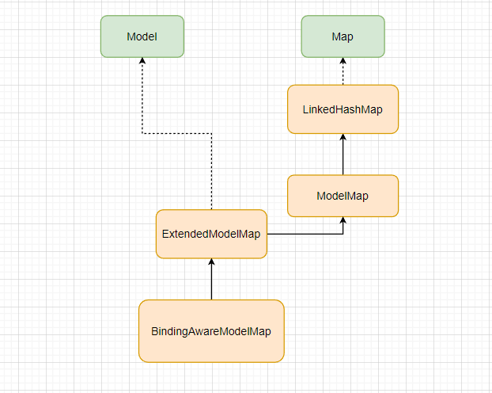
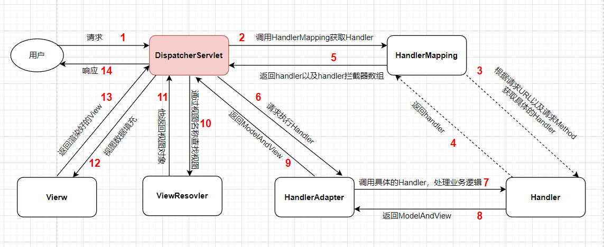

# SpringMVC

## SpringMVC 简介

### MVC 架构模式

MVC 架构模式介绍：参考JavaWeb笔记中的 [MVC架构模式](https://ilovesshan.github.io/pages/backend/javaWeb.html#mvc%E6%9E%B6%E6%9E%84%E6%A8%A1%E5%BC%8F-1) 章节

### SpringMVC框架介绍

1. [SpringMVC官网地址](https://docs.spring.io/spring-framework/docs/current/reference/html/web.html)
2. SpringMVC属于Spring系列的一员，能够和Spring框架进行无缝整合。
3. SpringMVC是一种基于Spring实现了Web MVC设计模式的请求驱动类型的轻量级Web框架，使用了MVC的架构模式思想，将Web层进行指责解耦，并管理应用所需的生命周期，为简化日常开发，提供了很大便利。
4. SpringMVC提供了总开关DispatcherServlet;请求处理映射器（Handler Mapping）和处理适配器（Handler Adapter），视图解析器（View Resolver）进行视图管理;动作处理器Controller接口（包含ModelAndView，以及处理请求响应对象请求和响应），配置灵活，支持文件上传，数据简单转化等强大功能。

### SpringMVC框架特点

1. SpringMVC是一个轻量级框架能够和 Spring 其他框架无缝集成，是其它 Web 框架所不具备的。
2. 清晰的角色分配：前端控制器、 请求到处理器映射、处理器适配器、 视图解析器。
3. 支持各种请求资源的映射策略。并且支持RESTful 编程风格的请求。
4. 支持各种视图技术，比如：jsp、thymeleaf


## SpringMVC 入门案例

### 新建WEB项目

### 引入相关依赖

```xml
<!-- 注意WEB项目打包方式-->
<packaging>war</packaging>

<properties>
    <maven.compiler.source>17</maven.compiler.source>
    <maven.compiler.target>17</maven.compiler.target>
</properties>

<dependencies>
    <!-- SpringMVC核心依赖-->
    <dependency>
        <groupId>org.springframework</groupId>
        <artifactId>spring-webmvc</artifactId>
        <version>6.0.6</version>
    </dependency>

    <!-- Servlet依赖-->
    <dependency>
        <groupId>jakarta.servlet</groupId>
        <artifactId>jakarta.servlet-api</artifactId>
        <scope>provided</scope>
        <version>5.0.0</version>
    </dependency>

    <!-- thymeleaf模板引擎 -->
    <dependency>
        <groupId>org.thymeleaf</groupId>
        <artifactId>thymeleaf-spring6</artifactId>
        <version>3.1.1.RELEASE</version>
    </dependency>

    <!-- 日志-->
    <dependency>
        <groupId>ch.qos.logback</groupId>
        <artifactId>logback-classic</artifactId>
        <version>1.4.6</version>
    </dependency>
</dependencies>
```


### web.xml中配置核心处理器

```xml
<?xml version="1.0" encoding="UTF-8"?>
<web-app xmlns="http://xmlns.jcp.org/xml/ns/javaee"
         xmlns:xsi="http://www.w3.org/2001/XMLSchema-instance"
         xsi:schemaLocation="http://xmlns.jcp.org/xml/ns/javaee http://xmlns.jcp.org/xml/ns/javaee/web-app_4_0.xsd"
         version="4.0">

    <!--
        因为引入了SpringMVC框架, 我们将客户端发来的请求统一交给SpringMVC框架的DispatcherServlet类进行分发处理。
        注意: "统一" 二字， 是不是就是全部请求呢？？
            除了".jsp"的请求之外的请求，都可以交给SpringMVC框架的DispatcherServlet进行处理
            回顾一下JavaWEB中 url-pattern 拦截规则
                "/*": 可以匹配所有url，包括带扩展名的，一般只用在过滤器上
                "/" : 可以匹配所有url, 很多人理解成不能拦截带扩展名的，这种理解是错误的
                      它其实也能拦截“.js”，“.css”，".png"等静态资源的访问, 但是不会拦截.jsp

                过滤器的url-pattern一般配置: "/*"
                DispatcherServlet的url-pattern一般配置: "/"
    -->
    <servlet>
        <servlet-name>springMVC</servlet-name>
        <servlet-class>org.springframework.web.servlet.DispatcherServlet</servlet-class>
        <init-param>
            <!-- 指定springmvc配置文件的路径 -->
            <param-name>contextConfigLocation</param-name>
            <param-value>classpath:springmvc.xml</param-value>
        </init-param>
        <!-- 当WEB项目被访问时，才将DispatcherServlet对象加载到内存中 -->
        <load-on-startup>1</load-on-startup>
    </servlet>
    <servlet-mapping>
        <servlet-name>springMVC</servlet-name>
        <url-pattern>/</url-pattern>
    </servlet-mapping>
</web-app>
```


### 添加SpringMVC配置文件

```xml
<?xml version="1.0" encoding="UTF-8"?>
<beans xmlns="http://www.springframework.org/schema/beans"
       xmlns:xsi="http://www.w3.org/2001/XMLSchema-instance"
       xmlns:context="http://www.springframework.org/schema/context"
       xsi:schemaLocation="
                           http://www.springframework.org/schema/beans http://www.springframework.org/schema/beans/spring-beans.xsd 
                           http://www.springframework.org/schema/context https://www.springframework.org/schema/context/spring-context.xsd
                           ">

    <!-- 配置包扫描路径-->
    <context:component-scan base-package="com.ilovesshan.springmvc.controller"/>

    <!-- 配置Thymeleaf视图解析器 -->
    <bean id="viewResolver" class="org.thymeleaf.spring6.view.ThymeleafViewResolver">
        <property name="order" value="1"/>
        <property name="characterEncoding" value="UTF-8"/>
        <property name="templateEngine">
            <bean class="org.thymeleaf.spring6.SpringTemplateEngine">
                <property name="templateResolver">
                    <bean class="org.thymeleaf.spring6.templateresolver.SpringResourceTemplateResolver">
                        <!-- 视图前缀 -->
                        <property name="prefix" value="/WEB-INF/templates/"/>
                        <!-- 视图后缀 -->
                        <property name="suffix" value=".html"/>

                        <property name="templateMode" value="HTML"/>
                        <property name="characterEncoding" value="UTF-8"/>
                    </bean>
                </property>
            </bean>
        </property>
    </bean>
</beans>
```


### 准备静态资源文件

```html
<!DOCTYPE html>
<html lang="en" xmlns:th="http://www.thymeleaf.org"
      xmlns:sec="http://www.thymeleaf.org/extras/spring-security"
      xmlns:shiro="http://www.pollix.at/thymeleaf/shiro">
    <head>
        <meta charset="UTF-8">
        <title>SpringMVC</title>
    </head>
    <body>
        <h2>Hi， SpringMVC</h2>
        <a th:href="@{/home}">访问首页</a>
    </body>
</html>
```

```html
<!DOCTYPE html>
<html lang="en" xmlns:th="http://www.thymeleaf.org"
      xmlns:sec="http://www.thymeleaf.org/extras/spring-security"
      xmlns:shiro="http://www.pollix.at/thymeleaf/shiro">
    <head>
        <meta charset="UTF-8">
        <title>this is home page</title>
    </head>
    <body>
        <p>this is home page</p>
    </body>
</html>
```


### 编写Controller层控制器

```java
@Controller
@RequestMapping("/")
public class HelloController {

    @GetMapping("/index")
    public String indexPage() {
        // 返回一个字符串时，会被springmvc配置文件中所配置的thymeleaf模板引擎所解析

        //   前缀                   返回字符串  后缀
        //   /WEB-INF/templates/   hello     .html

        // 通过请求转发方式，将请求和响应转发到/WEB-INF/templates/hello.html地址
        return "hello";
    }

    @GetMapping("/home")
    public String homePage() {
        return "home";
    }
}
```


## SpringMVC  请求映射详解

### @RequestMapping 介绍

1. RequestMapping 翻译成中文含义是：请求映射，什么是请求？什么是映射？

   + 请求：客户端发出的请求
   + 映射：将客户端发出的请求路径通过映射处理（DispatcherServlet类），最终映射到一个Controller上。

2. 说直接点，可以通过@RequestMapping 注解来定义一个请求路径，客户端通过请求路径可以访问到该类（Servlet）。

3. 看一下@RequestMapping 注解源码

   ```java
   // 可以用在类上或者方法上
   @Target({ElementType.TYPE, ElementType.METHOD})
   @Retention(RetentionPolicy.RUNTIME)
   @Documented
   // @Mapping注解 是一个空注解
   @Mapping
   @Reflective({ControllerMappingReflectiveProcessor.class})
   public @interface RequestMapping {
       String name() default "";
   
       // 定义客户端的请求路径
       @AliasFor("path")
       String[] value() default {};
   
       // 定义客户端的请求路径
       @AliasFor("value")
       String[] path() default {};
   
       // RequestMethod 是一个枚举，里面内置了8中请求方式
       // method 主要用于定义客户端的请求方式 是GET还是POST还是其他类型的请求
       RequestMethod[] method() default {};
   
       // 客户端传递的params参数
       String[] params() default {};
   
       // 客户端传递的headers参数
       String[] headers() default {};
   
       //  客户端请求的提交内容类型（Content-Type），例如application/json, text/html;
       String[] consumes() default {};
   
       // 服务端返回给客户端内容类型，仅当request请求头中的(Accept)类型中包含该指定类型才返回
       String[] produces() default {};
   }
   ```

   ```java
   public enum RequestMethod {
       GET,
       HEAD,
       POST,
       PUT,
       PATCH,
       DELETE,
       OPTIONS,
       TRACE;
   
       private RequestMethod() {
       }
   
       @Nullable
       public static RequestMethod resolve(String method) {
           Assert.notNull(method, "Method must not be null");
           byte var2 = -1;
           switch(method.hashCode()) {
               case -531492226:
                   if (method.equals("OPTIONS")) {
                       var2 = 6;
                   }
                   break;
               case 70454:
                   if (method.equals("GET")) {
                       var2 = 0;
                   }
                   break;
               case 79599:
                   if (method.equals("PUT")) {
                       var2 = 3;
                   }
                   break;
               case 2213344:
                   if (method.equals("HEAD")) {
                       var2 = 1;
                   }
                   break;
               case 2461856:
                   if (method.equals("POST")) {
                       var2 = 2;
                   }
                   break;
               case 75900968:
                   if (method.equals("PATCH")) {
                       var2 = 4;
                   }
                   break;
               case 80083237:
                   if (method.equals("TRACE")) {
                       var2 = 7;
                   }
                   break;
               case 2012838315:
                   if (method.equals("DELETE")) {
                       var2 = 5;
                   }
           }
   
           RequestMethod var10000;
           switch(var2) {
               case 0:
                   var10000 = GET;
                   break;
               case 1:
                   var10000 = HEAD;
                   break;
               case 2:
                   var10000 = POST;
                   break;
               case 3:
                   var10000 = PUT;
                   break;
               case 4:
                   var10000 = PATCH;
                   break;
               case 5:
                   var10000 = DELETE;
                   break;
               case 6:
                   var10000 = OPTIONS;
                   break;
               case 7:
                   var10000 = TRACE;
                   break;
               default:
                   var10000 = null;
           }
   
           return var10000;
       }
   
       @Nullable
       public static RequestMethod resolve(HttpMethod httpMethod) {
           Assert.notNull(httpMethod, "HttpMethod must not be null");
           return resolve(httpMethod.name());
       }
   
       public HttpMethod asHttpMethod() {
           HttpMethod var10000;
           switch(this) {
               case GET:
                   var10000 = HttpMethod.GET;
                   break;
               case HEAD:
                   var10000 = HttpMethod.HEAD;
                   break;
               case POST:
                   var10000 = HttpMethod.POST;
                   break;
               case PUT:
                   var10000 = HttpMethod.PUT;
                   break;
               case PATCH:
                   var10000 = HttpMethod.PATCH;
                   break;
               case DELETE:
                   var10000 = HttpMethod.DELETE;
                   break;
               case OPTIONS:
                   var10000 = HttpMethod.OPTIONS;
                   break;
               case TRACE:
                   var10000 = HttpMethod.TRACE;
                   break;
               default:
                   throw new IncompatibleClassChangeError();
           }
           return var10000;
       }
   }
   
   ```

   ```java
   @Target({ElementType.ANNOTATION_TYPE})
   @Retention(RetentionPolicy.RUNTIME)
   public @interface Mapping {
   }
   ```

   

### @RequestMapping  value和path属性

1. 其实通过阅读源码发现，这两个值表达的含义是一样的，都是定义客户端请求路径。

   ```java
   @Controller
   public class UserController {
       @RequestMapping("/list")
       public String t1() {
           return "list";
       }
   }
   ```

### @RequestMapping 用在类和方法上

1. 用在方法上

   + @RequestMapping 用在方法上

     + 用在方法上，和方法名称没有任何关系，返回值就先暂时返回字符串吧，通过视图解析器转发到对应的界面！

     + 访问路径：http://localhost:8080/list

       ```java
       @Controller
       public class UserController {
           // 访问用户列表
           @RequestMapping("/list")
           public String t1() {
               return "user-list";
           }
       }
       ```

   + 思考？ICO容器中，如果出现两个请求路径都是 /list 的bean会怎么样？

     + 添加一个OrderrController，表示订单的模块，里面也有有一个接口，访问订单列表 /list

     + 访问路径：http://localhost:8080/list

       ```java
       @Controller
       public class OrderController {
           // 访问订单列表
           @RequestMapping("/list")
           public String t1() {
               return "order-list";
           }
       }
       ```

   + 当IOC容器中存在两个请求路径相同的bean时，编译就会报错，原因也简单：

     + DispatcherServlet在处理这个请求路径时，发现ICO容器里面有两个对象都是这个请求路径，那到底是让UserController还是OrderController来处理这次请求呢？压根无法抉择！

   + 编译的报错信息

     ```tex
     Caused by: java.lang.IllegalStateException: Ambiguous mapping. Cannot map 'userController' method 
     com.ilovesshan.controller.UserController#t1()
     to { [/list]}: There is already 'orderController' bean method
     ```

   + 怎么解决？

     + 在类上添加注解，含义是将两个模块进行区分，相当于在/list基础上各自再配一个父级路径
     + 例如
       + 访问访问订单列表
         + http://localhost:8080/order/list
       + 访问用户列表
         + http://localhost:8080/user/list

   

2. 用在类上

   + UserController 

     ```java
     @Controller
     @RequestMapping("/user")
     public class UserController {
     
         @RequestMapping("/list")
         public String t1() {
             return "user-list";
         }
     }
     ```

     

   + OrderController

     ```java
     @Controller
     @RequestMapping("/order")
     public class OrderController {
         // 访问订单列表
         @RequestMapping("/list")
         public String t1() {
             return "order-list";
         }
     }
     ```


### @RequestMapping method属性

1. 用于限定请求方式类型， 是GET还是POST还是其他类型的请求

   ```java
   @RequestMapping(value = "/list",method = RequestMethod.GET)
   ```

   ```java
   @RequestMapping(value = "/list",method = RequestMethod.POST)
   ```

2. 省略method属性，默认允许任意请求类型。

3. 如果写了method = RequestMethod.GET，表示该请求只能通过GET方式请求，否则服务端会抛出异常 405（方法不允许）。


### @RequestMapping  派生类

1. @RequestMapping 注解有几个派生注解，主要是简化开发，也是SpringMVC对[restful风格](https://zhuanlan.zhihu.com/p/334809573)的支持。

2. 下面这四个派生注解是比较常用的，注意：这些派生注解就没有method属性了！！

   + 专门处理GET请求

     ```java
     @GetMapping(value = "/list")
     public String t2() {
         return "user-list";
     }
     ```

     

   + 专门处理POST请求

     ```java
     @PostMapping(value = "/list")
     public String t3() {
         return "user-list";
     }

   + 专门处理DELETE请求

     ```java
     @PutMapping(value = "/list")
     public String t4() {
         return "user-list";
     }
     ```

     

   + 专门处理PUT请求

     ```java
     @DeleteMapping(value = "/list")
     public String t5() {
         return "user-list";
     }
     ```

3. 看一下GetMapping的源码

   ```java
   // @RequestMapping 派生注解只能用在方法上
   @Target({ElementType.METHOD})
   @Retention(RetentionPolicy.RUNTIME)
   @Documented
   // @GetMapping 本质还是通过@RequestMapping()来标注该类的
   @RequestMapping(
       method = {RequestMethod.GET}
   )
   public @interface GetMapping {
       @AliasFor(
           annotation = RequestMapping.class
       )
       String name() default "";
   
       @AliasFor(
           annotation = RequestMapping.class
       )
       String[] value() default {};
   
       @AliasFor(
           annotation = RequestMapping.class
       )
       String[] path() default {};
   
       @AliasFor(
           annotation = RequestMapping.class
       )
       String[] params() default {};
   
       @AliasFor(
           annotation = RequestMapping.class
       )
       String[] headers() default {};
   
       @AliasFor(
           annotation = RequestMapping.class
       )
       String[] consumes() default {};
   
       @AliasFor(
           annotation = RequestMapping.class
       )
       String[] produces() default {};
   }
   
   ```

   

### @RequestMapping params属性

1. 限制客户端传递的params参数

2. 如果请求中，携带的请求参数不满足这些条件，服务端会抛出异常 400（客户端请求参数不正确）。

   + 请求参数中必须有username参数

     ```java
     @GetMapping(value = "/list", params = {"username"})
     ```

     

   + 请求参数中不能有username参数

     ```java
     @GetMapping(value = "/list", params = {"!username"})
     ```

     

   + 请求参数中username必须等于132

     ```java
     @GetMapping(value = "/list", params = {"username=123"})
     ```

     

   + 请求参数中username不能等于132，没有username参数也可以

     ```java
     @GetMapping(value = "/list", params = {"username!=123"})
     ```

   

### @RequestMapping headers属性

1.  限制客户端传递的headers参数，用法、规则和 params属性一模一样！！

### @RequestMapping consumes属性

1. 客户端请求的提交内容类型（Content-Type），例如application/json, text/html;

2. 客户端提交的参数只能是指定的格式，如果不满足条件服务端会抛出异常 415 （ 不支持的媒体类型）。

   ```java
   // JSON格式应该不陌生吧  { "username":"123456", "password":"123465"}
   @GetMapping(value = "/list", consumes = {"application/json"})
   ```

   ```java
   // 既可以上传文件等二进制数据，也可以上传表单键值对，只是最后会转化为一条信息；
   @GetMapping(value = "/list", consumes = {"application/x-www-form-urlencoded"})
   ```

   ```java
   //只能上传键值对，并且键值对都是间隔分开的,比如 name=java&age=23
   @GetMapping(value = "/list", consumes = {"multipart/form-data"})
   ```

   

### @RequestMapping produces属性

1. 服务端返回给客户端内容类型，仅当request请求头中的(Accept)类型中包含该指定类型才返回

2. chrome浏览器 Request Header中的Accept属性值

   ```tex
   Accept: text/html,application/xhtml+xml,application/xml;q=0.9,image/avif,image/webp,image/apng,*/*;q=0.8,application/signed-exchange;v=b3;q=0.7
   ```

3. postman工具 Request Header中的Accept属性值

   ```tex
   Accept: */*
   ```

4. produces属性 用的比较少（前后端分离开发的模式中，一般通过json数据格式进行前后端）

   ```java
   @GetMapping(value = "/list", produces = {"application/json"})
   ```

   ```java
   @GetMapping(value = "/list", produces = {"text/html"})
   ```


### @RequestMapping ant模式匹配

1. SpringMVC 提供了ant（AntPathMatcher）模式匹配规则，主要就是对@RequestMapping注解的value属性根据规则进行匹配。

2.  Spring中的具体实现： org.springframework.util.AntPathMatcher，ant模式匹配有三种规则

3. ant模式匹配有三种规则，[参考博客](https://blog.csdn.net/feiying0canglang/article/details/120678900)

   + ？，匹配一个字符。

     ```java
     @GetMapping(value = "/a?")
     ```

   + *，匹配0到多个字符。

     ```java
     @GetMapping(value = "/a*")
     ```

     

   + **，匹配多级目录。注意写法

     + 正确的写法： xxx/\*\*/xxx

       ```java
       @GetMapping(value = "/a/**/b")
       ```

     + 错误的写法：xxx/a\*\*a/，\*\* 直接被当成字符串解析了。

       ```java
       @GetMapping(value = "/a/b**c/d")
       ```

       

   + {spring:[a-z]+}，将正则表达式[a-z]+匹配到的值，赋值给名为 spring 的路径变量。

     ```java
     @RequestMapping("/index/{username:[a-b]+}")
     @ResponseBody
     public String index(@PathVariable("username") String username){
         System.out.println(username);
         return username;
     }
     ```

     ```tex
     index/ab           	true  输出 ab
     index/abbaaa    	true  输出 abbaaa
     index/a             false 404错误
     index/ac            false 404错误
     ```

     

### @RequestMapping 占位符匹配

1. 占位符匹配主要是在restful中用得比较多，根据URL的路径层级进行匹配。

2. 举个例子，根据用户ID查询用户详情信息

   + 原始写法：http://localhost:8080/selectUserInfo?userId=1
   + restful写法：http://localhost:8080/users/1

3. 看代码

   + 请求映射一层目录

     + 请求路径：localhost:8080/students/1

       ```java
       @Controller
       @RequestMapping("students/")
       public class StudentController {
           // 关于 @PathVariable注解：可以从@RequestMapping("{xxx}")中动态的把xxx值拿出来
           // @PathVariable 解析请求路径中的占位符并将值映射给控制器方法的参数
       
           // @PathVariable("key"), 对应 @RequestMapping("{key}")的key
           // @PathVariable("id") Integer userId 会将 @RequestMapping("{xxx}")中的值赋值给 userId
           @RequestMapping("{id}")
           public String selectUserById(@PathVariable("id") Integer userId) {
               System.out.println("userId = " + userId);
               return "user-detail";
           }
       }
       ```

   + 请求映射多层目录

     + 请求路径：localhost:8080/students/username/110

       ```java
       @Controller
       @RequestMapping("students/")
       public class StudentController {
       
           @RequestMapping("{username}/{id}")
           public String selectUserById(@PathVariable("username") String username, @PathVariable("id") Integer userId) {
               System.out.println("username = " + username);
               System.out.println("userId = " + userId);
               return "user-detail";
           }
       }
       ```

       

## SpringMVC  请求参数

### 原始Servlet 获取请求参数

1. 客户端发送的请求都交给前端控制器（DispatcherServlet）来进行处理，而前端控制器根据客户端请求路径去匹配@RequestMapping 注解修饰的控制器方法并执行方法，其实前端控制器还是一个Servlet，只不过是SpringMVC对Servlet进行了一层封装。

2. 请求路径：localhost:8080/users?username=admin&password=123&hobby=read&hobby=run&hobby=code

   ```java
   @Controller
   @RequestMapping("/users")
   public class UserController {
   
       @GetMapping
       public String userInfo(HttpServletRequest httpServlet) {
           // DispatcherServlet发现控制器方法需要一个HttpServletRequest对象， 那么它就会传给你。
           String username = httpServlet.getParameter("username"); // admin
           String password = httpServlet.getParameter("password"); // 123
           String[] hobby = httpServlet.getParameterValues("hobby"); // [read, run, code]
           return "index";
       }
   }
   ```

### @RequestParam 获取参数

1. 获取请求参数的简单方式

   + 请求路径：localhost:8080/users?username=admin&password=123&hobby=read&hobby=run&hobby=code

     ```java
     @GetMapping
     public String userInfo(String username, String password, String[] hobby) {
         return "index";
     }

   

2. @RequestParam注解主要处理：请求参数名称和控制器方法参数名称不一致情况

   + 请求路径：localhost:8080/users?user_name=admin&passWORD=123

     ```java
     @GetMapping
     public String userInfo(@RequestParam("user_name") String username, @RequestParam("passWORD") String password) {
         System.out.println("username = " + username);
         System.out.println("password = " + password);
         return "index";
     }
     ```

3. @RequestParams 注解源码解析

   + @RequestParam 注解只能用在方法参数上。
   + name 和 value 属性：都是相同的意思，通过name从请求参数中匹配对应值
   + required属性：该参数是否是必传的，默认是TRUE，如果不传该参数那么服务端会抛出异常 400 ，并且控制器方法的的形参默认值是NULL。
   + defaultValue属性：如果匹配值为NULL，那么就使用默认值。

   ```java
   @Target({ElementType.PARAMETER})
   @Retention(RetentionPolicy.RUNTIME)
   @Documented
   public @interface RequestParam {
       @AliasFor("name")
       String value() default "";
   
       @AliasFor("value")
       String name() default "";
   
       boolean required() default true;
   
       String defaultValue() default "\n\t\t\n\t\t\n\ue000\ue001\ue002\n\t\t\t\t\n";
   }
   ```

### @RequestHeader 获取参数

1. 获取请求头中的信息，用法和@RequestParam 注解用法一样。

   ```java
   @GetMapping
   public String userInfo(@RequestHeader("User-Agent") String userAgent, @RequestHeader("Host") String host) {
       return "index";
   }
   ```

   

2. @RequestHeader 源码

   ```java
   @Target({ElementType.PARAMETER})
   @Retention(RetentionPolicy.RUNTIME)
   @Documented
   public @interface RequestHeader {
       @AliasFor("name")
       String value() default "";
   
       @AliasFor("value")
       String name() default "";
   
       boolean required() default true;
   
       String defaultValue() default "\n\t\t\n\t\t\n\ue000\ue001\ue002\n\t\t\t\t\n";
   }
   ```

   

### @PathVariable 获取参数

1. @PathVariable注解用于 映射 URL 绑定的占位符，通过 @PathVariable 可以将 URL 中占位符参数绑定到控制器处理方法的入参中，

   URL 中的 {xxx} 占位符可以通过@PathVariable(“xxx”) 绑定到操作方法的入参中。

2. @PathVariable注解 用法

   ```java
   @RequestMapping("{username}/{id}")
   public String selectUserById(@PathVariable("username") String username, @PathVariable("id") Integer userId) {
       return "user-detail";
   }
   ```

   

3. @PathVariable 源码

   ```java
   @Target({ElementType.PARAMETER})
   @Retention(RetentionPolicy.RUNTIME)
   @Documented
   public @interface PathVariable {
       @AliasFor("name")
       String value() default "";
   
       @AliasFor("value")
       String name() default "";
   
       boolean required() default true;
   }
   
   ```

   

### @CookieValue 获取参数

1. 获取cookie信息，用法和@RequestParam 注解用法一样。

   ```java
   @GetMapping
   public String userInfo(@CookieValue("JSESSIONID") String jSessionId) {
       return "index";
   }
   ```

   

2. @CookieValue 源码

   ```java
   @Target({ElementType.PARAMETER})
   @Retention(RetentionPolicy.RUNTIME)
   @Documented
   public @interface CookieValue {
       @AliasFor("name")
       String value() default "";
   
       @AliasFor("value")
       String name() default "";
   
       boolean required() default true;
   
       String defaultValue() default "\n\t\t\n\t\t\n\ue000\ue001\ue002\n\t\t\t\t\n";
   }
   ```

   

### 通过POJO获取参数

1. 如果客户端请求参数很多，那势必会写很多个@RequestParam 注解，这时候可以通过一个POJO对象来接收参数，DispatcherServlet会进行自动装配，底层通过反射对POJO对象属性赋值。

2. 新建一个POJO对象

   ```java
   @Data
   @NoArgsConstructor
   @AllArgsConstructor
   public class User {
       private String username;
       private String password;
   }
   ```

   

3. 编写控制器代码

   ```java
   @GetMapping
   public String userInfo(User user) {
       System.out.println("user = " + user);
       return "index";
   }
   ```

   + 请求路径：localhost:8080/users?username=ilovesshan&password=123456

     ```tex
     user = User(username=ilovesshan, password=123456)
     ```

   + 请求路径：localhost:8080/users?username=ilovesshan

     ```tex
     user = User(username=ilovesshan, password=null)
     ```


### 请求参数乱码问题

1. tomcat版本不同，每个版本的乱码情况也会有所不同，可以参考[tomcat版本乱码问题](https://ilovesshan.github.io/pages/backend/javaWeb.html#httpservletrequest%E8%AF%A6%E8%A7%A3)。

2. SpringMVC中处理乱码问题，再web.xml中配置一个CharacterEncodingFilter过滤器即可，CharacterEncodingFilter是SprinfMVC提供的。

   ```xml
   <filter>
       <filter-name>CharacterEncodingFilter</filter-name>
       <filter-class>org.springframework.web.filter.CharacterEncodingFilter</filter-class>
       <init-param>
           <param-name>encoding</param-name>
           <param-value>UTF-8</param-value>
       </init-param>
       <init-param>
           <param-name>forceResponseEncoding</param-name>
           <param-value>TRUE</param-value>
       </init-param>
   </filter>

3. CharacterEncodingFilter核心源码

   ```java
   public class CharacterEncodingFilter extends OncePerRequestFilter {
   
       @Nullable
       private String encoding;
   
       private boolean forceRequestEncoding = false;
   
       private boolean forceResponseEncoding = false;
   
       // 其他代码省略了...
   
       @Override
       protected void doFilterInternal(
           HttpServletRequest request, HttpServletResponse response, FilterChain filterChain)
           throws ServletException, IOException {
   
           // 核心代码
           String encoding = getEncoding();
           if (encoding != null) {
               if (isForceRequestEncoding() || request.getCharacterEncoding() == null) {
                   request.setCharacterEncoding(encoding);
               }
               if (isForceResponseEncoding()) {
                   response.setCharacterEncoding(encoding);
               }
           }
           filterChain.doFilter(request, response);
       }
   }
   ```

   


## SpringMVC 向域中共享数据

### 四大域对象

1. Application（当前WEB应用有效），application域指的是applicationServletContext；
2. Session（一次会话有效），ession域指的是HttpSession
3. Request（一次请求有效），request域指的是HttpServletContext（需要掌握）
4. Page（JSP有效），基本不用。

之所以他们是域对象，原因是他们都内置了map集合，都有setAttribute和getAttribute方法。

### ServletAPI 向 Request域共享数据

```java
@GetMapping("/index")
public String index(HttpServletRequest request) {
    request.setAttribute("name", "ServletApi");
    return "index";
}
```

```html
<h2 th:text="${name}"></h2>
```


### ViewAndModel 向 Request域共享数据

```java
@GetMapping("/index")
public ModelAndView index() {
    ModelAndView modelAndView = new ModelAndView();
    // 向域中添加数据
    modelAndView.addObject("name", "ModelAndView");
    // 设置跳转视图名称
    modelAndView.setViewName("index");
    return modelAndView;
}
```

```html
<h2 th:text="${name}"></h2>
```


### ModeMap 向 Request域共享数据

```java
@GetMapping("/index")
public String index(ModelMap modelMap) {
    // 向域中添加数据
    modelMap.addAttribute("name", "ModelMap");
    return "index";
}
```

```html
<h2 th:text="${name}"></h2>
```


### Model 向 Request域共享数据

```java
@GetMapping("/index")
public String index(Model modelMap) {
    // 向域中添加数据
    modelMap.addAttribute("name", "Model");
    return "index";
}
```

```html
<h2 th:text="${name}"></h2>
```


### Map 向 Request域共享数据

```java
@GetMapping("/index")
public String index(Map<String, Object> modelMap) {
    // 向域中添加数据
    modelMap.put("name", "Map");
    return "index";
}
```

```html
<h2 th:text="${name}"></h2>
```


### ServletAPI 向 Session域共享数据

```java
@GetMapping("/index")
public String index(HttpSession session) {
    session.setAttribute("name", "HttpSession");
    return "index";
}
```

```html
<h2 th:text="${session.sName}"></h2>
```


### ServletAPI 向 Application域共享数据

```java
@GetMapping("/index")
public String index(HttpSession session) {
    ServletContext servletContext = session.getServletContext();
    servletContext.setAttribute("name", "ServletContext");
    return "index";
}
```

```html
<h2 th:text="${application.sName}"></h2>
```


### ModeMap、Model 、Map 关系

1. ModeMap、Model 、Map 他们都可以用来存放数据到页面，并且都在请求域(requestScope)中。

2. 通过源码DEBUG发现，ModeMap、Model 、Map的运行时类型都是BindingAwareModelMap类型，可见BindingAwareModelMap应该是ModeMap、Model 、Map的公共子类。

3. 阅读源码发现，有如下关系

   ```java
   public interface Model {}
   public class ModelMap extends LinkedHashMap<String, Object> {}
   public class ExtendedModelMap extends ModelMap implements Model {}
   public class BindingAwareModelMap extends ExtendedModelMap {}
   ```

   

4. 所以这三者ModeMap、Model 、Map，不管使用哪一种，最终都是在隐含模型（BindingAwareModelMap）中。


### 原理解析：返回统一 ViewAndModel

1. 控制器方法执行之后，不管是通过ServletApi向域中存数据，还是通过ModelMap，其最终都会返回一个ModelAndView对象。

2. 执行流程

   + org.springframework.web.servlet.DispatcherServlet

     ```java
     mv = ha.handle(processedRequest, response, mappedHandler.getHandler());  // 1081行
     ```

   + org.springframework.web.servlet.mvc.method.AbstractHandlerMethodAdapter

     ```java
     @Override
     @Nullable
     public final ModelAndView handle(HttpServletRequest request, HttpServletResponse response, Object handler)
         throws Exception {
         return handleInternal(request, response, (HandlerMethod) handler);
     }
     ```

   + org.springframework.web.servlet.mvc.method.annotation.RequestMappingHandlerAdapter

     ```java
     protected ModelAndView invokeHandlerMethod(HttpServletRequest request,
                                                HttpServletResponse response, HandlerMethod handlerMethod) throws Exception {
         // 其他代码省略.....
         return getModelAndView(mavContainer, modelFactory, webRequest);
     }
     ```

   + org.springframework.web.servlet.mvc.method.annotation.RequestMappingHandlerAdapter

     ```java
     @Nullable
     private ModelAndView getModelAndView(ModelAndViewContainer mavContainer,
                                          ModelFactory modelFactory, NativeWebRequest webRequest) throws Exception {
     
         modelFactory.updateModel(webRequest, mavContainer);
         if (mavContainer.isRequestHandled()) {
             return null;
         }
         // model 模型数据
         ModelMap model = mavContainer.getModel();
     
         // mavContainer.getViewName() 视图名称
         ModelAndView mav = new ModelAndView(mavContainer.getViewName(), model, mavContainer.getStatus());
         if (!mavContainer.isViewReference()) {
             mav.setView((View) mavContainer.getView());
         }
         if (model instanceof RedirectAttributes redirectAttributes) {
             Map<String, ?> flashAttributes = redirectAttributes.getFlashAttributes();
             HttpServletRequest request = webRequest.getNativeRequest(HttpServletRequest.class);
             if (request != null) {
                 RequestContextUtils.getOutputFlashMap(request).putAll(flashAttributes);
             }
         }
         return mav;
     }
     ```


## SpringMVC 视图控制器

### 视图控制器介绍

1. SpringMVC中的视图是View接口，视图的作用渲染数据，将模型Model中的数据展示给用户，SpringMVC视图的种类很多，默认有转发视图和重定向视图
2. 当工程引入jstl的依赖，转发视图会自动转换为JstlView
3. 若使用的视图技术为Thymeleaf，在SpringMVC的配置文件中配置了Thymeleaf的视图解析器，转发视图会自动转换ThymeleafView。

### ThymeleafViewResolver

1. 当控制器方法中所设置的视图名称没有任何前缀时，此时的视图名称会被SpringMVC配置文件中所配置的视图解析器解析。

2. 视图名称拼接视图前缀和视图后缀所得到的最终路径，会通过转发的方式实现跳转。

   ```java
   @Controller
   public class IndexController {
       @GetMapping("/testThymeleafView")
       public String testThymeleafView() {
           return "index";
       }
   }
   ```

   

### InternalResourceView

1. SpringMVC中默认的转发视图是InternalResourceView。
2. SpringMVC中创建转发视图的情况：
   + 当控制器方法中所设置的视图名称以"forward:"为前缀时，创建InternalResourceView视图，此时的视图名称不会被SpringMVC配置文件中所配置的视图解析器解析，而是会将前缀"forward:"去掉，剩余部分作为最终路径通过转发的方式实现跳转。

```java
@Controller
public class IndexController {
    @GetMapping("/testInternalResourcesCView1")
    public String testInternalResourcesCView1() {
        // 转发到资源界面(如果不配置 <mvc:default-servlet-handler/> 会404)
        // 下面解释原因
        return "forward:/WEB-INF/templates/index.html";
    }

    @GetMapping("/testInternalResourcesCView2")
    public String testInternalResourcesCView2() {
        // 转发到控制器
        return "forward:/testThymeleafView";
    }

    @GetMapping("/testInternalResourcesCView3")
    public String testInternalResourcesCView3() {
        // 转发到资源界面
        return "forward:/WEB-INF/templates/abc.jsp";
    }
}
```


### RedirectView

1. SpringMVC中默认的重定向视图是RedirectView。
2. 当控制器方法中所设置的视图名称以"redirect:"为前缀时，创建RedirectView视图，此时的视图名称不会被SpringMVC配置文件中所配置的视图解析器解析，而是会将前缀"redirect:“去掉，剩余部分作为最终路径通过向重定的方式实现跳转。

```java
@Controller
public class IndexController {
    @GetMapping("/testRedirectView")
    public String testRedirectView() {
        // 重定向到控制器
        return "redirect:/testThymeleafView";
    }
}
```


### defaultServletHandler 配置

1. 在web.xml中配置的DispatcherServlet的url-ptrtten是“/”，“/”意味着什么？

   + 非.jsp的请求都交给DispatcherServlet来进行分发处理。
   + 那是不是访问的.js、.css、.html相关的资源都要被DispatcherServlet处理？但是DispatcherServlet又不能处理.js、.css、.html相关的资源，所以那就404了呗！！

2. 还有一个知识点

   + 当在项目的web.xml中配置的DispatcherServlet的url-ptrtten是“/”，其实就覆盖了tomcat目录下web.xml中配置的org.apache.jasper.servlet.JspServlet，JspServlet的默认url-ptrtten也是“/”。
   + 原本情况下，JspServlet可以处理这些静态将资源，但是被项目中DispatcherServlet的配置覆盖了，所以就无效了...
   + 包括web.xml中配置的 \<welcome-file-list>标签也是同理。

   ```xml
   <web-app>
       <servlet>
           <servlet-name>default</servlet-name>
           <servlet-class>org.apache.catalina.servlets.DefaultServlet</servlet-class>
           <init-param>
               <param-name>debug</param-name>
               <param-value>0</param-value>
           </init-param>
           <init-param>
               <param-name>listings</param-name>
               <param-value>false</param-value>
           </init-param>
           <load-on-startup>1</load-on-startup>
       </servlet>    
       <servlet-mapping>
           <servlet-name>default</servlet-name>
           <url-pattern>/</url-pattern>
       </servlet-mapping>
   
   
   
       <welcome-file-list>
           <welcome-file>index.html</welcome-file>
           <welcome-file>index.htm</welcome-file>
           <welcome-file>index.jsp</welcome-file>
       </welcome-file-list>
   </web-app>
   ```

   

3. 怎么解决这种情况？

   + 在springmvc的配置文件中添加如下一行配置就ok了。

   + 该行代码表示，你DispatcherServlet处理不了的资源信息交给defaultServletHandler处理，也就是交给JspServlet。

     ```xml
     <mvc:default-servlet-handler/>
     ```


### 表单提交PUT和DELETE请求

1. 大家应该都知道form表单可以提交GET和POST请求，默认是GET，但是怎么提交PUT和DELETE请求呢？

2. 如果把action改成PUT或者DELETE可以吗？不可以，action的值只能是GET或者POST，填写其他值一律按照GET方式进行提交。

3. 怎么处理这个问题？

   + 在web.xml中配置一个过滤器，如果web.xml中有配置CharacterEncodingFilter（请保持优先级）

     ```xml
     <filter>
         <filter-name>HiddenHttpMethodFilter</filter-name>
         <filter-class>org.springframework.web.filter.HiddenHttpMethodFilter</filter-class>
     </filter>
     <!-- 注意：HiddenHttpMethodFilter的url-pattern只能是 /* ，不能是 /  -->
     <filter-mapping>
         <filter-name>HiddenHttpMethodFilter</filter-name>
         <url-pattern>/*</url-pattern>
     </filter-mapping>
     ```

   + 将form的method改成post，并且form表单内，添加一个隐藏域。

     ```html
     <form action="/formAction" method="get">
         <input type="submit" value="GET方式提交">
     </form>
     
     <form action="/formAction" method="post">
         <input type="submit" value="POST方式提交">
     </form>
     
     <form action="/formAction" method="post">
         <input type="hidden" name="_method" value="PUT">
         <input type="submit" value="PUT方式提交">
     </form>
     
     <form action="/formAction" method="post">
         <input type="hidden" name="_method" value="DELETE">
         <input type="submit" value="DELETE方式提交">
     </form>
     ```

     ```java
     @Controller
     public class FormActionController {
         @GetMapping("/formAction")
         public String selectById(Model model) {
             model.addAttribute("actionMethod", "GET方式");
             return "form_action";
         }
     
         @PostMapping("/formAction")
         public String insert(Model model) {
             model.addAttribute("actionMethod", "POST方式");
             return "form_action";
         }
     
         @PutMapping("/formAction")
         public String update(Model model) {
             model.addAttribute("actionMethod", "PUT方式");
             return "form_action";
         }
     
         @DeleteMapping("/formAction")
         public String deleteById(Model model) {
             model.addAttribute("actionMethod", "DELETE方式");
             return "form_action";
         }
     }
     ```


## RestFul 

### ResuFul 简介

1. REST（英文：Representational State Transfer，简称REST，直译过来表现层状态转换）是一种软件架构风格、设计风格，而不是标准，只是提供了一组设计原则和约束条件。它主要用于客户端和服务器交互类的软件。基于这个风格设计的软件可以更简洁，更有层次，更易于实现缓存等机制。
2. 需要注意的是REST并没有一个明确的标准，而更像是一种设计的风格，满足这种设计风格的程序或接口我们称之为RESTful(从单词字面来看就是一个形容词)。所以RESTful API 就是满足REST架构风格的接口。

### REST 架构特征

1. GET（SELECT）：从服务器取出资源（一项或多项）。
2. POST（CREATE）：在服务器新建一个资源。
3. PUT（UPDATE）：在服务器更新资源（客户端提供完整资源数据）。
4. PATCH（UPDATE）：在服务器更新资源（客户端提供需要修改的资源数据）。
5. DELETE（DELETE）：从服务器删除资源。

### RESTful 设计规范

|                | 请求方式 | 普通 API 风格             | RestFul Api 风格 |
| -------------- | -------- | ------------------------- | ---------------- |
| 查询用户列表   | GET      | /user/selectList          | /users           |
| 根据ID查询用户 | GET      | /user/selectById?userId=1 | /users/1         |
| 新增用户       | POST     | /user/insertUser          | /users           |
| 更新用户       | PUT      | /user/updateUser          | /users           |
| 根据ID删除用户 | DELETE   | /user/deleteById?userId=1 | /users/1         |


### RestFul  Api  开发实战

```java
@Controller
public class UserController {
    /**
     * 查询用户列表你
     */
    @GetMapping("/users")
    public void selectList() {}

    /**
     * 根据ID查询用户
     */
    @GetMapping("/users/{userId}")
    public void selectById(@PathVariable("userId") String userId) {}

    /**
     * 新增用户
     */
    @PostMapping("/users")
    public void insert() {}

    /**
     * 更新用户
     */
    @PutMapping("/users")
    public void update() {}

    /**
     * 根据ID删除用户
     */
    @DeleteMapping("/users/{userId}")
    public void deleteById(@PathVariable("userId") String userId) {
    }
}

```


## SpringMVC 处理 AJAX请求

### Axios 

1. [Axios 官网](https://www.axios-http.cn/)

2. Axios 是一个基于 *[promise](https://javascript.info/promise-basics)* 网络请求库，作用于[`node.js`](https://nodejs.org/) 和浏览器中。 它是 *[isomorphic](https://www.lullabot.com/articles/what-is-an-isomorphic-application)* 的(即同一套代码可以运行在浏览器和node.js中)。在服务端它使用原生 node.js `http` 模块, 而在客户端 (浏览端) 则使用 XMLHttpRequests。

3. Axios 特性

   + 从浏览器创建 [XMLHttpRequests](https://developer.mozilla.org/en-US/docs/Web/API/XMLHttpRequest)
   + 从 node.js 创建 [http](http://nodejs.org/api/http.html) 请求
   + 支持 [Promise](https://developer.mozilla.org/en-US/docs/Web/JavaScript/Reference/Global_Objects/Promise) API
   + 拦截请求和响应
   + 转换请求和响应数据
   + 取消请求
   + 自动转换JSON数据
   + 客户端支持防御[XSRF](http://en.wikipedia.org/wiki/Cross-site_request_forgery)

4. Axios 安装

   + 使用 jsDelivr CDN

     ```html
     <script src="https://cdn.jsdelivr.net/npm/axios/dist/axios.min.js"></script>
     ```

   + 使用 unpkg CDN

     ```html
     <script src="https://unpkg.com/axios/dist/axios.min.js"></script>
     ```

     

### Axios 发送网络请求

1. 前端代码

   ```javascript
   <script type="text/javascript">
       function sendGetRequest() {
       axios.get("/testAjax", {
           params: {
               uuid: 132465798
           },
       }).then(res => {
           console.log(res.response);
       })
   }
   
   function sendPostRequest() {
       axios.post("/testAjax",
                  {
           username: "ilovesshan",
           password: "ilovesshan123!@#"
       }
                 ).then(res => {
           console.log(res.response);
       })
   }
   </script>
   ```

   

2. 后端代码

   ```java
   @Controller
   public class IndexController {
   
       @GetMapping("/testAjax")
       public String testAjaxGet(String uuid) {
           System.out.println("uuid = " + uuid);
           return "index";
       }
   
       @PostMapping("/testAjax")
       public String testAjaxPost(@RequestBody User userInfo) {
           System.out.println("userInfo = " + userInfo);
           return "index";
       }
   }
   ```


### @RequestBody 注解

1. @RequestBody主要把请求参数和控制器形参做绑定。

2. @RequestBody一般是用来绑定请求体中的参数，在前后端分离开发模式下，前后端交互都是通过Json的数据格式。

3. 使用@RequestBody需要添加配置

   + 默认情况下绑定的值是一个字符串，字符串对于后端程序员来说处理很麻烦，又要截串又要分割，要是可以将字符串转换成一个Java对象就好了。

   + 其实SpringMVC已经提供了这个功能，只需要我们引入一个依赖即可，默认形况下SpringMVC处理字符串和Java对象的互相转换是调用的jsckson这个工具库。

     ```xml
     <!--
      jackson-databind 间接依赖
          com.fasterxmljackson.corejackson-annotations:2.14.2
          com.fasterxmljackson.corejackson-core:2.14.2		
     -->
     <dependency>
         <groupId>com.fasterxml.jackson.core</groupId>
         <artifactId>jackson-databind</artifactId>
         <version>2.14.2</version>
     </dependency>
     ```

   + 还需要在springmvc的配置文件中，添加一行配置（之前以及配置过了）。

     ```xml
     <!-- 不添加该配置，注解就不生效 -->
     <mvc:annotation-driven/>
     ```

     

4. 需要区分下面两种写法

   + 形参类型通过Map或者JavaBena定义

     + 这种方式：只能接收到?key=value&key=value这种形式的参数

     ```javascript
     axios.post("/testAjaxPost1?username=admin&password=123456").then(res => {
         console.log(res.response);
     })
     ```

     ```java
     @PostMapping("/testAjaxPost1")
     public String testAjaxPost1(User userInfo) {}
     ```

     

   + 形参类型通过Map或者JavaBena定义并通过@RequestBody 标识

     + 这种方式：只能接收到请求体中的参数，并且请求体数据格式是Json。

     ```javascript
     axios.post("/testAjaxPost2", {username: "ilovesshan", password: "ilovesshan123!@#"}).then(res => {
         console.log(res.response);
     })
     ```

     ```java
     @PostMapping("/testAjaxPost2")
     public String testAjaxPost2(@RequestBody User userInfo) {}
     ```

     

### @ResponseBody 注解

1. @ResponseBody 主要是给浏览器响应Json格式的数据。

2. 使用@ResponseBody前提是要和使用@RequestBody注解做一样的配置

   + 添加依赖：jackson-databind
   + 添加配置：\<mvc:annotation-driven/>

3. 使用

   + 返回普通字符串

     ```java
     @GetMapping("/testAjaxReturnValue1")
     @ResponseBody
     public String testAjaxReturnValue1() {
         return "ilovesshan";
     }
     ```

   + 返回json对象

     ```java
     @GetMapping("/testAjaxReturnValue2")
     @ResponseBody
     public Object testAjaxReturnValue2() {
         return new User("ilovesshan", "123456ilovesshan!@#");
     }
     ```

   + 返回json数组

     ```java
     @GetMapping("/testAjaxReturnValue3")
     @ResponseBody
     public Object testAjaxReturnValue3() {
         return new ArrayList<User>() {{
             add(new User("ilovesshan", "123456ilovesshan@#"));
             add(new User("jack", "123456jack!@#"));
             add(new User("tom", "123456tom!@#"));
         }};
     }
     ```

   + 返回嵌套json对象

     ```java
     @GetMapping("/testAjaxReturnValue4")
     @ResponseBody
     public Object testAjaxReturnValue4() {
         HashMap<String, Object> hashMap = new HashMap<>();
         ArrayList<User> users = new ArrayList<User>() {{
             add(new User("ilovesshan", "123456ilovesshan@#"));
             add(new User("jack", "123456jack!@#"));
             add(new User("tom", "123456tom!@#"));
         }};
         hashMap.put("code", 200);
         hashMap.put("message", "请求成功");
         hashMap.put("data", users);
         return hashMap;
     }
     ```

     

     

### @RestController 注解

1. @RestController是SpringMVC提供的一个复合注解，用于简化配置的注解，如果该控制器接口设计风格完全是采用ResuFul，那么就可以使用@RestController。

   ```java
   @Target(ElementType.TYPE)
   @Retention(RetentionPolicy.RUNTIME)
   @Documented
   @Controller
   @ResponseBody
   public @interface RestController {
       @AliasFor(annotation = Controller.class)
       String value() default "";
   }
   ```

2. 使用@RestController注解，不用在类上添加@Controller注解，也不用每个控制器方法都添加@ResponseBody注解，使用@RestController注解也就是相当于

   + 给这个类添加了一个@Controller注解
   + 给每一个方法添加了@ResponseBody注解

3. 前后端分离开发的模式下，为了保证软件的稳定性和健壮性，响应给前端的数据都会采用通用格式，方便沟通和调试。

   + code 响应状态码
   + message 响应消息
   + data 响应数据

   ```java
   @Data
   @NoArgsConstructor
   @AllArgsConstructor
   public class R {
       private Integer code;
       private String message;
       private Object data;
   }
   ```

4. @RestController 使用案例

   ```java
   @RestController
   public class UserController {
       /**
        * 查询用户列表
        */
       @GetMapping("/users")
       public R selectList() {
           return new R(200, "查询成功", new User());
       }
   
       /**
        * 根据ID查询用户
        */
       @GetMapping("/users/{userId}")
       public R selectById(@PathVariable("userId") String userId) {
           return new R(200, "查询成功", Collections.EMPTY_LIST);
       }
   
       /**
        * 新增用户
        */
       @PostMapping("/users")
       public R insert() {
           return new R(200, "新增成功", null);
       }
   
       /**
        * 更新用户
        */
       @PutMapping("/users")
       public R update() {
           return new R(200, "更新成功", null);
       }
   
       /**
        * 根据ID删除用户
        */
       @DeleteMapping("/users/{userId}")
       public R deleteById(@PathVariable("userId") String userId) {
           return new R(200, "删除成功", null);
       }
   }
   ```

   

## SpringMVC 文件处理

1. 文件上传是项目开发中最常见的功能。为了能上传文件，必须将表单的method设置为POST，并将enctype设置为multipart/form-data。一旦设置了enctype为multipart/form-data，浏览器即会采用二进制流的方式来处理表单数据，只有在这样的情况下，浏览器才会把用户选择的文件以二进制数据发送给服务器。

2. Spring MVC 为文件上传提供了直接的支持，这种支持是用即插即用的 MultipartResolver 实现的。Spring MVC 使用 Apache Commons FileUpload技术实现了一个 MultipartResolver 实现类：CommonsMultipartResolver 。因此，SpringMVC的文件上传还需要依赖Apache Commons FileUpload的组件。
   

### 文件上传

1. 添加依赖

   ```xml
   <!-- commons-fileupload -->	
   <dependency>
       <groupId>commons-fileupload</groupId>
       <artifactId>commons-fileupload</artifactId>
       <version>1.3.3</version>
   </dependency>
   ```

   

2. 在springmvc.xml进行配置文件如下

   +  SpringMVC上下文中默认没有装配 MultipartResolver，因此默认情况下其不能处理文件上传工作。如果想使用Spring的文件上传功能，则需要在上下文中配置 MultipartResolver。

   ```xml
   <!-- 配置文件上传的解析器：-->
   <bean id="multipartResolver" class="org.springframework.web.multipart.commons.CommonsMultipartResolver">
       <!-- 上传文件大小上限，单位为字节（10MB） -->
       <property name="maxInMemorySize">
           <value>10485760</value>
       </property>
       <!-- 设定默认编码 等 -->
       <property name="defaultEncoding" value="UTF-8"></property>
   </bean>
   ```

   

3. 编辑上传文件的前端界面

   + method="post" enctype="multipart/form-data"

   ```html
   <div>
       <h4>文件上传</h4>
       <form action="/upload" method="post" enctype="multipart/form-data">
           文件说明：<input type="text" name="note" /><br/>
           附件：<input type="file" name="file" /><br/>
           <input type="submit" value="提交" />		
       </form>
   </div>
   ```

4. 编写Controller代码

   ```java
   @RequestMapping(value = "/upload", method = RequestMethod.POST)
   public String upload(String note, @RequestParam("file") MultipartFile file, HttpServletRequest request) throws Exception {
       System.out.println("文件说明：" + note);
       if(!file.isEmpty()) {
           String path = request.getServletContext().getRealPath("/resource/uploadFile");
           //获取上传文件的原名
           String fileName = file.getOriginalFilename(); 
           File desfile = new File(path,fileName);
           if(!desfile.getParentFile().exists()) {
               desfile.getParentFile().mkdirs();
           }
           file.transferTo(new File(path + File.separator + fileName));
       }else {
           System.out.println("文件为空！");
       }
       return "success";
   }
   ```

   

### 文件下载

1. 文件下载比较简单，可直接在页面给出一个超链接，该链接 href 属性为要下载文件的文件，download 属性可自定义修改下载的文件名。这样就实现文件下载了。

   ```html
   <a href="resource\uploadFile\t01cebc3fe2b30885fe.jpg" download="">下载</a>
   ```

2. SpringMVC提供了一个 ResponseEntity 类型，使用它可以很方便地定义返回的 HttpHeaders 和HttpStatus 。

   ```java
   @RequestMapping(value="/download")
   public ResponseEntity<byte[]> download(HttpServletRequest request, @RequestParam("fileName") String fileName) throws Exception{
       //下载文件路径
       String path = request.getServletContext().getRealPath("/resource/uploadFile");
       File file = new File(path + File.separator + fileName);
       HttpHeaders headers = new HttpHeaders();
       //下载显示的文件名，并解决中文名称乱码问题
       String downloadFileName = new String(fileName.getBytes("UTF-8"),"iso-8859-1");
       //通知浏览器以attachment（下载方式）打开
       headers.setContentDispositionFormData("attachment", downloadFileName);
       //applicatin/octet-stream: 二进制流数据（最常见的文件下载）
       headers.setContentType(MediaType.APPLICATION_OCTET_STREAM);
       return new ResponseEntity<byte[]>(FileUtils.readFileToByteArray(file), headers, HttpStatus.CREATED);
   }
   ```

   

## SpringMVC 拦截器

### 拦截器概述

1. SpringMVC的处理器拦截器,类似于Servlet开发中的过滤器Filter，用于对处理器进行预处理和后处理。

### 过滤器和拦截器区别

1. 滤波器
   + 依赖于Servlet容器，可以对几乎所有请求进行过滤，但是缺点是一个过滤器实例只能在容器初始化时调用一次。
   + 使用过滤器的目的是用来做一些过滤操作。
     + 在过滤器中修改字符编码。
     + 在过滤器中修改HttpServletRequest的一些参数，包括：过滤低俗文字、危险字符等。
2. 拦截器
   + 依赖于web框架，在实现上基于Java的反射机制，属于面向切面编程（AOP）的一种运用。
   + 由于拦截器是基于web框架的调用，因此可以使用Spring的依赖注入（DI）进行一些业务操作，同时一个拦截器实例在一个controller生命周期之内可以多次调用。
   + 使用拦截器的目的是用来做一些拦截操作。
     + 登录认证拦截器，字符过滤拦截器，日志操作拦截器等等。

### SpringMVC  拦截器使用

1. 实现HandlerInterceptor接口，拦截器一个有3个回调方法。

   + `preHandle`：预处理方法，控制器方法调用之前执行。方法返回值：true表示继续流程（如调用下一个拦截器或处理器）；false表示流程中断（如登录检查失败），不会继续调用其他的拦截器或处理器，此时我们需要通过response来产生响应；

     

   + postHandle：后处理回调方法，渲染视图之前执行，此时我们可以通过modelAndView（模型和视图对象）对模型数据进行处理或对视图进行处理，modelAndView也可能为null。

     

   + afterCompletion：整个请求处理完毕回调方法，即在视图渲染完毕时回调，仅调用处理器执行链中preHandle返回true的拦截器才会执行afterCompletion。

   ```java
   public class MyHandlerInterceptor implements HandlerInterceptor {
   
       @Override
       public boolean preHandle(HttpServletRequest request, HttpServletResponse response, Object handler)
           throws Exception {
           System.out.println("MyHandlerInterceptor->preHandle...");
           return true;
       }
   
       @Override
       public void postHandle(HttpServletRequest request, HttpServletResponse response, Object handler,
                              ModelAndView modelAndView) throws Exception {
           System.out.println("MyHandlerInterceptor->postHandle...");
       }
   
       @Override
       public void afterCompletion(HttpServletRequest request, HttpServletResponse response, Object handler, Exception ex)
           throws Exception {
           System.out.println("MyHandlerInterceptor->afterCompletion...");
       }
   }
   ```

   

2. 配置拦截器（sprinmvc.xml中）

   + 拦截所有Controller类里的所有处理方法

     ```xml
     <!-- 配置拦截器-->
     <mvc:interceptors>
         <!-- 拦截所有请求(除去.jsp) -->
         <bean class="com.ilovesshan.controller.interceptor.MyInterceptor"/>
     </mvc:interceptors>
     ```

   + 拦截某个请求路径的处理方法

     ```xml
     <!-- 配置拦截器-->
     <mvc:interceptors>
         <mvc:interceptor>
             <!-- /*   拦截项目路径下 一层路径 -->
             <!-- /**  拦截项目路径下 多层路径 -->
             <mvc:mapping path="/*"/>
     
             <!-- 不拦截该路径-->
             <mvc:exclude-mapping path="/**/login"/>
     
             <!-- 拦截器 Bean对象-->
             <bean class="com.ilovesshan.controller.interceptor.MyInterceptor"/>
         </mvc:interceptor>
     </mvc:interceptors>
     ```


### SpringMVC 多个拦截器执行顺序

```xml
<mvc:interceptors>
    <bean class="com.ilovesshan.controller.interceptor.MyInterceptorA"/>
    <bean class="com.ilovesshan.controller.interceptor.MyInterceptorB"/>
</mvc:interceptors>
```

```xml
MyInterceptorA preHandle...
MyInterceptorB preHandle...
MyInterceptorB postHandle...
MyInterceptorA postHandle...
MyInterceptorB afterCompletion...
MyInterceptorA afterCompletion...
```


## SpringMVC 异常处理

在 Spring MVC 应用的开发中，不管是操作底层数据库，还是业务层或控制层，都会不可避免地遇到各种可预知的、不可预知的异常。我们需要捕捉处理异常，才能保证程序不被终止。

Spring MVC 有以下 3 种处理异常的方式：

+ 使用 Spring MVC 提供的简单异常处理器 SimpleMappingExceptionResolver。
+ 实现 Spring 的异常处理接口 HandlerExceptionResolver，自定义自己的异常处理器。
+ 使用 @ExceptionHandler 注解实现异常处理


### @ExceptionHandler 注解

1. 局部异常处理仅能处理指定 Controller 中的异常。

2. 下面使用 @ExceptionHandler 注解实现。定义一个处理过程中可能会存在异常情况的 testExceptionHandle 方法。

   ```java
   @Controller
   public class ExceptionHandlerController{
       @RequestMapping("/testExceptionHandle")
       public String testExceptionHandle(@RequestParam("i") Integer i) {
           // 显然，当 i=0 时会产生算术运算异常。
           System.out.println(10 / i);
           return "success";
       }
   
       // 注意：该注解不是加在产生异常的方法上，而是加在处理异常的方法上。
       @ExceptionHandler({ ArithmeticException.class })
       public String testArithmeticException(Exception e) {
           System.out.println("打印错误信息 ===> ArithmeticException:" + e);
           // 跳转到指定页面
           return "error";
       }
   }
   ```

### HandlerExceptionResolver 接口

1. Spring MVC 通过 HandlerExceptionResolver 处理程序异常，包括处理器异常、数据绑定异常以及控制器执行时发生的异常。HandlerExceptionResolver 仅有一个接口方法，源码如下。

   ```java
   public interface HandlerExceptionResolver {
       @Nullable
       ModelAndView resolveException(
           HttpServletRequest request, HttpServletResponse response, @Nullable Object handler, Exception ex);
   }

2. 发生异常时，Spring MVC 会调用 resolveException() 方法，并转到 ModelAndView 对应的视图中，返回一个异常报告页面反馈给用户。

   ```java
   public class MyExceptionHandler implements HandlerExceptionResolver {
       @Override
       public ModelAndView resolveException(HttpServletRequest arg0, HttpServletResponse arg1, Object arg2,
                                            Exception arg3) {
           Map<String, Object> model = new HashMap<String, Object>();
           // 根据不同错误转向不同页面（统一处理），即异常与View的对应关系
           if (arg3 instanceof ArithmeticException) {
               return new ModelAndView("error", model);
           }
           return new ModelAndView("error-2", model);
       }
   }
   ```

3. 在 springmvc-servlet.xml 文件中添加以下代码。

   ```xml
   <bean class="net.biancheng.exception.MyExceptionHandler"/>
   ```


### SimpleMappingExceptionResolver

1. 全局异常处理可使用 SimpleMappingExceptionResolver 来实现。它将异常类名映射为视图名，即发生异常时使用对应的视图报告异常。

2. 实现的两种方式

   + xml方式

     ```xml
     <bean class="org.springframework.web.servlet.handler.SimpleMappingExceptionResolver">
         <!-- 定义默认的异常处理页面，当该异常类型注册时使用 -->
         <property name="defaultErrorView" value="error"></property>
         <!-- 定义异常处理页面用来获取异常信息的变量名，默认名为exception -->
         <property name="exceptionAttribute" value="ex"></property>
         <!-- 定义需要特殊处理的异常，用类名或完全路径名作为key，异常页名作为值 -->
         <property name="exceptionMappings">
             <props>
                 <prop key="ArithmeticException">error</prop>
                 <!-- 在这里还可以继续扩展对不同异常类型的处理 -->
             </props>
         </property>
     </bean>
     ```

     

   + 注解方式（常用）

     ```java
     @ControllerAdvice
     public class GlobalExceptionHandler {
         @ExceptionHandler
         @ResponseBody
         public Object handlerArithmeticException(ArithmeticException e) {
             return e.getMessage();
         }
     
         @ExceptionHandler
         @ResponseBody
         public Object handlerIOException(IOException e) {
             return e.getMessage();
         }
     
         @ExceptionHandler
         @ResponseBody
         public Object handlerRuntimeException(RuntimeException e) {
             return e.getMessage();
         }
     }
     ```

     

     

## SpringMVC 执行流程

### SpringMVC 核心组件

1. DispatcherServlet（前端处理器）
   + 作用：接收请求、响应结果，相当于转发器，有了DispatcherServlet 就减少了其它组件之间的耦合度。
2. HandlerMapping（处理器映射器）
   + 根据请求的URL来查找Handler
3. HandlerAdapter（处理器适配器）
   + 负责调用Handler
4. Handler（处理器）
   + Handler就是程序员开发的控制器方法
5. ViewResolver（视图解析器）
   + 进行视图的解析，根据视图逻辑名解析成真正的视图（view）
6. View（视图）
   + View是一个接口， 它的实现类支持不同的视图类型（jsp，freemarker，pdf等等）

### SpringMVC 执行流程

1. 用户发送请求至前端控制器DispatcherServlet。
2. DispatcherServlet接收到用户请求之后，调用HandlerMapping获取Handler。
3. HandlerMapping根据请求URL和请求方式找到具体的Handler，生成Handler对象以及Handler拦截器（存在就生成）一并返回给DispatcherServlet。
4. DispatcherServlet调用HandlerAdapter，HandlerAdapter经过适配处理再调用具体的Handler。
5. Handler执行完成后返回ModelAndView，将这个ModelAndView返回给DispatcherServlet。
6. DispatcherServlet将ModelAndView传递ViewResolver进行视图解析器，ViewResolver解析后返回具体View。
7. DispatcherServlet对View进行渲染视图（将模型数据填充至视图中）
8. DispatcherServlet将渲染完成视图的视图响应给用户。



