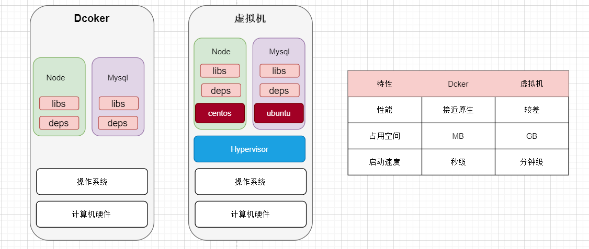
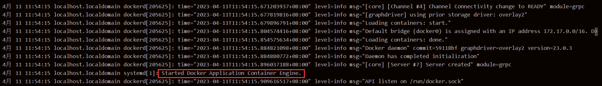
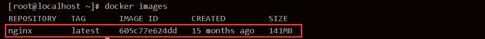
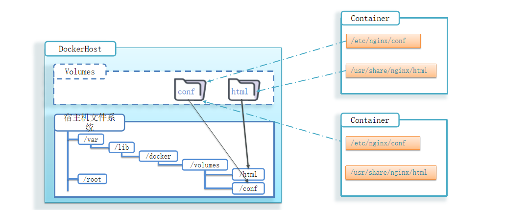
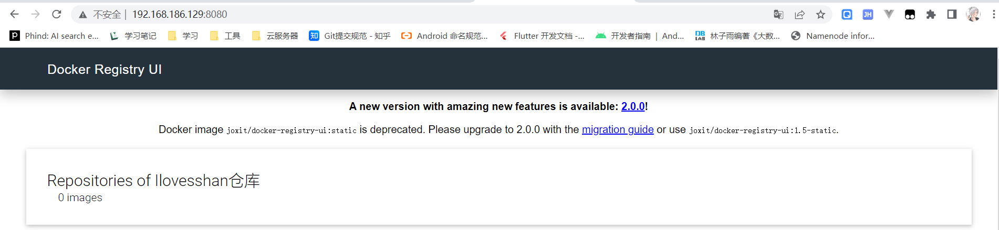
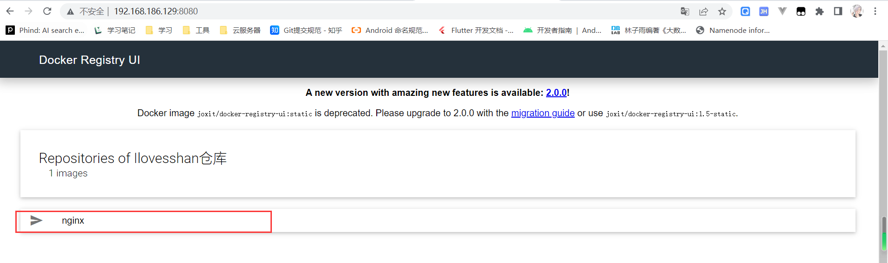

# Dcoker

## 容器技术

### 容器技术的起源

1. 程序员开发代码时需要从零搭建一套开发环境，开发完成转交测试时，测试人员又需要从零搭建一套测试环境，测试完成之后达到了上线的标准，这时会将程序交给运维人员，那么运维人员又需要从零搭建一套运行环境，我靠？？这么麻烦光是搭建环境就要搭建三次？？
2. 解决这种办法也有，那就是开发人员在虚拟机上搭建一套环境，然后再将虚拟机COPY给测试和运维，貌似这也是一个解决办法（在没有容器技术之前）！但是这种方式确实没有那么好~~

### 容器技术 vs 虚拟机

1. 虚拟机

   + 虚拟机（virtual machine）是在操作系统中模拟硬件设备，然后运行另一个操作系统，比如在 Windows 系统里面运行 Ubuntu 系统，这样就可以运行任意的Ubuntu应用了。

2. 容器技术

   + 容器一词的英文是container，其实container还有集装箱的意思。
   + 现代软件开发的一大目的就是隔离，应用程序在运行时相互独立互不干扰，这种隔离实现起来是很不容易的，其中一种解决方案就是上面提到的虚拟机技术，通过将应用程序部署在不同的虚拟机中从而实现隔离。

3. 容器技术（容器是一种通用技术，Dcoker只是其中的一种实现，下面介绍Dcoker）和虚拟机的差异：

   + 容器技术（Dcoker）是一个系统进程
   + 虚拟机是在操作系统中的操作系统
   + Dcoker体积小、启动速度快、性能好
   + 虚拟机体积大、启动速度慢、性能一般

   


##  初识 Dcoker 

### Dcoker 简介

1. 容器是一种通用技术，Dcoker只是其中的一种实现。

2. Dcoker是一个用Go语言实现的开源项目，可以让我们方便的创建和使用容器，Dcoker将程序以及程序所有的依赖都打包到Dcoker container，这样你的程序可以在任何环境都会有一致的表现，Dcoker可以屏蔽环境差异，也就是说，只要你的程序打包到了Dcoker中，那么无论运行在什么环境下程序的行为都是一致的。

3. Dcoker的另一个好处就是快速部署，这是当前互联网公司最常见的一个应用场景，一个原因在于容器启动速度非常快，另一个原因在于只要确保一个容器中的程序正确运行，那么你就能确信无论在生产环境部署多少都能正确运行。

4. Dcoker特点总结

   + 可以将程序及其依赖、运行环境一起打包为一个镜像，可以迁移到任意Linux操作系统。
   + 运行时利用沙箱机制形成隔离容器，各个应用互不干扰。
   + 启动、移除都可以通过一行命令完成，方便快捷。

   

### Dcoker 镜像和容器

1. Dcoker将应用程序及其所需的依赖、函数库、环境、配置等文件打包在一起，称为镜像。

2. 镜像中的应用程序运行后形成的进程就是容器，只是Dcoker会给容器做隔离，对外不可见。

   

###  DcokerHub

1. DcokerHub：DcokerHub是一个Dcoker镜像的托管平台。这样的平台称为Dcoker Registry。

2. 国内也有类似于DcokerHub 的公开服务，比如 网易云镜像服务、阿里云镜像库等。

   

### Dcoker 架构

1. Dcoker是基于CS架构模式，分成服务端(server)和客户端(client)。
2. 服务端(server)：Dcoker守护进程，负责处理Dcoker指令，管理镜像、容器等。
3. 客户端(client)：通过命令或RestAPI向Dcoker服务端发送指令。可以在本地或远程向服务端发送指令。


## Docker 简单操作

1. Docker 分为 CE 和 EE 两大版本。CE 即社区版（免费，支持周期 7 个月），EE 即企业版，强调安全，付费使用，支持周期 24 个月。
2. Docker CE 分为 `stable` `test` 和 `nightly` 三个更新频道。官方网站上有各种环境下的 [安装指南](https://docs.docker.com/install/)，这里主要介绍 Docker CE 在 CentOS上的安装。
3. Docker CE 支持 64 位版本 CentOS 7，并且要求内核版本不低于 3.10， CentOS 7 满足最低内核的要求，我使用的CentOS 8。

### CentOS安装Docker

1. 卸载（可选）

   + 如果之前安装过旧版本的Docker，可以使用下面命令卸载：

     ```shell
     yum remove docker \
                       docker-client \
                       docker-client-latest \
                       docker-common \
                       docker-latest \
                       docker-latest-logrotate \
                       docker-logrotate \
                       docker-selinux \
                       docker-engine-selinux \
                       docker-engine \
                       docker-ce
     ```

     

   

2. 安装docker

   + 首先需要虚拟机联网，安装yum工具

     ```shell
     yum install -y yum-utils \
                device-mapper-persistent-data \
                lvm2 --skip-broken
     ```

   + 然后更新本地镜像源

     ```shell
     # 设置docker镜像源
     yum-config-manager \
         --add-repo \
         https://mirrors.aliyun.com/docker-ce/linux/centos/docker-ce.repo
         
     sed -i 's/download.docker.com/mirrors.aliyun.com\/docker-ce/g' /etc/yum.repos.d/docker-ce.repo
     
     yum makecache fast
     ```

   + 然后输入命令，docker-ce为社区免费版本。稍等片刻，docker即可安装成功。

     ```shell
     yum install -y docker-ce
     ```

   

3. 启动docker

   + Docker应用需要用到各种端口，逐一去修改防火墙设置。非常麻烦，因此建议大家直接关闭防火墙！

     启动docker前，一定要关闭防火墙后！！

     启动docker前，一定要关闭防火墙后！！

     启动docker前，一定要关闭防火墙后！！

     ```shell
     # 关闭
     systemctl stop firewalld
     # 禁止开机启动防火墙
     systemctl disable firewalld
     ```

   + 通过命令启动docker

     ```shell
     systemctl start docker  # 启动docker服务
     
     systemctl stop docker  # 停止docker服务
     
     systemctl restart docker  # 重启docker服务
     ```

   + 然后输入命令，查看docker是否启动成功（两种方式）

     + 查看docker版本

       ```shell
       docker -v
       ```

       

     + 查看docker状态

       ```shell
       systemctl status docker
       ```

       

   

4. 配置镜像加速

   + docker官方镜像仓库网速较差，我们需要设置国内镜像服务，参考阿里云的镜像加速文档：https://cr.console.aliyun.com/cn-hangzhou/instances/mirrors。

   + 通过修改daemon配置文件/etc/docker/daemon.json来使用加速器

     ```shell
     sudo mkdir -p /etc/docker
     sudo tee /etc/docker/daemon.json <<-'EOF'
     {
       "registry-mirrors": ["https://jxa7jhwn.mirror.aliyuncs.com"]
     }
     EOF
     sudo systemctl daemon-reload
     sudo systemctl restart docker
     ```

     

### Docker 操作镜像常用命令

1. dockerhub镜像网站：https://hub.docker.com/

2. 关于docker镜像命名问题

   + 镜像名称一般分两部分组成：[repository]:[tag]，在没有指定tag时，默认是latest，代表最新版本的镜像。

     ```java
     [repository]:[tag] ----> mysql:8.0.30
     ```

3. docker命令有很多，了可以通过 `docker --help` 来获取帮助，下面介绍几个常用的命令。

   + docker pull [repository]:[tag]，从dockerhub中拉起镜像

     ```shell
     # 从dockerhub中 拉取nginx镜像(未指定tag时，默认是latest)
     docker pull nginx
     ```

   + docker push：将本地镜像推到远程仓库

   +  docker images：查看本地镜像列表

     

     

   + docker save： Save one or more images to a tar archive (streamed to STDOUT by default)（将镜像导出成一个tar文件）

     ```shell
     docker save -o ./nginx.tar nginx:latest
     ```

     

   + docker load：Load an image from a tar archive or STDIN（将tar文件加载成镜像文件）

     ```shell
      docker load -i ./nginx.tar -q
     ```

     

   + docker rmi：Remove one or more images（删除镜像）

     ```shell
     docker rmi nginx:latest
     ```

     

### 拉取redis镜像练习

1. 从dockerhub中拉取redis镜像

   ```shell
   docker pull redis
   ```

   

2. 查看redis镜像名称和版本信息

   ```shell
   docker images
   ```

   ```shell
   redis        latest    7614ae9453d1   15 months ago   113MB
   ```

   

3. 将redis镜像打包成一个redis.tar文件

   ```shell
   docker save -o ./redis.tar redis
   ```

   

4. 删除本地redis镜像文件

   ```shell
   docker rmi redis
   ```

   

5. 将redis.tar文件加载到本地镜像列表中

   ```shell
   docker load -i ./redis.tar 
   ```

   

### Docker 操作容器常用命令

1. docker run： 启动容器
2. docker pause：容器从`运行状态`切换到`暂停状态`
3. docker unpause：容器从`暂停状态`恢复到`运行状态`
4. docker stop：容器从`运行状态`切换到到`停止状态`（进程被干掉）
5. docker start：将容器状态切换为`运行状态`（容器被stop情况下）
6. docker rm：删除指定容器
7. docker ps：查看所有运行的容器和状态
8. docker logs：查看指定容器运行日志
9. docker exec：进入容器内部执行命令

### 创建并运行Nginx容器

1. 可以参考dockerhub中关于操作nginx容器的命令：https://hub.docker.com/_/nginx

   ```shell
   docker run --name nginxContainer -p 80:80 -d nginx
   ```

   + docker run：创建容器
   + --name ：容器名称
   + -p 8080:80， 端口映射（左边是宿主机端口，右边是容器端口）
   + -d：后台运行
   + nginx：镜像名称

2. 查看nginx运行日志

   + -f 持续查看日志

   ```shell
   docker logs nginxContainer -f
   ```

3. 修改nginx的主页将“Welcome to nginx!”字样改成“Hi Ilovesshan， Weclome！”

   + 先通过 docker exec 命令进入到nginx内部

     + docker exec：进入到容器内部
     + -it：给当前进入的容器创建一个标准输入、输出终端，允许我们与容器交互
     + nginxContainer：要进入的容器的名称
     + bash：进入容器后执行的命令，bash是一个linux终端交互命令

     ```shell
     docker exec -it nginxContainer bash
     ```

   + 进入到静态界面路径（包含50x.html和index.html两个文件）

     ```shell
     cd /usr/share/nginx/html
     ```

   + 一般情况下修改文件可以使用vim，由于当前容器是一个阉割版的linux，只是包含了nginx的运行环境和依赖，那就只有采用下面这些办法修改文件信息了，exec命令可以进入容器修改文件，但是在容器内修改文件是不推荐的。

     ```shell
     sed -i 's#Welcome to nginx#Hi Ilovesshan， Weclome~#g' index.html
     sed -i 's#<head>#<head><meta charset="utf-8">#g' index.html
     ```

   + 退出容器环境

     ```shell
     exit
     ```

     

4. 查看容器运行状态

   ```shell
   docker ps # 当前正在运行的容器信息
   docker ps -a # 全部的容器信息
   ```

   

5. 停止容器

   ```shell
    docker stop nginxContainer
   ```

   

### 创建并运行Redis容器，实现数据持久化

```shell
docker pull redis

docker run --name redisContainer -d redis

cd /usr/local/bin/

./redis-cli

set name ilovesshan

get name
```


## Docker 数据卷

### 什么是数据卷

1. 先看几个问题

   + 数据不便于修改（修改nginx的欢迎主页 index.html）
     + 当我们要修改Nginx的html内容时，需要进入容器内部修改，很不方便。
   + 数据不可服用
     + 在容器内的修改对外是不可见的。所有修改对新创建的容器是不可复用的。
   + 审计维护困难
     + 数据在容器内，如果要升级容器必然删除旧容器，所有数据都跟着删除了。

2. docker容器运行期间产生的数据文件，在容器被删除这些文件是会丢失的，但是希望其中部分文件能够保存下来，而且同时希望容器和容器之间能够数据共享。

3. 数据卷（volume）是一个虚拟目录，指向宿主机文件系统中的某个目录。

4. 一般地来说，docker容器数据卷可以看成常用的u盘，它存在于一个或多个的容器中，由docker挂载到容器，但不属于联合文件系统，Docker不会在容器删除时删除其挂载的数据卷。

   


### 数据卷常用命令

1.  通过执行 `docker volume --help` 查看 docker volume 相关的命令信息

   ```shell
   Usage:  docker volume COMMAND
   
   Manage volumes
   
   Commands:
     create      Create a volume
     inspect     Display detailed information on one or more volumes
     ls          List volumes
     prune       Remove all unused local volumes
     rm          Remove one or more volumes
   
   Run 'docker volume COMMAND --help' for more information on a command.
   ```

2. 创建数据卷

   ```shell
   docker volume create html
   ```

   

3. 查看数据卷列表

   ```shell
   volume ls
   ```

   

4. 查看指定数据卷详细信息

   ```shell
   docker volume inspect html
   ```

   ```shell
   [
       {
           "CreatedAt": "2023-04-11T19:53:25+08:00",
           "Driver": "local",
           "Labels": null,
           "Mountpoint": "/var/lib/docker/volumes/html/_data", # 数据卷路径
           "Name": "html",
           "Options": null,
           "Scope": "local"
       }
   ]
   
   ```

   

5. 删除未使用的数据卷

   ```shell
   docker volume prune
   ```

   

6. 删除一个/多个数据卷

   ```shell
   docker volume rm html
   ```


### 创建Ngxin容器并挂载数据卷

1. 创建nginx容器并把把html数据卷挂载到容器内的/usr/share/nginx/html这个目录中。

   + -v 数据卷名称:容器内目录（如果数据卷不存在，Docker会默认进行创建）
   + 其他参数上面说过，就不解释了~~

   ```shell
   docker run --name nginxContainer -p 80:80 -d -v html:/usr/share/nginx/html nginx
   ```

2. 进入到数据卷目录中

   ```shell
   cd /var/lib/docker/volumes/html/_data
   ```

3. 通过vim 编辑 index.html文件

   ```shell
   vim index.html
   ```


### 创建MySQL容器并将宿主机目录直接挂载到容器

1. 提示：目录挂载与数据卷挂载的语法是类似的：

   + -v [宿主机目录]:[容器内目录]
   + -v [宿主机文件]:[容器内文件]

2. 先将mysql.tar上传到/tmp目录下，然后再将mysql.tar加载到docker镜像中

   ```
    docker load -i /tmp/mysql.tar 
   ```

   

3. 创建目录/tmp/mysql/data

   ```shell
   mkdir -p /tmp/mysql/data=
   ```

   

4. 创建目录/tmp/mysql/conf

   ```shell
   mkdir -p /tmp/mysql/conf
   ```

5. 在tmp/mysql/conf下新建一个hmy.cnf文件，并输入一下信息。

   ```shell
   [mysqld]
   skip-name-resolve
   character_set_server=utf8
   datadir=/var/lib/mysql
   server-id=1000
   ```

6. 去DockerHub查阅资料，创建并运行MySQL容器，要求：

   + 挂载/tmp/mysql/data到mysql容器内数据存储目录（/var/lib/mysql）

     ```shell
     -v /tmp/mysql/data:/var/lib/mysql 
     ```

   + 挂载/tmp/mysql/conf/hmy.cnf到mysql容器的配置文件（/etc/mysql/conf.d/hmy.cnf）

     ```shell
     -v /tmp/mysql/conf/hmy.cnf:/etc/mysql/conf.d/hmy.cnf 
     ```

   + 设置MySQL密码（-e 表示环境变量）

     ```shell
     -e MYSQL_ROOT_PASSWORD=123456
     ```

     

   ```shell
   docker run \
   --name mysqlContainer \
   -p 3306:3306 \
   -e MYSQL_ROOT_PASSWORD=123456 \
   -v /tmp/mysql/conf/hmy.cnf:/etc/mysql/conf.d/hmy.cnf \
   -v /tmp/mysql/data:/var/lib/mysql \
   -d \
   mysql:5.7.25 
   ```


## DockerFile 自定义镜像

### 镜像结构

1. 镜像是将应用程序及其需要的系统函数库、环境、配置、依赖打包而成。
2. 镜像是分层结构，每一层称为一个Layer
   + BaseImage层：包含基本的系统函数库、环境变量、文件系统
   + Entrypoint：入口，是镜像中应用启动的命令
   + 其它：在BaseImage基础上添加依赖、安装程序、完成整个应用的安装和配置（每添加一次就是新的一层Layer）。

### Dockerfile语法

1. Dockerfile就是一个文本文件，其中包含一个个的指令(Instruction)，用指令来说明要执行什么操作来构建镜像。每一个指令都会形成一层Layer。

2. 更新详细语法说明，请参考官网文档： https://docs.docker.com/engine/reference/builder

   | **指令**   | **说明**                                     | **示例**                    |
   | ---------- | -------------------------------------------- | --------------------------- |
   | FROM       | 指定基础镜像                                 | FROM centos:6               |
   | ENV        | 设置环境变量，可在后面指令使用               | ENV key value               |
   | COPY       | 拷贝本地文件到镜像的指定目录                 | COPY ./mysql-5.7.rpm /tmp   |
   | RUN        | 执行Linux的shell命令，一般是安装过程的命令   | RUN yum install gcc         |
   | EXPOSE     | 指定容器运行时监听的端口，是给镜像使用者看的 | EXPOSE 8080                 |
   | ENTRYPOINT | 镜像中应用的启动命令，容器运行时调用         | ENTRYPOINT java -jar xx.jar |


### 基于Ubuntu镜像构建新镜像

1. 新建一个空目录docker-demo

2. 上传文件

   + docker-demo.jar（课程资料下载）
   + jdk8.tar.gz（课程资料下载）

3. 编写dockerFile文件

   ```dockerfile
   # 指定基础镜像
   FROM ubuntu:16.04
   # 配置环境变量，JDK的安装目录
   ENV JAVA_DIR=/usr/local
   
   # 拷贝jdk和java项目的包
   COPY ./jdk8.tar.gz $JAVA_DIR/
   COPY ./docker-demo.jar /tmp/app.jar
   
   # 安装JDK
   RUN cd $JAVA_DIR \
    && tar -xf ./jdk8.tar.gz \
    && mv ./jdk1.8.0_144 ./java8
   
   # 配置环境变量
   ENV JAVA_HOME=$JAVA_DIR/java8
   ENV PATH=$PATH:$JAVA_HOME/bin
   
   # 暴露端口
   EXPOSE 8090
   # 入口，java项目的启动命令
   ENTRYPOINT java -jar /tmp/app.jar
   ```

4. 构建镜像文件

   ```shell
   docker build -t javaweb:1.0 .
   ```

5. 运行容器

   ```shell
    docker run --name javaweb -p 8090:8090 -d javaweb:1.0
   ```

   

6. 访问：http://192.168.186.129:8090/hello/count


### 基于java:8-alpine镜像

1. 步骤和基于Ubuntu镜像构建新镜像一样的，只不过需要更改一下dockerfile文件，现在是基于java:8-alpine镜像来构建了

   ```shell
   # 指定基础镜像
   FROM java:8-alpine
   # 拷贝java项目的包
   COPY ./docker-demo.jar /tmp/app.jar
   # 暴露端口
   EXPOSE 8090
   # 入口，java项目的启动命令
   ENTRYPOINT java -jar /tmp/app.jar
   ```

2. 重新构建镜像

   ```shell
   docker build -t javaweb:2.0 .
   ```

   

3. 运行镜像

   ```shell
    docker run --name javaweb -p 8090:8090 -d javaweb:2.0
   ```

   


## DockerCompose

### DockerCompose 简介

1. DockerCompose 是一个基于compose文件帮我们快速部署分布式应用，无须一个一个创建和运行容器。
2. compose文件是一个文本文件（yml），compose文件通过指令定义集中的容器该如何运行。

### DockerCompose 安装

1. Linux下需要通过命令下载，如果命令下载很慢，也可以上传课程资料的docker-compose文件到`/usr/local/bin/`目录下。

   ```shell
   # 安装
   curl -L https://github.com/docker/compose/releases/download/1.23.1/docker-compose-`uname -s`-`uname -m` > /usr/local/bin/docker-compose
   ```

2. 修改文件权限

   ```shell
   chmod +x /usr/local/bin/docker-compose
   ```

3. Base自动补全命令（如果这里出现错误，需要修改自己的hosts文件）

   ```shell
   # 补全命令
   curl -L https://raw.githubusercontent.com/docker/compose/1.29.1/contrib/completion/bash/docker-compose > /etc/bash_completion.d/docker-compose
   ```

   ```shell
   echo "199.232.68.133 raw.githubusercontent.com" >> /etc/hosts
   ```


### 利用DockerCompose 集群微服务

1. cloud-demo文件夹，里面分别放各个微服务模块（app.jar和Dockerfile），数据库文件（conf和data目录），docker-compose.yml。

   + 微服务模块的Dockerfile

     ```dockerfile
     FROM java:8-alpine
     COPY ./app.jar /tmp/app.jar
     ENTRYPOINT java -jar /tmp/app.jar
     ```

   + 数据库文件（conf目录/hmy.conf）

     ```shell
     [mysqld]
     skip-name-resolve
     character_set_server=utf8
     datadir=/var/lib/mysql
     server-id=1000
     ```

     

   + 数据库文件（data目录）

     + 通过以下命令查看数据库数据保存的位置

       ```sqlite
       show global variables like "%datadir%";
       ```

     + 可以直接将该路径下的全部文件COPY到data目录下（最好是筛选掉不用的数据库）

   + docker-compose.yml

     ```dockerfile
     version: "3.2"
     
     services:
       # 服务名称
       nacos:
       	# 镜像
         image: nacos/nacos-server
         # 配置环境变量
         environment:
           MODE: standalone
         # 端口映射  
         ports:
           - "8848:8848"
       mysql:
         image: mysql:5.7.25
         environment:
           MYSQL_ROOT_PASSWORD: 123
         volumes:
         # 数据卷挂载  容器内目录：宿主机目录
           - "$PWD/mysql/data:/var/lib/mysql"
           - "$PWD/mysql/conf:/etc/mysql/conf.d/"
       
       # 微服务模块（多个为微服务模块直接书写就ok了）
       userservice:
         build: ./user-service
       orderservice:
         build: ./order-service
         
       # 网关
       gateway:
         build: ./gateway
         ports:
           - "10010:10010"
     
     ```

2. 修改cloud-demo（IDEA中开发的项目，没有就自己新建一个微服务项目~~）项目，将数据库、nacos地址都命名为docker-compose中的服务名。

3. 使用maven打包工具，将项目中的每个微服务都打包为app.jar，并将打包好的app.jar拷贝到cloud-demo（刚刚新建的文件夹）中的每一个对应的子目录中。

4. 将cloud-demo上传至虚拟机，利用 docker-compose up -d 来部署。

   ```shell
   docker-compose up -d
   ```

   

## Docker镜像仓库

### Docker镜像仓库简介

1. 搭建镜像仓库可以基于Docker官方提供的DockerRegistry来实现。
2. 镜像仓库（ Docker Registry ）有公共的和私有的两种形式：
   + 公共仓库：例如Docker官方的 Docker Hub，国内也有一些云服务商提供类似于 Docker Hub 的公开服务，比如 网易云镜像服务、DaoCloud 镜像服务、阿里云镜像服务等。
   + 除了使用公开仓库外，用户还可以在本地搭建私有 Docker Registry。企业自己的镜像最好是采用私有Docker Registry来实现。
3. 官网地址：https://hub.docker.com/_/registry


### 简化版镜像仓库

1. Docker官方的Docker Registry是一个基础版本的Docker镜像仓库，具备仓库管理的完整功能，但是没有图形化界面。

2. 搭建方式比较简单，命令如下：

   ```shell
   docker run -d \
       --restart=always \
       --name registry	\
       -p 5000:5000 \
       -v registry-data:/var/lib/registry \
       registry
   ```

3. 命令中挂载了一个数据卷registry-data到容器内的/var/lib/registry 目录，这是私有镜像库存放数据的目录。访问http://YourIp:5000/v2/_catalog 可以查看当前私有镜像服务中包含的镜像。


### 带有图形化界面版本

1. 使用DockerCompose部署带有图象界面的DockerRegistry，命令如下：

   ```shell
   version: '3.0'
   services:
     registry:
       image: registry
       volumes:
         - ./registry-data:/var/lib/registry
     ui:
       image: joxit/docker-registry-ui:static
       ports:
         - 8080:80
       environment:
         - REGISTRY_TITLE=Ilovesshan仓库
         - REGISTRY_URL=http://registry:5000
       depends_on:
         - registry
   ```

2. 配置Docker信任地址

   ```shell
   # 打开要修改的文件
   vim /etc/docker/daemon.json
   # 添加内容：  192.168.186.129 换成本机IP
   "insecure-registries":["http://192.168.186.129:8080"]
   # 重加载
   systemctl daemon-reload
   # 重启docker
   systemctl restart docker
   ```
   
3. 浏览器访问：http://192.168.186.129:8080/，能看到界面就表示OK了~~

   


### 私有镜像仓库推送或拉取镜像

1. 推送镜像到私有镜像服务必须先tag，重新tag本地镜像，名称前缀为私有仓库的地址：192.168.150.101:8080/（换成本机IP）

   ```shell
   docker tag nginx:latest 192.168.186.129:8080/nginx:1.0 
   ```

   

2. 推送镜像

   ```shell
   docker push 192.168.186.129:8080/nginx:1.0 
   ```

   

2. 再次访问：http://192.168.186.129:8080/，就可以看到多了一个Nginx的镜像~

   
   
   

3. 拉取镜像

   ```shell
   docker pull 192.168.186.129:8080/nginx:1.0 
   ```

   