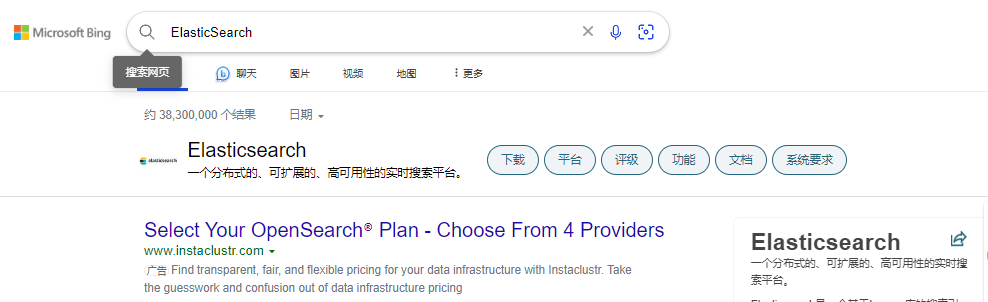
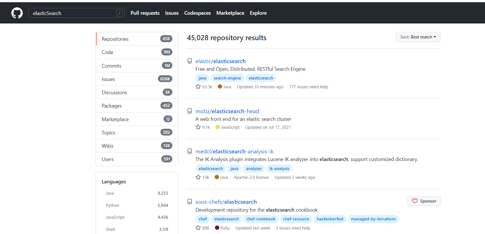
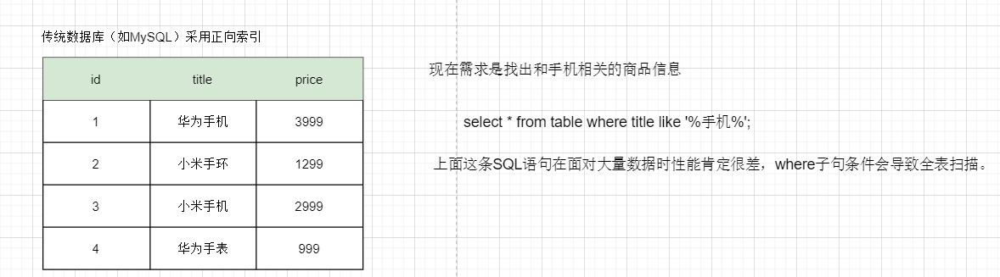
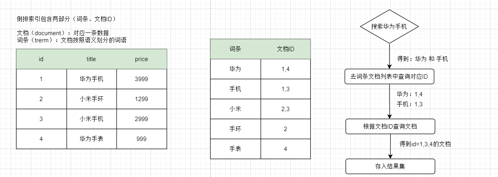
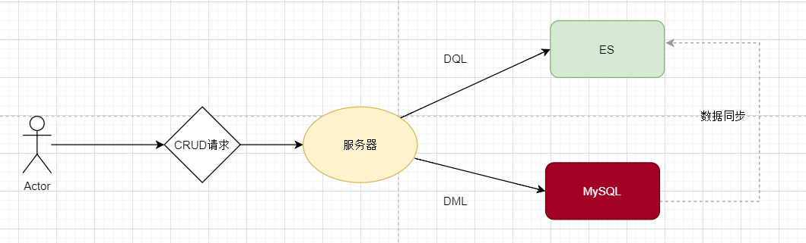
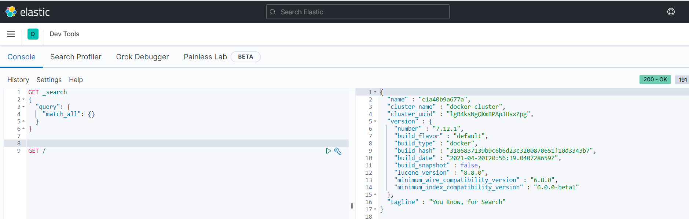
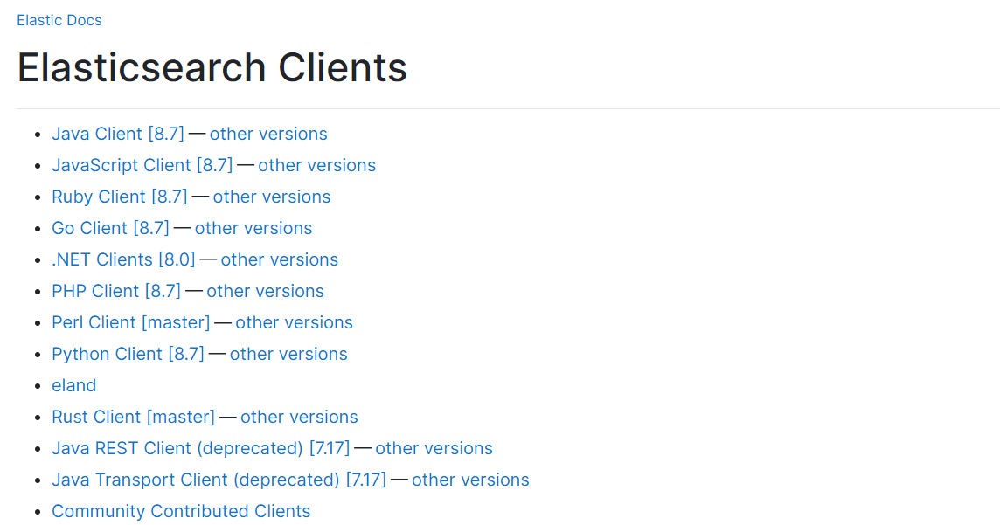
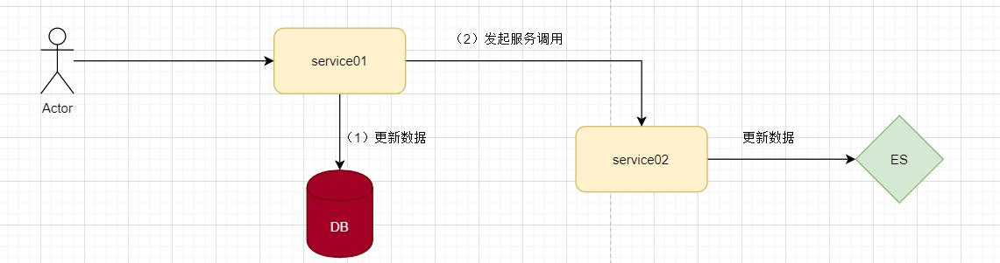
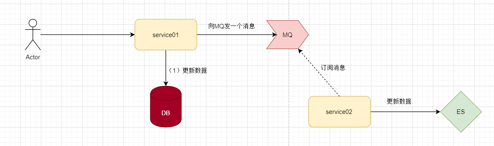
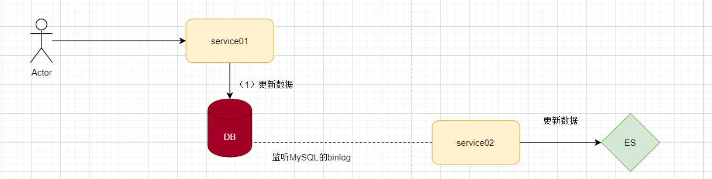

# ElasticSearch

## 初识 ElasticSearch

### ElasticSearch 简介

1. ElasticSearch 是一款非常强大的开源搜索引擎，能够帮助我们从海量数据中找到所需要的数据。

2. elasticsearch结合kibana、Logstash、Beats，也就是elastic stack（ELK）。被广泛应用在日志数据分析、实时监控等领域。

3. elasticsearch是elastic stack的核心，负责存储、搜索、分析数据。

4. 举几个生活中的例子，这些都可以体现出是从海量数据中找到满足条件的数据。

   + 在浏览器上搜索信息

     

     

   + 逛GitHub

     

     

   + 京东/淘宝网站上搜索商品

     


### 正向索引和倒排索引

1. 正向索引：比如说传统的关系型数据库（MySQL）采用正向索引。

   

2. 倒排索引：由两部分组成文档（一般记录文档ID）和词条。

   + 文档：一个文档对应一条数据记录。
   + 词条：由文档按照语义划分的词语。

   


### ES和MySQL区别

1. 先看几个概念

   + ES是面向文档数据结构存储的，一个文档对数据库表中一条记录，ES中文档存储格式是通过json方式存储的，和传统数据库（MySQL）是有差别的。	
   + ES中索引和映射的概念
     + 索引（index）就是相同类型的文档集合，就类似于MySQL的一张表。
     + 映射（mapping）就是来规定文档类型（字段信息）的，就类似于MySQL表结构约束。

2. 总结一下ES和MySQL区别

   | MySQL  | ElasticSearch | 说明                                                         |
   | ------ | ------------- | ------------------------------------------------------------ |
   | table  | index         | 索引（index）就是文档集合，类似于数据库的表（table）         |
   | row    | document      | 文档（document）是按照json格式存储的，类似于数据库的一行数据（row） |
   | column | field         | 字段（field）定义json文档中的字段，类似于数据库的一列数据（column） |
   | schema | mapping       | 映射（mapping）索引中文档的约束（字段类型约束），类似于数据库的表结构（schema）。 |
   | sql    | dsl           | dsl是es提供的json风格的请求语句，用来操作es实现crud。        |

3. ES和MySQL的使用场景

   + MySQL擅长事务类型操作，可以确保数据的安全和一致性。
   + ES擅长海量数据的搜索、分析、计算。

   

## ElasticSearch 简单使用

### ElasticSearch 安装

1. 创建网络，因为我们还需要部署kibana容器，因此需要让es和kibana容器互联。

   ```shell
   docker network create es-net
   ```

   

2. 加载镜像，需要加载elasticsearch 和 kibana，注意两者请保持版本一致。

   ```shell
   docker pull elasticsearch:7.12.1
   ```

   ```shell
   docker pull kibana:7.12.1
   ```

3. 部署单点es

   + `-e "cluster.name=es-docker-cluster"`：设置集群名称
   + `-e "http.host=0.0.0.0"`：监听的地址，可以外网访问
   + `-e "ES_JAVA_OPTS=-Xms512m -Xmx512m"`：内存大小
   + `-e "discovery.type=single-node"`：非集群模式
   + `-v es-data:/usr/share/elasticsearch/data`：挂载逻辑卷，绑定es的数据目录
   + `-v es-logs:/usr/share/elasticsearch/logs`：挂载逻辑卷，绑定es的日志目录
   + `-v es-plugins:/usr/share/elasticsearch/plugins`：挂载逻辑卷，绑定es的插件目录
   + `--privileged`：授予逻辑卷访问权
   + `--network es-net` ：加入一个名为es-net的网络中
   + `-p 9200:9200`：端口映射配置

   ```shell
   docker run -d \
   	--name es \
       -e "ES_JAVA_OPTS=-Xms512m -Xmx512m" \
       -e "discovery.type=single-node" \
       -v es-data:/usr/share/elasticsearch/data \
       -v es-plugins:/usr/share/elasticsearch/plugins \
       --privileged \
       --network es-net \
       -p 9200:9200 \
       -p 9300:9300 \
   elasticsearch:7.12.1
   ```

   

4. 浏览器输入：http://192.168.186.129:9200/，如果可以看到一串json那就表示es安装成功了。

   ```json
   {
       "name": "c1a40b9a677a",
       "cluster_name": "docker-cluster",
       "cluster_uuid": "lgR4ksNgQXmBPApJHsxZpg",
       "version": {
           "number": "7.12.1",
           "build_flavor": "default",
           "build_type": "docker",
           "build_hash": "3186837139b9c6b6d23c3200870651f10d3343b7",
           "build_date": "2021-04-20T20:56:39.040728659Z",
           "build_snapshot": false,
           "lucene_version": "8.8.0",
           "minimum_wire_compatibility_version": "6.8.0",
           "minimum_index_compatibility_version": "6.0.0-beta1"
       },
       "tagline": "You Know, for Search"
   }
   ```

   

5. 部署kibana，kibana可以给我们提供一个elasticsearch的可视化界面，便于我们学习。

   + `--network es-net` ：加入一个名为es-net的网络中，与elasticsearch在同一个网络中。
   + `-e ELASTICSEARCH_HOSTS=http://es:9200"`：设置elasticsearch的地址，因为kibana已经与elasticsearch在一个网络，因此可以用容器名直接访问elasticsearch
   + `-p 5601:5601`：端口映射配置

   ```shell
   docker run -d \
   --name kibana \
   -e ELASTICSEARCH_HOSTS=http://es:9200 \
   --network=es-net \
   -p 5601:5601  \
   kibana:7.12.1
   ```

6. 浏览器访问：http://192.168.186.129:5601/，如果可以看到界面就表示kibnana安装成功了~

7. 介绍一下kibnana工具，[Dev tools](http://192.168.186.129:5601/app/dev_tools#/console)，可以使用这个工具对es数据进行增删改查，而且代码提示也很友好。

   + `GET /` 则是模拟了 http://192.168.186.129:9200/ 接口返回的数据。

   


### ES默认分词器

1. 默认情况下es会对用户输入的信息和建立倒排索引时进行分词，但是es的默认分词规则对中文支持很不友好，在kinaba的DevTool中测试。

   + 语法说明：
     + POST：请求方式
     + /_analyze：请求路径，这里省略了http://192.168.150.101:9200，有kibana帮我们补充
     + 请求参数，json风格：
       + analyzer：分词器类型，这里是默认的standard分词器
       + text：要分词的内容

   ```json
   POST _analyze
   {
     "analyzer": "standard",
     "text": ["我喜欢学习Java~"]
   }
   ```

### IK分词器

1. 如果要处理中文分词器，一般会使用IK分词器，[官网地址](https://github.com/medcl/elasticsearch-analysis-ik)：https://github.com/medcl/elasticsearch-analysis-ik

2. IK分词器默认有两种类型

   + ik_smart：最少切分，粗粒度
     + 优点：占内存少，可以缓存更多的词条。
     + 缺点：搜索内容不全面。
   + ik_max_word：最细切分，细粒度。
     + 优点：粒度细，搜索结果更全面。
     + 缺点：比较占用内存。

3. IK分词器安装

   + 安装IK分词器的方式（两种）

     + 在线（较慢）

       ```shell
       # 进入容器内部
       docker exec -it es /bin/bash
       
       # 在线下载并安装
       ./bin/elasticsearch-plugin  install https://github.com/medcl/elasticsearch-analysis-ik/releases/download/v7.12.1/elasticsearch-analysis-ik-7.12.1.zip
       
       #退出
       exit
       #重启容器
       docker restart es
       ```

       

     + 离线（推荐）

       + 安装插件需要知道elasticsearch的plugins目录位置，而我们用了数据卷挂载，因此需要查看elasticsearch的数据卷目录。

         ```shell
         docker volume inspect es-plugins
         ```

       + 将本地的ik分词器压缩包解压并重命名为ik，将ik文件夹上传到es容器的插件数据卷中。

       + 重启容器

         ```shell
         docker restart es
         ```

4. IK分词器安装好了，就可以测试了。

   + 使用 ik_smart（最少切分，粗粒度）

     ```json
     GET /_analyze
     {
       "analyzer": "ik_smart",
       "text": "后端程序员需要会SSM框架~"
     }
     ```

     

   + 使用 ik_max_word（最多切分，细粒度）

     ```json
     GET /_analyze
     {
       "analyzer": "ik_smart",
       "text": "后端程序员需要会SSM框架~"
     }
     ```

   + 测试发现，使用两种不同模式的分词器类型运行结果也不一样。

### IK分词库拓展和停用

1. IK分词库拓展，需要定义一些自定义热词（近期的网络热词）。

   + 要拓展ik分词器的词库，只需要修改一个ik分词器目录中的config目录中的IkAnalyzer.cfg.xml文件。

     ```xml
     <?xml version="1.0" encoding="UTF-8"?>
     <!DOCTYPE properties SYSTEM "http://java.sun.com/dtd/properties.dtd">
     <properties>
         <comment>IK Analyzer 扩展配置</comment>
         <!--用户可以在这里配置自己的扩展字典 *** 添加扩展词典-->
         <entry key="ext_dict">ext.dic</entry>
     </properties>
     ```

     

   + ext.dic

     ```tex
     白嫖
     大怨种
     ```

     

2. IK分词库停用，屏蔽一些关键词，敏感词以及一些毫无意义的词。

   + 要停用ik分词器的词库，只需要修改一个ik分词器目录中的config目录中的IkAnalyzer.cfg.xml文件。

     ```xml
     <?xml version="1.0" encoding="UTF-8"?>
     <!DOCTYPE properties SYSTEM "http://java.sun.com/dtd/properties.dtd">
     <properties>
         <comment>IK Analyzer 扩展配置</comment>
         <!--用户可以在这里配置自己的扩展字典-->
         <entry key="ext_dict">ext.dic</entry>
         <!--用户可以在这里配置自己的扩展停止词字典 添加停用词词典-->
         <entry key="ext_stopwords">stopword.dic</entry>
     </properties>
     ```

   + stopword.dic文件已经存在了，就在同级目录下（如果没有就自己创建吧）。

     ```tex
     SB
     啊
     嗯
     呃
     的
     DSB
     HMP
     ```

     

### 索引库新增

1. Mapping主要是进行索引中文档字段的约束，类似于定义数据表结构。

2. Mapping常见属性

   + type（数据字段类型）
     + text（可分词的文本，参与索引倒排）、keyword（精准值）
     + byte、shoot、integer、login、float、double
     + boolean
     + date
     + object
   + index：是否创建索引，默认为true
   + annalyzer：使用哪种分词器（默认是standard）
   + proerties，嵌套字段（该字段的子字段）

3. 练习，中通过Restful请求操作索引库

   ```json
   {
       "code": 200,
       "message": "查询成功",
       "data": {
           "desc": "我们支持订阅啦~",
           "imagePath": "https://www.wanandroid.com/blogimgs/42da12d8-de56-4439-b40c-eab66c227a4b.png",
           "title": "玩Android API",
           "url": "https://www.wanandroid.com/blog/show/3352"
       }
   }
   ```

   ```json
   PUT /hotel
   {
       "mappings": {
           "properties": {
               "all": {
                   "type": "text",
                   "analyzer": "ik_smart"
               },
               "id": {
                   "type": "keyword"
               },
               "name": {
                   "type": "text",
                   "analyzer": "ik_smart",
                   "copy_to": "all"
               },
               "address": {
                   "type": "text",
                   "analyzer": "ik_smart"
               },
               "price": {
                   "type": "float"
               },
               "score": {
                   "type": "float"
               },
               "brand": {
                   "type": "keyword"
               },
               "city": {
                   "type": "keyword"
               },
               "star_name": {
                   "type": "keyword"
               },
               "business": {
                   "type": "text",
                   "analyzer": "ik_smart",
                   "copy_to": "all"
               },
               "location": {
                   "type": "geo_point"
               },
               "pic": {
                   "type": "keyword",
                   "index": false
               }
           }
       }
   }
   ```


### 索引库查询

1. 索引库查询查询语法很简单

   ```shell
   GET /索引库名称
   ```

2. 查询刚刚新建的article索引库

   ```json
   GET /article
   ```

   

### 索引库更新

1. 需要注意，索引库更新不能更新原有字段（更新会报错），只能是新添加字段，更新索引库的语法

   ```json
   PUT /索引库名称/_mapping
   "properties":{
       "新字段名":{
           "type": "数据类型"
       }
   }
   ```

2. 在article索引库中新添加一个时间字段

   ```json
   PUT /article/_mapping
   {
     "properties":{
       "time":{
         "type":"date"
       }
     }
   }
   ```

   

### 索引库删除

1. 删除索引库语法也很简单

   ```json
   DELETE /索引库名称
   ```

   

2. 删除article索引库

   ```json
   DELETE /article
   ```


### 文档新增

1. 语法

   ```json
   PUT /索引库名称/_doc/文档Id(文档ID不指定则默认生成)
   {
       "字段名":"字段值",
       "字段名":"字段值"
   }
   ```

   

2. 练习

   ```json
   PUT /article/_doc/1
   {
       "code": 200,
       "message": "查询成功",
       "data": {
           "desc": "我们支持订阅啦~",
           "imagePath": "https://www.wanandroid.com/blogimgs/42da12d8-de56-4439-b40c-eab66c227a4b.png",
           "title": "玩Android API",
           "url": "https://www.wanandroid.com/blog/show/3352"
       }
   }
   ```

   

### 文档查询

1. 语法

   ```json
   GET /索引库名称/_doc/文档Id
   ```

   

2. 练习

   ```json
   GET /article/_doc/1
   ```

   

### 文档删除

1. 语法

   ```json
   DELETE /索引库名称/_doc/文档Id
   ```

   

2. 练习

   ```json
   DELETE /article/_doc/1
   ```

   

### 文档更新

1. 更新语法有两种

   + 覆盖更新，使用PUT方式（ID存在就先删除之前存在的文档，再将当前文档新增进去，ID不存在就新增）。

     ```json
     PUT /索引库名称/_doc/文档Id
     {
         "字段名":"字段值",
         "字段名":"字段值"
     }
     ```

     

   + 局部更新使用POST方式（只更新部分字段）

     ```json
     POST /索引库名称/_update/文档Id
     {
         "doc":{
             "字段名":"字段值",
             "字段名":"字段值"
         }
     }
     ```

     

2. 练习

   + 覆盖更新

     ```json
     PUT /article/_doc/1
     {
         "code": -200,
         "message": "查询失败",
         "data": {
             "desc": "~",
             "imagePath": "",
             "title": "",
             "url": ""
         }
     }
     ```

     

   + 局部更新

     ```json
     POST /article/_update/1
     {
         "doc": {
             "code": 500,
             "data":{
                 "title":"Android 项目教程~~"
             }
         }
     }
     ```

     

## ES 文档条件查询

### 查询全部

1. 虽然查询方式叫做查询全部，但是实际上是并没有将全部数据查询展示出来，应该是ES考虑到减少服务器压力和内存占用情况只查询了一部分数据作展示（前10条数据），但是也可以从返回的数据中（hits.total.value）得到一共有多少条数据。

2. 查询举例

   ```json
   GET /hotel/_search
   {
       "query": {
           "match_all": {}
       }
   }
   ```

   

### 全文索引查询

1. 全文检索查询一般是查询类型为Text的字段类型数据，利用分词器对用户输入内容分词，然后去倒排索引库中匹配，全文检索查询中查询类型有两种

   + match_query，利用分词器对用户输入内容分词，然后去倒排索引库中匹配
   + multi_match_query，和match_query类似，只不过multi_match_query允许查询多个字段，

2. multi_match_query这种方式，字段越多会导致查询效率下降，可以考虑，将多个要进行分词的字段通过copy_to到同一个字段中，再使用match_query 查询类型会提高查询的效率。

3. match_query 查询类型

   ```json
   
   GET /hotel/_search
   {
       "query": {
           "match": {
               "all": "北京如家"
           }
       }
   }
   ```

   

4. multi_match_query 查询类型

   ```json
   GET /hotel/_search
   {
       "query": {
           "multi_match": {
               "query": "北京如家",
               "fields": ["brand","name"]
           }
       }
   }
   ```

   

### 精确查询

1. 根据词条进行精确匹配，一般是查找keyword、数值、日期、boolean等类型字段。所以不会对搜索条件分词，常见查询类型有两种：

   + term：根据词条进行精确匹配
   + range：根据值的范围查询

2. term  查询类型

   ```json
   GET /hotel/_search
   {
       "query": {
           "term": {
               "brand": {
                   "value": "如家"
               }
           }
       }
   }
   ```

   

3. range  查询类型

   + gte（ greater than or equal） 大于等于
   + ge（greater than） 大于
   + lte（greater than or equal） 小于等于
   + le（less than） 小于

   ```json
   GET /hotel/_search
   {
       "query": {
           "range": {
               "price": {
                   "gte": 100,
                   "lte": 200
               }
           }
       }
   }
   ```

   

### 地理坐标查询

1. 地理坐标查询，一般使用场景就是根据两个经纬度点查询某个范围中的文档（geo_bounding_box查询类型）或者根据一个经纬度查询附近指定范围内的文档（geo_distance查询类型）。

2. 演示geo_bounding_box，查询geo_point值落在某个矩形范围的所有文档

   ```json
   GET /hotel/_search
   {
       "query": {
           "geo_bounding_box": {
               "location": {
                   "top_left": {
                       "lat": 31.1,
                       "lon": 121.5
                   },
                   "bottom_right": {
                       "lat": 30.9,
                       "lon": 121.7
                   }
               }
           }
       }
   }
   ```

   

3. 演示geo_distance，查询到指定中心点小于某个距离值的所有文档

   ```json
   GET /hotel/_search
   {
       "query": {
           "geo_distance": {
               "distance": "15km",
               "location": "31.21,121.5"
           }
       }
   }
   ```

   

### 复合查询 - fuction score Query

1. 复合（compound）查询：复合查询可以将其它简单查询组合起来，实现更复杂的搜索逻辑

2. fuction score：算分函数查询，可以控制文档相关性算分，控制文档排名，elasticsearch中的相关性打分算法是什么？

   + TF-IDF：在elasticsearch5.0之前，会随着词频增加而越来越大。
   + BM25：在elasticsearch5.0之后，会随着词频增加而增大，但增长曲线会趋于水平。

3. 算分函数查询的应用，比如京东上搜索手机，有些手机品牌会靠前有些则是靠后，这个排名实际上是可以人为控制的。

   

   

4. function score query定义的三要素是什么？ 

   + 过滤条件：哪些文档要加分
   + 算分函数：如何计算function  score，常见的算分函数包含以下几类：
     + weight：给一个常量值，作为函数结果（function score）
     + field_value_factor：用文档中的某个字段值作为函数结果
     + random_score：随机生成一个值，作为函数结果
     + script_score：自定义计算公式，公式结果作为函数结果
   + 加权方式：function score 与 query score（每个查询出来的文档根据特定的算法会计算出一个查询得分）如何运算，常见的加权方式包含以下几类：
     + multiply：两者相乘。默认就是这个
     + replace：用function score 替换 query score
     + 其它：sum、avg、max、min

5. 查询得分练习，查询“酒店”相关的文档，并且将如家的酒店排名靠前。

   ```json
   GET /hotel/_search
   {
       "query": {
           "function_score": {
               "query": {
                   "match": {
                       "all": "酒店"
                   }
               },
               "functions": [
                   {
                       "filter": {
                           "term": {
                               "brand": "如家"
                           }
                       },
                       "weight": 10
                   }
               ],
               "boost_mode": "multiply"
           }
       }
   }
   ```

### 复合查询 - Boolean Query

1. 布尔查询是一个或多个查询子句的组合。子查询的组合方式有：

   + must：必须匹配每个子查询，类似“与”
   + filter：必须匹配，不参与算分
   + should：选择性匹配子查询，类似“或”
   + must_not：必须不匹配，不参与算分，类似“非”。

2. 布尔查询的使用场景

   + 京东购物搜索商品

     

   + 淘宝购物搜索商品

     

   

3. 案例：搜索名字中包含如家，价格不高于400，坐标范围在31.22，121.5周围10km范围内的数据。

   ```json
   GET /hotel/_search
   {
       "query": {
           "bool": {
               "must": [
                   {
                       "match": {
                           "brand": "如家"
                       }
                   }
               ],
               "must_not": [
                   {
                       "range": {
                           "price": {
                               "gt": 400
                           }
                       }
                   }
               ], 
               "filter": [
                   {
                       "geo_distance": {
                           "distance": "10km",
                           "location": "31.22,121.5"
                       }
                   }
               ]
           }
       }
   }
   ```


### 查询条件排序

1. es支持对查询结果进行排序的，默认情况下是根据相关度算分进行排序。可以排序的字段类型有：经纬度、数值、日期、keyword等等。

2. 对酒店数据按照用户评价降序排序，评价相同的按照价格升序排序。

   ```json
   GET /hotel/_search
   {
       "query": {
           "match_all": {}
       },
       "sort": [
           {
               "score": {
                   "order": "desc"
               },
               "price": {
                   "order": "asc"
               }
           }
       ]
   }
   ```

3. 查询指定经纬度范围内的酒店

   + 经纬度查询地址：https://lbs.amap.com/demo/jsapi-v2/example/map/click-to-get-lnglat/。

   ```json
   GET /hotel/_search
   {
       "query": {
           "match_all": {}
       },
       "sort": [
           {
               "_geo_distance": {
                   "location":"31.252148,121.456302",
                   "order": "asc",
                   "unit": "km"
               }
           }
       ]
   }
   ```

   

### 查询条件分页

1. es查询结果中，默认会返回10条数据，我们可以通过配置（from + size）来自定义返回结果的数量，但是在es中有一个规定单次查询数量不能大于1000。

2. 案例演示

   + from：分页开始的位置（默认为0）
   + size：期望获取的文档总数

   ```json
   GET /hotel/_search
   {
       "query": {
           "match_all": {}
       },
       "from": 6,
       "size": 3,
       "sort": [
           {
               "price": {
                   "order": "desc"
               }
           }
       ]
   }
   ```

3. 深度分页解决方案，针对深度分页ES提供了两种解决访问：

   + search after：分页时需要排序，原理是从上一次的排序值开始，查询下一页数据。官方推荐使用的方式。
   + scroll：原理将排序数据形成快照，保存在内存。官方已经不推荐使用。

### 查询条件高亮

1. 查询条件高亮的场景很常见，比如百度搜索：“SpringBoot”，搜索结果只要是关于“SpringBoot”字样的就会特殊高亮显式。

   

2. 查询结果高亮显示的原理

   + 服务端对查询结果中的关键字添加标签
   + 前端配置标签样式

3. 查询结果高亮显示案例，查询酒店关键字（并将“酒店”关键字进行高亮显式）。

   + 注意

     + 查询高亮时，不能使用match_all查询类型进行查询，需要通过精确匹配matchl查询类型。

     + 查询高亮的显示结果不会覆盖原文，而是在highlight.name的字段中。

   ```json
   GET /hotel/_search
   {
       "query": {
           "match": {
               "all": "酒店"
           }
       },
       "highlight": {
           "fields": {
               "name": {
                   "require_field_match": "false"
               }
           }
       }
   }
   ```

   

## RestClient 

### RestClient 简介

1. ES官方提供了各种不同语言的客户端来操作ES，这些客户端本质就是组装DSL语句，通过HTTP请求发送给ES，官方文档地址：https://www.elastic.co/guide/en/elasticsearch/client/index.html

   


### 编写创建索引库DSL

1. 分析以下SQL语句

   ```sql
   DROP TABLE IF EXISTS `tb_hotel`;
   CREATE TABLE `tb_hotel`  (
       `id` bigint(20) NOT NULL COMMENT '酒店id',
       `name` varchar(255) CHARACTER SET utf8mb4 COLLATE utf8mb4_general_ci NOT NULL COMMENT '酒店名称',
       `address` varchar(255) CHARACTER SET utf8mb4 COLLATE utf8mb4_general_ci NOT NULL COMMENT '酒店地址',
       `price` int(10) NOT NULL COMMENT '酒店价格',
       `score` int(2) NOT NULL COMMENT '酒店评分',
       `brand` varchar(32) CHARACTER SET utf8mb4 COLLATE utf8mb4_general_ci NOT NULL COMMENT '酒店品牌',
       `city` varchar(32) CHARACTER SET utf8mb4 COLLATE utf8mb4_general_ci NOT NULL COMMENT '所在城市',
       `star_name` varchar(16) CHARACTER SET utf8mb4 COLLATE utf8mb4_general_ci NULL DEFAULT NULL COMMENT '酒店星级，1星到5星，1钻到5钻',
       `business` varchar(255) CHARACTER SET utf8mb4 COLLATE utf8mb4_general_ci NULL DEFAULT NULL COMMENT '商圈',
       `latitude` varchar(32) CHARACTER SET utf8mb4 COLLATE utf8mb4_general_ci NOT NULL COMMENT '纬度',
       `longitude` varchar(32) CHARACTER SET utf8mb4 COLLATE utf8mb4_general_ci NOT NULL COMMENT '经度',
       `pic` varchar(255) CHARACTER SET utf8mb4 COLLATE utf8mb4_general_ci NULL DEFAULT NULL COMMENT '酒店图片',
       PRIMARY KEY (`id`) USING BTREE
   ) ENGINE = InnoDB CHARACTER SET = utf8mb4 COLLATE = utf8mb4_general_ci ROW_FORMAT = Compact;
   ```

   

2. 根据SQL语句创建索引库

   + ES中支持两种地理坐标数据类型：

     + geo_point：由纬度（latitude）和经度（longitude）确定的一个点。例如："32.8752345, 120.2981576"
     + geo_shape：有多个geo_point组成的复杂几何图形。例如一条直线，"LINESTRING (-77.03653 38.897676, -77.009051 38.889939)"
     + 字段拷贝可以使用copy_to属性将当前字段拷贝到指定字段。

     ```json
     PUT /hotel
     {
         "mappings": {
             "properties": {
                 "all": {
                     "type": "text",
                     "analyzer": "ik_smart"
                 },
                 "id": {
                     "type": "keyword"
                 },
                 "name": {
                     "type": "text",
                     "analyzer": "ik_smart",
                     "copy_to": "all"
                 },
                 "address": {
                     "type": "text",
                     "analyzer": "ik_smart"
                 },
                 "price": {
                     "type": "float"
                 },
                 "score": {
                     "type": "float"
                 },
                 "brand": {
                     "type": "keyword"
                 },
                 "city": {
                     "type": "keyword",
                     "index": false
                 },
                 "star_name": {
                     "type": "keyword"
                 },
                 "business": {
                     "type": "text",
                     "analyzer": "ik_smart",
                     "copy_to": "all"
                 },
                 "location": {
                     "type": "geo_point"
                 },
                 "pic": {
                     "type": "keyword",
                     "index": false
                 }
             }
         }
     }
     ```

     


### 初始化RestHighLevelClient

1. 引入依赖

   ```xml
   <dependency>
       <groupId>org.elasticsearch.client</groupId>
       <artifactId>elasticsearch-rest-high-level-client</artifactId>
   </dependency>
   ```

   

2. 因为SpringBoot默认elasticsearch版本是7.6.2，而服务端的elasticsearch版本是7.12.1，需要保持两边同步，这里对SpringBoot中定义的版本做覆盖。

   ```xml
   <properties>
       <elasticsearch.version>7.12.1</elasticsearch.version>
   </properties>
   ```

   

3. 初始化RestHighLevelClient

   ```java
   @SpringBootTest
   class HotelDemoApplicationTests {
   
       private RestHighLevelClient client;
   
       @BeforeEach
       public void beforeEach() {
           // 初始化
           client = new RestHighLevelClient(RestClient.builder(HttpHost.create("http://192.168.186.129:9200")));
       }
   
       @AfterEach
       public void afterEach() throws IOException {
           // 释放资源
           client.close();
       }
   }
   ```


## RestClient 操作索引库

### RestClient 创建索引库

```java
@Test
void testCreateIndex() throws IOException {
    // 创建请求对象
    CreateIndexRequest request = new CreateIndexRequest("hotel");

    // HotelConstants.HOTEL_MAPPING 就是DSL字符串, 类型是JSON
    request.source(HotelConstants.HOTEL_MAPPING, XContentType.JSON);

    // 发送DSL语句
    client.indices().create(request, RequestOptions.DEFAULT);
}
```


### RestClient 删除索引库

```java
@Test
void testDeleteIndex() throws IOException {
    DeleteIndexRequest request = new DeleteIndexRequest("hotel");
    client.indices().delete(request, RequestOptions.DEFAULT);
}
```


### RestClient 判断索引库是否存在

```java
@Test
void testIndexExists() throws IOException {
    GetIndexRequest request = new GetIndexRequest("hotel");
    boolean exists = client.indices().exists(request, RequestOptions.DEFAULT);
    System.out.println(exists ? "hotel 索引库存在！" : "hotel 索引库不存在！");
}
```


## RestClient 操作文档

### RestClient 新增文档

1. 将数据从数据库中查询出来，再添加到es中

   ```java
   @Test
   void testAddDocument() throws IOException {
       // 从数据库中查询出来的数据
       Hotel hotel = service.getById(47066L);
       // HotelDoc 保证和ES中Index数据结构一致
       HotelDoc hotelDoc = new HotelDoc(hotel);
   
       // 创建Request对象
       IndexRequest indexRequest = new IndexRequest("hotel").id(String.valueOf(hotelDoc.getId()));
       // 添加数据源(JSON字符串)
       indexRequest.source(JSON.toJSONString(hotelDoc), XContentType.JSON);
       // 发送请求
       client.index(indexRequest, RequestOptions.DEFAULT);
   }
   ```

2. 可以在kibnana的Dev-Tool中执行文档查询请求，查看是否添加成功。

   ```tex
   GET /hotel/_doc/47066
   ```


### RestClient 查询文档

```java
@Test
void testSelectDocument() throws IOException {
    GetRequest request = new GetRequest("hotel", "47066");
    GetResponse response = client.get(request, RequestOptions.DEFAULT);

    // 通过FastJson将字符串转成JavaBean
    HotelDoc hotelDoc = JSON.parseObject(response.getSourceAsString(), HotelDoc.class);
    System.out.println("hotelDoc = " + hotelDoc);
}
```


### RestClient 更新文档

+ 局部更新

  ```java
  @Test
  void testUpdateDocumentWithLocal() throws IOException {
      // 创建request对象
      UpdateRequest request = new UpdateRequest("hotel", "47066");
  
      // 更新的字段信息(局部更新)
      HashMap<String, Object> data = new HashMap<String, Object>() {{
          put("price", 999);
          put("starName", "五钻");
          put("score", 86);
      }};
      request.doc(data);
  
      // 发送请求
      client.update(request, RequestOptions.DEFAULT);
  }
  ```

+ 全部更新（和新增代码一样，ID已经存在就会覆盖，不存在就新增）。

  ```java
  @Test
  void testUpdateDocumentWithGlobal() throws IOException {
      // 从数据库中查询出来的数据、并做更新
      Hotel hotel = service.getById(47066L);
      HotelDoc hotelDoc = new HotelDoc(hotel);
      hotelDoc.setStarName("二钻,");
      hotelDoc.setScore(42);
      hotelDoc.setPrice(159);
  
      // 创建request对象
      IndexRequest request = new IndexRequest("hotel").id(String.valueOf(47066));
      request.source(JSON.toJSONString(hotelDoc), XContentType.JSON);
      // 发送请求
      client.index(request, RequestOptions.DEFAULT);
  }
  ```


### RestClient  删除文档

```java
@Test
void testDeleteDocument() throws IOException {
    DeleteRequest request = new DeleteRequest("hotel", "47066");
    client.delete(request, RequestOptions.DEFAULT);
}
```


### RestClient  批量导入文档

1. 先批量从数据库中查询数，再将数据批量导入到es中

   ```java
   @Test
   void testBatchAddDocument() throws IOException {
       // 从数据库中查询出来的数据
       List<Hotel> hotelList = service.list();
   
       BulkRequest request = new BulkRequest();
       hotelList.forEach(hotel -> {
           HotelDoc hotelDoc = new HotelDoc(hotel);
   
           // 将IndexRequest添加到BulkRequest中
           request.add(
               new IndexRequest("hotel")
               .id(String.valueOf(hotelDoc.getId()))
               .source(JSON.toJSONString(hotelDoc), XContentType.JSON)
           );
       });
   
       // 执行请求
       client.bulk(request, RequestOptions.DEFAULT);
   }
   ```

2. 查看es中全部数据的方法

   ```
   GET /hotel/_search
   ```

   

## RestClient 查询文档

### RestClient 查询全部

```java
@Test
void testSelectAll() throws IOException {
    SearchRequest request = new SearchRequest("hotel");
    request.source().query(QueryBuilders.matchAllQuery());
    SearchResponse searchResponse = client.search(request, RequestOptions.DEFAULT);
    handleResponse(searchResponse);
}
```

```java
/**
     * 处理查询结果集
     *
     * @param searchResponse searchResponse
     */
private void handleResponse(SearchResponse searchResponse) {
    SearchHit[] hits = searchResponse.getHits().getHits();
    if (hits != null && hits.length > 0) {
        System.out.println("总共查询到： " + searchResponse.getHits().getTotalHits().value + "条数据!");
        for (SearchHit hit : hits) {
            String source = hit.getSourceAsString();
            HotelDoc hotelDoc = JSON.parseObject(source, HotelDoc.class);

            // 处理查询结果高亮显式
            Map<String, HighlightField> highlightFields = hit.getHighlightFields();
            if (!CollectionUtils.isEmpty(highlightFields)) {
                highlightFields.forEach((s, highlightField) -> {
                    if (highlightField.fragments().length > 0) {
                        String string = highlightField.fragments()[0].string();
                        hotelDoc.setName(string);
                    }
                });
            }
            System.out.println("hotelDoc = " + hotelDoc);
        }
    } else {
        System.out.println("总共查询到：0条数据!");
    }
}
```

### RestClient 全文索引查询

1. 演示全文索引查询：match_query 查询类型

   ```java
   @Test
   void testFullIndexWithMatch() throws IOException {
       SearchRequest request = new SearchRequest("hotel");
       request.source().query(QueryBuilders.matchQuery("all", "如家"));
       SearchResponse searchResponse = client.search(request, RequestOptions.DEFAULT);
       handleResponse(searchResponse);
   }
   ```

2. 演示全文索引查询：multi_match_query 查询类型

   ```java
   @Test
   void testFullIndexWithMultiMatch() throws IOException {
       SearchRequest request = new SearchRequest("hotel");
       request.source().query(QueryBuilders.multiMatchQuery("上海","brand","business"));
       SearchResponse searchResponse = client.search(request, RequestOptions.DEFAULT);
       handleResponse(searchResponse);
   }
   ```

   

### RestClient 经纬度查询

1. 根据geo_diatance类型查询

   ```java
   @Test
   void testLatLog() throws IOException {
       SearchRequest request = new SearchRequest("hotel");
       request.source().query(QueryBuilders.geoDistanceQuery("location").distance("15km").point(31.21,121.5));
       SearchResponse searchResponse = client.search(request, RequestOptions.DEFAULT);
       handleResponse(searchResponse);
   }
   ```

   

2. 根据get_box类型查询

   ```java
   @Test
   void testLatLogWithBoundingBox() throws IOException {
       SearchRequest request = new SearchRequest("hotel");
       GeoBoundingBoxQueryBuilder queryBuilder = QueryBuilders.geoBoundingBoxQuery("location");
       queryBuilder.topLeft().reset(31.1, 121.5);
       queryBuilder.bottomRight().reset(30.9, 121.7);
       request.source().query(queryBuilder);
       SearchResponse searchResponse = client.search(request, RequestOptions.DEFAULT);
       handleResponse(searchResponse);
   }
   ```

### RestClient 复合查询 

1. bool类型查询

   ```java
   @Test
   void tesBool() throws IOException {
       // 搜索名字中包含如家的酒店，价格不高于400，坐标范围在31.22，121.5周围10km范围内的数据。
       SearchRequest request = new SearchRequest("hotel");
       BoolQueryBuilder boolQueryBuilder = QueryBuilders.boolQuery();
       boolQueryBuilder.must(QueryBuilders.termQuery("name", "如家"));
       boolQueryBuilder.mustNot(QueryBuilders.rangeQuery("price").gt(400));
       boolQueryBuilder.filter(QueryBuilders.geoDistanceQuery("location").point(31.22, 121.5).distance("10km"));
       request.source().query(boolQueryBuilder);
       SearchResponse searchResponse = client.search(request, RequestOptions.DEFAULT);
       handleResponse(searchResponse);
   }
   ```

2. function score 类型查询

   ```java
   @Test
   void tesFunctionScore() throws IOException {
       // 查询“酒店”相关的文档，并且将如家的酒店排名靠前。
       SearchRequest request = new SearchRequest("hotel");
   
       // 过滤条件
       TermQueryBuilder termQueryBuilder = new TermQueryBuilder("brand", "如家");
   
       WeightBuilder weightBuilder = new WeightBuilder();
       // 算法函数
       weightBuilder.setWeight(10);
   
       FunctionScoreQueryBuilder.FilterFunctionBuilder builder =
           new FunctionScoreQueryBuilder.FilterFunctionBuilder(termQueryBuilder, weightBuilder);
   
       // 设置查询关于如家的酒店条件
       MatchQueryBuilder matchQueryBuilder = QueryBuilders.matchQuery("all", "酒店");
   
       FunctionScoreQueryBuilder functionScoreQueryBuilder = new FunctionScoreQueryBuilder(
           matchQueryBuilder, new FunctionScoreQueryBuilder.FilterFunctionBuilder[]{builder}
       );
   
       // 执行请求
       request.source().query(functionScoreQueryBuilder);
       SearchResponse searchResponse = client.search(request, RequestOptions.DEFAULT);
       handleResponse(searchResponse);
   }
   
   ```

   


### RestClient 分页查询

```java
@Test
void testPagination() throws IOException {
    int pageNum = 1;
    int pageSize = 10;

    SearchRequest request = new SearchRequest("hotel");
    request.source().query(QueryBuilders.matchAllQuery());
    request.source().size(pageSize);
    request.source().from((pageNum - 1) * pageSize);
    SearchResponse searchResponse = client.search(request, RequestOptions.DEFAULT);
    handleResponse(searchResponse);
}
```


### RestClient 高亮查询

```java
@Test
void tesHighLight() throws IOException {
    SearchRequest request = new SearchRequest("hotel");
    request.source().query(QueryBuilders.termQuery("all", "如家"));
    HighlightBuilder highlightBuilder = new HighlightBuilder();
    highlightBuilder.field("name");
    highlightBuilder.requireFieldMatch(false);
    request.source().highlighter(highlightBuilder);

    SearchResponse searchResponse = client.search(request, RequestOptions.DEFAULT);
    handleResponse(searchResponse);
}
```


### RestClient 排序查询

```java
@Test
void tesSort() throws IOException {
    // 查询“酒店”相关的文档，并且将如家的酒店排名靠前。
    SearchRequest request = new SearchRequest("hotel");

    // 查询全部
    request.source().query(QueryBuilders.matchAllQuery());

    // 取前30条
    request.source().from(0);
    request.source().size(30);

    // 排序
    request.source().sort("price", SortOrder.ASC);

    SearchResponse searchResponse = client.search(request, RequestOptions.DEFAULT);
    handleResponse(searchResponse);
}
```


## ES 数据聚合

### 数据聚合分类

1. 数据聚合就是对查询的结构进行统计、分析和运算，数据聚合分类有三种：
   + 桶（Bucket）聚合，用来对文档进行分组。
     + TermAggregation：按照文档字段值分组
     + Date Histogram：按照日期阶梯分组，例如一周为一组，或者一月为一组
   + 度量（Metric）聚合，用来计算一些值，比如：最大值、最小值、平均值等
     + Avg：求平均值
     + Max：求最大值
     + Min：求最小值
     + Stats：同时求max、min、avg、sum等
   + 管道（pipeline），其他聚合的结果为基础聚合。
2. 参与聚合的字段类型必须是
   + keyword
   + 数值
   + 日期
   + 布尔

### 桶（Bucket）聚合

1. 查询有多少种酒店类型

   + 聚合三要素：聚合名称、聚合类型、聚合字段。

   ```json
   GET /hotel/_search
   {
       "size": 0,  // 设置size为0，结果中不包含文档，只包含聚合结果
       "aggs": {
           "brandAgg": {
               "terms": {
                   "field": "brand",
                   "size": 20 // 希望获取的聚合结果数量
               }
           }
       }
   }
   ```

   

2. 查询有多少种酒店类型（自定义排序）

   ```json
   GET /hotel/_search
   {
       "size": 0,
       "aggs": {
           "brandAgg": {
               "terms": {
                   "field": "brand",
                   "size": 20,
                   "order": {
                       "_count": "asc" // 默认按照_count字段进行降序排
                   }
               }
           }
       }
   }
   ```

   

3. 查询有多少种酒店类型（限制查询范围）

   ```json
   GET /hotel/_search
   {
       "size": 0,
       // 限制查询范围
       "query": {
           "range": {
               "price": {
                   "lte": 200
               }
           }
       }, 
       "aggs": {
           "brandAgg": {
               "terms": {
                   "field": "brand",
                   "size": 20,
                   "order": {
                       "_count": "asc"
                   }
               }
           }
       }
   }
   ```

   

### 度量（Metric）聚合

1. 查询酒店名称，并按照酒店名称评分降序排列

   ```json
   GET /hotel/_search
   {
       "size": 0,
       "aggs": {
           "brandAgg": {
               "terms": {
                   "field": "brand",
                   "size": 20,
                   "order": {
                       // 按照 avg（平均值）降序排
                       "scoreAgg.avg": "desc"
                   }
               },
               "aggs": {
                   "scoreAgg": {
                       // stats 包含了 count、min、max、avg 、sum值
                       "stats": {
                           // 计算 score的相关值
                           "field": "score"
                       }
                   }
               }
           }
       }
   }
   ```

   

## ES 自动补全


## ES 数据同步

### 数据同步解决方案

1. 当我们在开发中，对MySQL表中的数据做了更新时，为了保证ES中数据的一致性，那就需要将MySQL中的数据和ES中的数据做同步，下面介绍三种数据同步方案。

2. 同步调用

   + 代码耦合度较高
   + 调用链执行时间过长，会造成响应速度慢问题

   

   

3. 基于MQ	

   + 代码耦合度较低
   + 对于MQ的可靠性要求较高
   + 使用MQ对于编码设计难度会高一点

   

   

4. 基于MySQL的binlog

   + 代码完全解耦
   + 对于监听MysSQL的binlog的中间件要求较高

   


### 基于MQ实现数据同步

1. 有两个微服务（hotel-admin-service）和（hotel-user-service），hotel-admin-service对酒店信息进行增删改查（MySQL），hotel-user-service（ES）负责展示酒店信息，提供给用户的门户网站，现要求hotel-admin-service对酒店数据更新之后，hotel-user-service中要做到数据同步。

2. hotel-admin-service 和 hotel-user-service 引入MQ的依赖，并配置MQ地址信息。

   ```xml
   <dependency>
       <groupId>org.springframework.boot</groupId>
       <artifactId>spring-boot-starter-amqp</artifactId>
   </dependency>
   ```

   ```yaml
   spring:
     rabbitmq:
       addresses: 192.168.186.129
       port: 5672
       username: admin
       password: 123456
       virtual-host: /
   ```

3. hotel-admin-service 和 hotel-user-service中都添加一份关于MQ的常量信息。

   ```java
   public class HotelMqConstants {
       // 交换机名称
       public static final String HOTEL_EXCHANGE_NAME = "hotel.exchange.topic";
   
       // 队列名称
       public static final String HOTEL_UPDATE_OR_INSERT_QUEUE_NAME = "hotel.updateOrInsert.queue";
       public static final String HOTEL_DELETE_QUEUE_NAME = "hotel.delete.queue";
   
       // 消费者key
       public static final String HOTEL_UPDATE_OR_INSERT_KEY = "hotel.updateOrInsert.key";
       public static final String HOTEL_DELETE_QUEUE_KEY = "hotel.delete.key";
   }
   ```

   

4. hotel-user-service中定义交换机、队列以及消费者，并处理对应业务逻辑。

   ```java
   @Configuration
   public class HotelMqConfiguration {
   
       //声明交换机和队列并进行绑定
       @RabbitListener(bindings = @QueueBinding(
           value = @Queue(HotelMqConstants.HOTEL_DELETE_QUEUE_NAME),
           exchange = @Exchange(value = HotelMqConstants.HOTEL_EXCHANGE_NAME, type = ExchangeTypes.TOPIC),
           key = HotelMqConstants.HOTEL_DELETE_QUEUE_KEY
       ))
       public void deleteListener(long id) {
           // 调用Service 处理具体的业务
           System.err.println("MQ 删除ID = " + id + "的数据");
       }
   
   
       //声明交换机和队列并进行绑定
       @RabbitListener(bindings = @QueueBinding(
           value = @Queue(HotelMqConstants.HOTEL_UPDATE_OR_INSERT_QUEUE_NAME),
           exchange = @Exchange(value = HotelMqConstants.HOTEL_EXCHANGE_NAME, type = ExchangeTypes.TOPIC),
           key = HotelMqConstants.HOTEL_UPDATE_OR_INSERT_KEY
       ))
       public void updateOrInsertListener(long id) {
           // 调用Service 处理具体的业务
           System.err.println("MQ 更新或者新增ID = " + id + "的数据");
       }
   }
   ```

5. hotel-admin-service中通过RabbitTemplate发送消息到MQ中。

   ```java
   @RestController
   @RequestMapping("hotel")
   public class HotelController {
       @Autowired
       private RabbitTemplate rabbitTemplate;
   
       @PostMapping
       public void saveHotel(@RequestBody Hotel hotel) {
           // 发送消息到MQ中
           rabbitTemplate.convertAndSend(HotelMqConstants.HOTEL_EXCHANGE_NAME, HotelMqConstants.HOTEL_UPDATE_OR_INSERT_KEY, hotel.getId());
           // 调用Service处理业务
       }
   
       @PutMapping()
       public void updateById(@RequestBody Hotel hotel) {
           if (hotel.getId() == null) {
               throw new InvalidParameterException("id不能为空");
           }
           // 发送消息到MQ中
           rabbitTemplate.convertAndSend(HotelMqConstants.HOTEL_EXCHANGE_NAME, HotelMqConstants.HOTEL_UPDATE_OR_INSERT_KEY, hotel.getId());
           // 调用Service处理业务
       }
   
       @DeleteMapping("/{id}")
       public void deleteById(@PathVariable("id") Long id) {
           // 发送消息到MQ中
           rabbitTemplate.convertAndSend(HotelMqConstants.HOTEL_EXCHANGE_NAME, HotelMqConstants.HOTEL_DELETE_QUEUE_KEY, id);
           // 调用Service处理业务
       }
   }
   ```


## ES 集群
