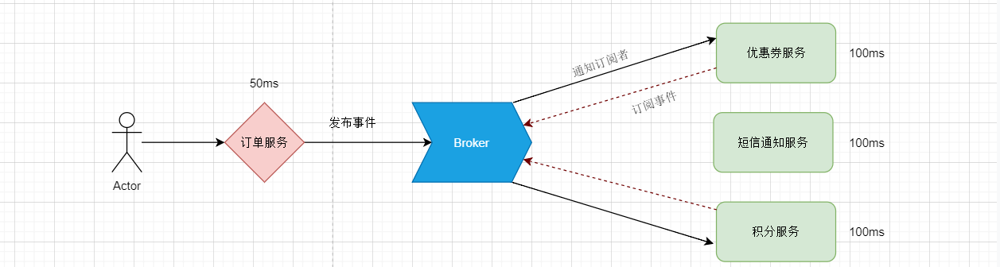
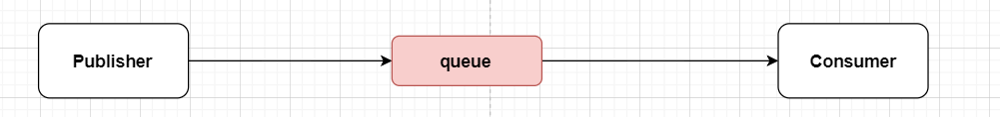

# MQ 

## 同步和异步

### 同步通信和异步通信

1. 同步通信的概念
   + 以数据块为单位进行发送,每个数据块包含多个字符,每个字符5-8bit。每个数据块前面加上起始标志,后面加上结束标志。
2. 异步通信的概念
   + 以字符为单位发送,一次传输一个字符,每个字符5- 8bit,字符前面有一个起始位,后面有1个或2个停止位。无字符发送时一直发送停止位。
3. 同步和异步通信的举例
   + 车道
     + 【同步】只有一个车道，同一时刻只能有一辆车通过，剩余的车都在后面排队等。
     + 【异步】有8个车道，同时可以通过8辆车，大大提高车流量。
   + 取快递
     + 【同步】送快递的面对面交给你，交互过程中双方都需要在同一时间内反应，否则会造成另一方阻塞等待。
     + 【异步】送快递的放在门卫或快递箱，你自己去取，中间不是同步完成的。


### 同步调用的优缺点

1. 卡面学习的微服务中，基于feign的远程服务调用就是同步调用，那么同步调用有什么缺点呢？

   

   

2. 同步调用缺点

   + 性能下降，吞吐量低，调用者需要等待服务提供者响应，如果调用链过长则响应时间等于每次调用的时间之和。
   + 系统资源浪费，调用链中的每个服务在等待响应过程中，不能释放请求占用的资源，高并发场景下会极度浪费系统资源。
   + 耦合度高，每次加入新的需求，都要修改原来的代码。
   + 级联失败，如果服务提供者出现问题，所有调用方都会跟着出问题，如同多米诺骨牌一样，迅速导致整个微服务群故障。

3. 同步调用优点

   + 时效性较强，可以立即得到结果。
   + 业务逻辑线较清晰。


### 异步调用优缺点

1. 异步调用通过事件发布和订阅者模式，用户调用下单接口后会发出一个事件到Broker中，这时候下单接口就可以给用户响应了，至于那些订阅该事件的服务受到通知后就慢慢去异步执行。

   

   

2. 异步调用优点

   + 代码解耦，新增功能和消减功能无需修改源代码，只需要控制是否订阅该事件。
   + 吞吐量提高，下单接口的吞吐量大大提高。
   + 故障隔离，假如远程服务挂了其中一个并不会影响其他服务，也不会导致整个微服务群故障。
   + 流量削峰，高并发下大量的请求信息会形成一个队列堆积在Broker中，由Broker从队列中取出消息通知给订阅者。

3. 异步调用缺点

   + 依赖于Broker的可靠性、安全性、吞吐能力。
   + 架构复杂了，业务没有明显的流程线，不好追踪管理。


### MessageQueue

1. MessageQueue意思就是消息队列，用来存放消息的队列，也就是事件驱动架构中的Broker。

2. 市面上常用的MQ有四个，分别是：RabbitMQ、ActiveMQ、RocketMQ、Kafka。

   |            | RabbitMQ               | ActiveMQ                           | RocketMQ   | Kafka      |
   | ---------- | ---------------------- | ---------------------------------- | ---------- | ---------- |
   | 公司/社区  | Rabbit                 | Apahce                             | 阿里       | Apahce     |
   | 开发语言   | Erlang                 | Java                               | Java       | Java&Scala |
   | 协议支持   | AMQP、XMPP、SMTP、STMP | OpenEire、STOPMP、REST、XMPP、AMQP | 自定义协议 | 自定义协议 |
   | 可用性     | 高                     | 一般                               | 高         | 高         |
   | 吞吐量     | 一般                   | 差                                 | 高         | 非常高     |
   | 消息延迟   | 微秒级                 | 毫秒级                             | 毫秒级     | 毫秒内     |
   | 消息可靠性 | 高                     | 一般                               | 高         | 一般       |


## RabbitMQ

### RabbitMQ 安装

1. RabbitMQ 是一个基于Erlang语言开发的消息中间件，RabbitMQ 官网地址：https://www.rabbitmq.com/

2. 在CentOS中通过Docker安装RabbitMQ 

   + 在线拉取镜像

     ```shell
     docker pull rabbitmq:3-management
     ```

     

   + 从本地加载

     ```shell
     docker load -i mq.tar
     ```

     

   + 安装MQ

     ```shell
     docker run \
      -e RABBITMQ_DEFAULT_USER=admin \
      -e RABBITMQ_DEFAULT_PASS=123456 \
      --name mq \
      --hostname mq1 \
      -p 15672:15672 \
      -p 5672:5672 \
      -d \
      rabbitmq:3-management
     ```

     

### RabbitMQ结构模型

1. RabbitMQ的工作结构

   

   

2. RabbitMQ中的几个概念

   + channel：操作MQ的工具
   + exchange：路由消息到队列中
   + queue：缓存消息
   + virtual host：虚拟主机，是对queue、exchange等资源的逻辑分组


### 常见消息模型

1. MQ的[官方文档](https://www.rabbitmq.com/getstarted.html)中给出了5个MQ的Demo示例，对应了几种不同的用法
   + 基本消息队列（BasicQueue）和工作消息队列（WorkQueue）。
   + 发布订阅（Publish、Subscribe），又根据交换机类型不同分为三种：
     + Fanout Exchange：广播
     + Direct Exchange：路由
     + Topic Exchange：主题

### 基础消息队列

1. 基础消息队列模型

   

   

2. 基础消息队列涉及的角色

   + Publisher：消息发布者，负责将消息推送到队列中。

   + queue：消息队列，负责接收并缓存消息。

   + Consumer：消息消费者，负责处理消息队列中的消息。

     

3. 通过基础消息队列实现“hello, rabbitmq!”案例。

   + 新建父工程（rabbitmq）并添加相关依赖，再建两个子工程（consumer和publisher）分别编写SpringBoot的启动类。

     ```xml
     <dependencies>
         <!-- lombok -->
         <dependency>
             <groupId>org.projectlombok</groupId>
             <artifactId>lombok</artifactId>
         </dependency>
         <!--AMQP依赖，包含RabbitMQ-->
         <dependency>
             <groupId>org.springframework.boot</groupId>
             <artifactId>spring-boot-starter-amqp</artifactId>
         </dependency>
         <!--单元测试-->
         <dependency>
             <groupId>org.springframework.boot</groupId>
             <artifactId>spring-boot-starter-test</artifactId>
         </dependency>
     </dependencies>
     ```

     

   + publisher模块中编写单元测试代码

     ```java
     public class PublisherTest {
         @Test
         public void testSendMessage() throws IOException, TimeoutException {
             // 1.建立连接
             ConnectionFactory factory = new ConnectionFactory();
             // 1.1.设置连接参数，分别是：主机名、端口号、vhost、用户名、密码
             factory.setHost("192.168.186.129");
             factory.setPort(5672);
             factory.setVirtualHost("/");
             factory.setUsername("admin");
             factory.setPassword("123456");
             // 1.2.建立连接
             Connection connection = factory.newConnection();
     
             // 2.创建通道Channel
             Channel channel = connection.createChannel();
     
             // 3.创建队列
             String queueName = "simple.queue";
             channel.queueDeclare(queueName, false, false, false, null);
     
             // 4.发送消息
             String message = "hello, rabbitmq!";
             channel.basicPublish("", queueName, null, message.getBytes());
             System.out.println("发送消息成功：【" + message + "】");
     
             // 5.关闭通道和连接
             channel.close();
             connection.close();
     
         }
     }
     ```

     

   + consumer模块中编写单元测试代码

     ```java
     public class ConsumerTest {
     
         public static void main(String[] args) throws IOException, TimeoutException {
             // 1.建立连接
             ConnectionFactory factory = new ConnectionFactory();
             // 1.1.设置连接参数，分别是：主机名、端口号、vhost、用户名、密码
             factory.setHost("192.168.186.129");
             factory.setPort(5672);
             factory.setVirtualHost("/");
             factory.setUsername("admin");
             factory.setPassword("123456");
             // 1.2.建立连接
             Connection connection = factory.newConnection();
     
             // 2.创建通道Channel
             Channel channel = connection.createChannel();
     
             // 3.创建队列
             String queueName = "simple.queue";
             channel.queueDeclare(queueName, false, false, false, null);
     
             // 4.订阅消息
             channel.basicConsume(queueName, true, new DefaultConsumer(channel){
                 @Override
                 public void handleDelivery(String consumerTag, Envelope envelope, AMQP.BasicProperties properties, byte[] body) throws IOException {
                     // 5.处理消息
                     String message = new String(body);
                     System.out.println("接收到消息：【" + message + "】");
                 }
             });
             System.out.println("等待接收消息。。。。");
         }
     }
     ```

   + 分别运行publisher和consumer单元测试就可以看到效果了~~

4. 基本消息队列的消息发送流程

   + 建立connection
   + 创建channel
   + 利用channel声明队列
   + 利用channel向队列发送消息

5. 基本消息队列的消息接收流程

   + 建立connection
   + 创建channel
   + 利用channel声明队列
   + 定义consumer的消费行为handleDelivery()
   + 利用channel将消费者与队列绑定


## SpringAMQP

### SpringAMQP 简介

1. Spring AMQP是基于AMQP协议定义的一套API规范，提供了模板来发送和接收消息。包含两部分，其中spring-amqp是基础抽象，spring-rabbit是底层的默认实现。
2. Spring AMQP就像MyBatis封装JDBC一样，简化繁杂的开发过程一般，SpringAMQP则是基于RabbitMQ封装的一套模板，并且利用SpringBoot对其实现了自动装配，使用起来非常方便。

### Basic Queue 简单队列模型

1. 添加依赖（publisher和consumer都要添加，也可以在父工程中添加）。

   ```xml
   <!--AMQP依赖，包含RabbitMQ-->
   <dependency>
       <groupId>org.springframework.boot</groupId>
       <artifactId>spring-boot-starter-amqp</artifactId>
   </dependency>
   ```

2. 编写配置文件（publisher和consumer都要编写）

   ```yaml
   spring:
     rabbitmq:
       # 主机地址
       addresses: 192.168.186.129
       # 端口
       port: 5672
       # 虚拟主机地址
       virtual-host: /
       # 用户名
       username: admin
       # 密码
       password: 123456
   ```

3. 在publisher模块中编写代码，发布消息

   ```java
   @RunWith(SpringRunner.class)
   @SpringBootTest
   public class SpringAmqpConsumerTest {
   
       @Resource
       private RabbitTemplate rabbitTemplate;
   
       @Test
       public void test() {
           rabbitTemplate.convertAndSend("simple.queue", "[" + System.currentTimeMillis() + "] Hello SpringAMQP~~~");
       }
   }
   ```

4. 在consumer模块中编写代码，消费消息

   ```java
   @Component
   public class SpringAmqpConsumer {
       @RabbitListener(queues = "simple.queue")
       public void receive(String message) {
           System.out.println("接收到消息：【" + message + "】");
       }
   }
   ```


### Work Queue 工作队列模型

1. Work queue，工作队列，可以提高消息处理速度，避免队列消息堆积。

   + 特点
     + 多个消费者绑定到一个队列，同一条消息只会被一个消费者处理。
     + 通过设置prefetch来控制消费者预取的消息数量。

   

   

2. 模拟实现一个工作队列模型，一个队列绑定多个消费者。

   + 定义消息发布者，每秒发送50条消息。

     ```java
     @RunWith(SpringRunner.class)
     @SpringBootTest
     public class SpringAmqpConsumerTest {
     
         @Resource
         private RabbitTemplate rabbitTemplate;
     
         @Test
         public void testWorkQueue() throws InterruptedException {
             for (int i = 1; i <= 50; i++) {
                 rabbitTemplate.convertAndSend("simple.queue", "[" + i + "] Hello SpringAMQP~~~");
                 // 避免消息太快
                 Thread.sleep(20);
             }
         }
     }
     ```

   + 定义两个消息监听者，消费者1每秒处理50条消息，消费者2每秒处理5条消息。

     ```java
     @Component
     public class SpringAmqpConsumer {
         @RabbitListener(queues = "simple.queue")
         public void receiveBasicWorkMessage1(String message) throws InterruptedException {
             System.out.println("消费者1收到消息：【" + message + "】 ===> " + LocalDateTime.now());
             Thread.sleep(25);
         }
     
         @RabbitListener(queues = "simple.queue")
         public void receiveBasicWorkMessage2(String message) throws InterruptedException {
             System.err.println("消费者2收到消息：【" + message + "】 ===> " + LocalDateTime.now());
             Thread.sleep(100);
         }
     }
     ```

3. 消费预取限制

   ```yaml
   spring:
     rabbitmq:
       listener:
         simple:
           prefetch: 1 # 每次只能获取一条消息，处理完成才能获取下一个消息
   ```

   

### 发布订阅模式

1. 发布订阅模式和之前案例区别就是允许将同一消息发送给多个消费者。实现方式是加入了exchange（交换机）。

2. 常见exchange类型包括：Fanout（广播）、Direct（路由）、Topic（主题）。

   

   

3. 注意：exchange负责消息路由，而不是存储，路由失败则消息丢失

### Fanout Exchange 模型

1. 在consumer服务中，利用代码声明队列、交换机，并将两者绑定。

   ```java
   @Configuration
   public class FanoutExchangeConfiguration {
   
       // 创建交换机
       @Bean
       public FanoutExchange fanoutExchange() {
           return new FanoutExchange("ilovesshan.fanout");
       }
   
   
       // 创建队列1
       @Bean
       public Queue queue1() {
           return new Queue("ilovesshan.queue1");
       }
   
       // 创建队列2
       @Bean
       public Queue queue2() {
           return new Queue("ilovesshan.queue2");
       }
   
       // 将队列1绑定到交换机上
       @Bean
       public Binding bindingQueue1(Queue queue1, FanoutExchange fanoutExchange) {
           return BindingBuilder.bind(queue1).to(fanoutExchange);
       }
   
       // 将队列2绑定到交换机上
       @Bean
       public Binding bindingQueue2(Queue queue2, FanoutExchange fanoutExchange) {
           return BindingBuilder.bind(queue2).to(fanoutExchange);
       }
   }
   ```

   

2. 在consumer服务中，编写两个消费者方法，分别监听fanout.queue1和fanout.queue2。

   ```java
   @Component
   public class SpringAmqpConsumer { 
       @RabbitListener(queues = "ilovesshan.queue1")
       public void receiveFanoutExchangeMessage1(String message) {
           System.out.println("消费者1收到消息：【" + message + "】 ===> " + LocalDateTime.now());
       }
   
       @RabbitListener(queues = "ilovesshan.queue2")
       public void receiveFanoutExchangeMessage2(String message) {
           System.out.println("消费者2收到消息：【" + message + "】 ===> " + LocalDateTime.now());
       }
   }
   
   ```

   

3. 在publisher中编写测试方法，向ilovesshan.fanout发送消息

   ```java
   @RunWith(SpringRunner.class)
   @SpringBootTest
   public class SpringAmqpConsumerTest {
       @Resource
       private RabbitTemplate rabbitTemplate;
   
       @Test
       public void testFanoutExchange(){
           // 发送消息，参数分别是：交互机名称、RoutingKey（暂时为空）、具体消息
           rabbitTemplate.convertAndSend("ilovesshan.fanout", "", " Hello every one ~~~");
       }
   }
   ```

   

### Direct Exchange 模型

1. Direct Exchange可以将消息发送给指定的消费者，publisher服务通过routingKey和consumer服务的bingdingKey做绑定，从而来实现消息发送给指定消费者。

2. 创建交换机、队列、消费者、绑定队列和交换机时，不再使用@Bean的方式申明Bean了，因为这种方式太繁琐了，我们可以使用@RabbitListener注解来完成这些Bean的声明及关系绑定，还有别忘记了给消费者添加一个“bindingKey”。

   ```java
   @Component
   public class SpringAmqpConsumer {
       @RabbitListener(bindings = @QueueBinding(
           // 创建队列
           value = @Queue("ilovesshan.queue1"),
           // 创建交换机(默认类型就是ExchangeTypes.DIRECT)
           exchange = @Exchange(name = "ilovesshan.direct", type = ExchangeTypes.DIRECT),
           // 设置 绑定key
           key = {"news", "weather"}
       ))
       public void receiveDirectExchangeMessage1(String message) {
           System.out.println("消费者1收到消息：【" + message + "】 ===> " + LocalDateTime.now());
       }
   
   
       @RabbitListener(bindings = @QueueBinding(
           value = @Queue("ilovesshan.queue2"),
           exchange = @Exchange(name = "ilovesshan.direct"),
           key = {"news", "people"}
       ))
       public void receiveDirectExchangeMessage2(String message) {
           System.err.println("消费者2收到消息：【" + message + "】 ===> " + LocalDateTime.now());
       }
   }
   ```

   

3. 在publisher服务中发布消息

   ```java
   @RunWith(SpringRunner.class)
   @SpringBootTest
   public class SpringAmqpConsumerTest {
   
       @Resource
       private RabbitTemplate rabbitTemplate;
       @Test
       public void testDirectExchange() {
           // key包含weather的消费者可以收到消息（1个）
           rabbitTemplate.convertAndSend("ilovesshan.direct", "weather", " Hello every one ~~~");
   
           // key包含news的消费者可以收到消息（2个）
           // rabbitTemplate.convertAndSend("ilovesshan.direct", "news", " Hello every one ~~~");
       }
   }
   ```


### Topic Exchange 模型

1. Topic Exchange 模型其实和Direct Exchange 模型差不多，Topic Exchange就只是在Direct Exchange基础上增加了key匹配通配符。

   + \* 单个字符
   + \# 任意长度字符

2. 在consumer服务中消费消息

   ```java
   @Component
   public class SpringAmqpConsumer {   
       @RabbitListener(bindings = @QueueBinding(
           value = @Queue("topic.queue1"),
           exchange = @Exchange(name = "ilovesshan.topic", type = ExchangeTypes.TOPIC),
           // 配置 china.任意字符
           key = {"china.#"}
       ))
       public void receiveTopicExchangeMessage1(String message) {
           System.out.println("消费者1收到消息：【" + message + "】 ===> " + LocalDateTime.now());
       }
   
   
       @RabbitListener(bindings = @QueueBinding(
           value = @Queue("topic.queue2"),
           exchange = @Exchange(name = "ilovesshan.topic", type = ExchangeTypes.TOPIC),
           // 配置 任意字符.news
           key = {"#.news"}
       ))
       public void receiveTopicExchangeMessage2(String message) {
           System.err.println("消费者2收到消息：【" + message + "】 ===> " + LocalDateTime.now());
       }
   }
   
   ```

   

3. 在publisher服务中发布消息

   ```java
   @RunWith(SpringRunner.class)
   @SpringBootTest
   public class SpringAmqpConsumerTest {
       @Test
       public void testTopicExchange() {
           // 两个消费者都可以接收到消息
           // rabbitTemplate.convertAndSend("ilovesshan.topic", "china.news", "学习微服务~~");
   
           // 消费者(key包含chins.#)可以接收到消息
           rabbitTemplate.convertAndSend("ilovesshan.topic", "china.weather", "今天天气很OK~~");
       }
   }
   
   ```


### MessageConveter 消息转换器 

1. 之前在向队列中发送的都是简单消息（一串字符串，字符序列），那么试想一下发送一个JavaBean、Map对象或者Object可以吗？因为在实际开发中传递消息并不是一个简简单单的字符串，而是使用JavaBean或者Map数据类型的场景较多。

2. 向队列中发送一个Map或者JavaBean试试。

   + 发布消息

     ```java
     @Test
     public void testObjectQueue() {
         HashMap<Object, String> data = new HashMap<>();
         data.put("name", "ilovesshan");
         data.put("time", LocalDateTime.now().toString());
         rabbitTemplate.convertAndSend("object.exchange","objectKey", data);
     }
     ```

     

   + 消费消息

     ```java
     @RabbitListener(bindings = @QueueBinding(
         value = @Queue("object.queue"),
         exchange = @Exchange(value = "object.exchange", type = ExchangeTypes.DIRECT),
         key = "objectKey"
     ))
     public void receiveTopicExchangeMessage1(HashMap<Object, String> message) {
         System.out.println("消费者收到消息：【" + message + "】");
     }
     ```

     ```tex
     消费者收到消息：【{name=ilovesshan, time=2023-04-13T09:55:12.242}】
     ```

     

   + 在RabbitMQ的控制台中可以发现，队列中的消息是一串字节，并不能直接看到我们发送的Map信息（JavaBean也一样），但是在消费者接收消息的时候可以正确获取到消息，那只能说明SpringBoot可能帮我们做了处理了。

     

   

3. Spring的对消息对象的处理是由org.springframework.amqp.support.converter.MessageConverter来处理的。而默认实现是SimpleMessageConverter，基于JDK的ObjectOutputStream完成序列化。

4. 如果要修改只需要定义一个MessageConverter 类型的Bean即可。推荐用JSON方式序列化，步骤如下：

   + 在consumer和publisher中引入依赖（也可以在父工程中引入）

     ```xml
     <dependency>
         <groupId>com.fasterxml.jackson.core</groupId>
         <artifactId>jackson-databind</artifactId>
     </dependency>
     ```

     

   + 在consumer和publisher中定义

     ```java
     @Bean
     public MessageConverter jsonMessageConverter(){
         return new Jackson2JsonMessageConverter(); 
     }
     ```

   + 现在就可以清晰看到数据信息了

     

